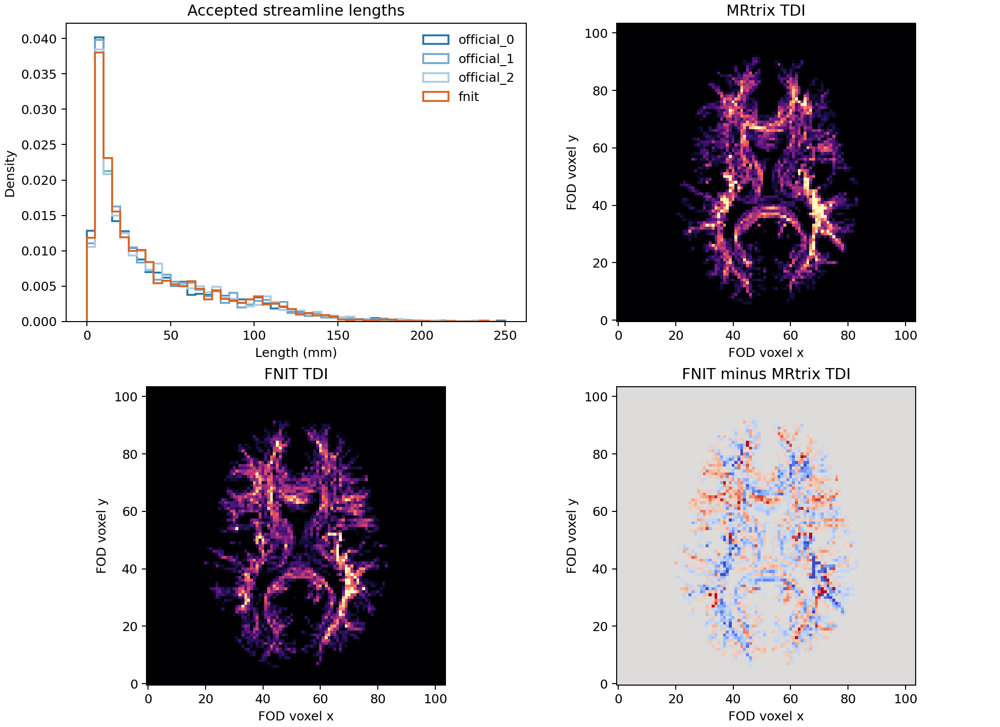

# iFOD2 拒绝采样与 ACT 状态：真实数据对照

## 输入与复现范围

使用公开 OpenNeuro ds004666 `sub-01/ses-2mm` 的已校正 DWI 所估计的归一化 WM FOD、配对 T1 分割生成的 5TT、10,000 个固定 GMWMI 位置、FA 和同一 20 节点 atlas。FOD、5TT、位置、FA、atlas 的 SHA-256 依次是 `32461e2e2281f60a15dfd546ad91129d7fe68582844c9d983a7602f23f7c59c6`、`32a27dabd9fa7e6094beafda8c90515642f733f1c245530b183846bf40cc5153`、`41f036eae125b83dd2b6fc7f3c916dd5da8c20915c2990df3f65cce8fb45ffe6`、`0899aa207d22fb700d00a1ae0625d77275df84e3f7a547039bc602b0da8a8692`、`eae3b729cfc0ad0fe5cfa0649381a5b656e2d3c1a66ce678afb2800407f706b0`。大体积影像留在验证服务器；本目录保存固定输入坐标、官方逐项参考、FNIT 指标、矩阵和示例图。

官方参考固定为 MRtrix3 源码提交 `eeab681d3e0cb004cf1d1d31579d3892197ef5b6`，对应追踪命令：

```bash
MRTRIX_RNG_SEED=0 tckgen wm_fod_norm.nii.gz official_tracks.tck \
  -algorithm iFOD2 -seed_gmwmi gmwmi.mif -act five_tissue.mif \
  -seeds 10000 -select 0 -maxlength 250 -cutoff 0.1 \
  -power 0.5 -samples 3
```

`-samples 3` 在官方内部表示起点、弧中点和终点，实际每步新产生两个采样点。官方没有直接输出每条候选圆弧的概率或 ACT 内部状态；[校准](../../../tools/reference/ifod2_calibration_oracle.cpp)、[拒绝采样](../../../tools/reference/ifod2_rejection_oracle.cpp)、[连续两弧](../../../tools/reference/ifod2_two_arc_oracle.cpp)与 [ACT 状态](../../../tools/reference/ifod2_act_state_oracle.cpp)的小程序调用原版类，仅开放观测值，均不进入 FNIT 运行时。补丁按[校准](../../../tools/reference/ifod2_calibration_access.patch)、[拒绝采样](../../../tools/reference/ifod2_rejection_access.patch)、[连续两弧](../../../tools/reference/ifod2_two_arc_access.patch)顺序应用到该源码提交。官方程序仅用于独立验证。

## 函数、输入和输出

| FNIT 函数 | 输入 | 输出 | 原软件对应步骤 |
|---|---|---|---|
| `_ifod2_calibration` | 偶数 `lmax`、弧长 `step_mm`、三个 FOD 体素边长几何平均 `voxel_mm`、最大转角度数、`power`、Torch 设备 | 局部校准方向 float32 `[K,3]`、拒绝上界乘数 float | `iFOD2::Calibrate` 和 `calibrate<iFOD2>` |
| `_rotate_ifod2_directions` | 单位当前方向 `[B,3]`、局部方向 `[B,K,3]` | 世界方向 `[B,K,3]` | `MethodBase::rotate_direction` |
| `_ifod2_arc_probability` | 世界毫米位置/当前方向 `[B,3]`、候选方向 `[B,K,3]`、跨步起点半对数概率 `[B]`、FOD `[XF,YF,ZF,C]`、5TT `[XA,YA,ZA,5]`、两个世界到体素变换 `[4,4]`、`lmax`/步长/截止值/幂次 | 概率 `[B,K]`、弧中点和终点各 `[B,K,3]`、两点 FOD 振幅各 `[B,K]` | `iFOD2::get_path` 和 `path_prob` |
| `_act_structural_step` | 已按 MRtrix 掩膜插值取得的 5TT 分数 `[B,5]`、皮层下灰质深度 int32 `[B]`、是否起于该灰质和是否已到白质 bool `[B]` | 终止代码、更新深度、更新白质标志、当前皮层下灰质标志，均 `[B]` | `ACT_Method_additions::check_structural` |
| `_grow` | 固定种子/方向 `[B,3]`、上述影像和逆变换、随机生成器、校准方向与乘数、追踪参数 | 填充路径 `[B,max_steps+1,3]`、实际点数 `[B]`、允许终止标志 `[B]`、长度 mm `[B]`、种子到白质要求标志 `[B]` | `iFOD2::next` 与 ACT 执行器；每弧最多尝试 1,000 个连续方向 |

正式入口仍为 `probabilistic_tractography(...)`；各图像可分别位于 FOD 和 5TT 网格，返回 `Tractogram`，其中 `paths` 为逐条变长世界毫米坐标、`endpoints` 为 `[T,2,3]`、`lengths_mm` 为 `[T]`、`accepted_seeds` 为 `[T,3]`、`seeds_attempted` 为整数。`fa=None` 时 `mean_fa=None`。详细输入输出及整链 CLI 见[中文函数文档](../../../docs/connectome/README.md)。以下示例完整给出变量名和每个参数：

```python
tracks = probabilistic_tractography(
    wm_sh=wm_sh,                              # 归一化 WM FOD；float32 [XF,YF,ZF,45]
    fod_affine=fod_affine,                    # FOD 体素中心至 RAS 毫米；[4,4]
    five_tissue=five_tissue,                  # cGM/sGM/WM/CSF/病理五通道；[XA,YA,ZA,5]
    five_tissue_affine=five_tissue_affine,    # 5TT 体素中心至 RAS 毫米；[4,4]
    gmwmi=gmwmi,                              # 5TT 网格上的播种权重；[XA,YA,ZA]
    n_seeds=10_000,                           # 尝试的种子数
    lmax=8,                                   # FOD 球谐最高阶，对应 45 个系数
    five_tissue_spacing_mm=(1.0, 1.0, 1.0),  # 5TT NIfTI 头文件三轴体素尺寸，毫米
    fa=None,                                  # 可选 FOD 网格 FA；正式均值另行精确采样
    seed=0,                                   # PyTorch 随机种子
    batch_size=8192,                          # 一次并行传播的种子数
    arc_proposals=16,                         # GPU 每轮并行候选数；不是每步尝试总数
    max_length_mm=250.0,                      # 最大长度，毫米
    min_length_mm=None,                       # None：FOD 几何平均体素尺寸的两倍
    step_mm=None,                             # None：FOD 几何平均体素尺寸的一半
    max_angle_degrees=45.0,                   # 单弧最大转角，度
    cutoff=0.1,                               # 弧中点和终点的 FOD 截止值
    power=0.5,                                # FOD 路径概率指数
)
```

本例 FOD 体素尺寸几何平均为 2.01279951 mm，默认弧长 1.00639975 mm，最短长度 4.02559902 mm。此前按最小轴 2 mm 计算的默认值已修正。默认 TF32；此阶段未采用 float16。

## 确定性核对

首先用同一真实 FOD 几何运行[校准脚本](../../../tools/benchmark_connectome_ifod2_calibration.py)。官方与 FNIT 均得到 7 个校准方向；方向分量最大误差 `2.55×10⁻¹⁰`，上界乘数为 `3.34099722` 与 `3.34097767`，绝对误差 `1.96×10⁻⁵`。[原始 JSON](ifod2_rejection_20260929/fnit_calibration.json)和[官方 7 方向](ifod2_rejection_20260929/official_calibration.txt)可复核。官方已载入图像的校准核心约 `0.0197 s`；FNIT H100 调用约 `1.225 s`，其中校准计算主要运行在 CPU。

[拒绝采样脚本](../../../tools/benchmark_connectome_ifod2_rejection.py)读取[80 条固定真实圆弧](ifod2_arc_cases.txt)，与[官方校准及候选概率](ifod2_rejection_20260929/official_rejection_80.txt)、[官方连续两弧结果](ifod2_rejection_20260929/official_two_arc_80.txt)对照。`--fod` 为真实 FOD NIfTI，`--cases` 每行 9 列（位置、当前方向、提议方向），`--official` 每行 4 列（有效、起点振幅、校准最大值、提议概率），`--official-two-arc` 每行 9 列（有效、两弧概率、两个终点），`--output` 指定 JSON 和同名 CSV，`--device` 选择计算设备。复跑命令：

```bash
python tools/benchmark_connectome_ifod2_rejection.py \
  --fod wm_fod_norm.nii.gz \
  --cases validation/connectome/ds004666/ifod2_arc_cases.txt \
  --official official_rejection_80.txt \
  --official-two-arc official_two_arc_80.txt \
  --output fnit_rejection_80.json --device cuda:0
```

| 真实固定输入 | 同输入结果 |
|---|---:|
| 80 条弧的起点振幅最大绝对误差 | `1.70×10⁻⁶` |
| 校准最大值最大绝对误差 | `1.45×10⁻⁵` |
| 提议概率最大绝对误差 | `1.58×10⁻⁶` |
| 正／零概率判定 | `80/80` 一致 |
| 第一弧正概率后连续两弧的第二弧概率最大误差 | `1.49×10⁻⁶`，共 52 条 |
| 连续两弧终点最大误差 | 第一弧 `1.90×10⁻⁶ mm`；第二弧 `1.87×10⁻⁶ mm` |

数据见[指标 JSON](ifod2_rejection_20260929/fnit_rejection_80.json)与[逐弧 CSV](ifod2_rejection_20260929/fnit_rejection_80.csv)。PyTorch H100 加载影像并完成核对约 `3.07 s`；官方已载入 FOD 的 80 条候选核心 `0.00247 s`，52 条连续两弧核心 `0.00101 s`。两侧计时边界不同，不据此计算加速比。

ACT 单独用 [300 个真实种子生成的固定世界坐标路径](ifod2_rejection_20260929/act_state_cases_300.txt)检查 12,600 个位置，路径制作程序为[`make_connectome_act_state_cases.py`](../../../tools/make_connectome_act_state_cases.py)。每组含种子、沿官方初始方向 20 个点、反向重置、反向 20 个点；位置根据真实种子和官方方向确定，不是模拟影像。[ACT 基准脚本](../../../tools/benchmark_connectome_act_state.py)的 `--five-tissue` 为真实 5TT、`--cases` 为 S/P/R 文本、`--official` 为[官方逐点状态](ifod2_rejection_20260929/official_act_state_300.txt)、`--output` 为 JSON、`--device` 为设备。终止代码、灰质深度、起点组织类别及到达白质状态四项均 `0/12,600` 处不一致；五组织分数最大绝对误差 `2.38×10⁻⁷`，见[ACT 指标](ifod2_rejection_20260929/fnit_act_state_300.json)。PyTorch H100 已载入影像后的核心约 `0.196 s`、Torch 峰值 `0.346 GiB`；官方 CPU 核心 `0.0266 s`。

## 独立追踪与连接矩阵

使用[四矩阵脚本](../../../tools/benchmark_connectome_ifod2_rejection_matrices.py)固定 10,000 个真实 GMWMI 位置，FNIT 与官方各用独立随机序列。脚本从 FOD 和 5TT 追踪后调用 FNIT SIFT2、FA 精确采样和端点赋值，写出 `count.csv`、`sift2_fbc.csv`、`mean_length.csv`、`mean_fa.csv` 与 `report.json`。四张矩阵均为对称的 `20×20` CSV，无表头，行列按同一 atlas 的连续标签排序。`--five-spacing` 是 5TT 头文件尺寸；`--official-dir` 可重复指定官方各次参考目录。旧版固定输入 3×3 基准与当前版本不可混作同一实现的重复结果。

已完成的 FNIT seed 0 尝试 10,000 次，ACT 允许 9,658 个种子，接受 2,713 条流线；三份官方参考 TCK 分别有 2,758、2,728、2,727 条。H100 已载入图像的追踪核心 `66.25 s`、SIFT2/FA/矩阵后处理 `34.90 s`、Torch 峰值 `2.176 GiB`。同一 FNIT 运行对三个官方参考的严格上三角结果如下；[矩阵与逐边报告](ifod2_rejection_20260929/matrices_rejection_act_seed0/report.json)保留所有数值：

| 指标 | 官方 seed 0 | 官方 seed 1 | 官方 seed 2 |
|---|---:|---:|---:|
| count 相对 L1 | 0.2417 | 0.2350 | 0.2723 |
| count 支持 Dice | 0.7778 | 0.7257 | 0.7458 |
| SIFT2 FBC 相对 L1 | 0.2429 | 0.2529 | 0.2880 |
| 共同边 mean length nMAE | 0.2127 | 0.2322 | 0.2987 |
| 共同边 mean FA nMAE | 0.0643 | 0.0783 | 0.0810 |

官方三次自身比较的范围：count 相对 L1 `0.2283–0.2583`、支持 Dice `0.7523–0.7899`、共同边 mean FA nMAE `0.0777–0.1014`。单次 FNIT seed 0 的部分指标进入该范围，仍有对官方 seed 2 的 count 误差及若干支持率超出。固定同一 TCK 后，SIFT2、FA 采样和 count 赋值在先前独立验证中已接近或达到逐值一致；本节剩余误差主要由独立流线群体造成，但不能仅凭单个种子排除组织边界、播种分布或配准的影响。

三次 FNIT 独立种子分别接受 `2,713/2,727/2,691` 条流线；H100 追踪核心 `66.25/69.96/72.20 s`、后处理 `34.90/35.76/34.19 s`，Torch 峰值均约 `2.176 GiB`。按[既有 3×3 比较程序](../../../tools/benchmark_connectome_rng_envelope.py)对三次官方、三次 FNIT 的所有配对使用相同指标，得到[完整 JSON](ifod2_rejection_20260929/rejection_act_3x3.json)和[四矩阵误差图](ifod2_rejection_20260929/rejection_act_3x3.png)。count 上三角相对 L1 官方自身 `0.2283–0.2583`、FNIT 自身 `0.2748–0.2951`、跨软件 `0.2300–0.2933`，跨软件 4/9 对在官方范围内。共同边 mean FA nMAE 官方自身 `0.0777–0.1014`、FNIT 自身 `0.0803–0.1035`、跨软件 `0.0643–0.1039`，跨软件 6/9 对在官方范围内；count 支持 Dice 跨软件 4/9 对在官方范围内。mean FA 的系统性偏差较旧采样器明显缩小，但 count、FBC 的重复波动和稀疏边支持仍未全面匹配。

参考流程的独立 `tckgen` 命令一次完整墙钟为 `16.90 s`，见[阶段计时](corrected_mrtrix_fs5tt_act_adapted/stage_times.tsv)。FNIT 上述 `66–72 s` 是已载入张量后的 H100 追踪核心；两侧设备和计时边界不同，但目前没有 GPU 提速证据。[另一次同空间输入的 100k 规模实验](tracking_scale_100k_20260929.md)测得 FNIT 819.68 s、Torch 峰值 0.973 GiB，仍明显慢于 MRtrix；100 万至 1,000 万次播种的总内存与用时尚未验证。

为定位差异，[轨迹群体对照](../../../tools/benchmark_connectome_tracking_population.py)另读三份官方真实 TCK 和 FNIT seed 0 的 TCK；FNIT seed 0 重跑的四张矩阵逐项保持相同。沿各轨迹折线计算的长度分布 KS 统计量：官方自身三对 `0.0190–0.0295`，FNIT 与官方三对 `0.0149–0.0271`。端点在世界毫米 8 mm 立方格的直方图相关性：官方自身 `0.3566–0.3853`，跨软件 `0.3654–0.3686`。DWI 网格 4×4×4 体素块（约 8 mm）的 TDI 相关性：官方自身 `0.8430–0.8651`，跨软件 `0.8597–0.8653`。这些粗尺度分布已与官方重复波动相近；原始单体素 TDI 在官方不同种子之间也几乎不相关，不能据此判断不同实现的系统误差。详见[轨迹分布 JSON](ifod2_rejection_20260929/track_population_seed0.json)和[长度及脑内 TDI 图](ifod2_rejection_20260929/track_population_seed0.png)。稀疏 atlas 边的 10,000 次播种仍需更高播种量和更多重复，才能区分尾部抽样差异与有限样本波动。



