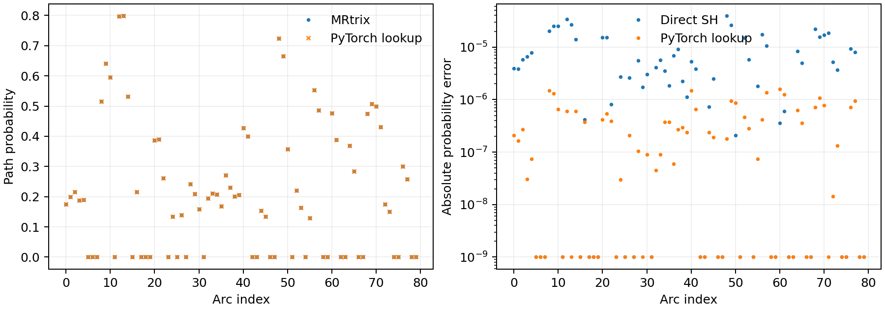

# iFOD2 单弧球谐函数对照：真实 ds004666

## 范围与输入

固定公开 ds004666 的校正 DWI 所估计的归一化 WM FOD，选取官方 TCK 中 20 个轨迹内部位置。每个位置配四个预先固定的终点方向，共 80 条圆弧。两臂读取同一 FOD、世界坐标、起点方向、候选终点方向、步长 1.00639975 mm、`samples=3`、`power=0.5` 和截止值 0.1。方向是外部固定的，因此本实验只检验**圆弧构造、FOD 插值、球谐函数求值与路径概率**，不检验候选方向随机采样、连续跨步状态或 ACT。

| 文件 | 用途 | SHA-256 |
|---|---|---|
| 服务器真实 `wm_fod_norm.nii.gz` | `[104,104,72,45]` float32 FOD；体积较大，不入库 | `32461e2e2281f60a15dfd546ad91129d7fe68582844c9d983a7602f23f7c59c6` |
| [ifod2_arc_cases.txt](ifod2_arc_cases.txt) | 80×9：世界毫米坐标、单位起点方向、单位终点方向 | `c104d129c89d23f5e2e9d3fc33b99555eebaaa85e72435bcd76877eed1482d1f` |
| [ifod2_arc_official.txt](ifod2_arc_official.txt) | 80×18：有效标志、步长、截止值、起点振幅、直接 SH 振幅、路径概率、两个采样点的位置与切向量 | `2c8c2d6ae77186e1b99f9f30a3205d68befecfb690f5607f1d559be098a99b74` |
| [real_ifod2_arc_ds004666.npz](../../../tests/connectome/data/real_ifod2_arc_ds004666.npz) | 测试所需的 80×3×45 真实 FOD 插值系数和官方概率；无原图像 | `ceb70dad84f0cfc6d1e59fbd8dea99a87916a0430ac78ffe7a43b3bfad164791` |

官方参考固定在 MRtrix3 源码提交 `eeab681d3e0cb004cf1d1d31579d3892197ef5b6`。基准用的 [C++ 程序](../../../tools/reference/ifod2_single_arc_oracle.cpp)和[最小接口补丁](../../../tools/reference/ifod2_single_arc_access.patch)只开放原 `iFOD2::get_path()` 与 `path_prob()` 的确定性调用；不重写官方计算。FNIT 运行时不编译或调用此程序。标准原软件的对应追踪命令为：

```bash
MRTRIX_RNG_SEED=0 tckgen wm_fod_norm.nii.gz official_tracks.tck \
  -algorithm iFOD2 -seed_gmwmi gmwmi.mif -act five_tissue.mif \
  -maxlength 250 -cutoff 0.1 -power 0.5 -samples 3 -select 0
```

单弧概率不能由标准 `tckgen` 直接输出，故采用上述仅增加观测接口的官方源码构建。已配置 MRtrix3 `eeab681` 源码后，复核命令如下：

```bash
patch -p1 < /path/to/Fudan-Neuroimaging-toolkit/tools/reference/ifod2_single_arc_access.patch
cp /path/to/Fudan-Neuroimaging-toolkit/tools/reference/ifod2_single_arc_oracle.cpp cmd/
NUMBER_OF_PROCESSORS=4 ./build bin/ifod2_single_arc_oracle
bin/ifod2_single_arc_oracle wm_fod_norm.nii.gz ifod2_arc_cases.txt > ifod2_arc_official.txt
```

## FNIT 函数与输出

`tracking_sh_precomputed(directions, lmax=8)` 位于 `fnit.connectome.fod`。`directions` 是 CPU/CUDA 上的 float32、末维为 3 的非零方向张量，形状为 `[...,3]`；函数内部归一化。`lmax` 是非负偶数，追踪默认 8。返回同设备 float32 实球谐函数张量 `[...,C]`，其中 `C=(lmax+1)(lmax+2)/2`；系数按偶数阶 `l`，再按 `m=-l...l` 排列。内部按 MRtrix iFOD2 的 512 个极角采样点建立可缓存的缔合勒让德表，并沿极角线性插值。公开 `probabilistic_tractography` 的初始方向评价和传播 FOD 评价调用此函数；当前传播采用连续方向的校准拒绝采样，每轮并行计算 16 个提案、每弧最多尝试 1,000 次。

```python
import torch
from fnit.connectome.fod import tracking_sh_precomputed

directions = torch.tensor([[1.0, 0.0, 0.0]], device="cuda:0", dtype=torch.float32)  # 输入：一条追踪方向，形状 [1,3]
basis = tracking_sh_precomputed(directions=directions, lmax=8)                    # 输入：方向与最高球谐阶；输出：同设备 [1,45] 球谐函数值
```

重跑 PyTorch 配对基准：

```bash
python tools/benchmark_connectome_ifod2_single_arc.py \
  --fod wm_fod_norm.nii.gz \
  --cases validation/connectome/ds004666/ifod2_arc_cases.txt \
  --reference validation/connectome/ds004666/ifod2_arc_official.txt \
  --output validation/connectome/ds004666/formal_gpu.json \
  --device cuda:0
```

`--fod` 是真实 FOD NIfTI；`--cases` 是 9 列固定圆弧；`--reference` 是 18 列官方结果；`--output` 指定指标 JSON，脚本另写同名 CSV（`official,direct_sh,mrtrix_lookup` 三列逐弧概率）；`--device` 选择 CPU 或 CUDA。CPU 同法改为 `--device cpu --output .../formal_cpu.json`。本实验输出仅是**单弧**诊断，不是连接矩阵。

## 同输入精度、时间与示例图

| 80 条固定圆弧 | 原直接 SH（CPU） | 查表（CPU） | 查表（H100） | MRtrix 官方 C++（CPU） |
|---|---:|---:|---:|---:|
| 起点 FOD 振幅最大绝对误差 | 3.92×10⁻⁵ | 1.73×10⁻⁶ | 1.70×10⁻⁶ | 参考值 |
| 路径概率最大绝对误差 | 3.94×10⁻⁵ | 1.64×10⁻⁶ | 1.58×10⁻⁶ | 参考值 |
| 正概率圆弧最大相对误差 | 6.87×10⁻⁵ | 3.69×10⁻⁶ | 3.69×10⁻⁶ | 参考值 |
| 正／零概率判定 | 80 / 80 一致 | 80 / 80 一致 | 80 / 80 一致 | 52 / 28 |
| 圆弧位置最大误差 | 3.83×10⁻⁶ mm | 3.83×10⁻⁶ mm | 3.83×10⁻⁶ mm | 参考值 |
| 预热后的计算核心用时 | 0.0069 s | 0.0335 s | 0.0108 s | 0.00113 s |

详细分位数、输入哈希、加载时间和显存见 [CPU JSON](formal_cpu.json)、[H100 JSON](formal_gpu.json)及[逐弧 GPU CSV](formal_gpu.csv)。H100 本实验 PyTorch 峰值分配 0.162 GiB；查表初始化单独计时 0.134 s。官方 C++ 独立进程完整墙钟约 0.80 s、最大 RSS 295,220 KiB，包含启动与 FOD 载入。80 条圆弧太少，且 CPU/GPU 运行于不同设备和共享机器；上述用时不构成追踪吞吐量或加速比证据。图由 [`plot_connectome_ifod2_single_arc.py`](../../../tools/plot_connectome_ifod2_single_arc.py)读取 [GPU CSV](formal_gpu.csv)生成：



## 当前追踪组合

球谐函数查表已用于当前的连续初始方向、校准拒绝采样及 ACT 实现。单弧的确定性精度不能代替随机轨迹和最终矩阵验收；同一真实 FOD/5TT 的三种子四矩阵结果见[当前追踪报告](ifod2_rejection_20260929.md)。

## 参考文献与原实现

- [iFOD2 原始方法](https://archive.ismrm.org/2010/1670.html)；[MRtrix3 方法论文](https://pubmed.ncbi.nlm.nih.gov/31473352/)；[原版 iFOD2 代码](https://github.com/MRtrix3/mrtrix3/blob/eeab681d3e0cb004cf1d1d31579d3892197ef5b6/src/dwi/tractography/algorithms/iFOD2.h)。
- [原 UKB-connectomics 代码库](https://github.com/sina-mansour/UKB-connectomics)。
