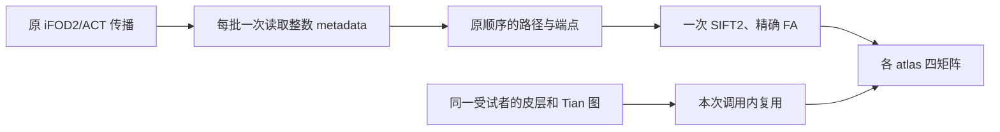

# UKBConnectome_pipeline：保持原 FNIT 数值的组件优化

[使用说明](../../../../docs/connectome/README.md) · [追踪与 FA 报告](tracking_and_fa.json) · [atlas 报告](atlas_reuse.json)

## 1. 优化范围

基线是 `main` 提交 `954ad19e29ddde8617eddf58ebafc3a4f72b8951`。输入为真实公开 OpenNeuro ds004666 `sub-01/ses-2mm` 的校正 DWI、配对 recon-all、FOD、5TT、GMWMI、FA 和已保存流线。报告记录输入与源码 SHA-256；没有用模拟影像代替 benchmark。

本次保留 float32、float64 累加和原 TF32 设置，只改变三个数据流环节：

1. **轨迹整理**：每批一次读取保留索引、正反向点数和单向标志，再按原顺序 slice/flip/cat。端点、长度和种子坐标批量 gather。随机采样、iFOD2/ACT、概率、阈值及逐轨 FA 运算不变。
2. **原点打包**：`_upsample_tracks(..., ratio=1)` 直接返回原点、轨迹编号与起点，省去没有实际插值的 Hermite 邻点构造和额外复制。SIFT2 的其他上采样倍率沿用原实现。
3. **多 atlas 复用**：在一次 pipeline 调用中缓存同一皮层图及节点表、同一 S1/S4 Tian 标签。缓存不会跨受试者或调用保存。七套 UKB 组合的 Tian 构造次数从 7 次降为 2 次；Glasser 皮层构造从 2 次降为 1 次。



## 2. 实际计时与显存

服务器为共享 H100 PCIe，单进程只使用一张 GPU。以下是同进程交错执行的组件中位墙钟时间；载入、哈希和一致性检查不计时。原版与优化版分别预热，轨迹整理和 FA 重复 5 次，atlas 组合按两个相反顺序重复。数据流优化自动生效，调用参数与输出结构见[主文档](../../../../docs/connectome/README.md)。

| 组件与真实输入 | 基线 | 优化后 | 结果 |
|---|---:|---:|---|
| 2,000 次播种所得 528 条轨迹的整理，两个 1,000 种子批次 | 313.93 ms | 4.69 ms | 坐标与相关量逐值一致；标量同步调用 1,163 → 0 |
| 27,401 条 TCK、1,117,273 点的 `ratio=1` 打包 | 25.95 ms | 22.60 ms | 点、轨迹编号、起点逐值一致 |
| 上述 TCK 完整精确 FA 采样 | 109.81 ms | 106.82 ms | 逐轨 FA 逐值一致；收益很小，重复时间区间重叠 |
| aparc、a2009s、Schaefer200 各配 Tian S1：构建、合并、DWI 标签和四矩阵 | 10.07 s | 5.63 s | 同一固定 SynthMorph 变换；Tian apply 3 → 1 次，标签与矩阵逐值一致 |

多 atlas 计时**不含网络配准、DWI 模型、追踪及 SIFT2**，这些前段用同一真实中间结果固定；Tian 重采样与皮层构建仍执行正式实现。现有 SynthMorph 的标签 apply 使用 PyTorch CPU 后端，此项缓存省去的是该重复工作。Glasser 没有在本次真实构建基准中调用 Workbench；七套组合的缓存编排由回归测试覆盖。

追踪/固定 TCK 实验的 CUDA 已分配/预留峰值为 **1.196/1.273 GB**；真实三 atlas 实验为 **2.544/2.938 GB**（十进制）。它们是本轮范围的 Torch 峰值，不包含完整 SynthMorph 网络配准，也不代表 1M/10M 播种的峰值。验证脚本设置 17 GB allocator 上限。

## 3. Profile：主要成本仍在哪里

在 2,000 次播种、两个 1,000 种子批次的基线中，四次 `_grow` 的 CUDA 事件区间合计 **62.56 s**；圆弧概率区间 **28.65 s / 3,195 次**，SH 计算 **13.03 s / 6,520 次**，5TT 采样 **9.75 s / 4,997 次**，FOD 采样 **7.54 s / 6,396 次**。这些区间嵌套、包含调度等待，不能相加，也不是纯 kernel 时长。完整带事件 profile 的基线为 69.29 s，未插桩候选为 58.13 s；两者不能用于宣称整段加速比。

下一轮优先检查 SH/FOD/组织采样的临时张量和调度、SIFT2 的 FMLS 分割及精确映射，随后是大规模路径存储与按块写盘。任何 kernel 融合或归约重排仍需逐值差分；不能只依据数学等价就称精度无损。已有 `compile_arc` 会在随机边界改变少量轨迹，本次没有通过启用编译核获得上述结果。

## 4. 精度与回归门槛

- **实际重新追踪**：同输入、同 seed=0，原版和优化版在两个批次共接受 528 条；每条路径、端点、长度、种子坐标与顺序均 `torch.equal`。
- **固定真实 TCK**：27,401 条轨迹的打包与精确 FA 完全相同；七套 atlas、共 28 张 count/FBC/mean length/mean FA 矩阵均 `torch.equal`。SIFT2 权重和长度使用同一保存文件，未重新优化 SIFT2。
- **真实 atlas 构建**：三套皮层+Tian S1 的所有标签、仿射、节点表、区域顺序和四矩阵均逐值一致，两次重复之间也一致。Tian、Schaefer 原模板已按项目清单校验大小与 SHA-256；固定 MNI T1 与原 warp 生成时所用模板同哈希。
- **回归**：`PYTHONPATH=src:. python -m pytest tests/connectome --import-mode=importlib -q`，**117 passed**。新增用例覆盖 CPU/CUDA、空轨迹、单/双向路径、可选 FA、非连续路径、原 view 语义，以及七 atlas 在 SynthMorph/FNIRT 两种编排下的缓存隔离。

这轮验证证明与当前 FNIT 保持一致；MRtrix 的独立随机轨迹分布仍由[三种子对照](../tracking_100k_three_seed_20260929.md)记录，长度、端点和 TDI 等尚未全面进入其重复范围。没有新增官方整链已匹配或 1M/10M 已验收的结论。

## 5. 复跑命令

先将固定基线放到 `BASELINE_DIRECTORY/src/fnit`，再使用最新版 FNIT。以下路径都应指向同一真实受试者：

```bash
BASELINE_DIRECTORY=/data/fnit_baseline_954ad19           # 固定旧源码
NORMALIZED_WM_FOD=/data/sub-01/wm_fod_norm.nii.gz        # float32 [X,Y,Z,45]
FIVE_TISSUE_IMAGE=/data/sub-01/five_tissue.nii.gz        # [A,B,C,5]，DWI 世界仿射
GMWMI_IMAGE=/data/sub-01/gmwmi.nii.gz                    # 同 5TT 网格
FA_IMAGE=/data/sub-01/fa.nii.gz                          # DWI 网格
FIXED_TCK=/data/sub-01/tracks.tck                       # 真实固定轨迹
TRACK_METRICS=/data/sub-01/track_metrics.npz             # 同 TCK 顺序的 weights/lengths/mean_fa
ATLAS_MANIFEST=/data/sub-01/atlases.tsv                  # name、NIfTI path、node count，tab 分隔
REPORT_DIRECTORY=/data/benchmark/connectome_lossless

python tools/benchmark_connectome_lossless.py \
  --baseline-root "$BASELINE_DIRECTORY" --baseline-commit 954ad19 \
  --fod "$NORMALIZED_WM_FOD" --five-tissue "$FIVE_TISSUE_IMAGE" \
  --gmwmi "$GMWMI_IMAGE" --fa "$FA_IMAGE" --tracks "$FIXED_TCK" \
  --atlas-manifest "$ATLAS_MANIFEST" --track-metrics "$TRACK_METRICS" \
  --n-seeds 2000 --batch-size 1000 --repeats 5 --device cuda:0 \
  --output "$REPORT_DIRECTORY/tracking_and_fa.json"
```

`--n-seeds`/`--batch-size` 控制重新追踪规模；`--repeats` 控制交错组件计时次数；`--baseline-commit` 仅记录版本，源码 SHA-256 另行保存。其余输入是图像、固定 TCK 与已计算的逐轨量；输出 JSON 包含计时、精确门槛、峰值和指纹。脚本不写影像或流线到仓库。

真实 atlas 复跑另提供校正 DWI、梯度、脑掩膜、结构目录与变换：

```bash
CORRECTED_DWI=/data/sub-01/corrected_dwi.nii.gz
BVALUES=/data/sub-01/dwi.bval
ROTATED_BVECTORS=/data/sub-01/eddy_rotated.bvec
DWI_BRAIN_MASK=/data/sub-01/brain_mask.nii.gz
RECON_ALL_SUBJECT=/data/freesurfer/sub-01
DWI_TO_T1_WORLD=/data/sub-01/dwi_to_t1_world.csv          # 4×4 RAS-mm，CSV/空格文本/npy
ATLAS_TEMPLATES=/data/atlas/ukb
FSAVERAGE=/data/freesurfer/fsaverage
MNI_T1=/data/templates/MNI152_T1_2mm.nii.gz
FIXED_SYNTHMORPH_WARP=/data/sub-01/mni_to_t1_fnit.nii.gz # 与该 MNI/T1 几何对应

python tools/benchmark_connectome_atlas_reuse.py \
  --baseline-root "$BASELINE_DIRECTORY" --dwi "$CORRECTED_DWI" \
  --bvals "$BVALUES" --bvecs "$ROTATED_BVECTORS" --brain-mask "$DWI_BRAIN_MASK" \
  --freesurfer-subject-dir "$RECON_ALL_SUBJECT" \
  --fod "$NORMALIZED_WM_FOD" --fa "$FA_IMAGE" --tracks "$FIXED_TCK" \
  --track-metrics "$TRACK_METRICS" --transform "$DWI_TO_T1_WORLD" \
  --atlas-templates-dir "$ATLAS_TEMPLATES" --fsaverage-dir "$FSAVERAGE" \
  --mni-template "$MNI_T1" --mni-to-t1-warp "$FIXED_SYNTHMORPH_WARP" \
  --repeats 2 --device cuda:0 --output "$REPORT_DIRECTORY/atlas_reuse.json"
```

默认比较上述三套 atlas；可重复 `--atlas` 选择原生或 Schaefer/Tian 组合。固定 warp 排除配准；省略 warp 时提供 `--synthmorph-weights`，或以 `--tian-fnirt-coeff` 替换 MNI 分支。它们执行对应正式子函数，计时范围随之变化，不应与本表直接比较。

## 6. 原软件对照与历史

本轮没有重跑 MRtrix；输出逐值保留，已有固定输入官方比较仍见[SIFT2](../sift2_mapping_stage.md)、[精确 FA](../tcksample_precise_stage.md)和[七 atlas 四矩阵](../seven_atlas_100k_20260929.md)。对应命令为 `tckgen -algorithm iFOD2 -act ... -seed_gmwmi ...`、`tcksift2`、`tcksample -precise -stat_tck mean` 与 `tck2connectome -symmetric -assignment_radial_search 4`，完整参数及脑图在上述报告。下图沿用同一真实数据的既有输入可视化：


最近历史：2026-09-29 完成 100k 与七模板随机/固定轨迹比较；2026-09-30 接入 BIDS 多模板流程；2026-10-02 完成本页三项无损数据流优化。旧报告保留其输入版本和计时边界，不能与本轮组件时间混算整链速度。

## 7. 参考代码

- [FNIT tracking](../../../../src/fnit/connectome/tracking.py)、[precise mapping](../../../../src/fnit/connectome/sift2_mapping.py)、[pipeline](../../../../src/fnit/connectome/pipeline.py)。
- [本轮追踪/FA 工具](../../../../tools/benchmark_connectome_lossless.py)、[atlas 工具](../../../../tools/benchmark_connectome_atlas_reuse.py)。
- [原 UKB-connectomics](https://github.com/sina-mansour/UKB-connectomics)、[MRtrix3](https://github.com/MRtrix3/mrtrix3)。论文及算法参考见[主文档参考文献](../../../../docs/connectome/README.md#7-参考文献与原实现)。
