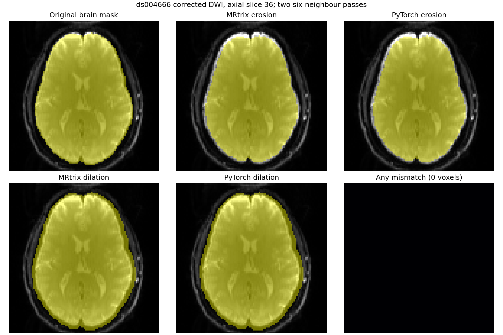

# 脑掩膜两次侵蚀／膨胀：真实 DWI 同输入对照

本阶段使用 [OpenNeuro ds004666](https://openneuro.org/datasets/ds004666) `sub-01/ses-2mm` 已校正 AP-DWI 网格上的真实 SynthSeg 脑掩膜，固定输入后单独比较 [`maskfilter_six_connected`](../../../src/fnit/connectome/masks.py) 与 MRtrix3 `maskfilter`。输入为 `bool[X,Y,Z]`，输出是相同形状、设备的布尔掩膜。函数使用中心点和六个面相邻体素，每次迭代把图像外视作零；UKB 脚本对 FOD 掩膜做两次膨胀，对归一化掩膜做两次侵蚀。

| 操作 | 原软件等价命令 | MRtrix 阳性体素 | PyTorch 阳性体素 | XOR 体素 | Dice |
|---|---|---:|---:|---:|---:|
| 侵蚀 | `maskfilter brain_mask.nii.gz erode eroded_2.nii.gz -npass 2` | 177,047 | 177,047 | **0** | **1.0** |
| 膨胀 | `maskfilter brain_mask.nii.gz dilate dilated_2.nii.gz -npass 2` | 242,212 | 242,212 | **0** | **1.0** |

输入大小 `104×104×72`，阳性体素 208,522。H100 GPU0 的已载入张量核心计算侵蚀 0.0195 秒、膨胀 0.000765 秒，峰值 Torch 分配显存 0.00435 GiB；CPU 核心计算分别为 0.175 秒和 0.0582 秒。MRtrix 3.0.3 的独立进程墙钟分别为 0.28 秒和 0.06 秒（`/usr/bin/time -f %e`，含 NIfTI 解压/写盘）；计时边界不同。输入及参考文件 SHA-256、CPU/GPU 指标见[机器可读报告](maskfilter_real.public.json)。整个函数只做布尔计算，不涉及 TF32 或半精度。



复现候选计算及逐体素对照：

```bash
python tools/benchmark_connectome_maskfilter.py \
  --brain-mask brain_mask.nii.gz \
  --reference-eroded eroded_2.nii.gz \
  --reference-dilated dilated_2.nii.gz \
  --device cuda:0 --output maskfilter_real.json
```

基准脚本通过 nibabel 载入文件并检查空间网格；计时只覆盖 PyTorch 核心计算。该阶段的固定掩膜来自公开数据适配流程；原 UKB 脚本的上游 BET 掩膜生成仍需单独对照。掩膜逐体素一致本身不代表最终连接矩阵一致。
