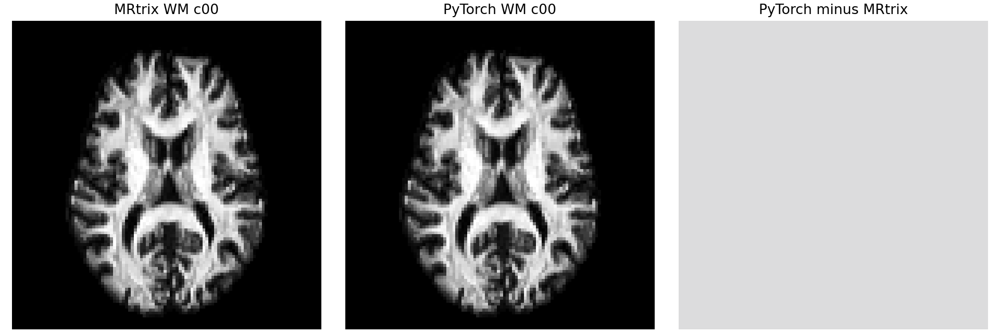

# 三组织 FOD 强度归一化：同输入对照

本阶段固定 [OpenNeuro ds004666](https://openneuro.org/datasets/ds004666) `sub-01/ses-2mm` 已校正 AP-DWI 的 **同一组** MRtrix 原始 MSMT-CSD WM/GM/CSF 图和侵蚀脑掩膜，只比较 `mtnormalise`。PyTorch 实现为 [`normalise_mrtrix_three_tissue`](../../../src/fnit/connectome/mtnormalise.py)；输入文件及官方输出的 SHA-256、完整指标见[机器可读报告](mtnormalise_gpu.public.json)。这项对照不把先前 raw FOD 解算差异混入归一化误差。

| 函数输入 | 函数输出 | 对应原命令 |
|---|---|---|
| float32 WM SH `[X,Y,Z,C]`（第 0 通道为 DC 系数）、GM/CSF `[X,Y,Z]`、bool mask `[X,Y,Z]`、体素到 RAS 的 `4×4` affine；张量同设备 | `MTNormaliseResult`：归一化 WM `[X,Y,Z,C]`、GM/CSF `[X,Y,Z]`、全网格 bias field `[X,Y,Z]`，均 float32；最终 outlier mask 为 bool `[X,Y,Z]`，组织 balance factors 为 float64 `[3]` | `mtnormalise wm_fod.mif wm_fod_norm.mif gm.mif gm_norm.mif csf.mif csf_norm.mif -mask brain_mask_eroded_2.nii.gz`。采用官方默认三阶多项式、15 轮主迭代、至多 7 轮组织平衡及 0.28209479177 参考值。 |

真实图像大小 `104×104×72`，WM 有 45 个 SH 通道，掩膜 177,047 体素。PyTorch 的最终接受掩膜有 167,876 体素；在掩膜内逐元素比较：

| 输出 | 比较元素 | Pearson r | MAE | 最大绝对误差 |
|---|---:|---:|---:|---:|
| WM SH | 7,967,115 | 1.000000 | 4.79e−10 | 5.96e−8 |
| GM | 177,047 | ≈1 | 1.30e−9 | 5.96e−8 |
| CSF | 177,047 | 1.000000 | 4.03e−10 | 2.98e−8 |

PyTorch 2.5.1 在 H100 GPU0 的**已载入张量核心计算**耗时 0.568 秒，Torch 峰值已分配显存 0.467 GiB；MRtrix 参考独立进程的 `mtnormalise` 墙钟为 2.41 秒，包含进程和文件 I/O。两者计时边界不同。计算使用 float32 图像、float64 拟合，CUDA 允许 TF32，没有使用 float16/bfloat16。



图由同一真实 WM FOD 的中间轴位切面生成；右图用一致的固定差值色标，肉眼无明显差异。定量误差以全脑表格为准。

## 重跑

先用 `mrconvert` 将上述官方 `.mif` 原始与归一化 WM/GM/CSF 逐一转为不重采样的 NIfTI，再运行：

```bash
python tools/benchmark_connectome_mtnormalise.py \
  --wm wm_fod.nii.gz --gm gm.nii.gz --csf csf.nii.gz \
  --wm-ref wm_fod_norm.nii.gz --gm-ref gm_norm.nii.gz \
  --csf-ref csf_norm.nii.gz --mask brain_mask_eroded_2.nii.gz \
  --device cuda:0 --output mtnormalise.json \
  --example-png mtnormalise_example.png
```

脚本通过 nibabel 核查全部 affine 与维度，接受 MRtrix 将标量组织图导出为 `[X,Y,Z,1]`，报告实际输入哈希、数值、时间和 Torch 显存。图像使用主页 Conda 环境的 matplotlib。此阶段通过后，仍需把独立响应、原始 FOD、归一化、追踪和 SIFT2 接入一次真实端到端运行，才能评价最终连接矩阵。
