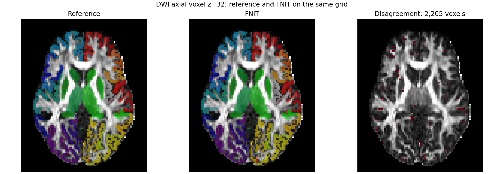

# DWI→T1 配准对真实结构连接矩阵的影响

## 输入与做法

公开 ds004666 的校正 DWI 对应 WM FOD、FA、官方 `recon-all` 5TT 和 `aparc+aseg.mgz` 保持一致；10,000 个播种点及随机种子固定。先把同一批播种点定位在 T1 解剖世界坐标，再分别用 FSL FLIRT 和 FNIT TorchFLIRT 的 4×4 DWI→T1 世界变换映射回 DWI 世界。两臂各自重采样 84 节点 atlas、执行 ACT/iFOD2、SIFT2 和四矩阵赋值。完整输入哈希、矩阵 CSV、时间和显存见[机器报告](registration_sensitivity_20260929/fixed_t1_10k_fixed_tracks/report.json)及同目录文件。

FSL 参考配准的等价命令为 `flirt -in mean_b0_brain.nii.gz -ref brain.mgz -dof 6 -cost normmi -omat diff2struct.mat`；FNIT 用 `TorchFLIRT(device="cuda:0", dof=6, cost="normmi")`。两份已测世界变换来自相同的公开 T1/b0，具体变换和几何检查见[前期解剖报告](ANATOMY_STAGE_20260927.md)。本实验从这两份固定变换开始，不重新计入配准求解时间。

| 指标 | FSL 变换 | TorchFLIRT 变换 |
|---|---:|---:|
| ACT 可用种子 | 9,659 | 9,642 |
| 接受流线 | 2,706 | 2,663 |
| 追踪核心时间 | 66.93 s | 59.13 s |
| SIFT2、FA、矩阵时间 | 34.59 s | 31.29 s |
| PyTorch 峰值分配显存 | 2.303 GiB | 2.306 GiB |

解剖坐标相同的种子在两臂 DWI 世界坐标间平均移动 0.0534 mm。重采样 atlas 的 778,752 个 DWI 体素中，2,205 个标签不同。四矩阵 TorchFLIRT 对 FSL 变换的上三角结果如下：

| 矩阵 | Pearson r | 相对 L1 | 共同边归一化 MAE | 非零支持 Dice |
|---|---:|---:|---:|---:|
| count | 0.8562 | 0.6843 | 0.4305 | 0.6613 |
| SIFT2 FBC | 0.8350 | 0.7099 | 0.4693 | 0.6613 |
| mean length | 0.3935 | 1.0511 | 0.2328 | 0.6613 |
| mean FA | 0.5567 | 0.7789 | 0.0911 | 0.6613 |

这里虽固定同一批 T1 播种位置和随机数种子，两份配准会改变 ACT 采样、传播路径及接受流线集合，因此上表是**整条下游链对配准的敏感性**，不能只归因于 atlas 重采样。共享 GPU 负载随时变化，两臂墙钟只说明本次实测条件。

把 FSL 配准臂产生的 **同一批 2,706 条流线**及其 SIFT2 权重、长度、沿程 FA 全部固定，仅将端点指派图谱换成 TorchFLIRT 重采样 atlas 后，差异大幅缩小：

| 固定流线和标量，仅更换 atlas | Pearson r | 相对 L1 | 共同边归一化 MAE | 支持 Dice |
|---|---:|---:|---:|---:|
| count | 0.9986 | 0.0157 | 0.0143 | 0.9980 |
| SIFT2 FBC | 0.9978 | 0.0171 | 0.0143 | 0.9980 |
| mean length | 0.9995 | 0.0037 | 0.0024 | 0.9980 |
| mean FA | 0.9984 | 0.0043 | 0.0014 | 0.9980 |

因此在本受试者、此 atlas 和播种量下，0.187 mm 量级的配准差异对**固定轨迹的节点指派**影响小；两臂独立重跑后出现的大矩阵差异主要伴随随机轨迹群体变化。这个结论只涵盖本例，尚未证明所有 atlas 或 10M 播种下的误差范围。

复跑入口为 `tools/benchmark_connectome_registration_sensitivity.py`。参数 `--fod`、`--five-tissue-t1`、`--aparc-aseg`、`--seeds`、`--fa`、`--registration-report` 分别是同一 DWI 的归一化 FOD、原生 T1 5TT、FreeSurfer 分割、世界坐标种子、FA 图和两份世界变换；`--n-seeds` 选择冻结种子数，`--seed` 固定 FNIT 采样序列，`--device` 指定计算设备，`--output-dir` 保存两臂四矩阵和报告。
