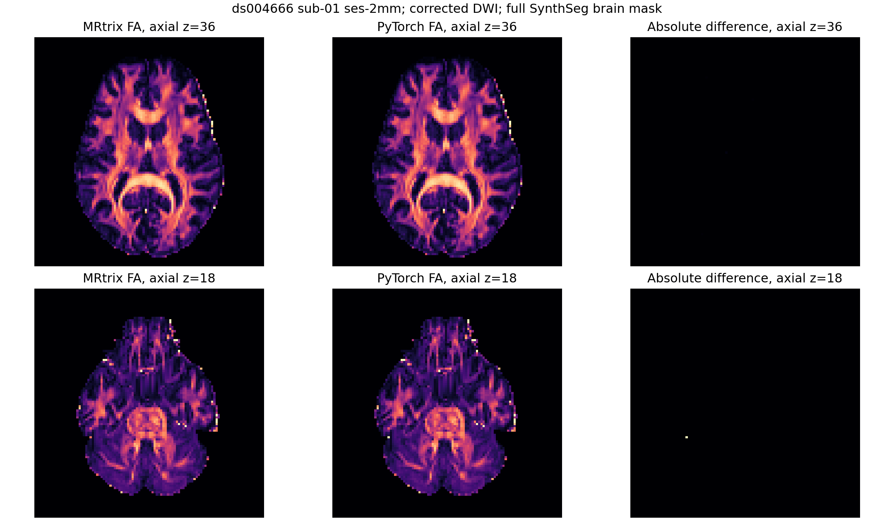

# 公开真实 DWI：Dhollander 响应与 FOD 同输入对照

## 输入与范围

输入是 OpenNeuro ds004666 的 TOPUP/EDDY 校正后 AP DWI，`float32 [104,104,72,105]`。官方 MRtrix 与 FNIT 使用同一份导出的梯度、配准到 DWI 的 SynthSeg 脑掩膜和固定响应文件。`nibabel` 将掩膜轴向重排到 DWI 网格，并验证仿射；残差上限为 `1.63e−6 mm`。同输入文件的哈希存于各公开 JSON。官方命令见[命令记录](corrected_mrtrix_commands.public.txt)。下表比较的是 **mtnormalise 前**的原始 FOD，归一化另有独立验证。

当前 `fod.py` 将设计矩阵决定的 Gram、Cholesky 和约束投影每次拟合只计算一次，各批复用；每体素 ICLS active-set 更新未改。缓存前后在相同 CPU 和真实 DWI 上，完整 Dhollander 的 WM/GM/CSF 响应候选值及 11 个掩膜逐值一致。缓存版 `fit_mrtrix_msmt_csd` 全脑在 H100 上重新运行；旧版批大小与计时记录已移除。GPU 运行默认 TF32，信号用 float32、约束求解用 float64，不使用 float16。

## 函数输入和输出

| FNIT 函数 | 输入 → 输出结构 | 对应 MRtrix 步骤 |
|---|---|---|
| `mrtrix_shell_centres` | 梯度 `[N,4]` → 原始 shell 均值、选择标签、响应文件标签 `[S]` 和体积数 `[S]` | `mrinfo -shell_bvalues -shell_sizes` 及 Dhollander 标签转换 |
| `prepare_mrtrix_dhollander_sdm` | DWI、梯度、shell、布尔脑掩膜 → 腐蚀/安全布尔掩膜与 float32 SDM `[X,Y,Z]` | `maskfilter erode -npass 3`、shell 平均与 SDM |
| `fit_mrtrix_dhollander_tensor` | DWI、梯度、布尔掩膜 → FA `[X,Y,Z]` 与主方向 `[X,Y,Z,3]` | `dwi2tensor`、`tensor2metric -fa -vector` |
| `segment_mrtrix_dhollander` | FA、SDM、安全掩膜 → 8 张 `[X,Y,Z]` 组织选择掩膜 | Dhollander 阈值、细化和选择阶段 |
| `fit_mrtrix_two_tissue_csd` | DWI、梯度、WM/CSF 响应、掩膜、`lmax=2/6`、批大小 → WM SH `[X,Y,Z,6/28]` 与 CSF `[X,Y,Z]`，均 float32 | Dhollander 内部 `dwi2fod msmt_csd -lmax 2,0` / `6,0` |
| `mrtrix_fod_peak_amplitude` | WM SH `[V,6/28]`、`lmax=2/6` → 最大峰幅 `[V]` float64 | `sh2peaks -num 1`、`peaks2amp` |
| `select_mrtrix_single_fibre_wm` | DWI、梯度、细化 WM 掩膜与 CSF 响应 → 经验 WM 响应、两张峰指标图及两张选择掩膜 | Dhollander 两阶段单纤维选择 |
| `estimate_mrtrix_selected_response` | DWI、梯度、shell、选择掩膜和所需 WM 方向 → WM `[S,6]` 或各向同性响应 `[S,1]`，float64 | `amp2response` |
| `estimate_mrtrix_dhollander` | DWI、梯度、shell、脑掩膜 → shell、WM/GM/CSF 响应和掩膜/FA/SDM/峰图字典 | `dwi2response dhollander` 完整阶段 |
| `fit_mrtrix_msmt_csd` | DWI、梯度、shell、三组织固定响应、布尔掩膜、批大小 → WM SH `[X,Y,Z,45]` 与 GM/CSF `[X,Y,Z]`，均 float32 | `dwi2fod msmt_csd`，默认 WM `lmax=8` |

FNIT 的三组织 FOD 用法如下，参数全部具名：

```python
from fnit.connectome.fod import fit_mrtrix_msmt_csd

wm_fod, gm_fod, csf_fod = fit_mrtrix_msmt_csd(
    signal=dwi,                 # 输入：float32 [X,Y,Z,N]，原始 DWI 幅度
    grad_mrtrix=gradient,      # 输入：[N,4]，MRtrix 导出的方向及 b 值
    shell_bvals=shells,        # 输入：[S]，响应文件 Shells 标签
    wm_response=wm_response,   # 输入：[S,>=5]，WM 偶数阶 zonal 系数
    gm_response=gm_response,   # 输入：[S]，各向同性 GM 响应
    csf_response=csf_response, # 输入：[S]，各向同性 CSF 响应
    mask=brain_mask,           # 输入：DWI 网格的布尔脑掩膜 [X,Y,Z]
    batch_size=4096,           # 每批最多求解的脑体素数
)
```

`wm_fod` 为 MRtrix SH 顺序的 45 通道 WM 系数，`gm_fod` 与 `csf_fod` 为各一个组织幅度图；输出在 `signal.device`，掩膜外为零。输入图像的 affine 对齐由调用方检查；梯度方向保持 MRtrix 导出时的坐标框架。对应官方命令为：

```bash
dwi2fod msmt_csd corrected.mif wm.txt wm_fod.mif gm.txt gm.mif csf.txt csf.mif -mask brain_mask.mif
```

内部两组织函数的参数同样全部具名：

```python
from fnit.connectome.fod import fit_mrtrix_two_tissue_csd

wm_sh, csf_map = fit_mrtrix_two_tissue_csd(
    signal=dwi,                # 输入：float32 [X,Y,Z,N]，原始 DWI 幅度
    grad_mrtrix=gradient,     # 输入：[N,4]，MRtrix 方向与 b 值
    shell_bvals=shells,       # 输入：[S]，响应文件 shell 标签
    wm_response=wm_response,  # 输入：[S,>=2]，WM zonal 系数
    csf_response=csf_response,# 输入：[S]，CSF 各向同性响应
    mask=refined_wm_mask,     # 输入：DWI 网格的布尔选择掩膜
    lmax=2,                   # WM 最高 SH 阶；也支持 6
    batch_size=4096,          # 每批最多求解的体素数
)
```

`lmax=2` 返回 6 个 WM SH 系数，`lmax=6` 返回 28 个；两张输出均为原 DWI 网格上的 float32，掩膜外为零。对应官方 `dwi2fod msmt_csd` 命令另加 `-lmax 2,0` 或 `-lmax 6,0`，掩膜分别为细化 WM 与细化单纤维 WM。

## 实数据精度、时间与显存

FNIT 的时间从图像已载入后的函数调用开始，包含同步的 GPU 计算；MRtrix 墙钟含命令启动和读写。设备与范围不同，不能当作等硬件加速比。表中两组织和完整响应是**当前源码在 nodecw10 CPU 的新运行**；H100 运行时公开两组织脚本在数据装载阶段异常 CUDA OOM，没有产生可用的当前版 GPU 计时。三组织全脑 GPU 运行成功。

| 阶段 | 同输入数值结果 | FNIT 当前版时间 / 显存 | MRtrix 墙钟 |
|---|---|---:|---:|
| Shell 标签 | 原始均值、选择标签和响应文件标签一致；[记录](response_fod_shells.public.json) | CPU 0.0067 s | `mrinfo` 0.559 s |
| 腐蚀 + SDM | 腐蚀/安全掩膜 XOR 0；SDM MAE `6.68e−8`、最大 `7.15e−7`；[记录](response_fod_sdm.public.json) | GPU 0.308 s / 0.60 GiB | `maskfilter` 0.25 s |
| 固定掩膜张量 FA + 方向 | 162,569 个 FA 值 MAE `1.94e−11`，主方向最小反向等价余弦 `0.9999999999995`；[记录](response_fod_tensor.public.json) | CPU 5.315 s；GPU 0.665 s / 0.72 GiB | `dwi2tensor` 0.74 s + `tensor2metric` 0.05 s |
| 组织选择 | 八张掩膜 XOR 0；最终 GM 812、CSF 410 体素；[记录](response_fod_selection.public.json) | GPU 0.908 s / 0.037 GiB | 包含在完整响应命令中 |
| 两次内部 CSD | `lmax=2`：530,946 个 WM SH 值和 CSF 逐值一致；`lmax=6`：24,752 个 WM SH 值和 CSF 逐值一致；[当前版记录](response_fod_two_tissue.public.json) | CPU 1.352 / 0.249 s；无 CUDA 分配 | 包含在完整响应命令中 |
| 峰幅 | `lmax=2/6` MAE `3.72e−8/1.04e−7`；两次选择掩膜 XOR 0；[记录](response_fod_peaks.public.json) | GPU 0.187 / 0.512 s | 包含在完整响应命令中 |
| 已选体素响应回归 | WM 最大误差 `1.46e−11`，GM/CSF MAE `9.82e−11/6.12e−12`；[记录](response_fod_selected.public.json) | GPU 0.601/0.022/0.044 s | 官方三次 `amp2response` 0.11/0.05/0.04 s |
| 完整 Dhollander 响应 | 11/11 掩膜 XOR 0；WM/GM/CSF 响应最大误差 `3.89e−9/9.06e−10/1.24e−10`；[当前版记录](response_fod_dhollander.public.json) | CPU 3.748 s；无 CUDA 分配 | 17.01 s |
| 全脑 FA | 208,522 掩膜体素中 85 个全非正信号体素双方为 NaN；其余有限体素存在一个病态低信号离群点；[GPU 记录](response_fod_full_fa.public.json) | GPU 0.702–1.081 s / 0.724 GiB | `dwi2tensor` 0.74 s + `tensor2metric` 0.05 s |
| 全脑固定响应原始 MSMT-CSD | 208,522 体素、9,383,490 个 WM SH 值，MAE `1.976e−12`、最大 `1.205e−6`；GM 最大 `1.49e−8`，CSF 最大 `2.33e−10`，全部值误差 `≤1e−5`；[当前版记录](response_fod_full.public.json) | H100 GPU 267.419 s / 1.253 GiB；`batch_size=4096` | 185.51 s |

公开脑图展示同一校正 DWI 上的 b0、官方及 FNIT 的 WM `c00`、绝对差，以及 FA 图。缓存仅调整设计相关计算的位置，已在同 CPU 原版/当前版比较中确认响应和掩膜逐值一致。当前版 FOD 切片图在 nodecw10 CPU 重新生成：4,767 个体素的 `c00` MAE `3.92e−15`、最大 `1.46e−11`，函数调用 `79.221 s`；见[图像数值](response_fod_example.public.json)。图像取自公开 DWI，与全脑 H100 计时范围不同。




## 复现边界

使用 [`benchmark_connectome_response_fod.py`](../../../tools/benchmark_connectome_response_fod.py) 指定 `--dwi`（NIfTI DWI）、`--grad`（MRtrix 四列梯度）、`--wm-response`/`--gm-response`/`--csf-response`（带 Shells 的响应文本）、`--mask`（脑掩膜）、`--ref-wm`/`--ref-gm`/`--ref-csf`（独立官方 FOD）、`--device`、`--batch-size 4096` 和 `--out`（JSON）。官方参考由 `dwi2fod msmt_csd` 独立生成，FNIT 包运行时不调用 MRtrix。完整响应和两组织比较分别使用 `benchmark_connectome_response_fod_dhollander.py` 与 `benchmark_connectome_response_fod_two_tissue.py`。本阶段的 FOD 一致性不代替后续纤维追踪、SIFT2 和连接矩阵一致性。
