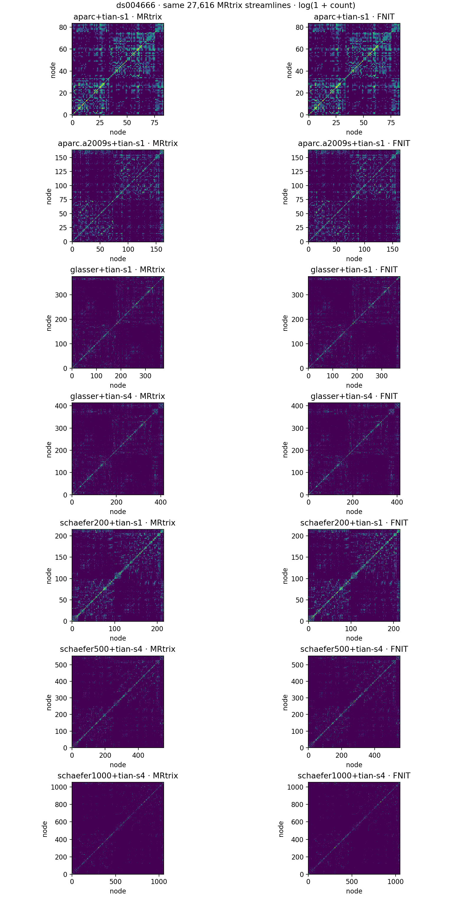
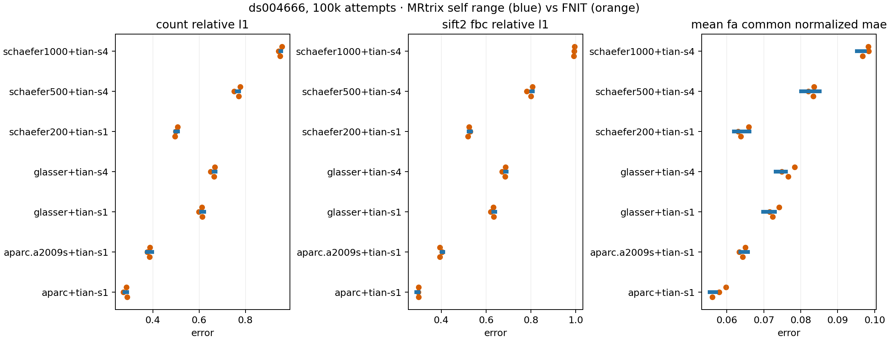

# 七套原 UKB 图谱的真实 100k 连接矩阵

## 输入和比较边界

公开 OpenNeuro ds004666 `sub-01/ses-2mm` 的校正 DWI、已完成的官方 `recon-all`、原 UKB 七套皮层模板和 Tian S1/S4 模板是本次输入。七张 DWI 图谱来自 FNIT 的体积构造，分别有 84、164、376、414、216、554、1054 个节点；每张图谱的 SHA-256、节点表和生成精度见[图谱报告](atlas_native_aparc_20260929.md)、[Schaefer 报告](atlas_schaefer_multi_20260929.md)、[Glasser 报告](atlas_glasser_20260929.md)。皮层标签已与原脚本逐体素核对；Tian 此处采用用户指定的 SynthMorph，因此与原 UKB FNIRT 标签有差异，见[配准报告](atlas_synthmorph_20260929.md)。两臂矩阵比较使用**同一张** FNIT 生成的 atlas，检验的是追踪后矩阵数值和随机轨迹差异，不能视为原 UKB 解剖整链已一致。

两层对照分别固定与放开追踪：

1. 固定同一份 MRtrix 100k TCK（27,616 条）、同一份 MRtrix SIFT2 权重、逐轨长度和 FA，以及同一张 DWI atlas；FNIT `build_connectomes` 与 MRtrix `tck2connectome` 逐矩阵比较。这一层隔离矩阵赋值误差。
2. MRtrix 独立 RNG 0、1、2 与 FNIT 独立 RNG 0 各进行 100k 次 GMWMI 播种，使用同一归一化 FOD、5TT、GMWMI、FA 和 atlas。FNIT 的 27,401 条流线重新运行 FNIT SIFT2、精确 FA 采样，再把逐轨结果复用到七套 atlas。三份 MRtrix 输出构成此次观察到的随机范围；只有一份 FNIT 100k 重复，不能推断 FNIT 自身的范围。[完整追踪时间、输入哈希和群体差异](tracking_100k_matrices_20260929.md)另列。

## 脚本接口、输入和输出

七行制表符分隔的 `atlas_manifest.tsv` 每行是 `profile<TAB>atlas_dwi.nii.gz<TAB>node_count`。`atlas_dwi.nii.gz` 是 3D 非负整数标签，标签 1 对应矩阵首行；`node_count` 包含在 DWI 降采样后失去体素的 Glasser 极小节点，使矩阵仍保持 376/414 维。各图谱的 [`nodes.tsv`](seven_atlas_fixed_tck_20260929/node_tables/) 中 `index`、`original_label`、`hemisphere`、`name` 定义每一行列；七个具体节点表均已保存。

官方固定 TCK [参考脚本](../../../tools/reference/benchmark_connectome_seven_atlas_fixed_tck_official.sh)的八个输入及输出：

```bash
reference_args=(
  "$MRTRIX_BIN"       # 独立 MRtrix3 eeab681 的 bin 目录；只在基准中调用
  "$TCK"              # 真实 100k TCK，世界毫米流线
  "$WEIGHTS"          # 与 TCK 同序的 MRtrix SIFT2 逐流线权重
  "$LENGTHS"          # 与 TCK 同序的 MRtrix tckstats 长度，单位 mm
  "$FA_VALUES"        # 与 TCK 同序的 MRtrix tcksample -precise 平均 FA
  "$ATLAS_MANIFEST"   # 七行图谱路径及节点数
  "$REFERENCE_OUTPUT" # 每套图谱的四张无表头 CSV、时间、日志与哈希
  8                   # 参考命令的 CPU 线程数
)
bash tools/reference/benchmark_connectome_seven_atlas_fixed_tck_official.sh "${reference_args[@]}"
```

每套的等价原版矩阵命令为 `tck2connectome -symmetric -assignment_radial_search 4 TCK ATLAS count.csv`；其余三张分别增加 `-tck_weights_in WEIGHTS`，平均长度/FA 再增加 `-scale_file LENGTHS/FA_VALUES -stat_edge mean`。四张 CSV 依次是流线计数、SIFT2 FBC、加权平均长度（mm）、加权平均 FA。参考脚本独立运行，不是 FNIT 正式依赖。

FNIT [固定轨迹脚本](../../../tools/benchmark_connectome_seven_atlas_fixed_tck.py)使用相同五个输入：

```bash
fixed_args=(
  --tracks "$TCK"                    # 与官方完全相同的 TCK
  --weights "$WEIGHTS"              # 与官方完全相同的逐轨权重
  --lengths "$LENGTHS"              # 与官方完全相同的逐轨长度
  --fa "$FA_VALUES"                 # 与官方完全相同的逐轨 FA
  --atlas-manifest "$ATLAS_MANIFEST" # 七张相同的 DWI atlas 和节点数
  --reference-root "$REFERENCE_OUTPUT" # 官方七套 CSV 的父目录
  --output-dir "$FIXED_OUTPUT"      # 各套压缩 NPZ 和 report.json
  --device cuda:0                    # H100；PyTorch 默认 TF32，未用半精度
)
python tools/benchmark_connectome_seven_atlas_fixed_tck.py "${fixed_args[@]}"
```

FNIT [独立轨迹脚本](../../../tools/benchmark_connectome_seven_atlas_native_tck.py)输入同一真实 FOD/5TT/FA，以自身 TCK 一次求 SIFT2、逐轨长度/FA，再生成七套矩阵：

```bash
native_args=(
  --tracks "$FNIT_TCK"              # FNIT seed 0 的 100k 播种输出
  --fod "$FOD_NIFTI"                # 双方同哈希的归一化 lmax=8 WM FOD
  --five-tissue "$FIVE_NIFTI"       # 双方同哈希的 ACT 五组织图
  --fa "$FA_NIFTI"                  # 双方同哈希的 DWI FA
  --atlas-manifest "$ATLAS_MANIFEST" # 相同七张 DWI atlas 与节点数
  --output-dir "$NATIVE_OUTPUT"     # 七套矩阵、逐轨数值与计时 JSON
  --device cuda:0                    # H100，默认 TF32
)
python tools/benchmark_connectome_seven_atlas_native_tck.py "${native_args[@]}"
```

两类每套 `.npz` 都是对称的 K×K 数组；固定轨迹文件键为 `fnit_count`、`official_count` 等八个数组，独立追踪文件键为 `count`、`sift2_fbc`、`mean_length`、`mean_fa`。`track_metrics.npz` 另存 FNIT 逐轨 `weights`、`lengths`、`mean_fa`。`report.json` 记录输入/atlas 哈希、运行时间、显存和赋值条数；[随机范围脚本](../../../tools/benchmark_connectome_seven_atlas_envelope.py)以 `--official` 接三套参考目录、`--fnit` 接独立 FNIT 目录、`--output`/`--figure` 写 JSON 和图。此处的七套[固定轨迹原始矩阵](seven_atlas_fixed_tck_20260929/)与[独立轨迹原始矩阵](seven_atlas_native_tck_20260929/)均已入库；TCK、FOD、5TT 和 atlas NIfTI 留在验证服务器，JSON 保存 SHA-256。

## 固定轨迹：七套矩阵数值与时间

| atlas | 节点 | count 不同单元 | FBC 最大绝对误差 | 长度最大绝对误差/mm | FA 最大绝对误差 | FNIT 矩阵墙钟/s | MRtrix 四命令合计/s |
|---|---:|---:|---:|---:|---:|---:|---:|
| aparc+Tian S1 | 84 | 0 | 1.33e−5 | 7.60e−6 | 2.98e−8 | 2.894 | 0.30 |
| aparc.a2009s+Tian S1 | 164 | 0 | 7.39e−6 | 7.32e−6 | 2.97e−8 | 0.439 | 0.26 |
| Glasser+Tian S1 | 376 | 0 | 2.92e−6 | 7.35e−6 | 2.97e−8 | 0.190 | 0.34 |
| Glasser+Tian S4 | 414 | 0 | 2.92e−6 | 7.35e−6 | 2.97e−8 | 0.052 | 0.35 |
| Schaefer200+Tian S1 | 216 | 0 | 3.28e−6 | 7.44e−6 | 2.98e−8 | 0.970 | 0.25 |
| Schaefer500+Tian S4 | 554 | 0 | 1.16e−6 | 7.57e−6 | 2.98e−8 | 0.309 | 0.44 |
| Schaefer1000+Tian S4 | 1054 | 0 | 5.07e−5 | 5.05e−4 | 5.58e−7 | 0.276 | 0.83 |

所有 count 矩阵在 K² 个单元上逐值一致。其他矩阵的误差包含 MRtrix CSV 输出精度和 FNIT float32 输出精度差别。FNIT 加载 TCK/逐轨数值共 0.321 s，固定赋值全过程 Torch 峰值 0.127 GiB；官方是 Xeon Gold 6418H CPU，FNIT 是共享 H100 PCIe，首套包含 GPU 首次计算开销，单个数字不应解释为加速比。[完整逐套 JSON](seven_atlas_fixed_tck_20260929/report.json)保存 MAE 和最大误差；[官方三次 84 条单命令时间/RSS](seven_atlas_native_tck_20260929/official_matrix_times.tsv)可核对表中墙钟。



## 独立追踪：七套矩阵的随机范围

FNIT seed 0 的 27,401 条流线加载 22.15 s，SIFT2 32.73 s，精确 FA 0.092 s，七套矩阵各 0.32–0.62 s；这一后处理运行的 Torch 峰值 2.135 GiB。追踪本身另耗 1,443.91 s；官方三次追踪为 68.88、67.73、84.42 s，硬件与共享负载不同。FNIT 在七套图谱中有 25,328–25,502 条流线获得双端节点赋值。

以下每格为 **3 组 FNIT 对官方矩阵比较中，进入 3 组官方互比范围的组数**。count/FBC 用严格上三角相对 L1；支持用非零 count 边 Dice；长度/FA 用双方共有非零 count 边的归一化 MAE。完整数值、各组上下界和矩阵 SHA-256 见[随机范围 JSON](seven_atlas_native_tck_20260929/envelope.json)。

| atlas | count | FBC | 支持 Dice | 平均长度 | 平均 FA |
|---|---:|---:|---:|---:|---:|
| aparc+Tian S1 | 1/3 | 3/3 | 1/3 | 0/3 | 1/3 |
| aparc.a2009s+Tian S1 | 3/3 | 1/3 | 1/3 | 1/3 | 2/3 |
| Glasser+Tian S1 | 2/3 | 1/3 | 3/3 | 2/3 | 2/3 |
| Glasser+Tian S4 | 2/3 | 1/3 | 3/3 | 2/3 | 1/3 |
| Schaefer200+Tian S1 | 2/3 | 2/3 | 1/3 | 2/3 | 3/3 |
| Schaefer500+Tian S4 | 1/3 | 1/3 | 2/3 | 2/3 | 3/3 |
| Schaefer1000+Tian S4 | 0/3 | 0/3 | 0/3 | 3/3 | 1/3 |

高分辨率图谱的矩阵更稀疏：Schaefer1000 的 count 相对 L1 官方互比已达 `0.9522–0.9550`，FNIT 对三次官方为 `0.9498/0.9428/0.9583`。其中两组跨软件误差反而更小，但同样不落在这三次官方的窄范围内；单凭落入组数不能判断方法学等价。真实轨迹长度、端点和 TDI 在[100k 轨迹群体报告](tracking_100k_matrices_20260929.md)中仍超出官方互比范围。因此七套矩阵已可生成、固定输入赋值已匹配；独立追踪尚未达到全面随机分布匹配，1M/10M 规模和原 UKB FNIRT/FIRST 兼容整链仍未完成。


