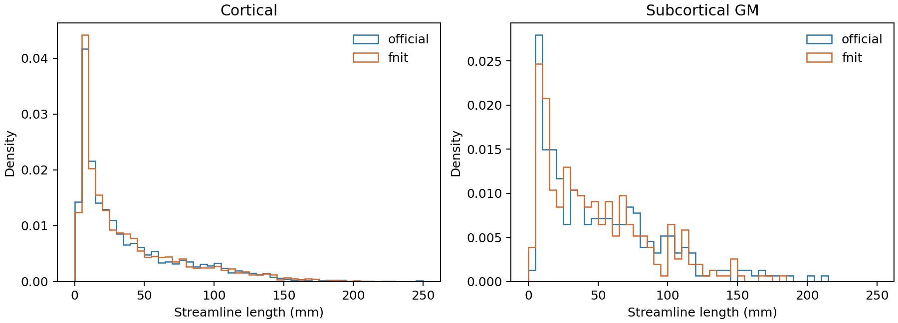

# 真实轨迹按播种组织分层的长度检查

## 输入和方法

使用 OpenNeuro ds004666 `sub-01/ses-2mm` 的同一份校正 DWI 派生 WM FOD、5TT 和 GMWMI。此页记录修正精确几何前的历史隔离实验；[后续精确几何与已合并播种修正](act_geometry_accepted_seeds_20260929.md)是当前结论。MRtrix3 与 FNIT 各尝试 10,000 次 GMWMI 播种，使用 iFOD2、ACT、`-maxlength 250 -cutoff 0.1 -samples 3 -power 0.5`。官方 `-output_seeds` 保存已接受流线的种子，FNIT 的 `accepted_seeds.npy` 保存对应种子；两者都与 TCK 中流线逐行配对。参考源码为 MRtrix3 `eeab681d3e0cb004cf1d1d31579d3892197ef5b6`。两套随机数发生器不同，比较群体分布。

[`benchmark_connectome_seed_stratified_tracks.py`](../../../tools/benchmark_connectome_seed_stratified_tracks.py) 的 `--official-tracks` 和 `--fnit-tracks` 输入 TCK 流线；`--official-seeds` 输入 `tckgen -output_seeds` CSV；`--fnit-seeds` 输入 float32 `[N,3]` NPY；`--five-tissue` 输入 cGM/sGM/WM/CSF/病理顺序的 5TT NIfTI；`--output` 写 JSON，`--figure` 写长度直方图 PNG。脚本按 5TT 的头文件体素间距计算种子处 cGM、sGM 分数，`sGM>cGM` 归为皮层下，其余归为皮层。输出 JSON 包含每个输入的 SHA-256、两类种子数、流线长度 0/10/25/50/75/90/100% 分位和两样本 KS 统计量。长度是 TCK 相邻点欧氏距离之和，单位 mm。

```bash
MRTRIX_BIN=/path/to/independent-mrtrix/bin   # 仅用于独立官方基准
FOD=wm_fod_norm.mif                          # 两套追踪使用同一真实 FOD
FIVE=5tt_dwi.mif                            # ACT 五组织图
GMWMI=gmwmi_seed_dwi.mif                    # 播种权重图
MRTRIX_RNG_SEED=0 "$MRTRIX_BIN/tckgen" -algorithm iFOD2 \
  -seed_gmwmi "$GMWMI" -act "$FIVE" -seeds 10000 -select 0 \
  -maxlength 250 -cutoff 0.1 -samples 3 -power 0.5 \
  -output_seeds official_seeds.csv "$FOD" official_tracks.tck

stratified_args=(
  --official-tracks official_tracks.tck          # 官方已接受的流线
  --official-seeds official_seeds.csv            # 与官方 TCK 逐行对应的 RAS 毫米种子
  --fnit-tracks fnit_tracks.tck                  # FNIT 已接受的流线
  --fnit-seeds fnit_accepted_seeds.npy          # 与 FNIT TCK 逐行对应的种子 [N,3]
  --five-tissue five_reference.nii.gz           # 与两套追踪相同体素、几何的真实 5TT
  --output seed_stratified.json                 # 各组织类别的长度统计、KS 和输入哈希
  --figure seed_stratified.png                 # 两类流线的长度分布图
)
python tools/benchmark_connectome_seed_stratified_tracks.py "${stratified_args[@]}"
```

FNIT 追踪和四矩阵的实际执行参数、输入/输出结构见[100k 三次重复报告](tracking_100k_three_seed_20260929.md)及其[基准脚本](../../../tools/benchmark_connectome_tracking_100k_matrices.py)。本次 10k 实验使用相同脚本，指定 `--n-seeds 10000 --seed 0 --batch-size 8192 --device cuda:0 --compile-arc`；`accepted_seeds.npy` 的第一维与 `tracks.tck` 条数相同。完整输入和 TCK 的哈希见[原始实现 JSON](sgm_tracking_20260929/original_fnit_stratified.json)和[播种候选 JSON](sgm_tracking_20260929/masked_seed_candidate_stratified.json)。

## 结果

| 追踪实现 | 已接受皮层 / 皮层下 | 皮层 75% 长度 | 皮层下 75% 长度 | 对官方长度 KS：皮层 / 皮层下 | 追踪时间 |
|---|---:|---:|---:|---:|---:|
| 官方 | 2449 / 308 | 56.35 mm | 76.71 mm | — | 同参数三次命令 6.44–6.91 s |
| 当时 FNIT 主线 | 2487 / 308 | 55.76 mm | 70.71 mm | 0.01565 / 0.06818 | 96.34 s，含首次编译 |
| 仅掩膜线性 5TT 播种，尚无精确 affine | 2438 / 290 | 55.30 mm | 72.58 mm | 0.01647 / 0.05773 | 89.24 s，含首次编译 |
| 皮层下 FOD 弦方向候选，未合并 | 2487 / 309 | 55.71 mm | 70.77 mm | 0.01565 / 0.06892 | 368.24 s，含首次编译 |

官方三次计时文件为 [seed 0](sgm_tracking_20260929/official_seed0.time)、[seed 1](sgm_tracking_20260929/official_seed1.time)、[seed 2](sgm_tracking_20260929/official_seed2.time)，在 Xeon Gold 6418H 上运行，命令含影像读取和写盘；上表 2449/308 的分层来自另一次带 `-output_seeds` 的官方 seed 0 TCK。两次 FNIT 运行在共享 H100 PCIe 上，均允许 TF32，时间从影像载入后计入首次 CUDA 编译。设备与计时范围不同，不能直接用墙钟比值推算加速比。当时主线与官方接受的皮层下流线数同为 308，但皮层下 75% 长度仍短 6.00 mm，说明总种子比例不能单独解释长度差异。只改掩膜线性 5TT 播种的界面绝对误差中位数更接近官方，ACT 单向比例却从旧算法的 0.874351 降至 0.841286，官方两次为 0.862259、0.862352；[旧算法](sgm_tracking_20260929/original_fnit_tissue_state.json)和[单项候选](sgm_tracking_20260929/masked_seed_candidate_tissue_state.json)的组织状态 JSON 保存原值。后续发现还需保留 5TT affine 双精度，两项联合修正才合并。

播种候选单独取 99,985 个位置，与两次官方 `Seedtest -output_seeds` 位置比较。候选与官方 seed 0 的 8 mm 三维直方图相关为 0.92825，官方两次之间为 0.92458；GM−WM 绝对差中位数分别为 0.000269、0.000265。相关接近没有使 ACT 状态或分层长度同时匹配。[播种候选 JSON](sgm_tracking_20260929/masked_seed_candidate_report.json)和[位置图](sgm_tracking_20260929/masked_seed_candidate_distribution.png)保留原始输出，主线播种指标仍以[当前播种报告](gmwmi_seed_100k_20260929.md)为准。

两份辅助脚本只做已生成位置的分布检查，不进入正式追踪。`benchmark_connectome_seed_multiscale.py` 的 `--official`、`--official-repeat` 输入两份官方成功种子 CSV，`--fnit` 输入 FNIT float32 `[N,3]` NPY，`--output` 写 2/4/8/16 mm 三维直方图 Pearson、总变差、非零格数、样本数和输入哈希 JSON。`benchmark_connectome_seed_tissue_state.py` 另外读 `--five-tissue` 五通道 NIfTI，以固定 x 方向计算 ACT 有效、单向、皮层下和 GM 侧比例及 GM−WM 分位；`--device` 是 Torch 设备。两者的输入位置与上表已接受流线的种子集合不同，不能把 99,985 个播种位置的组织比例视为 2,728 条已接受流线的比例。

```bash
multiscale_args=(
  --official seed0.csv                   # 官方 RNG 0 成功种子的 RAS 毫米坐标
  --official-repeat seed1.csv            # 官方 RNG 1 的独立坐标
  --fnit candidate_seeds.npy             # FNIT 候选播种坐标 [99985,3]
  --output seed_multiscale.json           # 各空间尺度的分布指标与输入哈希
)
python tools/benchmark_connectome_seed_multiscale.py "${multiscale_args[@]}"

tissue_args=(
  --five-tissue five_reference.nii.gz    # 真实五组织 NIfTI
  --official seed0.csv                   # 官方 RNG 0 坐标 CSV
  --official-repeat seed1.csv            # 官方 RNG 1 坐标 CSV
  --fnit candidate_seeds.npy             # FNIT 候选坐标 NPY
  --output seed_tissue_state.json         # ACT 状态比例和分位数 JSON
  --device cuda:0                         # Torch 计算设备
)
python tools/benchmark_connectome_seed_tissue_state.py "${tissue_args[@]}"
```

上述两份实际输出见[多尺度 JSON](sgm_tracking_20260929/masked_seed_candidate_multiscale.json)与[ACT 状态 JSON](sgm_tracking_20260929/masked_seed_candidate_tissue_state.json)。在固定 RAS 网格的 2/4/8/16 mm 四个尺度，候选与官方之间的相关/总变差均接近官方两次互比；ACT 单向比例仍相差约 2.1 个百分点。



## 皮层下截断候选的逐种子检查

MRtrix 在 `truncate_exit_sgm` 中比较各皮层下轨迹点沿相邻点弦方向的 FOD；当前 FNIT 使用圆弧切线方向。隔离候选只改这一评分方向，沿用主线的 10k 输入、FNIT RNG 种子 0、8192 批量和原始播种算法。H100 的 GPU 1 上，候选追踪 368.24 s、Torch 峰值 0.843 GiB，主线此前在 GPU 0 上为 96.34 s、0.663 GiB。共享负载和设备不同，不能把 3.82 倍墙钟当成稳定开销；候选当前没有性能证据支持合并。

候选接受 2796 条，主线 2795 条；两者有 2794 个相同的已接受种子，其中 223 条对应流线发生变化，[逐种子哈希与长度变化 JSON](sgm_tracking_20260929/chord_pairing.json)可核对。皮层下 KS 从 0.06818 略增至 0.06892，75% 长度仅从 70.71 增至 70.77 mm；官方为 76.71 mm。[候选分层 JSON](sgm_tracking_20260929/chord_candidate_stratified.json)、[运行时间/内存 JSON](sgm_tracking_20260929/chord_candidate_tracking.json)和[长度图](sgm_tracking_20260929/chord_candidate_stratified.png)保留本次负结果。候选没有合并，也没有重跑 100k 矩阵。

后续[已接受种子的精确几何检查](act_geometry_accepted_seeds_20260929.md)发现普通 NIfTI-1 仿射舍入会改变 ACT 单向判定；保持原 MIF 双精度仿射后，该项种子函数接近逐值一致，但 10k 长度仍有差异。下一步应冻结同一播种位置、初始方向和候选圆弧，分别记录 MRtrix 与 FNIT 的双向 ACT 终止类别、截断前后的内部点序列以及首次分歧位置。仅比较最终随机轨迹无法区分 FOD 提案、ACT 状态传播和双向组合的贡献。当前结果没有达到独立追踪群体或最终 connectome 的官方重复范围。

## 参考文献与原实现

- Smith RE 等，*Anatomically-constrained tractography: improved diffusion MRI streamlines tractography through effective use of anatomical information*，NeuroImage 62:1924–1938，2012。[论文](https://pubmed.ncbi.nlm.nih.gov/22705374/)。
- Tournier JD、Calamante F、Connelly A，*Improved Probabilistic Streamlines Tractography by 2nd Order Integration Over Fibre Orientation Distributions*，ISMRM 2010，摘要 1670。[原文](https://archive.ismrm.org/2010/1670.html)。
- 原实现代码库：[MRtrix3 本次固定提交](https://github.com/MRtrix3/mrtrix3/tree/eeab681d3e0cb004cf1d1d31579d3892197ef5b6)、[UKB-connectomics](https://github.com/sina-mansour/UKB-connectomics)。
