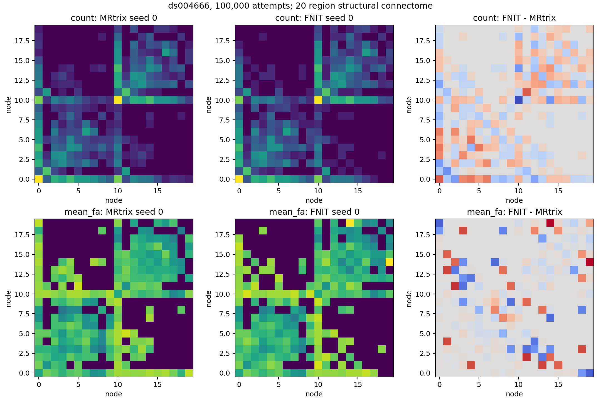
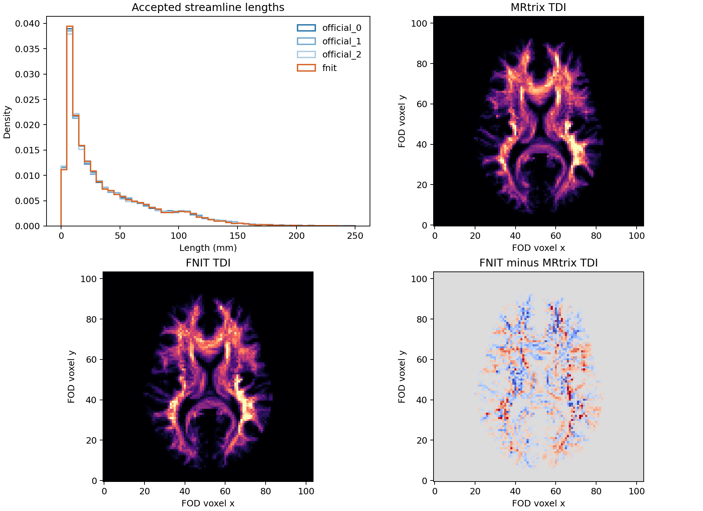

# 真实数据 100k 播种：轨迹群体、SIFT2 与四矩阵

## 对照范围与输入

公开 OpenNeuro ds004666 `sub-01/ses-2mm` 的校正 DWI 与已完成的 T1 `recon-all` 结果，生成同一份归一化 lmax=8 WM FOD、已映射至 DWI 世界空间的 5TT/GMWMI、FA 和 20 节点 DWI atlas。参考 MIF 与 FNIT 使用的 NIfTI 是无重采样格式转换；体素和仿射的逐项核对见[100k 输入报告](tracking_scale_100k_20260929.md)。FA 和 atlas 的 SHA-256 为 `0899aa207d22fb700d00a1ae0625d77275df84e3f7a547039bc602b0da8a8692`、`eae3b729cfc0ad0fe5cfa0649381a5b656e2d3c1a66ce678afb2800407f706b0`。FNIT 五张 NIfTI 的完整哈希见[实测 JSON](tracking_100k_matrices_20260929/report.json)。参考程序是独立 MRtrix3 `eeab681d3e0cb004cf1d1d31579d3892197ef5b6`；FNIT 正式运行时不调用它。

固定的是图像和全部算法参数。MRtrix `MRTRIX_RNG_SEED=0,1,2` 与 FNIT `seed=0` 使用不同随机数序列，所以逐条轨迹不应相同。20 节点 atlas 用于隔离追踪误差，不能代替原 UKB 七套图谱的最终整链验收。

## 命令、参数与输出

[官方追踪脚本](../../../tools/reference/benchmark_connectome_100k_repeat_official.sh)的九个位置参数依次是独立 MRtrix `bin` 目录、归一化 FOD MIF、5TT MIF、GMWMI MIF、FA MIF、20 节点 atlas NIfTI、播种尝试数、参考 RNG 种子、输出目录。它使用 `tckgen -algorithm iFOD2 -seed_gmwmi -act -seeds 100000 -select 0 -maxlength 250 -cutoff 0.1 -samples 3 -power 0.5`；接着调用[参考后处理脚本](../../../tools/reference/benchmark_connectome_100k_matrices_official.sh)，其七个位置参数是 `bin`、真实 TCK、FOD、5TT、FA、atlas、输出目录。后处理依次执行 `tcksift2 -act`、`tckstats -dump`、`tcksample -precise -stat_tck mean` 与四次 `tck2connectome -symmetric -assignment_radial_search 4`；加权三矩阵额外使用 `-tck_weights_in`，长度/FA 再用 `-scale_file -stat_edge mean`。输出是 TCK、SIFT2 权重、逐流线长度/FA、四张无表头的 20×20 CSV、命令日志和阶段计时。

FNIT [全链对照脚本](../../../tools/benchmark_connectome_tracking_100k_matrices.py)只调用包内 PyTorch 追踪、SIFT2、FA 采样和矩阵赋值。参数与输出示例：

```bash
fnit_args=(
  --fod "$FOD_NIFTI"               # 相同的归一化 WM FOD，float32 [104,104,72,45]
  --five-tissue "$FIVE_NIFTI"       # 相同的 5TT，float32 [256,256,256,5]
  --gmwmi "$GMWMI_NIFTI"            # 与 5TT 同网格的 GMWMI 播种权重
  --fa "$FA_NIFTI"                 # 与 FOD 同网格的 float32 FA
  --atlas "$ATLAS_NIFTI"           # DWI 世界空间中的 20 节点整数 atlas
  --official-dir "$OFFICIAL_DIR"   # 官方 seed 0 的四张参考矩阵目录
  --n-seeds 100000                 # GMWMI 播种尝试数，不是保留流线数
  --batch-size 8192                # 每批并行传播的种子数
  --seed 0                         # PyTorch 随机种子，与 MRtrix RNG 不同
  --device cuda:0                  # H100 GPU；默认 TF32，未用半精度
  --output-dir "$OUTPUT"           # TCK、四 CSV、tracking.json、report.json
)
python tools/benchmark_connectome_tracking_100k_matrices.py "${fnit_args[@]}"
```

`tracking.json` 保存保留数、点数、追踪时间和追踪阶段 Torch 峰值；`report.json` 保存五张输入 SHA-256、载入/追踪/后处理时间、最终显存及与官方 seed 0 的四矩阵指标。`count.csv`、`sift2_fbc.csv`、`mean_length.csv`、`mean_fa.csv` 均为对称 20×20，行列为 atlas 标签 1..20，长度单位 mm，FA 无量纲；`tracks.tck` 为世界毫米折线，完整文件留在验证服务器。仓库保留[三次官方](tracking_100k_matrices_20260929/official_seed0/)及[一次 FNIT](tracking_100k_matrices_20260929/fnit_seed0/)四矩阵 CSV、哈希、数值报告和图。

[随机范围脚本](../../../tools/benchmark_connectome_tracking_100k_envelope.py)的 `--official` 依次接三份官方矩阵目录，`--fnit` 接一份 FNIT 矩阵目录，`--output` 保存全部逐对指标 JSON，`--figure` 保存 count/FA 连接图。[轨迹群体脚本](../../../tools/benchmark_connectome_tracking_population.py)的 `--official` 接三份参考 TCK，`--fnit` 接 FNIT TCK，`--grid` 接同一 FOD NIfTI，`--output`/`--figure` 保存长度 KS、端点相关、TDI 相关及脑图。

## 时间、显存与接受率

| 实现 | 100k 次播种保留流线 | 追踪墙钟 | SIFT2 与其余后处理 | 内存 |
|---|---:|---:|---:|---:|
| MRtrix CPU seed 0 | 27,616 | 68.88 s | SIFT2 12.45 s；其他命令各 ≤0.07 s | tckgen RSS 0.291 GiB；SIFT2 RSS 0.453 GiB |
| MRtrix CPU seed 1 | 27,717 | 67.73 s | SIFT2 13.35 s | tckgen RSS 0.290 GiB；SIFT2 RSS 0.452 GiB |
| MRtrix CPU seed 2 | 27,636 | 84.42 s | SIFT2 15.42 s | tckgen RSS 0.291 GiB；SIFT2 RSS 0.455 GiB |
| FNIT H100 seed 0 | 27,401 | 1,443.91 s | SIFT2、FA 与矩阵共 36.53 s | 追踪 Torch 0.979 GiB；全链 Torch 2.473 GiB；进程 RSS 1.063 GiB |

FNIT 的 `load_seconds=6.25 s` 另计；它和上表追踪时间均来自同一[完整报告](tracking_100k_matrices_20260929/report.json)。FNIT 的后处理 36.53 s 是 PyTorch 三阶段合计，不含两阶段之间的 TCK 写出及报告哈希计算，不能与 MRtrix 单独 SIFT2 时间直接作同阶段比。MRtrix 在 Xeon Gold 6418H、FNIT 在共享 H100 PCIe，计时边界和并发负载不同；本次观察时 GPU 0 总利用率为 100%、显存占用约 62 GiB（包含其他作业）。接受率接近并不保证轨迹群体一致。

## 四矩阵与轨迹分布

[三次官方、一份 FNIT 的逐对 JSON](tracking_100k_matrices_20260929/envelope.json)在严格上三角 190 条可能边上计算 `Σ|A−B|/Σ|A|`，支持 Dice 在 count 非零边上计算；FA 的共同边归一化误差只取两边均有流线的边。

| 指标 | 三次官方互比范围 | FNIT 对官方 seed 0 / 1 / 2 |
|---|---:|---:|
| count 相对 L1 | 0.0937–0.1174 | 0.1006 / 0.0843 / 0.1071 |
| SIFT2 FBC 相对 L1 | 0.0967–0.1218 | 0.0993 / 0.1008 / 0.1245 |
| count 支持 Dice | 0.8517–0.8879 | 0.8846 / 0.9108 / 0.8421 |
| 共同边 mean FA 归一化 MAE | 0.0575–0.0613 | 0.0600 / 0.0660 / 0.0541 |

count 的三组跨软件相对 L1 中两组落入官方范围，支持 Dice 与共同边 mean FA 各有一组落入；落在范围外的更小误差同样保留，不按方向挑选。FNIT 对官方 seed 0 的 count 上三角 Pearson 为 0.9983，但该高相关受到强连接边影响，不能单凭它宣称匹配。

[轨迹群体 JSON](tracking_100k_matrices_20260929/population.json)表明细部仍有差异：长度分布 KS，官方互比为 `0.0054–0.0070`，FNIT 对官方为 `0.0099–0.0124`；8 mm 端点直方图相关为 `0.8955–0.8972` 对 `0.8870–0.8905`；8 mm 块 TDI 相关为 `0.9841–0.9863` 对 `0.9815–0.9822`。这三项的跨软件范围均未进入本次三份官方的互比范围。100k 的矩阵结果较 10k 稳定，但独立轨迹群体仍有可测差异，不能称最终 connectome 与原 UKB 流程一致。要判断稳定性仍需 FNIT 自身多随机种子；当前仅有一份 100k FNIT 重复。




