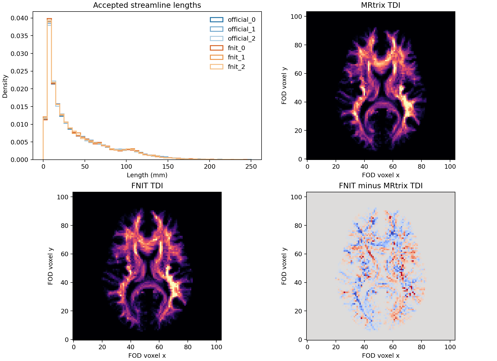
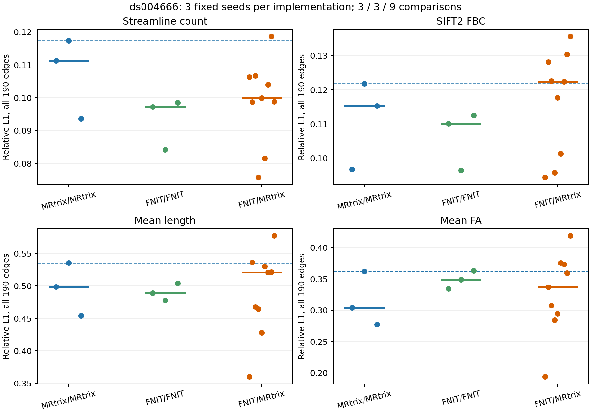

# 真实 DWI 的 100k 追踪三次重复

## 固定输入与比较范围

公开 OpenNeuro ds004666 `sub-01/ses-2mm` 的校正 DWI 和配对 T1 经相同上游流程得到归一化 WM FOD、5TT、GMWMI、FA 与 20 节点 DWI atlas。本次固定这些影像的体素数组，分别运行 MRtrix3 与 FNIT 的 iFOD2/ACT、SIFT2、FA 沿程采样和四矩阵计算，各取随机种子 0、1、2。两套程序的随机数序列不同，比较对象是独立轨迹群体，不是逐条轨迹。五张 FNIT 输入的 SHA-256 在三份 [`report.json`](tracking_compile_20260929/compiled_100k/report.json)、[`seed1/report.json`](tracking_100k_three_seed_20260929/seed1/report.json) 和 [`seed2/report.json`](tracking_100k_three_seed_20260929/seed2/report.json) 中逐项相同；MRtrix MIF 与 NIfTI 的体素和几何核对见[输入报告](tracking_scale_100k_20260929.md)。后续[精确仿射检查](act_geometry_accepted_seeds_20260929.md)发现，本次 NIfTI-1 5TT 的 sform 相对参考 MIF 仍有最大 `1.43×10⁻⁵ mm` 的角点偏移，足以改变界面附近的 ACT 单向标志。因此本页是固定体素、NIfTI-1 几何条件下的追踪基线，不代表严格相同世界仿射。三份官方和三份 FNIT TCK 的哈希见[轨迹报告](tracking_100k_three_seed_20260929/population_3x3.json)。

FNIT 基线为源码提交 `7f53c97`，启用 `compile_arc=True`、float32 与默认 TF32；每次 100,000 次播种，批量 8,192，圆弧拒绝采样和 ACT 参数与[编译核报告](tracking_compile_20260929.md)相同。原版参考为 MRtrix3 源码提交 `eeab681d3e0cb004cf1d1d31579d3892197ef5b6`，只在独立 benchmark 中运行。20 节点示例 atlas 用于定位追踪误差；原 UKB 七套 atlas 的固定轨迹和独立轨迹结果见[七套图谱报告](seven_atlas_100k_20260929.md)。Tian 使用 SynthMorph 时与原 FNIRT 标签有差异，见[配准报告](atlas_synthmorph_20260929.md)。

原版追踪命令和后处理参数由[参考脚本](../../../tools/reference/benchmark_connectome_100k_repeat_official.sh)固定；单次命令为：

```bash
MRTRIX_RNG_SEED=0 tckgen -algorithm iFOD2 \
  -seed_gmwmi gmwmi.mif -act five_tissue.mif \
  -seeds 100000 -select 0 -maxlength 250 -cutoff 0.1 \
  -samples 3 -power 0.5 wm_fod_norm.mif tracks.tck
```

FNIT 的[实际执行脚本](../../../tools/benchmark_connectome_tracking_100k_matrices.py)在 `--fod` 读取 FOD、`--five-tissue` 读取 ACT 5TT、`--gmwmi` 读取播种权重、`--fa` 读取沿程标量、`--atlas` 读取整数节点、`--official-dir` 指向官方 seed 0 四矩阵、`--output-dir` 写 TCK、四张 CSV 以及时间和显存 JSON；`--n-seeds 100000 --batch-size 8192 --seed 0/1/2 --device cuda:0 --compile-arc` 指定追踪次数、GPU 批量、FNIT 随机种子、设备和编译核。官方四矩阵按 `tcksift2 -act`、`tcksample -precise -stat_tck mean`、`tck2connectome -symmetric -assignment_radial_search 4` 等[参考后处理脚本](../../../tools/reference/benchmark_connectome_100k_matrices_official.sh)生成。

## 三次对三次的用法和输出

下述两份 benchmark 脚本只读已有的矩阵与 TCK，不重新追踪。每个路径变量代表一份同受试者、同上游输入的实际运行产物。

```bash
matrix_args=(
  --official "$MRTRIX_0" "$MRTRIX_1" "$MRTRIX_2" # 三份官方四矩阵目录
  --fnit "$FNIT_0" "$FNIT_1" "$FNIT_2"           # 三份 FNIT 四矩阵目录
  --output envelope_3x3.json                         # 15 对逐边指标与输入哈希
  --figure envelope_3x3.png                          # 四矩阵相对误差图
)
python tools/benchmark_connectome_rng_envelope.py "${matrix_args[@]}"

population_args=(
  --official "$MRTRIX_0_TCK" "$MRTRIX_1_TCK" "$MRTRIX_2_TCK" # 三份官方流线
  --fnit "$FNIT_0_TCK"                                # 第一份 FNIT 流线
  --fnit-repeat "$FNIT_1_TCK" "$FNIT_2_TCK"            # 另两份 FNIT 流线
  --grid "$FOD_NIFTI"                                 # 共用 FOD 网格及 RAS 仿射
  --output population_3x3.json                        # TCK 哈希、分位数、15 对分布指标
  --figure population_3x3.png                         # 长度直方图与脑内 TDI 图
)
python tools/benchmark_connectome_tracking_population.py "${population_args[@]}"
```

四矩阵均为有限、对称的 20×20 无表头 CSV，行列对应 atlas 1–20；严格上三角有 190 条可能边。`count` 为分配的流线数，`sift2_fbc` 为 SIFT2 权重和，`mean_length` 单位 mm，`mean_fa` 无量纲。全边相对 L1 为 `Σ|FNIT−官方|/Σ|官方|`；共同非零边的归一化误差单独报告，以免把没有边的区域误认为标量采样误差。

## 结果

| 实现与种子 | 保留流线 / 100k | 追踪耗时 | 后处理耗时 | 内存 |
|---|---:|---:|---:|---:|
| MRtrix 0 / 1 / 2 | 27,616 / 27,717 / 27,636 | 68.88 / 67.73 / 84.42 s | SIFT2 12.45 / 13.35 / 15.42 s，其他命令单独计时 | tckgen RSS 约 0.29 GiB；SIFT2 RSS 约 0.45 GiB |
| FNIT 0 / 1 / 2 | 27,353 / 27,470 / 27,670 | 782.49 / 806.22 / 806.95 s | 34.13 / 37.71 / 36.16 s，含 SIFT2、FA 和矩阵 | 全链 Torch 峰值 2.468 / 2.473 / 2.473 GiB |

FNIT 追踪计时包括首次编译，输入已载入；后处理不包括 TCK 写盘。MRtrix 的数字来自完整 CPU 命令、包含 I/O，运行在 Xeon Gold 6418H；FNIT 在共享 H100 PCIe，负载不恒定。上述墙钟说明当前实测规模存在明显性能差距，不作严格硬件加速比解释。

| 指标 | 官方三次互比 | FNIT 三次互比 | 跨软件九对 | 跨软件落入官方范围 |
|---|---:|---:|---:|---:|
| 长度 KS，越低越近 | 0.00541–0.00696 | 0.00612–0.00658 | 0.00900–0.01480 | 0/9 |
| 8 mm 端点直方图相关，越高越近 | 0.89547–0.89717 | 0.89988–0.90146 | 0.88604–0.89345 | 0/9 |
| 8 mm 块 TDI 相关，越高越近 | 0.98406–0.98632 | 0.98435–0.98598 | 0.98113–0.98379 | 0/9 |

FNIT 自身三次的长度 KS 与粗 TDI 相关都处于官方自身重复的相近范围，但跨软件九对全部落在对应官方范围外。75% 长度分位数官方为 58.73–59.75 mm、FNIT 为 57.44–57.80 mm；90% 分位数官方为 100.51–101.09 mm、FNIT 为 97.76–98.72 mm。接受率相近仍掩盖了长轨比例与空间分布的系统差异。逐轨哈希、原始 15 对数值和完整分位数见[轨迹 JSON](tracking_100k_three_seed_20260929/population_3x3.json)。

| 20 节点矩阵指标 | 官方三对范围 | FNIT 三对范围 | 跨软件九对范围 | 九对进入官方范围 |
|---|---:|---:|---:|---:|
| count，全边相对 L1 | 0.0937–0.1174 | 0.0842–0.0985 | 0.0758–0.1187 | 6/9 |
| SIFT2 FBC，全边相对 L1 | 0.0967–0.1218 | 0.0964–0.1125 | 0.0944–0.1356 | 2/9 |
| mean length，共同非零边归一化误差 | 0.1773–0.2110 | 0.1563–0.1847 | 0.1456–0.2188 | 3/9 |
| mean FA，共同非零边归一化误差 | 0.0575–0.0613 | 0.0549–0.0685 | 0.0498–0.0712 | 3/9 |
| count 非零边支持 Dice | 0.8517–0.8879 | 0.8558–0.8657 | 0.8208–0.9314 | 3/9 |

有些跨软件误差比官方内部还低，这些也保留在逐对 JSON 中。高 count 相关或部分矩阵指标落入随机范围，不能抵消长度、端点、TDI 的九对系统偏差。固定同一官方 TCK 后，SIFT2、FA 和节点赋值已接近或达到逐值一致，见[固定轨迹阶段表](../../../docs/connectome/README.md)；100k GMWMI 位置在[2–16 mm 空间尺度](gmwmi_seed_100k_20260929.md)上也与官方自身重复接近。本次剩余差异主要定位在独立追踪产生的流线群体，仍需继续检查界面亚体素位置和完整传播状态。三次重复只给出本受试者、本输入的经验范围，尚不能外推至原 UKB 七套图谱或不同采集条件。





## 下一步定位

优先检查 ACT 单向/双向传播的实际路径使用、各终止类别及长轨概率，采用冻结位置和候选方向的逐轨参考输出定位首次分歧。`probabilistic_tractography` 当前对已知单向种子仍计算并丢弃反向传播；这项性能修正需独立验证，不能用其改变后的随机序列替代本报告的基线。之后在原 UKB 七套 atlas 和匹配 T1 配准条件上重复同一矩阵验收，并将追踪按块输出扩展到百万、千万次播种。

## 参考文献与原实现

- Tournier JD、Calamante F、Connelly A，*Improved Probabilistic Streamlines Tractography by 2nd Order Integration Over Fibre Orientation Distributions*，ISMRM 2010，摘要 1670。[原文](https://archive.ismrm.org/2010/1670.html)。
- Smith RE 等，*Anatomically-constrained tractography: improved diffusion MRI streamlines tractography through effective use of anatomical information*，NeuroImage 62:1924–1938，2012。[论文](https://pubmed.ncbi.nlm.nih.gov/22705374/)。
- Smith RE 等，*SIFT2: Enabling dense quantitative assessment of brain white matter connectivity using streamlines tractography*，NeuroImage 119:338–351，2015。[论文](https://pubmed.ncbi.nlm.nih.gov/26163802/)。
- 原实现代码库：[MRtrix3 固定提交](https://github.com/MRtrix3/mrtrix3/tree/eeab681d3e0cb004cf1d1d31579d3892197ef5b6)、[UKB-connectomics](https://github.com/sina-mansour/UKB-connectomics)。
