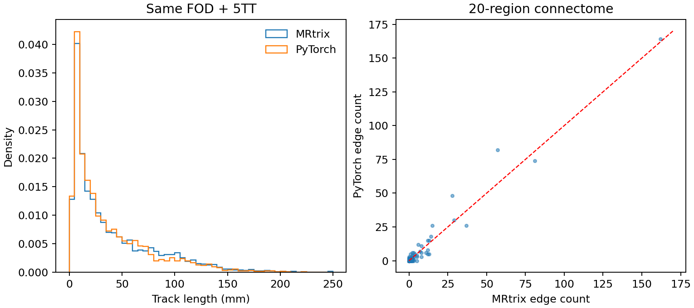
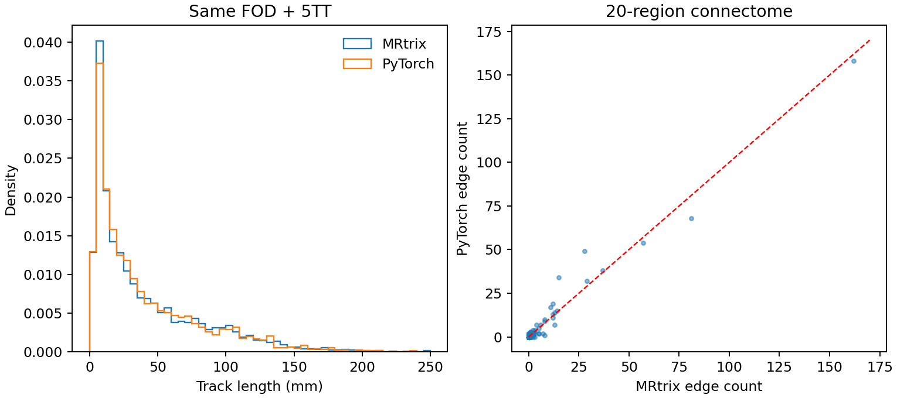

# ACT 皮质下灰质：同输入双种子 A/B（ds004666）

固定 OpenNeuro ds004666 `sub-01/ses-2mm` 的 MRtrix WM FOD、FreeSurfer 5TT、`5tt2gmwmi`、SIFT2 processing mask、FA 和 20 区 atlas。四次 PyTorch 运行只改变 `tracking.py` 的 ACT 皮质下灰质（sGM）状态处理；每个 PyTorch 种子都分别运行修改前与修改后代码。六个图像的 SHA-256、代码 SHA-256、配置、逐阶段时间、GPU 峰值以及三个官方参考矩阵的逐项指标，见下方四份 JSON。所有图像用 nibabel 载入；float32 计算默认开启 TF32，几何坐标变换使用 float64，没有使用 float16。H100 GPU0 的峰值 PyTorch 分配为 2.184 GiB。

## 对应函数和原命令

`probabilistic_tractography(wm_sh, fod_affine, five_tissue, five_tissue_affine, gmwmi, *, n_seeds, ...) -> Tractogram` 接收分别位于 FOD、5TT 网格的 float32 SH `[XF,YF,ZF,45]`、cGM/sGM/WM/CSF/path 五组织 `[XA,YA,ZA,5]`、GMWMI `[XA,YA,ZA]` 和两张 `[4,4]` RAS-mm 仿射；返回变长轨迹、`[N,2,3]` 双端点、`[N]` 长度以及被接受的种子。内部 `_act_sample_state` 对每个采样点的五组织 `[B,5]` 更新继续追踪、cGM 终止、离开 sGM、起始于 sGM 后抵达 WM 等布尔状态。`_grow` 在 sGM 中继续追踪，离开时回退至已访问 midpoint/endpoint 中方向 FOD 最小处；其输入、输出形状见函数 docstring。

对应 MRtrix3 `3.0.3-103-g026e850d` 的命令是：

```bash
tckgen -algorithm iFOD2 -seed_gmwmi gmwmi.mif -act five_tissue.mif \
  -seeds 10000 -select 0 -maxlength 250 -cutoff 0.1 -samples 3 \
  -power 0.5 wm_fod_norm.mif tracks_10000.tck
```

源码依据为 [`ACT/method.h::check_structural`](https://github.com/MRtrix3/mrtrix3/blob/3.0.3/src/dwi/tractography/ACT/method.h)、[`tracking/exec.h::truncate_exit_sgm`](https://github.com/MRtrix3/mrtrix3/blob/3.0.3/src/dwi/tractography/tracking/exec.h) 和 [`iFOD2.h`](https://github.com/MRtrix3/mrtrix3/blob/3.0.3/src/dwi/tractography/algorithms/iFOD2.h)。cGM 仍直接终止；sGM 内模型停止可接受；普通种子离开 sGM 会回退；sGM 内播种需有一侧抵达 WM。解析测试覆盖这些分支、确定性 WM→sGM→cGM 轨迹及 sGM→WM 的最小 FOD 回退，远端 CPU 为 **5 passed、5 CUDA skipped**。

## 双种子实测

源文件 SHA-256：旧版 `adcf0dd59ebb9fa8dfb066e19ef913295bd58f4cfd099831bf293ffc54301626`；新版 `b217211e91f24179ef2266f68da0463841207f5dc9b8b128ddbca5d3aea1c1fa`。两版各用 PyTorch `seed=1,2`，各 10,000 次播种、16 个 arc proposals、batch 8192。官方三个参考分别有 2,758、2,728、2,727 条接受轨迹；其 SIFT2 与矩阵使用最终 8 线程版本。种子 1 报告引用早先 4 线程官方目录；[线程受控验证](official_mrtrix_rng_variability/thread_control_4_vs_8.public.json)确认本表使用的 190 条非对角边逐元素相同，因此两版 A/B 的非对角指标与最终 8 线程参考相同。

| PyTorch 种子 | ACT | 接受轨迹 | 长度均值 / 中位 (mm) | 追踪 (s) | 追踪至矩阵核心 (s) |
|---|---|---:|---:|---:|---:|
| 1 | 旧 | 3,005 | 37.24 / 22.81 | 30.41 | 59.34 |
| 1 | sGM 状态 | 3,034 | 39.66 / 24.24 | 36.48 | 68.88 |
| 2 | 旧 | 3,031 | 37.01 / 22.32 | 34.35 | 64.60 |
| 2 | sGM 状态 | 3,038 | 40.18 / 25.24 | 33.94 | 63.12 |

官方同次真实输入、8 CPU 线程 `tckgen` 为 15.18–17.42 秒、SIFT2 为 24.64–25.68 秒；上表 PyTorch 时间包含内存中采样、追踪、SIFT2、FA、矩阵，不含输入读盘或结果落盘，不能把两列直接作为完整流程加速比。新状态让长度分布靠近官方参考，但第二个种子以外的跟踪时间增加；当前 Python/PyTorch 实现仍明显慢于 MRtrix 追踪。

下表的 Dice 是全部 190 条非对角边的非零支持 Dice；count/FBC 相对 L1 为 `Σ|候选−官方| / Σ|官方|`；FA 为双方 count 非零的共同边 Pearson r。箭头左侧为旧版，右侧为 sGM 状态版，三个官方参考记为 0/1/2。

| PyTorch 种子 / 官方参考 | 支持 Dice | count 相对 L1 | FBC 相对 L1 | 共同边 FA r |
|---|---:|---:|---:|---:|
| 1 / 0 | .717 → .838 | .275 → .290 | .366 → .309 | .714 → .722 |
| 1 / 1 | .720 → .818 | .298 → .307 | .440 → .362 | .637 → .541 |
| 1 / 2 | .738 → .817 | .291 → .243 | .438 → .300 | .618 → .759 |
| 2 / 0 | .765 → .844 | .315 → .252 | .328 → .246 | .841 → .785 |
| 2 / 1 | .729 → .772 | .322 → .272 | .394 → .344 | .810 → .625 |
| 2 / 2 | .732 → .773 | .275 → .257 | .334 → .260 | .622 → .800 |

两种子、三官方参考的支持 Dice 和 FBC 相对 L1 均改善；count 在种子 1 的官方参考 0/1 对比中变差，FA 相关也有升有降。共同边 FA 绝对误差六组都减小，但共同边集合随追踪变化。新候选约 2,404–2,408 条同区连接，官方约 2,071–2,140 条；这仍是较大的系统差异。官方自身三种子 count 相对 L1 为 .228–.258、FBC 为 .238–.298、支持 Dice 为 .752–.790；此更改**尚未使所有指标稳定落入官方随机波动**。保留该更改的依据是可核对的 ACT 分支语义和聚焦测试，矩阵总体等价尚未得到证明。





[旧版种子 1](tracking_act_ab_baseline_seed1.public.json)、[新版种子 1](tracking_act_ab_candidate_seed1.public.json)、[旧版种子 2](tracking_act_ab_baseline_seed2.public.json)、[新版种子 2](tracking_act_ab_candidate_seed2.public.json)保存全部精度、时间、输入哈希和图文件名。

## 复现与边界

在具备这六个固定 NIfTI 及三个官方结果目录的主机，从仓库根目录运行 [A/B 脚本](../../../tools/benchmark_connectome_tracking_act_ab.py)，分别用旧/新版 `tracking.py`、相同 `--seed` 和相同 `--official-dir`：

```bash
python tools/benchmark_connectome_tracking_act_ab.py \
  --fod wm_fod_norm.nii.gz --five-tissue five_tissue.nii.gz \
  --gmwmi gmwmi.nii.gz --processing-mask proc_mask.nii.gz \
  --fa fa_corrected.nii.gz --atlas synthseg_gm_atlas_dwi.nii.gz \
  --official-dir official_seed_0 --official-dir official_seed_1 \
  --official-dir official_seed_2 --seed 2 --n-seeds 10000 \
  --device cuda:0 --output act_seed2.json --figure act_seed2.png
```

PyTorch 与 MRtrix 的随机数流及采样算法不同，不能将第 n 条轨迹逐点配对。当前 16 个加权候选与 MRtrix 校准拒绝采样不同；我们的路径只保留每个 arc 的终点及必要的终止 midpoint，虽用两个采样点选择 sGM 最低 FOD，回退的完整点序列仍未达到 MRtrix 逐点等价。`-backtrack` 等其它 ACT 选项没有在此次命令中启用。原先 [追踪阶段报告](tracking_act_stage.md)的 2,950 条、58.45 秒是更早代码快照的独立验证，不应视为本版性能。主流程原有种子 0/1/2 的归档结果也属于改动前版本，须以新版全流程重跑后更新。
