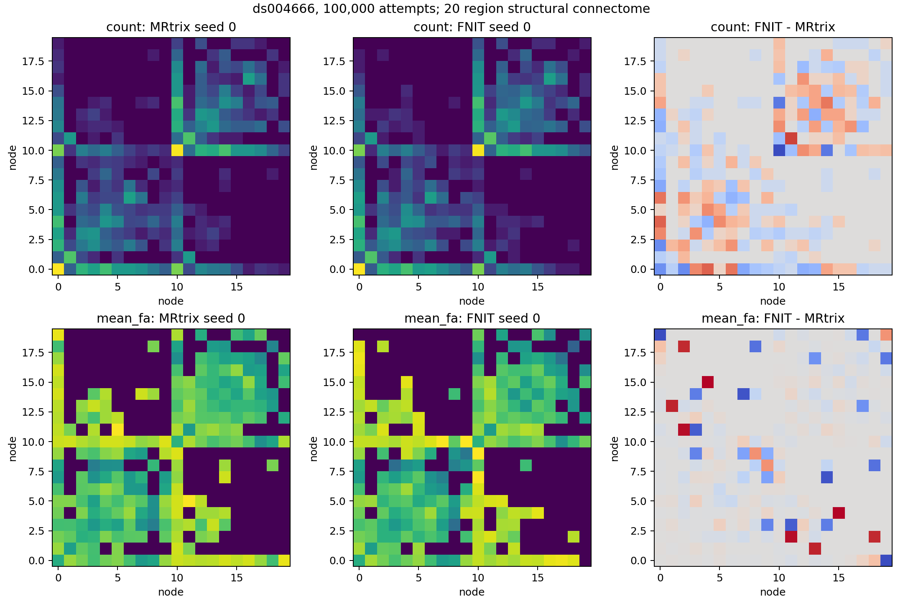
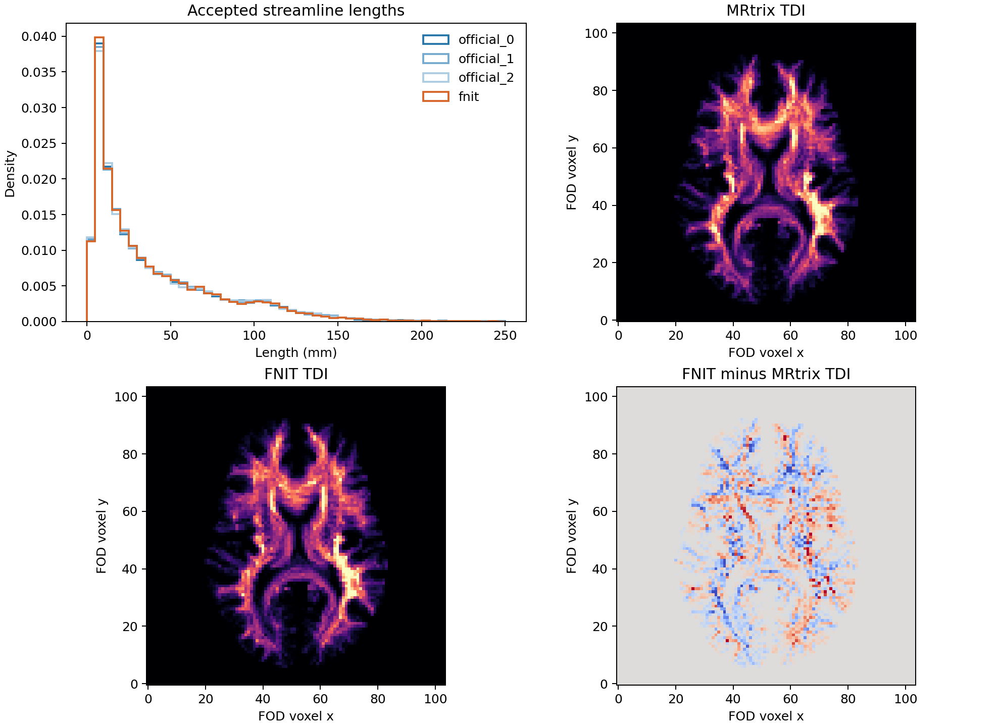

# 真实 FOD/5TT 上编译 iFOD2 圆弧概率核

## 功能、输入与输出

`probabilistic_tractography(..., compile_arc=True)` 只用 PyTorch `torch.compile(fullgraph=True, dynamic=True)` 编译 iFOD2 的圆弧概率函数。连续初始方向、校准拒绝采样的随机数、ACT 组织状态、种子、终止规则和返回的 `Tractogram` 结构仍使用同一实现。输入为 float32 WM 球谐 FOD `[X,Y,Z,45]` 及其体素→RAS 毫米仿射、float32 5TT `[A,B,C,5]` 及其仿射、同 5TT 网格的 float32 GMWMI、播种次数 `n_seeds`；`five_tissue_spacing_mm` 保留原 5TT 文件头的三个体素尺寸。输出 `paths` 是 N 条逐轨世界毫米坐标 `[Pi,3]`，`endpoints` `[N,2,3]`、`lengths_mm` `[N]`、`accepted_seeds` `[N,3]`；`seeds_attempted` 仍是尝试次数。编译模式只支持 CUDA，float32 与默认 TF32 保持不变，不用 float16/bfloat16。首次调用会额外花时间编译，默认关闭。

```python
from fnit.connectome.tracking import probabilistic_tractography

tracks = probabilistic_tractography(
    wm_sh=wm_fod,                   # 真实归一化 WM FOD，float32 [X,Y,Z,45]
    fod_affine=dwi_affine,          # FOD 体素中心到 DWI RAS 世界毫米的 4×4 变换
    five_tissue=five_tissue,        # recon-all 派生 ACT 五组织分数，[A,B,C,5]
    five_tissue_affine=five_affine, # T1 五组织体素到 DWI RAS 世界毫米的 4×4 变换
    gmwmi=gmwmi,                   # 5TT 同网格的 GMWMI 播种权重，[A,B,C]
    n_seeds=100_000,               # 播种尝试数，不是保留流线数
    five_tissue_spacing_mm=(1., 1., 1.), # 原 5TT 文件头体素尺寸，单位 mm
    lmax=8,                        # WM FOD 的球谐阶数，对应 45 系数
    batch_size=8192,               # 每批并行传播的播种尝试数
    seed=0,                        # FNIT 随机数种子，不与 MRtrix RNG 对齐
    compile_arc=True,              # 首次编译圆弧概率核，保持 ACT/SIFT2 其他实现不变
)
# tracks.paths / endpoints / lengths_mm / accepted_seeds 保留在同一 CUDA 设备。
```

正式命令 `fnit connectome` 可加 `--compile-arc`；它传给上述函数，其他输入/输出与[主文档](../../../docs/connectome/README.md)相同。等价的独立参考追踪命令为：

```bash
MRTRIX_RNG_SEED=0 tckgen -algorithm iFOD2 -seed_gmwmi gmwmi.mif \
  -act five_tissue.mif -seeds 100000 -select 0 -maxlength 250 \
  -cutoff 0.1 -samples 3 -power 0.5 wm_fod_norm.mif tracks.tck
```

MRtrix3 `eeab681d3e0cb004cf1d1d31579d3892197ef5b6` 只用于独立基准；FNIT 正式运行时不调用它。公开 ds004666 `sub-01/ses-2mm` 的同一 FOD、5TT、GMWMI、FA 与 20 节点 atlas 的 SHA-256 在[编译版完整报告](tracking_compile_20260929/compiled_100k/report.json)及[未编译报告](tracking_100k_matrices_20260929/report.json)中逐项一致。20 节点 atlas 用来隔离追踪差异；七套原 UKB atlas 的[独立矩阵对照](seven_atlas_100k_20260929.md)另列。

## 运行命令和产物

[全链基准脚本](../../../tools/benchmark_connectome_tracking_100k_matrices.py)调用正式 `probabilistic_tractography`，然后对所得 TCK 运行 FNIT SIFT2、精确 FA 采样及四矩阵赋值。编译版调用中每个参数的含义：

```bash
compile_args=(
  --fod "$FOD_NIFTI"               # 双方同哈希的归一化 WM FOD
  --five-tissue "$FIVE_NIFTI"       # 双方同哈希的 DWI 世界空间五组织图
  --gmwmi "$GMWMI_NIFTI"            # 与 5TT 同网格的 GMWMI 播种图
  --fa "$FA_NIFTI"                  # 与 FOD 同网格的真实 FA
  --atlas "$ATLAS_NIFTI"            # DWI 世界空间的 20 节点整数标签图
  --official-dir "$OFFICIAL_DIR"    # 官方 seed 0 四矩阵 CSV 所在目录
  --n-seeds 100000                  # GMWMI 播种尝试数
  --batch-size 8192                 # 追踪批量，与未编译版相同
  --seed 0                          # PyTorch 随机种子，与未编译版相同
  --device cuda:0                   # H100 GPU，默认 TF32
  --compile-arc                     # 打开本次测试的编译核；省略即原实现
  --output-dir "$OUTPUT"            # TCK、四 CSV、tracking/report JSON
)
python tools/benchmark_connectome_tracking_100k_matrices.py "${compile_args[@]}"
```

`tracking.json` 记录保留数、轨迹点数、时间和追踪峰值；`report.json` 保存影像哈希、载入/追踪/后处理秒数、全链 Torch 显存和与官方 seed 0 的四矩阵指标；四张无表头 CSV 是对称 20×20，行列为 atlas 1..20。TCK 留在验证服务器，SHA-256 在[轨迹群体 JSON](tracking_compile_20260929/compiled_100k/population.json)。仓库同时保留编译版的[四矩阵与图](tracking_compile_20260929/compiled_100k/)和[诊断 JSON](tracking_compile_20260929/)。固定相同输入的官方三次 TCK/SIFT2/矩阵命令见[100k 对照报告](tracking_100k_matrices_20260929.md)。

## 精度、时间和显存

| 实际数据与范围 | 未编译 | 编译圆弧核 | 观察 |
|---|---:|---:|---|
| 128 种子 × 20 个传播步，同进程二次运行 | 3.726 s | 1.467 s | ACT 终止、步数和 seed→WM 状态均 0 差异；最大路径差 0.00000763 mm；首次编译运行 131.06 s |
| 同一真实圆弧，128×16 提案，稳态单次 | 18.17 ms | 1.223 ms | 路径概率最大差 1.10e−6；路径坐标最大差 0.00000763 mm；首次编译约 56.89 s |
| 1,000 次完整播种，首次编译计入 | 53.46 s，保留 274 | 75.70 s，保留 274 | 274 个保留种子和逐轨点数一致；最大同轨点差 0.0000153 mm；Torch 峰值 0.618 GiB |
| 100,000 次完整播种，首次编译计入 | 1,443.91 s，保留 27,401 | 782.49 s，保留 27,353 | 两次共享 GPU 负载不同；后处理另为 36.53/34.13 s；全链 Torch 峰值 2.473/2.468 GiB |

小规模同进程测量支持编译可减少稳态 CUDA 调度开销；1k 首次编译反而更慢。100k 的两次运行在共享 H100 PCIe 不同时段进行，观察到的 1.85 倍墙钟差不能当作稳定硬件加速比。100k 同 seed 结果相差 48 条流线（尝试数的 0.048%）；编译引起的微小浮点差在随机接受/终止边界可能改变后续轨迹，不能声称逐条路径完全一致。128/1k 实验与完整 100k 的[原始 JSON](tracking_compile_20260929/)保留不同计时边界。100k 两份输入及 atlas 哈希完全一致；编译版运行时未调用 FSL、FreeSurfer 或 MRtrix。

同一 20 节点 atlas 的编译与未编译 FNIT 100k count 相对 L1 为 `0.0685`、非零边支持 Dice 为 `0.9020`、共同边 mean FA 归一化 MAE 为 `0.0412`。独立 MRtrix seed 0/1/2 自身 count 相对 L1 范围 `0.0937–0.1174`；编译版对官方三次为 `0.1064/0.0758/0.1040`，其中两组进入范围，另一组误差更小。编译版 mean FA 共同边误差为 `0.0560/0.0583/0.0498`，官方互比为 `0.0575–0.0613`。这些分布结果没有消除追踪群体偏差：编译版对官方的长度 KS 为 `0.00975–0.01169`，仍高于官方互比 `0.00541–0.00696`；8 mm 端点和 TDI 相关也仍低于官方互比，见[完整矩阵随机范围](tracking_compile_20260929/compiled_100k/envelope.json)和[轨迹群体](tracking_compile_20260929/compiled_100k/population.json)。





编译只解决一部分 Python/核函数开销；当前仍逐条保存 GPU 路径，100 万和 1,000 万次播种的总时间、峰值和全链输出尚未测量。下一步需按块保存轨迹，并对独立轨迹群体的长度、端点及 TDI 偏差继续定位。

## 参考文献与原实现

- Tournier JD 等，*MRtrix3: A fast, flexible and open software framework for medical image processing and visualisation*，NeuroImage 202:116137，2019。[论文](https://pubmed.ncbi.nlm.nih.gov/31473352/)
- Smith RE 等，*Anatomically-constrained tractography: improved diffusion MRI streamlines tractography through effective use of anatomical information*，NeuroImage 62:1924–1938，2012。[论文](https://pubmed.ncbi.nlm.nih.gov/22705374/)
- [原版 iFOD2 代码](https://github.com/MRtrix3/mrtrix3/blob/eeab681d3e0cb004cf1d1d31579d3892197ef5b6/src/dwi/tractography/algorithms/iFOD2.h)；[原 UKB-connectomics 流程](https://github.com/sina-mansour/UKB-connectomics)；[PyTorch `torch.compile` 文档](https://pytorch.org/docs/stable/generated/torch.compile.html)。
