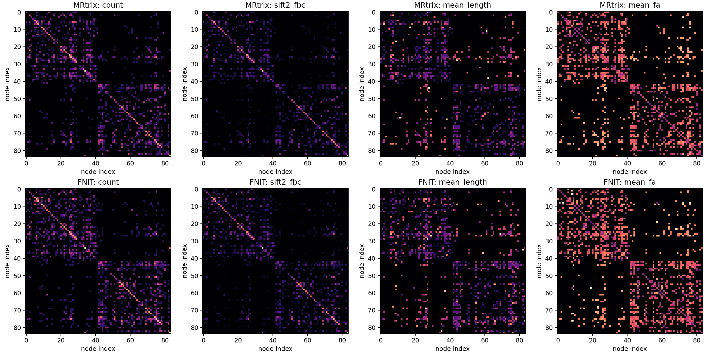

# FreeSurfer subject 目录到 84 节点 atlas：同输入验证

## 输入、函数与输出

`FreeSurferSubject(subject_dir=...)` 读取已完成的官方 `recon-all` 目录，要求 `mri/brain.mgz` 和 `mri/aparc+aseg.mgz`。函数不运行 FreeSurfer。`fs_aparc_atlas(segmentation=...)` 的输入是 T1 网格、非负整数的 `aparc+aseg` 三维张量；输出是同网格 `int32` 标签张量和 84 个 `ConnectomeNode(index, original_label, hemisphere, name)`。背景及未选取的 FreeSurfer ID 为 0。84 行的顺序固定在 [`fs_aparc84.tsv`](../../src/fnit/connectome/data/fs_aparc84.tsv)，来自 MRtrix 3.0.3 `fs_default.txt` 与 FreeSurfer 8.2 ColorLUT 的 ID 对应；不按原始 ID 直接编号。

`UKBConnectome(..., freesurfer_subject_dir=..., atlas="fs-aparc")` 将 atlas 按 DWI→T1 RAS 毫米变换最近邻采样到 DWI 网格；返回的 `result.atlas` / `result.atlas_affine` 是 DWI 网格，`result.nodes` 定义矩阵行列。CLI 另写 `atlas_dwi.nii.gz` 和 `nodes.tsv`。若重采样后某节点没有体素，矩阵仍保留其零行列。

```python
from pathlib import Path
import nibabel as nib
import numpy as np
import torch
from fnit.connectome import FreeSurferSubject, fs_aparc_atlas

subject = FreeSurferSubject(subject_dir=Path("subjects/sub-01"))  # 输入：已完成的 recon-all subject 目录
image = nib.load(str(subject.aparc_aseg))  # 输入：该目录中的 T1 分割
segmentation = torch.as_tensor(np.asarray(image.dataobj).astype(np.int32), device="cuda:0")  # 输入：整数三维标签
atlas_t1, nodes = fs_aparc_atlas(segmentation=segmentation)  # 输出：0..84 的 T1 标签和 84 行节点表
```

独立官方对照命令仅用于 benchmark，不在 FNIT 内部执行：

```bash
labelconvert subjects/sub-01/mri/aparc+aseg.mgz FreeSurferColorLUT.txt fs_default.txt atlas_reference.nii.gz
```

## 真实数据结果

两例分别为公开 ds004666 配对 T1/DWI，及用户提供的配对 UKB T1/DWI。下表比较相同的 `aparc+aseg.mgz`，配准前的 T1 原始网格；私有病例只公开汇总指标。两例均为 256³ 体素，84 节点全部出现，仿射矩阵最大绝对差为 0，FNIT 与官方 `labelconvert` 不一致体素均为 **0 / 16,777,216**。

| 样本与设备 | FNIT 输入载入 | FNIT 纯重编号 | PyTorch 峰值分配 | MRtrix 完整命令墙钟 |
|---|---:|---:|---:|---:|
| ds004666 / H100 | 0.598 s | 0.088 s | 0.375 GiB | 1.15 s / RSS 137 MiB |
| 配对 UKB / CPU | 0.372 s | 0.784 s | 不适用 | 0.97 s / RSS 136 MiB |

时间边界不同：FNIT 列分开计输入读取和算子，MRtrix 列含启动、I/O 和写盘，不能据此声称整进程加速。公开样本原始 [JSON](ds004666/fs_aparc84_gpu.json) 和 [示例脑图](ds004666/figures/fs_aparc84_comparison.png) 可复核；图的第三列为空差异图。


## DWI 网格最近邻重采样

在同一公开 T1 atlas、同一 FNIT TorchFLIRT DWI→T1 世界矩阵和同一 DWI mean b0 模板上，独立运行官方 MRtrix 3.0.3：

```bash
mrtransform atlas_t1.nii.gz atlas_dwi_reference.nii.gz \
  -linear dwi_to_t1_world.txt -interp nearest -datatype uint32 \
  -template mean_b0.nii.gz
```

此命令的 MRtrix 线性矩阵按本例的 DWI→T1 RAS-mm 定义传入，**不加 `-inverse`**。官方 NIfTI 写盘的存储轴顺序为 104×72×104；按照 affine 仅重排到 FNIT 的 104×104×72 网格再比较。FNIT 与官方在 778,752 个体素中有 2 个标签不同；两个源坐标几乎都落在 0.5 体素边界。MRtrix 完整命令 0.25 s、RSS 142 MiB；FNIT H100 已载入 atlas 的重采样核心 0.935 s、PyTorch 峰值分配 0.375 GiB。两个时间范围不同，且 GPU 当时有共享负载。[原始 JSON](ds004666/fs_aparc84_dwi_gpu.json)与可重跑的 [`benchmark_connectome_fs_aparc.py`](../../tools/benchmark_connectome_fs_aparc.py)给出相同输入对照。将 `-inverse` 错用到这份世界矩阵会产生大量错位标签，故变换方向属于接口必要条件。

## 一键流程烟雾验收

公开 ds004666 的已校正 AP DWI（104×104×72×105）、eddy 旋转 bvec 与配对 `recon-all` 目录直接传入 `fnit connectome --atlas fs-aparc --n-seeds 100 --device cuda:0`。不提供 T1 单文件、预制 atlas、BET 掩膜或配准矩阵。完整命令耗时 422.26 s、最大进程 RSS 1,787,484 KiB；接受 42 / 100 条流线。DWI atlas 有 84 个节点，`nodes.tsv` 84 行；四个矩阵均为 84×84。此运行是接口与文件结构验收，100 次播种不足以判断连接矩阵统计一致性，且未采集整链 GPU 峰值显存。追踪阶段已有的 10,000 次种子官方随机基线及误差见 [追踪验证](ds004666/tracking_act_stage.md)。

同一入口也在用户提供的配对 UKB 资料上完成 100 次播种验收：`data_ud.nii.gz` 为 104×104×72×105，使用配套 `bvals`、`data.eddy_rotated_bvecs` 和已完成的 FreeSurfer subject 目录。接受 25 / 100 条；四张 84×84 矩阵数值均有限，`nodes.tsv` 有 84 行，DWI 网格 atlas 84 个节点全部出现。完整进程墙钟 350.10 s，PyTorch CUDA 峰值分配 2.751 GiB。受控影像、逐被试矩阵及含原路径日志只留在服务器；本页只记录脱敏汇总。

合并 GitHub `main` 的 NiBabel 版 TorchFLIRT 后，重新从公开 ds004666 的相同校正 DWI、bval、eddy 旋转 bvec 和 FreeSurfer subject 目录运行 100 次播种。接受 39 / 100 条，`nodes.tsv` 仍为 84 行，DWI atlas 含全部 84 节点，四张 84×84 矩阵数值有限，PyTorch CUDA 峰值分配 2.782 GiB。与上文合并前同样 100 次播种的结果相比，DWI→T1 世界矩阵元素最大绝对差为 0.000632，atlas 差 62 / 778,752 个体素，count 矩阵全元素之和为 61→64。本次未独立采集完整墙钟时间；100 次播种仍只验证入口和输出结构，不能据此评价统计一致性。

## 10,000 次播种的 84 节点矩阵

公开 ds004666 的 FNIT 新入口使用自动 BET、TorchFLIRT、FreeSurfer → 5TT、`fs-aparc`、追踪与 SIFT2，seed 0 接受 3,268 / 10,000 条，完整命令 369.84 s、峰值进程 RSS 1,789,384 KiB。MRtrix 对照使用相同的校正 DWI、配对 FreeSurfer 产物与**相同 FNIT DWI atlas**，但各自的中间 FOD、脑掩膜、配准和 5TT 由对应流程生成，因此这是原始输入层级的整链比较，不是固定中间张量的单算子比较。四矩阵见 [数值报告](ds004666/fs_aparc84_matrix_10k.json)与下图。



固定官方真实 TCK、SIFT2 权重、逐流线长度和 FA，并使用**同一张 atlas** 后，FNIT `build_connectomes` 对 2,764 条流线的 count 84×84 矩阵逐值一致。SIFT2 FBC、mean length、mean FA 最大绝对误差分别为 1.70×10⁻⁶、7.12×10⁻⁶ mm、2.98×10⁻⁸；CPU 矩阵核心耗时 0.470 s。见 [固定 TCK 报告](ds004666/fs_aparc84_fixed_tck.json) 和可复跑的 [`benchmark_connectome_fs_aparc_fixed_tck.py`](../../tools/benchmark_connectome_fs_aparc_fixed_tck.py)。独立整链矩阵的差异不能归咎于已固定的矩阵赋值阶段。

MRtrix 随机对照以 0、10000、20000、30000、40000 为种子，在单线程 `tckgen` 下独立生成；FNIT 以 0–4 为种子，两个软件每次均尝试 10,000 次播种，使用相同的 84 节点 DWI atlas。选择间隔较大的 MRtrix 种子，是因为相邻种子且多线程的两次输出曾出现部分完全相同的流线。五次官方接受 2,675–2,843 条，五次 FNIT 接受 3,268–3,355 条。FNIT seed 1–4 的完整命令墙钟为 391–432 s，PyTorch CUDA 峰值分配均为 2.785 GiB；seed 0 为 370 s，其 GPU 峰值当时未单独记录。

| 84 节点、上三角非对角边指标 | 官方内部 10 对 | FNIT 内部 10 对 | 跨软件 25 对 | 跨软件超出官方范围 |
|---|---:|---:|---:|---:|
| count 非零边 Dice | 0.622–0.675 | 0.647–0.677 | 0.620–0.669 | 2 / 25 |
| count 相对 L1，越低越好 | 0.688–0.734 | 0.656–0.715 | 0.775–0.869 | **25 / 25** |
| count Pearson r | 0.817–0.849 | 0.815–0.856 | 0.768–0.824 | 22 / 25 |
| SIFT2 FBC Pearson r | 0.797–0.851 | 0.797–0.848 | 0.764–0.826 | 14 / 25 |
| 共同边平均长度 nMAE | 0.232–0.271 | 0.242–0.273 | 0.246–0.290 | 6 / 25 |
| 共同边平均 FA nMAE | 0.0967–0.1093 | 0.0979–0.1073 | 0.1006–0.1177 | 9 / 25 |

[完整 5×5 逐配对 JSON](ds004666/fs_aparc84_stability_5x5.json)由 [`benchmark_connectome_fs_aparc_stability.py`](../../tools/benchmark_connectome_fs_aparc_stability.py)生成。count 的跨软件相对 L1 25 对全部超出官方自身区间，故目前不能宣称正式输出与 MRtrix 一致。非零边 Dice 大体处于随机范围，mean FA 只有部分配对超出；这些差异的来源仍可能同时涉及追踪、默认脑掩膜和配准。固定官方 TCK 的矩阵赋值已逐值通过，下一步须固定 FOD、5TT、GMWMI、变换并分别检验 iFOD2/ACT。

## 冻结输入的追踪改动试验

另用公开 ds004666 的同一 FOD、5TT、GMWMI、FA、20 节点 atlas、10,000 个种子位置和初始方向，试验有限 16 候选、校准拒绝采样，以及皮层灰质界面的单向 ACT。三份独立官方参考均由同一套中间图像生成。这项试验与上面的 84 节点整链比较使用不同 atlas，数值不可混作同一验收。四组输入哈希及各矩阵逐参考指标见[冻结输入 A/B JSON](ds004666/tracking_sampling_act_frozen_ab_20260928.json)。

| 追踪方法 | 接受流线 | 追踪用时 | 对三份官方 count 相对 L1 | 共同边 mean FA nMAE |
|---|---:|---:|---:|---:|
| 当前 16 候选、双向 ACT | 2,986 | 16.32 s | 0.298 / 0.302 / 0.260 | 0.085 / 0.098 / 0.086 |
| 校准拒绝采样、双向 ACT | 2,770 | 97.34 s | 0.265 / 0.278 / 0.222 | 0.102 / 0.105 / 0.099 |
| 16 候选、皮层单向 ACT | 2,850 | 17.51 s | 0.283 / 0.283 / 0.249 | 0.104 / 0.103 / 0.099 |
| 校准拒绝采样、皮层单向 ACT | 2,694 | 98.48 s | 0.300 / 0.263 / 0.230 | 0.109 / 0.099 / 0.080 |

组合改动对 count、FA 的影响并不同向，且追踪耗时约为当前方案的 6 倍。因此未将一次性试验脚本的追踪方法并入正式函数。下一步应先做单弧坐标与概率的确定性 oracle，再核对跨步半概率状态、完整 ACT 状态及连续初始方向，然后在多随机种子下复测连接矩阵。

## 尚未完成的验收

1. **追踪统计一致性：**固定同一真实 FOD、5TT、GMWMI、FA、atlas 与配准，逐项验证单弧坐标和概率、连续初始方向、校准拒绝采样及 ACT 的灰质/皮层下状态。分别以 MRtrix 和 FNIT 至少五个独立随机种子生成流线，要求接受比例、长度、空间端点、TDI、count、SIFT2 FBC、mean length 和 mean FA 的跨软件差异进入 MRtrix 自身重复运行的区间；目前 84 节点 count 相对 L1 的 25 / 25 对未通过。
2. **大规模播种：**当前 `Tractogram.paths` 按 Python 张量元组存储，尚未验证 100,000、1,000,000 和原 UKB 10,000,000 次播种。需分块传播与压缩轨迹存储，在同一真实输入上逐级记录完成状态、墙钟、进程内存和 CUDA 峰值；正式 GPU 路径峰值须低于 20 GiB，并与 MRtrix 同硬件同播种量比较时间。
3. **原 UKB 七套 atlas：**当前一键入口只提供 84 节点 `fs-aparc`。Schaefer、Glasser、Tian 的自动组合、节点表和七套逐 atlas 矩阵尚未整链核对。原脚本含 FIRST 的 5TT 属于 `ukb-legacy` 对照；需要另行在配对 UKB 受控样本上验证，不能用公开样本的无 FIRST 结果替代。
4. **配准影响：**最新 TorchFLIRT 迁移使 100 次播种的 DWI atlas 改变 62 个体素。须固定流线与其他中间图像，仅更换官方 FSL 与 TorchFLIRT 变换，测量最终四矩阵的敏感性。
