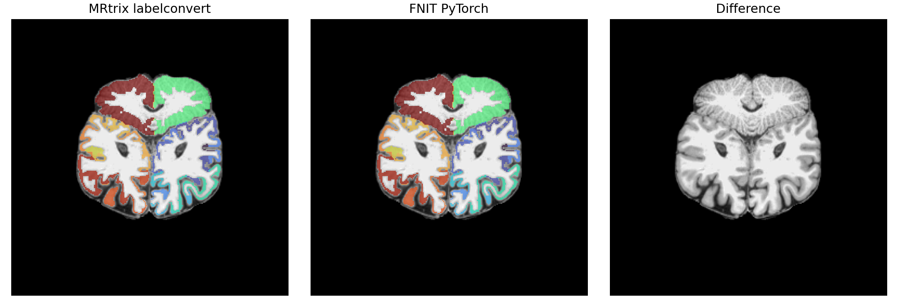

# FreeSurfer subject 目录到 84 节点 atlas：同输入验证

## 输入、函数与输出

`FreeSurferSubject(subject_dir=...)` 读取已完成的官方 `recon-all` 目录，要求 `mri/brain.mgz` 和 `mri/aparc+aseg.mgz`。函数不运行 FreeSurfer。`fs_aparc_atlas(segmentation=...)` 的输入是 T1 网格、非负整数的 `aparc+aseg` 三维张量；输出是同网格 `int32` 标签张量和 84 个 `ConnectomeNode(index, original_label, hemisphere, name)`。背景及未选取的 FreeSurfer ID 为 0。84 行的顺序固定在 [`fs_aparc84.tsv`](../../src/fnit/connectome/data/fs_aparc84.tsv)，来自 MRtrix 3.0.3 `fs_default.txt` 与 FreeSurfer 8.2 ColorLUT 的 ID 对应；不按原始 ID 直接编号。

`UKBConnectome(..., freesurfer_subject_dir=..., atlas="fs-aparc")` 将 atlas 按 DWI→T1 RAS 毫米变换最近邻采样到 DWI 网格；返回的 `result.atlas` / `result.atlas_affine` 是 DWI 网格，`result.nodes` 定义矩阵行列。CLI 另写 `atlas_dwi.nii.gz` 和 `nodes.tsv`。若重采样后某节点没有体素，矩阵仍保留其零行列。

```python
from pathlib import Path
import nibabel as nib
import numpy as np
import torch
from fnit.connectome import FreeSurferSubject, fs_aparc_atlas

subject = FreeSurferSubject(subject_dir=Path("subjects/sub-01"))  # 输入：已完成的 recon-all subject 目录
image = nib.load(str(subject.aparc_aseg))  # 输入：该目录中的 T1 分割
segmentation = torch.as_tensor(np.asarray(image.dataobj).astype(np.int32), device="cuda:0")  # 输入：整数三维标签
atlas_t1, nodes = fs_aparc_atlas(segmentation=segmentation)  # 输出：0..84 的 T1 标签和 84 行节点表
```

独立官方对照命令仅用于 benchmark，不在 FNIT 内部执行：

```bash
labelconvert subjects/sub-01/mri/aparc+aseg.mgz FreeSurferColorLUT.txt fs_default.txt atlas_reference.nii.gz
```

## 真实数据结果

两例分别为公开 ds004666 配对 T1/DWI，及用户提供的配对 UKB T1/DWI。下表比较相同的 `aparc+aseg.mgz`，配准前的 T1 原始网格；私有病例只公开汇总指标。两例均为 256³ 体素，84 节点全部出现，仿射矩阵最大绝对差为 0，FNIT 与官方 `labelconvert` 不一致体素均为 **0 / 16,777,216**。

| 样本与设备 | FNIT 输入载入 | FNIT 纯重编号 | PyTorch 峰值分配 | MRtrix 完整命令墙钟 |
|---|---:|---:|---:|---:|
| ds004666 / H100 | 0.598 s | 0.088 s | 0.375 GiB | 1.15 s / RSS 137 MiB |
| 配对 UKB / CPU | 0.372 s | 0.784 s | 不适用 | 0.97 s / RSS 136 MiB |

时间边界不同：FNIT 列分开计输入读取和算子，MRtrix 列含启动、I/O 和写盘，不能据此声称整进程加速。公开样本原始 [JSON](ds004666/fs_aparc84_gpu.json) 和 [示例脑图](ds004666/figures/fs_aparc84_comparison.png) 可复核；图的第三列为空差异图。



## DWI 网格最近邻重采样

在同一公开 T1 atlas、同一 FNIT TorchFLIRT DWI→T1 世界矩阵和同一 DWI mean b0 模板上，独立运行官方 MRtrix 3.0.3：

```bash
mrtransform atlas_t1.nii.gz atlas_dwi_reference.nii.gz \
  -linear dwi_to_t1_world.txt -interp nearest -datatype uint32 \
  -template mean_b0.nii.gz
```

此命令的 MRtrix 线性矩阵按本例的 DWI→T1 RAS-mm 定义传入，**不加 `-inverse`**。官方 NIfTI 写盘的存储轴顺序为 104×72×104；按照 affine 仅重排到 FNIT 的 104×104×72 网格再比较。FNIT 与官方在 778,752 个体素中有 2 个标签不同；两个源坐标几乎都落在 0.5 体素边界。MRtrix 完整命令 0.25 s、RSS 142 MiB；FNIT H100 已载入 atlas 的重采样核心 0.935 s、PyTorch 峰值分配 0.375 GiB。两个时间范围不同，且 GPU 当时有共享负载。[原始 JSON](ds004666/fs_aparc84_dwi_gpu.json)与可重跑的 [`benchmark_connectome_fs_aparc.py`](../../tools/benchmark_connectome_fs_aparc.py)给出相同输入对照。将 `-inverse` 错用到这份世界矩阵会产生大量错位标签，故变换方向属于接口必要条件。

## 固定官方流线的矩阵赋值

固定官方真实 TCK、SIFT2 权重、逐流线长度、FA 和同一张 84 节点 atlas 后，FNIT `build_connectomes` 对 2,764 条流线的 count 84×84 矩阵逐值一致。SIFT2 FBC、mean length、mean FA 最大绝对误差分别为 1.70×10⁻⁶、7.12×10⁻⁶ mm、2.98×10⁻⁸；CPU 矩阵核心耗时 0.470 s。见[固定 TCK 报告](ds004666/fs_aparc84_fixed_tck.json)和[可重跑脚本](../../tools/benchmark_connectome_fs_aparc_fixed_tck.py)。

当前 216 节点 Schaefer200+Tian S1 一键真实 DWI 运行及图谱基准见[新报告](ds004666/atlas_synthmorph_20260929.md)；当前 iFOD2/ACT 多种子结果见[追踪报告](ds004666/ifod2_rejection_20260929.md)。
