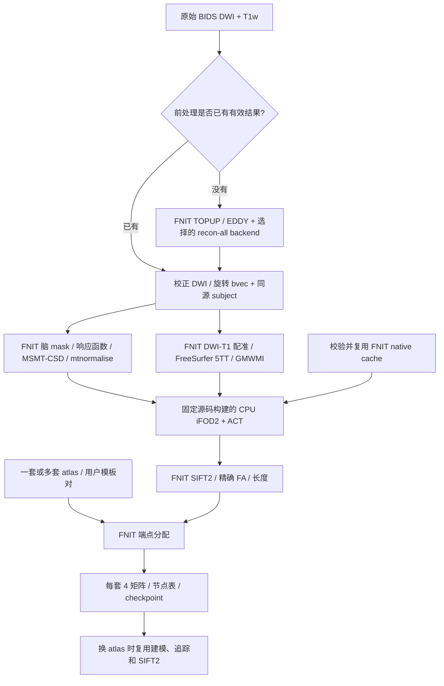
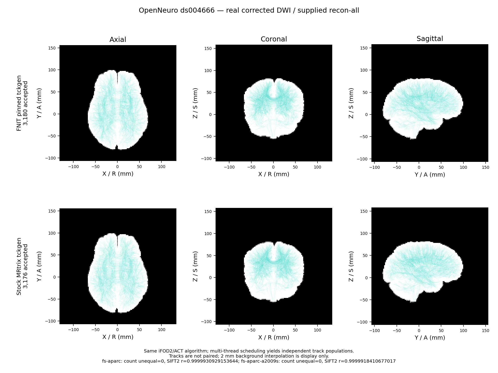

# 原生 MRtrix 追踪与真实 connectome 端到端验证

2026-10-09。正式入口保持 `UKBConnectome_pipeline`。

## 1. 功能与流程

iFOD2/ACT 改为 FNIT 从固定 MRtrix 源码构建并管理的 CPU `tckgen`。
用户不需要安装 MRtrix；FNIT 不查找系统 `PATH` 的 MRtrix 程序。
首次调用下载、校验并编译外置缓存，以后直接复用通过内容校验的程序。
DWI 建模、5TT/GMWMI、SIFT2、精确 FA 采样、atlas 和矩阵继续使用 FNIT 实现。
旧 PyTorch iFOD2/ACT 和专用调参工具已移除。



本轮真实测试从 **已经校正的 DWI + 完成的官方 recon-all** 开始，
实际重新执行全部建模、配准、追踪、SIFT2 和两套 atlas 的 SC。
TOPUP、EDDY 和 recon-all 复用同源已有结果，本轮没有重测其耗时。
这次整链执行与后面的同输入组件对照是两种验证范围。

## 2. Python、输入和输出

```python
from fnit import UKBConnectome_pipeline

corrected_dwi_path = "/data/sub-01/eddy/data.nii.gz"     # 校正后的4D DWI
diffusion_bvals_path = "/data/sub-01/dwi.bval"           # N个b值，s/mm²
rotated_bvecs_path = "/data/sub-01/eddy/rotated.bvec"     # 同次校正的3×N方向
subject_directory = "/data/subjects/sub-01"             # 已完成、只读的同源重建
checkpoint_directory = "/data/sc/sub-01/checkpoints"    # 内容校验后的共享缓存

connectome_pipeline = UKBConnectome_pipeline(device="cuda:0")
connectome_result = connectome_pipeline(
    dwi=corrected_dwi_path,
    bvals=diffusion_bvals_path,
    bvecs=rotated_bvecs_path,
    freesurfer_subject_dir=subject_directory,
    atlas=["fs-aparc", "fs-aparc-a2009s"],                # 两套完整节点定义
    n_seeds=10000,                                     # 尝试预算，不是接受条数
    seed=0,                                           # MRtrix随机种子
    tracking_threads=8,                                # CPU追踪线程数
    checkpoint_dir=checkpoint_directory,
)
for atlas_name, atlas_result in connectome_result.atlas_results.items():
    print(atlas_name, atlas_result.matrices["count"].shape)
```

- DWI：NIfTI `[104,104,72,105]`；bval `[105]`；旋转 bvec `[3,105]`。
- subject：`mri/brain.mgz`、`mri/aparc+aseg.mgz`；a2009s 还需对应分割和左右注释。
  T1 brain/分割为 `[256,256,256]`。全部输入大小和 SHA 见 [实际结果 JSON](results.public.json)。
- 追踪输入：归一化 WM SH `[104,104,72,45]`，5TT `[256,256,256,5]`，GMWMI `[256,256,256]`。
  通过未压缩 NIfTI-2 保留 float32 体素、float64 sform 和独立体素间距，未重采样。
- 流线：RAS-mm float32 点；长度 mm；FA 无量纲。接受种子坐标不在官方 TCK 中，
  `accepted_seeds=None` 表示未知；`seeds_attempted` 保留用户预算，实际生成数另见 TCK header。
- 两套 SC：`fs-aparc` 为 `84×84`、`fs-aparc-a2009s` 为 `164×164`；
  每套 count、SIFT2 FBC、加权平均长度、加权平均 FA 四矩阵。
  count 为整数，其余矩阵 float32；SIFT2 权重本体 float64。
- checkpoint 同时绑定科学输入、源码、程序/库 SHA 和追踪参数。
  原生程序变化或旧 PyTorch checkpoint 不会被当作本版结果复用。

全部 pipeline 参数、BIDS 和用户模板格式见[主手册](../../../docs/connectome/README.md)；
追踪的全部组件参数见[追踪手册](../../../docs/connectome/TRACKING_OPERATORS.md)。

## 3. 安装与命令行复现

使用项目主页的 Conda 环境；每个环境使用独立 native cache，不跨环境移动缓存。
当前支持 Linux/WSL。首次构建需要网络和 C++ 编译工具；完成后可离线复用。

```bash
export FNIT_NATIVE_CACHE=/data/fnit_resources/this_conda_environment/connectome_native
fnit-setup-connectome-native --jobs 8

fnit UKBConnectome_pipeline \
  --dwi /data/sub-01/eddy/data.nii.gz \
  --bvals /data/sub-01/dwi.bval \
  --bvecs /data/sub-01/eddy/rotated.bvec \
  --freesurfer-subject-dir /data/subjects/sub-01 \
  --atlas fs-aparc fs-aparc-a2009s \
  --n-seeds 10000 --seed 0 --tracking-threads 8 \
  --checkpoint-dir /data/sc/sub-01/checkpoints \
  --output-dir /data/sc/sub-01 --device cuda:0
```

`--tracking-threads` 控制 CPU 追踪，`--device` 控制其余 PyTorch 阶段。
Python 的旧 `compile_arc=False` 仅兼容默认调用；True 报错，CLI 的 `--compile-arc` 已移除。

独立真实验证工具，需显式指定独立官方程序目录；这不是生产依赖：

```bash
python tools/benchmark_connectome_native_pipeline.py \
  --dwi /data/sub-01/eddy/data.nii.gz --bvals /data/sub-01/dwi.bval \
  --bvecs /data/sub-01/eddy/rotated.bvec \
  --freesurfer-subject-dir /data/subjects/sub-01 \
  --atlas fs-aparc fs-aparc-a2009s --reuse-atlas fs-aparc-a2009s \
  --n-seeds 10000 --seed 0 --tracking-threads 8 --reference-threads 8 \
  --strict-tracking-seeds 100 --reference-repeats 3 --device cuda:0 \
  --official-bin-dir /data/reference/mrtrix/bin --output-dir /data/validation/new_run

python tools/benchmark_connectome_native_tracking.py \
  --fod /data/validation/new_run/candidate/wm_fod.nii \
  --five-tissue /data/validation/new_run/candidate/five_tissue.nii \
  --gmwmi /data/validation/new_run/candidate/gmwmi.nii \
  --official-tckgen /data/reference/mrtrix/bin/tckgen \
  --n-seeds 100000 --strict-seeds 10000 --threads 8 --repeats 3 \
  --device cuda:0 --output-dir /data/validation/new_tracking_run
```

| benchmark 参数 | 含义 |
|---|---|
| `dwi / bvals / bvecs / freesurfer-subject-dir` | 同源科学输入；参考只消费本次实际生成的追踪/矩阵输入。 |
| `atlas / reuse-atlas` | 实际计算的atlas及核心缓存复用检查；默认fs-aparc，reuse默认关闭。 |
| `n-seeds / seed` | 整链播种预算/种子，默认10000/0。独立tracking工具默认100000。 |
| `tracking-threads / reference-threads` | 整链和独立官方追踪线程，均默认8；tracking工具对应`threads=8`。 |
| `strict-tracking-seeds / strict-seeds` | 单线程相同种子的逐字节检查预算，分别默认100/10000。 |
| `reference-repeats / repeats` | 8线程独立追踪次数，均默认3；不自动宣告重复范围验收。 |
| `device` | FNIT张量设备，默认cuda:0。 |
| `assignment-radius` | 整链端点径向搜索mm，默认4。 |
| `brain-mask / response-mask / fod-mask / normalise-mask / fa-map / transform` | 默认None，实际重算；提供时为固定同网格图或DWI→T1 RAS 4×4矩阵文件，必须记录来源。 |
| `official-bin-dir / official-tckgen` | 隔离参考的绝对程序位置，不通过系统安装发现。 |
| `fod / five-tissue / gmwmi` | tracking工具使用真实文件，不更改体素或header。 |
| `output-dir` | 必须是新目录，私有JSON、TCK和影像不直接发布。 |

## 4. 原软件命令

生产使用的算法参数与独立官方参考一致。省略 step/minlength 时采用官方默认：
FOD header 体素间距几何平均的 0.5 倍/2 倍。显式 `-angle 45`、`-samples 3`、`-power 0.5`。

```bash
MRTRIX_RNG_SEED=0 /data/reference/mrtrix/bin/tckgen wm_fod.nii tracks.tck \
  -algorithm iFOD2 -seed_gmwmi gmwmi.nii -act five_tissue.nii \
  -seeds 10000 -select 0 -maxlength 250 -angle 45 -cutoff 0.1 \
  -samples 3 -power 0.5 -nthreads 8 \
  -config RealignTransform false -config NIfTIUseSform true \
  -config NIfTIAutoLoadJSON false -config TckgenEarlyExit false

tcksift2 tracks.tck wm_fod.nii weights.txt -act five_tissue.nii -nthreads 8
tcksample tracks.tck fa.nii mean_fa.txt -precise -stat_tck mean -nthreads 8
tck2connectome tracks.tck atlas.nii count.csv -symmetric -assignment_radial_search 4
tck2connectome tracks.tck atlas.nii fbc.csv -symmetric -assignment_radial_search 4 -tck_weights_in weights.txt
tck2connectome tracks.tck atlas.nii length.csv -symmetric -assignment_radial_search 4 -tck_weights_in weights.txt -scale_length -stat_edge mean
tck2connectome tracks.tck atlas.nii fa.csv -symmetric -assignment_radial_search 4 -tck_weights_in weights.txt -scale_file mean_fa.txt -stat_edge mean
```

完整实际 command 二进制 SHA 和时间已筛选到结果 JSON；参考读取同一 NIfTI-2 文件并使用上列几何配置。
生成的原始影像、完整 TCK、逐轨迹权重和服务器路径未发布。

## 5. 当前实测：精度、耗时和脑图

真实数据：OpenNeuro ds004666，CC0，配对 T1/DWI；校正和官方重建输入身份可追溯。
实测单张 NVIDIA A100-SXM4-80GB、CPU 8线程；PyTorch2.5.1+cu118、FP32/FP64与默认TF32，未用低精度。
独立官方参考与自带程序均来自 MRtrix 固定提交 `026e850d171ec2a12f09865d31b8332d23d7ecf6`。

### 追踪

| 范围 | FNIT | 独立官方参考 | 结论 |
|---|---:|---:|---|
| 100 seeds、1线程 | 28条 | 28条 | 点坐标与offset逐字节一致。 |
| 10k seeds、1线程 | 3173条 | 3173条 | 134261个点与offset逐字节一致。 |
| 100k seeds、8线程，三次中位数 | 14.35 s组件完整调用；13.24 s命令 | 13.60 s命令 | 完整调用还包含运行时校验、输入SHA、TCK读入、packed H2D；文件输入不写暂存影像，不将不同计时边界当作纯kernel倍数。 |

100k 三次组件完整调用时间 19.25/14.33/14.35 s，官方命令 15.42/13.39/13.60 s；
接受条数 FNIT 31872/31788/31886，官方 31839/31804/31894。
8线程调度会改变接受流线和顺序，因此不要求线程模式逐轨迹配对。
三次10k官方参考接受3151–3176条，本次整链3180条；length KS为0.00194–0.01189。
这是分布观测，不以三个样本的最小/最大值宣告全部SC已经进入随机重复范围。
完整样本见 [100k JSON](tracking_100k.public.json)。

### 固定本次同一 TCK、FOD、5TT、FA、atlas 的下游对照

| 矩阵 | fs-aparc：r / relative L1 | fs-aparc-a2009s：r / relative L1 |
|---|---|---|
| count | 完全逐值一致，误差0 | 完全逐值一致，误差0 |
| SIFT2 FBC | 0.99999309 / 0.2178% | 0.99999184 / 0.2494% |
| mean length | 0.999999884 / 0.0178% | 0.999999866 / 0.0186% |
| mean FA | 0.999999952 / 0.00980% | 0.999999934 / 0.01071% |

表中统计使用非对角上三角，JSON同时记录完整矩阵、共同支持和非有限值。
两atlas support Dice=1；无非有限值不匹配。
逐轨迹 SIFT2 权重 r=0.99987339、relative L1=0.3778%；精确FA r=0.9999999991。
加权矩阵仍有小量SIFT2数值差异；不是四矩阵逐字节等价。
本轮没有重新验证整套官方 TOPUP/EDDY、配准、响应/CSD、解剖与独立SC的全流程等价。

### 真实整链耗时

| FNIT步骤 | 秒 | 本轮独立官方秒 |
|---|---:|---:|
| BET / dwi2mask / tensor | 2.74 / 1.43 / 1.03 | 未重测 |
| 5TT / GMWMI | 0.127 / 0.048 | 未重测 |
| DWI→T1 | 11.30 | 未重测 |
| Dhollander响应 | 1.38 | 未重测 |
| MSMT-CSD / mtnormalise | 220.81 / 0.35 | 未重测 |
| 10k iFOD2/ACT组件完整调用 | 5.32（内部适配器5.10、命令1.62） | 1.67–1.68命令 |
| SIFT2 | 22.10 | 17.40 |
| 精确FA | 0.023 | 0.020 |
| 两atlas构建 / NN / 四矩阵，各套 | 0.003–0.020 / 0.001–0.002 / 0.005–0.006 | 每矩阵独立命令另见JSON |
| **corrected DWI + recon-all → 两套SC** | **274.17** | 未重跑官方整链 |
| 更换/选择已有atlas并复用共享核心 | 3.05 | — |

完整调用含同步分步骤诊断和checkpoint I/O；不含首次构建、导出与独立参考。
追踪组件完整调用对应整链报告的阶段秒数；内部适配器为 `native_provenance.adapter_seconds`
（公开报告 `native_adapter_seconds`），从运行时校验后开始。100k 文件输入工具的
`rows[*].adapter_seconds` 则是包含运行时校验的外层完整组件调用，两个字段计时边界不同。
本环境首次构建阶段合计68.46 s，源码archive已事先缓存，不包含下载时间。
allocated/reserved峰值7.69/8.77 GB；CFFF容器未可靠取得完整进程CUDA显存，
不由allocator峰值宣告进程总占用严格低于20GB。
换atlas后core=`skipped`，路径digest与权重逐字节不变。



图为RAS-mm正交投影，背景仅为显示重采样，抽样不改变真实追踪与矩阵。
完整指标：[端到端结果](results.public.json)、[脑图记录](native_tracking_qc.public.json)。

## 6. 更新与验收记录

| 版本 | 内容与验收范围 |
|---|---|
| 本版，2026-10-09 | 源构建CPU MRtrix iFOD2/ACT；删除旧tracker与17个专用benchmark；真实corrected-DWI整链、两atlas、10k单线程精确oracle、100k同机比较及缓存复用。 |
| `6ae32945` | 旧PyTorch eager SH无损优化；[历史报告](../tracking_cfff_20261009/README.md)，不作为本版原生追踪结果。 |
| `e26a766a` | 旧完整100k进程显存审计；不替代本版显存测量。 |

CPU connectome全套：1014 passed、6 CUDA缺失skip、362 subtests passed；
最后安装隔离及CLI缓存失效专项51项通过（其中原生运行时49项）；服务器相关GPU/CPU回归129项通过，无skip。
测试覆盖header/sform、未知种子、源码/binary/library内容校验、配置隔离与缓存失效。
测试中的模拟控制只用于接口/失败行为；以上benchmark均使用真实MRI及实际官方程序。
普通命令行入口另完整运行成功，实际保存两atlas的八个CSV；尺寸、对称性、非有限值与文件SHA见[CLI收据](cli.public.json)。该次重新计算，未宣告缓存命中，整数分辨率墙钟275秒。
安装包在服务器独立target目录安装，未修改既有Conda环境；35个科学源码SHA与整链测试一致。外置native cache离线校验成功，系统PATH无tckgen；真实100seeds单线程的28条轨迹与独立官方再次逐字节一致。wheel大小、SHA与范围见[安装收据](package.public.json)。

## 7. 源码、资源许可和参考文献

- [MRtrix固定源码](https://github.com/MRtrix3/mrtrix3/tree/026e850d171ec2a12f09865d31b8332d23d7ecf6)，
  [MPL-2.0许可](https://github.com/MRtrix3/mrtrix3/blob/026e850d171ec2a12f09865d31b8332d23d7ecf6/LICENCE.txt)。
  外置缓存保留源码和许可证；只改自动系统/用户配置读取的隔离开关，不改算法。
- [FNIT assets-v1](https://github.com/weikanggong1/Fudan-Neuroimaging-toolkit/releases/tag/assets-v1)
  固定清单优先；本次清单无这三个源码archive，校验后从固定原作者URL获取。
  MRtrix/Eigen3.4.0/zlib1.3.1大小、SHA、补丁SHA和实际二进制SHA见结果JSON。
- [OpenNeuro ds004666](https://doi.org/10.18112/openneuro.ds004666.v1.0.8)，
  [CC0声明](https://raw.githubusercontent.com/OpenNeuroDatasets/ds004666/master/dataset_description.json)。
  输入来源：[校正记录](../ds004666/corrected_input_provenance.public.json)、[重建记录](../ds004666/freesurfer_recon_all.public.json)。
- [UKB-connectomics](https://github.com/sina-mansour/UKB-connectomics)。
- Tournier et al., MRtrix3, *NeuroImage* (2019), [doi:10.1016/j.neuroimage.2019.116137](https://doi.org/10.1016/j.neuroimage.2019.116137)。
- Smith et al., ACT, *NeuroImage* (2012), [doi:10.1016/j.neuroimage.2012.06.005](https://doi.org/10.1016/j.neuroimage.2012.06.005)。
- Smith et al., SIFT2, *NeuroImage* (2015), [doi:10.1016/j.neuroimage.2015.06.092](https://doi.org/10.1016/j.neuroimage.2015.06.092)。
