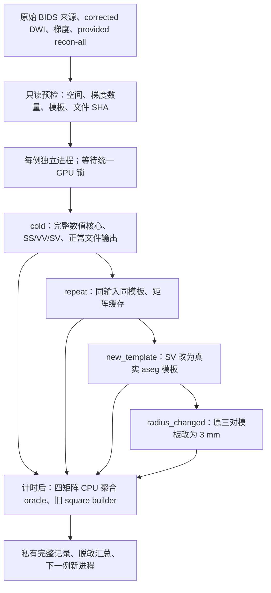

# 两模板 SC：十例真实 CLI 与缓存评测

## 1. 功能与流程

`run_ten_benchmark.py` 验证同一全脑 ACT 追踪结果生成 surface–surface（SS）、volume–volume（VV）及 surface–volume（SV）矩阵，并检查换模板后能否复用已经完成的共同步骤。默认十例为公开 ds001226 的 CON01、CON03–CON11，每例固定 100,000 次 seed attempt。

本轮默认读取已绑定的 corrected DWI、EDDY rotated bvecs 和官方 FreeSurfer subject directory，同时用原始 BIDS 数据核对输入来源。首次重新计算 FNIT 数值核心；本轮不重跑此前已经完成的 TOPUP、EDDY 和 recon-all。`--input-mode raw` 可另行运行真实原始 DWI 适配器，报告会明确区分这两种输入。



端点依据现有 FNIT radial voxel-centre 规则匹配。跨模板考虑轨迹的两种方向：同一轨迹落到同一矩阵单元时只计一次，落到两个不同单元时分别贡献一次。因此 `matrix_count_sum` 可以大于 `matched_unique_streamlines`。追踪始终是同一全脑 ACT 追踪，模板不改变 seed 或追踪范围。

## 2. Python、输入与输出

先准备 FNIT 主页规定的 Conda 环境，并显式指定冻结源码的 `PYTHONPATH`。该脚本是评测工具；正式 Python 接口见 [模板配对说明](../../../docs/connectome/template_pairs.md)。

```python
from pathlib import Path
from validation.connectome.paired_pipeline_20261003.run_ten_benchmark import preflight

# 私有输入绑定记录包含 corrected DWI、梯度、subject_dir 和原 BIDS selector。
preflight_report = preflight(
    bindings_path=Path("input_bindings.json"),
    selected_cases=["sub-CON01"],
    output=Path("benchmark/preflight.private.json"),
    source_commit="ACTUAL_FROZEN_GIT_COMMIT",
)
assert preflight_report["cuda_initialized"] is False
```

### 输入

- `input_bindings.json`：既有真实输入绑定记录；`cases` 下每例提供 `selected_inputs` 的 DWI/bvals/bvecs/FreeSurfer 目录，`prior_cli_arguments` 中的 BIDS root/selector，以及 `anatomy.files` 的 SHA-256。不从文件名推测空间。
- BIDS：原始 AP DWI、bval/bvec、反向 PE 影像、T1w、`dataset_description.json`，其内容保留为来源记录。
- Corrected DWI：三维空间加 volume 轴的 NIfTI；bval 和 rotated bvec 数量必须与第四维一致。
- 官方 subject directory：已有 `brain.mgz`、`ribbon.mgz`、white/pial、aparc/a2009s annotation 和三套 volume labels。SS 使用 native `aparc→aparc.a2009s`；VV 使用 T1 `aparc+aseg→aparc.a2009s+aseg`；SV 使用 native `aparc→T1 aparc.a2009s+aseg`。替换阶段使用第五套真实 `aseg.mgz`。

### 输出

- 只读预检私有 JSON：输入大小和 SHA、空间信息、实际模板依赖、源码清单 SHA；包含服务器路径，公开前必须脱敏。
- 每例 `connectome/pairs/<name>/`：四类 CSV、`rows.tsv`、`columns.tsv`、两端 DWI labels 影像和 `pair.json`。两轴分别保留全部声明节点，包括空节点。
- 每例 `benchmark.private.json`：四阶段实际 wall time、核心/矩阵 SHA、缓存状态、实际 seed attempts/accepted streamlines、CPU oracle、分步 host duration、CUDA allocator 和本进程 NVML 采样峰值。
- `public-summary`：从实际私有记录提取脱敏结果；缺失或失败病例原样标记，不能计为完成。

### 全部评测参数

| 参数 | 默认值与含义 |
|---|---|
| `mode` | `preflight/run/worker/public-summary`：预检、逐例调度、单例执行、公开汇总 |
| `--bindings` | 预检所需私有输入绑定 JSON |
| `--preflight` | run/worker 所需、与实际冻结源码一致的预检报告 |
| `--run-root` | 新运行目录；worker 拒绝覆盖已有病例目录 |
| `--report` | preflight/public-summary 的输出 JSON |
| `--case` | worker 的一个病例 ID |
| `--cases` | 默认全部十例；只读或诊断可选择子集，十人评测须使用全部十例 |
| `--source-commit` | 必填：真实冻结 commit；另外计算实际导入源码清单 SHA |
| `--device` | `cuda:0`，单 GPU |
| `--threads` | `4`，worker CPU 线程数 |
| `--n-seeds` | `100000`，attempt 预算；不能把较小预算标作本十例评测 |
| `--seed` | `0`，追踪随机种子 |
| `--eddy-gp-seed` | `12345`，原始 DWI 模式 EDDY GP 种子 |
| `--radius` | `4.0` mm，cold/repeat/new_template 的端点半径 |
| `--replacement-radius` | `3.0` mm，radius_changed 的端点半径 |
| `--input-mode` | `corrected` 或 `raw`；前者本轮提供 corrected DWI，后者启动原始 DWI 预处理 |
| `--gpu-uuid` | 实际所用 GPU UUID；推荐显式给出，避免 CUDA index/NVML 对应不明 |
| `--memory-sample-interval` | `0.5` 秒，own PID/process tree 采样间隔 |
| `--gpu-lock` | `/tmp/fnit-recon-five-20261002-gongwk.gpu.lock`，与当前重建任务共享的 GPU 锁 |

## 3. 命令行

```bash
FNIT_BENCHMARK_SOURCE=/path/to/frozen/fnit
FNIT_BENCHMARK_PYTHON=/path/to/conda/bin/python
FNIT_BENCHMARK_COMMIT=ACTUAL_FROZEN_GIT_COMMIT
FNIT_BENCHMARK_RUN=/path/to/new/ten-person-run
FNIT_BENCHMARK_BINDINGS=/path/to/private/input_bindings.json
FNIT_BENCHMARK_GPU_UUID=ACTUAL_GPU_UUID
export PYTHONPATH="$FNIT_BENCHMARK_SOURCE/src"

# 只读预检不初始化 CUDA；必须与接下来 worker 使用同一源码。
CUDA_VISIBLE_DEVICES="" "$FNIT_BENCHMARK_PYTHON" \
  "$FNIT_BENCHMARK_SOURCE/validation/connectome/paired_pipeline_20261003/run_ten_benchmark.py" \
  preflight --bindings "$FNIT_BENCHMARK_BINDINGS" \
  --report "$FNIT_BENCHMARK_RUN/preflight.private.json" \
  --source-commit "$FNIT_BENCHMARK_COMMIT"

# 每例一个新进程，逐例运行四阶段；默认十人、100k attempts、corrected 输入。
"$FNIT_BENCHMARK_PYTHON" \
  "$FNIT_BENCHMARK_SOURCE/validation/connectome/paired_pipeline_20261003/run_ten_benchmark.py" \
  run --preflight "$FNIT_BENCHMARK_RUN/preflight.private.json" \
  --run-root "$FNIT_BENCHMARK_RUN/results" --source-commit "$FNIT_BENCHMARK_COMMIT" \
  --gpu-uuid "$FNIT_BENCHMARK_GPU_UUID" --threads 8 --n-seeds 100000 --seed 0

# 汇总现有记录，不触发计算。
"$FNIT_BENCHMARK_PYTHON" \
  "$FNIT_BENCHMARK_SOURCE/validation/connectome/paired_pipeline_20261003/run_ten_benchmark.py" \
  public-summary --run-root "$FNIT_BENCHMARK_RUN/results" \
  --report "$FNIT_BENCHMARK_RUN/summary.public.json" \
  --source-commit "$FNIT_BENCHMARK_COMMIT"
```

`run` 遇到单例失败即停止，保留该例私有记录用于排查；单独重跑需要新的病例输出目录。正式十例完成情况以 summary 的 `complete_cases` 为准。

## 4. 对应原软件

提供的 subject directory 可由官方命令生成：

```bash
recon-all -i subject_T1w.nii.gz -sd subjects -s subject_id \
  -all -parallel -openmp 8
```

固定 TCK 和单套 volume atlas 的官方端点匹配可用：

```bash
tck2connectome tracks.tck atlas_dwi.nii.gz connectome.csv \
  -assignment_radial_search 4 -tck_weights_in sift2_weights.txt -symmetric
```

跨模板且允许重叠的矩形双向矩阵，没有直接等同本定义的单条 `tck2connectome` 命令。本评测用逐轨迹、独立 CPU 聚合检查矩阵定义；端点空间匹配复用既有 FNIT radial 实现。这一结果不能表述为本轮独立 MRtrix 原始 DWI→SC 一致性。

## 5. 真实精度、耗时与脑图

2026-10-03 的新 harness 已实际完成十例只读预检：每例 corrected DWI 为 `96×96×60×102`，梯度数量匹配，13 个模板/几何依赖文件与 7 个原始来源文件可读取，绑定的 FreeSurfer 内容 SHA 一致；没有初始化 CUDA。脱敏记录见 [real_input_preflight.public.json](real_input_preflight.public.json)。

新增独立聚合 oracle 三个 CPU 测试实际通过（2.53 秒）：同格去重、不同格双向计数、合法 NaN 保留，以及 NaN 位置错必失败。模拟固定输入测试只检查规则，不替代真实 benchmark。

十例新的 GPU 四阶段运行已全部完成：公开 ds001226 的 CON01、CON03–CON11，冻结数值源码 `8bc337c4`，每例 100,000 次 seed attempt、追踪种子0、CPU 8线程和单张 H100。实际 Python/PyTorch/CUDA 构建与驱动版本见[现场环境](environment.public.json)。每例正常 CLI 分别执行 cold、repeat、new_template、radius_changed，共40次调用。实际完整记录的脱敏版本见 [十例公开汇总](ten_case_summary.public.json)，[指标汇总](ten_case_metrics.public.json)及[逐例时间CSV](ten_case_times.csv)。

| 病例 | 首次计算 s | 同模板复用 s | 换模板 s | 改半径 s | 接受轨迹 |
|---|---:|---:|---:|---:|---:|
| CON01 | 1083.41 | 19.83 | 14.57 | 18.78 | 14431 |
| CON03 | 948.81 | 18.17 | 12.30 | 18.63 | 11582 |
| CON04 | 1009.95 | 18.41 | 12.83 | 20.00 | 12460 |
| CON05 | 711.95 | 18.44 | 13.53 | 19.50 | 19299 |
| CON06 | 337.35 | 22.35 | 13.52 | 19.36 | 19002 |
| CON07 | 900.18 | 17.80 | 12.69 | 18.70 | 14113 |
| CON08 | 1470.26 | 18.83 | 13.99 | 20.87 | 17598 |
| CON09 | 1706.12 | 17.70 | 12.38 | 18.65 | 13089 |
| CON10 | 1506.55 | 18.18 | 12.27 | 17.99 | 18179 |
| CON11 | 1440.65 | 18.53 | 13.99 | 20.37 | 19587 |


平均墙钟：首次 1111.52 s、同模板复用 18.83 s、换模板 13.21 s、改半径 19.28 s。cold 的范围为 337.35–1706.12 s；这些是共享 H100 实际负载下的观察，未做独占 GPU 的速度归因。各阶段墙钟均包含正常 CLI 检查、核心/缓存和文件输出，排除 GPU 排队及计时后的 oracle/SHA。

所有400个统计数组与独立逐轨迹CPU聚合一致：有限值最大绝对误差0、NaN位置一致。十例同模板均与旧square builder一致；后三阶段30次完整核心恢复均与cold一致，其中包含全部CSR轨迹点/offset、FOD、FA、SIFT2与affine。repeat的30对矩阵命中缓存并逐值一致。

40阶段的显存监测健康检查全部通过。本进程采样峰值 5.2995 GB；PyTorch allocated/reserved 的全阶段峰值分别为 2.9191/3.3848 GB。进程峰值为按0.5秒周期采样的观测，并非连续数学上界；allocator峰值由所有内部reset区间合并。

### 分步骤 host duration

以下为十例cold的host function duration中位数，存在异步与嵌套，不是独立CUDA kernel时间，不能相加替代wall time。

| 函数 | 十例中位数 s |
|---|---:|
| `fit_mrtrix_dhollander_tensor` | 0.5139 |
| `_registration` | 3.7574 |
| `estimate_mrtrix_dhollander` | 1.6646 |
| `fit_mrtrix_msmt_csd` | 502.0151 |
| `normalise_mrtrix_three_tissue` | 0.3736 |
| `probabilistic_tractography` | 634.4364 |
| `estimate_sift2_weights` | 13.1799 |
| `sample_streamline_mean_precise` | 0.1337 |
| `_compute_shared_core` | 1020.8352 |
| `prepare_template` | 5.5499 |
| `build_pair_connectomes` | 0.6826 |

最终整合源 `7ba73de2` 的完整CPU门槛为 **890 passed、29 skipped、362 subtests passed、1 warning，61.26 s**，见[收据](final_cpu_validation.public.json)和[脱敏测试摘要](final_cpu_tests.txt)。GPU冻结与最终源的15个数值worker字节一致，共同核心及实际非空模板计算AST一致；原始数值生产调用也相同，见[源码核对](source_equivalence.public.json)。本轮GPU仍明确绑定冻结源码，后续输入/缓存保护修复由CPU门槛覆盖。

这比较的是相同 FNIT 轨迹上的聚合和缓存恢复；端点空间匹配复用 FNIT 既有规则。它没有独立运行官方 MRtrix 全流程，不能给出本轮 dMRI→SC 对 MRtrix 的综合精度百分比。

实际保存结果的 [CON01 输出 QC 图](CON01_pair_outputs.png) 展示最终 3 mm 的 SS/VV/SV 两端 labels、共享 FA 背景和真实矩形 count 矩阵。原始模板输入投影示例另见 [CON01 输入脑图](../template_pairs_20261003/task_02/real_template_inputs.png)。

新评测实际输出后，可用 CPU Pillow 绘制输出 QC。该图直接读取保存的两端 DWI atlas、共享核心 FA 以及矩形 count CSV，不使用输入模板示意替代结果，也不重新配准或采样。

```bash
CUDA_VISIBLE_DEVICES="" "$FNIT_BENCHMARK_PYTHON" \
  "$FNIT_BENCHMARK_SOURCE/validation/connectome/paired_pipeline_20261003/plot_pair_outputs.py" \
  --output-dir "$FNIT_BENCHMARK_RUN/results/sub-CON01/connectome" \
  --output-png "$FNIT_BENCHMARK_RUN/figures/CON01_pair_outputs.png" \
  --case-label "ds001226 CON01"
```

绘图参数：`--output-dir` 是实际 CLI 输出目录；`--output-png` 是新图路径；`--checkpoint-root` 可指定非默认共享检查点位置（默认 output/checkpoints）；`--pairs` 默认 `SS VV SV`；`--case-label` 默认匿名 subject，展示公开病例 ID 前核对许可。FA 与 labels 网格不一致则报错，绘图不隐藏重采样。图中明确标记已保存矩阵的实际半径；完整四阶段结束后该值通常为最终阶段的 3 mm。

原始 ds001226 v5.0.1 的现场 `dataset_description.json` 记录 `License=CC0`。公开图只展示该公开数据的匿名病例；原始数据与逐文件校验仍不复制到该仓库。

验收记录分别回答：

- `repeat`：四矩阵数值逐值一致（NaN 位置一致），矩阵缓存 `skipped`。
- 后三阶段：核心含完整轨迹点/offset、FOD、FA、SIFT2、affine 等 SHA 与 cold 相同，核心缓存 `skipped`。
- 每阶段每模板：count 精确一致，浮点统计零容差比较并明确 NaN mask；同模板另外与旧 square builder 精确比较。
- CUDA：记录 allocated/reserved 峰值和本任务 process tree 的 NVML 采样峰值。NVML 至少三次有效采样、没有错误/未解析 device、没有异常采样间隙才判断 `<20 GB`；采样结果不代表两个采样点之间的连续上界。

实际 CLI wall time 包括正常输入检查、核心计算/缓存读写及文件输出，排除 GPU 锁排队、评测预检、计时后的 oracle/SHA。分步时间是未增加同步的 host function duration，存在嵌套和异步，不能求和为 GPU kernel 总时间。

## 6. 更新与评测记录

文中短提交 ID 是私有开发或实测冻结树的版本标识；最终 squash 发布后，不保证能在 GitHub `main` 提交历史中检出。实测版本仍按公开源码 SHA 清单和核对收据绑定，发布提交另列；冻结版本的结果不能改标为发布版本已重新实测。

[发布源码与实测范围收据](publication_validation.public.json)绑定最终源码清单、CPU门槛、冻结GPU十例及独立官方重建。源码清单的重算方法写在该收据中；官方重建接入模块与实际完成新T1运行的版本逐字节一致，见[源码核对](source_equivalence.public.json)。

| 版本 | 已完成的证据 |
|---|---|
| 2026-10-03 harness v1 | 正常 paired CLI 的四阶段、统一 GPU 锁、独立 worker、来源 SHA、完整核心恢复检查、本进程显存监测 |
| 2026-10-03 NaN 修正 | 与原统计一致保留合法 FA NaN，比较报告明确有限值误差与 NaN mask |
| 2026-10-03 CPU 预检 | 十例真实输入通过；三项独立 oracle 测试通过；GPU 运行不在该记录中 |
| 2026-10-03～04（北京时间），frozen `8bc337c4` 十例 | 100k attempts ×10、SS/VV/SV四阶段共40CLI；400统计数组oracle一致；30次核心恢复一致；全部显存监测通过；实际输出QC |

官方来源另完成一例真实原始T1新重建，6069.76 s；第二次1.02 s skipped，349文件内容未变；同T1既有官方七项科学输出与几何严格一致，见[官方接入记录](../paired_generated_official_20261003/README.md)。这是一例独立来源验证。十例SC使用`provided`，不把已有subject检查或历史FNIT重建计入本轮新重建耗时。

## 7. 原实现与参考文献

- [FNIT 模板配对接口](../../../docs/connectome/template_pairs.md)、[FNIT GitHub](https://github.com/weikanggong1/Fudan-Neuroimaging-toolkit)。
- [OpenNeuro ds001226 数据集](https://openneuro.org/datasets/ds001226)。输入及模板仅现场读取，不在该目录重新发布影像资源。
- [UKB-connectomics 原流程](https://github.com/sina-mansour/UKB-connectomics)。
- [MRtrix tck2connectome 文档](https://mrtrix.readthedocs.io/en/latest/reference/commands/tck2connectome.html)。Tournier JD 等，*NeuroImage* 2019，MRtrix3。
- [FreeSurfer recon-all 文档](https://surfer.nmr.mgh.harvard.edu/fswiki/recon-all)。Fischl B，*NeuroImage* 2012，FreeSurfer。
