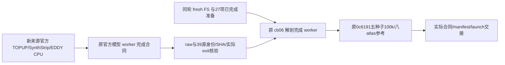

# CON11 独立官方 CPU 末例衔接

## 1. 功能与流程

此调度器只处理新下载的 `sub-CON11`。等待真实官方模型完成后，复用同轮官方 recon-all 与已完成的27项结构准备，执行官方 DWI–T1 配准、八 atlas 转到 DWI、五次100k追踪与下游矩阵。数值工具保持原冻结字节；原九例和旧 CON11 等待目录不改。



默认隐藏GPU；完成阶段每例CPU8，只有一个新病例。官方追踪保留原 `-nthreads 0`，下游CPU8。此工具仅用于隔离 benchmark。

## 2. Python、输入、输出与参数

```python
from pathlib import Path
import hashlib
import os
import subprocess
import sys

followon_tools_directory = Path("/results/frozen-CON11-followon-tools")
configuration_path = followon_tools_directory / "configuration_v3.json"
configuration_sha256 = hashlib.sha256(configuration_path.read_bytes()).hexdigest()
cpu_environment = {**os.environ, "CUDA_VISIBLE_DEVICES": "", "PYTHONDONTWRITEBYTECODE": "1"}

# 首先只读检查；去掉 --inspect-only 后等待真实合同并派发原冻结数值工具。
subprocess.run([
    sys.executable, str(followon_tools_directory / "run_CON11_official_followon_v3.py"),
    "--config", str(configuration_path), "--config-sha256", configuration_sha256,
    "--inspect-only",
], env=cpu_environment, check=True)
```

CLI参数：`--config`为冻结JSON；`--config-sha256`为其真实原字节SHA；`--inspect-only`只核验现有来源/准备/原队列；`--verify-model-only`另外核验实际 completed 模型、canonical raw/packing/39源身份，均不启动MRI或追踪。

配置中各项用途：

| 项 | 输入与含义 |
| --- | --- |
| `shared_root/case_id` | 实际共享根与唯一`sub-CON11`。 |
| `modeling_root` | 新官方模型根；只接受同例completed consumer、model report及实际freeze/config。 |
| `baseline_root/raw_root` | 同轮原baseline fresh FS与canonical BIDS T1/AP/PA/梯度/JSON。 |
| `known_inputs` | 27输出prepare、模板、只读reader、raw manifest、原参考binary manifest、packing/source/driver receipts的实际path/size/SHA。 |
| `frozen_sources` | 原anatomy cohort/worker、MRtrix controller/reference/helper/common、模型worker/wrapper/config/packing guard。 |
| `old_anatomy` | 原driver PID/start ticks/argv及九例completed、旧11waiting/无旧模型合同守卫；不发送信号。 |
| `state_root/anatomy_output/reference_output_root/reference_output/reference_dry_run` | 全新调度状态、单例解剖输出、单例参考输出、只读实际参考计划。均不能已存在或是link。 |
| `anatomy_python/reference_python` | 已核验环境解释器；数值子进程使用原配置解释器。 |
| `anatomy_source_commit` | 原冻结`cb06c0ca`，不改数值参数。 |
| `orchestrator_sha256` | 本调度器原字节SHA。 |
| `poll_seconds/wait_timeout_seconds` | 30秒轮询、21600秒有限模型等待；等待耗时单列。 |
| `reference` | MRtrix3.0.3、seed0–4、100000 attempted seeds、tracking0/downstream8；八atlas的节点数由实际合同定义。 |
| `environment/GPU/CPU_threads` | CUDA隐藏、线程8、现有Conda lib路径；GPU=false。 |
| `completion_claims` | 配置阶段均false；只有实际产物通过后状态报告升级。 |

输入影像均保留原始网格：DWI为`96×96×60×102`，梯度`3×102`；归一化WM FOD为45系数，5TT为5通道；八atlas为整数NIfTI及真实`nodes.tsv`。新解剖合同分别绑定原prepare和新DWI合同，不复制FNIT FOD/FA/mask。

输出调度目录包含`freeze/status`、实际model输入记录、分别sealed的anatomy/reference execution config、PID/start ticks/argv/源SHA的launch、实际exit/日志、成功后的`completed_handoff.json`。解剖输出沿原cohort结构保存新consumer；参考输出保存`reference_manifest.json`、seed0–4各自TCK/SIFT2/八atlas矩阵。三段时间独立，复用prepare不称新的连续冷调用。

## 3. 命令行

```bash
CUDA_VISIBLE_DEVICES='' PYTHONDONTWRITEBYTECODE=1 python run_CON11_official_followon_v3.py \
  --config configuration_v3.json --config-sha256 ACTUAL_CONFIGURATION_SHA256 --inspect-only

# 通过真实只读检查后，在新独立状态目录等待并执行。
CUDA_VISIBLE_DEVICES='' PYTHONDONTWRITEBYTECODE=1 python -u run_CON11_official_followon_v3.py \
  --config configuration_v3.json --config-sha256 ACTUAL_CONFIGURATION_SHA256
```

`launch_CON11_followon_v2.py`封存一次真实启动：`--source/--source-sha256`指定本调度器及摘要，`--config/--config-sha256`指定其配置及摘要，`--source-commit`记录实际提交，`--python`指定现有解释器，`--receipt`是必须不存在的启动JSON。它保存PID、UID、start ticks、完整argv、环境及工具SHA；旧目录与进程不参与启动。

`audit_actual_CON11_followon_v1.py`只读审计实际完成结果：`--config/--config-sha256`与上项一致，`--launch/--launch-sha256`是原真实launch receipt及摘要。输出JSON到stdout；它读取现有结果和原矩阵reader，不运行solver。

`retire_owned_idle_waiter_v2.py`仅用于本次空闲旧元数据waiter的来源切换：`--launch/--launch-sha256`绑定旧真实启动，`--status`绑定旧状态，`--replacement-config/--replacement-config-sha256`与`--replacement-source/--replacement-source-sha256`绑定新只读核验版本，`--receipt`是新增退出记录。它核验完整进程身份与没有数值child，随后只发送一次SIGTERM；实际执行记录见[actual_retirement_v2.json](actual_retirement_v2.json)。

## 4. 原软件调用

复用原官方结构prepare。新complete仍使用官方FLIRT `-cost normmi -dof 6`、MRtrix transformconvert/transformcalc、八atlas最近邻mrtransform，具体完整argv由原worker报告保存。追踪保留iFOD2/ACT/GMWMI、`-seeds 100000 -select 0 -maxlength 250 -angle 45 -cutoff 0.1 -power 0.5 -samples 3 -trials 1000`，随后官方SIFT2、FA precise采样和endpoint/matrix构造。原入口及SHA见配置，不新增数值solver。

## 5. 本次状态与benchmark

CON11 已完成独立官方链的末例衔接：模型13条命令成功；结构27项准备直接复用；新解剖完成阶段20项输出通过；五种子、八atlas的198条官方追踪及下游命令全部成功。2026-10-03 01:54:54 UTC，最终审计在 gpucw1 重读139个直接绑定文件、160个矩阵及40个节点表，SHA、节点语义、shape和原矩阵 reader 检查均通过。

| 本次真实阶段 | wall（秒） | 范围 |
| --- | ---: | --- |
| 官方解剖完成 controller | 30.9793 | 原27项准备复用后的配准、八atlas与合同发布 |
| 官方 reference worker | 491.8555 | 五次100k attempted seeds及全部下游；原追踪threads=0，下游threads=8 |
| 官方 reference controller | 493.4548 | 上项含单例调度与退出读取 |
| 最终只读审计 | 3.6303 | SHA及原矩阵 reader；未运行MRI solver |

seed0–4分别接受19473、19539、19424、19313、19195条轨迹。八atlas节点数依次为 fs-aparc 84、aparc+Tian-S1 84、a2009s+Tian-S1 164、Glasser+S1 376、Glasser+S4 414、Schaefer200+S1 216、Schaefer500+S4 554、Schaefer1000+S4 1054。

[compact_completed_handoff.json](compact_completed_handoff.json)给出真实model/anatomy/reference合同与原controller配置的完整路径和SHA；[actual_final_readonly_audit.json](actual_final_readonly_audit.json)保存逐文件和逐矩阵审计。模型、既有prepare、等待、此次完成和追踪时间分列，此表不表示连续cold raw pipeline时间。FNIT对官方的统计重复范围由十例总控按原验收规则汇总；此来源审计只确认实际执行与文件一致性。预处理数值与脑图见[官方CPU预处理](../task_01/official_rawprep_v1/README.md)。

## 6. 更新记录

- v3：实际模型由上游新 `bf62ce93` metadata wrapper 完成，v3绑定其真实 alignment 指定的 dispatcher_v2；原 `616b3f01` 科学 worker、配置参数和原39源不变。旧 v2 waiter只等待旧入口，没有运行MRI；精确身份核验后退役，原报告保留。
- v2：使用原冻结 `f73e3840` cohort controller 调用原 `0c6191` 数值 worker；单例配置和真实 controller 状态按原逐病例来源 mapper 格式记录。
- v1：仅完成只读预检，未启动数值工作。原 configuration.json 与初始只读 receipt 保留；v2 采用新增文件，不覆盖 v1。
- 原v4/旧A、B控制器及旧CON11目录保持原历史，不补合同或alias。prepare原时长、等待、新完成和追踪分别记录。

## 7. 原实现与参考

- [原独立官方参考工具](../../../../tools/reference/benchmark_connectome_raw_official.md)与[anatomy worker](../../../../tools/reference/benchmark_connectome_anatomy_official.py)。
- [UKB-connectomics](https://github.com/sina-mansour/UKB-connectomics)、[MRtrix3](https://github.com/MRtrix3/mrtrix3)、[FSL](https://fsl.fmrib.ox.ac.uk/fsl/docs/)。
- [原始数据和许可](../task_01/README.md)。本次不复制官方程序、权重或MRI，不读取许可证内容。
