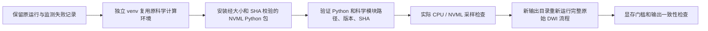

# 单 GPU 显存监测：实际 NVML 环境校验

## 1. 功能与流程

这里保存 2026-10-02 gpucw1 的实际监测环境记录。原 wall 工具已经支持 `pynvml`，但旧 Python 环境没有这个包，因此调用 `nvidia-smi`。baseline CON05 出现两次查询超时；candidate CON04 出现八次超时，最大采样间隔 13.793 秒。两例计算成功，显存测量不满足验收，原结果和失败状态保留。



此目录的证据止于 E；F/G 的实际运行报告另行绑定。`actual_setup_runtime.py` 是已执行的服务器专用取证脚本，包含当次真实路径，不是 FNIT 用户 API。

## 2. Python 调用与输入输出

安装项目主页的 `environment.yml` 会安装 `nvidia-ml-py==13.580.82`。监测只读取驱动信息；计算仍使用原 FNIT PyTorch 求解器。

```python
import os
import pynvml

physical_gpu_uuid = os.environ["BENCHMARK_GPU_UUID"]  # 实际物理 GPU UUID
pynvml.nvmlInit()
try:
    gpu_handle = pynvml.nvmlDeviceGetHandleByUUID(physical_gpu_uuid)
    gpu_processes = pynvml.nvmlDeviceGetComputeRunningProcesses(gpu_handle)
    gpu_memory_bytes_by_pid = {
        int(gpu_process.pid): int(gpu_process.usedGpuMemory)
        for gpu_process in gpu_processes
    }
finally:
    pynvml.nvmlShutdown()
```

输入是物理 GPU UUID 和原运行环境；输出是 PID 对应的显存字节数。完整 wall 工具还筛选自己的进程及后代，并记录 PyTorch allocated/reserved ledger。`runtime_preflight.json` 保存原、新 Python 二进制及 Torch、Torch C-extension、NumPy、NumPy C-extension、nibabel 的实际版本、文件路径与 SHA。`SHA256.json` 可校验本目录记录。

## 3. 命令行调用

从仓库根目录运行：

```bash
conda env update --file environment.yml --prune
conda activate fnit
# CUDA_VISIBLE_DEVICES 与 BENCHMARK_GPU_UUID 必须指向同一张实际 GPU。
export BENCHMARK_GPU_UUID="GPU-填入实际UUID"
export CUDA_VISIBLE_DEVICES="1"
export PYTORCH_CUDA_ALLOC_CONF="expandable_segments:True"
python tools/benchmark_connectome_raw_bids.py \
  --mode wall --eddy-gp-seed 12345 \
  --gpu-uuid "$BENCHMARK_GPU_UUID" --memory-sample-interval 0.5 \
  --report /data/benchmark/new_run.json -- \
  UKBConnectome_pipeline --bids-root /data/raw_bids --subject CON01 \
  --freesurfer-subject-dir /data/fresh_recon_all/sub-CON01 \
  --atlas fs-aparc --n-seeds 100000 --seed 0 \
  --device cuda:0 --output-dir /data/benchmark/new_output
```

`--memory-sample-interval` 是进程显存采样间隔，单位秒；`--gpu-uuid` 标识物理设备，不能用逻辑 `cuda:0` 替代。示例只展示一个 atlas；正式 raw10 的八 atlas、其他参数及原输入 SHA 均由冻结配置保留。新输出目录禁止复用旧 DWI 校正产物。

## 4. 原软件调用

监测对照命令为：

```bash
nvidia-smi --query-compute-apps=gpu_uuid,pid,used_gpu_memory \
  --format=csv,noheader,nounits
```

该命令输出 MiB；NVML 返回字节。实际探针在同一 GPU、同一 PID 上得到相同的 843055104 字节。它不是 TOPUP、EDDY、MRtrix 或 FreeSurfer 的科学输出比较。

## 5. 最新实际结果与精度、时间

新 venv 使用原 Python 实际二进制和原科学模块；路径、版本、SHA 均一致。原科学 Conda 环境未修改，原 wall 工具 SHA `a34f8ee9…` 未修改。实际驱动为 535.216.03，Torch 构建 CUDA 为 11.8，两者分别记录。

实际监测探针采集 12 个样本，无查询错误，最大采样间隔 0.626365 秒。探针未创建 CUDA context，自己的 GPU 显存为 0；这不构成科学运行的 20 GB 验收。显存门槛仍为 **20000000000 字节**，分别检查 allocated、reserved 和采样的进程树显存。采样最大值不能证明连续时间上的数学上界。

这是监测环境测试，没有脑图或配准输出；实际脑图见 [raw10 pipeline 说明](../../../../README.md)。baseline/candidate 原矩阵结果不因监测故障被改写，也不被当作新监测合格结果。

## 6. 更新与 benchmark 记录

- 原 `nvidia-smi` 运行及两例监测失败：`original_monitor_failures.json`。
- NVML 包原站、版本、许可、49008 字节及 SHA：`download_provenance.json`；不在仓库再分发 wheel。
- 实际独立环境创建、科学模块校验与探针：`runtime_preflight.json`。
- 后续重新计算使用新 namespace，原失败报告、原 driver 和配置 SHA 继续作为来源绑定保留。

## 7. 原实现与参考

- [NVIDIA NVML API](https://docs.nvidia.com/deploy/nvml-api/nvml-api-reference.html)。
- [NVIDIA Python bindings 13.580.82](https://pypi.org/project/nvidia-ml-py/13.580.82/)；原站元数据记载 BSD 许可。
- [FNIT wall 工具说明](../../../../tools/benchmark_connectome_raw_bids.md)。
