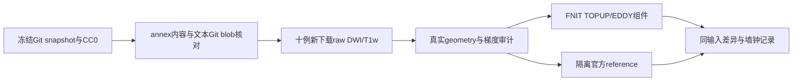
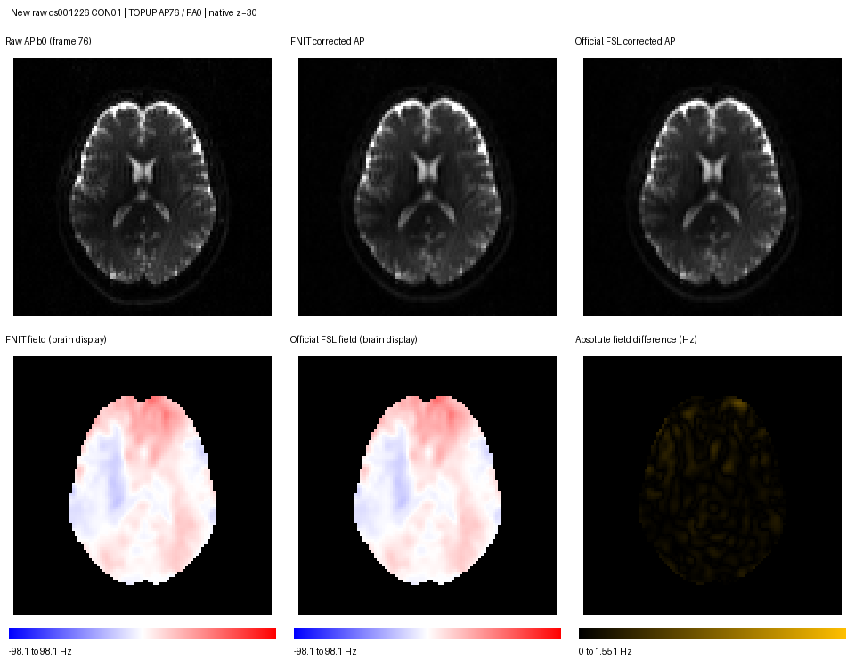
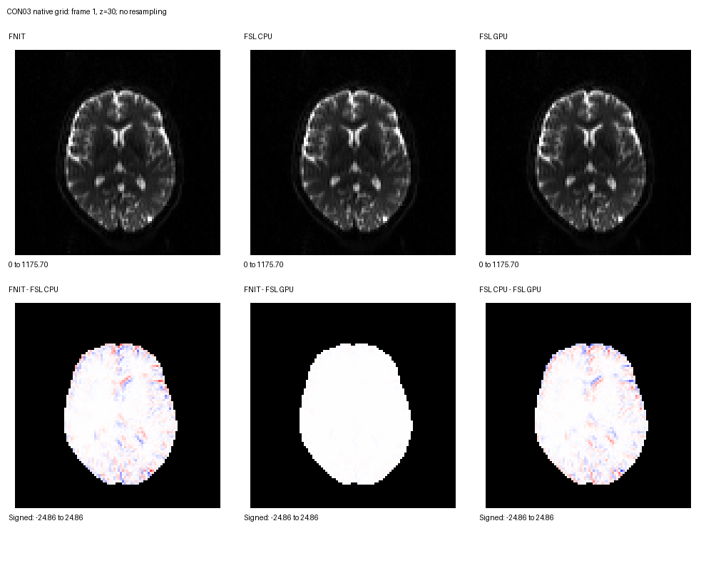
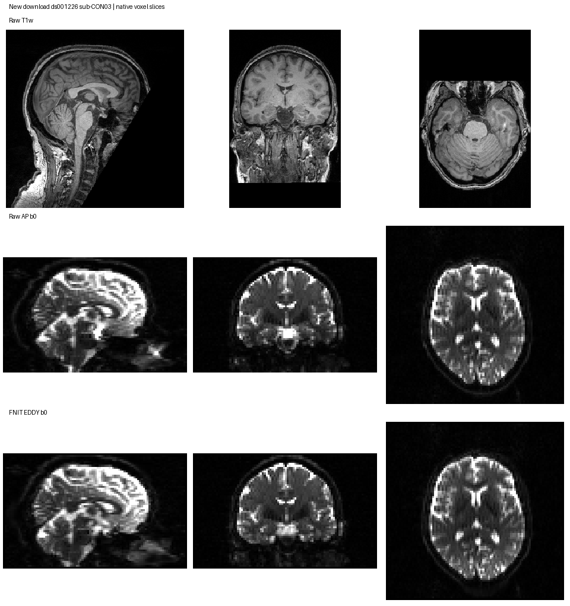

# 十例公开 raw BIDS 与 TOPUP/EDDY 真实验证

## 1. 功能简介

本目录复现十例公开 DWI/T1w 的下载、来源校验和独立 TOPUP/EDDY 组件比较。数据为 ds001226 的 CON01、CON03–CON11，同为 ses-preop。冻结 Git snapshot 为 `fb4d0fda44f2ab7a732fb4ab6cd62add09dc1cd7`；这里不把它称为已核验 Git tag 的 v5.0.0。

不可变 README 列出 11 个 control subjects、T1w MPRAGE、多 shell AP HARDI 和短反向 PE DWI，将 derivatives 单列。本轮只下载上游 raw BIDS acquisition 文件，不读取上游 derivatives。原 JSON 包含扫描仪 `NORM` 和 dcm2niix 转换信息；去面部状态未确认。CON02 的 AP j-/PA i- 对应 world PE 点积 −1.9135×10⁻⁸，已排除，以新下载 CON11 补足。



## 2. Python 调用、输入、输出与参数

```python
from pathlib import Path
import subprocess
import sys

validation_directory = Path("validation/connectome/tenraw_20261002/task_01")
raw_bids_directory = Path("/data/new_ds001226_raw")  # 新目录，首次下载必须为空
subprocess.run(
    [sys.executable, str(validation_directory / "download_new_raw.py"),
     "--output-root", str(raw_bids_directory),
     "--audit-geometry"],                         # 用已有 nibabel/numpy 审计原网格
    check=True,
)
```

下载脚本使用 Python 标准库；`--audit-geometry` 使用项目 Conda 环境已有 nibabel/numpy，无新增推理依赖。

| 参数 | 默认值 | 作用 |
|---|---|---|
| `--output-root` | 必填 | 新 raw BIDS 根目录；首次拒绝非空目录 |
| `--resume` | False | 只恢复带本脚本原始 download_manifest 的同 snapshot 下载；已有文件重新做完整校验 |
| `--verify-existing` | False | 只读核对已有数据；不写影像或清单，不声称本次重新下载 |
| `--expected-manifest` | 同目录 raw_manifest.json | 本轮已发布的采集文件 SHA-256 证据；正式manifest保持原字节 |
| `--description-provenance` | 同目录 dataset_description_provenance.json | 分别绑定冻结Git与历史实际S3顶层description的来源、大小、SHA、License与DOI |
| `--workers` | 3 | 每例并发下载数，必须正整数 |
| `--timeout` | 30 秒 | 单次网络读取超时，必须正数 |
| `--retries` | 5 | 网络/流式下载重试数，必须正整数 |
| `--audit-geometry` | False | 审计 DWI/梯度帧数、T1维度、AP/PA矩阵/间距/刚体几何与world PE |

输出保留同 subject/session 的 `anat/*T1w.nii.gz/.json`、`dwi/*AP/PA_dwi.nii.gz/.json/.bval/.bvec`；每例十个文件。`download_manifest.json` 记录 snapshot、开始/完成时间、每文件 URL、Git blob、annex 预期摘要/字节数、SHA-256、S3 ETag/LastModified/versionId（上游缺失则 null）和是否经复核复用。下载先写 `.partial`，校验通过才原子改名；不重采样、不改梯度、不猜 JSON。

本轮 manifest 核验了 33 个 NIfTI（包括排除例）：源 annex 为 MD5E，因此先核对原作者 MD5/字节数，再保留下载 SHA-256；不能把 MD5E 原键称为上游 SHA256E。采集文本使用 Git blob 的 `blob SIZE` + literal NUL + 原字节 SHA-1 核对。S3 README 与 snapshot Git README 内容不同，两个版本分开保存；扫描数据内容均与 snapshot annex 匹配。顶层description需另按实际来源核对，不能据影像匹配而宣称所有文件同snapshot。

顶层description有两个真实版本：冻结Git文件1209 B，Git blob `69da97c1a079b5301d8d540341a74863868bef28`，SHA-256 `a38087df2ec5b9ecc8b62ead254f684ae3fb8e17450303cbbba7f774d0584d21`，License=CC0、DOI=`doi:10.18112/openneuro.ds001226.v5.0.0`；本轮实际S3下载文件也为1209 B，但SHA-256为`84185f9c387ae232ddbe87e20b329bacf82b9b5dafe9bde63b64c9bc78bed6f2`，DOI为v5.0.1，属于mutable-source，不能绑定成同snapshot字节。两份原字节分别保存为 `dataset_description.snapshot.json`、`dataset_description.actual_s3.json`；来源sidecar为 `dataset_description_provenance.json`，没有回写正式raw或冻结manifest。

新版首次下载写入已核验冻结Git description；`--verify-existing`读取实际顶层description，并核对来源、大小、SHA、Git blob、License与DOI。历史S3文件仅当匹配已发布sidecar才能通过，并明确报告 `matches_frozen_snapshot_bytes=false`；未知或同大小变更文件拒绝。`--resume`也验证已有description，不以冻结字节静默覆盖。此前只读审计未覆盖实际顶层description。本次最终真实十例只读内容/几何审计通过，9项完整性测试通过；重跑遇GitHub匿名API限流，使用已有冻结tree和固定commit raw GitHub blob逐个核验Git SHA，访问路径及脚本SHA见 `dataset_description_verify_transport.json`，不是重新下载影像。校验范围区分采集文件和mutable顶层元数据。

## 3. 命令行调用

```bash
# 新下载十例；在项目主页的 Conda 环境中运行。
python validation/connectome/tenraw_20261002/task_01/download_new_raw.py \
  --output-root /data/new_ds001226_raw --audit-geometry

# 同一次中断下载恢复，每个已有文件仍重新核对源内容。
python validation/connectome/tenraw_20261002/task_01/download_new_raw.py \
  --output-root /data/new_ds001226_raw --resume --audit-geometry

# 本轮真实已有 raw 的只读审计，不算新下载 benchmark。
python validation/connectome/tenraw_20261002/task_01/download_new_raw.py \
  --output-root /data/new_ds001226_raw --verify-existing --audit-geometry
```

## 4. 原软件调用

TOPUP 官方参考使用 FNIT 实际选中 AP76/PA0 的同一两帧输入、同一 acqparams 与 FSL 6.0.7.4 `b02b0.cnf` 九级配置。`fslroi/fslmerge` 输出明确警告原 orientation 不一致，采用 voxel-based orientation；警告保留。打包不重采样，整个体素数组与 affine 和 FNIT 逐值相同；它不证明 TOPUP 优化结果逐值等价。

```bash
topup --imain=B0_AP_PA.nii.gz --datain=acqparams.txt \
  --config=b02b0.cnf --out=fieldmap_out --fout=fieldmap_fout --iout=fieldmap_iout

eddy_cpu --imain=AP.nii.gz --mask=nodif_brain_mask.nii.gz \
  --acqp=acqparams.txt --index=eddy_index.txt --bvecs=AP.bvec --bvals=AP.bval \
  --topup=fieldmap_out --out=data --flm=quadratic --resamp=jac --slm=linear \
  --niter=8 --fwhm=10,8,4,2,0,0,0,0 --ff=10 --sep_offs_move --nvoxhp=1000 \
  --repol --rms --initrand=12345 --ref_scan_no=0
```

GPU 参考只将二进制换成同安装的 `eddy_cuda10.2`，输入、mask、TOPUP系数、梯度、index、seed=12345、参考帧和其余参数相同。生产使用 FNIT PyTorch；官方二进制仅隔离 reference。完整绝对路径命令、实际二进制 SHA 与输入 SHA 均在 JSON 中，未由安装目录猜测二进制源 commit。

## 5. 最新真实精度、时间与脑图

两个新 raw pilot 的组件准备均完成，以下从共享锁获取后开始，包含CUDA设置、staging、TOPUP、脑掩膜准备与EDDY保存；脚本导入在锁前，不包括recon-all和连接组下游。

| Pilot | TOPUP (s) | EDDY准备 (s) | EDDY运行与保存 (s) | 实测锁内组件墙钟 (s) | GPU进程峰值 (GB) | 锁等待 (s，单列) |
|---|---:|---:|---:|---:|---:|---:|
| CON01 | 11.042 | 3.058 | 298.363 | 313.197 | 13.300 | 3464.909 |
| CON03 | 38.135 | 1.842 | 297.917 | 338.602 | 13.304 | 53.579 |

前次 CON01 CUDA 初始化失败日志保留，不计入完成时间。第一次独立 TOPUP checkpoint 冷加载观测为 30.845 s；官方同输入 TOPUP 为 nodecw10 CPU 8线程 149.493 s。不同启动状态/设备记录分开，不将它们作为候选优化提速。

TOPUP 同输入差异：field 全网格 RMSE 0.101430 Hz、P99绝对差 0.410045 Hz、max 1.551040 Hz；校正 b0 RMSE 0.417327、max 38.218628。field/校正影像/coefficient 的 affine 均相同；全部 neq、范围、SHA 和 movement 参数差异见 `TOPUP_CON01_comparison.json`。



CON03 官方 EDDY CPU 8线程完整八轮耗时 3015.365 s；FNIT H100 同参数运行保存耗时 297.917 s。二者同 raw、梯度、mask、TOPUP系数、GP seed=12345 和参考帧0。脑内影像 RMSE 3.547079、P99绝对差 13.465144、max 118.475121，脑内相关性 0.999090；96个 DWI 梯度角 max 0.602759°、RMS 0.354594°；outlier map 有5个元素不同。全部影像、参数、rms、梯度和outlier矩阵差异保留在 `EDDY_CON03_cpu_comparison.json`。未作绝对官方等价判定。官方 GPU EDDY 已实际完成：804.173 s，采样进程峰值 1.168 GB，锁等待 7037.796 s 单列；CPU/GPU每项输入SHA、seed及参考帧逐项相同。相对 FNIT 的脑内 RMSE 3.588110、P99绝对差 13.539359、max 121.516594；脑内相关性 0.999068；96个DWI梯度角 max 0.530284°、RMS 0.312973°。完整差异见 `EDDY_CON03_gpu_comparison.json`。

官方 CPU 与官方 GPU 之间也有差异：同输入脑内 RMSE 0.735681、P99绝对差2.660933、max47.794289；96个DWI梯度角 max0.100546°、RMS0.062212°，outlier map有1个元素不同。完整参数列差异见 `EDDY_CON03_official_CPU_GPU_comparison.json`；这是不同二进制/设备对照，不是同一二进制的重复性测量。



脑图为 native frame=1、z=30，三幅影像共用灰度范围，三幅差异图共用带符号范围；不重采样。`EDDY_CON03_brain_comparison.json` 保存原文件SHA和显示范围。可在项目含Pillow/nibabel/numpy的环境复现：

```bash
python validation/connectome/tenraw_20261002/task_01/plot_eddy_reference.py \
  --fnit /data/pilot/eddy/data.nii.gz --cpu /data/reference_cpu/data.nii.gz \
  --gpu /data/reference_gpu/data.nii.gz --mask /data/pilot/eddy/nodif_brain_mask.nii.gz \
  --output /data/figures/EDDY_brain.png --frame 1 --slice 30
```

`--fnit`、`--cpu`、`--gpu` 是同一DWI校正输出，`--mask` 是同网格脑掩膜，`--output` 是PNG路径，五项必填。`--frame` 默认1、`--slice` 默认30，均使用从0开始的体素/帧索引；输出PNG和同名JSON。不相同的矩阵或affine直接报错。

AP b0 复用 ABBA：原路径冷启动 A=8.372800 s，复用 B=0.754086/0.712599 s，暖启动原路径 A=3.725004 s；四次脑掩膜和 index 的文件 SHA 全同，参考帧都为0。CON01 的非零参考帧76也完成ABBA：冷A=7.182359 s，复用B=0.732580/0.700545 s，暖A=4.062653 s；四次mask/index SHA均相同，参考帧均为76。两例均验证这一真实输入准备路径的省重算行为，不是完整 EDDY 或整条 pipeline 的速度比较。



完整事件profiler的计算和保存已完成，9个科学data.*文件SHA全同，科学QC全同（仅排除时间/显存），见 `EDDY_CON03_profile_output_check.json`。但事件树/pybind11转换占用巨大主机内存，VmHWM观察峰值279.562 GB；在root指示下已停止CPU事件聚合，标记 `profiling_failed`，没有发布kernel、H2D、D2H或CPU self时长。已保存影像、参数、梯度、离群结果和原日志；失败元数据见 `profile_eddy_full_CON03_cancelled.json` 与 `profile_CPU_memory_observation.json`。GPU锁在停止前已释放，后续任务已取得锁；只终止核验过的本任务PID46045。

停止前实际GPU快照确认本次profiler位于physical0 `GPU-26e41f63-1a65-6b3e-5370-fa9a2934ca8e`，该GPU同时有其他PID，记录在取消JSON中。root formal约定physical1 `GPU-e25cac06-0ce8-a833-abf9-09ab18c9c9ba`；不能把这次profiler说成同一formal GPU或独占GPU。此前组件和官方GPU参考未在运行时保存UUID/完整共享负载，字段明确记为未采集，不从后续快照补猜，也不据这些记录宣称同设备稳定提速。

低开销功能计时方案保留在服务器实验归档，尚未完成真实运行验证，未随本次代码发布。其设计不再收集完整事件图；本轮没有 kernel、H2D、D2H 或 stream-span 的实测结论。

## 6. 最近版本和 benchmark 记录

- 冻结 `f436de5` 的旧 raw入口对 CON01 affine 差异报错；该原始失败事实保留。正式 baseline 由 root 加共同 raw geometry 兼容补丁 `405a1cbe`，不包含 b0复用优化；固定 GP seed 由两侧共同 benchmark wrapper 传递。
- `5d9737d6`：固定seed兼容入口、AP-only显式设备和T1输入指纹。
- `2066d69f`、`139040a7`：FSL first-header真实证据、strict默认保留、同矩阵/间距/刚体合法性检查，拒绝shear与handedness改变；同次TOPUP b0复用；recon失败可同输入恢复。
- `25550466`：十例来源清单、CON03组件脑图和TOPUP参考差异。
- `beda0e9b`：官方 recon executable/build-stamp SHA 记录。
- `d19d4de9`：CON01成功报告、CON03真实ABBA、CPU EDDY参考、TOPUP脑图、公开可重复下载脚本及README来源差异。
- 本次：官方GPU EDDY真实耗时/显存与全部参数差异、官方CPU/GPU直接差异、CON01非零参考帧ABBA、EDDY同帧脑图和完整EDDY插桩输出严格一致性。
- 本次后续：全事件profiler因CPU汇总成本过大终止并明确记为失败；保留完整科学结果；低开销替代计时方案尚待真实验证，保留在服务器实验归档。此前真实十例采集内容/几何审计通过、4项完整性回归通过；此前未验证实际顶层description，本次已补来源分流核对，9项CPU来源完整性回归通过。

组件 CON01/CON03 官方 recon 已完成；组件 dispatcher取消，其余八例使用root正式新FS结果作诊断输入。完整 formal pipeline 的墙钟由root独立fresh namespace实测，不能拼加这些组件时间。

- 本次来源修正：分别保存Git/S3顶层description，不改正式manifest；只读/恢复校验实际顶层文件，补同大小变更与未知来源拒绝测试；profiler链接改为现场PyTorch 2.5.1。

## 7. 参考文献、许可和原软件

- [OpenNeuro ds001226 源库](https://github.com/OpenNeuroDatasets/ds001226)；冻结Git dataset_description 声明CC0和DOI v5.0.0；实际S3顶层description为v5.0.1，逐版本来源见sidecar。数据来源绑定Git content而非推断tag。
- Aerts et al. 2018, Modeling Brain Dynamics in Brain Tumor Patients Using the Virtual Brain, eNeuro, [DOI](https://doi.org/10.1523/ENEURO.0083-18.2018)。
- Aerts et al. 2020, Modeling brain dynamics after tumor resection using The Virtual Brain, NeuroImage, [DOI](https://doi.org/10.1016/j.neuroimage.2020.116738)。
- Andersson et al. 2003, susceptibility-induced distortion correction；[FSL TOPUP](https://fsl.fmrib.ox.ac.uk/fsl/docs/diffusion/topup/index.html)。
- Andersson & Sotiropoulos 2016, integrated correction of off-resonance effects and subject movement；[FSL EDDY](https://fsl.fmrib.ox.ac.uk/fsl/docs/diffusion/eddy/index.html)。
- [FSL原代码](https://git.fmrib.ox.ac.uk/fsl)、[FreeSurfer官方代码](https://github.com/freesurfer/freesurfer)。

- [PyTorch v2.5.1 profiler事件收集与build_tree实现](https://github.com/pytorch/pytorch/blob/v2.5.1/torch/csrc/profiler/collection.cpp#L1180)，用于解释本轮全事件CPU汇总；实际现场栈单独保留。

发布范围：未完成真实验证的低开销 profiler 保留在服务器实验归档，未随生产代码发布。完整事件 profiler 的失败及科学输出一致性记录仍保留；没有 kernel/H2D/D2H 提速结论。
