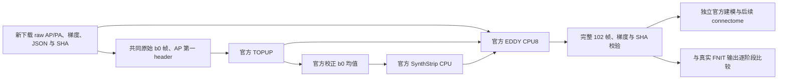
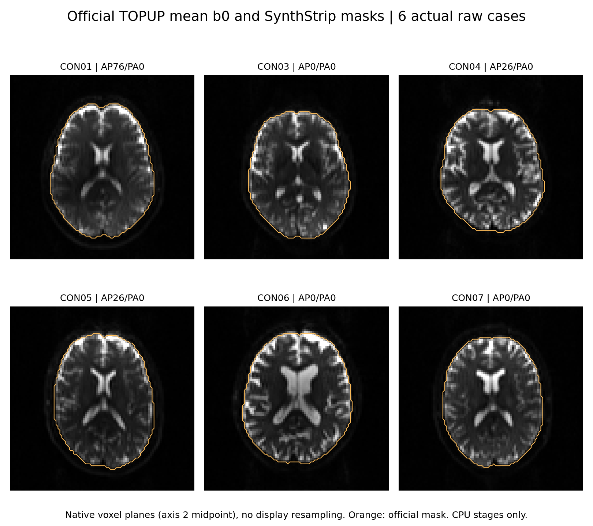
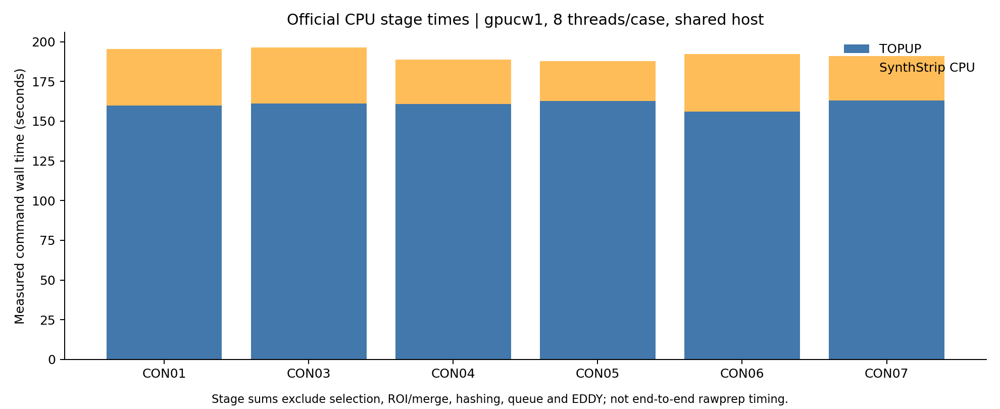

# 新下载十例 raw DWI 的独立官方预处理参考

## 1. 功能与流程

本目录评测官方 TOPUP、SynthStrip、EDDY 与 FNIT 的实际原始 DWI 预处理结果。原始输入为新下载的 ds001226 CON01、CON03–CON11，来源与 CC0 许可见[下载记录](../README.md)。参考工具只用于独立 benchmark；FNIT 生产流程调用项目 PyTorch 实现，官方 `recon-all` 是本轮允许的结构像前置步骤。

当前成功参考采用 **FSL CPU EDDY，每例 8 线程、并发两例**。官方 GPU EDDY 第二次实际尝试占用 43.203 GB，触发本工具的 20 GB 预算保护并退出；失败证据保留，不继续重试 GPU。官方预处理产生自己的场、掩膜和校正 DWI。



共同 b0 选择是显式输入控制：从正式 FNIT 实际保存的 `B0_AP_PA.nii.gz`，逐值识别 canonical raw 中的原始 AP/PA 帧，再用官方 `fslroi/fslmerge` 独立生成相同 packing。只读取选择证据，不借用 FNIT 校正影像、场或掩膜。CPU helper 的原 proposal 和完整 scores 另存；正式 GPU 历史 scores 未保存，不补造。AP 第一 header 不重采样；原 JSON readout `.0266003` 与本轮实际 `.0266` 都记录。

## 2. Python 调用、输入、输出与参数

新用户可从 raw 完整执行 CPU 参考；本轮实际 CPU8 则恢复已成功、逐文件 SHA 一致的官方 TOPUP/SynthStrip，单独记录恢复来源和原耗时。

```python
from pathlib import Path
import subprocess
import sys

reference_directory = Path("validation/connectome/tenraw_20261002/task_01/official_rawprep_v1")
raw_manifest_path = Path("/data/benchmark/final_manifest.json")  # cases 中含 subject/session/input_sha256
raw_bids_directory = Path("/data/benchmark/raw")               # 新下载的 anat、AP/PA DWI、JSON、梯度
frozen_fnit_source_directory = Path("/code/fnit-frozen")         # 已核验的成熟 b0 helper；记录其 SHA
formal_fnit_output_directory = Path("/results/formal/baseline")  # 实际 packing，仅识别原始帧
new_reference_output_directory = Path("/results/new-official-cpu-rawprep")

subprocess.run([
    sys.executable, str(reference_directory / "run_official_rawprep.py"),
    "--manifest", str(raw_manifest_path), "--raw-root", str(raw_bids_directory),
    "--fnit-source", str(frozen_fnit_source_directory),
    "--fnit-selection-root", str(formal_fnit_output_directory),
    "--output-root", str(new_reference_output_directory),
    "--subjects", "CON01", "CON03", "--workers", "2", "--solver", "cpu",
], check=True)
```

### 输入格式

- manifest 的 `cases`：每例 `subject`、`session`、`input_sha256`；摘要字典以 raw 根目录的相对文件路径为键。每例十项 acquisition，包含配对 T1w、AP/PA DWI、JSON、bval、bvec。它与正式评测器的 `input_files` schema 分开，不混用。
- DWI：NIfTI AP `[96,96,60,102]`、反向 PA `[96,96,60,2]`；梯度文件帧数匹配，JSON 含 PE/readout。
- 正式 FNIT 目录：`sub-CONxx/connectome/preproc/topup/B0_AP_PA.nii.gz` 必须与原始所选两帧逐值、affine 相同；未出现就等待。
- 官方程序及模型：服务器实际安装的 FSL 6.0.7.4、FreeSurfer 8.2.0/20260314-d932c45。工具记录路径、版本、文件 SHA，不复制发布官方程序或权重。

### 输出结构

```text
new-official-cpu-rawprep/
  freeze.json                         # 原始清单、工具、程序和配置摘要
  sub-CON01/
    raw/                              # canonical acquisition 只读链接
    topup/                            # 自产 packing、fieldcoef、movpar、iout、场
    mask/                             # 自产 mean b0、brain、binary mask
    eddy/                             # 自产 102 帧校正 DWI、bvec、运动/离群结果
    report.json                       # 实际命令、返回值、环境、SHA 和耗时
    completed_contract_verified.json  # 独立检查成功后才能发布
```

`run_cpu_budget_reference.py` 的本轮输出使用 `activation.json` 代替新完整链的 `freeze.json`，并保留 `source_CPU_stage_lineage`。目录已有时拒绝覆盖；失败日志和部分输出保留。

| 参数 | 含义 |
|---|---|
| `--manifest`、`--raw-root` | 必需。上述清单及 canonical raw 根目录。原文件重新核验 SHA。 |
| `--fnit-source` | 必需。成熟选择 helper 源码目录；数学实现不修改。 |
| `--fnit-selection-root` | 本轮共同输入评测必需。只识别实际原始帧；省略时属于独立 CPU proposal 模式。 |
| `--output-root` | 必需。全新输出目录。 |
| `--subjects` | 必需。manifest 中的病例列表，不含 `sub-` 前缀。 |
| `--workers` | 默认 2，仅允许 1 或 2；每例固定 8 CPU 线程。 |
| `--solver` | 工具默认 `gpu`；当前成功 CPU 参考显式使用 `cpu`，实际程序为 `eddy_cpu`。 |
| `--phase` | 默认 `all`。CPU solver 使用 `all`；旧 GPU 分阶段版本保留在失败来源记录中。 |
| `--fsl-dir`、`--freesurfer-dir` | 默认本轮已安装目录；仅独立官方 reference 使用。 |
| `--gpu-lock` | 仅 GPU solver 使用；CPU solver 不初始化 CUDA、不占 GPU 锁。 |

本轮恢复工具的七项必需参数为 `--manifest`、`--raw-root`、`--pilot-root`、`--heldout-root`、`--fnit-selection-root`、`--budget-evidence`、`--output-root`：前两个定义原始输入；两个 stage root 是已成功的官方准备目录；选择 root 核对共同 packing；预算证据核对真实 GPU 终止；输出必须全新。可选软件路径同上。

## 3. 命令行

```bash
# 全新 CPU reference；每例从原始 AP/PA 准备自己的 TOPUP 和 mask。
python run_official_rawprep.py \
  --manifest /data/benchmark/final_manifest.json --raw-root /data/benchmark/raw \
  --fnit-source /code/fnit-frozen --fnit-selection-root /results/formal/baseline \
  --output-root /results/new-official-cpu-rawprep \
  --subjects CON01 CON03 --workers 2 --solver cpu

# 本轮实际采用的恢复方式：不重新执行已成功、SHA 一致的官方 CPU 阶段。
python run_cpu_budget_reference.py \
  --manifest /data/benchmark/final_manifest.json --raw-root /data/benchmark/raw \
  --pilot-root /results/own-successful-pilot-stages \
  --heldout-root /results/own-matched-heldout-stages \
  --fnit-selection-root /results/formal/baseline \
  --budget-evidence /results/v2_GPU_budget_termination_evidence.json \
  --output-root /results/new-official-cpu-budget-reference

# 只读比较已实际完成的单例，输出新 JSON。
python compare_official_rawprep.py \
  --official-case /results/new-official-cpu-budget-reference/sub-CON01 \
  --fnit-preproc /results/formal/baseline/sub-CON01/connectome/preproc \
  --output /results/new-CON01-comparison.json
```

比较器三个路径均必需。它核验 packing、场、校正 b0、coeff、mask、完整校正 DWI、运动/RMS/outlier 和梯度；脑内范围固定使用官方自产 mask，同时报告全网格。不会据退出码直接判定等价或计算速度优势。原生 outlier 的标准说明首行按已确认格式识别，数值行严格读取，非有限数值报错。

`watch_official_contracts.py` 逐例检查原生返回值、102 帧、梯度数及 SHA 后发布 verified 合同。`watch_cpu_chain_comparisons.py` 等待该合同和正式 FNIT 实际输出；等待不是计算完成。`freeze_raw_b0_choices.py` 保存原始帧、packing、helper 和 CPU scores 的来源；正式历史 scores 仍不推断。

## 4. 对应原软件命令

```bash
fslroi AP.nii.gz AP_b0.nii.gz AP_INDEX 1
fslroi PA.nii.gz PA_b0.nii.gz PA_INDEX 1
fslmerge -t B0_AP_PA.nii.gz AP_b0.nii.gz PA_b0.nii.gz
topup --imain=B0_AP_PA.nii.gz --datain=acqparams.txt --config=b02b0.cnf \
  --out=fieldmap_out --fout=fieldmap_fout --iout=fieldmap_iout
fslmaths fieldmap_iout.nii.gz -Tmean b0_mean.nii.gz
mri_synthstrip -i b0_mean.nii.gz -m nodif_brain_mask.nii.gz \
  -o nodif_brain.nii.gz --model synthstrip.1.pt -b 1 -t 8
OMP_NUM_THREADS=8 CUDA_VISIBLE_DEVICES='' eddy_cpu \
  --imain=AP.nii.gz --mask=nodif_brain_mask.nii.gz \
  --acqp=acqparams.txt --index=eddy_index.txt --bvecs=AP.bvec --bvals=AP.bval \
  --topup=fieldmap_out --out=data --flm=quadratic --resamp=jac --slm=linear \
  --niter=8 --fwhm=10,8,4,2,0,0,0,0 --ff=10 --sep_offs_move \
  --nvoxhp=1000 --repol --rms --initrand=12345 --ref_scan_no=AP_INDEX
```

`AP_INDEX` 是原始 AP 序号，CON01 为 76、CON03 为 0；PA 均为 0。`fieldmap_out` 必须是本例自产 TOPUP prefix。标准 SynthStrip model 的大小 30,851,709 B、SHA `37417f802196186441aae3e7f385d94f8a98c64a88acaeaa2723af995c653e33`；模型 border 为 1 mm，包含 CSF。实际 SynthStrip 环境为 FS 自带 Python 3.8.13/Torch 2.1.2+CPU；FNIT 环境为 Torch 2.5.1，二者分开记录。

## 5. 真实精度、耗时与脑图

首两例实际完成的数据见 [CPU 参考摘要](CPU_reference_pilots_v1/summary.json)和[文件摘要索引](CPU_reference_pilots_v1/SHA256_manifest.json)。两例共同 packing 全部体素与 affine 相同、GP seed 均 12345，102 帧及 3×102 梯度完整。

| 病例 | mask Dice | TOPUP 脑内 field RMSE Hz | EDDY 脑内 DWI RMSE | DWI P99 绝对差 | 梯度角 RMS ° |
|---|---:|---:|---:|---:|---:|
| CON01 | 0.99994186 | 0.120843 | 1.083026 | 3.786774 | 0.088573 |
| CON03 | 0.99997183 | 0.087888 | 0.883580 | 2.755461 | 0.056595 |

DWI 差异为原始强度单位。这是各自产场和 mask 后的累计预处理差异，尚未设定等价阈值；不是固定场/mask 的 EDDY solver 隔离比较。

| 病例 | 新 CPU activation wall s | CPU8 EDDY 命令 wall s | 恢复阶段原准备 wall s | 原 TOPUP wall s | 原 SynthStrip wall s | FNIT EDDY QC elapsed s |
|---|---:|---:|---:|---:|---:|---:|
| CON01 | 2552.735 | 2550.451 | 204.980 | 159.875 | 35.558 | 273.581 |
| CON03 | 2553.373 | 2550.927 | 206.370 | 161.148 | 35.089 | 278.794 |

新 activation wall 包含重新核验、恢复、等待和 CPU EDDY；恢复阶段原耗时单列，不相加成一次连续端到端测量。官方 CPU 为原生命令 wall，FNIT 为本例 QC 内部 elapsed，边界不同，不据此计算 speedup。本轮正式 FNIT 未保存独立 TOPUP/mask 时间，留空，不从别的 run 补值。CPU reference 实际宿主为 gpucw1；后续独立建模宿主为 nodecw10。

以下是六例共同原始帧已校验的官方 CPU 输出；底图为自产校正 mean b0，橙线为自产 SynthStrip mask。使用 native axis2 中间切片，没有绘图重采样，来源和时间见对应 provenance。





独立 raw-DWI 建模、官方解剖、五种子追踪及最终矩阵需要各自完整结果，不能以本目录首两例预处理完成替代。十例整链的当前进度与结论见 [pipeline 主说明](../../../../../docs/connectome/README.md)。

## 6. 最近版本与 benchmark 记录

- 当前 CPU8：首两例原生返回 0、完整帧/梯度/SHA 校验及比较成功；其余病例继续实际执行。outlier 说明首行读取错误仅修复比较工具，旧失败目录保留；没有更改科学输出或填补 NaN。
- 输入对齐：CON04/05 原 CPU proposal AP0 与正式 AP26 不同。共同帧重新准备后 field RMSE 为 0.181656/0.191075 Hz；旧值 4.937457/4.180371 Hz 保留在历史 JSON 中，旧错误输入图不作为当前结果。
- GPU v2：两例各自原生 EDDY 显存采样 43,203,428,352 B，预算保护 SIGTERM、返回 −15、stderr 为空，见[实际预算终止](v2_GPU_budget_termination_evidence.json)。这是预算超限，不能称 CUDA OOM。
- GPU v1：实际 CUDA allocation failure、返回 1，见[pilot 原失败](pilot_failed_attempt_v1.json)。保留失败原报告和程序身份。
- 已删除未激活的旧条件 OOM 调度代码和未进入计算的可选 GPU replay。实际来源、原输入错误 JSON、退休记录和当前代码 SHA 见 [发布整理清单](publication_source_curation.json)。

## 7. 原实现、参考文献与许可

本次数据快照、annex 校验、CC0 与 Git/S3 description 差异见[公开数据来源](../README.md)。模型/模板按已核验来源获取，未在此复制官方程序、模型或原始 MRI。

- [FSL TOPUP](https://fsl.fmrib.ox.ac.uk/fsl/docs/diffusion/topup/index.html)、[FSL EDDY](https://fsl.fmrib.ox.ac.uk/fsl/docs/diffusion/eddy/index.html)、[FSL 源码](https://git.fmrib.ox.ac.uk/fsl)。
- [SynthStrip 实现](https://github.com/freesurfer/freesurfer/tree/dev/mri_synthstrip)、Hoopes et al., 2022, [SynthStrip](https://doi.org/10.1016/j.neuroimage.2022.119474)。
- Andersson et al., 2003, susceptibility correction；Andersson & Sotiropoulos, 2016, integrated off-resonance and movement correction。
