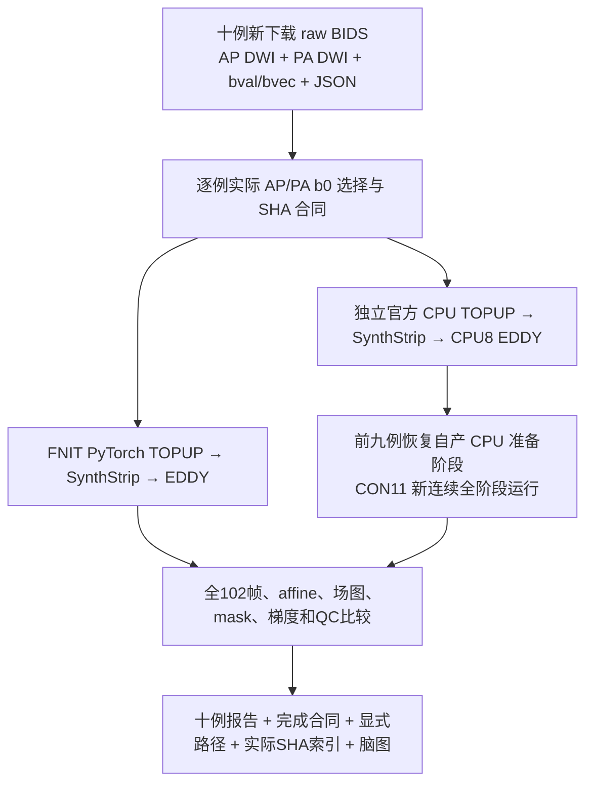
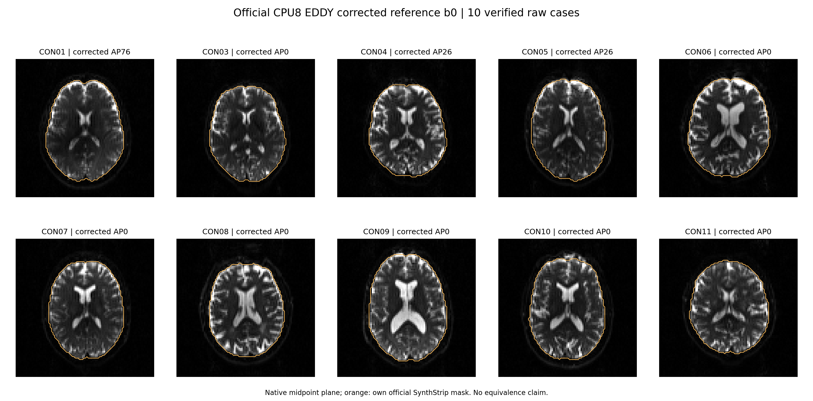
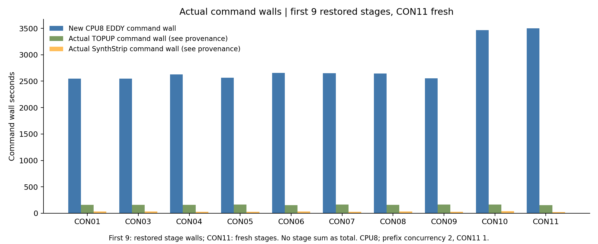

# 十例实际官方 CPU 参考与 FNIT rawprep 比较

## 1. 功能与流程

本页记录 ds001226 的 CON01、CON03–CON11 十例**独立官方 CPU rawprep**及其与实际 FNIT 结果的比较。十例均已完成；输入来自新下载的 raw BIDS acquisition。官方 TOPUP、SynthStrip、EDDY 分别生成自己的场图、mask 和校正 DWI，未使用 FNIT 的场图或 mask。两条链使用相同原始影像、所选 AP/PA b0、梯度及 GP seed=12345。此处完成范围为 rawprep；anatomy、FOD、tracking 和最终矩阵由相应阶段报告核验。



## 2. Python调用、输入与输出

以下是已有结果的只读收集脚本，运行时不启动影像求解。生产 pipeline 的接口见 `docs/connectome/` 中的 UKBConnectome_pipeline 说明。官方软件仅用于独立 benchmark。

|参数|输入格式与用途|
|---|---|
|`--routes`|JSON，`cases` 按 `sub-CONxx` 记录实际 official/FNIT 路径、完成合同和逐文件 SHA；不通过统一旧目录前缀推测路径。|
|`--prefix-delivery`|已核验的九例服务器交付目录；原始报告与结果仍保留在各自实际路径。|
|`--con11-comparison`|CON11 新连续 CPU 参考与实际 FNIT 数据的比较 JSON。|
|`--output-root`|新的收集目录，必须不存在，避免覆盖原结果。|
|`--plot-python`|服务器已有的 NumPy、nibabel、Matplotlib 环境 Python 路径，仅用于读取已有影像绘图。|

原始 AP 为 `96×96×60×102`，PA 为同空间两帧；bval 为102值，bvec 为 `3×102`。校正 DWI 保持完整102帧及原 affine，mask 为 `96×96×60`，rotated bvecs 为 `3×102`。TOPUP 系数、movement、outlier 及梯度由逐例完成合同绑定。

```python
import subprocess
from pathlib import Path

# 在可访问已有结果的服务器运行；变量均指向实际冻结结果。
remote_task_directory = Path('/cwStorage/home/gongwk/Notebook_code/fnit_connectome_tenraw_20261002/task_01')
collection_script_path = remote_task_directory / 'con11_origin_CPU_tools_v1/collect_routed_ten_cpu.py'
existing_plot_python_path = '/home1/gongwk/anaconda3/bin/python'
new_delivery_directory = remote_task_directory / 'new_actual_ten_delivery'
subprocess.run([
    'python3', str(collection_script_path),
    '--routes', str(remote_task_directory / 'explicit_actual_CPU_case_routes_v1.json'),
    '--prefix-delivery', str(remote_task_directory / 'CPU_reference_prefix9_delivery_v1'),
    '--con11-comparison', str(remote_task_directory / 'CON11_fresh_origin_verified_comparison_v1/CON11_comparison.json'),
    '--output-root', str(new_delivery_directory),
    '--plot-python', existing_plot_python_path,
], check=True)
```

仓库中的当前精简交付位于 `CPU_reference_actual10_delivery_v1/`：

|输出|内容与结构|
|---|---|
|`summary.json`|`cases.CONxx` 保存逐例完成状态、actual official/FNIT 路径、指标、SHA 与独立计时字段。|
|`cases/CONxx/comparison.json`|逐项场图、mask、完整 DWI、运动/outlier、梯度差异；不删除非零误差或负值。|
|`cases/CONxx/completed_contract_verified.json`|已完成原软件产物及 raw 输入 SHA、102帧 geometry、梯度、source、种子和路径。|
|`cases/CONxx/report_execution_metadata.json`|精简命令报告，保留命令、程序/输入/输出 SHA、wall、退出码和来源；只省略高频 `memory_samples`。`original_report_path/bytes/SHA256` 指向未覆盖的原报告，投影 SHA 另列，二者不能互换。|
|`cases/index.json`|十例原始报告 SHA、投影 SHA、合同 SHA、比较 SHA 与执行类型。|
|`explicit_actual_CPU_case_routes_v1.json`|十例按实际目录逐一绑定；CON11 位于新的 official namespace。|
|`independent_audit/`|实际全体素检查及完成时 SHA 索引；20份 raw AP/PA 非有限值/负值检查与校正负值计数均保留。|
|`figures/`|十例实际校正 b0/官方自产 mask 脑图、阶段 wall 图及图像/source SHA。|
|`curation_receipt.json`|采用文件、复用 source、删除的重复本地快照及 SHA/大小。|
|`SOURCE_delivery_SHA256.json`|Task1 原55文件索引，用于辨别采用与省略的来源；不是本地当前目录的完整索引。|
|`CURATED_payload_SHA256.json`|本地当前精简目录文件的 SHA 索引，索引自身除外。|
|`curation_readonly_verification.json`|独立 headcw CPU/stdlib 对原报告、投影、实际合同、最终索引与 CON11 输入的只读复核。|

## 3. 命令行

```bash
# 服务器上仅收集已有实际结果，output_directory 必须是新目录。
remote_task_directory="/cwStorage/home/gongwk/Notebook_code/fnit_connectome_tenraw_20261002/task_01"
output_directory="${remote_task_directory}/new_actual_ten_delivery"
python3 "${remote_task_directory}/con11_origin_CPU_tools_v1/collect_routed_ten_cpu.py" \
  --routes "${remote_task_directory}/explicit_actual_CPU_case_routes_v1.json" \
  --prefix-delivery "${remote_task_directory}/CPU_reference_prefix9_delivery_v1" \
  --con11-comparison "${remote_task_directory}/CON11_fresh_origin_verified_comparison_v1/CON11_comparison.json" \
  --output-root "${output_directory}" \
  --plot-python /home1/gongwk/anaconda3/bin/python
```

本地独立只读核验通过已有 headcw SSH session 读取实际文件，使用标准库，不启动 GPU/MRI 求解：

```bash
delivery_directory="validation/connectome/tenraw_20261002/task_01/official_rawprep_v1/CPU_reference_actual10_delivery_v1"
python3 "${delivery_directory}/audit_remote_readonly.py" \
  --delivery-root "${delivery_directory}" \
  --control-path /tmp/fnit-bwas-headcw.sock \
  --host gongwk@10.190.248.228 --port 39516 \
  --output /tmp/new_actual_ten_readonly_proof.json
```

`--delivery-root` 是本地冻结交付；`--diagnostic-root` 可选，默认同级 `CON11_Task2_actual_raw_binding_v1`；`--control-path` 指现有已认证 SSH socket；`--host/port` 指 head 节点；`--output` 必须是新文件。完整帮助使用 `--help`。

## 4. 原软件调用

原软件仅用于外部 benchmark；FNIT 运行时不调用原软件。实际 TOPUP/SynthStrip/EDDY 完整命令、输入与原程序SHA见逐例 report.commands。CPU8 EDDY 参数保持原实验设置：

以下是已成功完成的 CON11 原软件命令。目录变量绑定实际新参考目录；TOPUP 与 mask 均自产。

```bash
# CPU reference 外部 benchmark；运行结果保存在已冻结的真实目录。
official_reference_case_directory="/cwStorage/home/gongwk/Notebook_code/fnit_connectome_tenraw_20261002/task_01/official_CON11_CPU_fresh_origin_v1/sub-CON11"
export FSLDIR=/public/software/apps/FSL/6.0.7.4
export FREESURFER_HOME=/public/software/apps/Freesurfer/8.2.0-1
export FSLOUTPUTTYPE=NIFTI_GZ OMP_NUM_THREADS=8 MKL_NUM_THREADS=8 OPENBLAS_NUM_THREADS=8
export CUDA_VISIBLE_DEVICES=""

# official_topup
/public/software/apps/FSL/6.0.7.4/bin/topup \
 --imain=${official_reference_case_directory}/topup/B0_AP_PA.nii.gz \
 --datain=${official_reference_case_directory}/topup/acqparams.txt \
 --config=/public/software/apps/FSL/6.0.7.4/etc/flirtsch/b02b0.cnf \
 --out=${official_reference_case_directory}/topup/fieldmap_out \
 --fout=${official_reference_case_directory}/topup/fieldmap_fout \
 --iout=${official_reference_case_directory}/topup/fieldmap_iout

# official_synthstrip_CPU
/public/software/apps/Freesurfer/8.2.0-1/bin/mri_synthstrip \
 -i \
 ${official_reference_case_directory}/mask/b0_mean.nii.gz \
 -m \
 ${official_reference_case_directory}/mask/nodif_brain_mask.nii.gz \
 -o \
 ${official_reference_case_directory}/mask/nodif_brain.nii.gz \
 --model \
 /public/software/apps/Freesurfer/8.2.0-1/models/synthstrip.1.pt \
 -b \
 1 \
 -t \
 8

# official_EDDY_CPU
/public/software/apps/FSL/6.0.7.4/bin/eddy_cpu \
 --imain=${official_reference_case_directory}/raw/AP.nii.gz \
 --mask=${official_reference_case_directory}/mask/nodif_brain_mask.nii.gz \
 --acqp=${official_reference_case_directory}/topup/acqparams.txt \
 --index=${official_reference_case_directory}/eddy/eddy_index.txt \
 --bvecs=${official_reference_case_directory}/raw/AP.bvec \
 --bvals=${official_reference_case_directory}/raw/AP.bval \
 --topup=${official_reference_case_directory}/topup/fieldmap_out \
 --out=${official_reference_case_directory}/eddy/data \
 --flm=quadratic \
 --resamp=jac \
 --slm=linear \
 --niter=8 \
 --fwhm=10,8,4,2,0,0,0,0 \
 --ff=10 \
 --sep_offs_move \
 --nvoxhp=1000 \
 --repol \
 --rms \
 --initrand=12345 \
 --ref_scan_no=0
```

TOPUP 的 imain 为两帧 AP/PA，datain 为对应 PE/readout 两行，config 为实际 b02b0.cnf；out 保存系数与运动，fout 保存 Hz 场图，iout 保存校正 b0。SynthStrip 的 i 为平均校正 b0，m 为二值 mask，o 为去颅骨 b0，model 为原网站安装的权重，b=1 为边界参数，t=8 为 CPU 线程。EDDY 的 imain/mask/acqp/index/bvecs/bvals/topup 指向当前例原始 AP、自产 mask、PE 行及每帧索引、原始梯度与自产 TOPUP；out 为校正 DWI 及 QC 前缀。flm/slm/resamp 控制场模型、二级模型及 Jacobian 重采样；niter=8、fwhm 为八轮平滑序列，ff=10、nvoxhp=1000 为拟合设置；sep_offs_move、repol、rms 分别启用独立位移处理、outlier 替换与 RMS 输出；initrand=12345 固定 GP 种子，ref_scan_no=0 为该例实际 AP0。完整参数原值保留在各例 commands 中。

## 5. 实际精度、运行时间与脑图

|病例|AP/PA|mask Dice|脑内field RMSE Hz|脑内DWI RMSE|梯度RMS °|CPU8 EDDY wall s|FNIT QC elapsed s|
|---|---|---:|---:|---:|---:|---:|---:|
|CON01|76/0|0.99994186|0.120843|1.083026|0.088573|2550.451|273.581|
|CON03|0/0|0.99997183|0.087888|0.883580|0.056595|2550.927|278.794|
|CON04|26/0|0.99989234|0.181656|1.574984|0.083121|2625.856|470.448|
|CON05|26/0|0.99676260|0.191075|1.618953|0.087076|2568.163|470.321|
|CON06|0/0|0.99998594|0.025161|2.339025|0.170765|2656.504|287.725|
|CON07|0/0|0.99522522|0.088170|4.124966|0.369838|2649.568|350.872|
|CON08|0/0|0.99656397|0.080350|2.133002|0.197060|2646.437|510.137|
|CON09|0/0|0.99998720|0.029369|1.107787|0.076073|2556.599|361.906|
|CON10|0/0|0.99997083|0.070757|2.657712|0.250494|3467.137|292.670|
|CON11|0/0|0.99627586|0.074611|3.110930|0.229201|3498.833|285.625|

前九例的恢复准备wall、新activation及原阶段wall保存在summary各自字段；CON11为新的完整CPU运行，实际连续wall为3687.2653197823092秒，逐阶段wall见fresh_CPU_command_times_seconds。未单记的FNIT阶段wall不补值；原生进程wall与FNIT内部QC elapsed边界不同，不计算speedup，未检验等价阈值。






逐例时间边界如下。所有数值均为实际报告的 wall seconds；“不适用”不是补零。

|病例|新activation wall|fresh完整wall|恢复原准备wall|TOPUP命令wall|SynthStrip命令wall|新CPU8 EDDY命令wall|
|---|---:|---:|---:|---:|---:|---:|
|CON01|2552.735|不适用|204.980|159.875|35.558|2550.451|
|CON03|2553.373|不适用|206.370|161.148|35.089|2550.927|
|CON04|2627.949|不适用|200.588|160.660|27.985|2625.856|
|CON05|2570.156|不适用|199.416|162.545|25.220|2568.163|
|CON06|2658.880|不适用|201.582|155.878|36.268|2656.504|
|CON07|2651.721|不适用|200.826|162.908|28.037|2649.568|
|CON08|2648.481|不适用|3354.467|158.591|35.189|2646.437|
|CON09|2558.698|不适用|5450.952|162.258|28.946|2556.599|
|CON10|3469.237|不适用|5054.671|162.178|38.112|3467.137|
|CON11|不适用|3687.265|不适用|154.051|24.686|3498.833|

恢复原准备 wall 可能包含等待实际 packing 的时间，原命令 wall 单列；不能拼成一次新的连续 coldwall。CON11 的 fresh wall 是本次真实连续运行的总 wall，不宣称冷缓存。FNIT 未独立记录的 rawprep 总 wall 与分阶段 wall 不补值。

独立完整体素审计：十例 AP/PA 共二十份原始影像负值和非有限值均为 0；校正输出的实际负值计数见 `CPU_reference_actual10_delivery_v1/independent_audit/audit.json`，不裁剪，不更改数据。

## 6. 更新与benchmark记录

- 2026-10-03，Task1 `de5a168c`：十例实际 CPU 参考及十例 actual FNIT 比较完成。采用49个必要交付文件，四个 collector/plot/freeze/launch 文件与已有源码逐字节一致，复用已有副本。原55文件全部通过 SHA 核验；本地删除58份被替代的2/4/6例重复 payload、旧图、旧计时表和已退休 metadata helper，共8,838,148 bytes。原服务器结果和旧 namespace 均未修改；删除文件的大小/SHA 在 `curation_receipt.json`，原 Git 历史可追溯。
- 当前独立只读复核完成163项实际检查：十例原始 report、完成合同、actual comparison SHA 一致；从原报告重建十例精简投影，与保存投影逐字节一致；完成时实际索引14项一致。完整体素审计由冻结 `audit_final_ten_cpu.py` 实际执行，检查 raw 20份影像、校正 full DWI、affine、梯度、逐文件输出；本次精简接入不重复影像求解。
- 原 collector 先生成索引，再写最终 `status.json`，导致状态文件的原记录 SHA `49c9463d…` 与实际最终 `5a0fe179…` 不同。保留原索引和最终状态；使用 `independent_audit/final_delivery_actual_SHA256_index.json` 对照完成时实际字节。精简报告是投影，不把投影 SHA 当作原报告 SHA。
- 保留原生失败、自产GPU预算 guard 的 SIGTERM（不是OOM）、outlier 首行读取失败及修正记录。保留旧 CON04/05 AP0 错误 packing 和之后 AP26 的实际记录；当前十例比较全部使用实际 FNIT 选帧。错误读取修复只调整解析格式，未填 NaN，未裁剪校正负值。
- Task1 `76067b67`：[CON11 actual raw input binding](CON11_Task2_actual_raw_binding_v1/handoff.json) 证明 Task2 v1 consumer 的 confinement guard 错误：`raw/AP.nii.gz`、`AP.bval`、`AP.bvec` 是指向 canonical raw 的软链接，三份目标 SHA 均与 manifest 匹配，另五份派生产物仍位于新参考目录并匹配 SHA。该 guard 将合法 raw target 判为越界；本接入只保留诊断，不修改 Task2 source，不重跑 rawprep，不宣称 consumer 修复已完成。源码及八项实际输入证据保存在同级目录。

冻结的 source/context 保留在 `con11_origin_CPU_tools_v1/`、`origin_route_tools_v2/`，失败历史清单在当前交付的 `actual_failed_history.json`。原 report 高频内存采样仍在其实际路径；本地只省略重复采样数组。

## 7. 参考文献与原实现


canonical公开数据的Git snapshot、annex校验、CC0及Git/S3顶层description区分见 [raw manifest](../raw_manifest.json) 和 [dataset description provenance](../dataset_description_provenance.json)；不改变正式manifest。官方软件仅服务器已安装reference使用，不复制发布原软件程序或权重。

- [FSL TOPUP](https://fsl.fmrib.ox.ac.uk/fsl/docs/diffusion/topup/index.html)、[FSL EDDY](https://fsl.fmrib.ox.ac.uk/fsl/docs/diffusion/eddy/index.html)、[官方FSL源码](https://git.fmrib.ox.ac.uk/fsl)。
- [SynthStrip原实现](https://github.com/freesurfer/freesurfer/tree/dev/mri_synthstrip)、[SynthStrip文献](https://doi.org/10.1016/j.neuroimage.2022.119474)。
- Andersson et al. 2003 susceptibility correction；Andersson & Sotiropoulos 2016 integrated off-resonance/movement correction。
