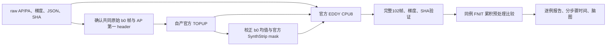
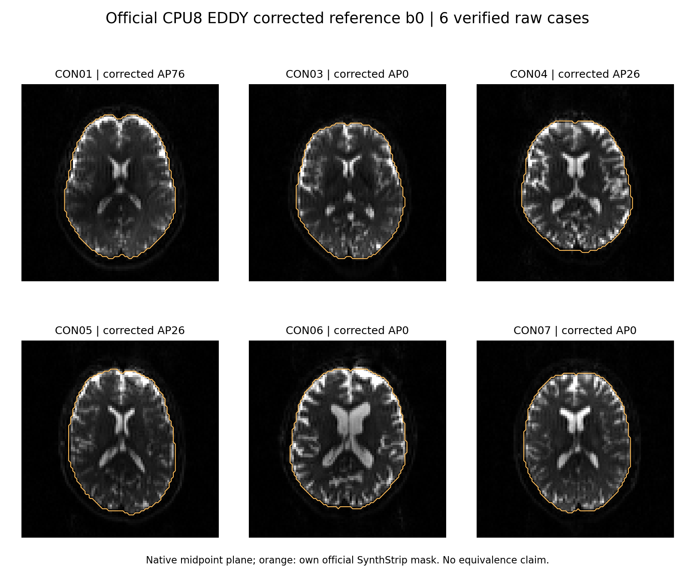
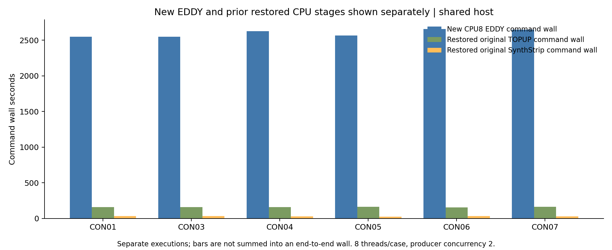

# 新下载 raw DWI：官方 CPU 预处理参考

## 1. 功能与流程

本目录从 ds001226 的原始 AP/PA DWI 独立生成官方 TOPUP、SynthStrip 和 EDDY CPU 参考，并与 FNIT 的实际预处理输出比较。数据及 CC0 来源见[下载记录](../README.md)。这些脚本用于 benchmark；FNIT 生产流程使用项目 PyTorch 实现。

当前主线是 **CPU8，每例8线程、最多两例**。前九例复用经过 SHA 核验的自产官方 TOPUP/SynthStrip，重新执行官方 CPU EDDY；CON11 使用显式的新 packing 来源，从原始输入执行完整官方 CPU 链。



发布快照是 **6例完整数值结果**（CON01、03、04、05、06、07，2026-10-02 23:07 UTC）。2026-10-03 00:12 UTC verified 为8例，00:31 UTC 达到9例，CON11尚无完成合同；本目录不补写 CON08–10 数值。原始选帧来自实际 packing 与 canonical raw 逐值核对，官方场、mask、校正 DWI 均自行计算。

## 2. Python、输入、输出和参数

输入为同例 BIDS AP DWI `96×96×60×102`、PA DWI `96×96×60×2` 的 NIfTI，以及对应 `.bval/.bvec/.json`。AP bval为102值，bvec为`3×102`；JSON提供PE方向和readout。manifest含例号、session及原始文件SHA。T1/recon-all由后续结构模块消费。

下面是本轮实际采用的前九例恢复方式；两个 stage 根目录必须是本例已成功的官方产物。

```python
from pathlib import Path
import subprocess
import sys

reference_tools_directory = Path("validation/connectome/tenraw_20261002/task_01/official_rawprep_v1")
raw_manifest_path = Path("/data/benchmark/final_manifest.json")
raw_bids_directory = Path("/data/benchmark/raw")
official_pilot_stage_directory = Path("/results/own-official-pilot-stages")
official_heldout_stage_directory = Path("/results/own-official-heldout-stages")
actual_fnit_baseline_directory = Path("/results/formal/baseline")  # 仅用于核对原始帧
actual_gpu_budget_report_path = Path("/results/v2_GPU_budget_termination_evidence.json")
new_official_cpu_output_directory = Path("/results/new-official-cpu-reference")  # 必须不存在

subprocess.run([
    sys.executable, str(reference_tools_directory / "run_cpu_budget_reference.py"),
    "--manifest", str(raw_manifest_path), "--raw-root", str(raw_bids_directory),
    "--pilot-root", str(official_pilot_stage_directory),
    "--heldout-root", str(official_heldout_stage_directory),
    "--fnit-selection-root", str(actual_fnit_baseline_directory),
    "--budget-evidence", str(actual_gpu_budget_report_path),
    "--output-root", str(new_official_cpu_output_directory),
], check=True)
```

输出结构：

```text
new-official-cpu-reference/
  activation.json                   # 实际启动、源/参数/恢复来源
  sub-CONxx/
    raw/                            # canonical acquisition 只读链接
    topup/                          # 自产 packing、fieldcoef、movpar、iout、fout
    mask/                           # 自产 mean b0、brain、binary mask
    eddy/                           # 完整102帧DWI、rotated bvec、运动/RMS/outlier
    report.json                     # 每条命令返回值、来源SHA和计时
    completed_contract_verified.json # 实际成功和完整输入输出核验后发布
```

全新 `run_official_rawprep.py` 使用 `freeze.json`；CON11另外绑定实际 origin receipt，时间单独记录。已发布六例目录由[整理清单](publication_source_curation.json)映射：CON01/03复用`CPU_reference_pilots_v1`，CON04/05位于`CPU_reference_delivery_completed04_v1`，CON06/07位于`CPU_reference_prefix9_delivery_v1/new_cases`。

以下列出使用中的全部 CLI 参数。路径默认必填；例外在表内说明。共同参数：`manifest/raw-root`是canonical输入；`fnit-root/fnit-selection-root/old-fnit-root`是实际FNIT来源；`output/output-root/status`是新输出文件或目录。

| 工具 | 参数及用途 |
| --- | --- |
| `run_cpu_budget_reference.py` | `--manifest`、`--raw-root`；`--pilot-root`、`--heldout-root`：自产成功stage；`--fnit-selection-root`：共同帧核对；`--budget-evidence`：实际GPU终止证据；`--output-root`。可选`--fsl-dir`默认FSL6.0.7.4、`--freesurfer-dir`默认FS8.2.0-1。固定CPU8/并发2。 |
| `run_official_rawprep.py` | `--manifest`、`--raw-root`、`--fnit-source`：已冻结成熟b0 helper源；`--output-root`、`--subjects`：不含`sub-`的例号；`--fnit-selection-root`：实际共同帧，省略时为独立CPU proposal。`--workers`默认2，仅1/2；`--solver`工具默认gpu，本轮显式cpu；`--phase`默认all，CPU使用all。软件路径同上；`--gpu-lock`仅GPU分支使用。 |
| `watch_official_contracts.py` | `--manifest`、`--raw-root`、`--fnit-source`；`--pilot-root`、`--heldout-root`：待核参考根；`--reference-tool`：冻结源；`--status`；本轮必加`--publish-only`，仅发布已完成产物。 |
| `compare_official_rawprep.py` | `--official-case`：同例官方目录；`--fnit-preproc`：同例实际预处理目录；`--output`：新比较JSON。 |
| `watch_cpu_chain_comparisons.py` | `--manifest`、`--official-root`、`--fnit-root`、`--output-root`；等待真实合同和FNIT输出后逐例比较。 |
| `watch_cpu_prefix_delivery.py` | `--prior-delivery`：已有四例完整远端快照；`--official-root`、`--comparison-root`、`--fnit-root`、`--output-root`；`--references-file`：参考说明；`--plot-python`：已有CPU绘图环境。发布增量前九例。 |
| `collect_cpu_reference_delivery.py` | `--official-root`、`--comparison-root`、`--fnit-root`、`--output-root`；已有两/四例快照的只读collector。 |
| 两个`plot_verified_cpu_reference*.py` | `--official-root`：自产影像根；`--delivery-summary`：实际摘要；`--output-root`：新图目录。当前六例图由`balanced_v3`生成。 |
| `origin_route_tools_v2/verify_con11_origin.py` | `--origin`：root实际来源receipt；`--manifest`；`--baseline-source`：冻结baseline源码；`--output`：新核验receipt。核对唯一CON11、raw/packing及源身份。 |
| `con11_origin_CPU_tools_v1/launch_con11_after_prefix.py` | `--origin`、`--origin-verified`、`--manifest`、`--raw-root`、`--baseline-source`；`--prefix-root`：原九例参考；`--reference-tool`：原6d58 helper；`--output-root`：fresh CON11目录；`--prefix-controller-pid`、`--aligned-controller-pid`：精确核对自己的原队列身份和child，九例成功且无child才派发CPU8。 |
| `watch_con11_origin_completion.py` | `--origin-verified`、`--manifest`、`--official-root`：fresh CON11根；`--output-root`：发布/比较目录。实际完整成功后核验并比较。 |
| `publish_explicit_case_routes.py` | `--prefix-root`、`--old-fnit-root`、`--fresh-con11-root`、`--origin-verified`、`--manifest`、`--output`；逐例明确映射九旧加一新来源，不写旧CON11路径。 |
| `collect_routed_ten_cpu.py` | `--routes`：实际逐例映射；`--prefix-delivery`：已完成九例摘要；`--con11-comparison`：新CON11比较；`--output-root`、`--plot-python`。全部真实齐备后才收集。 |
| `plot_routed_ten_cpu.py` | `--delivery-summary`、`--output-root`；与route collector同源冻结，当前尚未执行。 |

`report.json`保留CPU8、实际宿主、软件/model/helper SHA及全部命令参数；等待时间与计算时间分列。CON11工具原部署目录同时包含根目录的`run_official_rawprep.py`、`watch_official_contracts.py`和`compare_official_rawprep.py`，因为其导入和子进程按同目录解析。发布包只保留一份原helper；重新部署时将这三份原字节与CON11工具复制到同一个新目录，核对[freeze](con11_origin_CPU_tools_v1/freeze.json)及[原launch记录](con11_origin_CPU_tools_v1/actual_collector_launch_record_v1.json)，不直接从发布子目录启动watcher。

## 3. 命令行

```bash
# 前九例实际主线：恢复自己的成功TOPUP/SynthStrip，再做CPU EDDY。
python run_cpu_budget_reference.py \
  --manifest /data/benchmark/final_manifest.json --raw-root /data/benchmark/raw \
  --pilot-root /results/own-official-pilot-stages \
  --heldout-root /results/own-official-heldout-stages \
  --fnit-selection-root /results/formal/baseline \
  --budget-evidence /results/v2_GPU_budget_termination_evidence.json \
  --output-root /results/new-official-cpu-reference

# 全新单例CPU链：已有实际共同选帧来源，所有数值自行计算。
python run_official_rawprep.py \
  --manifest /data/benchmark/final_manifest.json --raw-root /data/benchmark/raw \
  --fnit-source /code/fnit-frozen --fnit-selection-root /results/actual-baseline \
  --output-root /results/new-fresh-official-cpu \
  --subjects CON11 --workers 1 --phase all --solver cpu

# 只读比较：完整DWI、场、mask、运动/RMS/outlier和梯度。
python compare_official_rawprep.py \
  --official-case /results/new-official-cpu-reference/sub-CON01 \
  --fnit-preproc /results/formal/baseline/sub-CON01/connectome/preproc \
  --output /results/new-CON01-comparison.json
```

本轮CON11实际来源以[verified receipt](con11_origin_CPU_tools_v1/CON11_origin_verified_v2.json)和[逐例route快照](con11_origin_CPU_tools_v1/explicit_actual_CPU_case_routes_v1.json)为准。launcher、watcher、collector已启动等待；尚无完成CON11比较或十例图。

## 4. 原软件命令

```bash
fslroi AP.nii.gz AP_b0.nii.gz ACTUAL_AP_INDEX 1
fslroi PA.nii.gz PA_b0.nii.gz ACTUAL_PA_INDEX 1
fslmerge -t B0_AP_PA.nii.gz AP_b0.nii.gz PA_b0.nii.gz
topup --imain=B0_AP_PA.nii.gz --datain=acqparams.txt --config=b02b0.cnf \
  --out=fieldmap_out --fout=fieldmap_fout --iout=fieldmap_iout
fslmaths fieldmap_iout.nii.gz -Tmean b0_mean.nii.gz
mri_synthstrip -i b0_mean.nii.gz -m nodif_brain_mask.nii.gz -o nodif_brain.nii.gz \
  --model synthstrip.1.pt -b 1 -t 8
OMP_NUM_THREADS=8 CUDA_VISIBLE_DEVICES='' eddy_cpu \
  --imain=AP.nii.gz --mask=nodif_brain_mask.nii.gz \
  --acqp=acqparams.txt --index=eddy_index.txt --bvecs=AP.bvec --bvals=AP.bval \
  --topup=fieldmap_out --out=data --flm=quadratic --resamp=jac --slm=linear \
  --niter=8 --fwhm=10,8,4,2,0,0,0,0 --ff=10 --sep_offs_move \
  --nvoxhp=1000 --repol --rms --initrand=12345 --ref_scan_no=ACTUAL_AP_INDEX
```

安装版本为FSL6.0.7.4、FreeSurfer8.2.0-1；`eddy_cpu` SHA为`a5cf07367c42a6215ede24705ee8e10c6e76df8b170ac67fb8cb25f0c3d30f1f`。SynthStrip标准权重30,851,709 bytes、SHA`37417f802196186441aae3e7f385d94f8a98c64a88acaeaa2723af995c653e33`，border=1mm、CPU8；环境和来源见[环境记录](execution_environment.json)。实际readout为0.0266秒，原JSON为0.0266003秒；全部实际参数保存在原报告。

## 5. 六例实际精度、时间与脑图

[prefix_summary_06.json](CPU_reference_prefix9_delivery_v1/prefix_summary_06.json)绑定六份成功报告、verified合同、比较和FNIT QC的SHA。共同packing全部体素和affine相同，GP seed均12345，DWI为完整102帧。以下为各自产场/mask后的累积rawprep差异；脑内统计固定使用官方自产mask，强度误差为原始单位。

| 例号 | AP/PA索引 | mask Dice | field RMSE Hz | DWI RMSE | DWI P99绝对差 | 梯度RMS ° |
| --- | --- | ---: | ---: | ---: | ---: | ---: |
| CON01 | 76/0 | 0.99994186 | 0.120843 | 1.083026 | 3.786774 | 0.088573 |
| CON03 | 0/0 | 0.99997183 | 0.087888 | 0.883580 | 2.755461 | 0.056595 |
| CON04 | 26/0 | 0.99989234 | 0.181656 | 1.574984 | 5.309427 | 0.083121 |
| CON05 | 26/0 | 0.99676260 | 0.191075 | 1.618953 | 5.589035 | 0.087076 |
| CON06 | 0/0 | 0.99998594 | 0.025161 | 2.339025 | 9.151630 | 0.170765 |
| CON07 | 0/0 | 0.99522522 | 0.088170 | 4.124966 | 14.745503 | 0.369838 |

| 例号 | 新activation wall s | 新CPU8 EDDY wall s | 恢复原准备wall s | 原TOPUP wall s | 原SynthStrip wall s | FNIT EDDY QC elapsed s |
| --- | ---: | ---: | ---: | ---: | ---: | ---: |
| CON01 | 2552.735 | 2550.451 | 204.980 | 159.875 | 35.558 | 273.581 |
| CON03 | 2553.373 | 2550.927 | 206.370 | 161.148 | 35.089 | 278.794 |
| CON04 | 2627.949 | 2625.856 | 200.588 | 160.660 | 27.985 | 470.448 |
| CON05 | 2570.156 | 2568.163 | 199.416 | 162.545 | 25.220 | 470.321 |
| CON06 | 2658.880 | 2656.504 | 201.582 | 155.878 | 36.268 | 287.725 |
| CON07 | 2651.721 | 2649.568 | 200.826 | 162.908 | 28.037 | 350.872 |

新activation包含恢复、核验、等待及新EDDY；原stage时间保留单列，不拼成连续raw端到端耗时。官方命令wall与FNIT QC内部elapsed边界不同，不计算speedup。正式FNIT未单独保存的TOPUP/mask阶段时间留空。本目录评测预处理，建模、解剖、追踪和最终矩阵见[pipeline说明](../../../../../docs/connectome/README.md)。

下图展示实际校正后的所选b0帧及自产mask边界：native axis2第30层、平衡3×2布局，没有绘图重采样。影像、summary、绘图源码和图文件SHA见[provenance](CPU_reference_prefix9_delivery_v1/figures_06_balanced_v3/provenance.json)。





## 6. 更新与真实差异记录

- 当前发布：锁定Task1 `991929da` 的六例摘要/原报告和3×2图；显式增加`a93ce6db/5ab93bc2`的已运行route collector与launch来源。collector仍等待十例，十例plot代码尚未执行。
- CON11：原旧路径没有packing。schema v2守卫验证新实际来源，4项真实manifest fixture通过；raw AP0/PA0、baseline/driver/source身份均绑定receipt。新单例不向旧目录补写或link，不复算已完成九例。
- 输入差异：CON04/05旧CPU proposal AP0，而正式实际AP26；重建共同原始输入后field RMSE为0.181656/0.191075 Hz。旧4.937457/4.180371 Hz及原输入记录保留在[旧JSON](official_CPU_vs_formal_FNIT_v1/CON04.json)和[对齐JSON](official_CPU_vs_formal_FNIT_aligned_v2/CON04.json)。
- 原失败：v1真实CUDA allocation failure，见[pilot失败](pilot_failed_attempt_v1.json)；v2 own GPU峰值43,203,428,352 bytes，预算保护SIGTERM、返回−15，见[预算终止](v2_GPU_budget_termination_evidence.json)。v2不记作OOM。
- 发布整理：重复两例payload复用原路径/SHA；旧错误和被替代脑图退出当前发布；未采用GPU/OOM待机分支不带回。`6d58`原helper、`b32`CPU runner和原frozen b0 metadata helper保持字节不变，见[整理清单](publication_source_curation.json)。
- 本次只读核验：headcw上357个源/raw/官方/FNIT文件SHA一致，六例全部packing体素、affine、102帧和梯度网格通过，4项schema测试通过。源码/请求/原readback和实时计数见[核验记录](curation_verification/verification.json)。核验不重跑MRI计算。

## 7. 原实现、参考文献和许可

数据snapshot、annex SHA、CC0及Git/S3 description差异见[原数据说明](../README.md)。本目录不复制官方程序、权重或原始MRI；参考执行使用已安装软件与已核验资源。

- [FSL TOPUP](https://fsl.fmrib.ox.ac.uk/fsl/docs/diffusion/topup/index.html)、[FSL EDDY](https://fsl.fmrib.ox.ac.uk/fsl/docs/diffusion/eddy/index.html)、[FSL源码](https://git.fmrib.ox.ac.uk/fsl)。
- [SynthStrip源码](https://github.com/freesurfer/freesurfer/tree/dev/mri_synthstrip)；Hoopes et al., 2022, [SynthStrip](https://doi.org/10.1016/j.neuroimage.2022.119474)。
- Andersson et al., 2003, susceptibility correction；Andersson & Sotiropoulos, 2016, integrated off-resonance and movement correction。
