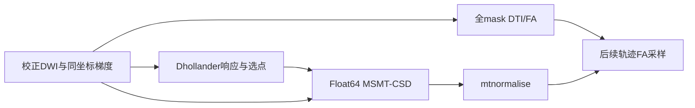

# DWI 建模同输入优化记录（2026-10-02）

## 1. 功能简介

从校正后的原始信号估计全处理 mask 的 DTI/FA、Dhollander 三组织响应函数、MSMT-CSD 白质球谐系数与 GM/CSF，以及 mtnormalise 强度归一化结果。本轮候选仅复用 ICLS 每轮的有序行索引，减少同一布尔选择重复执行 `nonzero` 和 CUDA 同步。求解仍使用 Float64，输入输出 Float32；batch_size=4096、约束排序、负乘子删除、停止规则、迭代上限和浮点求和顺序保持原实现。

这份记录覆盖校正 DWI 检查点后的组件链。`prepare_checkpoint.py` 会冻结新下载manifest及可选已完成预处理report快照，检查建模源文件与冻结基线逐字节一致；一次性 `watch_pilot_modeling.py` 只等待指定pilot完成标记，然后依次在共享锁下准备基线检查点和严格ABBA，状态写远端pilot_modeling_status.json，不修改其他任务结果。

原始 BIDS 起步的 TOPUP、EDDY、官方 recon-all、七图谱及 tracking/SIFT2 由主任务另行计时，不把组件时间相加称作完整端到端耗时。



## 2. Python 调用与输入输出

所有 Tensor 均在同一 CPU/CUDA 设备。影像与 mask 必须先由 nibabel 校对 shape 和 affine；计算函数不做影像重采样。梯度为 MRtrix 导出的 `[N,4]`，前三列在同一梯度坐标系中，末列 b 值单位 s/mm²，不能直接混入未经坐标变换的 FSL bvec。

```python
import nibabel as nib
import numpy as np
import torch
from fnit.connectome.response import (
    estimate_mrtrix_dhollander, fit_mrtrix_dhollander_tensor,
    mrtrix_shell_centres,
)
from fnit.connectome.fod import fit_mrtrix_msmt_csd
from fnit.connectome.mtnormalise import normalise_mrtrix_three_tissue

device = torch.device("cuda:0")  # 调用进程先绑定验证所用的GPU UUID
corrected_image = nib.load("corrected_dwi.nii.gz")
corrected_signal = torch.as_tensor(
    corrected_image.get_fdata(dtype=np.float32), device=device,
)  # Float32 [X,Y,Z,N]，保留原始强度
mrtrix_gradient = torch.as_tensor(
    np.loadtxt("corrected_grad_mrtrix.txt"), device=device, dtype=torch.float64,
)  # Float64 [N,4]，已核实与DWI同一坐标系
voxel_to_ras = torch.as_tensor(corrected_image.affine, device=device)
# 实际调用前分别检查下列mask的shape和affine与corrected_image一致
response_mask = torch.as_tensor(
    np.asarray(nib.load("response_mask.nii.gz").dataobj) > 0, device=device,
)  # Bool [X,Y,Z]，响应函数初始mask，内部会侵蚀三次
brain_mask = torch.as_tensor(
    np.asarray(nib.load("brain_mask.nii.gz").dataobj) > 0, device=device,
)  # Bool [X,Y,Z]，全脑DTI处理mask
from fnit.connectome.masks import maskfilter_six_connected
fod_mask = maskfilter_six_connected(
    mask=brain_mask, operation="dilate", passes=2,
)  # Bool [X,Y,Z]，CSD拟合mask，与FA的全脑mask分开
normalise_mask = torch.as_tensor(
    np.asarray(nib.load("normalise_mask.nii.gz").dataobj) > 0, device=device,
)  # Bool [X,Y,Z]，归一化处理mask
shell_values = mrtrix_shell_centres(grad_mrtrix=mrtrix_gradient)[2]
full_brain_fa, full_brain_directions = fit_mrtrix_dhollander_tensor(
    signal=corrected_signal, grad_mrtrix=mrtrix_gradient,
    safe_mask=brain_mask, batch_size=4096,
)  # 输出FA [X,Y,Z]和主方向[X,Y,Z,3]，均为Float32
shell_values, wm_response, gm_response, csf_response, response_maps = (
    estimate_mrtrix_dhollander(
        signal=corrected_signal, grad_mrtrix=mrtrix_gradient,
        shell_bvals=shell_values, brain_mask=response_mask, batch_size=4096,
    )
)  # Float64 shells [S]；WM [S,6]；GM/CSF [S,1]；辅助选点字典
wm_sh, gm_signal, csf_signal = fit_mrtrix_msmt_csd(
    signal=corrected_signal, grad_mrtrix=mrtrix_gradient,
    shell_bvals=shell_values, wm_response=wm_response,
    gm_response=gm_response, csf_response=csf_response, mask=fod_mask,
    batch_size=4096,
)  # Float32 WM [X,Y,Z,45]，GM/CSF [X,Y,Z]；mask外为0
normalised = normalise_mrtrix_three_tissue(
    wm_sh=wm_sh, gm=gm_signal, csf=csf_signal,
    mask=normalise_mask, affine=voxel_to_ras,
)  # 原网格WM/GM/CSF、偏置场、接受mask、Float64三组织balance_factors
```

共同参数：`signal` 为校正 Float32 DWI；`grad_mrtrix` 为上述梯度；`shell_bvals` 为从 b0 起始的 shell 中心 `[S]`；`batch_size` 是每次最多求解体素数，默认 4096、须为正，本轮比较保持相同。

DTI：`safe_mask` 指调用者选择的拟合区域，不要求必须是响应内部的侵蚀 mask。返回 FA 和主方向，mask 外为零；所有信号非正的体素返回 NaN。默认一次信号加权拟合加两次预测信号加权拟合，奇异系统保留原 QR 最小二乘回退。

响应：`brain_mask` 是初始响应选点 mask。`response_maps` 包含 `safe_mask`、`safe_sdm`、`fa`、`principal_directions`、WM/GM/CSF 选点、`metric_sfwm2`、`metric_sfwm6` 等同网格辅助输出。这里的 `fa` 只覆盖内部侵蚀后的 safe mask，不能替换全处理 mask 的 FA。

CSD：`wm_response` 包含各 shell 的 zonal SH，至少前五阶；`gm_response` 和 `csf_response` 各 shell 一个值（可为 `[S,1]`）；`mask` 规定拟合区域。固定 WM lmax=8、45 个 MRtrix 顺序偶数阶 SH，GM/CSF 各一个系数。

归一化：`wm_sh`、`gm`、`csf` 为 Float32 三组织结果；`mask` 为 Bool；`affine` 为 Float32/Float64 `[4,4]` voxel-to-RAS。返回对象包含 `wm`、`gm`、`csf`、Float32 `field`、Bool `accepted_mask`、Float64 `[3]` `balance_factors`。保持三阶多项式、15 次主更新、每次最多 7 次 balance 更新与原参考强度；空 mask、非有限组织信号或非正 balance 明确报错。

## 3. 命令行调用

这些组件没有独立 FNIT 产品 CLI，公共 pipeline 接入由主任务维护。专项 benchmark 提供下面入口，`checkpoint.json` 必须绑定本轮新下载 provenance，不接受旧 UKB/ds004666 检查点替代正式数据。

```json
{
  "subject": "本轮公开受试者ID",
  "new_download_20261002": true,
  "manifest": "/absolute/new_download_manifest.json",
  "dwi": "/absolute/corrected_dwi.nii.gz",
  "gradient": "/absolute/corrected_grad_mrtrix.txt",
  "response_mask": "/absolute/response_mask.nii.gz",
  "brain_mask": "/absolute/brain_mask.nii.gz",
  "fod_mask": "/absolute/fod_mask.nii.gz",
  "normalise_mask": "/absolute/normalise_mask.nii.gz"
}
```

```bash
# 锁等待不计入脚本内runtime；GPU UUID显式绑定共享锁对应设备
flock /tmp/fnit-recon-five-20261002-gongwk.gpu.lock \
  env CUDA_VISIBLE_DEVICES=GPU-e25cac06-0ce8-a833-abf9-09ab18c9c9ba \
  PYTORCH_CUDA_ALLOC_CONF=expandable_segments:True \
  /cwStorage/home/gongwk/Notebook_code/fnit_conda_env_956b1a9/bin/python \
  candidate/benchmark_modeling.py \
  --checkpoint checkpoint.json --baseline baseline --candidate candidate \
  --output results/pilot_subject --rounds 2 --profile
```

`--checkpoint` 是输入及来源 JSON；`--baseline`、`--candidate` 是各自包含 response.py/fod.py/mtnormalise.py 的目录；`--output` 为独立结果目录（ABBA时额外导出首轮baseline与candidate NIfTI供脑图使用，导出耗时另列checkpoint_export_s）；`--prepare-only` 可选，仅运行冻结基线并导出 baseline_wm_norm/FA/原始三组织/偏置场等 NIfTI 和响应文本，供并行下游使用，不作ABBA收益比较；`--profile` 可选，额外导出 CPU/CUDA dispatch trace，其运行不参与 AB/BA 墙钟。严格连续输出比较门槛预设 neq=0、max=0，离散 mask 逐值一致；NaN/Inf 类型及符号也比较。默认保存两轮 ABBA、共八次 CPU Tensor 检查点；`--rounds 1` 仅用于较短诊断、源/输入 SHA-256、read/H2D/D2H/write 和整条组件链实测 wall。正式ABBA只在整链边界同步；各阶段CPU dispatch另列，包含原函数内部同步，不能解释成独立GPU阶段墙钟。可选profile另跑带阶段同步的诊断，时间与正式ABBA分开保存。nvidia-smi 使用 NVML，记录进程占用峰值及采样最大间隔，量化分辨率 1 MiB；同时记录 Torch allocated/reserved。采样缺失不解释为零。进程峰值达到20e9 bytes时判定不通过；先保存CPU输出、NIfTI和完整显存证据，再停止，不丢失失败诊断。

## 4. 原软件调用

以下仅用于隔离官方 reference，不进入 FNIT 生产。输入梯度、shell、mask、官方版本、线程和资产 SHA 必须与报告绑定。

```bash
dwi2tensor corrected_dwi.nii.gz tensor.nii.gz \
  -grad corrected_grad_mrtrix.txt -mask brain_mask.nii.gz -iter 2 -nthreads 8
tensor2metric tensor.nii.gz -fa fa_reference.nii.gz \
  -vector direction_reference.nii.gz -modulate none -mask brain_mask.nii.gz -nthreads 8
dwi2response dhollander corrected_dwi.nii.gz \
  wm_response.txt gm_response.txt csf_response.txt \
  -grad corrected_grad_mrtrix.txt -mask response_mask.nii.gz -nthreads 8
dwi2fod msmt_csd corrected_dwi.nii.gz \
  wm_response.txt wm_reference.nii.gz \
  gm_response.txt gm_reference.nii.gz csf_response.txt csf_reference.nii.gz \
  -grad corrected_grad_mrtrix.txt -mask fod_mask.nii.gz -nthreads 8
mtnormalise wm_reference.nii.gz wm_norm_reference.nii.gz \
  gm_reference.nii.gz gm_norm_reference.nii.gz \
  csf_reference.nii.gz csf_norm_reference.nii.gz \
  -mask normalise_mask.nii.gz -nthreads 8
```

## 5. 本轮精度、耗时与脑图

真实脑图入口为 `plot_modeling.py --baseline <baseline-checkpoints> --candidate <candidate-checkpoints> --mask <brain-mask.nii.gz> --subject <公开ID> --output <figure.png>`，从同输入真实结果显示 FA、WM DC 与偏置场，AB共用色阶、另列绝对差值。本轮CON03校正DWI的官方DTI/响应reference已完成，nodecw10 8线程的dwi2tensor/tensor2metric/dwi2response wall为2.1064/0.1626/12.5675 s，见CON03_official_tensor_response.json，绑定实际二进制与输入/输出SHA。FNIT冻结baseline GPU链首次完整计算已结束，四步诊断wall分别0.6035/1.0465/105.1275/0.0779 s，但进程显存采样触发20 GB门槛，未通过验收；旧脚本在报错前未落盘显存数值，故不报告具体峰值。已保留原0_baseline.pt并仅用CPU导出recovered_baseline，来源SHA见recovery_provenance.json。这些结果只用于后续官方精度诊断，不作为显存或性能通过证据。修正后的脚本将在共享锁下重测，并在失败前保存所有证据；官方CSD/归一化reference已从这些真实冻结输出运行完成。两例新pilot同输入ABBA已完成；heldout与整例端到端由主任务继续验收，整例端到端另由 root 整合。

真实冻结GPU建模脑图见 [CON03_modeling_official.png](CON03_modeling_official.png)：FA、归一化WM DC与偏置场，显示98,626体素brain mask内共同切片及绝对差，来源文件及解释器绑定CON03_modeling_official.provenance.json；偏置场全网格误差另见报告，不以图内范围替代。

真实FA参考脑图见 [CON03_FA_CPU_reference.png](CON03_FA_CPU_reference.png)，来源和绘图环境见CON03_FA_reference.provenance.json。数据来自本轮新下载的OpenNeuro ds001226 CON03；上游dataset_description标明CC0（2026-10-02核查：[原始许可字段](https://raw.githubusercontent.com/OpenNeuroDatasets/ds001226/master/dataset_description.json)）。仅发布此派生脑图，原始影像和大中间文件保留服务器。图同时显示普通切片与最大有限误差切片，保留98,626全mask体素及一个两实现匹配NaN，不裁剪或删除196个误差>1e-5体素。

已完成同一CON03真实冻结GPU结果与官方MRtrix组件比较，见CON03_official_modeling.json。CSD使用冻结响应，mtnormalise使用冻结原始三组织，以隔离各组件。报告同时保留全网格与处理mask内统计，下面使用处理mask内值：

| 输出 | 处理体素/系数数 | max | P99 | RMSE |
| --- | ---: | ---: | ---: | ---: |
| WM CSD系数 | 118,710×45 | 3.89723e-8 | 6.42819e-14 | 3.27743e-11 |
| GM CSD | 118,710 | 2.98023e-8 | 1.50480e-16 | 9.67078e-11 |
| CSF CSD | 118,710 | 7.45058e-9 | 1.56125e-17 | 2.16245e-11 |
| 归一化WM系数 | 118,710×45 | 5.96046e-8 | 7.45058e-9 | 1.43153e-9 |
| 归一化GM | 118,710 | 5.96046e-8 | 1.49012e-8 | 4.45315e-9 |
| 归一化CSF | 118,710 | 5.96046e-8 | 1.49012e-8 | 2.17709e-9 |
| 偏置场（normalise mask） | 80,339 | 2.38419e-7 | 1.19209e-7 | 4.19520e-8 |

接受mask全网格neq=0。偏置场全网格max=2.44141e-4，亦完整保留，不用mask内值替换全图最大误差。独立Dhollander完整流程的11张离散mask（safe/crude/refined/final）均neq=0，见CON03_official_response_masks.json；最终GM/CSF/SFWM选择分别220/155/146体素。WM/GM/CSF响应max分别1.29734e-7/3.41061e-12/4.54747e-13。

官方nodecw10八线程CSD/mtnormalise wall为58.1317/2.7299 s，绑定命令、版本及二进制SHA。FNIT冻结GPU首次四步wall仅为失败验收的诊断，两例同检查点真实ABBA已完成，结果见下表。官方GM/CSF保存[X,Y,Z,1]，FNIT保存[X,Y,Z]；修复reference_modeling.py的存储形状检查后只去除末尾单例通道，affine仍严格核对，stored_shapes随报告保存。这是评测脚本问题，未发现模型函数bug。`--compare-existing`仅重比已完成官方文件，不重跑命令，保存官方和冻结输出SHA。

另外完成了同一校正CON03/全脑mask的 CPU FA精度诊断（Float64 IWLS、4096批次、8线程），不是GPU或raw整例验收：98,626体素，FA max=0.0462486、P99=1.78814e-7、RMSE=1.47548e-4，196体素误差>1e-5；主方向按反极符号比较，角度max=0.00274281°、P99=0.000118984°。这些结果来自未改动的冻结response.py，不能归因于本轮ICLS索引优化，也不据此宣称与官方等效。完整mask/原批次的条件数instrumentation复现FA逐值一致（neq=0）；最差体素的逐轮法方程条件数见CON03_cpu_tensor_conditioning.json。已只读核查官方源码使用Float64 LLT法方程，与FNIT同一IWLS算法；当前仅证实病态问题中的后端数值差异，未确认源代码bug，未改变求解器、精度或信号阈值。

已完成的生成矩阵诊断仅用于验证优化是否改变求解，不作为 MRI benchmark：128 行、145 测量、47 参数、302 约束，seed=8129。CPU ABBA 四次 wall 分别为 baseline 0.7412 s、candidate 0.6292 s、candidate 0.6140 s、baseline 0.6281 s，含冷启动差异，不据此宣称真实提速。全部系数 neq/max/P99/RMSE=0。CPU profiler 中 `aten::nonzero` 从 3180 降到 914 次，`aten::_local_scalar_dense` 从 2098 降到 1562 次。详见 cpu_dispatch.json。

GPU 的首次基线诊断未绑定共享锁对应的 GPU UUID，保留远端原始记录，但不进入干净性能结论。正确 UUID 的冻结基线/候选诊断已完成，全部系数逐值一致。GPU ABBA wall=1.0530/0.3550/0.3450/0.3919 s（首次包含冷启动）；`aten::nonzero` 3252→948，`cudaStreamSynchronize` 5629→2771。详见 gpu1_dispatch.json 与 diagnostic_provenance.json。远端已核查 `ncu`/`nsys` 不在 PATH；有逐kernel/dispatch/sync trace，尚无硬件 DRAM 带宽计数，不把张量尺寸估算称作带宽实测。这是生成矩阵诊断，没有真实影像或进程NVML采样，不能作为 MRI 性能/显存验收。

## 6. 版本与 benchmark 更新

- f436de588647a0de80735e4a98d53df5d88e502d：本轮冻结基线，已含 Cholesky/投影约束跨批次复用。
- 2026-10-02 task_02 候选：只缓存 ICLS step/completed/removal 的有序行索引；20 项 CPU/CUDA 建模测试通过（gpucw1，3.70 s），包括独立枚举可行面最优解的 active-set 回归。
- CON03官方组件精度已完成；真实候选4096 + expandable segments已通过单次显存和30项逐值比较，正式两轮ABBA和全输出字节审计已完成。未提出替换 solver、减少迭代、使用侵蚀mask FA冒充全mask FA或更改精度的接入。

## 7. 参考文献与原代码

- Dhollander 等，2016，*Unsupervised 3-tissue response function estimation from single-shell or multi-shell diffusion MR data without a co-registered T1 image*；2019，*Improved white matter response function estimation for 3-tissue constrained spherical deconvolution*。算法说明：[MRtrix dwi2response](https://userdocs.mrtrix.org/en/dev/reference/commands/dwi2response.html)，[原始 Dhollander 脚本](https://github.com/MRtrix3/mrtrix3/blob/master/lib/mrtrix3/dwi2response/dhollander.py)。
- Jeurissen 等，2014，*Multi-tissue constrained spherical deconvolution for improved analysis of multi-shell diffusion MRI data*，NeuroImage 103:411–426。[dwi2fod 官方文档](https://userdocs.mrtrix.org/en/dev/reference/commands/dwi2fod.html)，[MSMT-CSD 原实现](https://github.com/MRtrix3/mrtrix3/blob/master/src/dwi/sdeconv/msmt_csd.h)，[ICLS 原实现](https://github.com/MRtrix3/mrtrix3/blob/master/core/math/constrained_least_squares.h)。
- Raffelt 等，2017，ISMRM 3541；Dhollander 等，2021，*Multi-tissue log-domain intensity and inhomogeneity normalisation for quantitative apparent fibre density*，ISMRM 2472。[mtnormalise 官方参考文献](https://userdocs.mrtrix.org/en/dev/reference/commands/mtnormalise.html)。[mtnormalise 原实现](https://github.com/MRtrix3/mrtrix3/blob/master/cmd/mtnormalise.cpp)。
- Tournier、Smith 等，2019，*MRtrix3: A fast, flexible and open software framework for medical image processing and visualisation*，NeuroImage 202:116137。[原代码库与许可](https://github.com/MRtrix3/mrtrix3)。本轮没有复制或再发布原软件实现、原始影像或大中间结果。

已只读验证 nodecw10 官方 `/public/software/apps/MRtrix3/3.0.3/bin/dwi2tensor` 和 `dwi2response` 可执行，实际版本均为 `3.0.3-103-g026e850d`，与当前建模实现所对齐的版本一致。真实CON03 DTI和响应reference已完成，CSD和归一化reference与全图比较均已完成。

官方组件脚本 `reference_modeling.py` 接受 `--checkpoint`、`--baseline-outputs`、`--bin-dir`、`--output`。`--prepare-response-only` 只准备独立官方DTI与响应，可在等待GPU时执行；`--continue-prepared` 先逐项核对输入和已准备输出SHA，再继续同输入CSD/归一化比较，保留各次真正运行的命令/耗时。其中 `--bin-dir` 必须指向已审核的官方 MRtrix 安装；记录实际二进制 SHA/版本、8线程墙钟及误差。响应使用独立完整 Dhollander；CSD使用基线响应，归一化使用基线原始三组织，以隔离各组件误差。此脚本仅reference，不在产品调用图中。

验证绘图依赖已核对：项目environment.yml与pyproject.toml均已声明matplotlib。建模环境缺少其运行时，plot_runtime.py读取本任务私有plot_runtime.json选择服务器已有matplotlib/nibabel环境，仅用于绘图；绘图脚本和所用解释器SHA/版本写入provenance，不改生产依赖或建模环境。

显存诊断：`--prepare-only --single-version candidate --reference-saved <0_baseline.pt>`只做单轮完整候选与真实冻结输出逐值比较及显存审计，不称作ABBA。每阶段Torch peak在阶段开始重置、结束保存，整链取阶段峰值最大值；NVML另按CPU dispatch阶段标记采样，异步kernel可能跨边界，不能冒充精确GPU阶段峰值。GPU基线重测与候选单次诊断已完成，实测摘要如下。

主任务明确授权后续显存曲线：候选4096若超预算，先测试`PYTORCH_CUDA_ALLOC_CONF=expandable_segments:True`，再按需完整真实mask测试CSD3072/2048；DTI/response仍4096。每轮比较全部组织、FA、场、选点与冻结Tensor的neq/max/P99/RMSE，报告allocator、CSD batch和显存。私有调度器使用共享锁逐轮运行，不改变生产文件。`--allow-frozen-baseline-over-budget`仅按root明确指令保留冻结baseline预算失败后继续ABBA，报告该轮memory_budget_passed=false及显式例外原因；候选仍必须<20e9 bytes，采样缺失不允许例外。正式ABBA双方使用同一allocator配置和4096批次。

显存数据流审核：首次真实CON03冻结链只有四阶段wall和CPU Tensor已保存；allocated/reserved及具体NVML数值缺失，不从旧日志猜峰值或假设cap。修正脚本现从H2D和shell准备开始单独采样，再按每阶段保存精确Torch峰值，NVML保存每次原始PID/UUID/字节数/时间及CPU dispatch标签。CUDA异常也保存采样和失败阶段峰值。预算同时检查setup、Torch allocated/reserved与实际NVML；每轮ABBA测量前统一释放未使用allocator缓存，记录allocator_reset_s并纳入run_total_wall_s，避免冻结baseline缓存残留污染下一轮候选。此处是测量控制，不改solver或生产算法，也不等于生产pipeline已通过预算。

正式ABBA之后自动追加同一真实CSD输入首个4096体素块的CPU/CUDA profiler，保存逐operator/kernel trace、sync次数、Float64 baseline/candidate逐值差与独立NVML记录。此局部诊断不替代118,710全mask体素的正式墙钟、输出或预算验收；nested事件时间不相加称为墙钟，DRAM硬件带宽仍未测。运行环境记录Python二进制、Torch入口文件、Conda包元数据SHA和GPU驱动/UUID/版本，并对整个环境描述生成environment_sha256。

真实CPU生命周期诊断（仅首4096 CSD体素，8线程）：最大active数85，下一normal张量236,748,800 bytes；上轮normal/selected_rows仍存活时所观察命名张量重叠最大523,665,408 bytes。完整instrumentation系数与未插桩冻结CPU系数neq/max=0，见CON03_real_cpu_lifetimes.json。原探针代码保留在服务器实验归档，SHA与运行报告逐字节一致。隔离candidate_lifetime仅在每次内层迭代末`del selected_rows, normal`，同一真实CPU首块与冻结Float64系数neq/max=0，命名重叠降至236,748,800 bytes，10项CPU回归通过（1.74 s），见CON03_real_cpu_lifetime_variant.json。此处未测CUDA workspace/allocator/NVML或其余块，不能解释为GPU20GB已通过；生产fod.py仍仅含原索引缓存，释放变体先经真实GPU完整mask与ABBA后才采用。

DWI layout记录在实际CSD的`signal.reshape(-1,N)`前后，只读shape/stride/is_contiguous/storage pointer/storage字节及当前allocated/reserved；动态探针源SHA保存，去除两次元数据调用后的计算AST与原函数一致。不额外reshape来作测量、不调用contiguous、不改变数据layout，也不把下游deadDWI释放解释为CSD自身峰值修复。

### CON03 实测显存摘要

均为完整118,710体素CSD mask、batch4096、Float64求解，GPU1 UUID固定。GB按10⁹ bytes换算；每个数来自实际报告，不是张量尺寸推算。

| 实验 | 组件链 wall/s | Torch allocated/GB | Torch reserved/GB | NVML进程峰值/GB | 20 GB门槛 |
| --- | ---: | ---: | ---: | ---: | --- |
| 冻结基线，默认缓存 | 104.273 | 1.528 | 21.527 | 23.431 | 失败 |
| 索引候选，默认缓存 | 95.116 | 1.528 | 21.527 | 23.429 | 失败 |
| 候选提前释放临时变量，默认缓存 | 114.830 | 1.527 | 21.133 | 23.035 | 失败，不采纳 |
| 索引候选，expandable segments | 94.116 | 1.522 | 1.892 | 3.796 | 通过 |

前三组和最后一组各只有一次正式完整运行，不从它们计算优化提速。缓存设置大幅减少reserved及进程占用，活动Tensor峰值近似不变；显存收益归于缓存配置，不归于有序索引复用。配置须在CUDA初始化前设定；产品不在已初始化进程里更改全局allocator，也不覆盖用户现有设置。基线和候选在相同expandable配置下运行两轮ABBA后再评估速度。局部每四个CSD块释放未使用缓存的变体已完成独立实测，仍超预算，未采用。

四份简洁JSON保留全部输出比较、阶段Torch峰值、NVML样本数/间隔、运行环境摘要SHA及远端完整report路径/SHA。默认候选30项逐字节一致（含符号零和NaN载荷），见CON03_default_candidate_bitwise.json。expandable候选30项逐字节一致，见CON03_expandable_candidate_bitwise.json。

实际CSD入口signal为[96,96,60,102]、stride[1,96,9216,552960]、非连续；真正reshape得到[552960,102]、stride[102,1]的连续副本，storage pointer不同，副本225,607,680 bytes。布局未改；该副本不解释21.5GB缓存峰值。

评测脚本修复：完整WM输出24,883,200元素超过torch.quantile的2²⁴限制。改用CPU全数组NumPy linear quantile，逐值为零时直接返回零；模型、精度、容差不变。已从真实保存Tensor完成默认候选比较，原显存失败仍完整保留。

### 完成的真实同输入 ABBA

| 数据 | 同配置重复 | 基线链中位数/s | 候选链中位数/s | 中位耗时减少 | 所有轮次最大NVML/GB | 字节审计 |
| --- | --- | ---: | ---: | ---: | ---: | --- |
| CON01 | 默认缓存，一轮ABBA/4次 | 116.926 | 108.830 | 6.92% | 15.435 | 每次30项全部一致 |
| CON03 | expandable，两轮ABBA/8次 | 108.425 | 104.686 | 3.45% | 3.859 | 每次30项全部一致 |

完整校正DWI、梯度和处理mask不变；4096批次、Float64求解、Float32输入输出、TF32和迭代规则不变。FA、原始/归一化FOD、GM/CSF、场、响应与选点全部逐字节核对，包括符号零和NaN载荷。全输出保存Tensor与原冻结检查点逐字节相同，分别见CON01_ABBA_bitwise.json和CON03_ABBA_bitwise.json。实测source SHA与本分支生产三文件一致；response.py和mtnormalise.py仍是冻结原文件。

CON03第一轮均值减少7.72%，第二轮增加0.93%，没有逐轮稳定提速；保留八次完整记录，不删慢轮。双方每次测量前相同cache reset，成本另列并计入run_total_wall_s。表中为建模组件链wall，read/H2D/D2H/write/NIfTI导出单列；不是原始BIDS整例时间，也不是各阶段中位数之和。脚本在共享GPU锁及同UUID下运行；不能从这些计时推广到所有数据、设备或独占服务器。

实际CON03首4096体素块profiler：nonzero调用13,869→3,792，cudaStreamSynchronize 23,605→11,176，bmm均2,325；Float64系数neq/max/P99/RMSE全部0。见CON03_real_block_profile.json，原逐kernel trace保留服务器；DRAM硬件带宽仍未测。局部profiler运行不进入正式ABBA墙钟或完整mask预算结论。

真实候选对照脑图：[CON01_modeling_ABBA.png](CON01_modeling_ABBA.png)、[CON03_modeling_ABBA.png](CON03_modeling_ABBA.png)，共同色阶、全mask差值为零，均已检查可读性。各自provenance保存绘图解释器、源码和输入SHA；数据许可同本轮OpenNeuro CC0审计。

候选只保留有序索引复用，不采用临时变量释放变体。每四个CSD块empty_cache的独立变体已完成原排队实测：完整链105.789s，allocated1.527GB/reserved22.624GB/NVML24.528GB，30项逐值neq/max=0，仍超预算、不采用，见CON03_candidate_block_cache4.json。未追加新GPU试验。主任务负责原始BIDS整例及其余heldout验收、公共pipeline/CLI接入和最终推main。

本轮角色说明：部分早期检查点来源清单仍将 CON03 标为 heldout，保留其原始摘要；正式 canonical cohort 将 CON01/CON03 两例均划为 pilot，CON03 不计入剩余八例 heldout 验收。未采用的临时变量释放与 allocator 调度脚本保留在服务器，发布目录只保留实测报告和复现实测所需工具。
