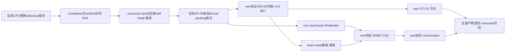
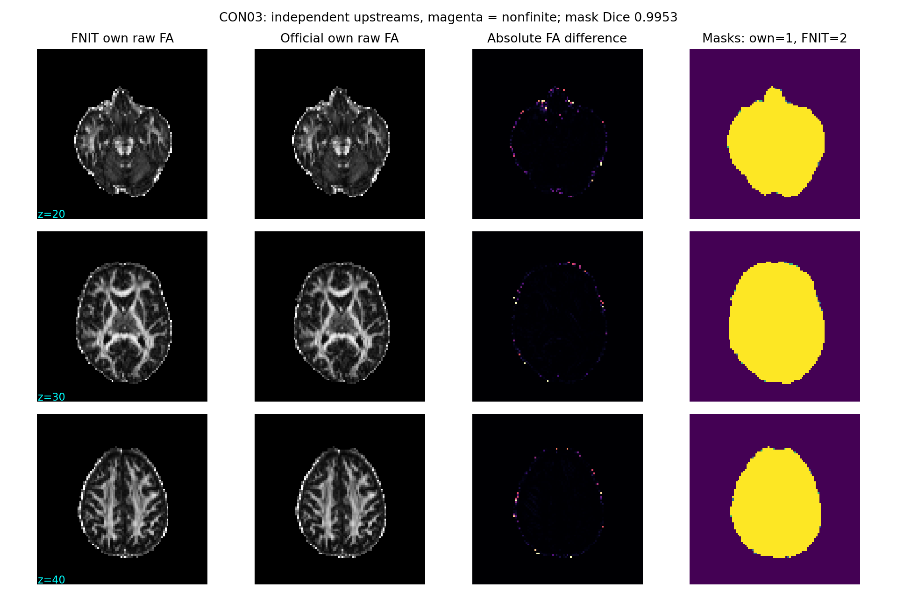
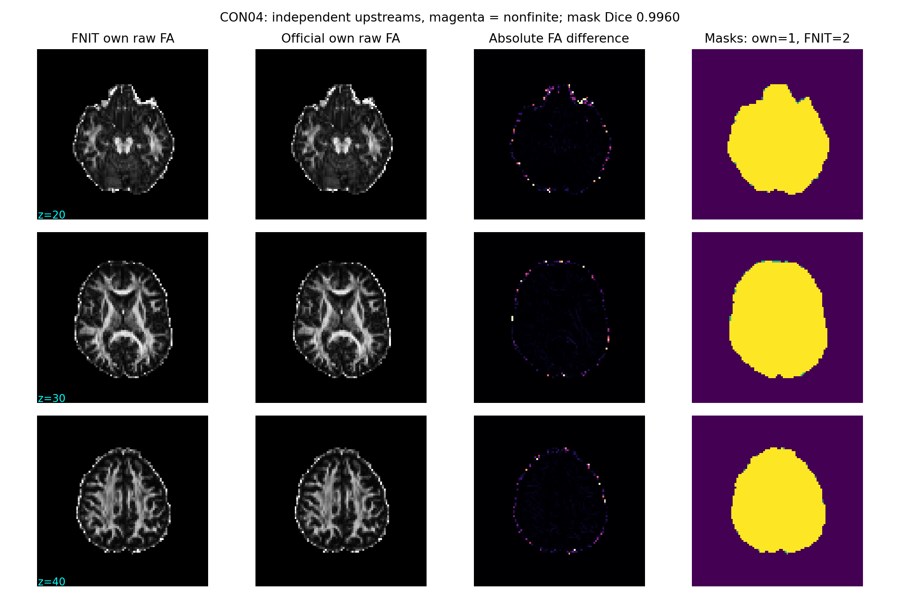
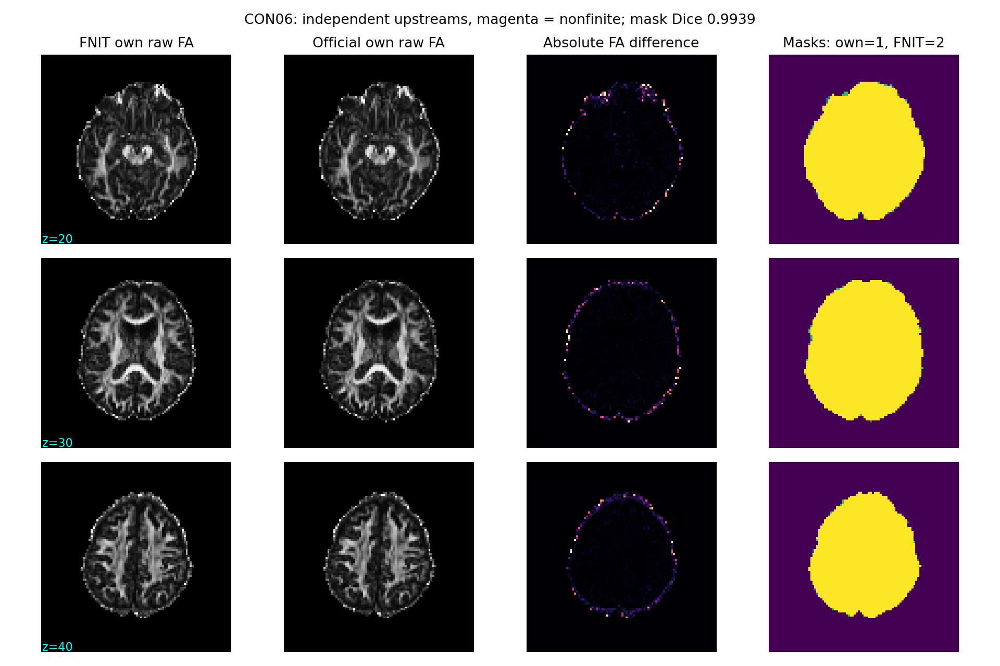
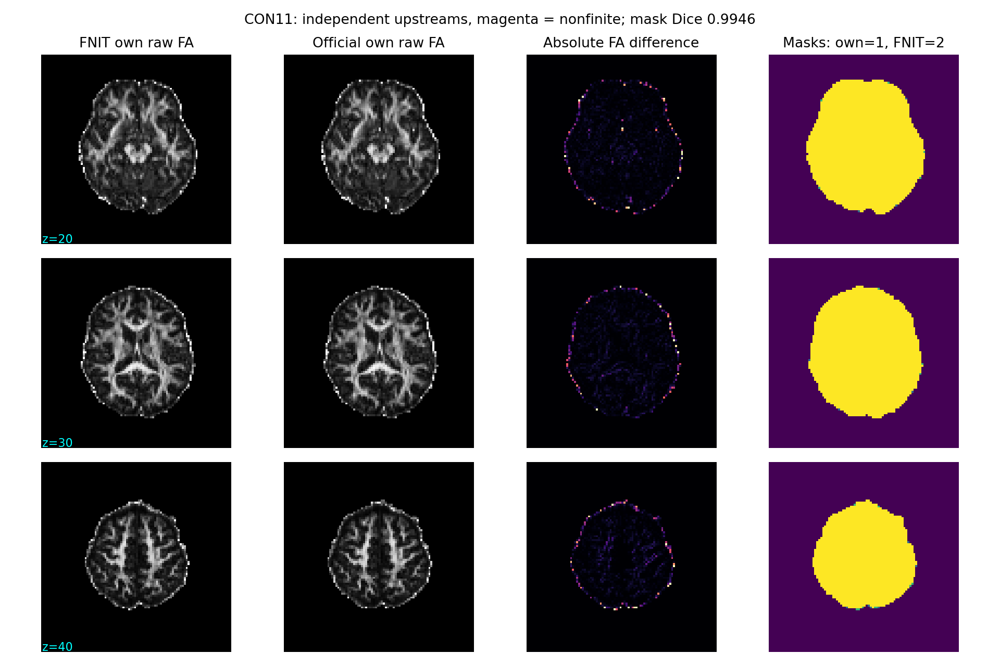

# 独立官方十例 DWI 建模链

## 1. 功能简介与流程

当前使用显式逐病例映射：原九例模型保留`official_modeling_CPU_budget_raw10_v1`，CON11独立使用`official_modeling_CON11_selected_recovery_v1`；共同调用SHA `616b3f01197447da8255c20592165f066f03bc20b48765b9612ea6ada29d11c1`的冻结`model_case`，CPU8、单case、无GPU。当前实际完成10/10：CON01、CON03、CON04、CON05、CON06、CON07、CON08、CON09、CON10、CON11。十例完成依据是原九例加新CON11的真实consumer映射；旧global cohort的CON11仍保持原状态，不补写或软链接旧路径。

这是独立原软件reference工具，不进入FNIT生产调用图，不导入torch/FNIT。前九例消费task01的`official_rawprep_cpu_budget_reference_v1`：恢复已有成功own TOPUP/SynthStrip字节并新运行eddy_cpu；CON11消费新`official_CON11_CPU_fresh_origin_v1`连续完整链。每例自行生成brain/response/FOD/normalise掩膜、Dhollander响应、MSMT-CSD和归一化组织，并输出FA/方向。原CPU阶段来源和新EDDY时间分开保留。



CON08–10由原CPU producer的实际verified合同触发不可变帧绑定。CON11经已核验新packing route和独立baseline lineage进入fresh CPU链，再由strict waiter逐项核对实际report/completed/verified/source/activation及canonical raw，才启动独立一例模型。所有来源保存实际路径和SHA，科学worker和旧配置保持不变。

## 2. Python调用、输入输出及参数

```python
from pathlib import Path
import hashlib
import json

reference_root = Path('/cwStorage/home/gongwk/Notebook_code/fnit_connectome_tenraw_20261002')
case_map_path = reference_root / 'task_02' / 'official_modeling_explicit_ten_delivery_v1' / 'completed_case_map.json'
case_map = json.loads(case_map_path.read_text())
for subject_name, actual_case in case_map['actual_completed_case_map'].items():
    consumer_contract_path = Path(actual_case['consumer_contract']['path'])
    assert hashlib.sha256(consumer_contract_path.read_bytes()).hexdigest() == actual_case['consumer_contract']['sha256']
    consumer_contract = json.loads(consumer_contract_path.read_text())
    fractional_anisotropy_path = Path(consumer_contract['files']['FA']['path'])
    assert hashlib.sha256(fractional_anisotropy_path.read_bytes()).hexdigest() == consumer_contract['files']['FA']['sha256']
    print(subject_name, fractional_anisotropy_path, consumer_contract_path)
```

输入逐项说明：

- `report.json`：本例CPU producer最终报告，必须completed=true；official TOPUP/SynthStrip/EDDY命令均returncode0，source与activation完全一致。
- `completed_contract.json`及`completed_contract_verified.json`：实际solver=cpu、GPU_UUID=null、seed12345、ref_scan_no、subject、路径和raw/output SHA一致；verified还绑定最终report SHA。
- corrected DWI：同原始AP网格的4D NIfTI，轴为x/y/z/volume；这十例每例102个volume。rotated bvec为3×N文本，bval为N个值；MRtrix导出梯度为N×4文本。
- canonical manifest：逐病例原始十文件的绝对路径/SHA须完全一致，再独立重哈希。上游自身fieldcoef、movpar、SynthStrip mask及梯度另核对，不能换成FNIT输出。
- actual source/packing：成功own CPU源报告和命令、恢复字节、实际formal packing与canonical raw帧均核对；仅将formal packing用于确认原始帧选择，不读取FNIT field/mask/corrected DWI用于官方建模。

输出目录`sub-CONxx`保存原命令log、`report.json`和最终`consumer_contract.json`：b0均值/brain；brain/response/FOD/normalise/accepted mask；FA和3分量方向；WM/GM/CSF响应文本；raw及normalized WM/GM/CSF NIfTI；norm field、balance factors、gradient和shell文本。WM额外轴为45个SH系数，GM/CSF可保留末尾单例通道；均保留实际shape。每文件记录path、size、SHA、网格/dtype/axcodes与finite/nonfinite读回，mask另记录非零数。

FA NaN和大于1的实际值不截断。方向第4轴是3个分量，没有物理空间间隔；其原header spacing[3]=NaN保持原样。SH/组织额外轴同样不表示空间距离。下游记录实际消费文件及完整contract原SHA，避免把无关分量轴metadata混入空间标量验证。

|参数/配置项|含义与当前值|
|---|---|
|cohort `--config`|必填冻结JSON；当前为CPU_budget_raw10_v2配置|
|cohort `--poll-seconds`|等待上游间隔，默认30秒；不改变科学计算|
|cohort `--once`|完成一轮检查后退出；仍需真实CPU完成合同，不代表十例完成|
|dispatcher `--config` / `--state-root`|冻结配置和独立启动记录目录；当前dispatcher_v2，已启动，无需重复运行|
|launcher `--config`|同一冻结配置；只在真实上游ready且结果namespace尚不存在时创建模型freeze/进程|
|`manifest` / `manifest_sha256` / `raw_root`|canonical原始文件清单、固定摘要、原始数据根目录|
|`output_root` / `previous_modeling_root`|当前模型目录/已退役v2目录；禁止重跑已完成病例或覆盖旧freeze|
|`subjects`|唯一病例ID、明确report路径、runner SHA、实际solver、known索引；pending只经verified不可变证据提升|
|`upstream_producer_root` / `upstream_runner_path` / `upstream_runner_sha256`|同一实际CPU预算producer及其源码摘要，禁止换producer|
|`CPU_fallback_activation_report` / `upstream_activation_sha256` / `upstream_activation_format`|真实budget activation路径/摘要/格式；字段名沿用现有工具，但当前不是旧OOM fallback|
|`GPU_budget_evidence_path` / `activation_policy` / `explicit_CPU_budget_reference_authorization`|实际43.2GB预算SIGTERM证据及明确CPU预算参考授权；不写成OOM|
|`approved_restored_heldout_root` / `formal_FNIT_packing_root`|明确own成功CPU来源/实际formal packing根目录|
|`pending_alignment_binding_root`|后四例只写一次帧绑定的独立metadata目录|
|`forbidden_input_roots`|拒绝旧solver-isolation、pilot及FNIT结果作官方输入|
|`mrtrix_bin` / `fsl_root`|实际MRtrix3.0.3与FSL6.0.7.4安装目录|
|`expected_upstream_solver`|当前cpu；核对actual official_EDDY_CPU、eddy_cpu SHA、nullUUID、8线程及全部flags|
|`upstream_discovery_root`|历史保留字段，当前不扫描猜测上游，所有case路径均显式绑定|
|`profile`|固定数学及掩膜定义，见第4节；description/比较范围字段仅记录方法|
|subset调度 `--root` / `--state-root` / `--poll-seconds` / `--once`|参考根目录、exclusive新状态目录、默认30秒等待、一轮只读检查；pending不创建模型目录|
|显式collector `--root` / `--output` / `--poll-seconds` / `--once`|参考根目录、exclusive新metadata目录、默认30秒、一轮检查；全部十个consumer通过实际SHA与网格检查才写completed_case_map|
|metadata launcher `--root`|只启动等待器与collector，exclusive launch receipt拒绝重复|
|来源receipt `--root` / `--output`|真实参考根目录及exclusive新receipt文件；只执行packing守卫，modeling_ready仍false|
|诊断 `--root` / `--output` / `--subjects`|真实参考根目录、新诊断目录、明确已完成病例列表；CPU8调用冻结response.py，同输入诊断|
|显式评估/诊断 `--case-map`|必填实际collector status或completed_case_map；只消费actual_completed_case_map中的真实consumer，原九例及新CON11分别绑定|
|评估 `--root` / `--output` / `--diagnostic-root`|实际参考根目录、新评估目录、一个或多个明确诊断目录；同病例多个诊断须消歧|

`profile`固定brain=b<50均值+LAS BET f0.2/g-0.05/R；response mask=3.0.3默认dwi2mask；FOD/normalise mask分别六邻域膨胀2/侵蚀2；shells使用自身梯度且bvalue_scaling=no；tensor predicted迭代2；WM lmax8、GM/CSF lmax0；mtnormalise order3/niter15,7/reference0.28209479177，不加balanced。Dhollander采用本安装默认响应阶数与voxel选择；所有默认和实际argv在report中保留，不调整精度或算法。

CON11实际完成来源单独绑定：正式FNIT baseline为`/cwStorage/home/gongwk/Notebook_code/fnit_connectome_tenraw_20261002/formal_selected_monitor_recovery_v3/baseline/sub-CON11`；官方fresh CPU使用`task_01/official_CON11_CPU_fresh_origin_v1/sub-CON11`，原AP0/PA0 packing来源保持不变。verified CPU合同`/cwStorage/home/gongwk/Notebook_code/fnit_connectome_tenraw_20261002/task_01/official_CON11_CPU_fresh_origin_v1/sub-CON11/completed_contract_verified.json`（SHA `d1e6d011f93cc288701ad593365ce01132048f254c17fbf50a1c144640221332`）通过strict外层守卫后，未改动的冻结model_case实际输出`/cwStorage/home/gongwk/Notebook_code/fnit_connectome_tenraw_20261002/task_02/official_modeling_CON11_selected_recovery_v1/sub-CON11/consumer_contract.json`（SHA `bb5ab1b71c2cbda4387cf918edadf292305e6af466042db0b4e9431bd9a15339`）。原worker的fresh ready_contract不强制verified sidecar，这项严格检查由新wrapper完成。逐病例collector核查完整consumer/report/全部文件SHA及网格，anatomy/repeat消费最终显式case-map；9旧route和1新route分开保留。

实际CON11 producer是`orchestrate_CON11_CPU_subset_v2.py`（SHA `bf62ce93000e79215317514fcd61ba0a15a06487ea1d775fb5342bd85f1206d4`），状态目录`CON11_subset_dispatcher_v2`，实际PID62745，模型wall104.563秒。v1/PID33340在科学模型启动前因将canonical AP raw链接的resolve目标误限在本病例目录而退出；原waiting status、终端错误和freeze保留。v2只允许AP DWI/bval/bvec链接到已逐项核验的canonical AP目标及SHA，自产field/mask/control仍严格在own目录；没有写入或链接旧CON11 FNIT目录。科学worker仍为`616b3f01197447da8255c20592165f066f03bc20b48765b9612ea6ada29d11c1`，原冻结配置SHA `7ec2008b29c077797c259cad1245c8d2f9999c86af621d0821c9bc7d52335627`未变；13条实际模型命令全部returncode0。新configuration SHA `96bbae28144cf4602e5fe5ff9edcccf53fbb15e41703d5fee9398fa223729a7f`、model freeze SHA `d27ed9a016db4c5938de69e5023a7de6448b731a7a95d23b83dcb09fb9f4e8b4`、launch SHA `d714f0adac1e9f5b46e610b87a0d1516ec2e77222a8afab6392639ef968e0bff`和status SHA `9cc71e53c7c5edf7485e71caac12e08fcf2c5052347c1decc69e2a7c0c0268c7`均经实际重哈希。

原 dispatcher freeze SHA `12066e3cc3269cdd5d28e85115b4bb4ed505ab22c984690ac66df733e073a372` 是输入就绪前的 precursor：`output_root_planned` 指独立新目录，`subset_created=false`。原 model freeze `d27ed9…` 是其后绑定实际 configuration 和 raw/control inputs 的记录。二者均绑定 worker `616b…`、wrapper `bf62…` 与 base config `7ec2…`，但文件与含义不同；当前完成依据是 v2 status、13条成功命令及 consumer/report 的实际 SHA。原 freeze 字节均未补写。仓库保留经原 SHA 验证的完整字节于 `actual_CON11_model_metadata/`，包含启动前 dispatcher freeze 和输入就绪后的 model freeze。

## 3. 命令行调用

以下记录实际 CPU budget 首次启动入口。当前十例已完成；原九例目录与独立 CON11 目录由完成映射连接。dispatcher 对已有 state-root/model namespace 拒绝覆盖：

```bash
reference_root=/cwStorage/home/gongwk/Notebook_code/fnit_connectome_tenraw_20261002
tool_directory="$reference_root/task_02"
python_executable=/cwStorage/home/gongwk/Notebook_code/fnit_conda_env_956b1a9/bin/python
CUDA_VISIBLE_DEVICES='' OMP_NUM_THREADS=8 OPENBLAS_NUM_THREADS=8 MKL_NUM_THREADS=8  "$python_executable" "$tool_directory/wait_launch_CPU_budget_modeling_v1.py"  --config "$tool_directory/official_modeling_CPU_budget_raw10_v2.config.json"  --state-root "$tool_directory/CPU_budget_modeling_dispatcher_v2"
```

当前读取显式映射及重现只读评估（输出目录须全新，不启动模型）：

```bash
case_map_path="$tool_directory/official_modeling_explicit_ten_delivery_v1/completed_case_map.json"
cat "$case_map_path"
CUDA_VISIBLE_DEVICES='' "$python_executable" "$tool_directory/summarize_explicit_CPU_modeling_v4.py" --root "$reference_root" --case-map "$case_map_path" --output "$tool_directory/new_explicit_modeling_evaluation" --diagnostic-root "$tool_directory/actual_CPU_budget_comparison_v1" --diagnostic-root "$tool_directory/actual_CPU_budget_comparison_v2" --diagnostic-root "$tool_directory/actual_CPU_budget_comparison_v3" --diagnostic-root "$tool_directory/actual_CPU_budget_comparison_v4" --diagnostic-root "$tool_directory/actual_CPU_budget_comparison_v5" --diagnostic-root "$tool_directory/actual_CPU_budget_comparison_v6"
```

读取当前已完成的 CON11 v2 和最终十例映射：

```bash
cat "$tool_directory/CON11_subset_dispatcher_v2/status.json"
cat "$tool_directory/official_modeling_explicit_ten_delivery_v1/completed_case_map.json"
```

仓库当前文件布局：`actual_CPU_budget_modeling_10of10.json` 保留原始完整评估字节（SHA `228a3454…`），`actual_CPU_budget_modeling_10of10_summary.json` 是交付摘要；`actual_completed_modeling_9plus1_case_map.json` 保存原完成映射；`actual_official_CPU_models/CONxx/` 保存原 model report、consumer 合同和同输入 CPU 诊断；十张 `CONxx_independent_FA.png` 绑定实际 figure SHA。`actual_CON11_source_contract.json` 分开绑定实际 source、配置、输入、dispatcher/model freeze、launch、status 与完成 consumer。

独立核验现有结果（只读取与重哈希，不启动模型）：

```bash
local_evidence_directory="validation/connectome/tenraw_20261002/task_02"
python3 "$local_evidence_directory/audit_actual10_CPU_delivery.py" \
  --local-root "$local_evidence_directory" \
  --control-path /tmp/fnit-bwas-headcw.sock \
  --host gongwk@10.190.248.228 --port 39516 \
  --output /tmp/new_ten_model_CPU_readonly_proof.json
```

`--local-root` 指本地冻结十例摘要/source合同目录；`--control-path` 指已认证 SSH socket；`--host/port` 是 head 节点；`--output` 必须是新 proof 文件。核验用标准库读取实际 consumer、model report、诊断、图及全部唯一输出 SHA；缺失的原诊断 JSON 可从经 SHA 校验的原字节补齐，已有文件必须逐字节一致。当前实际 proof 见 `root_final10_actual_CPU_audit.json`；当前74项必要 payload/source/proof 索引见 `FINAL10_payload_SHA256.json`，不把历史快照索引当作当前目录索引。

cohort/source/config/activation在首次启动时冻结；每步复用须input/output SHA相同。部分或未跟踪输出不覆盖。上游等待不计入model_case wall，命令wall、CPU轴重排、hash/readback另列。评估绘图复用项目已声明的matplotlib/nibabel和私有plot_runtime，实际解释器SHA/版本写入report，无新增生产依赖。

## 4. 对应原软件命令

下面是每例实际命令结构，完整绝对路径/版本/输入输出SHA/时间保存在原report。MRtrix命令均使用`-nthreads 8`：

```bash
mrinfo official_data.nii.gz -fslgrad official_rotated.bvec raw.bval  -bvalue_scaling no -export_grad_mrtrix gradient.txt -nthreads 8
mrinfo official_data.nii.gz -grad gradient.txt -shell_bvalues -nthreads 8
# B_LT50_INDICES来自本例实际bval；与raw TOPUP选帧b<100区分。
mrconvert official_data.nii.gz bzero.nii.gz -coord 3 B_LT50_INDICES -datatype float32 -nthreads 8
mrmath bzero.nii.gz mean mean_bzero.nii.gz -axis 3 -nthreads 8
# 工具用nibabel进行native/LAS可逆轴交换和BET结果返回，不插值。
bet mean_bzero_LAS.nii.gz bet_LAS -m -f 0.2 -g -0.05 -R
dwi2mask official_data.nii.gz response_mask.nii.gz -grad gradient.txt -nthreads 8
maskfilter brain_mask.nii.gz dilate fod_mask.nii.gz -npass 2 -nthreads 8
maskfilter brain_mask.nii.gz erode normalise_mask.nii.gz -npass 2 -nthreads 8
dwi2tensor official_data.nii.gz tensor.nii.gz -grad gradient.txt -mask brain_mask.nii.gz -iter 2 -nthreads 8
tensor2metric tensor.nii.gz -fa fa.nii.gz -vector direction.nii.gz  -modulate none -mask brain_mask.nii.gz -nthreads 8
dwi2response dhollander official_data.nii.gz wmrf.txt gmrf.txt csfrf.txt  -grad gradient.txt -mask response_mask.nii.gz -scratch response_scratch -nocleanup -nthreads 8
dwi2fod msmt_csd official_data.nii.gz wmrf.txt wm.nii.gz gmrf.txt gm.nii.gz csfrf.txt csf.nii.gz  -grad gradient.txt -mask fod_mask.nii.gz -lmax 8,0,0 -nthreads 8
mtnormalise wm.nii.gz wm_norm.nii.gz gm.nii.gz gm_norm.nii.gz csf.nii.gz csf_norm.nii.gz  -mask normalise_mask.nii.gz -order 3 -niter 15,7 -reference 0.28209479177  -check_norm field.nii.gz -check_mask accepted_mask.nii.gz -check_factors balance_factors.txt -nthreads 8
```

3.0.3的dwi2mask是legacy默认语法，不追加新版legacy子命令。官方CSD使用自身响应，mtnormalise使用自身raw组织；旧fixed-input `reference_modeling.py`仅保留solver隔离职责，不充作本轮独立链。

## 5. 实际精度、耗时与脑图

实际完成10/10例，当前[完整报告](actual_CPU_budget_modeling_10of10.json) SHA `228a34546bf90de07a79d5246b544d310511f834d5678e5a967ca0c5cdad9033`。逐病例保存consumer/modeling/upstream report摘要、canonical十文件、实际source/configuration/activation/选帧绑定、命令argv/binary SHA/version、FA非有限坐标和原header轴信息。原始消费者合同和结果不改写。

|病例|模型wall s|DTI+FA s|Dhollander s|MSMT-CSD s|mtnormalise s|brain Dice|独立链公共mask FA RMSE|官方/FNIT FA NaN|
|---|---:|---:|---:|---:|---:|---:|---:|---:|
|CON01|115.309|2.205|14.488|68.157|2.972|0.995298|0.034035|37/36|
|CON03|98.152|2.135|12.421|57.835|2.762|0.995333|0.024563|6/1|
|CON04|96.248|2.137|12.312|57.067|2.779|0.995954|0.034185|32/32|
|CON05|111.634|2.214|12.859|63.292|2.927|0.995019|0.031137|168/151|
|CON06|103.035|2.200|12.157|62.060|3.050|0.993861|0.042233|33/35|
|CON07|99.840|2.185|12.563|59.599|2.869|0.994460|0.060402|0/75|
|CON08|97.145|2.143|12.473|56.592|2.798|0.996425|0.044188|265/259|
|CON09|116.573|2.231|12.788|73.234|3.112|0.995235|0.030782|91/96|
|CON10|105.577|2.198|13.287|62.998|3.002|0.994219|0.043323|1/6|
|CON11|104.563|2.197|14.601|62.979|2.819|0.994623|0.052910|29/25|

独立raw链精度包含两条链各自corrected DWI、rotated gradients及mask的差异；不称为同输入solver误差。官方命令wall和整段model_case wall均为实测。正式FNIT wall是raw DWI至八atlas连接矩阵、supplied anatomy，未记录modeling-only wall，不能与模型wall相除宣称GPU加速。前九例恢复已有成功own TOPUP/SynthStrip并新跑CPU EDDY；CON11为fresh全流程CPU，其连续rawprep wall和原阶段wall分别保存在上游报告，不拼成同一种端到端时间。

|病例|同输入CPU FA RMSE|P99绝对差|最大绝对差|非有限位置不符|方向最大轴向角 °|
|---|---:|---:|---:|---:|---:|
|CON01|2.12412288e-05|0|0.00720739365|0|8.65643959e-05|
|CON03|2.97118122e-08|0|9.05990601e-06|0|0.000615845461|
|CON04|0.000130194958|0|0.0380513668|0|0.000215404908|
|CON05|4.68033405e-06|0|0.0010227561|0|0.000105270671|
|CON06|3.15075646e-05|0|0.0100548267|0|0.0195082303|
|CON07|0.000144597894|0|0.0478248257|0|41.6323063|
|CON08|1.99451816e-06|0|0.000648975372|0|0.000124026602|
|CON09|3.8899149e-06|0|0.00135195255|0|0.328767962|
|CON10|0.000721783987|0|0.245622754|0|6.30522098e-05|
|CON11|1.20528383e-07|0|3.49879265e-05|0|0.341458123|

同输入CPU诊断实际完成10/10例，使用冻结成熟response.py及同一官方DWI/gradient/brain mask，CPU8、batch4096、原float64计算和float32 tensor roundtrip。它与正式FNIT GPU raw链分开，不补未完成数值。

CON07历史同输入方向最大差41.632306°保留：[66,42,12]是109401有效方向对中唯一超过0.001°的点。原诊断只保存FA/方向，未保存其tensor。随后原函数单点trace得到近各向同性张量，但原4096行批次重放未复现历史FA/方向；因此不能将新trace特征值充作旧结果的特征值。实测102个measurement中97为负，第三次原拟合进入lstsq fallback，Gram条件数约1e23，观察到数值敏感性。native与Torch差异原因尚未定位或修复，不能宣称稳定等价；正式GPU另一raw链同坐标FA为NaN且无tensor产物，不据此推断same-input GPU误差。

同输入CPU诊断的FA P99绝对差均为0，但尾部仍有非零差：CON10最大FA差0.245623，CON07方向最大差41.632306°。这些尾差保留在原诊断中，尚未全部定位；本报告不宣称逐值等价。该诊断验证CPU tensor/FA/方向，不能代替同输入GPU或response/FOD/normalisation对照。

FA NaN与大于1的值不截断，方向extra轴NaN间隔按非空间分量metadata保留。WM/GM/CSF raw、normalized及norm field非有限计数逐项列在报告；正式FNIT未保存本轮response/FOD/normalisation中间产物，旧pilot不替代本轮对照。

真实脑图并排显示正式FNIT FA、官方FA、绝对差、两脑mask；magenta为非有限值：













## 6. 最近版本与benchmark记录

- 十例实际收尾：原九例及新CON11分别绑定consumer/report/source/raw/control lineage，全部十例完成CPU同输入张量诊断和脑图。v1 canonical链接guard失败保留，新metadata v2严格核对后调用同616b worker一次完成；未重跑已完成MRI。13项新guard测试通过，科学算法/精度/掩膜不变。
- 交付工具历史失败：explicit评估v2局部变量覆盖导致报告失败，保留目录并在v3/v4只读评估修复；文档idle旧waiter按PID精确退役并保留freeze/retirement。首次本地取回因跨文件系统replace失败，v4只修同文件系统scratch传输，不重新计算数据。

- CON07只读异常定位：已有官方tensor、双方FA/方向和brain mask读回，重哈希同输入DWI/gradient并核对affine；保留top10坐标、特征值/间隔、向量、分位数和描述性计数。未生成CPU tensor、未重跑模型；CPU eigengap与具体差异原因尚不能由存量产物确定。

- CSD采用范围：仅采用`104963ad`的有序active-set行索引缓存，保持数学、响应、掩膜、batch4096和精度。CON01固定输入ABBA中位数改善6.924%，CON03扩展ABBA中位数改善3.448%，其中一轮反而慢0.926%；30个张量逐位一致。生命周期/empty-cache候选没有采用，allocator设置的显存效果单独记录。这些固定输入结果不充作本轮独立raw链比较，也不代表每轮都有稳定加速。

- 当前CPU budget reference：实际上游`official_rawprep_cpu_budget_reference_v1`，producer SHA `b32a688318d68c63a1dd5e5fba2fdafb76b5418e1c1c4bad8f1468648c10e48a`，activation SHA `e96b0a2f00c9cebaf6ac6787380e492810cc6d3ec68dc37095fed373ec4b4248`。成功own TOPUP/SynthStrip字节恢复，新的eddy_cpu保持全部科学flags、initrand12345和真实ref。当前known帧CON01[76,0]、CON03[0,0]、CON04/05[26,0]、CON06/07[0,0]；后四例由同producer真实verified证据追加，禁止猜测。
- 元数据调度修复：旧idle dispatcher117298在未启动模型时精确停止并保留freeze/status；dispatcher_v2 PID120790已实际启动modeling PID122690。35项来源守卫含完整verified合同读回、pending binding只写一次、raw/formal packing voxel变化拒绝；小夹具是provenance测试，不是MRI benchmark。
- 2026-10-03，Task2 `e4be3868`：十例模型、十例同输入CPU诊断和十张脑图完成。原八例 model report、consumer 和脑图与新交付字节完全一致并复用；新 CON10/11 补齐。当前仅保留十例评估/摘要与实际完成映射，删除被替代的本地8例重复快照和退休 curation helper，SHA/大小在 `CURATION_final10.json`；原服务器快照和 Git 历史保留。
- 历史失败：原rawprep v1两例CUDA OOM；v2两例实测own峰值43,203,428,352 bytes，budget_exceeded=true后SIGTERM -15，属于预算中止。旧OOM条件没有激活。旧建模v1/v2完成均0，coordinator172836/51766已退役；失败原report、freeze、status snapshot与retirement在原namespace保留。对应已执行工具/配置仅为历史证据，没有旧启动教程。
- 独立复核：headcw CPU标准库实际完成448项检查，250份唯一模型/上游输出及sidecar重哈希一致，十例 consumer/model report/原诊断/脑图 SHA一致。新metadata guard与packing guard在head隔离CPU临时副本22项通过，不运行MRI/GPU solver。所有CON07历史trace、未复现批次及真实失败/原waiting metadata保留；旧v1终端guard错误与文档waiter退役原记录见 `actual_failed_metadata/`。当前freeze/完成receipt分开记录。
- 清理：删除从未使用的`official_modeling_cpu_raw10_v3.config.json`和`official_chain_CPU_fallback.schema.json`，当前文档仅保留实际CPU预算入口。旧固定输入及ABBA记录另见README.md，职责与本轮独立链分开。

## 7. 原实现、参考文献与资源许可

仅使用服务器已安装MRtrix3.0.3-103-g026e850d、FSL6.0.7.4作独立reference；FNIT生产不调用这些原程序。原软件程序、权重和原始MRI不复制发布。十例OpenNeuro ds001226数据及采集许可/provenance以task01实际canonical manifest冻结记录为准，manifest SHA `d707f7a990372e50fb27de0023b2cddfc4eb74c7e5cdd9d909e41b90c2fa1b88`。此工具没有新增外置权重/模板或生产依赖。

[MRtrix3代码库](https://github.com/MRtrix3/mrtrix3)、[3.0.3 Dhollander命令及参考](https://userdocs.mrtrix.org/en/3.0.3/reference/commands/dwi2response.html#dwi2response-dhollander)、[3.0.3 mtnormalise命令及参考](https://userdocs.mrtrix.org/en/3.0.3/reference/commands/mtnormalise.html)、[MRtrix原软件源码与版本](https://github.com/MRtrix3/mrtrix3)、[FSL BET官方说明](https://fsl.fmrib.ox.ac.uk/fsl/docs/structural/bet.html)。

参考：Smith, Human Brain Mapping 2002, 17(3):143–155（BET）；Tournier et al., NeuroImage 2019, 202:116137（MRtrix3）；Jeurissen et al., NeuroImage 2014, 103:411–426（MSMT-CSD）；Dhollander et al., ISMRM Diffusion Workshop 2016:5、ISMRM 2019:555（响应估计）；Raffelt et al., ISMRM 2017:3541、Dhollander et al., ISMRM 2021:2472（组织强度归一化）。原文与算法引用以以上版本匹配的官方reference页面和实际binary帮助为准。
