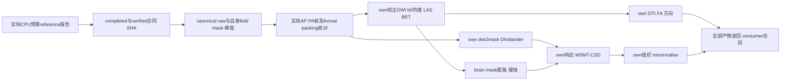

# 独立官方十例 DWI 建模链

## 1. 功能简介与流程

当前入口是`official_modeling_cohort_cpu_v3.py`及冻结配置`official_modeling_CPU_budget_raw10_v2.config.json`。结果目录为`task_02/official_modeling_CPU_budget_raw10_v1`；`CPU_budget_modeling_dispatcher_v2`已真实启动modeling coordinator，nodecw10 PID122690每次处理一例、每例8线程，禁用GPU。2026-10-03 00:29:48 UTC的只读快照已核验CON01、CON03、CON04、CON05、CON06、CON07、CON08、CON09、CON10九例原consumer/report字节；CON11仍等待真实CPU前处理合同，模型目录尚未创建。当前精度、耗时比较及脑图报告覆盖前八例，CON10完成状态不改写为已完成精度评估。实际等待状态、PID/启动时间及source绑定见[root_followup_actual_delivery_audit.json](root_followup_actual_delivery_audit.json)。

这是独立原软件reference工具，不进入FNIT生产调用图，不导入torch/FNIT。它消费task01实际`official_rawprep_cpu_budget_reference_v1`：恢复已有成功own TOPUP/SynthStrip字节并新运行eddy_cpu。每例自行生成brain/response/FOD/normalise掩膜、Dhollander响应、MSMT-CSD和归一化组织，并输出FA/方向。原CPU阶段来源和新EDDY时间分开保留。



CON08–11由同一个明确CPU producer的真实verified合同触发追加帧绑定。程序独立核对原始AP/PA实际帧、b<100及实际formal FNIT packing的路径、SHA、affine和全部voxel后，exclusive-create `CPU_budget_pending_alignment_bindings_v1/sub-CONxx.alignment_binding.json`。该证据记录索引、report/verified/activation/raw/pair/packing/source SHA，不覆盖已有内容，也不改冻结配置。逐病例消费者保存`alignment_binding`路径、SHA和证据。

## 2. Python调用、输入输出及参数

```python
from pathlib import Path
import hashlib
import json

reference_root = Path('/cwStorage/home/gongwk/Notebook_code/fnit_connectome_tenraw_20261002')
modeling_directory = reference_root / 'task_02' / 'official_modeling_CPU_budget_raw10_v1'
cohort_status = json.loads((modeling_directory / 'cohort_status.json').read_text())
for subject_name, subject_status in cohort_status['subjects'].items():
    if subject_status['state'] != 'completed':
        continue  # 等待或运行不等于完成
    consumer_contract_path = Path(subject_status['consumer_contract'])
    consumer_contract = json.loads(consumer_contract_path.read_text())
    fractional_anisotropy_path = Path(consumer_contract['files']['FA']['path'])
    actual_digest = hashlib.sha256(fractional_anisotropy_path.read_bytes()).hexdigest()
    assert actual_digest == consumer_contract['files']['FA']['sha256']
    print(subject_name, fractional_anisotropy_path, consumer_contract_path)
```

输入逐项说明：

- `report.json`：本例CPU producer最终报告，必须completed=true；official TOPUP/SynthStrip/EDDY命令均returncode0，source与activation完全一致。
- `completed_contract.json`及`completed_contract_verified.json`：实际solver=cpu、GPU_UUID=null、seed12345、ref_scan_no、subject、路径和raw/output SHA一致；verified还绑定最终report SHA。
- corrected DWI：同原始AP网格的4D NIfTI，轴为x/y/z/volume；这十例每例102个volume。rotated bvec为3×N文本，bval为N个值；MRtrix导出梯度为N×4文本。
- canonical manifest：逐病例原始十文件的绝对路径/SHA须完全一致，再独立重哈希。上游自身fieldcoef、movpar、SynthStrip mask及梯度另核对，不能换成FNIT输出。
- actual source/packing：成功own CPU源报告和命令、恢复字节、实际formal packing与canonical raw帧均核对；仅将formal packing用于确认原始帧选择，不读取FNIT field/mask/corrected DWI用于官方建模。

输出目录`sub-CONxx`保存原命令log、`report.json`和最终`consumer_contract.json`：b0均值/brain；brain/response/FOD/normalise/accepted mask；FA和3分量方向；WM/GM/CSF响应文本；raw及normalized WM/GM/CSF NIfTI；norm field、balance factors、gradient和shell文本。WM额外轴为45个SH系数，GM/CSF可保留末尾单例通道；均保留实际shape。每文件记录path、size、SHA、网格/dtype/axcodes与finite/nonfinite读回，mask另记录非零数。

FA NaN和大于1的实际值不截断。方向第4轴是3个分量，没有物理空间间隔；其原header spacing[3]=NaN保持原样。SH/组织额外轴同样不表示空间距离。下游记录实际消费文件及完整contract原SHA，避免把无关分量轴metadata混入空间标量验证。

|参数/配置项|含义与当前值|
|---|---|
|cohort `--config`|必填冻结JSON；当前为CPU_budget_raw10_v2配置|
|cohort `--poll-seconds`|等待上游间隔，默认30秒；不改变科学计算|
|cohort `--once`|完成一轮检查后退出；仍需真实CPU完成合同，不代表十例完成|
|dispatcher `--config` / `--state-root`|冻结配置和独立启动记录目录；当前dispatcher_v2，已启动，无需重复运行|
|launcher `--config`|同一冻结配置；只在真实上游ready且结果namespace尚不存在时创建模型freeze/进程|
|`manifest` / `manifest_sha256` / `raw_root`|canonical原始文件清单、固定摘要、原始数据根目录|
|`output_root` / `previous_modeling_root`|当前模型目录/已退役v2目录；禁止重跑已完成病例或覆盖旧freeze|
|`subjects`|唯一病例ID、明确report路径、runner SHA、实际solver、known索引；pending只经verified不可变证据提升|
|`upstream_producer_root` / `upstream_runner_path` / `upstream_runner_sha256`|同一实际CPU预算producer及其源码摘要，禁止换producer|
|`CPU_fallback_activation_report` / `upstream_activation_sha256` / `upstream_activation_format`|真实budget activation路径/摘要/格式；字段名沿用现有工具，但当前不是旧OOM fallback|
|`GPU_budget_evidence_path` / `activation_policy` / `explicit_CPU_budget_reference_authorization`|实际43.2GB预算SIGTERM证据及明确CPU预算参考授权；不写成OOM|
|`approved_restored_heldout_root` / `formal_FNIT_packing_root`|明确own成功CPU来源/实际formal packing根目录|
|`pending_alignment_binding_root`|后四例只写一次帧绑定的独立metadata目录|
|`forbidden_input_roots`|拒绝旧solver-isolation、pilot及FNIT结果作官方输入|
|`mrtrix_bin` / `fsl_root`|实际MRtrix3.0.3与FSL6.0.7.4安装目录|
|`expected_upstream_solver`|当前cpu；核对actual official_EDDY_CPU、eddy_cpu SHA、nullUUID、8线程及全部flags|
|`upstream_discovery_root`|历史保留字段，当前不扫描猜测上游，所有case路径均显式绑定|
|`profile`|固定数学及掩膜定义，见第4节；description/比较范围字段仅记录方法|
|subset调度 `--root` / `--state-root` / `--poll-seconds` / `--once`|参考根目录、exclusive新状态目录、默认30秒等待、一轮只读检查；pending不创建模型目录|
|显式collector `--root` / `--output` / `--poll-seconds` / `--once`|参考根目录、exclusive新metadata目录、默认30秒、一轮检查；全部十个consumer通过实际SHA与网格检查才写completed_case_map|
|metadata launcher `--root`|只启动等待器与collector，exclusive launch receipt拒绝重复|
|来源receipt `--root` / `--output`|真实参考根目录及exclusive新receipt文件；只执行packing守卫，modeling_ready仍false|
|诊断 `--root` / `--output` / `--subjects`|真实参考根目录、新诊断目录、明确已完成病例列表；CPU8调用冻结response.py，同输入诊断|
|评估 `--root` / `--output` / `--diagnostic-root`|实际参考根目录、新评估目录、一个或多个明确诊断目录；同病例多个诊断须消歧|

`profile`固定brain=b<50均值+LAS BET f0.2/g-0.05/R；response mask=3.0.3默认dwi2mask；FOD/normalise mask分别六邻域膨胀2/侵蚀2；shells使用自身梯度且bvalue_scaling=no；tensor predicted迭代2；WM lmax8、GM/CSF lmax0；mtnormalise order3/niter15,7/reference0.28209479177，不加balanced。Dhollander采用本安装默认响应阶数与voxel选择；所有默认和实际argv在report中保留，不调整精度或算法。

CON11新origin的衔接单独进行：旧`formal_FNIT_packing_root`中的CON11永不补写或软链接，旧cohort源码/配置保持冻结。实际新packing及独立source/config/driver lineage已通过`validate_CON11_packing_route_v1.py`完整只读核对：canonical十文件SHA、AP0/PA0全部voxel与AP affine、无旧路径/软链接。不可变receipt为`CON11_actual_origin_receipt_v1/receipt.json`，SHA `0ac569361a1d9d0eefaa88ef1d2cc5460db9378dca0e431d4b5b201cebeecc51`。该证明仍是modeling_ready=false；还须task01明确新CPU报告/verified合同/source/activation再冻结一例subset。模型输出计划为独立`official_modeling_CON11_selected_recovery_v1`，当前未创建或启动。等待器`CON11_subset_dispatcher_v1` PID33340已运行，仅读Task1 explicit route并等待真实verified完成；逐病例collector PID33341在`official_modeling_explicit_ten_delivery_v1`收集原九例与新CON11，5741d49a交付快照为8例；新的00:29:48 UTC只读快照为9例。原worker的fresh ready_contract不强制verified sidecar，新wrapper外层补严格核对，不热改旧源码。实际CON11完成consumer出现后，anatomy/repeat按case明确映射新来源，旧global cohort不伪称十例完成。接口和待交付字段见`CON11_origin_handoff.json`。

## 3. 命令行调用

以下是已执行的当前首次启动入口，当前coordinator已运行，不重复启动。dispatcher对已有state-root/new model namespace拒绝覆盖：

```bash
reference_root=/cwStorage/home/gongwk/Notebook_code/fnit_connectome_tenraw_20261002
tool_directory="$reference_root/task_02"
python_executable=/cwStorage/home/gongwk/Notebook_code/fnit_conda_env_956b1a9/bin/python
CUDA_VISIBLE_DEVICES='' OMP_NUM_THREADS=8 OPENBLAS_NUM_THREADS=8 MKL_NUM_THREADS=8  "$python_executable" "$tool_directory/wait_launch_CPU_budget_modeling_v1.py"  --config "$tool_directory/official_modeling_CPU_budget_raw10_v2.config.json"  --state-root "$tool_directory/CPU_budget_modeling_dispatcher_v2"
```

当前读取状态及重现只读评估：

```bash
cat "$tool_directory/official_modeling_CPU_budget_raw10_v1/cohort_status.json"
# 评估目录须全新；只分析实际completed病例，不触发GPU或重新建模。
CUDA_VISIBLE_DEVICES='' "$python_executable" "$tool_directory/summarize_actual_CPU_budget_modeling_v1.py"  --root "$reference_root" --output "$tool_directory/new_actual_modeling_evaluation"  --diagnostic-root "$tool_directory/actual_CPU_budget_comparison_v1"  --diagnostic-root "$tool_directory/actual_CPU_budget_comparison_v2"  --diagnostic-root "$tool_directory/actual_CPU_budget_comparison_v3"  --diagnostic-root "$tool_directory/actual_CPU_budget_comparison_v4"
```

CON11 metadata启动已执行（等待器与collector已运行，不重复启动）：

```bash
CUDA_VISIBLE_DEVICES='' OMP_NUM_THREADS=8 OPENBLAS_NUM_THREADS=8 MKL_NUM_THREADS=8 "$python_executable" "$tool_directory/launch_CON11_subset_metadata_v1.py" --root "$reference_root"
cat "$tool_directory/CON11_subset_dispatcher_v1/status.json"
cat "$tool_directory/official_modeling_explicit_ten_delivery_v1/status.json"
# completed_case_map.json只在实际十个consumer完成并核验后出现；planned路径不是ready。
```

cohort/source/config/activation在首次启动时冻结；每步复用须input/output SHA相同。部分或未跟踪输出不覆盖。上游等待不计入model_case wall，命令wall、CPU轴重排、hash/readback另列。评估绘图复用项目已声明的matplotlib/nibabel和私有plot_runtime，实际解释器SHA/版本写入report，无新增生产依赖。

## 4. 对应原软件命令

下面是每例实际命令结构，完整绝对路径/版本/输入输出SHA/时间保存在原report。MRtrix命令均使用`-nthreads 8`：

```bash
mrinfo official_data.nii.gz -fslgrad official_rotated.bvec raw.bval  -bvalue_scaling no -export_grad_mrtrix gradient.txt -nthreads 8
mrinfo official_data.nii.gz -grad gradient.txt -shell_bvalues -nthreads 8
# B_LT50_INDICES来自本例实际bval；与raw TOPUP选帧b<100区分。
mrconvert official_data.nii.gz bzero.nii.gz -coord 3 B_LT50_INDICES -datatype float32 -nthreads 8
mrmath bzero.nii.gz mean mean_bzero.nii.gz -axis 3 -nthreads 8
# 工具用nibabel进行native/LAS可逆轴交换和BET结果返回，不插值。
bet mean_bzero_LAS.nii.gz bet_LAS -m -f 0.2 -g -0.05 -R
dwi2mask official_data.nii.gz response_mask.nii.gz -grad gradient.txt -nthreads 8
maskfilter brain_mask.nii.gz dilate fod_mask.nii.gz -npass 2 -nthreads 8
maskfilter brain_mask.nii.gz erode normalise_mask.nii.gz -npass 2 -nthreads 8
dwi2tensor official_data.nii.gz tensor.nii.gz -grad gradient.txt -mask brain_mask.nii.gz -iter 2 -nthreads 8
tensor2metric tensor.nii.gz -fa fa.nii.gz -vector direction.nii.gz  -modulate none -mask brain_mask.nii.gz -nthreads 8
dwi2response dhollander official_data.nii.gz wmrf.txt gmrf.txt csfrf.txt  -grad gradient.txt -mask response_mask.nii.gz -scratch response_scratch -nocleanup -nthreads 8
dwi2fod msmt_csd official_data.nii.gz wmrf.txt wm.nii.gz gmrf.txt gm.nii.gz csfrf.txt csf.nii.gz  -grad gradient.txt -mask fod_mask.nii.gz -lmax 8,0,0 -nthreads 8
mtnormalise wm.nii.gz wm_norm.nii.gz gm.nii.gz gm_norm.nii.gz csf.nii.gz csf_norm.nii.gz  -mask normalise_mask.nii.gz -order 3 -niter 15,7 -reference 0.28209479177  -check_norm field.nii.gz -check_mask accepted_mask.nii.gz -check_factors balance_factors.txt -nthreads 8
```

3.0.3的dwi2mask是legacy默认语法，不追加新版legacy子命令。官方CSD使用自身响应，mtnormalise使用自身raw组织；旧fixed-input `reference_modeling.py`仅保留solver隔离职责，不充作本轮独立链。

## 5. 实际精度、耗时与脑图

当前八例实际完成快照为`actual_CPU_budget_modeling_8of10.json`，逐例保存原contract/report摘要、实际argv、binary/resolved binary SHA与version、case非有限值及坐标、fullgrid/掩膜交并集统计和脑图摘要。

|病例|模型总wall s|DTI+FA命令 s|Dhollander s|MSMT-CSD s|mtnormalise s|brain Dice|FA公共mask RMSE|官方/正式FNIT FA NaN|同输入CPU FA最大差|同输入非有限位置不符|
|---|---:|---:|---:|---:|---:|---:|---:|---:|---:|---:|
|CON01|115.309|2.205|14.488|68.157|2.972|0.995298|0.034035|37/36|0.007207394|0|
|CON03|98.152|2.135|12.421|57.835|2.762|0.995333|0.024563|6/1|9.059906e-06|0|
|CON04|96.248|2.137|12.312|57.067|2.779|0.995954|0.034185|32/32|0.03805137|0|
|CON05|111.634|2.214|12.859|63.292|2.927|0.995019|0.031137|168/151|0.001022756|0|
|CON06|103.035|2.200|12.157|62.060|3.050|0.993861|0.042233|33/35|0.010054827|0|
|CON07|99.840|2.185|12.563|59.599|2.869|0.994460|0.060402|0/75|0.047824826|0|
|CON08|97.145|2.143|12.473|56.592|2.798|0.996425|0.044188|265/259|0.00064897537|0|
|CON09|116.573|2.231|12.788|73.234|3.112|0.995235|0.030782|91/96|0.0013519526|0|

独立链精度列比较两条各自拥有corrected DWI/rotated gradients/mask的raw链，不能归为同输入solver误差。最后两列另用冻结成熟FNIT response.py在同一官方DWI、gradient和完整官方brain mask上做CPU8 tensor诊断；八例finite-pair P99差均为0，非有限位置均完全匹配。这不等于正式FNIT GPU运行；正式FNIT FA NaN为36/1/32/151/35/75/259/96，官方为37/6/32/168/33/0/265/91，不能混写成同输入结果。

CON08/09同输入最大方向差分别0.000124027°/0.328767962°，P99均约0.000001207°，未认定其原因。

同输入方向比较使用轴向夹角（正负方向等价）。CON06最大差0.019508°，CON07最大差41.632306°，两例P99均约0.000001207°。CON07只读定位见`CON07_direction_location.json`：109401个有效方向对中仅1点超过0.001°，零基voxel坐标[66,42,12]、世界坐标[-44.198749,9.116221,-18.710517] mm，位于brain mask内；P99.9为0.000006613°、P99.99为0.000038591°。该点也是同输入FA最大差所在：官方FA=0.047824826，CPU FA=3.72911646e-10。已有官方tensor特征值（升序）为[0.007041910424,0.007081279531,0.007662630879]，最大绝对特征值与次大的间隔0.000581351348、相对间隔0.075868374，官方主方向并非精确重根。官方向量[0.121572919,-0.992582500,0]与已有tensor的主特征向量轴向角为0°；CPU向量[-0.589302123,0.680830479,-0.434963018]产生上述差异。CPU FA极低符合近各向同性特征，但原诊断只保存FA/方向，没有CPU tensor或特征值，因此不能确认CPU eigengap或认定具体原因。实际DWI/gradient SHA及所有输出affine/网格一致，其余109400对均不超过0.001°，没有支持全局梯度/axis错配的证据。此定位未重新拟合张量或启动任何模型solver/GPU，未改数值或门槛。原六例report保持原SHA，附定位的报告为`actual_CPU_budget_modeling_6of10_with_direction_location.json`。独立raw链CON07公共mask内另有61个FA非有限位置不符，这与本段同输入比较分开记录。

CON07原函数CPU单点trace见`CON07_tensor_point_trace.json`及`CON07_tensor_point_assessment.json`。实际102个measurement中97为负、5为正；冻结函数沿用原signal floor和三次拟合，初始Gram条件数8.12e17，第三次约1.85e23（单点）/4.21e23（原4096行批次），两次均走原lstsq fallback；第三次weighted design按float64 eps×max维数的描述性SVD秩为6/7。单点新trace特征值约[0.007086117749,0.007086117752,0.007086117755]，gap3.17e-12、FA3.729464e-10；原批次重放却得到FA0.975112319，未复现既有CPU FA3.729116e-10，不能将新trace特征值冒充旧诊断特征值。两次第0迭代参数相同、第1迭代已有微小差、第2迭代fallback明显分歧，已实证定位到该病态点的拟合数值敏感性；native逐迭代内部未保存，具体原软件差异步骤仍未最终定位。未截断负eigenvalues，主方向选abs最大特征值，flatten/mask rank/原4096块映射均记录。正式GPU另一条raw链同网格点FA实际为NaN，未保存tensor，不能由此宣称same-input GPU结果。首次trace计算完成但JSON因实际NaN保存失败，旧空文件保留；v2用明确nonfinite标签记录。未修改成熟response.py或任何已冻结结果。

官方八例WM/GM/CSF raw和normalized组织及norm field均无非有限值；vector非有限分量数111/18/96/504/99/0/795/273与FA的37/6/32/168/33/0/265/91 voxel对应。原FA范围和NaN完整保留，异常不删除。

正式FNIT wall含raw预处理至八atlas连接矩阵、 supplied anatomy，`stages={}`且未记录modeling-only时间，不能与上表模型wall相除宣称GPU加速。FNIT未保存本轮response/FOD/normalisation中间张量，不能用旧pilot代替本轮输出对照。官方modeling总wall是整段model_case实测；逐命令、readback/hash等开销分别保存。

本轮实际FNIT加载source固定为response `258938a5f20ee7a6efc2fc1c50af5c93412030a60b78036438e8473f072e3b91`、fod `dc3168f90a009da07082c50b283003cf9601610fbf500a00b5be59b76b7e3752`、mtnormalise `30be5a75c2a0f5f7e30738099b13150b7c70df6505d444079b90005ffebdaa44`，已与实际源码再次校验。官方runtime source为`616b3f01197447da8255c20592165f066f03bc20b48765b9612ea6ada29d11c1`，冻结配置为`7ec2008b29c077797c259cad1245c8d2f9999c86af621d0821c9bc7d52335627`。科学模型和生产数学未改。

补充诊断的[完整trace](CON07_tensor_point_trace.json)、[解释记录](CON07_tensor_point_assessment.json)、[输入梯度来源](CON07_tensor_point_gradient_inputs.json)及[摘要](CON07_tensor_trace_summary.json)按原SHA保存。单点trace与原4096行批次trace是新的CPU调用；批次重放没有复现原保存FA/方向，不能把新trace特征值当作旧结果的特征值，也不能据此宣布已修复原软件差异。`actual_CPU_comparison_v4_diagnostic_freeze.json`是原CON08/09同输入诊断freeze，CON07 trace的实际来源由其内部源码和输入SHA绑定；该文件没有被解释成CON07启动合同。

八幅真实脑图`CON01/03/04/05/06/07/08/09_independent_FA.png`在评估目录：正式FNIT FA、官方FA、绝对差与两脑mask并排，magenta表示nonfinite。图与JSON都只覆盖实际八例，不代表十例完成。

当前八例完整记录为[实际八例报告](actual_CPU_budget_modeling_8of10.json)，逐病例原始命令报告、消费合同和同输入CPU诊断保存在[actual_official_CPU_models](actual_official_CPU_models/)；这些文件保留服务器原字节和SHA，没有重写科学结果。CON07方向异常的[原始定位记录](CON07_direction_location.json)与[摘要](CON07_direction_location_summary.json)分开保存。当前CON05图与报告仍绑定原运行来源，最终正式配对的恢复运行由总控制单独核验，不能直接把这份快照改标为新运行。


这两张图展示各自校正DWI和掩膜产生的FA，不代表同输入tensor算子误差；其余六例图也随当前报告保存。服务器只读接入审计重新核对38份原report、consumer合同、CPU诊断、图像、freeze和CON11 receipt的实际字节，见[root_actual_official_CPU_delivery_audit.json](root_actual_official_CPU_delivery_audit.json)。本次接入另在headcw隔离临时目录运行44项CPU来源守卫，全部通过，CUDA禁用；实际记录见[curated_CPU_provenance_tests.json](curated_CPU_provenance_tests.json)。这些检查验证来源与调度边界，不代替MRI精度benchmark。

## 6. 最近版本与benchmark记录

- Task2交付`5741d49a`补充严格CON11等待器、逐病例collector和CON07单点/原批次trace。实际source分别冻结为wrapper `471de29b...`、collector `053d4ea7...`、metadata launcher `1f1f917b...`及trace v2 `72f1256b...`；原科学worker和配置SHA保持不变。此次接入在headcw禁用CUDA独立验证20项subset metadata及packing守卫，全部通过（0.58秒；外层0.869秒），见[实际CPU验证记录](followup_CPU_provenance_tests.json)。没有在接入过程启动GPU或全脑MRI求解器。

- 2026-10-03 00:29:48 UTC的[只读状态快照](root_followup_actual_delivery_audit.json)确认等待器PID33340和collector PID33341仍对应原argv/启动时间；九例consumer/report实际重哈希，CON11模型目录不存在。Task2最初交付的[orchestration合同](CON11_subset_orchestration_contract.json)保留其当时八例状态，不把它改标为新的九例或完成状态。最终十例合同仅在实际第十例通过后生成。

- CON07只读异常定位：已有官方tensor、双方FA/方向和brain mask读回，重哈希同输入DWI/gradient并核对affine；保留top10坐标、特征值/间隔、向量、分位数和描述性计数。未生成CPU tensor、未重跑模型；CPU eigengap与具体差异原因尚不能由存量产物确定。

- CSD采用范围：仅采用`104963ad`的有序active-set行索引缓存，保持数学、响应、掩膜、batch4096和精度。CON01固定输入ABBA中位数改善6.924%，CON03扩展ABBA中位数改善3.448%，其中一轮反而慢0.926%；30个张量逐位一致。生命周期/empty-cache候选没有采用，allocator设置的显存效果单独记录。这些固定输入结果不充作本轮独立raw链比较，也不代表每轮都有稳定加速。

- 当前CPU budget reference：实际上游`official_rawprep_cpu_budget_reference_v1`，producer SHA `b32a688318d68c63a1dd5e5fba2fdafb76b5418e1c1c4bad8f1468648c10e48a`，activation SHA `e96b0a2f00c9cebaf6ac6787380e492810cc6d3ec68dc37095fed373ec4b4248`。成功own TOPUP/SynthStrip字节恢复，新的eddy_cpu保持全部科学flags、initrand12345和真实ref。当前known帧CON01[76,0]、CON03[0,0]、CON04/05[26,0]、CON06/07[0,0]；后四例由同producer真实verified证据追加，禁止猜测。
- 元数据调度修复：旧idle dispatcher117298在未启动模型时精确停止并保留freeze/status；dispatcher_v2 PID120790已实际启动modeling PID122690。35项来源守卫含完整verified合同读回、pending binding只写一次、raw/formal packing voxel变化拒绝；小夹具是provenance测试，不是MRI benchmark。
- 实测快照：当前仓库保存八例[完整报告](actual_CPU_budget_modeling_8of10.json)及[摘要](actual_CPU_budget_modeling_8of10_summary.json)。两例、四例、六例历史快照保留在服务器task_02原评估目录及原交付记录，未重复复制到当前说明目录；各自source/时间/异常值仍按原SHA保留，不把最新启动状态写成全部完成。
- 历史失败：原rawprep v1两例CUDA OOM；v2两例实测own峰值43,203,428,352 bytes，budget_exceeded=true后SIGTERM -15，属于预算中止。旧OOM条件没有激活。旧建模v1/v2完成均0，coordinator172836/51766已退役；失败原report、freeze、status snapshot与retirement在原namespace保留。对应已执行工具/配置仅为历史证据，没有旧启动教程。
- 清理：删除从未使用的`official_modeling_cpu_raw10_v3.config.json`和`official_chain_CPU_fallback.schema.json`，当前文档仅保留实际CPU预算入口。旧固定输入及ABBA记录另见README.md，职责与本轮独立链分开。

## 7. 原实现、参考文献与资源许可

仅使用服务器已安装MRtrix3.0.3-103-g026e850d、FSL6.0.7.4作独立reference；FNIT生产不调用这些原程序。原软件程序、权重和原始MRI不复制发布。十例OpenNeuro ds001226数据及采集许可/provenance以task01实际canonical manifest冻结记录为准，manifest SHA `d707f7a990372e50fb27de0023b2cddfc4eb74c7e5cdd9d909e41b90c2fa1b88`。此工具没有新增外置权重/模板或生产依赖。

[MRtrix3代码库](https://github.com/MRtrix3/mrtrix3)、[3.0.3 Dhollander命令及参考](https://userdocs.mrtrix.org/en/3.0.3/reference/commands/dwi2response.html#dwi2response-dhollander)、[3.0.3 mtnormalise命令及参考](https://userdocs.mrtrix.org/en/3.0.3/reference/commands/mtnormalise.html)、[MRtrix原软件源码与版本](https://github.com/MRtrix3/mrtrix3)、[FSL BET官方说明](https://fsl.fmrib.ox.ac.uk/fsl/docs/structural/bet.html)。

参考：Smith, Human Brain Mapping 2002, 17(3):143–155（BET）；Tournier et al., NeuroImage 2019, 202:116137（MRtrix3）；Jeurissen et al., NeuroImage 2014, 103:411–426（MSMT-CSD）；Dhollander et al., ISMRM Diffusion Workshop 2016:5、ISMRM 2019:555（响应估计）；Raffelt et al., ISMRM 2017:3541、Dhollander et al., ISMRM 2021:2472（组织强度归一化）。原文与算法引用以以上版本匹配的官方reference页面和实际binary帮助为准。
