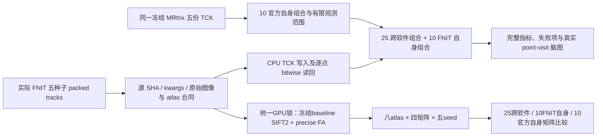
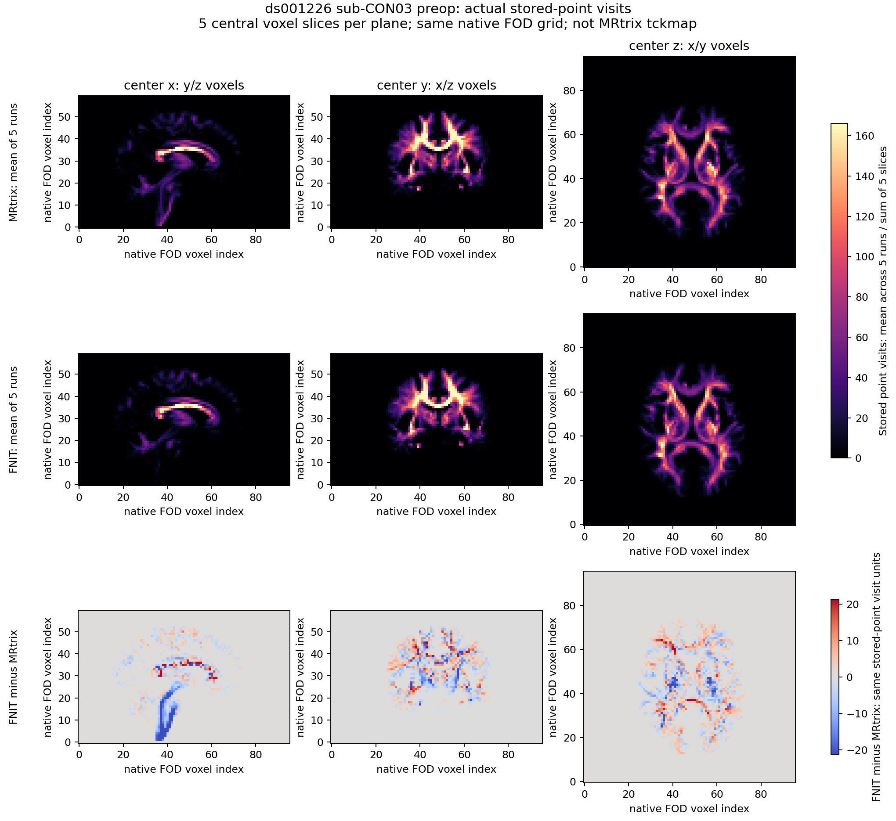
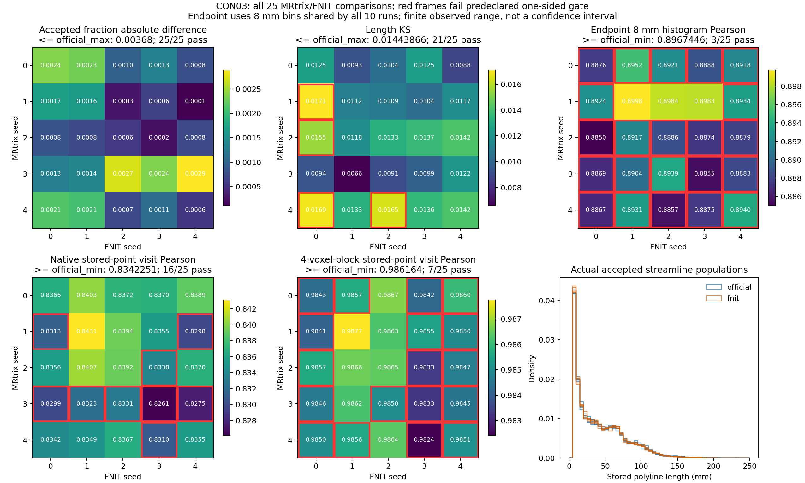
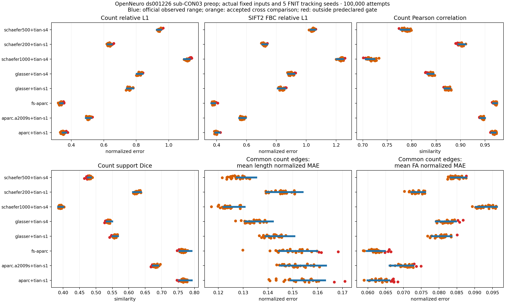

# CON03：五份 FNIT 与五份 MRtrix 的固定输入完整对照

## 1. 功能与流程

本报告读取已经完成的真实 FNIT `points/offsets`，逐点验证 TCK 的 float32 位和轨迹顺序，再比较两边各五个种子的实际人口分布。CPU人口分布分支未重新追踪或计算下游；随后五份既有轨迹使用冻结 baseline 的 GPU SIFT2、precise FA 和八套 atlas 矩阵构造，实际全完成。两条分支的时间与科学结论分开记录。这是固定输入算子定位，不是十例原始 BIDS 完整链。



每个软件种子为 0–4，每轮 100,000 次尝试。四矩阵仍是count、sum(w)、sum(w×length)/sum(w)、sum(w×preciseFA)/sum(w)，自连接保留。相同整数种子不表示相同 RNG。官方 TCK 五个 SHA 和原有 FOD 网格 SHA/affine/shape 与旧报告逐项相同。

## 2. Python、输入和输出

```python
from pathlib import Path
from tools.benchmark_connectome_tracking_population import compare

# 已经完成的真实 TCK；本函数只读取这些轨迹与公共 FOD 网格。
official_track_paths = [Path(f"official/seed-{seed}/tracks.tck") for seed in range(5)]
fnit_track_paths = [Path(f"cpu_existing_tracks/seed-{seed}/tracks.tck") for seed in range(5)]
population_report = compare(
    official_track_paths, fnit_track_paths, Path("actual_wm_fod.nii.gz"),
    dataset="OpenNeuro ds001226 sub-CON03 preop", n_seeds=100000,
    official_seeds=list(range(5)), fnit_seeds=list(range(5)),
)
```

输入是两边各五份真实 TCK 和冻结 FOD 网格 `[96,96,60]`，轴间距 2.5 mm；FNIT 原始 packed 产物为 float32 points/endpoints/lengths/世界坐标 accepted_seeds，以及 int64 offsets。CPU准备工具复用冻结后处理工具的全部真实 source/track 合同，保持原始坐标不变。

五种子后处理的160个真实CSV、TCK与标量保留于实际服务器结果目录。提交的 [冻结配置](post_configuration.json)、[实际控制器](post_controller.json)、[独立来源与输出审计](post_source_output_audit.json) 核对全部447个源/资源SHA、原始输入、160矩阵、节点/atlas、TCK、标量及显存。官方198命令仍全部exit0。

输出包括完整 [人口分布 JSON](population_envelope.json)、[CPU来源与逐点读回](preparation_report.json)、[分析来源](analysis_provenance.json)、[新旧端点分箱](endpoint_bin_provenance.json) 及图像 SHA。原始 FA 的非有限值保留；本人口分布工具不消费 FA 进行统计。

## 3. 命令行

```bash
# configuration 包含真实源和既有轨迹 SHA，post_worker 是冻结合同检查工具。
post_worker=/path/to/frozen/tools/reference/benchmark_connectome_fnit_repeats.py
configuration=/path/to/frozen/config.json
configuration_sha256=完整64位SHA256
actual_tracking_root=/path/to/actual/seed0_to_seed4
new_cpu_population_directory=/path/to/new_cpu_existing_tracks

CUDA_VISIBLE_DEVICES="" python tools/reference/prepare_connectome_existing_tracks_population.py \
    --post-worker "$post_worker" --config "$configuration" \
    --config-sha256 "$configuration_sha256" --tracking-root "$actual_tracking_root" \
    --seeds 0 1 2 3 4 --output-dir "$new_cpu_population_directory"
```

准备工具要求至少两个真实不同种子、新输出目录和空 `CUDA_VISIBLE_DEVICES`；参数仅定义合同与实际来源，不产生轨迹。其后调用 `benchmark_connectome_tracking_population.py --official <五份TCK> --fnit <五份TCK> --grid <原FOD网格> --n-seeds 100000 --official-seeds 0 1 2 3 4 --fnit-seeds 0 1 2 3 4 --output <JSON>`。所有重复组合都会保存；undefined 为 null，不能算通过。

绘图工具 `plot_connectome_population_repeats.py` 通过 `--report/--plot-data/--provenance/--output-dir` 读取已核对 SHA 的实际分析缓存，图像不参与门槛。

## 4. 官方步骤

MRtrix `3.0.3-103-g026e850d` 的固定输入参考已完成五轮。各轮 `tckgen -algorithm iFOD2 -act -seed_gmwmi -seeds 100000 -select 0 -maxlength 250 -cutoff 0.1 -power 0.5 -samples 3 -trials 1000 -max_attempts_per_seed 1000 -downsample 2 -nthreads 0`，还显式核对真实 PT 对应步长、最短长度和其余参数；完整命令见冻结参考 manifest。这里不再次执行官方命令，也不调用 `tckmap`。

## 5. 精度、耗时与图

**五份 FNIT 对五份官方的跨软件人口分布仍为 failed；FNIT 自身重复也为 failed。** 预先定义的单侧门槛不变：误差 ≤ 官方自身最大观测误差，相似性 ≥ 官方自身最小观测相似性。该有限五次范围是描述性观测，不是总体置信区间。

| 指标 | 官方10组合完整范围 | 跨软件25组合完整范围 | 跨软件通过 | FNIT自身通过 |
|---|---|---|---:|---:|
| 接受率绝对差 | 0.00023–0.00368 | 0.00011–0.00289 | 25/25 | 10/10 |
| 长度 KS | 0.00608261285–0.0144386606 | 0.00660774014–0.0171002479 | 21/25 | 10/10 |
| 端点 8 mm Pearson | 0.896744551–0.906350315 | 0.885014184–0.899753093 | 3/25 | 8/10 |
| 原生 point-visit Pearson | 0.834225143–0.843813833 | 0.826115176–0.843125652 | 16/25 | 9/10 |
| 4×4×4 voxel point-visit Pearson | 0.986164038–0.988612233 | 0.982415717–0.987747211 | 7/25 | 10/10 |

跨软件共 72/125 通过、53 未通过；FNIT 自身共 47/50 通过、3 未通过。FNIT 接受条数依次为 11606/11613/11747/11710/11764，官方为 11843/11775/11689/11475/11820。point-visit 统计是将 TCK 保存点按同一 world-to-voxel 转换并 `np.rint` 的访问次数，不等同于 MRtrix `tckmap`；4 voxel block 实际是 10 mm 的轴向块。



每个软件五份保存点访问图求均值，三个中心平面各叠加五个 native FOD voxel 切片，颜色条为原始访问次数。图像仅展示实际分布。



图中端点指标使用全部10份轨迹共同的 8 mm bins。原有分箱公式为 `np.arange(all endpoints min - 8, all endpoints max + 16, 8)`；加入四份实际 FNIT 后输入集合扩大，bin origin 相应改变。官方 endpoint 完整范围因此从 [0.8973529543741195, 0.9067033847211841] 变为 [0.8967445505525505, 0.9063503154117335]，不是更改公式或事后调整容差；新旧全部 edges 保留，旧六份轨迹报告未覆盖。native/coarse TDI 的冻结网格和官方 TCK 身份不变。

CPU来源检查、五份 TCK 写入和逐位读回总计 28.7338 s，未初始化 CUDA；这是诊断准备耗时。原始人口分布分析初次 wall time 未单独记录，不把 SSH 等待时间当计算性能。该报告不提供新的完整 pipeline 耗时。

### 八套 atlas 的实际矩阵结果

[完整JSON：全部pair、完整范围、源身份与自连接指标](matrix_envelope.json)；[简洁范围记录](matrix_envelope_compact.json)。每套atlas6个预先定义字段，各25个cross与10个自身组合。全部矩阵有限，门槛仍未全通过。

| Atlas | CON03节点数 | 跨软件通过 | FNIT自身通过 | 整体 |
|---|---:|---:|---:|---|
| aparc+tian-s1 | 84 | 132/150 | 53/60 | failed |
| aparc.a2009s+tian-s1 | 164 | 135/150 | 54/60 | failed |
| fs-aparc | 84 | 129/150 | 48/60 | failed |
| glasser+tian-s1 | 376 | 142/150 | 54/60 | failed |
| glasser+tian-s4 | 414 | 135/150 | 49/60 | failed |
| schaefer1000+tian-s4 | 1054 | 139/150 | 50/60 | failed |
| schaefer200+tian-s1 | 216 | 143/150 | 57/60 | failed |
| schaefer500+tian-s4 | 554 | 136/150 | 47/60 | failed |

跨软件共 **1091/1200** 通过、109未通过；FNIT自身共 **412/480** 通过、68未通过。Node语义严格由真实nodes.tsv定义；这里的K仅是固定CON03，不作为其它病例的常量。独立原始十例比较逐例核对node语义，不直接按相同行号跨病例拼接。



蓝线为官方10对组合完整范围；橙/红点为25个cross组合，红点未通过单侧门槛。各矩阵的对角线单独记录。

### 后处理速度、显存与旧seed0核对

| 项目 | 实际五轮范围 |
|---|---:|
| GPU SIFT2 | 13.0819–14.2140 s |
| GPU precise FA | 0.0895–0.1637 s |
| CPU source/input预检 | 7.1344–8.5714 s |
| CPU矩阵/TCK/标量写出 | 3.2038–3.4091 s |
| 单worker总计（含实际微小锁等待） | 26.1858–28.1582 s |
| 最大CUDA allocated | 2,162,190,848 bytes |
| 最大CUDA reserved | 2,535,456,768 bytes |
| 最大本进程树显存采样 | 4,435,476,480 bytes |

三种实际峰值均通过 `<20,000,000,000 bytes`，采样失败0；SMI采样间隔0.25s，实际最大间隔0.498s，是采样观测。以上是已有tracks的冻结后处理耗时，不包含追踪或完整raw pipeline。实际GPU步长hex固定`0x1.4000004b88950p+0`，由原Float64 affine在GPU上按生产表达式计算，未使用CPU四舍五入值。

[现场设备身份](device_identity_preflight.json) 核对了actual logical cuda:0的_CUuuid 16uint8 bytes，以及同PID NVIDIA物理UUID，严格等于固定设备；未仅信环境变量。旧失败发生在SIFT2前，未覆盖其报告。新工具仅修表示归一化，生产科学函数不改。

旧seed0与新后处理的8套count逐值相同。四矩阵按冻结输出dtype（count=int64，最终其它矩阵=float32）读回后32项bits全相同；新结果按原CLI `%d/%.9g`重放，32份CSV与旧CSV逐字节相同。按float64比较原9有效位CSV和本工具18位CSV会显示小文本舍入差，报告保留该差。原标量NPZ的length/endpoint/meanFA逐值相同；Float64 SIFT2权重有4565元素末位差，最大1.33226762955e−15，只报告实际差，不据此指定未经证明的原因。种子0对官方的原主矩阵233/240判定保持相同；五种子新增的越界项完整保存，不替换旧报告。

独立CPU source/output/格式重放审计25.0696s，不初始化CUDA。实际TCK逐点bitwise相同，且新GPU后处理TCK文件SHA与独立CPU人口分布输入完全相同，人口分布使用的就是同五份真实轨迹。

## 6. 版本记录

- 2026-10-03：五种子冻结GPU后处理全完成；160CSV/标量/TCK及源SHA审计通过，矩阵1091/1200与412/480通过，整体failed；本次隔离工具回归32passed/1skipped，3.37s。
- 2026-10-03：实际五种子人口分布 25cross/10self/10official 全部记录；72/125、47/50 通过，完整失败如上。
- 2026-10-03：GPU 后处理工具的 UUID 表示差异在 SIFT2 前触发失败；旧失败命名空间保留。类型归一化经现场 CUDA UUID 与同PID NVIDIA物理 UUID 严格核对，随后在新命名空间运行；科学后处理函数不改，矩阵结果单独给出。
- 旧单份 FNIT 对五份官方：[原报告](../task_04_repeat_reference/README.md)，保留独立命名空间和原始分箱。

## 7. 原软件与文献

[MRtrix3](https://github.com/MRtrix3/mrtrix3)；[UKB-connectomics](https://github.com/sina-mansour/UKB-connectomics)；[ds001226固定snapshot](https://github.com/OpenNeuroDatasets/ds001226/tree/fb4d0fda44f2ab7a732fb4ab6cd62add09dc1cd7)。Tournier et al., NeuroImage 202:116137 (2019)；Smith et al., NeuroImage 62:1924–1938 (2012)。
