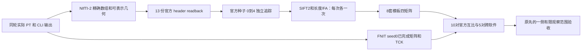
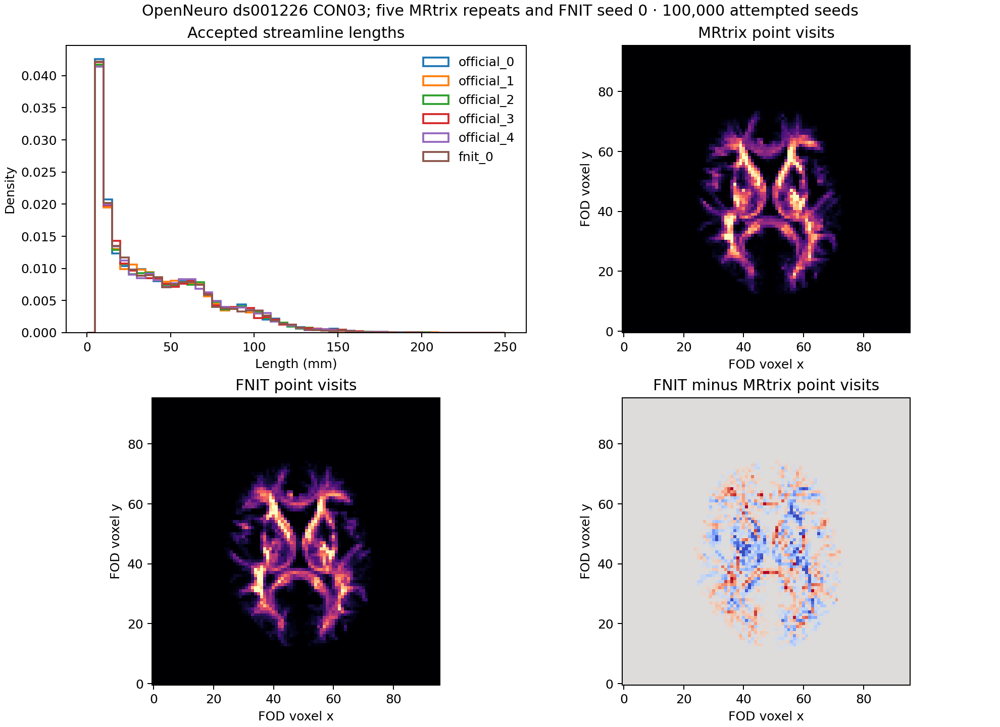
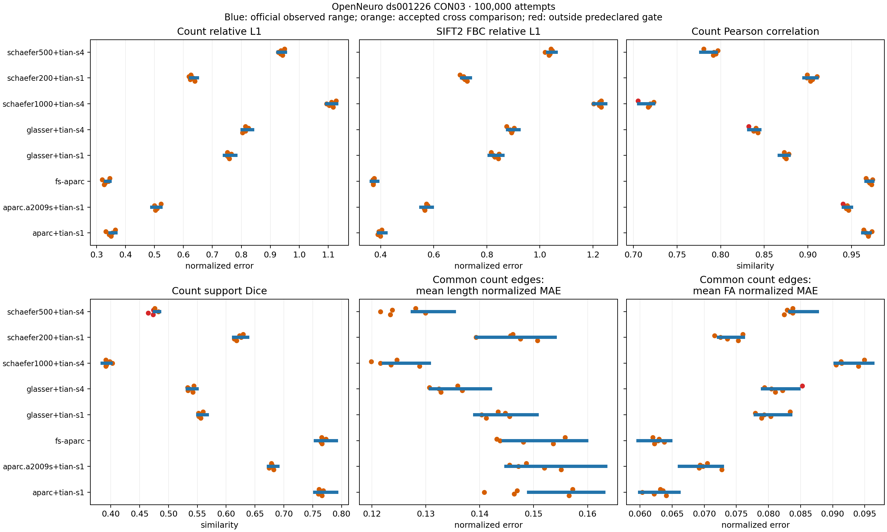

# CON03：五次 MRtrix 官方重复与 FNIT seed 0

## 1. 目的和结论

新下载的公开 OpenNeuro ds001226 CON03（ses-preop）用于本次实际组件对照；数据仓库冻结在 `fb4d0fda44f2ab7a732fb4ab6cd62add09dc1cd7`。从本轮 FNIT 真正完成的 FOD、5TT、GMWMI、FA 和八套 atlas 输入开始，官方种子 0..4 各尝试 100000 个种子，与已有 FNIT 种子 0 比较。此处不重新处理 raw DWI/T1w。

**执行和输入合同通过，随机追踪总体尚未匹配。** 官方 198 条命令全部 exit0，13 份输入体素位和 NIfTI-2 可表示的 sform 3×4 位通过。轨迹人口分布有 15/25 个跨比较越界；八模板六指标有 7/240 个跨比较越界，四套模板整体通过、四套失败。FNIT 只有一个完整重复，内部重复性为 `not_assessed`。没有放宽门槛。



## 2. 输入、输出和 Python

输入 `tracking_inputs.pt` 保存实际 Tensor 和完整 tracking kwargs；`checkpoints` 包含同轮 geometry、FA、tracks.tck 和标量向量；`connectome/atlases/<名称>` 包含标签、nodes.tsv 和已有四矩阵。官方直接读取保留 Float64 sform 的 NIfTI-2。count 是轨迹数，FBC 是 Σw，平均长度/FA 是 Σ(w×scalar)/Σw；不修改矩阵，不去掉自连接。主要比较只取严格上三角，长度/FA 数值误差使用共有 count 边，对角误差另列。

本目录输出：

- [contract_audit.json](contract_audit.json)：实际命令、程序/输入/输出摘要复核；含源、文件、FNIT有效和官方读入几何。
- [population_envelope.json](population_envelope.json)：接受率、长度KS、端点8 mm直方图、point-visit密度全部15对和单侧验收。
- [matrix_envelope_compact.json](matrix_envelope_compact.json)：八套模板全部10对官方、5对跨软件、四矩阵来源摘要、逐项门槛与判断；仅省去已验证相等的重复节点文字。完整源报告路径和SHA保留。
- [seed0_detailed_matrix_comparison.json](seed0_detailed_matrix_comparison.json)：官方seed0与FNITseed0的MAE/RMSE/Pearson/Spearman、支持集及对角线完整描述。
- [fs_aparc_secondary_envelope.json](fs_aparc_secondary_envelope.json)：旧单atlas工具四矩阵16指标全部80个跨比较，全部通过；该工具的全上三角长度/FA L1是包含支持集差异的额外指标，不替代八模板主要定义。
- 两张PNG来自已有真实 TCK/矩阵。无影像、轨迹、权重或模板原文件随报告发布。

```python
from pathlib import Path
from tools.benchmark_connectome_tracking_population import compare

benchmark_root = Path("/cwStorage/home/gongwk/Notebook_code/fnit_connectome_tenraw_20261002")
official_repeat_root = benchmark_root / "official_repeats_CON03_v2"
fnit_checkpoint_directory = benchmark_root / "root_diagnostic_CON03_v2/checkpoints"
population_report = compare(
    [official_repeat_root / f"seed-{seed}/tracks.tck" for seed in range(5)],
    [fnit_checkpoint_directory / "tracks.tck"],
    grid=official_repeat_root / "inputs/wm_fod.nii.gz",  # 完整公共网格
    dataset="OpenNeuro ds001226 CON03", n_seeds=100000,
    official_seeds=[0, 1, 2, 3, 4], fnit_seeds=[0],
    return_data=False,  # True 同时返回已有轨迹数组供绘图
 )
```

参数和输入格式详见 [工具说明](../../../../tools/benchmark_connectome_repeat_envelope.md)。接受率分母是 attempted seeds，不使用 TCK 的 total_count；同整数种子不是同随机流。

## 3. CPU 只读复现命令

```bash
fnit_repository_dir=/path/to/Fudan-Neuroimaging-toolkit  # 本版已更新工具的检出目录
benchmark_root=/cwStorage/home/gongwk/Notebook_code/fnit_connectome_tenraw_20261002
benchmark_python=/cwStorage/home/gongwk/Notebook_code/fnit_conda_env_956b1a9/bin/python
official_repeat_directory="$benchmark_root/official_repeats_CON03_v2"
fnit_checkpoint_directory="$benchmark_root/root_diagnostic_CON03_v2/checkpoints"
fnit_connectome_directory="$benchmark_root/root_diagnostic_CON03_v2/connectome"
analysis_output_directory=/path/to/new_cpu_analysis  # 与正式输出分开
mkdir -p "$analysis_output_directory"
export CUDA_VISIBLE_DEVICES=""

"$benchmark_python" "$fnit_repository_dir/tools/reference/audit_connectome_repeats.py" \
  --manifest "$official_repeat_directory/reference_manifest.json" \
  --checkpoint-dir "$fnit_checkpoint_directory" --fnit-dir "$fnit_connectome_directory" \
  --reference-script "$benchmark_root/official_repeats_CON03_v2_tools/tools/reference/benchmark_connectome_repeats_official.py" \
  --output "$analysis_output_directory/contract_audit.json"

"$benchmark_python" "$fnit_repository_dir/tools/benchmark_connectome_seven_atlas_envelope.py" \
  --official "$official_repeat_directory/seed-0" "$official_repeat_directory/seed-1" \
             "$official_repeat_directory/seed-2" "$official_repeat_directory/seed-3" "$official_repeat_directory/seed-4" \
  --fnit "$fnit_connectome_directory" --dataset "OpenNeuro ds001226 CON03" \
  --n-seeds 100000 --official-seeds 0 1 2 3 4 --fnit-seeds 0 \
  --output "$analysis_output_directory/matrix_envelope.json"

"$benchmark_python" "$fnit_repository_dir/tools/benchmark_connectome_tracking_population.py" \
  --official "$official_repeat_directory/seed-0/tracks.tck" "$official_repeat_directory/seed-1/tracks.tck" \
             "$official_repeat_directory/seed-2/tracks.tck" "$official_repeat_directory/seed-3/tracks.tck" "$official_repeat_directory/seed-4/tracks.tck" \
  --fnit "$fnit_checkpoint_directory/tracks.tck" --grid "$official_repeat_directory/inputs/wm_fod.nii.gz" \
  --dataset "OpenNeuro ds001226 CON03" --n-seeds 100000 \
  --official-seeds 0 1 2 3 4 --fnit-seeds 0 --output "$analysis_output_directory/population_envelope.json"
```

以上均读取已经完成的输出，不重新运行任何官方程序、GPU追踪、矩阵构造或预处理。绘图可加 `--figure`，专用Conda环境当前缺matplotlib；本次已用现有base Python读取保存的真实分析数组绘图，未修改正式环境。

## 4. 对应官方步骤

实际官方为 nodecw10 MRtrix `3.0.3-103-g026e850d`，七个程序SHA绑定在合同报告。实际步长 `1.2500000175865187 mm`、最小长度 `5.000000070346075 mm`、最大250 mm、angle45、cutoff0.1、power0.5、samples3、trials1000、max_attempts1000、downsample2。每次 `-seeds 100000 -select 0 -nthreads 0`；下游8线程，不添加backtrack/crop/mask/zero_diagonal。原命令argv在服务器manifest中完整保留，通用命令及公式见[工具说明](../../../../tools/benchmark_connectome_repeat_envelope.md#4-对应官方命令和几何)。

5TT ACT官方读入与源原始affine的角点差为 `8.09116e-6 mm`，与FNIT实际header-spacing算子差 `3.80257e-13 mm`；这是已有reader规范化语义。FOD官方读入与源角点差 `3.57538e-13 mm`。源齐次末行机器残差与NIfTI隐含末行分别记录，不声称完整4×4文件逐bit保存，也不新增事后科学容差。

## 5. 实测精度、耗时和脑图

### 轨迹人口分布

FNIT接受 **11606/100000（11.606%）**；官方接受 **11843、11775、11689、11475、11820**，范围11.475–11.843%。下表使用10个官方互比的原范围；误差≤官方最大值、相似性≥官方最小值。

| 指标 | 官方互比范围 | FNIT–官方范围 | 通过/5 |
|---|---:|---:|---:|
| 接受率绝对差 | 0.00023000–0.00368000 | 0.00083000–0.00237000 | 5 |
| 长度KS | 0.00608261–0.01443866 | 0.00942134–0.01710025 | 2 |
| 端点8 mm Pearson | 0.89735295–0.90670338 | 0.88721190–0.89389141 | 0 |
| 原网格点访问Pearson | 0.83422514–0.84381383 | 0.82991959–0.83661871 | 3 |
| 4体素块点访问Pearson | 0.98616404–0.98861223 | 0.98408233–0.98566142 | 0 |

**密度定义保留旧工具：保存的轨迹点舍入至公共网格并逐点计数；不是 tckmap 流线/线段密度。** 4体素块在本例约10 mm，端点 bins仍为8 mm；统计使用整个网格，脑图只显示中间5层之和，并将显示色阶裁到99.5百分位。没有用显示裁剪改变统计。



### 八套模板矩阵

所有模板 count/FBC 相对L1和共有count边的平均长度误差通过。越界项如下，准确值及每一pair见机器报告；小于官方最小误差、或高于官方最大相似性仍可通过。

| 模板 | 节点 | 整体 | 越界项 |
|---|---:|---|---|
| aparc+tian-s1 | 84 | passed | 无 |
| aparc.a2009s+tian-s1 | 164 | failed | count_pearson（官方seed4） |
| fs-aparc | 84 | passed | 无 |
| glasser+tian-s1 | 376 | passed | 无 |
| glasser+tian-s4 | 414 | failed | count_pearson（官方seed4）；mean_fa_common_normalized_mae（官方seed4） |
| schaefer1000+tian-s4 | 1054 | failed | count_pearson（官方seed4） |
| schaefer200+tian-s1 | 216 | passed | 无 |
| schaefer500+tian-s4 | 554 | failed | count_support_dice（官方seed0,1,3） |

Glasser+Tian S4 的共有边FA归一MAE在官方seed4比较为 **0.0852723330**，官方互比最大 **0.0847426863**。A2009s、Glasser S4、Schaefer1000 S4的count相关性各有seed4比较越界；Schaefer500 S4的support Dice有seed0/1/3比较越界。完整对角误差另报，没有删除自连接。



### 官方组件耗时

单次官方 tracking 禁多线程，下游8线程。以下为每条命令的含子进程启动wall time；矩阵一列是该轮八atlas的32次矩阵命令合计。

| 官方seed | iFOD2/ACT秒 | SIFT2秒 | 长度秒 | FA秒 | 八atlas矩阵合计秒 |
|---:|---:|---:|---:|---:|---:|
| 0 | 63.309 | 10.651 | 0.048 | 0.044 | 3.716 |
| 1 | 63.085 | 10.504 | 0.027 | 0.046 | 3.788 |
| 2 | 62.830 | 10.482 | 0.028 | 0.045 | 3.691 |
| 3 | 62.613 | 10.471 | 0.027 | 0.044 | 3.703 |
| 4 | 63.676 | 10.453 | 0.028 | 0.046 | 3.715 |

五轮官方参考 execution 总wall time **407.327秒**，包含输入导出、readback、五轮组件和输出检查；Python导入不在计时内；主入口总wall time 408.518秒，其中preflight 1.191秒。这里只是固定FOD之后的参考组件耗时，不包含raw预处理、recon-all、配准或FNIT完整pipeline，不据此声称十例端到端加速。FNIT逐阶段与整例耗时/显存验收由十例总报告独立完成。

CPU分析使用gpucw1专用环境、CUDA不可见：population完整TCK读取和全部pair计算2.592秒；合同审计时间另记录。工具回归与原矩阵工具 **29 passed、1 skipped，3.96秒**，跳过专用环境中可选matplotlib绘图。小数组仅检验工具契约，不替代上述真实科学比较。

## 6. 更新与剩余工作

- 2026-10-02：官方≥3次、计划5次；CSV直接读入、多模板、节点来源及单侧验收。
- 2026-10-03：实际NIfTI-2读入和齐次末行序列化合同修正，失败官方v1目录原样保留；v1未执行参考命令。
- 2026-10-03：发布实际v2五轮，所有真实越界保留；population去掉三次/ds004666/8 mm粗网格硬编码，旧统计公式不变；新增CPU只读合同审计。

下一步应增加独立FNIT重复并处理已发现的轨迹分布偏差，再用预先保留的holdout和其余新原始受试者验证；不能将单个CON03或合同通过写成十例完整流程已匹配。速度优化的“无损”门槛仍是候选与冻结FNIT同Tensor输出一致，官方随机一致性是另一项验收，二者不能互相代替。

## 7. 参考

- [OpenNeuro ds001226](https://github.com/OpenNeuroDatasets/ds001226)。本轮使用新下载的公开原始输入，未发布原始影像或外置模板。
- [MRtrix3](https://github.com/MRtrix3/mrtrix3)、[tckgen](https://mrtrix.readthedocs.io/en/latest/reference/commands/tckgen.html)、[tcksift2](https://mrtrix.readthedocs.io/en/latest/reference/commands/tcksift2.html)、[tck2connectome](https://mrtrix.readthedocs.io/en/latest/reference/commands/tck2connectome.html)。实际参数以记录版本/程序SHA/argv为准。
- Tournier et al. MRtrix3. NeuroImage 2019. [DOI](https://doi.org/10.1016/j.neuroimage.2019.116137)；Smith et al. ACT. NeuroImage 2012. [DOI](https://doi.org/10.1016/j.neuroimage.2012.06.005)；Smith et al. SIFT2. NeuroImage 2015. [DOI](https://doi.org/10.1016/j.neuroimage.2015.06.092)。
