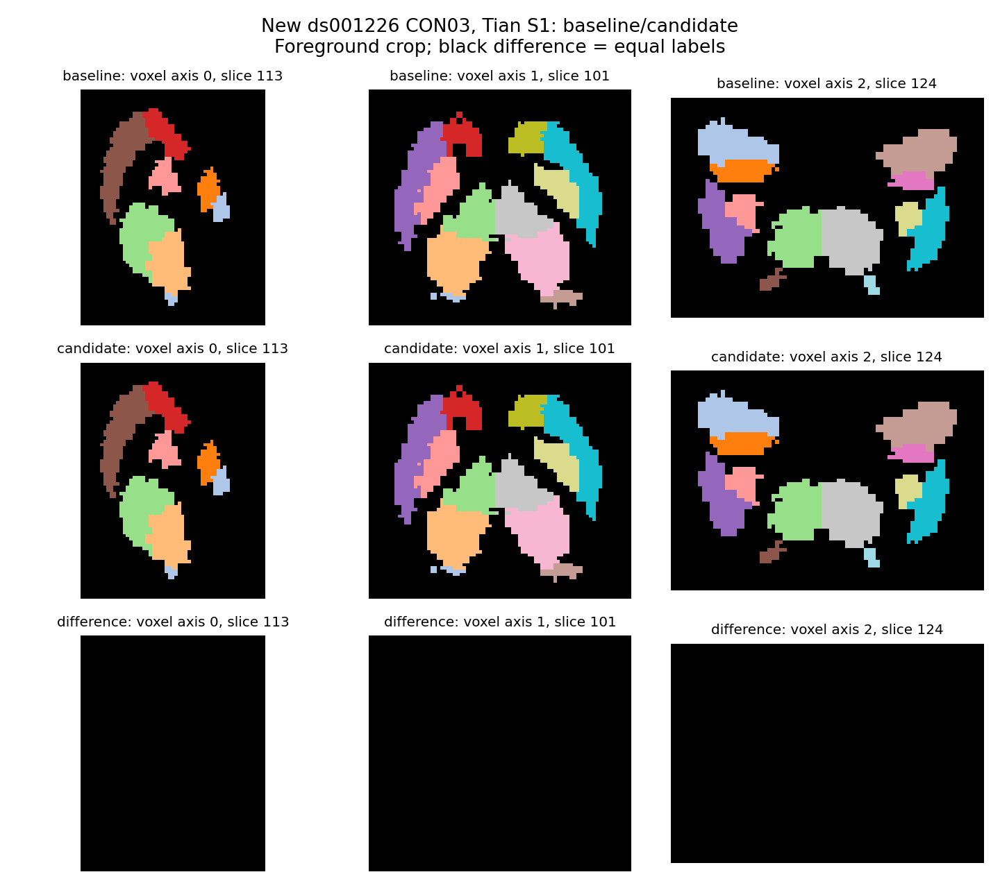
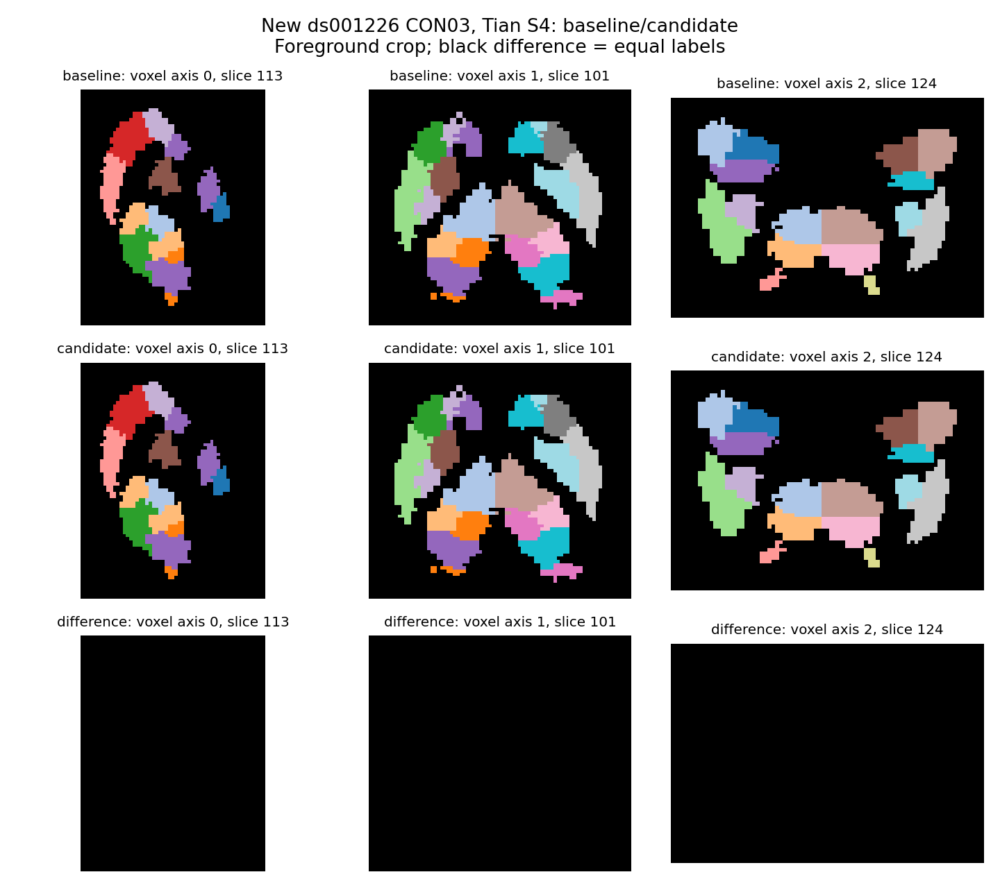

# 新公开数据的图谱组件对照

## 1. 功能与结论

本目录保存新下载 ds001226 CON01/CON03 的真实组件评测。生产实现保留既有皮层、Tian S1/S4 与 SynthMorph 变换复用；**本轮不接入额外端点缓存、CUDA 最近邻或 SynthMorph 未消费输出候选**。资源下载地址修复单独采用，数值文件的大小和 SHA-256 不变。

## 2. Python 输入与输出

生产接口见 [pipeline 说明](../../../../docs/connectome/README.md)。输入为官方 recon-all `brain.mgz`、核验后的 MNI/Tian 模板和 SynthMorph 权重；最近邻输出为 T1 网格 int16 标签及 MNI→T1 变换。固定轨迹对照读取真实 TCK、同顺序 weights/lengths/mean_fa 与八张 DWI 网格图谱，输出报告和四类矩阵比较。

```python
from fnit.connectome.atlas_tian import synthmorph_tian_to_t1

# 两个层级共享一次实际配准；每次仍对各自完整标签图最近邻采样。
tian_s1_t1, mni_to_t1 = synthmorph_tian_to_t1(
    t1_brain=freesurfer_brain_path, mni_template=mni_brain_path,
    tian_mni=tian_s1_path, weights=synthmorph_weights_directory, device="cuda:0",
)
tian_s4_t1, _ = synthmorph_tian_to_t1(
    t1_brain=freesurfer_brain_path, mni_template=mni_brain_path,
    tian_mni=tian_s4_path, weights=synthmorph_weights_directory, device="cuda:0",
    transform=mni_to_t1,
)
```

## 3. 命令行与评测复现

```bash
# 生产入口：完整参数、输入格式和各矩阵结构见 pipeline 说明。
fnit UKBConnectome_pipeline --bids-root "$RAW_BIDS_DIRECTORY" \
  --subject "$SUBJECT_LABEL" --freesurfer-subject-dir "$FREESURFER_SUBJECT_DIRECTORY" \
  --atlas aparc+tian-s1 glasser+tian-s4 --n-seeds 100000 \
  --atlas-templates-dir "$VERIFIED_ATLAS_DIRECTORY" \
  --fsaverage-dir "$FSAVERAGE_DIRECTORY" --mni-template "$MNI_BRAIN_FILE" \
  --synthmorph-weights "$SYNTHMORPH_WEIGHTS_DIRECTORY" \
  --device cuda:0 --output-dir "$NEW_OUTPUT_DIRECTORY"
```

独立 SynthMorph 对照用 `tools/benchmark_connectome_synthmorph_outputs.py`：
`--t1` 为实际 recon brain，`--mni` 为 brain MNI，`--atlas-dir` 含 S1/S4，`--weights` 为已核验权重，`--device` 为单 GPU，`--output-dir` 必须新建。运行整个父进程时取得共享 GPU 锁；两臂使用同一 allocator、TF32、extent=256、hyper=0.5、steps=7。每臂重新加载模型，输入/输出哈希和文件写入不计入计算墙钟。

端点候选只作复现存档：在冻结 `f436de588647a0de80735e4a98d53df5d88e502d` 的独立研究 checkout 应用 `unadopted_cache_candidate.patch`，将 `benchmark_source/benchmark_connectome_assignment_cache.py` 放到该 checkout 的 `tools/` 后运行。主版本未提供该候选 API。脚本的 `--tracks/--track-metrics/--atlas-manifest` 指同一真实轨迹及图谱；`--baseline-assignment` 指冻结基线模块，`--output` 指报告，`--device` 指设备，`--batch-size` 默认1024。该计时包含图谱解码、H2D、计算和D2H，不能拆出搜索几何自身收益。

## 4. 官方对应步骤

```bash
mri_synthmorph register -m joint -t mni_to_t1.mgz MNI_brain.nii.gz brain.mgz
mri_synthmorph apply -m nearest -t int16 mni_to_t1.mgz Tian_S1.nii.gz Tian_S1_T1.nii.gz
tck2connectome tracks.tck atlas_DWI.nii.gz count.csv \
  -symmetric -assignment_radial_search 4
```

这些命令是独立参考；生产对应函数为 `SynthMorph`、`apply_transform` 与 `build_connectomes`。本页比较生产基线和候选；主任务的官方重复范围另行评估。

## 5. 实际精度、时间与脑图

|候选/真实输入|实际输出一致性|耗时观察|采用|
|---|---|---|---|
|CON01 固定变换 CPU→CUDA 最近邻|S1/S4 各9,437,184标签 neq=0|CPU约0.45–0.54 s；CUDA约0.51–0.58 s|否|
|CON03 省去未消费 inverse/moved，第一轮ABBA|完整50,331,648 forward值、S1/S4及affine逐bit相同|加载加配准13.025/9.300/7.104/8.101 s；纯配准均值未改善|否|
|同一候选第二轮ABBA|九项完整bit比较均相同|9.063/8.546/8.514/8.854 s；GPU有其他计算进程|否|
|CON03 固定11606轨迹、八图谱端点复用|96矩阵比较零差异；真实TCK端点相同|总墙钟3.690/3.412/3.104/3.995 s；未隔离几何计算|否|

最近邻第一次组件的进程采样峰值21.544 GB，超预算；相同输入关闭CUDA分配缓存后11.002 GB，完整warp及标签逐bit一致。关闭缓存时Torch allocated/reserved统计无效，零值不代表实际显存。两轮SynthMorph对照进程采样峰值约11.03–11.29 GB；端点组件约2.015 GB。这些是组件采样最大值，**不代替整链峰值或连续上界**。正式整链使用共同固定allocator，由主任务独立记录allocated、reserved和进程采样。




脑图由真实完整标签图生成；含全部16/54正标签，非空前景44,364体素。CPU最终测试12项通过；CUDA组件测试17项通过。这些测试不代替真实评测。每臂时间、UUID、共享负载、输入/源码SHA和输出比较见对应JSON及 `final_handoff.json`。

## 6. 更新记录与资源来源

- 已有跨图谱复用保留；本轮额外候选按预定判定停止。
- 修复可变 `main` 下载地址：固定 `assets-v1` 未含所需Tian/Schaefer文件。Schaefer及Tian节点表改为固定原作者URL；两张已获再分发许可的Tian gzip影像使用冻结FNIT提交。十个URL实际下载并校验大小/SHA；Tian解压字节与原作者NIfTI一致。
- Glasser只使用既有上游模板；本轮不增加镜像。权重按固定Release清单校验完整文件和分片。
- `license_audit.json`、`upstream_source_verification.json` 保存许可与下载证明；未采用补丁只在本评测存档，不接入运行路径。

## 7. 参考文献与代码

[Tian atlas](https://github.com/yetianmed/subcortex/tree/dcad93421ea8021d6c5738df0a915a2223cd82aa)，Tian et al., *Nature Neuroscience* (2020), [doi:10.1038/s41593-020-00711-6](https://doi.org/10.1038/s41593-020-00711-6)；[Schaefer/CBIG](https://github.com/ThomasYeoLab/CBIG/tree/35b5664bec8822e2f77da5e090e96f91d0095be6)；[HCP pipelines](https://github.com/Washington-University/HCPpipelines)，Glasser et al., *Nature* (2016), [doi:10.1038/nature18933](https://doi.org/10.1038/nature18933)；[SynthMorph](https://surfer.nmr.mgh.harvard.edu/docs/synthmorph/)；[MRtrix3](https://github.com/MRtrix3/mrtrix3)；[原UKB-connectomics](https://github.com/sina-mansour/UKB-connectomics)。
