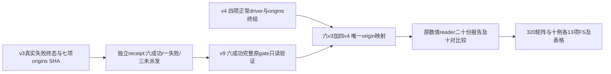

# v9：显式保留失败 driver 中六个真实成功病例

## 功能与流程

v3 selected driver 顺序完成六项后，candidate CON08 raw CLI 首次 CUDA tensor 转换 OOM、exit1；09–11 未派发。原 driver 真实终态为 `selected_recovery_failed_or_ineligible`，原 GPU/wall/eligibility 和失败历史不修改。v8 的真实最小复现拒绝其中已 completed 的 baseline CON05，见 `actual_v8_failed_driver_minrep.json`。

v9 增加独立不可变 `completed_case_subset_receipt`：只承认显式声明的六个完成病例，同时固定整个失败 driver、七项 origins、失败 CON08 完整记录和三项未派发记录。receipt 不重写 driver status，不拼接 completed controller，不接受 CON08 失败结果。四项 fresh v4 完成后走原 normal completed-driver 路线。



## 输入、输出、参数及 Python

新增源：`tools/reference/connectome_actual_gpu_origins_v9.py`（部署为新 v9 helper 目录内的 `connectome_actual_gpu_origins.py`）、`connectome_actual_gpu_completed_subset.py`。新 helper v9 由冻结 v8 reader 文件复制到全新 namespace，只有 origin reader 的两个元数据函数增加 receipt 检查；比较、FS、summary、export 四个数值 reader 文件 SHA 与 v8 相同。旧 v8 namespace 不变。

每个六成功病例的 origin declaration 保留原 fields，另加：

```json
{"completed_case_subset_receipt":{"path":"/absolute/new/receipt.json","sha256":"actual SHA"}}
```

receipt 的 `schema_version=1`、`scope=explicit_immutable_completed_case_subset_from_failed_selected_driver`；`producer` 为元数据 writer path/SHA；`driver_status` 为实际 v3 失败终态 path/SHA；`recovery_origins` 为真实七项 origins path/SHA。`selected_pairs` 保存原十项；`completed_case_keys` 精确六项；`failed_case_keys` 为 candidate08；`not_dispatched_case_keys` 为 candidate09–11；`case_ledger` 保存全部十项状态、完整 driver record 摘要 SHA，以及每项已尝试病例的 GPU/wall/eligibility/config/recovery_binding 文件 path/SHA；`failed_records` 保存失败08完整原记录。整个原 driver bytes 固定，包含所有原完整成功/失败记录；未派发病例明确原 record absent。`full_ten_complete=false`，`original_driver_rewritten=false`。

```python
import json
from pathlib import Path
import connectome_actual_gpu_completed_subset as subset

# 只从不可变真实 metadata 构造新receipt；不执行MRI。
completed_case_keys = ['baseline/sub-CON05', 'baseline/sub-CON11',
                      'candidate/sub-CON04', 'candidate/sub-CON05',
                      'candidate/sub-CON06', 'candidate/sub-CON07']
receipt = subset.build_receipt(
    subset.identity(Path('/absolute/actual-v3/status.json')),
    subset.identity(Path('/absolute/actual-v3/recovery_origins.json')),
    completed_case_keys,
    subset.identity(Path('/absolute/v9/connectome_actual_gpu_completed_subset.py')))
print(receipt['original_driver_status'])  # 仍是原真实失败状态。
```

## CLI 与最终路由

```bash
# 此实际receipt已创建，不能重复覆写；示例变量需使用新的输出位置。
CPU_PYTHON='/cwStorage/home/gongwk/anaconda3/bin/python3.11'
RECEIPT_WRITER='/cwStorage/home/gongwk/Notebook_code/fnit_connectome_tenraw_20261002/formal_actual_comparison_helper_v9/tools/reference/connectome_actual_gpu_completed_subset.py'
ACTUAL_FAILED_DRIVER='/cwStorage/home/gongwk/Notebook_code/fnit_connectome_tenraw_20261002/formal_selected_monitor_recovery_driver_v3/status.json'
ACTUAL_SEVEN_ORIGINS='/cwStorage/home/gongwk/Notebook_code/fnit_connectome_tenraw_20261002/formal_selected_monitor_recovery_driver_v3/recovery_origins.json'
NEW_RECEIPT='/absolute/new/receipt.json'
"$CPU_PYTHON" "$RECEIPT_WRITER" --driver-status "$ACTUAL_FAILED_DRIVER" --origins "$ACTUAL_SEVEN_ORIGINS" \
 --case-key baseline/sub-CON05 --case-key baseline/sub-CON11 \
 --case-key candidate/sub-CON04 --case-key candidate/sub-CON05 \
 --case-key candidate/sub-CON06 --case-key candidate/sub-CON07 --output "$NEW_RECEIPT"
```

`--driver-status` 为真实失败 driver JSON；`--origins` 为它最后绑定的七项 origins；`--case-key` 必须按原选择顺序明确列出恰好六项 completed eligible keys；`--output` 是全新绝对输出文件。任何未知/running driver、非科学失败、重复 key、失败病例或不一致原报告/来源都拒绝。正常 v4 driver 不使用这个 receipt。

最终 comparator 的 CLI 不变：`--gpu-origin-bindings` 指显式十项 combined JSON。`watch_connectome_actual_mixed_completion.py` 在全新 metadata namespace 读取两个真实 attempts：v3 六项 receipt 与正常 v4 四项。只有实际 v4 `completed_selected_subset`、四项 completed eligible、四个 origin driver SHA 均终态固定后才写十项声明。它合并 origins，而不合并或制造 driver/status/reports。旧 v3 failed08 不被选中；candidate08 仅来自真实成功 v4。之前 old waiter 保持其真实 failure，不能通过旧 v3 driver冒充十项完成。

新 mixed waiter 复用原基础工具的参数：`--configuration`、全新 `--report-dir`、可选 `--watch`、`--launch`、`--poll-seconds` 默认60（1–60）、`--timeout-hours` 默认72（0–168）。默认仅一次元数据观察，不 launch。完成后纯 CPU comparator 仍读取 baseline 原八例+v3 new05/11、candidate 原01/03+v3 new04–07+v4 new08–11，共十个唯一病例、320项矩阵、130项科学 FS array。metadata配置固定原 v1/v2失败状态和旧两对四报告链，采用原 v8支持的 v1 prior anatomy入口，无重复汇总旧两对。

## 原软件、真实验证与版本

元数据receipt无 FSL/FreeSurfer/MRtrix3 对应命令；本工具没有重跑MRI或GPU。root 单独负责原9404767工具的 fresh v4科学执行。root 的 OOM readiness probe、明确第二attempt声明和未知根因记录保留；本窗口不推测短暂OOM原因，不改源、精度、allocator或参数。

151项成熟及新增CPU protocol tests通过，新增13项覆盖无receipt失败driver仍reject、failed08/pending拒绝、未知/运行状态拒绝、篡改driver/报告/receipt拒绝、保留全failed/pending记录、原CLI/memory gates、v4失败立即退出、四项未终态保持pending，以及唯一路由六v3加四v4后继续原full gate。fixture不是MRI benchmark。

六项真实 readonly validation 已完成：每例原 source/raw/FS/output/module/runtime/CLI/UUID/memory/eligibility gates通过，各报告 path/SHA、源指纹和74项输出hash检查见 `actual_six_readonly_validation.json`。六例均保持原 driver 失败状态，实际 process peak19,795,017,728 bytes、monitor issues空；这只是现有完成结果的只读验证，不是新耗时或矩阵精度benchmark。CPU verification 15.3638秒不计入科学pipeline时间。

实际receipt SHA `07678861e9255ab526a8c9ddf44a3e7e959aaced16e10f2ed37858c83eea815d`；原v3driver SHA `dfb47c98dee06dd4062bb480dafce13f06e4d358e77460d03e636a6e85dfe7a8`，状态始终failed；six origins SHA `d057573106e90f6f25bb8edf261ff2d1d1c207a59056b93a8eefc0c8cda69ac9`。新 mixed waiter 真正单次观察为 `pending_actual_v4_completed_subset`，见 `actual_mixed_pending_observation_v1.json`。最终十例 fullread/summary/export 尚未执行，长时waiter未启动。

实际benchmark source指纹保留 baseline `deefeb6908...`、candidate `9fd44cbc...`；不使用root新main全src指纹替代原冻结科学source。所有文件SHA见delivery；元数据函数差异audit见 `reader_metadata_only_change_audit.json`。

## 参考

[Fudan Neuroimaging Toolkit](https://github.com/weikanggong1/Fudan-Neuroimaging-toolkit) 原冻结 reference tools。新 metadata 只用Python标准库，原 NumPy/nibabel/matplotlib Conda环境复用，不增科学依赖。精度矩阵、脑图和端到端/分步科学耗时待root最终真实对照；不以fixture或CPU元数据验证代替。

## 条件 comparison / summary / export launch

新增 `run_connectome_actual_mixed_final_cpu.py` 仅运行已固定的 mixed metadata waiter；十例比较及表格完成并通过320唯一矩阵/130唯一FS记录门槛后，调用原冻结 `export_connectome_actual_cohort.py`，代表病例CON01/09、atlas fs-aparc。原 export 自身继续执行完整 source/output/summary guards。pending、v4失败或 reader错误均不导出。

Root 在 headcw 的持久 launch 已准备于：

```bash
CPU_PYTHON='/cwStorage/home/gongwk/anaconda3/bin/python3.11'
ROOT_CPU_LAUNCHER='/cwStorage/home/gongwk/Notebook_code/fnit_connectome_tenraw_20261002/formal_actual_mixed_final_CPU_tools_v1/launch_actual_mixed_final_cpu_v1.py'
"$CPU_PYTHON" "$ROOT_CPU_LAUNCHER"
```

此命令本窗口未运行。launcher 固定 chain/common/mixed/config SHA，检查新输出namespace不存在，使用新进程组写PID/start_ticks/完整argv/来源receipt；它不提交科学worker。chain CLI参数 `--configuration` 是实际mixed配置，`--mixed-tool` 为该配置SHA清单中的元数据entrypoint，`--mixed-report-dir` 为全新waiter目录，`--report-dir` 为全新CPU chain目录，`--export-report-dir` 为全新export目录；`--representative-cases` 默认CON01/09，`--figure-atlas` 默认fs-aparc。基础 wait interval60秒、timeout72小时；元数据停止/timeout结果明确pending。

固定输出：`root_actual_mixed_final_CPU_chain_v1/status.json` 为最终chain状态；`root_actual_mixed_waiter_driver_v1/status.json` 为真实混合元数据/compare/summary状态；`root_actual_cohort_comparison_v3`、`root_actual_cohort_summary_v3`、`root_actual_cohort_export_v3` 为各阶段独立输出。仅十个唯一病例真实完成且导出成功时chain返回 `completed_actual_ten_unique_comparison_summary_export`。原v3失败driver、失败08和三未派发记录仍以receipt身份保留至最终chain报告。

3项附加CPU export门槛测试通过：pending/failed不导出、空coverage即使flagcomplete仍拒绝、320/130重复记录拒绝。现场freeze验证全部v9 helper和原bindings SHA相同，五个最终namespace均不存在，长时waiter未启动，见 `actual_final_CPU_chain_freeze_verified.json`。数值/summary/export四reader及生产source全程未改。
