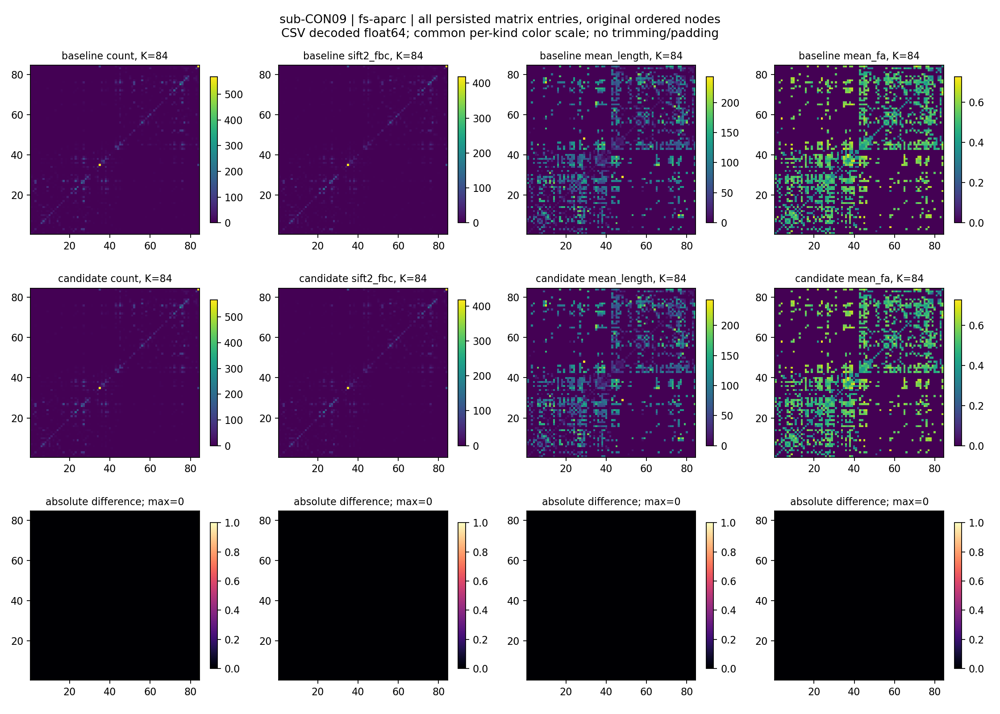

# 十例真实比较的最终独立元数据审计

## 1. 功能

核验对象为 root 已完成的原 CPU 比较、汇总与导出链。本审计只读取冻结报告并校验 SHA-256，没有启动 MRI/GPU、没有重新比较数组，也没有复制原始影像或大份监测采样。

## 2. 输入与输出、冻结来源

以下服务器路径前缀均为 `/cwStorage/home/gongwk/Notebook_code/fnit_connectome_tenraw_20261002/`。

| 对象 | 路径或指纹 | SHA-256 |
|---|---|---|
| 原任务链 | `root_actual_mixed_final_CPU_chain_v1/status.json` | `740bf093bb919fcc04c27baefe1a78ffdfd2144c406ba64ae7ad4c07771e22eb` |
| 比较终态 | `root_actual_cohort_comparison_v3/status.json` | `69ef94e02736c566d8ef5548a0ede0f6da7dc2b3c06f3a004ff5cd2ee7da1bc5` |
| 汇总 | `root_actual_cohort_summary_v3/summary.json` | `363cb561161b410aca4b88331c55848f19f6b52fe24f1340a13aedd801c579dc` |
| 导出终态 | `root_actual_cohort_export_v3/status.json` | `0de62451da94fafe628c210e0a28f30bdd27bc3c24bcf5f012cb9e0c582b2b56` |
| 实际混合来源 | `formal_actual_mixed_GPU_origins_v1/origins.json` | `19480060751cb3bab7b54e52a2d036dfd6d544c7628d0cffbb660fadfbca43e8` |
| 保留失败 v3 | `formal_selected_monitor_recovery_driver_v3/status.json` | `dfb47c98dee06dd4062bb480dafce13f06e4d358e77460d03e636a6e85dfe7a8` |
| 六例完成收据 | `formal_actual_completed_subset_receipt_v1/receipt.json` | `07678861e9255ab526a8c9ddf44a3e7e959aaced16e10f2ed37858c83eea815d` |
| baseline 科学源码 | 实际执行文件集合指纹 | `deefeb6908c3c14a9aa7b4cf154c8df941a56abffd4a4e893045a1c4d1ddfd4a` |
| candidate 科学源码 | 实际执行文件集合指纹 | `9fd44cbc49c9cdfc16c9a8cff2971fec3239b450dce41222e6ef059861eb0dc7` |

### 导出图核验

五张 PNG 的 SHA、尺寸、位深、颜色类型及所有 PNG chunk CRC 均已核对；本地复制字节与服务器一致。完整路径/哈希及 20 次实际来源、时间、内存记录见 `actual_final_compact_audit.json`。

| 图 | 尺寸 | SHA-256 |
|---|---|---|
| actual_order_timing_memory.png | 2240 × 1760 | `e1cdcc0a284df688c568c1eb93c9b3272826e2216580e7a32c74fd184beedc77` |
| sub-CON01.fs-aparc.brain.png | 2080 × 1120 | `11f1fe142669a6cc8df653a85efe60972c361069af07db6d290c2cde3eb6fddb` |
| sub-CON01.fs-aparc.matrices.png | 2240 × 1600 | `a001275daeaa1f61ddea14e6849a93787070e8125f3226b73349e1ba01ae2f76` |
| sub-CON09.fs-aparc.brain.png | 2080 × 1120 | `a48e1d442dde65c3e7546e3cd15a57faaa46344166b78112feeec39ed704cad1` |
| sub-CON09.fs-aparc.matrices.png | 2240 × 1600 | `b5a700d5a1d2da98ee971acfda541d34488c689a3de511f6ddb6bc6f9a2f79f9` |


### Python 调用

```python
from pathlib import Path
from runpy import run_path

audit_script = Path("/shared/Fudan-Neuroimaging-toolkit/validation/connectome/tenraw_20261002/task_05/final_actual_chain/inspect_completed_chain_compact.py")
run_path(str(audit_script), run_name="__main__")  # 固定本轮实际远端根目录；JSON 写到 stdout
```

本轮逐例表见 [cases.csv](tables/cases.csv)，完整 320 项矩阵见 [matrices.csv](tables/matrices.csv)，独立结构重建见 [anatomy.csv](tables/anatomy.csv)，源码身份与运行顺序分别见 [sources.csv](tables/sources.csv)、[actual_execution_order.csv](tables/actual_execution_order.csv)。所有 CSV 和 [final_report.json](final_report.json) 均逐字节匹配上述原导出的 SHA。


## 3. 命令行复核

在已有 headcw 会话中，将 `inspect_completed_chain_compact.py` 通过标准输入交给 CPU Python 执行即可。脚本对未完成链返回 finalized=false；对完成链严格验证冻结元数据、唯一覆盖、来源报告哈希、显存记录、失败历史与 PNG 完整性。数组精度结论来自原冻结科学 reader 报告。


```bash
audit_python=/cwStorage/home/gongwk/Notebook_code/fnit_conda_env_956b1a9/bin/python
audit_script=/shared/Fudan-Neuroimaging-toolkit/validation/connectome/tenraw_20261002/task_05/final_actual_chain/inspect_completed_chain_compact.py
audit_output_json=/tmp/fnit_new_final_metadata_audit.json  # 新文件，不覆盖原结果
set -o noclobber
CUDA_VISIBLE_DEVICES='' "$audit_python" "$audit_script" > "$audit_output_json"
```

固定本轮根目录的 CPU 只读脚本，没有 CLI 参数；源码与固定路径在上述审计记录中保存。

## 4. 原软件步骤

此审计不调用原软件；原官方 recon-all、FSL、MRtrix 的实际参数与科学范围见[主流程对应表](../../../../../docs/connectome/README.md#4-原软件调用)。20 次运行各有独立官方 recon-all，后续原始 DWI 使用 FNIT；官方 raw 链另做独立五种子评测。

## 5. 已完成结果、时间与脑图

- 十个唯一真实病例：CON01、CON03–CON11；20 条 baseline/candidate 来源及 GPU、wall 报告绑定全部通过。
- 320 个唯一矩阵（10 × 8 atlas × 4 类）：count、sift2_fbc、mean_length、mean_fa 各 80 项，numeric_neq 和 raw_scalar_bits_neq 均为 0，最大绝对误差和 RMSE 均为 0。
- 130 个独立 FS 数组（每例 13 项）的科学数组相同；150 项影像科学比较相同。此结论对应冻结输入和来源，不等同于容器文件字节一致或 MRtrix 重复包络验收。
- 20 次成功执行的 allocated、reserved、process-tree 采样峰值均严格小于 20,000,000,000 bytes，监测报告无缺失问题。最大 process-tree 为 19,815,989,248 bytes（19.816 GB）。这描述有效采样记录。
- raw-DWI CLI 单阶段中位时间：baseline 761.722 s，candidate 643.623 s。使用同轮官方 FS；共享 GPU 的执行顺序不平衡。该数据不支持连续冷启动整链时间或稳定加速结论。
- v3 CON08 首次 CUDA 分配失败、原监测失败和未派发历史保留；最终采用 v3 六条成功来源及 v4 四条成功来源，失败的 CON08 不作为额外成功病例计数。




## 6. 最近版本

2026-10-03：十例最终链完成后，只读审计 20 个来源、320 矩阵、130 FS 科学数组和五张 PNG，保留原失败。追加全部实际 CSV 和图元数据，没有重新运行 MRI、改写科学数组或复制原始影像。

## 7. 参考

[主流程文献与原实现](../../../../../docs/connectome/README.md#7-参考文献与原实现)、[只读比较说明](../../../../../docs/connectome/actual_cohort_comparison.md)。
