# 明确病例的 raw-DWI 显存监测恢复工具

## 1. 功能简介

`tools/benchmark_connectome_selected_raw_recovery.py` 是本轮 benchmark 的私有编排工具。主任务提供明确的 `(arm, case_id, reason)` 列表；工具读取已真正终止的原 driver、冻结 config 和本轮 fresh FS，保存旧记录，再在全新目录从 raw 完整重算 DWI。它不重跑 FS，不读取旧校正 DWI、场、mask 或连接矩阵作为计算输入。

主任务实际发现：部分原计算完成、exit 0，但 nvidia-smi 超时或采样 gap 使显存状态为 `not_fully_measured`。本工具允许新 config 显式使用主任务提供的 isolated NVML venv，复用原成熟 worker、原 wall bytes 和原数值源码。它不修改生产 atlas、solver、已有 config、FNIT Conda 环境或原报告，也不是新的数值优化。

```mermaid
flowchart LR
    A[Root 明确 arm / case / reason] --> B[绑定已终止原 driver 与 config SHA]
    B --> C[原成熟函数核对 source / raw / 本轮 FS]
    C --> D[实际新旧 Python 与模块路径、版本、SHA 校验]
    D --> E[新目录保存 binding 与资源清单]
    E --> F[原独占 GPU1 锁 / 原成熟 raw worker]
    F --> G[完整 raw DWI / 原 wall helper]
    G --> H[原输出检查 / source 与 FS 再校验]
    H --> I[严格显存 eligibility / subset 状态]
```



三类 reason 必须由 root 明确给出：

- `monitor_incomplete`：原 GPU/wall 报告存在、status completed、exit 0，实际原 memory ledger 为 `not_fully_measured`；原 connectome 必须存在。原时间、采样失败和 SHA 全保留。科学执行失败、超预算或已充分测量的病例不能冒充此类。
- `original_not_dispatched`：原 terminal driver/config 存在，原 GPU report、wall report/log、connectome 必须严格不存在。记录 absent，绝不生成或伪造旧失败报告。

- `original_queue_stopped_before_compute`：原 GPU report 确实存在且 status failed，精确 RuntimeError 为 `STOP_DISPATCH prevents starting the queued raw-DWI computation`；source_before 必须是该 arm 的原冻结指纹，且没有 command/exit_code/科学执行时长/wall result。wall/log/connectome 必须不存在。原失败报告原样保留，不能按“无 GPU report”归类。

## 2. Python 调用、输入与输出

```python
import json
from pathlib import Path
from tools.benchmark_connectome_selected_raw_recovery import make_selection

# root_pairs_path 由主任务在旧 driver 真正退出后提供；这里不猜病例。
explicit_pairs = json.loads(Path(root_pairs_path).read_text())
# origins 为 arm -> {configuration: 原实际 config 的绝对路径,
#                    driver_status: 原已终止 driver status.json 的绝对路径}。
original_arm_paths = json.loads(Path(root_origins_path).read_text())
selected_binding = make_selection(explicit_pairs, original_arm_paths)
Path(new_selection_path).write_text(json.dumps(selected_binding, indent=2) + "\n")
```

`explicit_pairs` 为非空 list，每项恰含 `arm`（baseline/candidate）、`case_id`（本轮 CON01、CON03–11；CON02 禁止）及 `reason`。同一 pair 不可重复，不隐式补齐未选择病例。`make_selection` 只读取原 config/status/helper bytes，生成 SHA binding，不运行科学计算。原 driver 必须有 terminal `end_utc`，且不处于 running/preflighting/claiming。

生成的每项 selection 恰含：

|字段|含义|
|---|---|
|arm / case_id / reason|主任务明确选择及恢复原因|
|origin_config / origin_driver|原 JSON 的绝对 path + SHA-256；读取时拒绝 symlink 或字节变化|
|source_fingerprint|原 arm 全部 FNIT 数值源码/install 文件的冻结 SHA 指纹；保持实际 641 candidate / da427 common baseline|
|helpers|原同目录 cohort/recovery/rerun helper 的 path+SHA；candidate 另含原 staged helper；不复制或修改原脚本|

`--runtime-declaration` 接受主任务实际 `runtime_preflight.json` 原格式，**不是重新编造的配置**。已交付路径：`/cwStorage/home/gongwk/Notebook_code/fnit_connectome_tenraw_20261002/nvml_monitor_runtime_v1/runtime_preflight.json`，SHA `a67c203afc9b7a74da52fa3a5003dc16c70cd04e3a3e13f98db09ea6ec02054e`。新 `gpu_python` 是该目录下 `venv/bin/python`。工具实际在 CUDA 隐藏的子进程中复查原/新 Python binary、version、Torch/torch._C、NumPy/C extension、nibabel 的路径/版本/SHA，以及新增官方 nvidia-ml-py 13.580.82 的版本和模块 SHA。原 proof 的 source/wall unchanged、CUDA 未初始化及实际 monitor probe 必须成立。12 次 readonly probe 的零进程显存不是任何病例的显存验收。

科学参数固定：100k seeds、8 套 atlas、seed 0、GP seed 12345、8 CPU threads、`cuda:0`、`CUDA_VISIBLE_DEVICES=1`、物理 GPU UUID `GPU-e25cac06-0ce8-a833-abf9-09ab18c9c9ba`、`expandable_segments:True` 和原独占锁 `/tmp/fnit-recon-five-20261002-gongwk.gpu.lock`。原 candidate 的 compile/tracking 调度参数经成熟 staged 函数校验后原样传递。新配置只改 `run_root`、`gpu_python`、`stop_dispatch_path` 和重建的 `resources_manifest`；其他资源 path/size/SHA 必须与原清单一致。非监测资源不能变化。

输出结构：

- 新 report namespace：`status.json`、原 config/driver 精确 bytes 快照、每项 `new_config.json`、response、stderr；真正 execute 后另生成 `recovery_origins.json`。
- 新 run namespace：`<arm>/<case_id>/recovery_binding.json`、`recovery_resources.json`、`recovery_config.json`、`gpu_report.json`、`raw_bids_wall.json/log`、新 `connectome/` 和 `recovery_eligibility.json`。拒绝复用或覆盖已有目录。
- 原时间在 binding 的 `old_case_reports`/原 driver case 中保留；新 CLI、GPU lock queue、worker wall 和 recovery head wall 分列。不把本轮旧 FS 耗时移入新 DWI wall，不把两次独立运行的时间相加冒称一次连续冷启动。
- `completed_selected_subset` 只表示本次明确 subset 验收通过；所有结果保留 `full_ten_complete=false`。计算 completed/exit0 和 memory eligibility 分列。

## 3. 命令行调用

以下路径变量均由 root 提供。Root 已明确交付 10 个 pair 的 subset，见 `root_explicit_pairs.json`；不扩展到原已完成的 baseline10 或 candidate1/3。原 terminal config/status 路径由 root 实际提供，见 `root_terminal_origin_paths.json`。这些 configuration 从实际 terminal state.config 原样提取，不能假设最初 config 文件已包含运行时追加的所有字段。原序列化来源证明保留在 remote `formal_monitor_terminal_control_v1/configuration_extraction_provenance.json`；control.json SHA 为 `54e57cc26df8ea5945e3436f2bee36ebc5660b33ba8ef00c2945d177559a32d5`。

```bash
# 旧 driver 实际退出后，只绑定 root 的明确列表，不运行科学计算。
python tools/benchmark_connectome_selected_raw_recovery.py bind-selection \
  --pairs "$ROOT_EXPLICIT_PAIRS_JSON" \
  --origins "$ROOT_TERMINAL_ARM_ORIGINS_JSON" \
  --output "$NEW_SELECTION_JSON"

# 最轻量干运行：只校验声明/固定协议/目录关系并保存快照；不调用 remote worker。
python tools/benchmark_connectome_selected_raw_recovery.py \
  --selection "$NEW_SELECTION_JSON" \
  --runtime-declaration "$ROOT_ACTUAL_RUNTIME_PREFLIGHT_JSON" \
  --run-root "$NEW_UNUSED_RUN_NAMESPACE" \
  --report-dir "$NEW_UNUSED_PLAN_NAMESPACE" --plan-only

# 默认 CPU 真实预检：源码、资源、原 FS、原 raw bytes、runtime；不启动 science GPU。
python tools/benchmark_connectome_selected_raw_recovery.py \
  --selection "$NEW_SELECTION_JSON" \
  --runtime-declaration "$ROOT_ACTUAL_RUNTIME_PREFLIGHT_JSON" \
  --run-root "$NEW_UNUSED_RUN_NAMESPACE" \
  --report-dir "$NEW_UNUSED_PREFLIGHT_NAMESPACE"
```

参数逐项：`bind-selection --pairs` 为 root 明确 list；`--origins` 为原 arm config/status 路径映射；`--output` 为全新 selection 文件。主命令 `--selection` 指其 JSON；`--runtime-declaration` 指已实际验证的 runtime proof；`--run-root`/`--report-dir` 是绝对、互不重叠的全新 namespace，不能嵌入原 raw、FS、source、output 或报告目录。`--plan-only` 不做远端或 MRI 实读；无该参数默认真实 CPU preflight。只有 root 部署后显式加 `--execute` 才提交所选病例的科学 GPU 阶段；本窗口未使用此参数。每次预检/执行都需要独立 report namespace。

`STOP_DISPATCH` 写在新的 report namespace：停止后续病例；已派发但尚在锁队列的病例，在获得锁后再次检查 sentinel，不启动新 science；已在计算的病例保留其真实结束。原 driver 的 STOP 和配置不修改。

## 4. 原软件调用

编排/显存恢复没有 FSL、MRtrix3 或 FreeSurfer 对应命令。本工具只调用 FNIT 冻结 raw worker。FS 是原成熟函数已验证的本轮 `recon-all -i RAW_T1 -all` 产物，在这里不重跑。原软件独立 reference 仍由主任务的官方评测路线负责，不能把 recovery utility 当作官方算法对照。

## 5. 当前验证与门槛

本窗口只完成 CPU byte/protocol fixtures：当前修复版 27 项 guard 测试通过；CLI `--plan-only` 实际运行完成，未调用 remote worker，未创建 science run root。见 `CPU_guard_tests_v2.log`、`fixture_dry_run_v2.json`；第一版 24 项记录原样保留在 `CPU_guard_tests.log`、`fixture_dry_run.json`。fixture 不是 MRI benchmark；第一次 fixture 将原控制文件放在共同父目录，目录 overlap guard 正确拒绝，调整为互不重叠的 fixture 子目录后干运行通过。

测试覆盖：空/重复/非法选择，CON02 排除；固定协议/source 改动；旧 binding 字节/symlink；旧 DWI 跳步参数；新 namespace；module path/version/SHA/低显存策略保持；原 driver 未终止；三类 reason 的真实报告与 absent 条件；CPU preflight 不调用 science worker；原成熟 worker 回调接口；STOP；计算 completed 而 monitor 不合格时保留真实成功并标 not eligible。读取 root 成熟 `cohort.memory_budget` 的真实代码，验证 Timeout、13.79 s gap 和超预算仍不通过。

严格预算维持 `<20,000,000,000` bytes，要求原成熟 `memory_budget.status=observed_below_budget`、monitor issues 空，process-tree、allocated、reserved 三组有效测量及全部测量有限非负且低于预算。原 helper 对 sampling gap 的门槛仍为 `max(5 s, 4 × interval)`；failed/unresolved samples、errors、allocator error 都不能通过。缺失和零统计不自动等于完整测量。

Root 已运行第一版真实 CPU preflight：baseline CON05 在资源调用处以 `build_resources() got unexpected keyword argument source_version` 失败，科学 GPU 未启动。`formal_selected_monitor_recovery_preflight_v1` 的状态、日志和 namespace 保留。本窗口修复后尚未运行新的真实 CPU preflight 或 recovery GPU；Root 将在全新 v2 namespace 重新验证。Root 已确认两旧 driver 真正终止，并给出实际 subset；实际 terminal snapshots/paths 已交付；baseline terminal SHA 为 `abd6f82569372577067c700d6822f7e0ea445cb17dcf7cbbdfdffab611bf0cb3`，candidate 为 `23d89316af635d123d4c13569272f4b0a8dc1b9151ab0a318970f9fe2bddb322`。本窗口 readonly 确認 CON05 queued-stop report SHA `48d5a0a5ef9cb16b300018ad98a50962d04d7b5ad5ae3fc14f16d9bbe30a25d6`，且 wall/log/connectome 确实不存在，见 `actual_queue_stop_readonly.json`。没有新的 raw-DWI 耗时、脑图或病例显存结论；原先的 atlas/SynthMorph 组件结果仍见上级 README，不能代替本工具验证。

## 6. 版本与接口交接

修复版只支持现场核对的两套冻结 API：baseline `build_resources(config)` 和 `worker(payload)`；candidate `build_resources(config, *, source_version='baseline')` 和 `worker(payload, *, anatomy_loader=None, anatomy_subject=None, extra_cli_arguments=())`。资源 helper 保持原 size/SHA、可读性和 executable guards。未知签名直接拒绝，不重建旧 candidate 资源逻辑，不吞掉科学参数。

旧 baseline worker 在载入 recon 时调用 `load_recon_for_gpu`，在 GPU 锁内及 `cli_command` 内调用 `gpu_anatomy_subject`。新工具在独立单病例进程中临时绑定这两个 Python globals 到已验证的同轮 FS loader，`finally` 恢复。原 helper、wall、配置和生产源文件 bytes 不变；原 worker 仍构造并执行原科学 argv 和 wall 计时。本工具最终继续验证 FS/raw/source/provenance。

新增三项 CPU 测试直接编译 `actual_frozen_old_API_test_excerpts.json` 中按真实旧文件 SHA 留存的 orchestration 函数体，核对 excerpt SHA，再执行资源固定身份 guards 和完整旧 worker GPU 分支（subprocess 是写字节 fixture 的 mock）。验证临时 hooks、完整 argv、环境、异常恢复和未知接口拒绝。它们不导入科学模块、不运行 GPU，也不提供 MRI 精度或耗时结论。第一版 tests 只覆盖新版 mock，未发现冻结旧 API 差异；此次修复针对这个遗漏。


本工具源 SHA、测试/干运行证据 SHA、原工具与 runtime 身份见 `delivery.json`。本窗口未复制或修改 integration/frozen helper，也未修改生产源码。Root 负责最终部署/推送。

reader 由 `tenraw_cohort_runner` 的 generic origin/final-render 路线聚合；`raw_official_cohort_plan` 只负责 CPU anatomy，不路由此 GPU recovery。

`recovery_origins.json`：top `schema_version=1`、`scope=explicit_actual_GPU_monitor_recovery`、`bindings` list。每项有 arm、case_id、reason；`original` 的 GPU_report、wall_report、driver_snapshot、configuration 是 path+SHA。`original_not_dispatched` 的前两项明确为 null，实际 absence proof 在 `recovery_binding.json`，不得伪造路径/报告；`monitor_incomplete` 保留原 path+SHA。`original_queue_stopped_before_compute` 保留真实旧 GPU_report path+SHA，旧 wall_report 为 null，精确停止错误与 absence proof 在 binding 中。`replacement.root` 是新 **case job**（含 GPU/wall report），不是全局 run root；driver_status、configuration、runtime_preflight 均 path+SHA。另有 science_worker、recovery_worker、resources_manifest 的 path+SHA。driver_status SHA 在 terminal 状态写入后最后绑定。绑定 source fingerprint 和 frozen_sources 来自原 arm，new configuration 是实际交给成熟 worker 的完整 config。

## 7. 参考与原代码

原项目：[Fudan Neuroimaging Toolkit](https://github.com/weikanggong1/Fudan-Neuroimaging-toolkit)。复用工具：`benchmark_connectome_staged_gpu.py`、`benchmark_connectome_raw_rerun.py`、`benchmark_connectome_raw_cohort.py`、`benchmark_connectome_raw_recovery.py`；全部按原 path+SHA 读取。

新增 optional 依赖由主任务在隔离 benchmark venv 安装官方 [nvidia-ml-py](https://pypi.org/project/nvidia-ml-py/13.580.82/)（BSD），不是修改项目运行时。工具本身只用 Python 标准库。实际 MRI benchmark 的原方法文献、资源许可和脑图由十例主任务报告提供。
