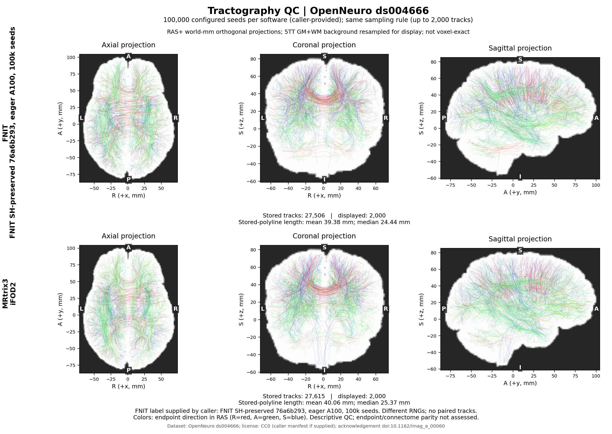

# 单 GPU SH 数据流优化：2026-10-09

[功能、流程图与最新结论](../../../docs/connectome/TRACKING_PERFORMANCE_OPTIMIZATION.md) · [完整 pipeline](../../../docs/connectome/README.md) · [前次 H100 记录](../tracking_exact_20261009/README.md)

## 1. 输入、实现与验收范围

本轮从固定真实 FOD、5TT 和 GMWMI 到完整流线，优化 `tracking_sh_precomputed()` 的 eager 列操作。正式运行仍为 PyTorch；官方 MRtrix 只在独立 benchmark 目录执行。没有新增运行依赖、降低精度或减少体素、系数、播种及 proposal。

输入来自 [OpenNeuro ds004666](https://openneuro.org/datasets/ds004666)。[原作者 dataset description](https://raw.githubusercontent.com/OpenNeuroDatasets/ds004666/master/dataset_description.json)声明 CC0；三份既有 reference 输入在迁移前后逐一核对 SHA。原始影像和 TCK 未加入仓库。

| 输入 | 格式和含义 | 字节数 | SHA-256 |
| --- | --- | ---: | --- |
| FOD | NIfTI float32 [104,104,72,45]，归一化 WM 球谐系数 | 36519533 | `18addc15596dadf7fb60727ae9af8d1cbd98c139964712454a33a718c5f4e7c1` |
| 5TT | NIfTI float32 [256,256,256,5]，cGM/sGM/WM/CSF/pathology | 926676 | `704539238d29c10eeaf4fab31831bc3ced9648ce6a59f4e9bd75c7b7d6d03fbf` |
| GMWMI | NIfTI float32 [256,256,256]，原 5TT 网格播种权重 | 416098 | `06243e393410bad709c2569e68d5eeed49d5f28500e607890a06e217a19a9823` |

读取使用 nibabel，affine 使用原 NIfTI float64 [4,4]，5TT header spacing 为 [1,1,1] mm。n_seeds=100000、seed=0、batch_size=8192、lmax=8、cutoff=0.1、power=0.5、maxlength=250 mm，其余原参数完整保存于 JSON。FA=None。输出包含全部 RAS-mm 路径、端点、长度、接受种子及尝试数；公开报告仅保留汇总、字节摘要和完整计时。

基线是 `4f56cc9d5937a766c432743809ab3b5baf11ca78`：

| 源码 | SHA-256 |
| --- | --- |
| 两版 tracking.py | `6ed4e6bedc45fa0eaf2b026541056ec2976eb7d205d397c8dff4f3e899047dbd` |
| 基线 fod.py | `f82d2174109d05b9f820b6abe98e3792e48ae63e02ace2f2640f10c4c2052aaa` |
| 最终 fod.py | `76a6b29364fdda8c33509aca7e8243b10c05f5418267e7bfb21ba0b6502d7310` |
| 成对 FOD benchmark | `d85962361d9cbe31a7c911541e21fe3268a6c1547eeab5da88b4fa8511b786d9` |

两版 FOD 在独立 module 中加载，分别检查 tracking 的实际函数引用。成对模式的跨版 function identity 为 False 是预期值，输出须逐字节相同。共享 FOD 模式仍兼容，只适合 tracking 自身的改动。

## 2. 最终真实 benchmark

共享 A100-SXM4-80GB、Xeon Platinum 8369B。每个进程单 GPU、8 个 CPU 线程；Python3.11.17、Torch2.5.1+cu118，FP32/TF32。每种模式在同一张卡内完整预热，随后 AB、BA，两个热样本/版本。

| 最终源码测试 | 基线热样本 / s | 候选热样本 / s | 结果 |
| --- | --- | --- | --- |
| [10k eager](sh_preserved_10k.public.json) | 24.837 / 25.578 | 22.367 / 21.904 | 字节一致；中位数减少12.19% |
| [100k eager](sh_preserved_default_100k.public.json) | 319.212 / 280.044 | 198.814 / 157.553 | 字节及TCK一致；负载波动明显 |
| [100k compiled](sh_preserved_compiled_100k.public.json) | 118.314 / 106.868 | 122.995 / 102.842 | 字节及TCK一致；无明确速度收益 |

100k eager 中位数299.628→178.184 s，compiled 112.591→112.919 s。期间其他作业开始占用多张卡，100k 数字是本轮观察，不承诺稳定倍率；全部预热、热样本和 GPU 数值快照保留。

eager 首次全量调用179.789/256.694 s，compiled132.906/142.158 s，分别作为完整预热；不是隔离冷启动。tracking 排除外部读盘、H2D、最终snapshot D2H、比较与TCK写盘；函数内 metadata 同步和路径收集仍计入。JSON 单列其他步骤。

两模式各六次完整调用的输出/TCK SHA一致，每组四次可评估比较通过。eager 27506条、compiled27745条；只在相同模式中比较，不把两种原有模式当作逐位等价。

[同机官方参考](mrtrix_100k.public.json)：固定源码提交 `026e850d171ec2a12f09865d31b8332d23d7ecf6`，8线程。seed0/1/2 完整命令16.319/14.193/13.888 s，实际TCK27615/27627/27690条。归档构建报告版本3.0.3，二进制SHA为 `e53460623df2a5a95d35f72ad8b258933722e5f0c72d8e613876c48b5e9d223f`。官方计时含输入和输出I/O，统计读取另计。

本轮验证的是 FNIT 新旧追踪输出不变。原始 DWI 到 SC 的端到端结果、MRtrix重复范围、FA及矩阵结论仍见[对应精度报告](../../../docs/connectome/ACCURACY_OPTIMIZATION_20261003.md)。

### 回归与 profiler

- [GPU回归](gpu_regression.public.json)：119 passed；覆盖本轮工具和既有追踪、采样、ACT、真实单弧fixture。
- CPU同7个文件：86 passed、33 CUDA skipped；显式使用当前源码PYTHONPATH。
- [CUDA SH控制](sh_cuda_controls.public.json)：原140组/35868方向，10个规模/布局控制、8个梯度控制；原始字节、输入和RNG一致。
- [CPU SH控制](sh_cpu_controls.public.json)与[编译保护控制](compile_guard_controls_cpu.public.json)：含14个mock编译状态、14个梯度控制，原计算分支AST相同；实际CUDA编译验收见100k报告。
- [迁移基线与profiler](baseline_10k_sanity.public.json)、[最终128seed profiler](sh_preserved_profile128.public.json)：均38条，实际CUDA kernel394737→350321（减少11.25%）。profiler运行时间受插桩和共享负载影响，不纳入正常速度表；kernel事件仅计一次。

## 3. 候选取舍

| 实验 | 同输入结果 | 性能与决定 |
| --- | --- | --- |
| [初始方向索引复用](seed_index_10k.public.json) | 10k字节一致 | 22.669→22.709 s，无收益，未采用 |
| [成功行索引复用](grow_success_10k.public.json) | 10k字节一致 | 25.851→25.527 s，一对更慢，收益不明确，未采用 |
| [SH合并8d/10k](sh_packed_10k.public.json) | 字节一致 | 23.074→20.471 s，进入全量验证 |
| [压缩lookup列](sh_compact_10k.public.json) | 字节一致 | 22.904→20.332 s；未证明额外收益，未采用较复杂版本 |
| [未保护的SH合并8d/eager100k](sh_packed_default_100k.public.json) | 字节一致 | 负载转变时段，所有慢样本保留；不是最终源码 |
| [未保护的SH合并8d/compiled100k](sh_packed_compiled_100k.public.json) | **失败**，27745→27750，SHA不同 | 编译图改变追踪数值结果，未采用 |
| 最终76a6 | 两模式100k均逐字节一致 | eager使用合并列；编译/梯度保持原运算，生产仅采用此版 |

旧原型不进入运行代码。原编译/梯度分支仍有实际用途，必须保留；没有将不一致候选的86.8秒样本当作正式加速。

## 4. 命令复现与显存审计

独立SH控制可重放CPU或CUDA；它验证算子，不替代上面的真实NIfTI追踪benchmark：

~~~bash
SH_CONTROL_FIXTURE=tests/connectome/data/real_ifod2_arc_ds004666.npz
SH_CONTROL_REPORT=/data/results/sh_controls.json
python validation/connectome/tracking_cfff_20261009/sh_controls.py \
  --baseline-fod /data/frozen/fod.py --candidate-fod /data/current/fod.py \
  --fixture "$SH_CONTROL_FIXTURE" --device cuda:0 --output "$SH_CONTROL_REPORT" \
  --benchmark-tool tools/benchmark_connectome_tracking_exact.py \
  --tracking-source /data/current/tracking.py
~~~

| SH控制参数 | 含义 |
| --- | --- |
| baseline-fod/candidate-fod | 两份冻结FOD/SH源码 |
| device | cpu或显式单个CUDA设备，不自动回退 |
| fixture | 真实方向/圆弧NPZ控制文件，建议明确传上面的仓库fixture |
| output | 可选JSON；省略时只输出到终端 |
| benchmark-tool/tracking-source | 成对提供，使用实际两版FOD loader；省略时独立直接加载两版FOD |
| baseline-commit | 可选、已核对的基线标签，不能替代SHA |
| threads | CPU线程数，默认8 |
| memory-cap-bytes | CUDA allocator上限，默认18000000000字节 |

标准输入、Python调用、每个追踪/benchmark参数及完整CLI见[功能说明第2～4节](../../../docs/connectome/TRACKING_PERFORMANCE_OPTIMIZATION.md#2-python-输入与输出)。先核对上表真实文件与源码SHA：

~~~bash
BASELINE_TRACKING=/data/frozen/tracking.py
CANDIDATE_TRACKING=/data/current/tracking.py
BASELINE_FOD_MODULE=/data/frozen/fod.py
CANDIDATE_FOD_MODULE=/data/current/fod.py
REAL_FOD=/data/inputs/fod_reference.nii.gz
REAL_FIVE_TISSUE=/data/inputs/five_reference.nii.gz
REAL_GMWMI=/data/inputs/gmwmi_reference.nii.gz
BENCHMARK_REPORT=/data/results/paired_tracking.private.json
TCK_OUTPUT_DIRECTORY=/data/results/paired_tracks

python tools/benchmark_connectome_tracking_exact.py \
  --baseline-tracking "$BASELINE_TRACKING" --candidate-tracking "$CANDIDATE_TRACKING" \
  --baseline-fod-module "$BASELINE_FOD_MODULE" --candidate-fod-module "$CANDIDATE_FOD_MODULE" \
  --fod "$REAL_FOD" --five-tissue "$REAL_FIVE_TISSUE" --gmwmi "$REAL_GMWMI" \
  --n-seeds 100000 --batch-size 8192 --seed 0 --device cuda:0 \
  --warmup 1 --warmup-seeds 100000 --repeats 2 --memory-budget-gb 20 \
  --save-tck "$TCK_OUTPUT_DIRECTORY" --output "$BENCHMARK_REPORT"
# 原有编译模式：在同一命令加 --compile-arc，两版同时生效。
~~~

公开导出：

~~~bash
PUBLIC_BENCHMARK_REPORT=/data/results/paired_tracking.public.json
python validation/connectome/tracking_cfff_20261009/export_public.py \
  --input "$BENCHMARK_REPORT" --output "$PUBLIC_BENCHMARK_REPORT"
~~~

#### 显存结果和工具

完整100k审计的[实际报告](memory_audit_100k.public.json)执行与snapshot/输出核对成功，Torch allocated/reserved峰值1.050/1.206GB，allocator18GB。当前容器为Linux3.10，可见PID与驱动PID不一致，无可用于映射的host procfs顶层挂载；所有进程采样缺失，**完整进程 <20GB门槛未通过**。不把缺失当零，也不拿他人的整卡显存作本进程峰值。

新增通用[审计工具](../../../tools/audit_connectome_tracking_process_memory.py)支持成对/共享FOD、SHA绑定的本机基线oracle，不硬编码历史H100的轨迹数/摘要。输出为不含路径/PID/UUID的JSON。五组文件及SHA均必需：

| 参数 | 输入含义 |
| --- | --- |
| benchmark-module及其sha256 | 本轮benchmark Python源码与预先核验SHA |
| candidate-tracking及其sha256 | 候选tracking.py及预先核验SHA |
| candidate-fod-module及其sha256 | 候选fod.py及预先核验SHA |
| reference-report及其sha256 | 同物理GPU、输入、运行时和配置的完整private配对报告；需要每条路径摘要及通过的baseline |
| monitor-module及其sha256 | 只复用冻结监控类，不执行旧工具main；本轮文件为tracking_exact_20261009/audit_real100k_memory.py |
| fod/five-tissue/gmwmi | 上表真实NIfTI |
| output | 采样、Torch峰值、配置、输出核对和gate的JSON |
| device | 显式单个CUDA设备 |
| memory-budget-gb | 十进制GB，最大20；allocator使用90%，本进程采样峰值必须严格小于预算 |
| sample-interval-seconds | 周期采样间隔，默认0.5s |
| query-timeout-seconds | 每次SMI查询超时，默认3s |
| max-sample-gap-seconds | 事先声明的最大采样起点间隔，默认2s |

每个SHA参数写作 `--<参数名>-sha256`。完整示例：

~~~bash
MEMORY_AUDIT_TOOL=tools/audit_connectome_tracking_process_memory.py
BENCHMARK_MODULE=tools/benchmark_connectome_tracking_exact.py
MONITOR_MODULE=validation/connectome/tracking_exact_20261009/audit_real100k_memory.py
MEMORY_AUDIT_REPORT=/data/results/complete_memory.json
BENCHMARK_MODULE_SHA256=d85962361d9cbe31a7c911541e21fe3268a6c1547eeab5da88b4fa8511b786d9
CANDIDATE_TRACKING_SHA256=6ed4e6bedc45fa0eaf2b026541056ec2976eb7d205d397c8dff4f3e899047dbd
CANDIDATE_FOD_MODULE_SHA256=76a6b29364fdda8c33509aca7e8243b10c05f5418267e7bfb21ba0b6502d7310
MONITOR_MODULE_SHA256=fc452e3a70c17f276e015f60b82c04ec6dc2e8c3aac8e9b58fefc5ad5c8fc29d
REFERENCE_REPORT_SHA256=$(sha256sum "$BENCHMARK_REPORT" | cut -d ' ' -f 1)
# 上一行只在已人工核对的完整本机报告上记录SHA，不接受来源未知的报告。

python "$MEMORY_AUDIT_TOOL" \
  --benchmark-module "$BENCHMARK_MODULE" --benchmark-module-sha256 "$BENCHMARK_MODULE_SHA256" \
  --candidate-tracking "$CANDIDATE_TRACKING" --candidate-tracking-sha256 "$CANDIDATE_TRACKING_SHA256" \
  --candidate-fod-module "$CANDIDATE_FOD_MODULE" --candidate-fod-module-sha256 "$CANDIDATE_FOD_MODULE_SHA256" \
  --reference-report "$BENCHMARK_REPORT" --reference-report-sha256 "$REFERENCE_REPORT_SHA256" \
  --monitor-module "$MONITOR_MODULE" --monitor-module-sha256 "$MONITOR_MODULE_SHA256" \
  --fod "$REAL_FOD" --five-tissue "$REAL_FIVE_TISSUE" --gmwmi "$REAL_GMWMI" \
  --device cuda:0 --memory-budget-gb 20 --output "$MEMORY_AUDIT_REPORT"
~~~

审计只执行candidate一次，全部追踪参数继承报告，不加入ABBA速度样本。关键阶段采样缺失/出错或超过间隔门槛就不能通过；即使通过也不证明采样间隔内的连续显存上界。下一项资源验证需在驱动PID可见的环境或经核验的host procfs映射下完成。

## 5. 脑图复现

FNIT最终eager和本机MRtrix seed0实际TCK，各独立抽样最多2000条；每个软件都重置同一绘图seed20261009。真实保存折线平均长度39.379/40.058mm、中位数24.437/25.375mm，KS=0.011389。[图和统计SHA](real100k_qc.public.json)。不是逐条配对轨迹，也未测SC矩阵一致性。

复用原有[离线绘图工具](../tracking_exact_20261009/plot_real_tracking_qc.py)，无需复制另一版。5TT仅在显示时重采样为1.5mm RAS；真实路径和折线长度不重采样。

~~~bash
FNIT_TCK=/data/results/paired_tracks/hot_000_candidate.tck
MRTRIX_TCK=/data/reference/seed0.tck
QC_OUTPUT_DIRECTORY=/data/results/tracking_qc
QC_METADATA_MANIFEST=/data/results/tracking_qc_inputs.json # 已核对的输入SHA、公开来源及许可证
python validation/connectome/tracking_exact_20261009/plot_real_tracking_qc.py \
  --fnit-tck "$FNIT_TCK" --mrtrix-tck "$MRTRIX_TCK" --five-tissue "$REAL_FIVE_TISSUE" \
  --metadata-manifest "$QC_METADATA_MANIFEST" \
  --n-seeds 100000 --fnit-label 'FNIT SH-preserved 76a6b293, eager A100, 100k seeds' \
  --dataset-label 'OpenNeuro ds004666' --output-dir "$QC_OUTPUT_DIRECTORY"
~~~

绘图参数、输入格式与来源manifest绑定机制见[工具说明](../tracking_exact_20261009/QC_REPRODUCE.md)。本轮提供了实际三份TCK/5TT SHA绑定的许可manifest，公开版删除私有路径。

## 6. 官方步骤与参考

本轮对应官方 `tckgen` 内部SH查表及iFOD2/ACT追踪，官方命令：

~~~bash
MRTRIX_RNG_SEED=0 tckgen "$REAL_FOD" "$MRTRIX_TCK" \
  -algorithm iFOD2 -seed_gmwmi "$REAL_GMWMI" -act "$REAL_FIVE_TISSUE" \
  -seeds 100000 -select 0 -maxlength 250 -cutoff 0.1 -samples 3 -power 0.5 -nthreads 8
~~~

官方源码与依赖只在私有reference目录构建，未进入FNIT运行路径或分发包。MPL-2.0 [许可证](https://raw.githubusercontent.com/MRtrix3/mrtrix3/026e850d171ec2a12f09865d31b8332d23d7ecf6/LICENCE.txt)；固定[源码](https://github.com/MRtrix3/mrtrix3/tree/026e850d171ec2a12f09865d31b8332d23d7ecf6)采用`configure -nogui`和`build bin/tckgen`，不需Qt，不能以不存在的MINIMALBUILD配置构建。

- Tournier, Calamante & Connelly. Improved probabilistic streamlines tractography by 2nd order integration over fibre orientation distributions. ISMRM 2010,1670.
- Smith et al. Anatomically-constrained tractography. NeuroImage62,1924–1938(2012). DOI:10.1016/j.neuroimage.2012.06.005.
- Manzano-Patron et al. EDDEN. Imaging Neuroscience(2024). DOI:10.1162/imag_a_00060.

最近更新、H100历史、被拒绝的原型及下一步精度保持的优化方向统一见[性能说明](../../../docs/connectome/TRACKING_PERFORMANCE_OPTIMIZATION.md#7-更新与未采用实验)。
