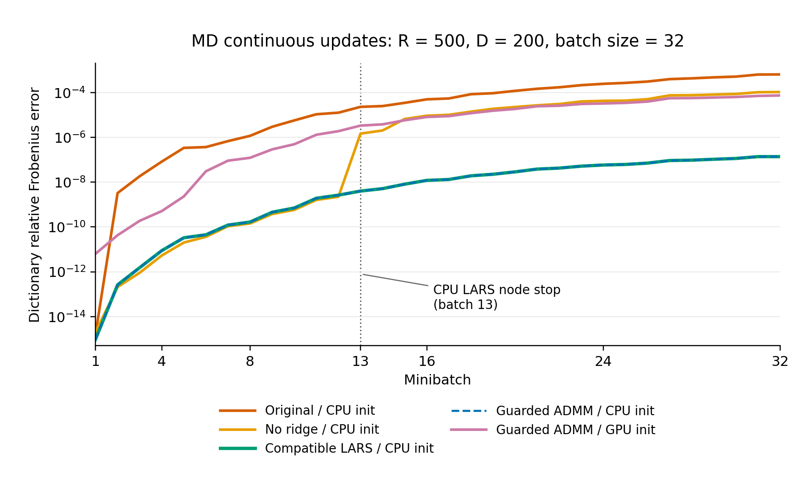

# PyTorch DicL 与 MiniBatchDictionaryLearning：真实1000人效果匹配

本页的测量发生于字典学习拆分之前，原源码路径、SHA-256及运行条件保留为历史证据。当前独立入口与拆分检查见[验证索引](README.md)；移动报告不表示重新运行真实数据。

本页保留首轮精度修复的测量与因果控制。后续调度和字典更新优化见[当前优化报告](dicl_speed_optimization_real1000_20261001.md)；本页的运行时间、缓存版本和源码哈希对应此前的测量。

本轮复用同一份真实1000人的VBM、FA、MD完整掩膜R500投影，逐模态拟合D200字典。CPU参考为服务器实际安装的 **scikit-learn 1.7.1**，GPU使用PyTorch2.5.1。CPU/GPU的字典、原子余弦及LASSO重建已通过本轮预设容差；独立初始化下FA/MD的OMP30重建仍未通过。因此不能称整个 `MiniBatchDictionaryLearning` 的输出已等价。FLICA有效C20和最终脑图属于[此前尚未通过的验收](../bigflica/mmigp500_real1000_20261001.md)，本轮没有继续拟合。

## 输入、参考代码与验收方法

三模态均来自同一1000人、`91×109×91`、2 mm标准空间影像；完整掩膜体素数为VBM157,901、FA222,257、MD222,261。使用已保存的mMIGP投影，固定R500/D200、seed0、batch32、alpha1、最多1000 epoch、稀疏求解预算1000。CPU保留sklearn的 `tol=0.001` 和 `max_no_improvement=10`；两端均在第一个epoch提前停止，实际训练批次数分别为123、149、286。CPU参考仅运行一次，之后复用已保存的初态、字典和归一化统计。

投影沿用原实验的“每个体素跨被试去均值，再除以模态整体RMS”输入；它不是公开默认逐体素z-score从原始NIfTI冷启动的测试。DicL内部保持已有float64精度；未新增float16计算。CPU和GPU使用相同的投影文件、随机数和模态顺序。被试清单及投影SHA-256、实际训练源码和运行器哈希保存在[匿名汇总](dicl_match_real1000_20261001.json)，未发布被试标识、影像或字典数组。

比较原始训练字典及FNIT输出的“每原子去均值、整体RMS归一化”字典，先做Hungarian原子匹配和符号对齐。此次最优匹配均为原顺序。每模态评估2000个未进入两端实际训练批次的体素，使用相同CPU归一化及相同sklearn编码器，分别检查训练目标使用的LASSO-alpha1和参考模型实际的OMP30 `.transform()`。这些体素参与过全数据统计和SVD，**不是独立留出被试或体素的泛化验证**。

完整训练前固定的容差为：原始/归一化字典相对L2差≤`1e-3`、最小原子余弦≥`0.999999`、LASSO目标值相对差≤`1e-5`、LASSO和OMP30重建相对L2差≤`1e-3`。OMP系数不要求逐位相等，但保留重建门槛；本次没有根据结果放宽阈值。重建差是 `||GPU重建−CPU重建|| / ||CPU重建||`，不是两端残差之差。

## 已定位并修复的实现差异

1. **额外ridge改变了训练目标。**原活动集求解加入固定 `1e-10` 正则项。共用CPU初态时，第二批编码已出现约`1.60e-9`差异；前四批仍走LARS，因此不能归因于ADMM。已移除该项，奇异或非有限系统明确诊断。
2. **精确目标解与sklearn的节点停步不同。**sklearn LARS会接受目标附近浮点容差内的路径节点；R500时raw-alpha容差约`5.96e-5`。真实MD第13批出现CPU节点停步与GPU精确目标解分歧。新增PyTorch兼容路径，保留节点停止、条件插值、斜率舍入和原子退出规则。ADMM活动集抛光之后检查邻近路径节点，敏感批次整批回退该路径。
3. **每模态单独重置稀疏求解状态。**前四批的冷启动规则不再被上一个模态的调用次数影响；死原子重采样和shuffle保留随机数顺序。
4. **统计累加顺序和SVD精度。**两遍分块统计沿NumPy C-order行顺序累加，真实三模态mean/std与CPU逐位相同。float32存储先提升float64；这不声称等于NumPy默认float32累加。CUDA SVD显式采用 `gesvd`，QR幂迭代保留；真实初始字典相对误差由约`6e-12–9e-12`降至`1.7e-12–2.3e-12`。LU控制没有在三模态上持续更好。
5. **有界读取。**适合显存缓存的投影也逐块读取、复制和原地归一化；GPU入口不再执行整模态 `projected[:]` CPU读取。无需新增依赖。当前GPU DicL缓存版本为 `rsvd4bpdn`，旧字典缓存失效，输入与mMIGP缓存仍可复用。

固定CPU初态的32批MD控制中，字典误差由原实现`6.39e-4`降到无ridge的`1.05e-4`，再降到兼容LARS/guarded ADMM的约`1.37e-7`。全LARS和guarded ADMM均保存原随机状态；guarded仅回退11/32批。另把初态换成旧GPU保存值，约`5.68e-12`微扰便令第32批误差增至`7.37e-5`，支持初始化误差在在线训练中放大的解释。有效支持 `abs(code)>1e-8` 只用于KKT诊断，没有改写实际编码。



图中GPU初态曲线使用统计/SVD精度修复前的保存初态；三条修复曲线共用CPU初态。它展示32批因果控制，不代表完整训练或独立初始化的结果。

## 完整训练：实际GPU初始化

| 模态 | 归一化字典相对L2差 | 最小原子余弦 | LASSO重建相对L2差 | OMP30重建相对L2差 | 全部门槛 |
|---|---:|---:|---:|---:|---|
| VBM | 1.223e-7 | 0.999999999999964 | 1.572e-7 | 1.329e-7 | 通过 |
| FA | 1.071e-4 | 0.999999978050 | 1.312e-4 | 0.02445 | OMP未通过 |
| MD | 5.849e-4 | 0.999999646395 | 6.472e-4 | 0.05334 | OMP未通过 |

LASSO目标值、原始字典和原始原子余弦门槛三模态均通过。FA/MD的差异比修复统计/SVD前明显下降，旧OMP30重建差为`0.05294/0.13306`；仍不能仅用接近的损失或余弦宣布输出匹配。

相同2000个评估样本中，FA有20个、MD有78个样本改变了OMP支持集。固定CPU系数后，GPU字典造成的重建差仅为FA`1.167e-4`、MD`6.379e-4`；允许OMP重新选原子后差异上升到上述2.44%/5.33%。FA/MD每个样本重建差的中位数为`1.191e-4/6.608e-4`，最大值为`0.458/0.574`。少量离散选点切换主导总差；该诊断不取消重建门槛，也不证明任意输入的OMP输出等价。

## 共用初态的因果控制

仅替换初始化函数实际返回的字典为已保存CPU初态；原GPU SVD仍执行以推进原随机数，记录原值及实际返回值的哈希。实际返回初态与CPU逐位相同、误差为0，张量stride也与原GPU字典相同。三模态初始化后的完整RandomState哈希与CPU一致，停止步数仍为123、149、286。评估复用上述固定2000个样本，重新验证这些体素未进入当前两端实际训练批次，输入与CPU统计规范化逐位一致。

| 模态 | 归一化字典相对L2差 | LASSO重建相对L2差 | OMP30重建相对L2差 | 全部门槛 |
|---|---:|---:|---:|---|
| VBM | 2.412e-10 | 3.107e-10 | 2.625e-10 | 通过 |
| FA | 4.060e-8 | 4.992e-8 | 4.439e-8 | 通过 |
| MD | 6.445e-5 | 7.185e-5 | 0.01943 | OMP未通过 |

共用初态显著缩小最终差异，但MD仍有训练期间的放大效应。此控制仅用于定位，没有把CPU初始化接入默认GPU实现；它不替代独立初始化的正式结果。

进一步仅对尚未通过的MD使用全兼容LARS，避免重复VBM/FA。共用相同CPU初态、随机状态及固定评估样本，仍运行286批；字典差为`6.435e-5`、LASSO重建差为`7.172e-5`，OMP30重建差为`0.019427638`，与guarded结果几乎相同，仍未通过。全部286批确实使用兼容LARS，未执行ADMM抛光。因而仅关闭ADMM不能消除当前MD差异；剩余重点是CPU/GPU算术微扰在在线字典更新中累计/放大及OMP的离散支持选择，具体首个分叉仍需继续追踪。

## 耗时、内存与测试范围

同一共享H100上，8个CPU线程的三模态参考调用总耗时 **103.90秒**；实际GPU初始化的精度修复版三模态调用 **141.29秒**。GPU测量包括I/O、初始化和观察器字典快照，未清空系统缓存，共享GPU有持续外部负载；这是单次观测，**没有形成受控提速结论**。GPU分配显存峰值2.62 GiB、主机RSS峰值1.76 GiB，分配器硬上限18 GiB。逐块GPU预加载的后续源码还消除了整矩阵归一化临时量；其完整控制资源数据见匿名汇总。

有界预加载后的共用初态三模态控制观测耗时134.22秒，峰值显存2.05 GiB、RSS0.93 GiB；单模态MD全LARS控制为297.13秒、显存1.95 GiB、RSS0.89 GiB。后者比guarded计算更多，未改善OMP门槛，因此未改成默认方案。这些控制涉及初始化干预及观察器，不作为默认路径的速度验收。

最终源码的BigFLICA相关定向测试 **87 passed，9.51秒，无跳过**。本地测试环境PyTorch2.4.1、sklearn1.2.2、NumPy1.26.4；它们覆盖解析解、LARS节点和插值、原子退出、退化回退、近节点检查、每模态状态、有界统计/预加载和CPU/CUDA逐位缓存比较，属于回归测试。上述效果结论来自实际服务器sklearn1.7.1/真实影像投影，未用生成数据替代benchmark。现有Conda环境已有所需PyTorch、NumPy、SciPy、HDF5和sklearn依赖，未新增安装步骤。

数值训练验收使用的核心源码SHA为 `b1a918da875b45e874702074b1b5d4ed93a9e80ae6cb5be8776ebc34736c4efb`。随后仅替换有界GPU缓存加载的最终核心源码SHA为 `415c09accd74239a2ab93e60e88f92230aa7021b0e7bd985b268ff130765b380`；该加载路径在CPU/CUDA、float32/float64回归中与旧元素表达式逐位一致，后续共用初态控制使用该源码。代码提交为 `945242c726640ad136a54bcf0047258aab498eee`；实际运行时的 `pipeline.py` 为此前冻结快照，仅默认预算不同，调用已显式传入1000。匿名汇总分别记录实际测试哈希和发布源码哈希。

## 复现与参考实现

[`benchmark_dicl_match.py`](benchmark_dicl_match.py)包含CPU、GPU、评估三个独立阶段。输入目录应已有 `vbm_projected.h5`、`fa_projected.h5`、`md_projected.h5`，各文件 `data` 为float64的体素×500数组。输出目录必须不存在；字典、排列、样本及编码留在私密目录。每阶段的 `report.json` 记录实际来源哈希，只有脱敏汇总可发布。

脚本会检查参考sklearn恰为1.7.1。主页Conda环境目前固定1.5.2；复现该比较时可从已安装FNIT环境建立独立验证环境，固定参考版本后再运行下列命令。本次实际服务器不是按这个Conda文件重新建出的环境，不能写成全仓库安装验收。

```bash
conda create --name fnit-dicl-validation --clone fnit
conda install --name fnit-dicl-validation --channel conda-forge scikit-learn=1.7.1
conda activate fnit-dicl-validation
```

```bash
projection_directory=/absolute/private/mmigp_R500
cpu_reference_directory=/absolute/private/cpu_reference
gpu_default_directory=/absolute/private/gpu_default
evaluation_default_directory=/absolute/private/evaluation_default
# 使用服务器实测的 sklearn1.7.1；CPU参考只拟合一次。
OMP_NUM_THREADS=8 OPENBLAS_NUM_THREADS=8 MKL_NUM_THREADS=8 PYTHONPATH=src \
  python validation/dictionary_learning/benchmark_dicl_match.py cpu \
  "$projection_directory" - - "$cpu_reference_directory"
# 固定一个有足够余量的GPU；脚本为其设置18GiB分配器上限。
CUDA_VISIBLE_DEVICES=GPU-REPLACE-WITH-YOUR-UUID PYTHONPATH=src \
  python validation/dictionary_learning/benchmark_dicl_match.py gpu \
  "$projection_directory" "$cpu_reference_directory" "$gpu_default_directory"
PYTHONPATH=src python validation/dictionary_learning/benchmark_dicl_match.py eval \
  "$projection_directory" "$cpu_reference_directory" \
  "$gpu_default_directory" "$evaluation_default_directory"
```

`cpu previous initial` 中两个 `-` 表示不请求旧基线/旧初始化校验，从零生成CPU参考；可分别提供已有文件所在目录以做重放。GPU的 `--device` 默认 `cuda:0`，`--events` 默认1000；评估的 `--voxels` 默认2000。因果控制可使用GPU的 `--common-cpu-initialization` 和 `--all-compatible-lars`，eval自动继承实际控制标记；`--fixed-evaluation "$evaluation_default_directory"` 会复用相同评估样本并重新核对输入、CPU统计及当前批次访问情况。全部参数和完整控制命令见脚本开头。

公开脚本在已测试私密控制运行器上仅增加可省略的历史I/O校验及说明；GPU初始化、观察器和指标函数的AST一致，已做语法及三阶段CLI检查。此次真实运行仍使用匿名汇总中记录的私密运行器哈希，不声称公开脚本已从头重新跑过该数据。

对应CPU代码是 [`fit_dicl`](../../src/fnit/dictionary_learning/cpu.py)，核心调用为 `MiniBatchDictionaryLearning(n_components=200, max_iter=1000, batch_size=32, transform_n_nonzero_coefs=30, random_state=0).fit(samples)`；未显式指定的训练算法沿用sklearn LARS/alpha1。GPU实现为 [`fit_dicl_gpu_streaming`](../../src/fnit/dictionary_learning/torch_backend.py)。BigFLICA后续使用归一化字典；本轮OMP30用于补查参考模型 `.transform()` 的兼容性，FNIT未新增独立OMP30 GPU接口。

算法参考：Mairal J, Bach F, Ponce J, Sapiro G. *Online Dictionary Learning for Sparse Coding*, ICML2009；扩展论文为[Online Learning for Matrix Factorization and Sparse Coding](https://jmlr.org/papers/v11/mairal10a.html), JMLR11:19–60, 2010。参考实现及参数见[sklearn文档](https://scikit-learn.org/1.7/modules/generated/sklearn.decomposition.MiniBatchDictionaryLearning.html)、[1.7.1字典学习源代码](https://github.com/scikit-learn/scikit-learn/blob/1.7.1/sklearn/decomposition/_dict_learning.py)与[LARS源代码](https://github.com/scikit-learn/scikit-learn/blob/1.7.1/sklearn/linear_model/_least_angle.py)。CUDA SVD驱动选择见[PyTorch2.5.1原文档](https://github.com/pytorch/pytorch/blob/v2.5.1/torch/linalg/__init__.py)。本轮还未完成任意退化输入、公开默认全链、FLICA C20及脑图的兼容验收。
