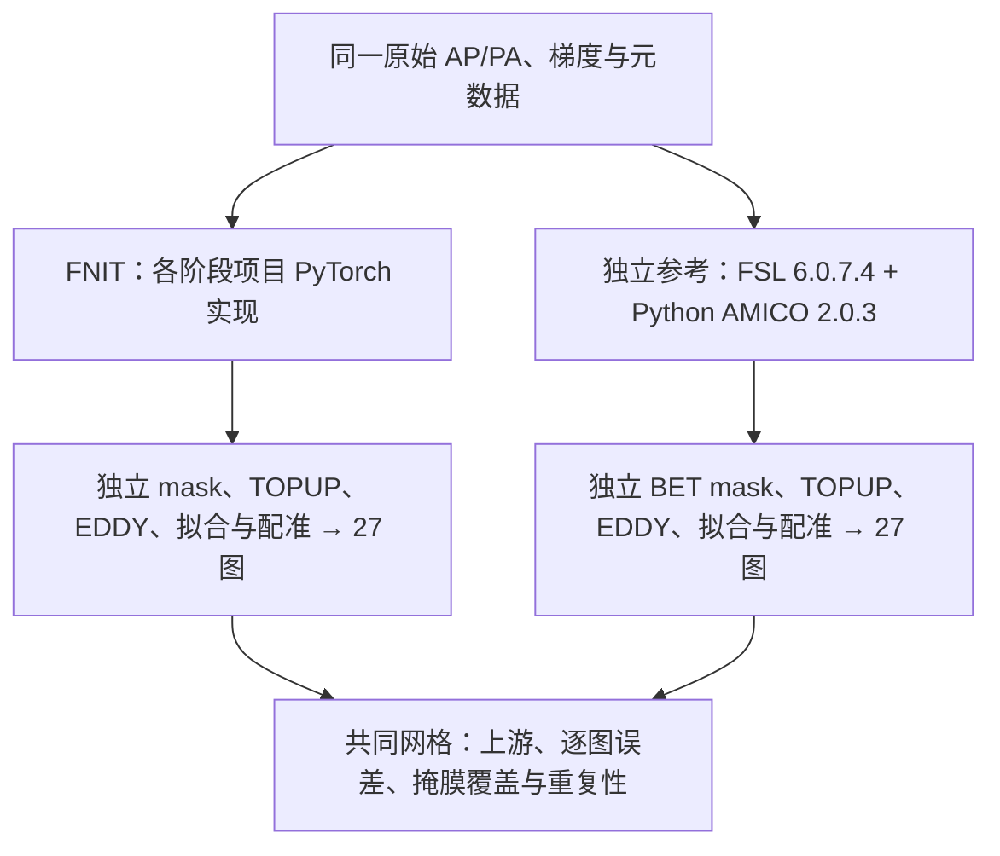
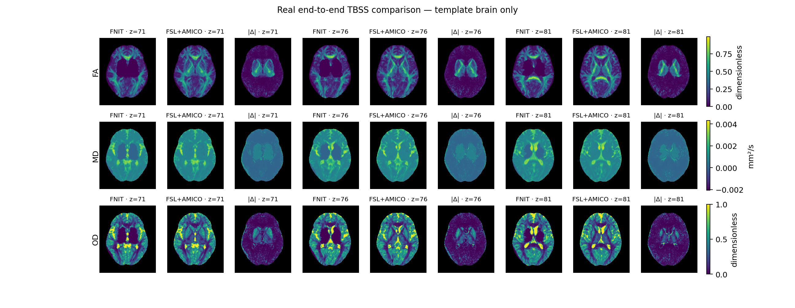

# DMRIPipeline：真实原始 AP/PA 整链与独立原软件对照（2026-10-02）

[功能与 Python/CLI 调用](../../docs/dmri_pipeline/README.md) · [时间、源码及重复性 JSON](report.end_to_end_20261002.public.json) · [首轮逐图 JSON](comparison.end_to_end_20261002.public.json) · [第二轮逐图 JSON](comparison.end_to_end_20261002.repeat2.public.json) · [上游 JSON](upstream.end_to_end_20261002.public.json)

## 1. 本次结果

同一例真实 AP/PA，从原始图像重新执行默认 **无 T1、TBSS＋AMICO** 流程，保存 FA、MD、L1、L2、L3、MO、ICVF、OD、ISOVF 的 native、standard、skeleton 共 **27 张图**。FNIT 与独立 FSL＋AMICO 各完整运行两次，四次退出码均为 0。

处理时间中位数为 **FNIT 8.02 分钟，参考链 34.68 分钟**；观察到的时间比为 **4.32**。输出仍有明显差异，因此这组时间不能称为数值等价重建的加速。FNIT 两次内部、参考链两次内部的 27 张解码数组分别逐值一致，NIfTI header binary block 的哈希也分别全部相同；这项重复性检查不代表两种软件之间相同。

27 对图全部通过 shape、affine（绝对容差 1e-5）及有限值检查，统计前仅允许去掉末维长度为 1 的 volume，不重采样。报告另记录 qform/sform、code、单位、dtype 和 scaling；本次未把完整 header/extensions 相等设为跨软件验收条件，也未给相关性设置“通过”阈值。



## 2. 输入、资源与原软件范围

AP 为 104×104×72×105，5 个 b0、50 个 b1000、50 个 b2000；PA 为 104×104×72×6，含 3 个 b0。JSON 的相位方向为 ±j，实际读出时间为 0.069 秒。两套流程均实际选择原始 AP/PA 第 0 卷，所选两卷图像的 float32 解码值及 affine 精确相同；acqparams 和 EDDY index 也相同。DTI 选取原始顺序中的 55 卷 b0/b1000，NODDI 使用全部 105 卷，均使用各自 EDDY 输出的 rotated bvec。

native 网格约 2 mm；standard/skeleton 为同一 FMRIB58_FA 1 mm 的 182×218×182 网格。模板、三份 Oxford 配置、原始文件、已安装参考二进制的大小和 SHA-256，以及每次 FNIT 的全部 Python 源码哈希均保存在机器报告。FNIT 数值源码固定为 `747345223710e704f94ba850f58504fe2bac4f8e`；本次没有修改生产数值计算。 发布前合入 main 的其他模块更新后，67 个所列 dMRI 模块及共享工具 Python 文件的 SHA-256 仍与计时快照相同；其他模块源码差异在机器报告中单列。

在 gpucw1 的同一共享 H100 PCIe 上，按 FNIT①→参考①→参考②→FNIT②串行执行；每次使用新的输出目录，无阶段复用。CPU 亲和固定 0–7、8 线程。参考 FSL 套件版本为 6.0.7.4；`eddy_cuda10.2` 未提供可读的独立版本号，报告固定其实际文件 SHA-256。FNIT Python 3.11.16、PyTorch 2.5.1、NumPy 1.26.4、nibabel 5.4.2；TF32 开启，图像/保存值为 float32，保留既有求解器/几何的 float64 路径，没有改用 FP16/BF16。官方 AMICO 拟合 8 线程、BLAS 1 线程；其全局旋转表已存在，每次协议相关 kernels 仍重新生成。

`/cwStorage` 测量前已满，因此两套输出均保存于相同的节点私密 `/tmp` 文件系统；原始数据只读。该临时结果目录尚不代表长期数据归档。没有清除系统文件缓存，也没有独占 CPU/GPU，时间为本例两次的描述性结果。

参考链从同一 raw 重新生成 TOPUP、EDDY、mask、native、affine、FNIRT 和最终九图，未借用 FNIT 或历史官方输出。参考命令来自固定 UKB v1.5 `0e39a7f7`，但作了本例所需适配：T1 派生 mask 改为独立 TOPUP iout 均值上的 BET `-f 0.2`；MCR-AMICO 换成官方 Python AMICO 2.0.3；后续 raw bvec 换为各自 rotated bvec；EDDY 固定 `initrand=12345`；不执行 GDC。故参考名称为“独立 FSL＋AMICO 完整适配链”，不是未修改的 UKB v1.5。FNIT 默认 mask 是项目已有的阈值及形态学实现，与 BET 不同。

FSL、AMICO 及其依赖只用于独立原软件验证，未加入 FNIT 运行环境。实际安装的 AMICO LICENSE 为 Version 2、24 July 2023，仅授权研究/教学用途，商业用途需另行协议；FSL 使用已安装的研究参考环境，UKB 命令来源为 Apache-2.0。仓库仅发布自写验证入口、匿名统计及模板脑内指标切面，未复制参考软件、许可文件、模板或原始影像。

## 3. 端到端和各阶段时间

| 运行 | 处理时间 / s | 处理时间 / min | 整个进程 / s | 退出码 |
| --- | --- | --- | --- | --- |
| FNIT① | 507.22 | 8.45 | 512.46 | 0 |
| 参考① | 2166.99 | 36.12 | 2181.09 | 0 |
| 参考② | 1994.29 | 33.24 | 2009.64 | 0 |
| FNIT② | 455.06 | 7.58 | 459.70 | 0 |

主口径使用 FNIT public API wall 与参考 raw 读取起至全部输出保存的 `total_processing_seconds`。整个进程还包括 Python/CUDA 启动和输入/输出审计；参考端的哈希及最终读取审计更多，因此整个进程另列，不作为主要比值。

| 阶段 | FNIT① / s | FNIT② / s | 参考① / s | 参考② / s | FNIT 中位 / s | 参考中位 / s |
| --- | --- | --- | --- | --- | --- | --- |
| b0 选择＋TOPUP＋mask/EDDY 准备 | 67.26 | 64.97 | 282.00 | 273.81 | 66.12 | 277.91 |
| 完整 EDDY 八轮与保存 | 370.91 | 333.06 | 719.06 | 627.61 | 351.98 | 673.33 |
| shell 选择＋DTIFIT 与保存 | 14.03 | 12.83 | 16.96 | 16.51 | 13.43 | 16.74 |
| AMICO NODDI 与保存 | 23.61 | 20.30 | 34.39 | 32.79 | 21.95 | 33.59 |
| FA 预处理＋FLIRT/FNIRT＋九图传播/骨架与保存 | 30.98 | 23.35 | 1114.57 | 1043.57 | 27.16 | 1079.07 |

FNIT DTIFIT 行包含 shell 数据读取和选择，来自 pipeline QC；仅包装 `TorchDTIFIT.run()` 的较短日志不用于这张表。阶段之和与完整 wall 的少量差值包含阶段间调度及 pipeline 报告保存。

### 原软件的细分时间

| 原软件步骤 | 参考① / s | 参考② / s |
| --- | --- | --- |
| raw 读取、b0 pairwise FLIRT/fslcc 选择 | 56.44 | 50.85 |
| TOPUP | 210.11 | 214.83 |
| 独立 BET mask | 15.45 | 8.14 |
| EDDY CUDA | 719.06 | 627.61 |
| shell 选择、DTIFIT | 16.96 | 16.51 |
| 官方 AMICO 完整调用和保存 | 34.39 | 32.79 |
| FA support 预处理及 FLIRT weight | 2.45 | 1.73 |
| 完整 TBSS 配准、传播和骨架子流程 | 1112.12 | 1041.84 |

| TBSS 子步骤 | 参考① / s | 参考② / s |
| --- | --- | --- |
| weighted FLIRT | 15.53 | 15.15 |
| FNIRT stage 1 | 68.80 | 65.96 |
| FNIRT stage 2 | 561.05 | 556.62 |
| FNIRT stage 3 | 286.38 | 290.77 |
| 最终 FA applywarp | 3.43 | 3.72 |
| FA 有效 mask 与 skeleton mask | 28.17 | 30.09 |
| 其他八图 applywarp 及 mask | 34.61 | 35.61 |
| 未单独细分的 TBSS 开销 | 114.15 | 43.92 |

TBSS 余量包括子流程启动、初始三次图像复制、目录和参数准备、阶段间调用、最终 timing JSON 等；没有独立测量，不能全部归为图像复制或计时开销。本次补齐官方 `bb_tbss_3_postreg` 的最终 FA `applywarp --rel`，参考 FA 不再直接采用 FNIRT `--iout`。此前历史 TBSS 报告使用补齐前的命令，保留其时间和输入边界，不沿用作本次结果。

FNIT 的 EDDY 占本轮阶段时间约 73.2%；参考链配准与传播约 51.9%。FNIT FNIRT 六层均执行 5/5/5/5/50/25 次 accepted iterations；它们的 `converged=false` 和既有数值等价/拓扑 gate 未通过仍记录在 QC 中。完成相同迭代预算不能证明得到相同配准。

### CPU/GPU 与显存

| 部分 | FNIT | 参考链 |
| --- | --- | --- |
| 图像读取、保存与目录准备 | CPU / nibabel | CPU / FSL、nibabel |
| b0选择、TOPUP、EDDY | PyTorch CUDA；mask 阈值和 SciPy 形态学用 CPU | 选择及 TOPUP/BET CPU；EDDY CUDA |
| DTI、NODDI | PyTorch CUDA；保存用 CPU | DTIFIT 与官方 Python AMICO CPU |
| FLIRT、FNIRT、图传播 | PyTorch CUDA；保存用 CPU | 原生 CPU executable |
| 验收统计及脑图 | 计时结束后 CPU / NumPy、Matplotlib | 同一统计入口 |

FNIT 第二轮各 public-stage 记录的最大 CUDA allocation 为 13.87 GB，reserved 为 19.93 GB；allocator 限额 20.00 GB，不含 CUDA context 或其他进程。首轮组件会重置峰值计数，原最终顶层读数只代表末阶段，已从公开报告删除；该轮组件 QC 的最大 allocation 为 13.87 GB。第二轮 logger 改为逐阶段保留峰值，生产数值源码不变；首轮 logger SHA 未记录，公开字段明确为 null。5 秒 telemetry 是整张共享 GPU 的总显存和利用率，不能当作本进程峰值。

## 4. 最终九图的精度

首轮逐图数值如下；第二轮解码图与各自首轮完全相同，因此逐图误差相同。r 为 Pearson 相关；MAE、RMSE、P95 为未四舍五入数组的绝对误差。MD/L1/L2/L3 单位为 mm²/s，其余无量纲。固定 ROI 不由候选输出挑选：native 使用参考 EDDY mask，standard 使用 FA 模板非零区域，skeleton 使用模板 skeleton≥2000 且模板脑内区域。每图 nonzero union 的相关性另列，完整 JSON 同时记录两个范围的误差及非零 support Dice。

### native：固定参考脑 mask

| 参数图 | 固定 ROI r | 非零并集 r | 固定 ROI MAE | 固定 ROI RMSE | 固定 ROI P95 |
| --- | --- | --- | --- | --- | --- |
| FA | 0.608778 | 0.600299 | 0.0700472 | 0.179657 | 0.424883 |
| MD | 0.681955 | 0.661586 | 0.000262622 | 0.000630058 | 0.00174047 |
| L1 | 0.592708 | 0.567773 | 0.000324964 | 0.000761221 | 0.00208001 |
| L2 | 0.694352 | 0.675444 | 0.000259556 | 0.000625304 | 0.00172866 |
| L3 | 0.747464 | 0.732642 | 0.000217739 | 0.00054927 | 0.00146459 |
| MO | 0.83317 | 0.827042 | 0.199653 | 0.329415 | 0.840521 |
| ICVF | 0.286872 | 0.00760108 | 0.138548 | 0.314177 | 0.99 |
| OD | 0.664387 | 0.649954 | 0.109619 | 0.243493 | 0.602421 |
| ISOVF | 0.799969 | 0.728709 | 0.082094 | 0.219208 | 0.655976 |

### standard：固定模板脑内

| 参数图 | 固定 ROI r | 非零并集 r | 固定 ROI MAE | 固定 ROI RMSE | 固定 ROI P95 |
| --- | --- | --- | --- | --- | --- |
| FA | 0.708953 | 0.699782 | 0.0747465 | 0.139349 | 0.333042 |
| MD | 0.762533 | 0.709035 | 0.000249028 | 0.000454405 | 0.00103079 |
| L1 | 0.708439 | 0.647127 | 0.000289432 | 0.000535068 | 0.00128819 |
| L2 | 0.773673 | 0.718964 | 0.000250251 | 0.000450697 | 0.00102892 |
| L3 | 0.80503 | 0.754516 | 0.00022601 | 0.000402568 | 0.000918483 |
| MO | 0.654351 | 0.622495 | 0.24296 | 0.341527 | 0.752316 |
| ICVF | 0.418755 | 0.308392 | 0.114374 | 0.217593 | 0.58663 |
| OD | 0.726352 | 0.664578 | 0.104606 | 0.177382 | 0.432305 |
| ISOVF | 0.809771 | 0.749158 | 0.0963204 | 0.179161 | 0.431415 |

### skeleton：固定模板骨架

| 参数图 | 固定 ROI r | 非零并集 r | 固定 ROI MAE | 固定 ROI RMSE | 固定 ROI P95 |
| --- | --- | --- | --- | --- | --- |
| FA | 0.548708 | 0.540482 | 0.109019 | 0.208278 | 0.564822 |
| MD | 0.496289 | 0.483221 | 0.000199791 | 0.00041831 | 0.000880652 |
| L1 | 0.432919 | 0.413251 | 0.000274109 | 0.0005685 | 0.00142705 |
| L2 | 0.56359 | 0.554991 | 0.000190862 | 0.000392878 | 0.000840499 |
| L3 | 0.613567 | 0.608752 | 0.000160726 | 0.000337841 | 0.000692749 |
| MO | 0.710169 | 0.709198 | 0.22617 | 0.347522 | 0.845621 |
| ICVF | 0.197249 | 0.151603 | 0.123445 | 0.251889 | 0.69376 |
| OD | 0.682075 | 0.678728 | 0.0784717 | 0.14988 | 0.346174 |
| ISOVF | 0.633989 | 0.628619 | 0.057467 | 0.128262 | 0.246152 |

### native：两侧共同脑 mask 的补充统计

此交集用于检查共同覆盖区域内的误差，不替代上面的完整参考 ROI；交集外缺失输出仍计入主报告。

| 参数图 | 共同脑区 r | MAE | RMSE | P95 |
| --- | --- | --- | --- | --- |
| FA | 0.992324 | 0.0102657 | 0.0219446 | 0.0328993 |
| MD | 0.996044 | 2.41535e-05 | 5.98583e-05 | 8.67106e-05 |
| L1 | 0.995639 | 2.8717e-05 | 6.32608e-05 | 9.68152e-05 |
| L2 | 0.995957 | 2.68235e-05 | 6.23109e-05 | 9.25899e-05 |
| L3 | 0.995317 | 2.64534e-05 | 6.70204e-05 | 9.09371e-05 |
| MO | 0.938096 | 0.116168 | 0.205112 | 0.441885 |
| ICVF | 0.95141 | 0.0234791 | 0.0615981 | 0.0809091 |
| OD | 0.972977 | 0.0230754 | 0.0599122 | 0.0796966 |
| ISOVF | 0.994 | 0.0158791 | 0.0366697 | 0.0708643 |

### 掩膜覆盖

| 掩膜 | FNIT 体素数 | 参考体素数 | 交集 | Dice |
| --- | --- | --- | --- | --- |
| native_eddy_brain | 242316 | 297568 | 239804 | 0.888354 |
| standard_fa_valid | 1220329 | 1456983 | 1220105 | 0.91144 |
| skeleton | 116272 | 136946 | 116257 | 0.918236 |

共同 native ROI 下，FA/MD/L1/L2/L3 的 r=0.9923–0.9960，MO 为 0.9381；ICVF/OD/ISOVF 为 0.9514/0.9730/0.9940。参考 mask 中 57,764 个体素未被 FNIT mask 覆盖，FNIT 另有 2,512 个参考 mask 外体素；覆盖差异显著影响 native 主表的整体误差，但共同区域也尚未逐值一致。

参考 BET mask 是软件一致性参照，不是人工解剖真值。FNIT 与参考的 native mask 有明显覆盖差异；同一个 raw 输入不意味着后续 EDDY 或模型拟合的 mask 相同。

## 5. 上游比较及误差位置

| 对象与区域 | r | MAE | RMSE | P95 | 单位 |
| --- | --- | --- | --- | --- | --- |
| TOPUP 场，共同脑 mask | 0.991047 | 1.30492 | 2.18472 | 4.28492 | Hz |
| 完整 EDDY 105 卷，固定参考脑区 | 0.972202 | 82.8993 | 470.191 | 249.218 | DWI 原信号单位 |
| 完整 EDDY 105 卷，共同脑区 | 0.996314 | 71.9903 | 173.423 | 227.968 | DWI 原信号单位 |

所选 TOPUP 两卷、acqparams 和 EDDY index 精确相同。100 条 DWI rotated direction 的平均角差 0.07633°、P95 0.12425°、最大 0.41796°。FNIT 判定 14 个异常 scan×slice，参考 29 个，重合 14 个、参考单有 15 个；异常位置 Dice 为 0.651163。

两套独立 native FA 输入上的 FLIRT 仿射，对 8 个输入网格角点中心加影像中心这 9 个物理点，位移差 RMS 为 6.494 mm、最大 8.727 mm；这是 9 点诊断，不是全脑 RMS 或 FSL rmsdiff。FNIRT coefficient 的逐点跨软件对照未在本次进行，warp 表示和控制网格不能直接当作图像逐点减。最终图已经实际传播后比较。

上游 r/MAE/RMSE/max 使用全部有效体素×volume 元素；超过一百万元素时只有 P95 使用固定 seed 1729 的均匀不放回一百万采样，JSON 给出样本数。27 张最终图的 P95 则为 ROI 全体元素的精确分位数。上游每项的 gate/status 都已查看，所选两卷、场、DWI、方向、异常位置及 FLIRT 均实际比较，没有用 skipped 项充当通过。

### 如何解读

1. b0 选择及输入参数相同，差异从 TOPUP 连续场、独立 mask 和 EDDY 估计开始；高相关的完整 DWI 不能保证在 CSF/低信号边界上拟合出的全部参数相同。
2. native 主表把参考 mask 内候选缺失区域也计入误差。共同脑区表用于判断已覆盖位置的拟合差异；不能通过只报交集消除漏覆盖问题。ICVF 等分数参数对这些区域及模型拟合更敏感，应连同共同区域误差和上游输入一起检查。
3. 配准端输入 FA、weight 和 FLIRT 仿射已经不同；FNIRT 又有既有未通过的 LM/SCG、mask/intensity 和拓扑一致性检查。标准/骨架误差是上游、拟合、配准与采样的累计结果，不能把全部误差单独归给 FNIRT。
4. 之前优化与冻结 FNIT 基线逐值相同的组件结论仍成立；本轮衡量的是当前完整 FNIT 与独立原软件之间的一致性，两项验收对象不同。本例有稳定的重复性，但尚未达到跨软件数值一致。

后续优先固定 mask 与共同校正 DWI 做隔离验证，再处理默认 mask 的 CSF/边界覆盖、TOPUP/EDDY 校正、AMICO 模型及配准交接；不能仅凭本轮更短的时间选择替代路径。

## 6. 脑图



仅显示共同 FA 模板脑内；每组依次是 FNIT、FSL＋AMICO 和绝对差。三层按模板脑覆盖选取，z=71/76/81；每行两侧和绝对差共用色标，未重采样。这些切面展示标准空间指标，没有展示原始结构像或脑外组织。MD 图中保留实际负值范围，未为显示修剪数值。

## 7. 最近更新和验收边界

| 日期/版本 | 记录 |
| --- | --- |
| 2026-10-02，本次整链 | 同一 raw 的两次 FNIT 和两次独立 FSL＋AMICO 全流程；27 图、上游、掩膜、重复性与脑图均已完成。仅覆盖默认 TBSS/AMICO，无新的 MMORF/经典 NODDI 完整参考对照。 |
| 2026-10-02，7473452 组件优化 | 相对冻结 954ad19 的 EDDY、两种全脑 NODDI 和固定 warp 传播保持逐值不变；175 项组件测试、2 项外部工具缺失跳过，最终 NODDI 25 项通过，见[组件报告](lossless_20261002.md)。 |
| 2026-09-29 至 10-01 | 保留 BIDS、MMORF 和 UKB 下游历史记录及各自输入范围，见[历史验证](README.md)。其原始时间不替代本轮同 raw 的结果。 |

## 复现：输入输出与调用

本轮从同一份原始 AP/PA 数据分别运行完整 FNIT 链和独立参考链，均包括 b0 选择、TOPUP、EDDY、DTIFIT、AMICO NODDI、FA 预处理、FLIRT/FNIRT 和九张图的标准空间、骨架空间传播。使用无 T1 的 TBSS 路径，不执行 GDC。九张指标为 FA、MD、MO、L1、L2、L3、ICVF、OD、ISOVF，每套流程保存 9 张 native、9 张 standard、9 张 skeleton 图。

FNIT 使用项目的 PyTorch 实现；FSL 6.0.7.4 和官方 Python AMICO 2.0.3 只安装在独立参考环境，供 benchmark 使用，仍不属于 FNIT 运行依赖。本参考链按现有输入适配 UKB 流程，不能称为“未修改的 UKB v1.5”或据此预先宣称官方等价。

`raw-dir` 中应有 `AP.nii.gz`、`AP.bval`、`AP.bvec`、`AP.json`、`PA.nii.gz`、`PA.bval`、`PA.json`；存在的 `PA.bvec` 也会记入参考报告的输入哈希。NIfTI 为 4D DWI，bval 的卷数与图像一致，AP bvec 为 3×N 或 N×3。JSON 需包含 `PhaseEncodingDirection` 和 `TotalReadoutTime`，或用于计算读出时间的 `EffectiveEchoSpacing`。两套流程读取同一原始目录，各自生成 TOPUP 和 EDDY 输出、脑 mask、旋转梯度，参考流程不复用 FNIT 的 mask 或参数图。当前对照限于 AP/PA 同网格、相位编码向量相反且 z 维为偶数的输入。参考入口在缺少 `TotalReadoutTime` 时按 `EffectiveEchoSpacing × (相位编码轴长度−1)` 计算读出时间，并向下截断至四位小数后写入 acquisition rows。

本例已核实 AP 为 104×104×72×105，包含 5 个 b0、50 个 b1000、50 个 b2000；AP b0 原始索引为 `[0,21,42,63,84]`，PA b0 索引为 `[0,1,2]`。实际选择的 AP/PA 索引、EDDY reference 和 acquisition rows 由运行报告记录；脚本没有强制选择第 0 卷。本轮参考已确认两方向都选原始第 0 卷；选中图像的 float32 解码值核对另见上游报告；这不表示压缩文件字节或完整 header 相同。

代码入口：

- [FNIT 完整计时入口](benchmark_end_to_end.py)
- [独立 FSL＋AMICO 完整参考入口](run_official_end_to_end.py)
- [官方 AMICO 子步骤](run_official_amico.py)
- [九张图、三个空间的比较](compare_end_to_end.py)
- [上游校正、梯度与 FLIRT 比较](compare_upstream_end_to_end.py)
- [官方 TBSS 注册和传播脚本](run_official_tbss.sh)

### 完整运行命令

以下绝对路径均为私密目录的示例占位值，替换为实际安装、数据和已校验模板的位置。每一轮更换 `RUN_ROOT`，只创建其父层报告目录，不预先创建 `fnit`、`official` 或 AMICO study。两套流程顺序执行，使用同一 GPU 和 CPU 亲和范围；不要并行运行以争抢 GPU。

```bash
set -euo pipefail

# 两个独立环境；参考 Python 中安装 dmri-amico==2.0.3、nibabel、NumPy。
FNIT_PYTHON=/envs/fnit_main_env/bin/python
REF_PYTHON=/envs/amico_ref/bin/python
FNIT_SOURCE=/data/private/software/Fudan-Neuroimaging-toolkit
VALIDATION_DIR="$FNIT_SOURCE/validation/dmri_pipeline"
FNIT_COMMIT=747345223710e704f94ba850f58504fe2bac4f8e

# 原始数据、模板和参考软件均使用绝对路径。
RAW_DIR=/data/private/dmri_case/raw
FSLDIR=/opt/fsl/6.0.7.4
TOPUP_CONFIG="$FSLDIR/etc/flirtsch/b02b0.cnf"
FA_REFERENCE=/data/private/templates/FMRIB58_FA_1mm.nii.gz
FA_SKELETON=/data/private/templates/FMRIB58_FA-skeleton_1mm.nii.gz


# 新目录；再次测量时改为 pair_02、pair_03 等。
RUN_ROOT=/data/private/dmri_benchmark/pair_01
if [ -e "$RUN_ROOT" ]; then
  echo "请设置全新的 RUN_ROOT" >&2
  exit 2
fi
mkdir -m 700 -p "$RUN_ROOT"
# 固定数值实现快照；验证入口使用下表 SHA-256 对应的冻结脚本。
FNIT_PACKAGE_SOURCE="$RUN_ROOT/software_7473452"
mkdir "$FNIT_PACKAGE_SOURCE"
git -C "$FNIT_SOURCE" archive "$FNIT_COMMIT" src | tar -x -C "$FNIT_PACKAGE_SOURCE"
CONFIG_PREFIX="$FNIT_PACKAGE_SOURCE/src/fnit/dmri_pipeline/assets/oxford"
FNIT_OUTPUT="$RUN_ROOT/fnit"
OFFICIAL_OUTPUT="$RUN_ROOT/official"

# 本次参考固定 8 个 CPU 核，AMICO 拟合 8 线程、BLAS 1 线程。
CPU_SET=0-7
THREADS=8
export CUDA_VISIBLE_DEVICES=1
export OMP_NUM_THREADS="$THREADS" OPENBLAS_NUM_THREADS="$THREADS"
export MKL_NUM_THREADS="$THREADS" NUMEXPR_NUM_THREADS="$THREADS"
export FSLDIR FSLOUTPUTTYPE=NIFTI_GZ
export FNIT_BENCHMARK_PYTHON="$REF_PYTHON"

# 1）真实 FNIT 默认无 T1 链；不复用任何历史阶段输出。
# CUDA_VISIBLE_DEVICES=1 后，进程内 cuda:0 对应物理 GPU 1。
/usr/bin/time -v -o "$RUN_ROOT/fnit.process_time.txt" \
  taskset -c "$CPU_SET" \
  env PYTHONPATH="$FNIT_PACKAGE_SOURCE/src" \
  "$FNIT_PYTHON" "$VALIDATION_DIR/benchmark_end_to_end.py" \
  --raw-dir "$RAW_DIR" \
  --output-dir "$FNIT_OUTPUT" \
  --fa-template "$FA_REFERENCE" \
  --fa-skeleton "$FA_SKELETON" \
  --report "$RUN_ROOT/fnit.report.json" \
  --source-commit "$FNIT_COMMIT" \
  --device cuda:0 \
  --eddy-gp-seed 12345 \
  --threads "$THREADS" \
  --memory-limit-bytes 20000000000 \
  > "$RUN_ROOT/fnit.console.log" 2>&1

# 2）独立官方完整参考链，使用同一份原始 AP/PA。
# 清除 PYTHONPATH，参考 driver 不导入 FNIT 做计算。
/usr/bin/time -v -o "$RUN_ROOT/official.process_time.txt" \
  taskset -c "$CPU_SET" \
  env -u PYTHONPATH \
  "$REF_PYTHON" "$VALIDATION_DIR/run_official_end_to_end.py" \
  --raw-dir "$RAW_DIR" \
  --output-dir "$OFFICIAL_OUTPUT" \
  --fsl-dir "$FSLDIR" \
  --topup-config "$TOPUP_CONFIG" \
  --fa-reference "$FA_REFERENCE" \
  --fa-skeleton "$FA_SKELETON" \
  --config-prefix "$CONFIG_PREFIX" \
  --amico-runner "$VALIDATION_DIR/run_official_amico.py" \
  --tbss-runner "$VALIDATION_DIR/run_official_tbss.sh" \
  --report "$RUN_ROOT/official.report.json" \
  --seed 12345 \
  --threads "$THREADS" \
  --bet-fraction 0.2 \
  > "$RUN_ROOT/official.console.log" 2>&1

# 3）两套流程完成后再比较；统计和 PNG 不计入任何流程总耗时。
"$FNIT_PYTHON" "$VALIDATION_DIR/compare_end_to_end.py" \
  --fnit-root "$FNIT_OUTPUT" \
  --reference-root "$OFFICIAL_OUTPUT" \
  --fa-reference "$FA_REFERENCE" \
  --fa-skeleton "$FA_SKELETON" \
  --output "$RUN_ROOT/comparison.json" \
  --figure "$RUN_ROOT/FA_MD_OD_comparison.png" \
  > "$RUN_ROOT/comparison.console.log" 2>&1
```

`--source-commit` 是写入报告的来源标识，不负责切换或核验 checkout；运行前应确认实际 FNIT 源码和该提交一致，并保存冻结 driver 的哈希。比较命令需要 NumPy、nibabel；选用 `--figure` 时还需要 matplotlib。日志可能含真实输入路径，仅保存在私密目录。

### 两个完整 driver 的全部参数

FNIT 完整入口有 10 个参数，参考完整入口有 13 个，AMICO 子入口有 8 个，下游比较入口有 6 个：按入口分别计数共 37 个，不计自动生成的 `--help`。上游比较另有 4 个参数，TBSS shell 另有 7 个位置参数。

| 参数 | 所属入口 | 含义与本次取值 |
|---|---|---|
| `--raw-dir` | 两者 | 同一份原始 AP/PA 文件目录。 |
| `--output-dir` | 两者 | 全新的流程输出根目录；每轮更换，参考入口拒绝已有目录。 |
| `--report` | 两者 | JSON 报告文件；父目录先创建，每轮使用新文件，参考入口拒绝覆盖。 |
| `--fa-template` | FNIT | FA 标准模板，本例使用 FMRIB58 1 mm。 |
| `--fa-reference` | 参考 | 与 FNIT 使用同一份 FA 模板。 |
| `--fa-skeleton` | 两者 | 与模板同网格的固定 FA skeleton 模板。 |
| `--source-commit` | FNIT | 必填的 FNIT 来源提交标识。 |
| `--device` | FNIT | CUDA 进程内设备名，默认 `cuda:0`；此 benchmark 入口要求 CUDA。 |
| `--eddy-gp-seed` | FNIT | EDDY GP 随机种子，默认 `12345`。 |
| `--memory-limit-bytes` | FNIT | PyTorch CUDA allocator 上限，默认 `20000000000` 字节，即十进制 20 GB；不等同于整个进程的驱动显存占用。 |
| `--threads` | 两者 | 默认 `8`；FNIT 设置 PyTorch CPU 线程数，参考设置 FSL 线程环境和 AMICO 拟合线程数。 |
| `--fsl-dir` | 参考 | FSL 安装根目录，严格要求 `etc/fslversion` 为 `6.0.7.4`，并含 `eddy_cuda10.2` 等所需程序。 |
| `--topup-config` | 参考 | 九级 `b02b0.cnf` 的绝对路径；报告记录配置 SHA-256。 |
| `--config-prefix` | 参考 | Oxford FNIRT 配置的共同前缀，不带 `_s1.cnf` 等后缀；需存在 s1、s2、s3 三个配置文件。 |
| `--amico-runner` | 参考 | 独立官方 AMICO Python runner 的绝对路径，使用启动参考 driver 的同一 Python。 |
| `--tbss-runner` | 参考 | 修正后的七参数 TBSS shell 的绝对路径。 |
| `--seed` | 参考 | EDDY `--initrand`，默认 `12345`，合法范围 1 至 2³²−1。 |
| `--bet-fraction` | 参考 | 独立 BET 的 `-f`，默认 `0.2`，合法范围为严格大于 0 且小于 1。 |

### 比较入口的全部参数

| 参数 | 含义 |
|---|---|
| `--fnit-root` | 完成的 FNIT 输出根目录；读取 `native`、`registration/standard`、`registration/skeleton` 和 EDDY mask。 |
| `--reference-root` | 完成的独立参考输出根目录；读取 `native`、`tbss/stats` 和 EDDY mask。 |
| `--fa-reference` | 同一 FA 模板，以非零区域固定 standard 比较区域。 |
| `--fa-skeleton` | 同一 skeleton 模板，以 `>=2000` 且位于模板非零区域固定 skeleton 比较区域。 |
| `--output` | 比较 JSON；记录 27 对图、三个 mask、几何及有限值 gate 和误差统计。 |
| `--figure` | 可选的 `.png` 输出路径，生成 standard 空间 FA、MD、OD 脑内切片；不传则不绘图。 |

比较不重采样或修改 NIfTI。仅将单卷 4D 输出压为 3D 参与统计，并保留原始 shape 记录；affine gate 比较 nibabel 选定的 affine，绝对容差为 `1e-5`、相对容差为 0；同时要求几何为 3D 且解码值有限。原始 shape、dtype、pixdim、qform/sform、空间单位及 scaling 分别记录，但 header 字段相同不属于 gate 条件。

native 固定区域使用参考 EDDY mask `>0.5`，同时报告独立 mask 的 Dice 和支持区域。每张图在非零并集和固定区域内分别统计相关系数、MAE、RMSE、最大与第 95 百分位绝对差；这些最终 27 图的百分位使用全部区域元素。脚本没有精度通过阈值，gate 通过只表示图像可按既定几何比较，不表示数值等价。

### 可选的独立子步骤命令

完整参考 driver 已调用下面两个入口。以下命令用于单独诊断已完成参考流程的 NODDI 或注册步骤，不能代替原始 AP/PA 起跑的端到端 benchmark，也不应把这些重复运行时间加进完整流程时间。

```bash
# 使用上节变量；diagnostics 必须是新目录。
DIAGNOSTIC_ROOT="$RUN_ROOT/diagnostics"
mkdir -m 700 "$DIAGNOSTIC_ROOT"

# AMICO：完整 105 卷、参考自身旋转梯度、参考自身 mask。
# native-output 可以已有 DTI 图，但必须没有待写的三张 NODDI 图。
taskset -c "$CPU_SET" env -u PYTHONPATH \
  "$REF_PYTHON" "$VALIDATION_DIR/run_official_amico.py" \
  --study-dir "$DIAGNOSTIC_ROOT/amico" \
  --data "$OFFICIAL_OUTPUT/eddy/data.nii.gz" \
  --mask "$OFFICIAL_OUTPUT/eddy/nodif_brain_mask.nii.gz" \
  --bvals "$RAW_DIR/AP.bval" \
  --bvecs "$OFFICIAL_OUTPUT/eddy/data.eddy_rotated_bvecs" \
  --native-output "$DIAGNOSTIC_ROOT/native" \
  --report "$DIAGNOSTIC_ROOT/amico.report.json" \
  --threads 8 \
  > "$DIAGNOSTIC_ROOT/amico.console.log" 2>&1

# TBSS：七个位置参数均为绝对路径。
# FA 预处理和 registration weight 已由完整参考 driver 的 FSL fslmaths 生成。
taskset -c "$CPU_SET" env FNIT_BENCHMARK_PYTHON="$REF_PYTHON" \
  /bin/bash "$VALIDATION_DIR/run_official_tbss.sh" \
  "$DIAGNOSTIC_ROOT/tbss" \
  "$OFFICIAL_OUTPUT/native/dti_FA_preprocessed.nii.gz" \
  "$OFFICIAL_OUTPUT/native/dti_FA_registration_weight.nii.gz" \
  "$OFFICIAL_OUTPUT/native" \
  "$FA_REFERENCE" \
  "$FA_SKELETON" \
  "$CONFIG_PREFIX" \
  > "$DIAGNOSTIC_ROOT/tbss.console.log" 2>&1
```

### AMICO 子入口的全部参数

| 参数 | 含义 |
|---|---|
| `--study-dir` | 必须不存在的新 study；创建匿名 `case` 和独立协议 kernels。 |
| `--data` | 完整官方 EDDY 校正 4D DWI，不使用 DTI 单 shell 数据。 |
| `--mask` | 同网格的官方二值脑 mask。 |
| `--bvals` | 全部 AP b-values，保持原卷顺序。 |
| `--bvecs` | 同一次官方 EDDY 的完整旋转后 b-vectors。 |
| `--native-output` | 写入 `NODDI_ICVF.nii.gz`、`NODDI_OD.nii.gz`、`NODDI_ISOVF.nii.gz` 的目录；拒绝覆盖这三张图。 |
| `--report` | 全新的匿名 JSON 文件，记录配置、缓存状态和阶段计时。 |
| `--threads` | AMICO 拟合线程数，默认 `8`；runner 内部固定 BLAS 为 `1`，并关闭 AMICO 子进程的 CUDA 可见设备。 |

官方 AMICO 设置为 `bStep=100`、`b0_thr=100`、`b0_min_signal=0`、`replace_bad_voxels=None`、`lmax=12`、`ndirs=500`、`lambda1=0.5`、`lambda2=0.001`。NODDI 显式设置 `dPar=1.7e-3`、`dIso=3.0e-3`、`isExvivo=False`；IC_VFs 为 0.1 至 0.99 的 12 个等间距点，IC_ODs 为 `[0.03,0.06]` 加 0.09 至 0.99 的 10 个等间距点。开启信号归一化并保存 RMSE，关闭 b0 合并、去偏、方向平均、NRMSE 和 modulated maps；方向估计采用 OLS 且不传外部 peaks。

原始五个 AMICO 输出在 `study-dir/case/AMICO/NODDI`；NDI、ODI、FWF 分别复制为上述 ICVF、OD、ISOVF 三图。每轮使用新 study 且 `generate_kernels(regenerate=True)`，协议 kernels 重新生成；本次参考环境已有 lmax 12/500 方向的 rotation lookup cache，报告记录其运行前后状态。因此不能将本轮 AMICO 计时表述为完全无缓存的首次安装运行。

### TBSS shell 的全部位置参数与环境变量

| 位置 | 参数 | 含义 |
|---|---|---|
| 1 | `OUTPUT_DIR` | 全新的 TBSS 输出目录；生成 `FA`、`stats` 和 `stage_times.json`。 |
| 2 | `PREPROCESSED_FA` | 经原 FSL FA 预处理得到的图，作为注册输入。 |
| 3 | `INPUT_WEIGHT` | 同一次 FA 预处理生成的 FLIRT 输入权重图。 |
| 4 | `MAP_DIR` | 含六张 `dti_*` 与三张 `NODDI_*` native 参数图的目录。 |
| 5 | `FA_REFERENCE` | FA 标准模板。 |
| 6 | `FA_SKELETON` | 同网格固定 skeleton 模板。 |
| 7 | `CONFIG_PREFIX` | Oxford 三阶段 FNIRT 配置共同前缀。 |

`FSLDIR` 必须指向参考软件安装；本例设置 `FSLOUTPUTTYPE=NIFTI_GZ`。`FNIT_BENCHMARK_PYTHON` 指定最终写阶段 JSON 的参考 Python，未设置时使用 `python3`。CPU 线程变量沿用完整运行中的 8 线程设置。

### 核心参数与 UKB 适配

- b0 从 `b<100` 的全部原始候选卷中选择。参考使用 FLIRT `-nosearch -dof 6`、默认 corratio 配准，再以 `fslcc -t -1 -p 10` 求每个候选与其余候选的平均相关；第一个候选均值达到 `0.98` 时选它，否则选最大均值者。报告保留候选原始索引和分数。
- TOPUP 使用冻结的九级 `b02b0.cnf`。参考将自己的 TOPUP `iout` 求均值后用 BET `-m -f 0.2` 生成 mask；这是对 UKB 原 T1 派生 mask 的适配，比较时另报两套独立 mask 的 Dice。
- EDDY 使用 `--flm=quadratic --resamp=jac --slm=linear --niter=8`，FWHM 为 `10,8,4,2,0,0,0,0`，`--ff=10 --sep_offs_move --nvoxhp=1000 --repol --rms`。105 个 AP 卷均使用 acquisition row 1；PA 仅用于 TOPUP。固定 GP seed 为 `12345`，reference scan 来自 AP b0 的实际选择结果。
- DTIFIT 使用 `b<100` 或 `abs(b-1000)<100` 的卷，保持原顺序，采用默认 OLS 并保存 tensor。参考先以 float64 归一化非零旋转梯度列，再将选中梯度按 `%.10g` 写出。NODDI 使用全卷原始 EDDY 旋转梯度文本，不额外预归一化。
- FA 预处理及权重直接执行原 FSL `fslmaths` 操作：将 FA 上限设为 1、腐蚀、边界 ROI；二值化后两次 `dilD`，再 `sub 1`、`abs`、加原 mask，保存 char 权重。TBSS shell 从这些输出开始运行。
- FLIRT 使用输入权重并采用其默认 affine 配准设置。FNIRT s1 为 `subsamp=8,4,2,2`、`miter=5,5,5,5`、10 mm warp resolution、`lambda=300,75,50,40`；s2 为全分辨率、50 次、2 mm、`lambda=100`；s3 为全分辨率、25 次、2 mm、`lambda=30`。s1 使用默认 LM，s2/s3 使用 SCG，沿用上一阶段 warp 和 s1 的全局线性强度映射。输入与参考 FWHM 均为 s1 的 `12,8,4,4` mm、s2/s3 的 `1` mm；`estint` 分别为 `1,1,1,0`、`0`、`0`。三阶段均使用 `intmod=global_linear`、`regmod=bending_energy`、`ssqlambda=1` 和以 0 为排除值的输入/参考隐式 mask；命令不提供显式 FNIRT `--inmask` 或 `--refmask`，FLIRT 的输入权重不作为 FNIRT 显式 mask。
- 最后重新对预处理 FA 应用最终 coefficient warp；其余八图用同一 warp、`--rel` 和默认三线性插值传播。骨架输出为固定 skeleton 模板 `>=2000` 与有效 FA/template 支持区相交后的 mask 乘图，不执行多被试 TBSS 最大值投影。

2026-10-02 冻结脚本按官方 `bb_tbss_3_postreg` 补上对预处理 FA 的最终 `applywarp --rel`，覆盖 s3 的 `--iout`，并据此生成 FA 有效 mask 和全部骨架图。此前从既有官方 native 图起跑、未补此步骤的历史 TBSS 数值保留在旧报告中，不能作为本轮独立 raw-to-27-map 结果；本轮最终数值以新的运行与比较报告为准。

相对历史 UKB v1.5，本参考链将 T1 mask 改为独立 BET、MCR 编译 AMICO 改为 Python AMICO 2.0.3、下游 raw 梯度规则改为各自 EDDY rotated 梯度、时间初始化改为固定 seed，并对全部 b0 候选执行上述选择规则；本轮不包含 GDC。原命令依据和许可记录见 [原命令源码与许可记录](report.end_to_end_20261002.public.json)。AMICO 参数依据见 [官方 NODDI 文档](https://github.com/daducci/AMICO/wiki/NODDI)。

### 计时与结果解释

完整参考链报告的 `total_processing_seconds` 从原始图像和 JSON 准备开始，到全部参数图和传播输出保存结束，包含子进程等待与保存 I/O；预检、输入/程序哈希以及运行后输出哈希和报告写入位于该内部计时之外。FNIT 的 `api_wall_seconds` 包含实际 `DMRIPipeline.run` 调用、保存及末尾 CUDA 同步，源码哈希与报告写入位于该计时之外。两者均包含原始数据读取、计算和输出写盘。`/usr/bin/time` 另包含导入、初始化、预检与审计；参考侧还解码和哈希全部图像，不能把这部分不对称审计开销当成处理速度收益。

参考 FSL 子进程逐个等待完成，FNIT 阶段前后同步 CUDA。阶段表和 TBSS 子阶段用于定位耗时，不与完整流程 wall 重复相加。TBSS 的 `final_fa_applywarp`、`fa_valid_skeleton_masking`、`remaining_eight_map_propagation_masking` 三项之和是九图传播与 mask 处理耗时；AMICO 子 runner 的内部 wall 已包含在完整参考的 AMICO 阶段中。

TBSS 宏阶段还包含未单列的目录准备、开始的三次 `imcp`、脚本与父调用开销，以及最终 Python 启动和计时 JSON 写入；宏阶段减七个子阶段之和应记录为未细分余量，不能全归因于复制或计时器。FA 预处理位于独立前置阶段，不属于此余量。

阶段验收依次核对：相同原始输入 SHA-256；独立 b0 候选与选择索引、acqp/index/reference；TOPUP/EDDY 输出和旋转梯度；六张 DTI、三张 NODDI；最终 27 对图的几何、有限值、支持区、mask Dice 和数值误差。比较和绘图在两套计算结束后执行，完全排除在流程总时间之外。本轮按两种实现各独立运行两次设计，逐次时间和共享负载以已生成的运行报告及最终结果表为准。

### 验证入口快照

生产 FNIT 来源提交为 `747345223710e704f94ba850f58504fe2bac4f8e`；以下是发布时验证入口快照的 SHA-256；第二轮 FNIT 使用当前 memory logger，首轮旧 logger SHA 未记录，见时间报告的逐轮来源字段。生产数值源码在两轮均相同；参考入口及当前 CPU 比较入口另有实际来源记录。

| 文件 | SHA-256 |
|---|---|
| `benchmark_end_to_end.py` | `954a2b0c95d4d23533d2e6f8af6fec4468758153c94d2035995a2944682c02a7` |
| `run_official_end_to_end.py` | `3341118452f6254d60281223b89d691ad0936a72884286b22ce0525ab999baf4` |
| `run_official_amico.py` | `f723c28035481fe79d3f33c7e6e3e72a9a61fb8dd981aa4d8f38d7d35b9dd07f` |
| `compare_end_to_end.py` | `4e362041ed2aca901700e9a63a088a4ae8e10f9b397e2b95c7fa66f69ebc590e` |
| `run_official_tbss.sh` | `247afd27bb1a8d96924b2e41aaae22e03b07defd92e8f13a7275d22210783dc3` |
| `compare_upstream_end_to_end.py` | `a18df78d12332e60eb7039e2ff7615107b0c0e442f74c4b7ad9bb29e1b2e1d82` |

### 上游比较入口

```bash
"$FNIT_PYTHON" "$VALIDATION_DIR/compare_upstream_end_to_end.py" \
  --fnit-root "$FNIT_OUTPUT" --reference-root "$OFFICIAL_OUTPUT" \
  --bvals "$RAW_DIR/AP.bval" --output "$RUN_ROOT/upstream_comparison.json"
```

`--fnit-root` 和 `--reference-root` 同上；`--bvals` 为原始 AP 全部 b-values，用于按 `b>100` 选择方向比较列并记录对应原卷索引；原始输入 SHA-256 和卷顺序需另结合输入清单及两套运行报告核对；`--output` 必须是全新的匿名 JSON。

程序对选中 TOPUP 图、Hz 场、完整 EDDY 图（本例 105 卷）、acqp/index、旋转梯度、离群切片和 FLIRT 的八角点加中心物理位移进行核验。EDDY DWI 分别报告非零并集、固定参考脑 mask 和双侧脑 mask 交集；TOPUP Hz 场报告非零并集和双侧脑 mask 交集。

DWI 两侧各读一次 float32，相关、MAE、RMSE、最大差按卷 float64 累计；超过 100 万元素的上游 p95 从全部有效 voxel-volume 元素中固定种子均匀无放回抽样 100 万个，其余统计用全部元素。未知离群文本格式明确记为跳过。

FLIRT 物理位移要求双侧 moving/fixed 网格匹配且空间单位为 mm 或 unknown，否则跳过；9 点位移 RMS 不是全脑 RMS，也不是 FSL rmsdiff。此入口不比较 FNIRT 系数。

上游脚本正常完成时始终返回 0，必须读取 JSON 中各项 gate、status 和 skipped 原因；下游脚本遇几何/有限值 gate 失败或所请求的绘图失败时返回 1。上游统计与所有绘图都在计时结束后运行。

## 参考文献与原实现

- [UK Biobank pipeline v1.5 源码](https://git.fmrib.ox.ac.uk/falmagro/uk_biobank_pipeline_v_1.5)，本次命令来源 commit `0e39a7f7eb76b55437942bfa3073512506b6c8fa`；原文件与行号、大小及哈希见机器报告。
- [官方 AMICO NODDI 使用说明](https://github.com/daducci/AMICO/wiki/NODDI)、[AMICO v2.0.3 源码](https://github.com/daducci/AMICO/tree/v2.0.3)；Daducci et al., NeuroImage (2015), [doi:10.1016/j.neuroimage.2014.10.026](https://doi.org/10.1016/j.neuroimage.2014.10.026)。
- [FSL EDDY 用户说明](https://fsl.fmrib.ox.ac.uk/fsl/docs/diffusion/eddy/users_guide/index.html)、[FNIRT 用户说明](https://fsl.fmrib.ox.ac.uk/fsl/docs/registration/fnirt/user_guide.html)。
- Alfaro-Almagro et al., UK Biobank image processing and QC, NeuroImage (2018), [论文](https://discovery.ucl.ac.uk/id/eprint/10039942/)。
- Smith et al., TBSS, NeuroImage (2006), [doi:10.1016/j.neuroimage.2006.02.024](https://doi.org/10.1016/j.neuroimage.2006.02.024)。
- Zhang et al., NODDI, NeuroImage (2012), [doi:10.1016/j.neuroimage.2012.03.072](https://doi.org/10.1016/j.neuroimage.2012.03.072)。
