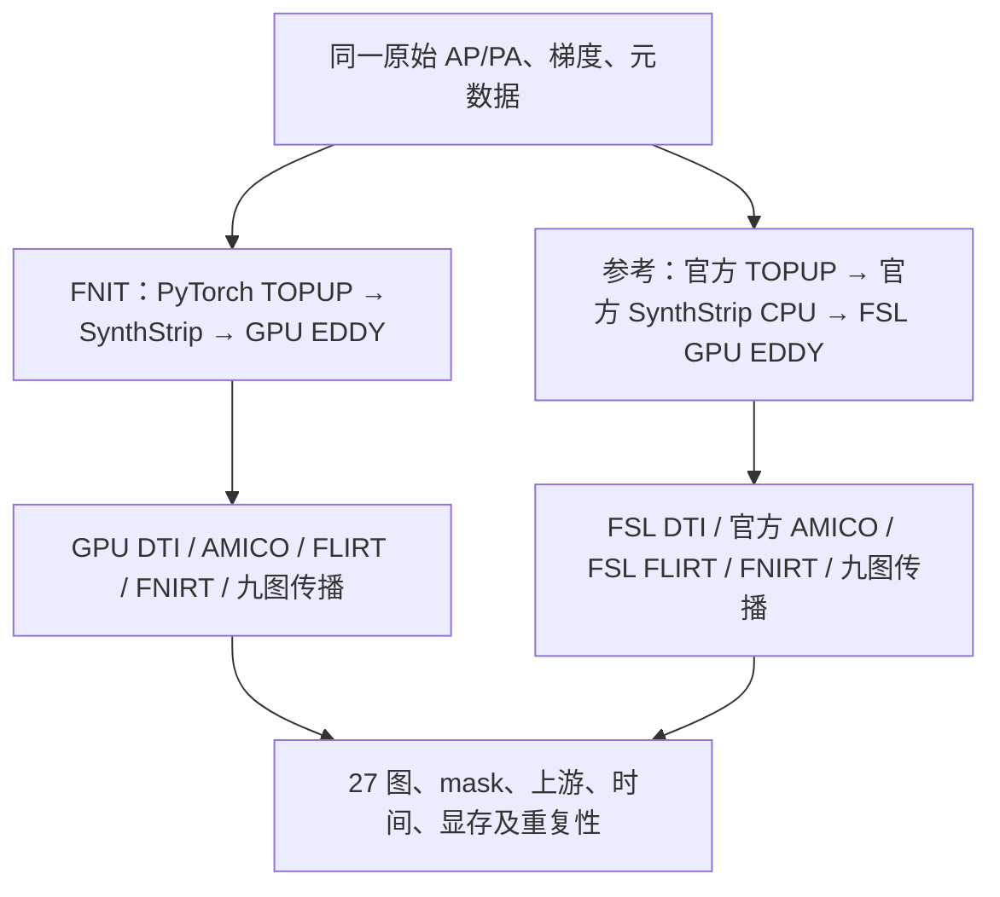
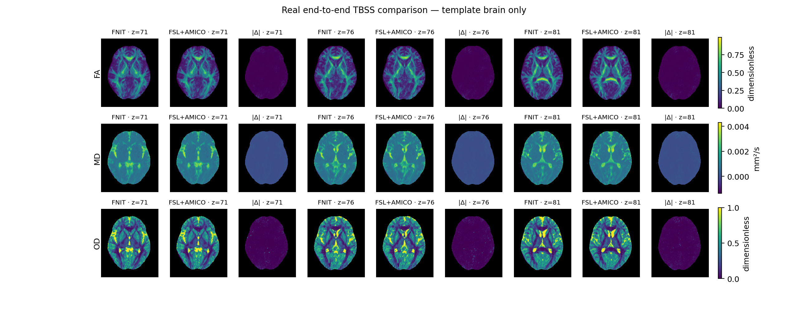

# DMRIPipeline：SynthStrip＋新版 TOPUP 的真实整链对照（2026-10-02）

[功能与调用](../../docs/dmri_pipeline/README.md) · [版本、计时与重复性 JSON](report.synthstrip_topup_20261002.public.json) · [27 图误差](comparison.synthstrip_topup_20261002.public.json) · [旧 BET 协议对照](comparison.historical_bet_20261002.public.json) · [上游差异](upstream.synthstrip_topup_20261002.public.json) · [TOPUP 隔离验收](../topup/README.md)

## 1. 本次改动与实测结果

本次将 FNIT 的 b0 阈值/形态学掩膜替换为项目成熟的 PyTorch SynthStrip；TOPUP 补齐原软件默认内部 regrid，并使用源码对应的联合场/运动 LM、固定运动 SCG、周期平滑和样条采样。运行时不调用 FSL 或 FreeSurfer，无新增依赖；标准 SynthStrip 权重由既有外部权重配置准备。

同一例真实原始 AP/PA，两套流程各自执行全部阶段，生成九张 native、九张 standard、九张 skeleton 图。新版 FNIT 处理时间 **404.74 s（6.75 分钟）**，独立参考链 **2055.53 s（34.26 分钟）**。两套流程的 27 对图均通过 shape、affine 及有限值检查；未设置事后数值通过阈值。

采用同一 SynthStrip 脑提取方法、两侧独立生成 mask 的参考协议：mask Dice **0.9999834**，标准空间九图 r **0.9880–0.9987**；native FA/MD r **0.999051/0.999642**。清理前后及合并最新 main 后的三次 FNIT 完整运行，其 27 张解码数组和 header binary block 分别完全一致；它们对应不同源码快照，时间分别保留，不能作为同一版本的三次计时取中位数。

另与保留的旧 FSL＋BET 参考链比较，标准空间九图 r 为 **0.8465–0.9597**。两种参考协议的掩膜不同，结果分别报告。当前输出仍非逐值相等，观察到的整链时间比不能称为数值等价流程的加速。

当前主要数字绑定最新 main 整合提交 `b3ccafe`：实际运行的 433 个 Python 源码文件 SHA-256 全部与该提交吻合。清理前、清理后及最新 main 整合的三次真实整链分别记录；后续只更新文档、报告和测试。



## 2. 输入、原软件和资源

一例真实 `104×104×72` 采集：AP 105 帧（5 b0、50 b1000、50 b2000），PA 6 帧（3 b0）。双方独立 b0 选择均选择第 0 帧，输入及 acqp/index 哈希和逐值检查见 JSON。无 T1w，运行默认 TBSS＋AMICO，分别使用各自 EDDY rotated bvec。

参考为 FSL 6.0.7.4、官方 Python AMICO 2.0.3、FreeSurfer 8.2 安装内的原版 SynthStrip 脚本及同 SHA 标准模型。SynthStrip 在安装提供的 8 线程 CPU Python 环境中运行；FNIT 使用 H100 GPU。参考的 mask 来自其自身 TOPUP 均值，FNIT 来自 FNIT 自产均值，没有借用参考 mask、场或校正 DWI。参考是 UKB 命令的明确适配链：原 T1 mask 改为 b0 SynthStrip、MCR AMICO 改为 Python AMICO、使用 rotated bvec、seed12345、不执行 GDC。

服务器为 gpucw1 / H100 PCIe。双方各 8 CPU 线程，参考固定 cores0–7，FNIT cores8–15；同一目标 GPU 的本任务计算串行，早期参考 CPU 配准与合并前 FNIT GPU 流程在不同 CPU 核上重叠；当前 main 整合复测在参考链完成后运行。输出位于同一节点私有 tmp 文件系统，raw 只读。未清空系统或 Triton 缓存；共享机器的时间为描述性观测。FNIT allocator 上限20,000,000,000 bytes，图像 float32、默认 TF32，TOPUP 沿用官方 double 系数/求解器与插值累加，不使用 FP16/BF16。

许可证、程序、模型、模板、输入和源码 SHA 见 JSON。FSL/FreeSurfer/AMICO 仅在独立验证侧使用；本次不发布它们的二进制、权重、模板或原始影像。

## 3. 端到端与分步骤时间

| 运行 | 处理 / s | 完整验证进程 / s | 退出码 |
| --- | --- | --- | --- |
| official_e2e | 2055.53 | 2073.54 | 0 |
| fnit_e2e | 516.305 | 521.75 | 0 |
| fnit_e2e_final（合并前清理版） | 499.547 | 503.37 | 0 |
| fnit_main_integrated（当前主结果） | 404.743 | 408.54 | 0 |

处理时间包含模型加载、预处理、计算和最终输出保存；进程时间另含导入、CUDA 初始化和验证审计。嵌套 TOPUP 事件已包含在准备阶段，不能重复相加。先期 FNIT 源码保留后来删除的非活跃 helper；当前比较使用实际 main 整合版的单次完整运行与已有独立参考单次。输入、官方环境和参考协议均保持相同，参考结果复用；每套流程自产中间影像，未把参考影像作为 FNIT 输入。观察到的处理时间比为 5.08；共享负载及源码版本不同，不能将与合并前 499.55 s 的时间变化全部归为某一项优化。

| 阶段 | FNIT / s | 参考 / s |
| --- | --- | --- |
| b0选择、TOPUP、mask及EDDY准备 | 12.8898 | 330.362 |
| 完整EDDY及保存 | 331.411 | 645.879 |
| shell读取/选择、DTIFIT及保存 | 13.1485 | 15.9075 |
| AMICO NODDI及保存 | 24.7769 | 35.0526 |
| FA预处理、FLIRT/FNIRT、九图传播及骨架 | 22.1405 | 1028.33 |

DTIFIT 使用 pipeline QC 的完整 shell 读取/选择口径；单独模型事件较短。原软件的详细 TOPUP、CPU SynthStrip、EDDY CUDA 与三阶段 FNIRT 计时均保存在报告。

最大 CUDA allocation **14.6515 GB**（13.6452 GiB），reserved **19.9817 GB**；计数保存各阶段峰值，包含模型驻留，不含 CUDA context 或其他进程。每5秒目标GPU总占用另记录，不能当作本进程峰值。

## 4. 最终九图精度

固定 ROI：native 为独立参考脑 mask；standard 为固定 FA 模板脑区；skeleton 为固定模板骨架。下面保留整个固定 ROI，未按 FNIT 结果筛选通过体素。MD/L1/L2/L3 单位 mm²/s，其余无量纲；逐图最大差值、非零支持 Dice、qform/sform/dtype/scaling 另见完整 JSON。

### 原空间

| 图 | r | MAE | RMSE | P95 | 最大绝对误差 |
| --- | --- | --- | --- | --- | --- |
| FA | 0.999051 | 0.00351805 | 0.00792432 | 0.00977573 | 0.523374 |
| MD | 0.999642 | 8.33582e-06 | 1.80561e-05 | 2.85919e-05 | 0.00235414 |
| L1 | 0.999493 | 1.03247e-05 | 2.17238e-05 | 3.34535e-05 | 0.00262665 |
| L2 | 0.999607 | 9.36427e-06 | 1.95352e-05 | 3.1147e-05 | 0.00238193 |
| L3 | 0.999659 | 8.98126e-06 | 1.81184e-05 | 3.00403e-05 | 0.00205383 |
| MO | 0.988364 | 0.048836 | 0.0896903 | 0.185623 | 1.55131 |
| ICVF | 0.981587 | 0.0139988 | 0.0404761 | 0.0622408 | 0.99 |
| OD | 0.989639 | 0.0107112 | 0.0370143 | 0.0370149 | 0.97 |
| ISOVF | 0.997946 | 0.00999824 | 0.0216944 | 0.0456606 | 0.909338 |

### 标准空间

| 图 | r | MAE | RMSE | P95 | 最大绝对误差 |
| --- | --- | --- | --- | --- | --- |
| FA | 0.99854 | 0.0045607 | 0.00934938 | 0.0153994 | 0.341859 |
| MD | 0.998618 | 1.54352e-05 | 3.16113e-05 | 6.02376e-05 | 0.00122223 |
| L1 | 0.998488 | 1.70898e-05 | 3.38923e-05 | 6.4096e-05 | 0.00124733 |
| L2 | 0.998618 | 1.62532e-05 | 3.25174e-05 | 6.21733e-05 | 0.00123927 |
| L3 | 0.998676 | 1.58774e-05 | 3.13931e-05 | 6.04285e-05 | 0.0011807 |
| MO | 0.988013 | 0.040257 | 0.0648646 | 0.135905 | 1.42345 |
| ICVF | 0.990119 | 0.0127208 | 0.0248673 | 0.0465019 | 0.864606 |
| OD | 0.994896 | 0.0105962 | 0.0222097 | 0.0365906 | 0.837077 |
| ISOVF | 0.997437 | 0.0112933 | 0.0205325 | 0.0430566 | 0.400859 |

### 骨架

| 图 | r | MAE | RMSE | P95 | 最大绝对误差 |
| --- | --- | --- | --- | --- | --- |
| FA | 0.99896 | 0.00438965 | 0.00856511 | 0.0146851 | 0.206169 |
| MD | 0.994134 | 7.65747e-06 | 3.22108e-05 | 2.77526e-05 | 0.00282352 |
| L1 | 0.99525 | 9.51618e-06 | 3.68783e-05 | 3.23466e-05 | 0.00340493 |
| L2 | 0.994898 | 8.56811e-06 | 3.24396e-05 | 3.00039e-05 | 0.00259916 |
| L3 | 0.995416 | 8.53931e-06 | 2.98209e-05 | 3.09712e-05 | 0.00246645 |
| MO | 0.995118 | 0.0238921 | 0.0449194 | 0.0896748 | 0.93829 |
| ICVF | 0.993251 | 0.00729875 | 0.0165898 | 0.023753 | 0.982031 |
| OD | 0.995517 | 0.00626594 | 0.0158412 | 0.0227397 | 0.999744 |
| ISOVF | 0.994224 | 0.00672652 | 0.0148523 | 0.0227516 | 0.999858 |

### 旧 BET 协议比较

旧参考使用独立 TOPUP→BET `-f0.2`→官方 GPU EDDY。它与本次 SynthStrip 参考的区别是真实处理方法差异；它是之前完成的同输入参考，当前 FNIT 重新生成全部输出再对照。

| 图 | native固定BET ROI r | standard固定模板 r | skeleton固定模板 r |
| --- | --- | --- | --- |
| FA | 0.754149 | 0.959704 | 0.965032 |
| MD | 0.835684 | 0.931298 | 0.818371 |
| L1 | 0.777863 | 0.927897 | 0.854767 |
| L2 | 0.842918 | 0.932962 | 0.843555 |
| L3 | 0.867597 | 0.934002 | 0.858876 |
| MO | 0.935956 | 0.867477 | 0.922928 |
| ICVF | 0.50885 | 0.846458 | 0.853182 |
| OD | 0.778334 | 0.909921 | 0.900084 |
| ISOVF | 0.905283 | 0.931086 | 0.867509 |

## 5. 上游与残余误差

| 检查 | 数值 |
| --- | --- |
| 独立SynthStrip mask Dice | 0.999983 |
| 完整EDDY固定参考脑区 r | 0.999764 |
| 完整EDDY固定参考脑区 RMSE | 43.0074 |
| 旋转梯度平均/最大角差（度） | 0.0558504 / 0.121461 |
| FLIRT九物理点 RMS差（mm） | 0.247933 |

TOPUP 同输入隔离验收的固定信号区场 RMSE 从历史版7.320009Hz降到0.010799Hz；固定原软件脑区 iout r0.99999656、RMSE12.8493。固定官方保存参数的渲染 iout RMSE0.011135，初始cost/解析梯度近似源码结果；因此当前大部分 iout 残差位于参数估计阶段。脑内两侧 iout 非零支持完全相同，残差并非由脑外7个支持差异解释。完整字段、极值与参数落盘边界见 TOPUP 专项报告。

native MO/ICVF/OD 及 EDDY 强度仍有差异，传播后仍非逐点一致。FLIRT九点RMS比较两套自产FA输入，不是冻结同一FA时的算法误差，也不是全脑rmsdiff。历史0.419–0.810结果和本次使用不同upstream/mask协议，不能把差值全部归因于某一个子函数。

旧版FNIT阈值mask和近似TOPUP的处理时间不能当成同等精度基线；当前速度收益与准确度须同时阅读。此轮没有增加新的MMORF或classic NODDI整链原软件对照。

## 6. 脑图与复现



图仅显示标准空间模板脑内标量。每图三列使用共同数值标尺，细小残差由上面的逐图误差量化。

```bash
# 两套新输出目录；函数/原软件完整输入参数见功能页。
python validation/dmri_pipeline/benchmark_end_to_end.py \
  --raw-dir "$raw_dwi_directory" --output-dir "$fnit_output_directory" \
  --fa-template "$standard_fa_template" --fa-skeleton "$standard_fa_skeleton" \
  --synthstrip-weights "$synthstrip_weight_file" --device cuda:0 \
  --threads 8 --eddy-gp-seed 12345 --memory-limit-bytes 20000000000 \
  --source-commit "$tested_source_commit" --report "$fnit_measurement_json"
# 参考driver显式选 --brain-extractor synthstrip；原软件命令与全部参数见功能页。
python validation/dmri_pipeline/compare_end_to_end.py \
  --fnit-root "$fnit_output_directory" --reference-root "$reference_output_directory" \
  --fa-reference "$standard_fa_template" --fa-skeleton "$standard_fa_skeleton" \
  --output "$anonymous_comparison_json" --figure "$brain_comparison_png"
```

## 7. 更新与参考

- 2026-10-02 本版：PyTorch SynthStrip mask、TOPUP源码路径与融合采样、27图真实整链及旧BET协议补充比较；104项回归通过。
- 同日历史：[阈值mask＋L-BFGS TOPUP整链](end_to_end_20261002.md)，保留原实际版本与失败数值。
- 原代码、引用、资源许可：[DMRIPipeline说明](../../docs/dmri_pipeline/README.md#参考文献与原实现)、[TOPUP说明](../../docs/topup/README.md)、[SynthStrip说明](../../docs/synthstrip/README.md)。
