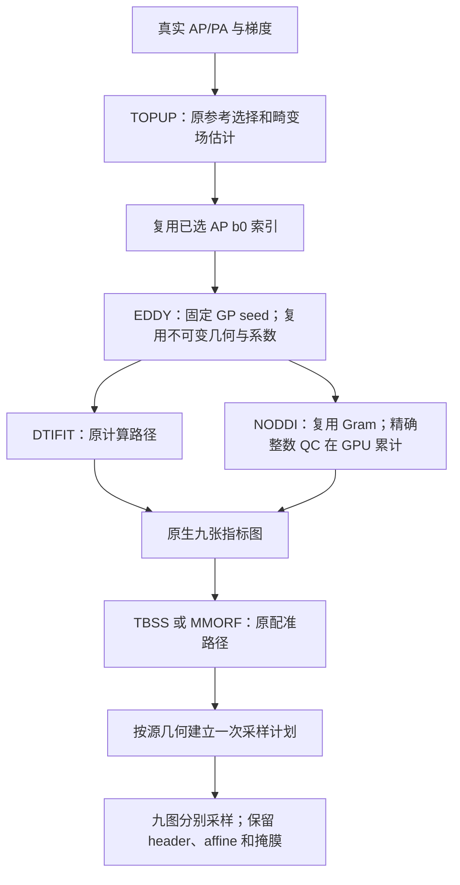

# DMRIPipeline：保持输出不变的优化（2026-10-02）

[功能与完整调用](../../docs/dmri_pipeline/README.md) · [机器可读报告](report.lossless_20261002.public.json) · [九图传播细节](map_propagation_20261002.md)

> 本页是相对冻结 FNIT 的组件优化验收。随后已完成同 raw AP/PA 的完整 FNIT/独立 FSL＋AMICO 各两轮复测，见[最新整链报告](end_to_end_20261002.md)。两份报告分别记录组件输出保持不变、整链对原软件误差。

## 1. 改了什么

本版以 FNIT `954ad19e29ddde8617eddf58ebafc3a4f72b8951` 为基线，减少重复计算、图像读取和 GPU→CPU 同步。验收目标是同输入下保持改动前 FNIT 的输出。原有与 FSL、AMICO 的数值差异继续按[历史对照](README.md)判读。



| 组件 | 本版改动 | 保持的计算规则 |
|---|---|---|
| TOPUP→EDDY 准备 | 传递已选 `ap_index`，避免重复配准 b0 和读取 AP | 原 b0 选择规则、脑掩膜、index/acqparams |
| EDDY | bool mask 一次复制到 CPU；缓存网格、quadratic EC basis、PE axis、固定 susceptibility padding；每次 GN 更新内复用 prediction padding | glibc 随机序列、GP 采样顺序、八轮优化、差分、异常体积替换和重拟合 |
| AMICO NODDI | 第一/第三次 NNLS 共用同一完整 Gram；linear 每次按原矩阵形状重新计算；复用同一次失败检查 | 原 float64 求解、活动集、CG 回退、KKT 容差、LUT batch=400 |
| 经典 NODDI | 接受更新数用 GPU int64 累计，最后读取 | 原连续 Watson 拟合、初始化、损失与接受判断 |
| ApplyWarp/MMORF 传播 | 按精确源几何分组，复用固定 grid，每图仍独立采样 | 原插值/精度、通道顺序、输出 dtype/header、TBSS FA 与 skeleton 掩膜 |

变换或源几何改变时建立新计划。EDDY 的工作图、异常体积替换后的预测和 GP 拟合结果不会跨更新复用。本版没有新增运行依赖，没有调用原软件可执行程序。

## 2. 真实数据与验收方法

在 gpucw1 的共享 H100 PCIe 上运行，Python 3.11.16、PyTorch 2.5.1、NumPy 1.26.4、nibabel 5.4.2；CPU 线程为 8，CUDA allocator 限额为 **20,000,000,000 字节**。保留原来的 TF32/float32 路径及 float64 求解/几何例外，没有改用 FP16/BF16。该限额不包括其他进程和 CUDA 上下文开销。

- EDDY：真实 104×104×72×105 DWI，242,316 个掩膜体素，5 个 b0、50 个 b1000、50 个 b2000；固定 `gp_seed=12345`、`ref_scan_no=0`，完整八轮。
- NODDI：同来源的全脑校正 DWI，242,261 个掩膜体素，分别运行 AMICO 和经典模式。每种条件独立进程运行两次，顺序为基线→候选→候选→基线。
- 九图传播：读取已保存的真实 native FA、MD、L1、L2、L3、MO、ICVF、OD、ISOVF 和固定 warp；两分支均输出到 182×218×182 的 1 mm 网格。逐次调用对照，不重新估计配准。
- 准备阶段：实际执行 TOPUP 的 AP/PA b0 选择一次，再交替测量原 EDDY 准备与复用索引的准备，各三次。

输入文件大小、SHA-256、源码 SHA-256、逐次时间和 GPU 状态均在机器报告中。本次本地优化候选与远端最终候选的 **428 个 Python 文件**逐一核对，哈希全部相同。合入最新 main 后，发布代码中的 **40 个相关 dMRI Python 文件**再次与该候选核对，全部相同；其他模块更新不属于此 428 文件快照。影像和个人信息留在计算节点，仓库保存汇总数值与哈希。

验收直接比较未四舍五入的数组 SHA-256，以及完整 NIfTI header/extensions、affine、shape、dtype 和保存的 sidecar。模型 QC 排除耗时与显存字段后必须相同；计时和显存本身保留用于比较。本例保存的压缩 NIfTI 文件也逐字节相同。

## 3. 精度与耗时

下表中的 GB 按十进制字节计算。共享 GPU 的其他任务在运行期间变化，逐次值比单个速度比更能反映本次结果。

| 阶段 | 基线 / 本版时间（秒） | 精度结果 | 本版峰值 allocation |
|---|---|---|---:|
| EDDY 完整八轮，包含读写 | 484.75 / 404.31，一次配对观察，耗时低 16.6% | 校正图、旋转 bvec、运动参数/RMS、三类 outlier 数组和文本报告全部精确相同 | 4.89 GB |
| EDDY 准备，复用 TOPUP 索引 | 三次中位数 6.991 / 0.153 | 参考索引、mask/header/affine、index 及其余输入相同 | 未单独记录 |
| AMICO NODDI 全脑，包含读写 | 两次中位数 30.77 / 27.45；范围 27.74–33.80 / 22.14–32.76 | 五张输出与模型 QC 相同 | 10.02 GB |
| 经典 NODDI 全脑，包含读写 | 两次中位数 68.15 / 79.81；范围 62.00–74.30 / 69.52–90.09 | 五张输出与模型 QC 相同，接受更新数均 3,710,053 | 10.02 GB |
| TBSS 固定 warp 九图传播 | 后两轮 warm 中位数 0.366 / 0.181，约 2.02 倍 | 九张 standard/skeleton 图、valid mask、header/affine 相同 | 1.97 GB |
| MMORF 固定 warp 九图传播 | 后两轮 warm 中位数 0.517 / 0.270，约 1.91 倍 | 九张图、header/affine 相同 | 0.99 GB |

EDDY 的基线峰值为 4.84 GB。Gram-only NODDI 的基线/本版峰值 allocation 为 9.953/10.020 GB，reserved 为 19.386/19.508 GB；双方每次均记录 3 次 allocator retry、0 次 allocator OOM。固定 warp 的传播计时包括计划准备、九次独立采样及返回 CPU，不包括读取输入、FA 预处理、输出写盘或配准估计。三轮原始时间见[九图报告](map_propagation_20261002.md)。

AMICO 的中位数有所降低，但两组范围重叠，尚不能给出稳定提速结论。**经典 NODDI 的整体计时本次没有改善**。另以固定、未舍入的 AMICO 初始化单独测量经典 refinement：原逐轮主机 QC 读取为 38.65、58.08 秒，GPU 累计为 38.49、38.69 秒，所有参数数组和 QC 相同。前三次接近，末次主机计时明显较高，原因未隔离。这项诊断支持减少同步没有数值回归；共享 GPU 上不据此声明算法加速。

### 未采用的缓存方案

完整 Gram+linear-product 缓存的 AMICO 基线为 28.60、27.38 秒，候选为 30.90、49.84 秒；峰值 allocation 从 9.953 增至 10.373 GB。该方案虽输出相同，却增加约 421 MB 活跃显存且未获得可靠收益，已从最终生产代码移除。最终只复用 Gram，不扩大 LUT batch 或更改 solver 精度。

### 本次验证覆盖

- EDDY 全部八类数值输出、保存图像及文本 sidecar：精确相同。
- 两种 NODDI 的 NDI、ODI、FWF、方向及 RMSE，完整全脑：精确相同。
- 两分支固定 warp 的九图传播：精确相同；另有 CPU/CUDA 共 56 组冻结原采样源码对照。
- 组件组合测试：175 passed、2 skipped（缺少外部 FSL applywarp 的测试跳过）；最终 Gram-only 修订后另跑 NODDI 25 项测试，全通过。
- Pipeline 的 GP seed、参考索引复用及按几何分组计划接入由集成测试覆盖。

本组件验收当时没有执行完整 raw-to-MNI，也没有合并阶段计时估算整链时间。后续[完整复测](end_to_end_20261002.md)已经从相同 raw 重跑 FNIT 和独立参考；历史记录继续见[验证索引](README.md)。

## 4. 复现

先用项目主页的 Conda 环境安装 FNIT。基线和候选使用同一个 Python 环境，以不同 `PYTHONPATH` 加载冻结源码；输入和既有 TOPUP 输出保持不变。下面的路径是示例变量，不包含数据。

```bash
# 在项目根目录导出本次冻结基线；使用空目录，避免覆盖工作树。
mkdir -p benchmark_baseline
git archive 954ad19e29ddde8617eddf58ebafc3a4f72b8951 src | tar -x -C benchmark_baseline

# RAW_DIR 包含 AP.nii.gz、AP.bval、AP.bvec；PREP_DIR 含 eddy/ 和 topup/。
export CUDA_VISIBLE_DEVICES=1
export OMP_NUM_THREADS=8 OPENBLAS_NUM_THREADS=8 MKL_NUM_THREADS=8
RAW_DIR=/data/private/raw
PREP_DIR=/data/private/prepared
NODDI_DIR=/data/private/noddi_inputs

PYTHONPATH=benchmark_baseline/src python validation/dmri_pipeline/benchmark_lossless.py \
  --stage eddy --input-dir "$RAW_DIR" --eddy-preparation-dir "$PREP_DIR" \
  --output-dir benchmark_old_eddy --device cuda:0 --seed 12345 \
  --threads 8 --memory-limit-bytes 20000000000
PYTHONPATH=src python validation/dmri_pipeline/benchmark_lossless.py \
  --stage eddy --input-dir "$RAW_DIR" --eddy-preparation-dir "$PREP_DIR" \
  --output-dir benchmark_new_eddy --device cuda:0 --seed 12345 \
  --threads 8 --memory-limit-bytes 20000000000
PYTHONPATH=src python validation/dmri_pipeline/compare_lossless.py \
  --baseline benchmark_old_eddy --candidate benchmark_new_eddy --output eddy_compare.json

# 改用 --stage classic 即测量经典 NODDI；两条件交替执行，并各重复两次。
PYTHONPATH=src python validation/dmri_pipeline/benchmark_lossless.py \
  --stage amico --input-dir "$NODDI_DIR" --output-dir benchmark_new_amico \
  --device cuda:0 --threads 8 --memory-limit-bytes 20000000000
```

`benchmark_lossless.py` 的输出目录必须尚不存在，避免覆盖先前记录。

| 参数 | 输入与含义 |
|---|---|
| `--stage` | `eddy`、`amico` 或 `classic`，选择完整组件 |
| `--input-dir` | EDDY 读取 `AP.nii.gz/AP.bval/AP.bvec`；NODDI 读取 `DWI.nii.gz/mask.nii.gz/bvals/bvecs` |
| `--eddy-preparation-dir` | EDDY 必需，读取 `eddy/nodif_brain_mask.nii.gz`、`eddy/eddy_index.txt`、`topup/acqparams.txt`、`topup/fieldmap_out*` |
| `--output-dir` | 新目录；保存组件图像/sidecar 和 `benchmark.json` |
| `--device` | 可见 CUDA 设备，默认 `cuda:0` |
| `--seed` | EDDY 固定 GP seed，默认 12345；NODDI 不使用该参数 |
| `--threads` | PyTorch CPU 线程，默认 8；BLAS 线程另用环境变量设置 |
| `--memory-limit-bytes` | 每进程 CUDA allocator 上限，默认 20,000,000,000 字节 |
| 对照的 `--baseline/--candidate/--output` | 两份含 `benchmark.json` 和组件输出的目录，以及新 JSON 文件路径；不修改影像 |

九图复现的命令和全部参数见[专页](map_propagation_20261002.md)。另外两个诊断入口如下：

```bash
PYTHONPATH=src python validation/dmri_pipeline/benchmark_preparation.py \
  --raw-dir "$RAW_DIR" --topup-dir "$PREP_DIR/topup" \
  --output-dir benchmark_preparation --device cuda:0 --repeats 3
PYTHONPATH=src python validation/amico_noddi/benchmark_classic_qc.py \
  --input-dir "$NODDI_DIR" --output classic_qc.json
```

准备诊断的 `--raw-dir` 必须提供 `AP.nii.gz/AP.bval/AP.bvec/AP.json` 和 `PA.nii.gz/PA.bval/PA.json`，JSON 含相位编码与读出时间；`--topup-dir` 是同采集的既有 TOPUP 输出，`--output-dir` 为新诊断目录，`--repeats` 控制每条件次数，默认 3。经典 QC 诊断的 `--input-dir` 同 NODDI，`--output` 保存 JSON；固定 `cuda:0`、8 线程、20 GB allocator 限额，AMICO 初始化和读图不计入 refinement 的四次 ABBA 时间。

上述脚本只执行 FNIT 和读取现有资源。原软件命令、参考文献及原实现代码库继续在 [EDDY](../../docs/eddy/README.md)、[NODDI](../../docs/amico_noddi/README.md)、[ApplyWarp](../../docs/applywarp/README.md)、[MMORF](../../docs/mmorf/README.md)和[Pipeline](../../docs/dmri_pipeline/README.md)功能页维护。

## 5. 后续工作与更新记录

| 日期 | 更新与验收 |
|---|---|
| 2026-10-02 | 本版不可变缓存、采样计划、参考索引复用、固定 GP seed；完整组件真实数据逐值验收；未采用完整 NODDI 乘积缓存 |
| 2026-09-29 至 10-01 | BIDS 输入、经典 NODDI 接入、TBSS/MMORF 分支的真实阶段和整链记录；各自输入/计时范围保留于[索引](README.md) |

同 raw 的最新完整 raw-to-MNI 对照现已完成，见[整链报告](end_to_end_20261002.md)。后续优先做独占或低负载 GPU 上的重复 NODDI 计时，再决定是否调整活动集调度。现有奇数 z 维输入还存在边界问题：TOPUP 会裁掉末片，而原 AP 仍保留全部切片，传给 EDDY 的 mask 可能形状不匹配。本次 72 片输入不受影响；修复需对实际奇数片数据核对裁剪、padding 和 affine，本版未改变掩膜规则。

原软件的 EDDY、FNIRT、AMICO 数值差异也仍需分别解决。当前结果证明本版改动保持原 FNIT 输出，不能据此宣布整个流程已与原软件等价。
