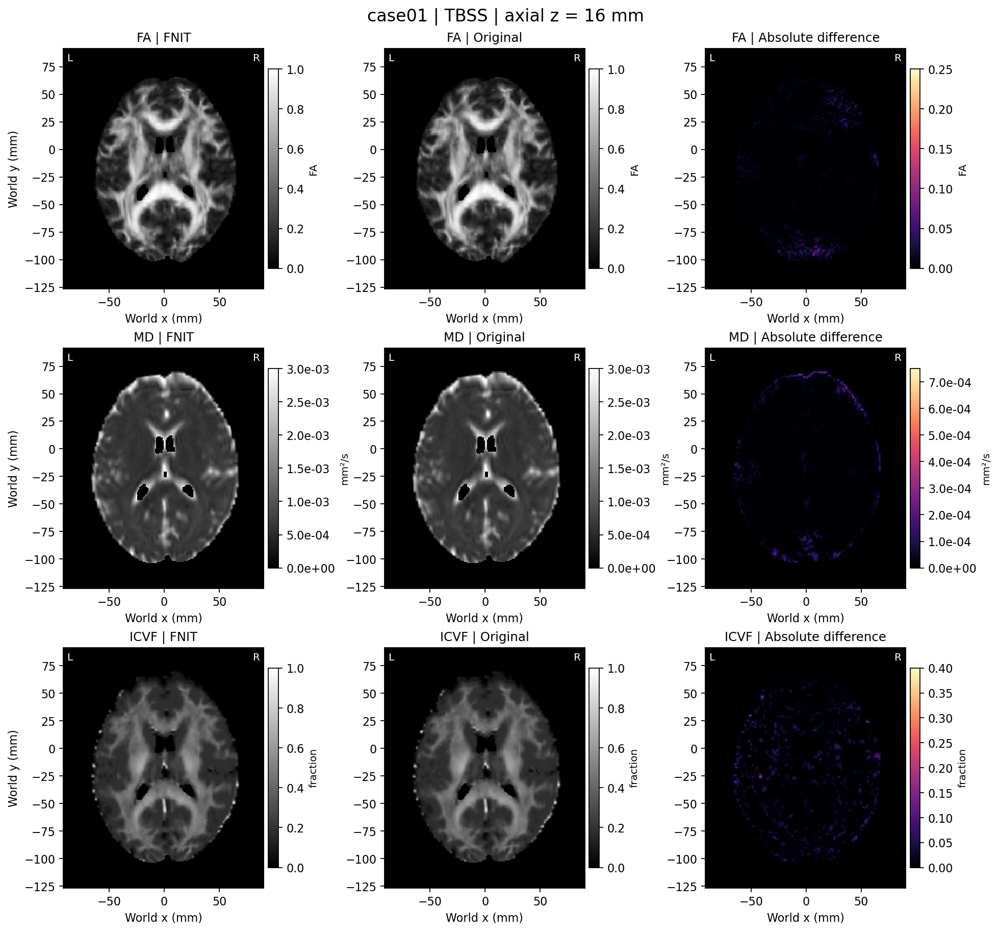
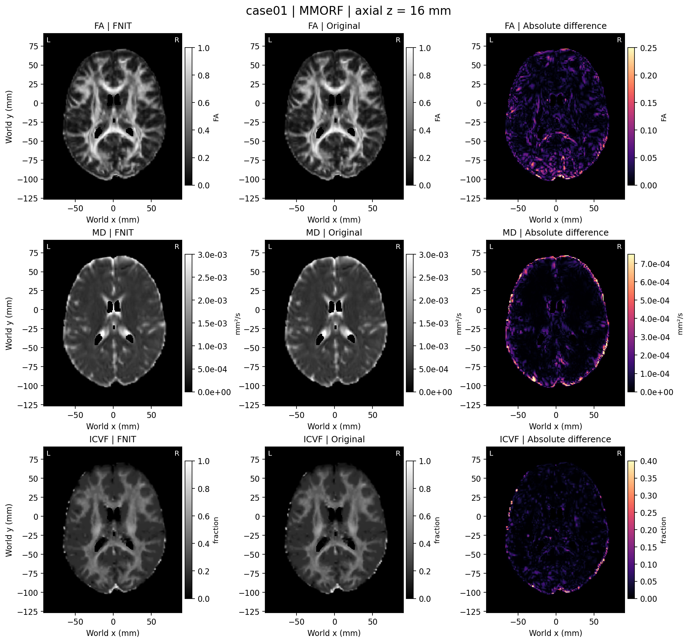
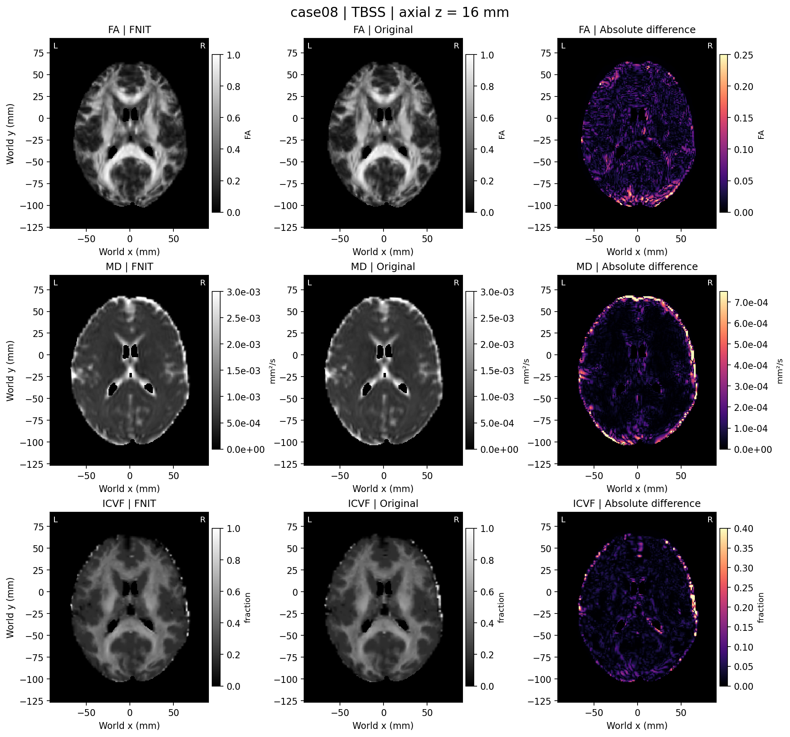

# 公开十人 DMRIPipeline 精度审查：已完成的 19 对

## 数据与完成范围

本页记录 2026-10-03 的最终 **19/20 配对**结果：TBSS 为 **10/10**，MMORF 为 **9/10**。全部 20 个 FNIT 主运行成功；case05、case10 TBSS 的原参考已完整恢复。case10 MMORF 的原参考在初次运行与两次从 raw 完整恢复中均在 GPU EDDY 阶段报 CUDA 分配失败，尚无成功整链输出。初次 EDDY 子程序已运行约 `1718.810 s`；两次恢复在约 `5.7 s` 时快速失败，不能统一称为启动期失败。20 个位置完整保留，结果不记作 20 对完成。

数据为 OpenNeuro ds003138 v1.0.1 的固定十人、ses-1；每人完整 117 帧 AP DWI、shell 1 PA b0 和配对 T1。两侧各自从相同原始输入运行，原始输入、模板、SynthStrip 权重和 EDDY seed 的 SHA-256/参数绑定均匹配。原始文件相同不保证流程中间选择出的影像相同：case02/08 实际送入 TOPUP 的 AP/PA b0 对不同，需与场求解差异分开检查。筛选和流程见 [DATASET.md](DATASET.md)、[PROTOCOL.md](PROTOCOL.md)。

本次 FNIT 实际运行版本是冻结提交 `bf339a0368a7711d2c6ca3477c8d7dc1fc17e75a`，433 个运行时 Python 文件清单 SHA-256 为 `f13a40989b96d9e3608a427a1fe10d1960b20f146c768a3dd101f84fe4deae1e`，逐项匹配该 Git 树，见[源码绑定](source_binding_memoryfix.public.json)。后续 main 的变化不能改标为这次运行版本。旧 case01 两次成功和旧 case02 内存失败另存为历史记录，不计入新候选精度或时间比。

19 个比较报告共 **432 张指标图**通过形状、affine 和有限值检查，**没有一张图在主要 ROI 中逐值相等**。450 行汇总中的其余 18 行是 case10 MMORF 失败参考的缺失位置，不能当作已完成指标。[aggregate.final.json](summary/aggregate.final.json) 的状态为 `incomplete`，[RESULTS.md](summary/RESULTS.md) 保留未完成标识；格式通过不表示数值等价。[独立终审](independent_final_audit.public.json)核对了全部绑定、失败记录、432 图统计及四张脑图，旧 17 对的 756 个影像哈希和后来完成的 19 对统计均保持原值。

## 指标、空间与统计定义

每例比较九张 native 图：FA、MD、L1、L2、L3、MO、ICVF、OD、ISOVF；另比较九张标准空间图，TBSS 再比较九张 skeleton 图。每个 TBSS 应有 27 对、MMORF 应有 18 对，逐例数据见 [comparisons/](comparisons/)，完整逐图表见 [map_metrics.csv](summary/map_metrics.csv)。

- **Native**：在独立原软件的 EDDY 脑掩膜 `>0.5` 内比较，反映上游校正、掩膜、旋转梯度和模型拟合的共同影响。
- **Standard**：在固定 MNI152 T1 brain 1 mm 的非零模板 ROI 内比较；两侧在 ROI 中的零值也参与统计。
- **Skeleton**：固定模板 ROI 与原 skeleton 数值 `>=2000` 的交集。
- `r` 为逐体素 Pearson 相关；`MAE` 为平均绝对差。`nRMSE = sqrt(mean((FNIT−原软件)²)) / sqrt(mean(原软件²))`，表示差值 RMS 相对该原参考图 RMS 的大小，不是逐体素百分误差，也不是 `1−r`。
- 非零支持 Dice 仅比较两侧 `值!=0` 的位置；共同非零 ROI 另作补充，不能替代含零的主要 ROI。

以下数字均为**逐病例指标的中位数**，不是合并全部体素后的统计。TBSS 与 MMORF 的 native 中位数来自不同的 10/9 人集合；九个共同病例的全部九张 native 图，两侧文件 SHA-256 和主要 ROI 统计在两分支完全相同。因此不能把 native 中位数的差异解释为配准分支的影响。

## 九指标精度摘要

| 分支 | 空间 | 指标 | n/10 | r | MAE | nRMSE | 非零支持 Dice |
|---|---|---|---:|---:|---:|---:|---:|
| TBSS | native | FA | 10/10 | 0.990968 | 0.010945 | 0.0747913 | 0.999983 |
| TBSS | native | MD | 10/10 | 0.994181 | 2.56428e-05 | 0.0590303 | 0.999983 |
| TBSS | native | L1 | 10/10 | 0.989229 | 3.88676e-05 | 0.0744337 | 0.999983 |
| TBSS | native | L2 | 10/10 | 0.993313 | 2.78981e-05 | 0.0657533 | 0.999983 |
| TBSS | native | L3 | 10/10 | 0.995755 | 2.20386e-05 | 0.0584333 | 0.999983 |
| TBSS | native | MO | 10/10 | 0.965409 | 0.0799952 | 0.236128 | 0.999981 |
| TBSS | native | ICVF | 10/10 | 0.957896 | 0.0137746 | 0.164918 | 0.997093 |
| TBSS | native | OD | 10/10 | 0.944893 | 0.0289826 | 0.170685 | 0.999983 |
| TBSS | native | ISOVF | 10/10 | 0.988895 | 0.00865185 | 0.133699 | 0.970224 |
| TBSS | standard | FA | 10/10 | 0.995808 | 0.0104377 | 0.060759 | 0.998191 |
| TBSS | standard | MD | 10/10 | 0.985803 | 4.48089e-05 | 0.0931021 | 0.995992 |
| TBSS | standard | L1 | 10/10 | 0.982638 | 5.79407e-05 | 0.0948355 | 0.995992 |
| TBSS | standard | L2 | 10/10 | 0.985829 | 4.52004e-05 | 0.0963873 | 0.995992 |
| TBSS | standard | L3 | 10/10 | 0.987602 | 3.94715e-05 | 0.0998423 | 0.995992 |
| TBSS | standard | MO | 10/10 | 0.948214 | 0.0756958 | 0.272349 | 0.995993 |
| TBSS | standard | ICVF | 10/10 | 0.966785 | 0.015432 | 0.137964 | 0.993494 |
| TBSS | standard | OD | 10/10 | 0.968656 | 0.0236236 | 0.129653 | 0.995992 |
| TBSS | standard | ISOVF | 10/10 | 0.981906 | 0.015535 | 0.171338 | 0.944662 |
| TBSS | skeleton | FA | 10/10 | 0.993825 | 0.0133509 | 0.0415246 | 0.999709 |
| TBSS | skeleton | MD | 10/10 | 0.975664 | 1.54044e-05 | 0.063144 | 0.999709 |
| TBSS | skeleton | L1 | 10/10 | 0.980847 | 2.4576e-05 | 0.0524466 | 0.999709 |
| TBSS | skeleton | L2 | 10/10 | 0.981689 | 1.8331e-05 | 0.0735347 | 0.999709 |
| TBSS | skeleton | L3 | 10/10 | 0.986214 | 1.72668e-05 | 0.096978 | 0.999709 |
| TBSS | skeleton | MO | 10/10 | 0.971039 | 0.057691 | 0.178153 | 0.999709 |
| TBSS | skeleton | ICVF | 10/10 | 0.983374 | 0.0118638 | 0.0567783 | 0.999577 |
| TBSS | skeleton | OD | 10/10 | 0.977944 | 0.0138563 | 0.099156 | 0.999709 |
| TBSS | skeleton | ISOVF | 10/10 | 0.982699 | 0.00278457 | 0.183619 | 0.91068 |
| MMORF | native | FA | 9/10 | 0.987381 | 0.00855975 | 0.0916446 | 0.999982 |
| MMORF | native | MD | 9/10 | 0.991794 | 2.57127e-05 | 0.0710152 | 0.999982 |
| MMORF | native | L1 | 9/10 | 0.985031 | 3.73322e-05 | 0.0890004 | 0.999982 |
| MMORF | native | L2 | 9/10 | 0.990725 | 2.69512e-05 | 0.0782196 | 0.999982 |
| MMORF | native | L3 | 9/10 | 0.994061 | 2.08598e-05 | 0.0694834 | 0.999982 |
| MMORF | native | MO | 9/10 | 0.980141 | 0.0527454 | 0.182474 | 0.999982 |
| MMORF | native | ICVF | 9/10 | 0.94764 | 0.0138361 | 0.18831 | 0.996101 |
| MMORF | native | OD | 9/10 | 0.937088 | 0.0314152 | 0.187595 | 0.999982 |
| MMORF | native | ISOVF | 9/10 | 0.985886 | 0.00846426 | 0.15096 | 0.970123 |
| MMORF | standard | FA | 9/10 | 0.929447 | 0.0449483 | 0.217009 | 0.990047 |
| MMORF | standard | MD | 9/10 | 0.919573 | 0.000109585 | 0.227904 | 0.990047 |
| MMORF | standard | L1 | 9/10 | 0.919014 | 0.000143 | 0.225338 | 0.990047 |
| MMORF | standard | L2 | 9/10 | 0.918088 | 0.000112198 | 0.239391 | 0.990047 |
| MMORF | standard | L3 | 9/10 | 0.920181 | 0.000100522 | 0.264892 | 0.990047 |
| MMORF | standard | MO | 9/10 | 0.771097 | 0.17505 | 0.593847 | 0.990047 |
| MMORF | standard | ICVF | 9/10 | 0.926224 | 0.0307425 | 0.220392 | 0.986771 |
| MMORF | standard | OD | 9/10 | 0.897591 | 0.0554324 | 0.246855 | 0.990047 |
| MMORF | standard | ISOVF | 9/10 | 0.911563 | 0.0352426 | 0.386923 | 0.871315 |

TBSS 标准空间 FA 的中位 `r=0.995808245`、`nRMSE=0.060759006`；MMORF 为 `r=0.929446724`、`nRMSE=0.217009355`。MMORF 标准空间 MO 的 `r=0.771096741`、`nRMSE=0.593847226`，是需要突出说明的偏差，不能只列 FA/MD 的较高相关。该对照没有事先定义逐点等价容差，因此这些数字说明实测差异，不构成等价验收。

### 零值支持与脑掩膜的含义不同

脑掩膜 Dice 中位为 TBSS `0.999965771`、MMORF `0.999964177`；MMORF T1 掩膜为 `0.999988272`。这些数值表明大多数脑提取范围接近，却不能保证掩膜内部校正信号和模型参数相同。

ISOVF 是连续的自由水体积分数；NNLS 可产生大量精确零值。其非零支持 Dice 中位为 MMORF 标准空间 `0.871315336`、TBSS skeleton `0.910680243`。这反映零/非零参数支撑的差异，应结合 MAE、nRMSE 和位置查看，不能当作脑掩膜 Dice，也不能直接解释为整张指标图缺失。当前可比较图中没有全零或常数图。

## 误差在配准之前已经出现

两条分支均将**各自 TOPUP 校正后的 AP/PA 两张 b0 平均图**送入 SynthStrip：FNIT 使用项目 PyTorch GPU 实现，参考使用原 SynthStrip CPU 命令，模型权重相同。平均图的定义相同，但两侧实际 voxel 值未必相同；T1 SynthStrip 另读取原始 T1。这应与“使用不同模态提取 dMRI 掩膜”区分。

[case08 TBSS](comparisons/case08_tbss.json) 与 [case08 MMORF](comparisons/case08_mmorf.json) 的上游结果显示：

| case08 输出 | 主要 ROI 的 r | nRMSE |
|---|---:|---:|
| TOPUP 校正 b0 | 0.957562846 | 0.137970132 |
| EDDY 完整 DWI | 0.982441559 | 0.136383849 |
| Native FA | 0.856050004 | 0.285848576 |

这例在进入标准空间配准前已有明显差异。case02/08 的 TOPUP 场 MAE 分别为 `1.488074434`、`2.414246197 Hz`，nRMSE 为 `0.089978286`、`0.124944508`；其他八个已完成独立病例的 MAE 为约 `0.00255–0.00522 Hz`。不能以首例接近的 TOPUP 结果概括全部十人。

两例的 `selected_topup_pair` 检查均不是逐值相同；其余八个已完成独立病例为相同。冻结版 FNIT 的 b0 选择采用自写的粗分辨率、掩膜内 Pearson 配准评分，原参考采用 FLIRT 的 corratio 配准和 fslcc 评分。两侧名义上使用同一个 0.98 选择规则，评分方法却不同。另已定位冻结版选择器返回最后一次 L-BFGS closure 的分数，而非最终参数重新评估分数的问题。后续子函数修复和组件测试不能改标为本页 bf339a0 的完整流程结果。case02/08 的场和校正图差异因而包含 b0 选择及 TOPUP 的共同影响；仅凭这次整链 benchmark，不能把其幅度归给 TOPUP 求解器或 TF32。

接受点评分修复已完成[十人独立选择器对照](b0_accepted_point_20261003.public.json)：30/30 次新评分均等于最终接受参数处的评分，**十人的 AP/PA 所选索引均未改变**。[实际输入追踪](b0_input_trace_20261003.public.json)确认，case02 和 case08 均为 FNIT 选择 AP 原始帧 `0`，原参考选择帧 `21`（从 0 计数）；PA 均为帧 `0`。因此 closure 评分点 bug 在本队列不解释输入分歧。当前仍需对齐 PyTorch 粗网格 Pearson 与原 FLIRT/fslcc 的配准和评分方法，不能由评分点修复推断两例完整流程已经匹配。

### 固定字面相同 b0 对后的 TOPUP 诊断

为分离选择器与场求解差异，仅对 case02/08 直接读取原参考保存的两帧 `B0_AP_PA` 和 `acqparams`，绕过选择器，再调用同一冻结版 TorchTOPUP。核心和 CUDA sampler 未修改；原 `b02b0.cnf` 的九层 schedule、运动估计、LM/SCG、精度及其他选项逐项匹配默认配置。比较使用与整链相同的原 EDDY 脑 ROI，内部零值参与统计；不运行原软件、EDDY 或整链，不替换旧输出。

| 病例；固定 ROI 体素数 | 场图 MAE（Hz） | 场图 nRMSE | 校正 b0 r | 校正 b0 nRMSE | 两帧 Jacobian nRMSE |
|---|---:|---:|---:|---:|---:|
| case02；217,660 | 0.001587076 | 0.000128703 | 0.999999118 | 0.000645118 | 0.000171698 / 0.000171739 |
| case08；168,935 | 0.007225478 | 0.000470955 | 0.999997909 | 0.000916890 | 0.000508508 / 0.000500498 |

最大运动平移差分别为 `5.573898e-5`、`9.354730e-5 mm`，最大旋转差为 `9.744013e-6`、`2.474980e-5 rad`。同一核心在相同 b0 对上的残差很小，支持 **b0 选择差异是这两例大幅场误差的主要来源**。这些组件结果仍非逐值一致，也没有验证替换选帧后 EDDY、模型或标准空间图会匹配；case07 的相同 b0 对与 EDDY 大误差仍是独立待解决问题。

两例冷 Triton JIT 的同步 API 墙钟为 `21.939751/20.332533 s`，其中观察到的编译入口墙钟为 `10.960855/10.985266 s`；GNU 完整诊断进程为 `27.27/25.22 s`。API 减去编译为 `10.978896/9.347267 s`，仍包含主机准备和传输，不能称为纯 GPU 核时间。原 TOPUP 的 `249.483662/262.257625 s` 是既有阶段时钟，没有在本次负载下重测，不据此给出同负载 AB 加速比。完整输入/输出/源码 SHA、movpar、Jacobian、时钟和显存见[独立组件报告](matched_topup_pair_20261003.public.json)。

[case07 MMORF](comparisons/case07_mmorf.json) 的 b0 对相同，TOPUP 场 nRMSE 为 `0.000248657`，但 EDDY DWI 的 `r=0.852468683`、`nRMSE=0.535587478`，提示还存在独立于 b0 选择的 EDDY 阶段差异。旋转梯度方向也不逐值相同，九个可比较病例的角度 RMS 中位为 `0.279291°`，最大方向差为 `1.070458°`。

这些整链观察能定位差异首次出现的输出位置，**不能单独隔离组件因果**。Native DTI/NODDI 接收的校正 DWI、掩膜与旋转梯度已不同，不能仅由 native 参数差异断言 DTIFIT 或 NODDI 求解器本身有同输入误差。后续需给每个组件提供同一份固定输入，分别核对 TOPUP 场/采样、EDDY 校正与旋转、张量拟合和 NODDI 字典/求解。

## MMORF 配准与标准空间传播

MMORF 标准空间 FA、MD、ICVF 等指标比 native 的差异更大。九个可比较病例在固定模板脑 ROI 中，warp **位移向量差**的 RMS 中位为 `1.036433097 mm`，范围 `0.884273248–1.217717425 mm`；p95 中位为 `1.903487702 mm`。Jacobian nRMSE 中位为 `0.115634381`，两侧非正 Jacobian 比例均为零。没有折叠不表示位移或局部体积变化相等。

两套 MMORF 使用同一五层间距、平滑、正则和迭代上限，但原程序采用 LM/MM，FNIT 采用 strong-Wolfe L-BFGS。求解方法不同，相同迭代上限也不表示相同优化过程。标准空间差异同时受 native 输入、仿射、非线性变换、坐标组合和采样影响；不能从整链结果把全部差异归给一个优化器。

目前误差幅度包含成片标准空间变化和部分明显上游偏差，不能仅用 TF32 的末位浮点误差或共享运行环境充分解释。共享负载首先影响耗时；是否另有数值非确定性需要固定同输入复查，而不能据 GPU 名称推断。

## 时间与显存的解释范围

| 分支 | 完整配对 n/10 | FNIT GNU 完整命令中位（秒） | 原软件 GNU 完整命令中位（秒） | 逐人原/FNIT比中位 [Q25,Q75] |
|---|---:|---:|---:|---:|
| TBSS | 10/10 | 759.91 | 2606.87 | 3.258027 [2.655359,3.900696] |
| MMORF | 9/10 | 571.32 | 2113.98 | 3.422417 [2.335129,4.783187] |

API 配对时间比中位分别为 `3.260567`、`3.421786`。先逐病例计算原/FNIT，再汇总比值；失败参考和旧候选的时钟不参与。最终保留 **25 次原软件尝试（19 次成功、6 次失败）**，包括 case10 MMORF 的中间失败和最终失败；FNIT 保留 **21 次尝试（20 次成功、1 次旧源码内存失败）**。主要阶段时间差来自 TOPUP 与配准。当前数值不等价、MMORF 求解器不同，以上是两套实现的耗时观测，不称为等价重建的加速。逐人时钟、IQR、范围和失败尝试见 [cases.csv](summary/cases.csv) 与 [RESULTS.md](summary/RESULTS.md)。

全部20个候选的 allocator peak allocated 最大为 **12,335,200,768 bytes**，reserved 最大为 **13,809,745,920 bytes**；reserved 含 allocated，不能相加。PyTorch 预算为 `20,000,000,000 bytes`，不是整张 GPU 或所有原生/CUDA 进程的容量保证。

5 秒采样的候选进程显存峰值最大为 `15,250 MiB`，另含 CUDA context，可能漏过瞬时峰值。候选运行期间其他作业的采样显存最大为 `68,054 MiB`；配对 TBSS/MMORF 候选中，这一其他作业峰值的中位为 `23,337/18,488 MiB`。队列锁只让本实验整链作业互不重叠，并未取得独占 GPU，不能把这些时钟外推成无竞争环境下的固定速度。

## 固定首例脑图

以下固定展示 case01、MNI `z=16 mm`，不挑选最接近的病例。三行是 FA、MD、ICVF，三列是 FNIT、原软件、绝对差；两分支使用相同固定色标和模板脑掩膜。图像只做方向翻转/轴置换，不重采样。截图视觉接近不能代替三维指标，也不能代表全十人。

来源、色标截断比例、切片与图片 SHA-256 见 [TBSS 图注](figures/case01_tbss.json)、[MMORF 图注](figures/case01_mmorf.json)。

另固定展示上述上游偏差病例 case08，同一 MNI 切片、三图和色标：

来源见 [case08 TBSS 图注](figures/case08_tbss.json)、[case08 MMORF 图注](figures/case08_mmorf.json)。首例与偏差例都保留，不用首例图代表十人。

## 后续验收重点

1. 对齐 case02/08 与原参考的 b0 配准和评分口径；接受点评分修复后十人索引未变，相同 pair 的场求解已单独验证，下一步重点是选择方法及其向 EDDY 的传播。
2. 固定 case07 的校正前输入、掩膜和参数，对齐 EDDY DWI、运动/涡流参数与梯度旋转。
3. 在完全相同的校正 DWI 与梯度上分别核对 DTI、MO 和 NODDI，分离上游误差与模型实现误差。
4. 固定同一 native 图与两份仿射，核对 MMORF 目标、更新、位移/Jacobian 及九图采样；结合真实差值评估是否需要对齐原优化器。
5. case10 MMORF 的原 EDDY CUDA 分配失败及全部时钟保留在最终 19 对报告中；后续原生环境诊断与算法精度诊断分别记录，不用其他被试或拼接阶段补成成功参考。

## 原实现与参考

原软件版本、固定参数与原始代码见 [PROTOCOL.md](PROTOCOL.md)，数值统计规则与调用见 [COMPARISON.md](COMPARISON.md)。

- [FSL TOPUP/EDDY](https://fsl.fmrib.ox.ac.uk/fsl/docs/diffusion/)：Andersson et al., NeuroImage 2003；Andersson & Sotiropoulos, NeuroImage 2016。
- [FSL TBSS](https://fsl.fmrib.ox.ac.uk/fsl/docs/diffusion/tbss.html)：Smith et al., NeuroImage 2006。
- [FSL MMORF 原源码](https://git.fmrib.ox.ac.uk/fsl/MMORF)：Lange et al., Imaging Neuroscience 2024。
- [AMICO 2.0.3](https://github.com/daducci/AMICO/tree/v2.0.3)：Daducci et al., NeuroImage 2015；[NODDI 原调用](https://github.com/daducci/AMICO/wiki/NODDI)：Zhang et al., NeuroImage 2012。
