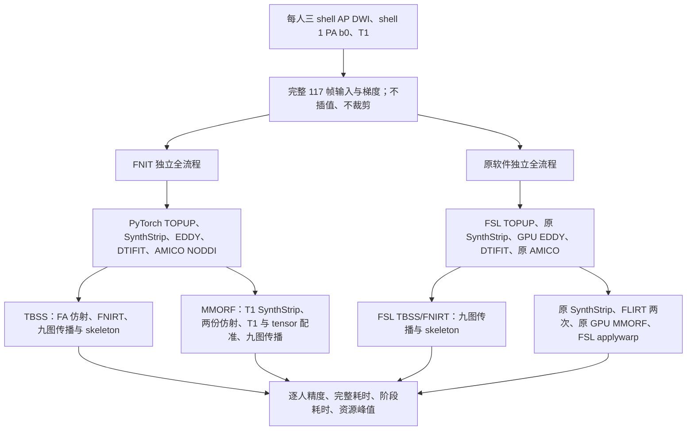

# 公开 10 人 DMRIPipeline 对照协议

本协议在十人输出比较前固定。数据、筛选顺序、许可、采集条件和校验和见 [DATASET.md](DATASET.md) 与 [dataset_manifest.json](dataset_manifest.json)。

## 流程和原软件

原始基线为已发布的 `5d84c7ddec099f1b94772d273c0f76a79934c9bb`。[source_binding.public.json](source_binding.public.json) 已核对其冻结包 **433 个运行时 Python 文件**的相对路径和 SHA-256，清单 SHA-256 为 `44cecc47a054431d2de346d2ede1cc229e5585989902ddf199e011ffefbf73c8`。该版 case01 两个 FNIT 成功仅保留为 legacy；case02 MMORF 在 NODDI 的 padded Cholesky 分配处被自身 20 GB cap 拒绝，原始失败保留。

修复后的全部 **20 个主候选**统一使用 `bf339a0368a7711d2c6ca3477c8d7dc1fc17e75a`，从相同原始输入完整重跑。只有 `amico_noddi/solver.py` 相对基线变化：跳过全零 passive 填充行、约 128 MiB 临时分块和按原 group 广播 CG Gram；dtype、TF32 设置、字典和求解参数不变。[source_binding_memoryfix.public.json](source_binding_memoryfix.public.json) 已逐项核对新部署目录与该提交的 433 文件，清单 SHA-256 为 `f13a40989b96d9e3608a427a1fe10d1960b20f146c768a3dd101f84fe4deae1e`。

八个仅供来源追踪的 `_vendor_fsl` 文件不属于运行时导入，不部署到 benchmark 包。每次运行另记录实际源码与验证脚本哈希。主候选保存在 `memoryfix_cohort/results/`，原参考保存在原 `results/`；旧5d两个成功和失败均不进入新主候选20。FNIT不调用原软件；原软件独立参考运行在另一输出目录。

参考使用 FSL 6.0.7.4、其中的 GPU `eddy_cuda10.2` 与 GPU MMORF 0.3.2、FreeSurfer 8.2.0-1 原 SynthStrip、AMICO 2.0.3。原 SynthStrip 按默认 CPU 命令运行，FNIT 在 GPU 上使用同一经过大小和 SHA-256 核验的权重。参考环境中的 AMICO 依赖仅用于独立原软件对照。

## 固定参数和资源

- 固定被试 10 人，固定 session；每人 TBSS 与 MMORF 两个分支均执行独立完整流程。失败保留在十人分母中。
- 三个 AP shell 顺序拼接为 117 帧，保留所有体素、采集梯度与强度。反向输入使用 shell 1 PA 单 b0。
- 两个实现使用相同输入文件，EDDY 随机种子 `12345`，处理线程数 `8`，NODDI 使用 AMICO，拟合使用旋转后的 bvec。
- TBSS 与 MMORF 两个分支的 dMRI 脑掩膜，都将**各自 TOPUP 校正后的 AP/PA 两张 b0 的平均图**输入 SynthStrip。FNIT 使用 PyTorch GPU，原软件使用原 SynthStrip CPU 命令；权重相同，`border=1 mm`，不启用 `no_csf`。两侧独立估计校正图和掩膜，不互相复制；平均图的输入定义一致，实际 voxel 值仍需比较。MMORF 的 T1 脑提取另以原始 T1 为输入。
- TBSS 使用 FMRIB58 FA 1 mm 与对应 skeleton；MMORF 使用 MNI152 T1 brain 1 mm、FMRIB58 FA 1 mm、FSL HCP1065 tensor 1 mm。逐文件 SHA-256 随结果记录。
- MMORF 使用生产默认的 **一个 T1 标量 + 一个 tensor**；权重均为 1。FA 只用于 tensor affine 初始化。
- MMORF 的 T1 brain→MNI T1 与 native FA→FMRIB58 FA 各做一次 12 DOF、correlation ratio 仿射。五个配准 level 的控制点间距为 `32, 32, 16, 8, 4 mm`，平滑 FWHM 为 `8, 8, 4, 2, 1 mm`，正则权重为 `4e5, 0.37, 0.31, 0.26, 0.22`，每 level 最多 5 次更新。原 MMORF 设置 `hires=6`，使用低分辨率 LM、高分辨率 MM；FNIT 使用带 strong-Wolfe 线搜索的 L-BFGS。两者更新方法不同，同样的迭代上限不表示进行了相同的数值求解。九张指标图经 FA 仿射和 MMORF 相对位移传播，原软件参考使用原 FSL `applywarp --rel --interp=trilinear`。
- H100 上固定一张 GPU；新 20 个 FNIT、19 个原参考条目（含完整匹配的 case01 TBSS 整体复用）及 1 个 case01 MMORF 恢复作业共享全局 GPU 锁，完整作业互不重叠。新 FNIT controller 在释放锁后设置 0.25 秒间隔，位于作业时钟外；两个原 controller 沿用冻结旧版继续运行，没有该间隔，未停止或重启。新主候选先执行 case02 MMORF，再执行固定的其余 19 项。三队列实际开始/结束顺序按 UTC 记录，不保证 AB/BA 紧邻。外部用户 GPU 进程及设备负载按 5 秒记录，资源观察范围是所选 GPU。
- FNIT 使用 CUDA，保持生产默认数值设置；不启用 FP16/BF16。PyTorch allocator 限制为 20,000,000,000 bytes。报告实际 allocated/reserved 峰值，另记录含 CUDA context 的进程显存采样。
- 每个完整流程从原始输入到全部输出实跑。重启调度器可跳过有匹配执行签名和完整报告的整个已完成作业，不复用中间阶段输出，不覆盖失败结果。

## 耗时边界

主要报告两个边界：

1. **完整命令耗时**：新 Python 进程启动、导入、配置、完整 pipeline、来源校验、输出检查、报告写入；由外部 GNU time 与调度器计时。输入下载及三个 shell 的无损拼接不包含在内，两套实现共用这些已核验输入。
2. **pipeline API 耗时**：从处理原始输入开始到生产输出、QC 保存结束；FNIT 前后 CUDA 同步。原软件则包含完整原始输入处理与全部配准/拟合图保存。

阶段子调用包含在父阶段中，不能重复求和。调度器排队、GPU 锁等待和仅新 FNIT 队列设置的 0.25 秒间隔均发生在作业时钟外。GNU time 与包含监测线程收尾的 observer 时钟分列；GNU 缺失时不把 observer 数值填入 GNU 列，不跨两种时钟计算配对比。未完成、异常退出和显存失败单独列出。GNU time 的 RSS 为进程树中单个进程的最大 RSS，不是并发进程 RSS 总和。显存 5 秒采样可能漏过短时峰值；PyTorch allocator 峰值与采样显存分别报告。

## 原 MMORF 启动故障与恢复规则

`case01` 首次原软件 MMORF 全流程在原 MMORF 启动时失败：完整命令耗时 **1349.31 秒**，MMORF 子进程耗时 **7.59 秒**、退出码 `-6`，异常为 `thrust::system::detail::bad_alloc` / `cudaErrorMemoryAllocation`。这份运行保存在 `case01/mmorf/official/`，不能计为已完成参考或用来计算完整加速比。

同一原 MMORF 0.3.2 程序、同一 1 mm 模板和真实输入的限时 gdb 诊断，将异常定位在 `VolumeBSpline` 构造时第一次 `thrust::device_vector<float>(16)` 的 **64 字节设备分配**；此时尚未读取影像数组、未进入 `register_volumes()`。该程序静态 CUDA runtime 为 **10.2**。数字设备编号与完整 UUID 的 64 字节分配/释放均可成功；两次无预热、无参数或 cache 改动的同输入构造复查分别耗时 **7.36 秒、5.28 秒**，均到达注册入口，入口剩余显存约 **82.74 GB**。诊断到入口即停止，未执行优化，不纳入配准精度或速度比较。现有证据支持瞬时 CUDA 启动分配失败；没有证据将这次失败解释为图像所需显存超过设备容量。

独立验证 runner 只对这个启动失败采用以下规则，生产 FNIT 和原 MMORF 数值参数均不改变：

1. 总共最多 **3 次启动，包含第一次**；相邻可重试启动间等待 **2 秒**。
2. 必须同时满足退出码 `-6` 或 `134`、日志包含 `thrust::` 与 `cudaErrorMemoryAllocation`，且还没有任何注册入口或迭代标记。
3. 原程序入口会以 `std::endl` 刷新 `##### MAXIMUM THREADS AVAILABLE IS:` 和 `##### THREADS BEING USED IS:`。出现任一标记即禁止重试。还检查 `Extents Old: [`、`Extents New: [`、`cost_init = `、`lambda_l = `、`cost_next = `、`Beginning iteration `、`cost = `、`lambda_lm = `；配置打印中的裸整数不作为迭代标记。
4. 已出现任意 `mmorf_warp.nii[.gz]` 或 `mmorf_jacobian.nii[.gz]` 时禁止重试。进入优化后的 OOM、其他异常、第三次仍失败，均保存失败并退出。
5. 每次启动保存自己的日志、日志 SHA-256、耗时、退出码与重试判断；**所有启动及等待时间均包含在父阶段、API 和完整命令时钟内**。

恢复验证从同一原始 AP、PA、梯度和 T1 开始，在新的 `case01/mmorf/official_recovered/` 目录重跑整个独立原软件流程；不复用原失败运行的 TOPUP、EDDY、拟合或仿射中间结果。它仍使用固定的所选 GPU UUID、线程预算和同一个 GPU 锁。恢复整链已完成全部 18 张指标图并作为选定参考：GNU time 为 `35:13.98`，即 **2113.98 秒**；API 为 **2097.248599635903 秒**；observer 为 **2113.9841028 秒**；GNU 最大 RSS 为 **9,507,700 KiB**。原初失败、诊断与恢复分别保留，三个时钟分列，不与旧 5d 候选计算主结果比。

## 原5d84c7版本进度：legacy回归记录

以下两次成功来自原5d84c7冻结433文件包，输出通过所需指标图的形状、affine和有限值检查。它们只作为legacy回归保存，不属于统一bf339a0新主候选，耗时不进入修复版20个配对汇总：

| FNIT 分支 | pipeline API | 完整命令 | 指标图数 | PyTorch peak allocated |
|---|---:|---:|---:|---:|
| MMORF | 494.501 秒 | 499.49 秒 | 18 | 12.335 GB |
| TBSS | 608.942 秒 | 614.80 秒 | 27 | 8.757 GB |

表中GB为十进制；显存数不包含CUDA context、reserved缓冲或其他进程。原5d84c7的case02 MMORF在NODDI申请约2.96 GiB padded矩阵时触发20,000,000,000 bytes自身上限；失败记录保留，不作为修复版成功或配对耗时。

## 修复后的组件检查与主队列状态

[case01 NODDI回归](case01_noddi_memoryfix.public.json)的五图decoded values、shape和affine与旧版逐值一致，allocated/reserved峰值为3,674,249,216/3,829,399,552 bytes；[case02组件恢复](case02_noddi_memoryfix.public.json)完成五张有限值图，峰值为5,391,976,448/6,490,685,440 bytes。两例都在20 GB上限内，case02没有旧版完整输出可逐值对照。这些checkpoint检查仅覆盖NODDI组件，不能替代从raw重跑的整链时间或整个pipeline峰值。

| 当前选定原参考 | 状态 | GNU 完整命令（秒） | API（秒） | Observer（秒） | GNU 最大 RSS（KiB） |
|---|---|---:|---:|---:|---:|
| case01 TBSS | 完整成功，匹配整个原参考后复用 | 2480.47 | 此处未列 | 此处未列 | 此处未列 |
| case01 MMORF official_recovered | 从 raw 全新整链成功，18 图；原初失败另存 | 2113.98 | 2097.248599635903 | 2113.9841028 | 9,507,700 |

新 bf339a0 的 20 个 FNIT 完整作业统一重跑，固定十人每人两个分支。状态核对时，新主候选尚无完成配对；finalizer/renderer 已输出 20 个病例位置与 450 个指标图位置的进度占位，不能据行数认定完成。41 项 AMICO 与 18 项比较工具测试已通过，属于数值/报告契约测试。十人 20 个配对的精度、完整/阶段耗时、失败率及脑图仍待全部实跑与核验；当前没有十人完成或等价加速结论。

## 精度指标和图像

每个被试记录 native 的 FA、MD、L1、L2、L3、MO、ICVF、OD、ISOVF，以及这些指标的标准空间图；TBSS 另外记录九张 skeleton 图。因此每个 TBSS 全流程应有 27 张指标图，MMORF 应有 18 张。

比较先核对 shape、affine、有限值、文件完整性，再在固定模板 ROI 中报告逐图 Pearson、MAE、RMSE、分位误差、最大误差及有效支持范围；共同非零支持区仅作为补充。脑掩膜报告 Dice、体积与异或；TOPUP、EDDY、梯度旋转、仿射、MMORF warp/Jacobian 等上游输出能配对时分别比较。

固定展示 `case01` 的 FA/MD/ICVF 和差异图，不按效果最好的被试挑图。汇总包括十人成功率、逐人数字、中位数、IQR、范围和配对耗时比。未事前定义逐点等价容差，因此结果只能直接说明测得的差异；较高相关或较短时间不能单独证明数值等价。

两分支各绘制一张 3×3 图：三行分别为 FA、MD、ICVF，三列为 FNIT、原软件、绝对差。默认轴位世界坐标 `z=16 mm`，选取最近的实际切片，不对影像重新插值；坐标轴以 MNI 毫米标记。指标范围固定为 FA `[0,1]`、MD `[0,0.003] mm²/s`、ICVF `[0,1]`；绝对差范围固定为 FA `[0,0.25]`、MD `[0,0.00075] mm²/s`、ICVF `[0,0.4]`。caption JSON 记录实际显示的 z、模板 mask、各面板截断比例、输入 NIfTI 和绘图脚本 SHA-256。

## 采集解释

三个 shell 的 TE 为 104、113、125 ms。原始强度不做跨 shell 缩放，两套流程接收同样的数据。本实验评价实现之间的差异和耗时；多 TE 数据对模型的影响需要在解读 NODDI 时保留，不将参数一致性解释为生物学准确性。

## 脚本职责

| 脚本 | 输入 | 输出 |
|---|---|---|
| `download_cohort.py` | 固定 manifest、私密下载目录 | 校验过的公开原始文件与 SHA-256 记录 |
| `prepare_inputs.py` | 原始文件、manifest、被试序号 | 完整拼接的 AP、PA、梯度、JSON、原 T1 链接与逐值核验报告 |
| `benchmark_fnit.py` | 规范化原始输入、模板、权重、设备 | FNIT 独立全流程、阶段/资源/源码报告 |
| `benchmark_official.py` | 同样的原始输入、独立原软件路径 | 原软件独立全流程与报告 |
| `run_official_mmorf.py` | 原软件自己拟合的 native 图、原 T1、模板 | 独立原 MMORF 和原 applywarp 输出 |
| `run_cohort.py` | 私密固定 argv/environment 作业计划 | 串行完整作业、外部计时、GPU 采样、失败记录 |
| `compare_public10.py` | 两份独立全流程结果和模板 ROI | 逐人差异和十人汇总，不读取原始数据以外的私有身份信息 |
| `check_noddi_memoryfix.py` | 真实已保存EDDY checkpoint、旧版可选五图 | 仅NODDI组件的数值与内存回归报告；不计整链 |
| `finish_cohort.py` | 固定20配对、主要与附加队列状态 | 等待所有队列结束后形成最终aggregate；可调用renderer |
| `render_report.py` | 匿名aggregate、可选公开数据清单 | 中文RESULTS.md、两份CSV与binding.json，不重跑影像处理 |
| `plot_public10.py` | 固定 `case01` 的标准空间 FA、MD、ICVF 和模板 mask | 两分支各一张 FNIT/原软件/绝对差图及记录切片、截断比例、文件哈希的 caption JSON |

原 MMORF 位移到 FSL applywarp 的单位、方向和仿射组合先用冻结的原 MMORF debug 输出独立核验，结果见 [mmorf_applywarp_frozen_oracle.public.json](mmorf_applywarp_frozen_oracle.public.json)。它限定标准 MNI 的负 determinant 正交网格，不能外推到任意参考坐标；两种原软件 sampler 仍非逐值相等。

## 原实现与资料

- [公开数据和版本 DOI](https://openneuro.org/datasets/ds003138/versions/1.0.1)
- [FSL TOPUP](https://fsl.fmrib.ox.ac.uk/fsl/docs/diffusion/topup.html)
- [FSL EDDY](https://fsl.fmrib.ox.ac.uk/fsl/docs/diffusion/eddy.html)
- [FSL TBSS](https://fsl.fmrib.ox.ac.uk/fsl/docs/diffusion/tbss.html)
- [FSL MMORF](https://fsl.fmrib.ox.ac.uk/fsl/docs/registration/mmorf.html)
- [SynthStrip 原代码](https://github.com/freesurfer/freesurfer/tree/dev/mri_synthstrip)
- [AMICO 原代码](https://github.com/daducci/AMICO)
