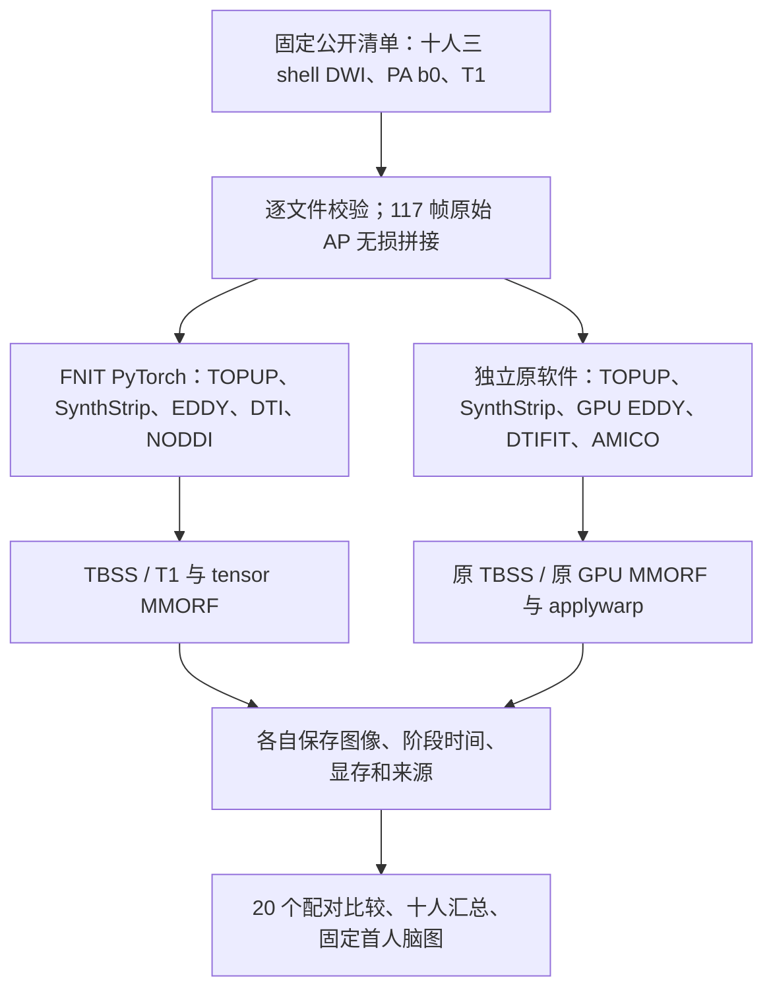

# 公开 10 人 DMRIPipeline 双分支 benchmark

## 功能与当前状态

这组工具从同一份公开原始 DWI、梯度和配对 T1 出发，分别执行 FNIT 与独立原软件的完整流程，比较 **TBSS/FNIRT** 和 **T1 + tensor MMORF** 两个分支。固定十人各运行两个分支，事前计划 **20 个 FNIT 作业、20 个原软件参考、20 个配对比较**；初次失败和历史运行另行保留，不通过换人补成功数。

十人的原始文件已完整下载并校验。最初的 `5d84c7ddec099f1b94772d273c0f76a79934c9bb` 冻结包有 433 个运行时 Python 文件，见 [基线源码绑定](source_binding.public.json)。该版本首人 TBSS/MMORF 成功只作为 **legacy 回归记录**；`case02` MMORF 的 NODDI 阶段申请约 2.96 GiB 填充行矩阵时被 20 GB 自身 allocator 上限拒绝，失败记录保留。

主比较统一使用修复提交 **`bf339a0368a7711d2c6ca3477c8d7dc1fc17e75a`**，仅 `amico_noddi/solver.py` 的临时内存调度变化，dtype、TF32 设置及模型参数不变。全部 20 个 FNIT 完整流程已从原始输入完成，写入新的 `memoryfix_cohort/results/`；每项报告均绑定 433 个运行时 Python 文件及清单 SHA-256 `f13a40989b96d9e3608a427a1fe10d1960b20f146c768a3dd101f84fe4deae1e`，见 [修复源码绑定](source_binding_memoryfix.public.json)。旧版两次成功和 `case02` 失败单列保留，不作为新主候选。

本轮合并核验记录将 `origin/main` 的 `7af34e6d072e843fb2558c931bb2781f1d4b0be9` 合入 `adf74371be6a4ca5f3390c74f9a11e2a518732a3`，见 [合并核验](merge_integration.public.json)。合并后的 73 项 CPU 回归通过，覆盖 AMICO 数值/内存和验证工具契约；它没有重跑真实影像队列。这里的 20 例实测绑定冻结的 `bf339a0`，不能改标为合并后 main 的 20 例实测。

原软件 `case01` TBSS 已完整完成，GNU time 为 **2480.47 秒**；`case01` MMORF 的全新 `official_recovered` 已完成 18 张指标图，GNU time 为 **2113.98 秒**，API 为 **2097.248599635903 秒**，observer 为 **2113.9841028 秒**，GNU 最大 RSS 为 **9,507,700 KiB**。各时钟分列记录。

修正版 `case02` MMORF 的首个完整内存门已从 raw 跑通，18 张指标图的形状、affine、有限值及所需文件检查通过，见 [完整运行报告](case02_mmorf_memoryfix_full.public.json)。API 为 **557.384 秒**，GNU 完整命令为 **562.24 秒**；allocated/reserved 峰值为 **12.335/13.808 GB**。随后固定其余 19 项也全部完成，核验了实际 EDDY→NODDI 衔接；这不等于输出逐值匹配原软件。

### 2026-10-03 最终记录：FNIT 20/20，参考与比较 19/20

| 分支 | FNIT 完整流程 | 选定原软件完整参考 | 完成配对比较 | 指标图格式检查通过 |
|---|---:|---:|---:|---:|
| TBSS/FNIRT | 10/10 | 10/10 | 10/10 | 270/270 |
| T1 + tensor MMORF | 10/10 | 9/10 | 9/10 | 162/180 |
| 合计 | **20/20** | **19/20** | **19/20** | **432/450** |

case05 TBSS 与 case10 TBSS 已从相同 raw 输入完整恢复，全部 27 张图已纳入比较。case10 MMORF 的初次、R1 和 R2 原参考均在 `eddy_cuda10.2` 报 `cudaErrorMemoryAllocation` 后失败，没有完整官方指标图；其 18 张图保留缺失状态。本轮停止进一步原参考恢复，不换被试或改用 CPU 补成功数。最终汇总因此为 `incomplete`，20 配对、450 张图的计划分母不变。

全部原参考共观察 **25 次：19 成功、6 失败**；其中初次 20 次为 16 成功、4 失败，3 次成功恢复、case10 MMORF 的 R1/R2 失败均单独保留。FNIT 共 **21 次：20 成功、1 失败**，包括旧 case02 MMORF OOM 和修复后的新主运行；旧 case01 两次成功另列为 legacy，不加入这 21 次。失败时钟不进入完整配对时间比，见[原软件失败与恢复记录](OFFICIAL_FAILURES.md)。新运行逐项绑定输入、程序、脚本、参数和资源，不重复运行已成功的参考或 20 个 FNIT 作业。

20 个 FNIT 作业的完整 pipeline allocator 峰值上界为：TBSS allocated/reserved **6.972/11.457 GB**，MMORF **12.335/13.810 GB**；各分支 `n=10`，全部低于 **20,000,000,000 bytes** 上限。GB 为十进制，reserved 包含 allocated，不能相加；这不是整张 GPU 的总占用。432 张图通过的是 shape、affine 和有限值检查；尚未设置数值等价阈值，不将其称为 432 张精度验收通过。完整计划仍保留 20 配对和 450 张图的分母。历史失败、内存修复、恢复规则与计时范围见 [PROTOCOL.md](PROTOCOL.md) 和 [COMPARISON.md](COMPARISON.md)。

### 当前精度观察：差异在部分病例配准前已存在

当前 19 个配对的差异并非都很小。标准空间 FA 在固定 MNI152 T1 brain 非零 ROI 中的逐人中位数如下；NRMSE 定义为 `RMSE / 原参考 RMS`，两列分别汇总，不是由中位图计算。

| 分支；当前有效人数 | Pearson r 中位数 | NRMSE 中位数 |
|---|---:|---:|
| TBSS；10/10 | 0.995808245 | 0.060759006 |
| MMORF；9/10 | 0.929446724 | 0.217009355 |

`case08` 的两个分支得到相同的配准前统计：在独立原软件脑 mask 的 168,935 个体素中，TOPUP 校正两张 b0 的 `r=0.957562846`、`NRMSE=0.137970132`，完整 117 帧 EDDY DWI 的 `r=0.982441559`、`NRMSE=0.136383849`，native FA 的 `r=0.856050004`、`NRMSE=0.285848576`。这些差异已经出现在配准之前，不能全部归因于 FNIRT 或 MMORF；现有证据也未将原因隔离到单个子函数。固定首人脑图保留作为示例，不能推广为十人均表现相同。逐图误差、ROI、分母和解释见 [COMPARISON.md 的差异观察](COMPARISON.md#当前差异观察19-个配对)。

独立[保存输入追踪](b0_input_trace_20261003.public.json)逐值确认：case02/08 的 AP 候选为第 0、21、52 帧，冻结 FNIT 选择 AP0/PA0，原参考选择 AP21/PA0；两分支一致。因此同 raw 文件并不表示这两例使用同一 TOPUP pair。另行完成的[十人接受点评分检查](b0_accepted_point_20261003.public.json)确认当前修复的 30 个 AP pair 分数均来自最终接受参数，但十人选择都没有改变，case02/08 仍为 AP0。这是独立组件验收，没有替换冻结 bf339a0 的整链输出或时间；同 pair 场求解诊断与完整整链差异分开，见[差异定位](PRECISION.md)。

### 完整流程耗时：仅汇总 19 个完整配对

| 分支；有效配对数 | FNIT API 中位秒 | 原软件 API 中位秒 | FNIT GNU 中位秒 | 原软件 GNU 中位秒 | 逐人 GNU 比中位数 [Q25,Q75] |
|---|---:|---:|---:|---:|---|
| TBSS；10 | 754.926835 | 2593.340872 | 759.91 | 2606.87 | 3.258027 [2.655359,3.900696] |
| MMORF；9 | 566.225101 | 2097.248600 | 571.32 | 2113.98 | 3.422417 [2.335129,4.783187] |

API 为完整处理读写范围，GNU time 另含进程启动、导入和退出；比值先按同一人计算原软件/FNIT，再汇总，不是两个中位数相除。失败位置没有完整耗时比。任务共享 GPU 仍有其他进程负载，单次逐人运行不建立稳定性能或数值等价结论；阶段时钟与负载见[逐图及计时说明](COMPARISON.md)。

- [PROTOCOL.md](PROTOCOL.md)：事前固定的流程、参数、资源和计时边界。
- [DATASET.md](DATASET.md)：OpenNeuro ds003138 v1.0.1、CC0、十人清单和采集条件。
- [COMPARISON.md](COMPARISON.md)：逐图精度指标、固定 ROI、完整分母和汇总规则。



FNIT 运行时使用仓库实现。FSL、FreeSurfer 与原 AMICO 只出现在独立验证目录和验证命令中，不是 FNIT pipeline 的运行依赖。

## 环境、模型和模板

从仓库根目录按[主页 Conda 安装说明](../../../README.md#安装)创建环境：

```bash
conda env create -f environment.yml
conda activate fnit

# 只配置本流程需要的 SynthStrip 权重；下载器核验大小和 SHA-256。
benchmark_root_dir="$PWD/public10_work"
model_weights_dir="$benchmark_root_dir/weights"
fnit-setup-weights --model synthstrip --dest "$model_weights_dir"
fnit-setup-weights --model synthstrip --dest "$model_weights_dir" --verify-only
```

SynthStrip 使用 `synthstrip.1.pt`，30,851,709 bytes，SHA-256 为 `37417f802196186441aae3e7f385d94f8a98c64a88acaeaa2723af995c653e33`。下载优先使用 FNIT 固定 `assets-v1` Release，回退原作者地址，见[权重说明](../../../docs/WEIGHTS.md)。

模板另行准备，逐文件大小和 SHA-256 写入结果。TBSS 需要 `FMRIB58_FA_1mm.nii.gz`、`FMRIB58_FA-skeleton_1mm.nii.gz`；MMORF 需要同网格的 `FMRIB58_FA_1mm.nii.gz`、`MNI152_T1_1mm_brain.nii.gz` 和六分量 `FSL_HCP1065_tensor_1mm.nii.gz`。本次主要标准 ROI 两个分支统一使用 **MNI152 T1 brain 1 mm 的非零体素**；TBSS skeleton 再与原 skeleton `>=2000` 相交。模板只从具有相应使用许可的原作者来源获取，不把服务器已有模板直接提交到仓库。

FNIT 验证驱动要求 CUDA，并把 PyTorch allocator 限制设为 20,000,000,000 bytes。它保留生产默认数值设置，实际 float32/TF32 开关写入报告，不启用 FP16/BF16。原软件验证环境另准备 FSL 6.0.7.4、MMORF 0.3.2、FreeSurfer 8.2.0-1 原 SynthStrip 和 AMICO 2.0.3；原 SynthStrip 使用 CPU，EDDY、MMORF 使用 GPU。

## 输入、输出与目录

每人三个 AP shell 按 1、2、3 顺序拼接为 `120 × 120 × 68 × 117`；bval、bvec 同顺序拼接，保留全部原始体素和采集强度，不插值、不裁剪、不做跨 shell 缩放。反向输入固定为 shell 1 的 PA 单 b0；T1 保留原文件及其存储缩放。

```text
public10_work/                         # 用户自行选择的本地私密目录
├── source/sub-*/ses-1/{anat,dwi,fmap}/ # 原作者文件；共 200 个
├── inputs/case01/                    # case01…case10，固定清单顺序
│   ├── raw/
│   │   ├── AP.nii.gz                 # 117 帧：3 b0 + 20/30/64 个扩散方向
│   │   ├── AP.bval                   # 1 × 117
│   │   ├── AP.bvec                   # 3 × 117
│   │   ├── AP.json                   # j-、readout、各 shell TE/帧数
│   │   ├── PA.nii.gz                 # 1 帧 b0，同三维网格
│   │   ├── PA.bval                   # 单个 0；不要求 PA.bvec
│   │   └── PA.json                   # j、readout、TE
│   ├── T1w.nii.gz                    # 指向已校验的原 T1
│   ├── input_manifest.json           # 无损核对结果、输入 SHA-256
│   └── input.ready                   # 成功准备的标记
├── results/caseNN/{tbss,mmorf}/
│   ├── official/                    # 当前原软件参考；case01 MMORF 的初次失败另存
│   ├── official_recovered/          # 仅 case01 MMORF：从 raw 全新恢复的选定参考
│   └── fnit/                        # 旧 5d84c7 运行，只保留为 legacy
├── memoryfix_cohort/
│   ├── results/caseNN/{tbss,mmorf}/fnit/
│   │   ├── output/                  # bf339a0 主候选，从 raw 完整重跑
│   │   ├── report.json              # pipeline、阶段、来源、完整性
│   │   ├── time.txt                 # GNU time 完整命令耗时和 RSS
│   │   ├── process_metrics.json      # 进程树/外部 GPU 负载采样
│   │   ├── log.txt
│   │   └── exitcode
│   ├── jobs.private.json            # 新 20 个 FNIT 作业
│   └── cohort_status.json
├── reference_cohort/                # 19 个原参考条目及队列状态
├── mmorf_recovery/                  # case01 MMORF 恢复队列及状态
├── comparisons.private.json         # 固定 20 个配对；只指向选定主结果
├── comparisons/                     # 逐人差异、汇总、Markdown/CSV
├── component_checks/                # checkpoint NODDI 回归；不计整链耗时
└── figures/                         # 固定 case01 主比较脑图与图注 JSON
```

九个参数为 `FA、MD、L1、L2、L3、MO、ICVF、OD、ISOVF`。每个 TBSS 完整作业保存九张 native、九张标准空间、九张 skeleton 图；MMORF 保存九张 native 和九张标准空间图，另保存 T1 脑掩膜、仿射、位移与 Jacobian。两套实现的具体相对路径见 [COMPARISON.md](COMPARISON.md#输入与输出)。报告的“完成”表示所需文件存在、来源绑定和格式检查通过，精度由比较报告单独说明。

实际目录、命令、原始影像和完整私密日志留在用户选择的目录；仓库只收录固定公开清单、去除机器路径的报告、脑图及复现说明。

## 下载与无损准备

```bash
benchmark_scripts_dir="$PWD/validation/dmri_pipeline/public10_20261002"
public_manifest_file="$benchmark_scripts_dir/dataset_manifest.json"
source_data_dir="$benchmark_root_dir/source"
prepared_inputs_dir="$benchmark_root_dir/inputs"

python "$benchmark_scripts_dir/download_cohort.py" \
  --manifest "$public_manifest_file" --output-dir "$source_data_dir" --workers 4

# 序号直接来自固定公开清单；不按结果换人。
for case_index in {1..10}; do
  python "$benchmark_scripts_dir/prepare_inputs.py" \
    --manifest "$public_manifest_file" --source-root "$source_data_dir" \
    --output-dir "$prepared_inputs_dir" --case-index "$case_index"
done
```

| 参数 | 含义 |
|---|---|
| 下载 `--manifest`、`--output-dir` | 固定公开清单；原始文件下载根目录 |
| 下载 `--workers` | 每人文件并发下载数，默认 4 |
| 下载 `--transfer-command-json` | 可选 tar 标准输入接收命令的 JSON argv 数组，逐人校验后传输；不填凭据、不需要它即可本地运行 |
| 准备 `--manifest`、`--source-root`、`--output-dir` | 同一清单、原始下载根目录、`caseNN` 输入的父目录 |
| 准备 `--case-index` | 固定清单中的 1–10；已有目标目录拒绝覆盖 |

下载器校验原作者 NIfTI MD5、文件大小及 sidecar SHA-256，并计算实际下载文件 SHA-256，输出 `download_verified.json` 和 `download.complete`。准备器重新核验所有文件，逐值检查保存后的 AP、PA 和梯度；T1 链接需要源目录持续可读。

## FNIT Python 调用

一般使用已有生产 API，不需要验证驱动。以下是 MMORF 的单被试调用；TBSS 将 `registration_backend` 改为 `"tbss"`，传入 `fa_skeleton`，省略三个 T1/tensor 参数。

```python
from pathlib import Path
from fnit.dmri_pipeline import DMRIPipeline

benchmark_root_dir = Path("public10_work").resolve()
subject_inputs_dir = benchmark_root_dir / "inputs" / "case01"
template_assets_dir = benchmark_root_dir / "templates"
synthstrip_model_file = benchmark_root_dir / "weights" / "synthstrip.1.pt"

pipeline = DMRIPipeline(
    device="cuda:0", registration_backend="mmorf",
    synthstrip_weights=synthstrip_model_file,
    dti_shell=1000, dti_tolerance=100,        # DTI 使用 b0 与 b1000
    bvec_source="rotated",                  # 使用本流程 EDDY 旋转后的梯度
    noddi_fit_method="amico", eddy_gp_seed=12345,
)
pipeline_result = pipeline.run(
    raw_dir=subject_inputs_dir / "raw",
    output_dir=benchmark_root_dir / "example_python_mmorf",  # 使用新目录
    fa_template=template_assets_dir / "FMRIB58_FA_1mm.nii.gz",
    t1=subject_inputs_dir / "T1w.nii.gz",
    t1_template=template_assets_dir / "MNI152_T1_1mm_brain.nii.gz",
    tensor_template=template_assets_dir / "FSL_HCP1065_tensor_1mm.nii.gz",
    overwrite=False,
)
# 两个字典分别包含九张 nibabel 图；全部文件另保存在 output_dir。
native_maps = pipeline_result.native_maps
standard_maps = pipeline_result.standard_maps
quality_control = pipeline_result.qc
```

生产 API 的 `fnirt_config` 可指定 FNIRT 配置，仅 TBSS 使用；本次 benchmark 保留生产默认。`overwrite=False` 保留已有结果。输入模板必须共用相同标准网格；MMORF 的 T1 是该被试的配对 T1，不是标准模板。完整 API、生产 CLI 和参数说明见 [DMRIPipeline](../../../docs/dmri_pipeline/README.md)。

需要同样的验证计时和来源报告时，可用 `importlib.util.spec_from_file_location` 加载 `benchmark_fnit.py` 后调用 `module.main(argv_list)`，`argv_list` 与下一节 CLI 参数相同。`prepare_inputs.py` 的 Python 入口为 `prepare(manifest_dict, source_root, output_dir, case_index)`，返回无损核验字典。

## 单被试验证 CLI

先设置通用资源变量；这些示例路径由用户自行配置，不对应实验服务器目录。

```bash
subject_inputs_dir="$prepared_inputs_dir/case01"
template_assets_dir="$benchmark_root_dir/templates"
fa_template_file="$template_assets_dir/FMRIB58_FA_1mm.nii.gz"
fa_skeleton_file="$template_assets_dir/FMRIB58_FA-skeleton_1mm.nii.gz"
t1_template_file="$template_assets_dir/MNI152_T1_1mm_brain.nii.gz"
tensor_template_file="$template_assets_dir/FSL_HCP1065_tensor_1mm.nii.gz"
synthstrip_model_file="$model_weights_dir/synthstrip.1.pt"
# 此处记录当前仓库实际提交，生产导入也来自当前仓库。
fnit_source_commit="$(git rev-parse HEAD)"
export PYTHONPATH="$PWD/src"

fnit_tbss_job_dir="$benchmark_root_dir/memoryfix_cohort/results/case01/tbss/fnit"
python "$benchmark_scripts_dir/benchmark_fnit.py" \
  --case-id case01 --backend tbss \
  --raw-dir "$subject_inputs_dir/raw" --t1 "$subject_inputs_dir/T1w.nii.gz" \
  --output-dir "$fnit_tbss_job_dir/output" --report "$fnit_tbss_job_dir/report.json" \
  --fa-template "$fa_template_file" --fa-skeleton "$fa_skeleton_file" \
  --synthstrip-weights "$synthstrip_model_file" --source-commit "$fnit_source_commit" \
  --device cuda:0 --threads 8 --eddy-gp-seed 12345 --memory-limit-bytes 20000000000

fnit_mmorf_job_dir="$benchmark_root_dir/memoryfix_cohort/results/case01/mmorf/fnit"
python "$benchmark_scripts_dir/benchmark_fnit.py" \
  --case-id case01 --backend mmorf \
  --raw-dir "$subject_inputs_dir/raw" --t1 "$subject_inputs_dir/T1w.nii.gz" \
  --output-dir "$fnit_mmorf_job_dir/output" --report "$fnit_mmorf_job_dir/report.json" \
  --fa-template "$fa_template_file" --t1-template "$t1_template_file" \
  --tensor-template "$tensor_template_file" --synthstrip-weights "$synthstrip_model_file" \
  --source-commit "$fnit_source_commit" --device cuda:0 --threads 8 \
  --eddy-gp-seed 12345 --memory-limit-bytes 20000000000
```

| `benchmark_fnit.py` 参数 | 含义 |
|---|---|
| `--case-id`、`--backend` | 匿名 `caseNN` 与 `tbss/mmorf` 分支 |
| `--raw-dir`、`--t1` | 共用规范输入目录和原始 T1；驱动两个分支都记录 T1，只有 MMORF 使用它 |
| `--output-dir`、`--report` | 独立的新结果目录与来源/计时 JSON；不复用中间输出 |
| `--fa-template`、`--fa-skeleton` | FA 标准模板；TBSS 需要 skeleton |
| `--t1-template`、`--tensor-template` | MMORF 需要的标准 T1 脑图与六分量 tensor |
| `--synthstrip-weights` | 经校验的官方标准模型 |
| `--source-commit` | 实际所用生产代码提交；报告同时保存实际导入文件 SHA-256 |
| `--device` | 显式 CUDA 设备；本驱动要求 GPU |
| `--threads`、`--eddy-gp-seed` | 默认 8 个 PyTorch CPU 线程，EDDY 固定种子 12345 |
| `--memory-limit-bytes` | 默认 20,000,000,000 bytes 的 PyTorch allocator 上限，不是整张卡或原软件的显存上限 |

单独 CLI 只产生内部 API 时钟；完整命令时间用 `/usr/bin/time -v` 或下节队列测量。驱动的嵌套子调用时间已经包含在父阶段里，不能重复相加。

### 按冻结报告源码复现

上面的通用示例使用当前仓库源码。要复现本页 bf339a0 队列，应先在仓库根目录另建冻结 worktree，再使用其 `src`；验证脚本仍取前面固定的 `benchmark_scripts_dir`，报告会分别记录脚本和实际导入的生产源码哈希。

```bash
benchmark_repository_dir="$PWD"
frozen_fnit_commit=bf339a0368a7711d2c6ca3477c8d7dc1fc17e75a
frozen_fnit_source_dir="$benchmark_root_dir/frozen_fnit_bf339a0"
# 目标目录必须尚未存在；此命令不修改当前仓库的 checkout。
git -C "$benchmark_repository_dir" worktree add --detach \
  "$frozen_fnit_source_dir" "$frozen_fnit_commit"
export PYTHONPATH="$frozen_fnit_source_dir/src"
fnit_source_commit="$(git -C "$frozen_fnit_source_dir" rev-parse HEAD)"
```

然后在新结果目录执行上面的两条 `benchmark_fnit.py` 命令，`--source-commit` 使用这里取得的实际提交。不要对合并后的 `src` 填写 bf339a0 标签；有未提交生产源码修改时，HEAD 也不能代替报告中的逐文件 SHA-256。冻结报告的 433 文件清单见 [source_binding_memoryfix.public.json](source_binding_memoryfix.public.json)。不同验证脚本版本和共享硬件负载可能改变观测时钟，新的结果应保留自己的完整绑定。

## 独立原软件调用

`benchmark_official.py` 从同样的 raw 输入重新运行原软件，不读取 FNIT 的场、掩膜、拟合图或矩阵。两个实现存在 PA 时，SynthStrip 都接收各自 TOPUP 校正 AP/PA b0 的均值；这次没有走 FNIT 的 raw AP-only 分支。共同读出时间按现有协议截取到四位小数：原始 `0.126134 s` 对应计算使用 `0.1261 s`。

```bash
# 原软件放在独立环境；这些路径需要验证者配置。
original_python_executable=/path/to/original-amico-env/bin/python
original_fsl_dir=/path/to/fsl-6.0.7.4
original_synthstrip_command=/path/to/freesurfer-8.2.0-1/bin/mri_synthstrip
topup_config_file="$original_fsl_dir/etc/flirtsch/b02b0.cnf"
oxford_config_prefix="$PWD/src/fnit/dmri_pipeline/assets/oxford"
amico_reference_runner="$PWD/validation/dmri_pipeline/run_official_amico.py"
tbss_reference_runner="$PWD/validation/dmri_pipeline/run_official_tbss.sh"

# 共用的原始处理参数；原 AMICO 使用自己的 Python 环境。
original_common_arguments=(
  --case-id case01 --raw-dir "$subject_inputs_dir/raw" --fsl-dir "$original_fsl_dir"
  --topup-config "$topup_config_file" --fa-reference "$fa_template_file"
  --amico-runner "$amico_reference_runner" --brain-extractor synthstrip
  --synthstrip-command "$original_synthstrip_command"
  --synthstrip-weights "$synthstrip_model_file" --seed 12345 --threads 8
)

original_tbss_job_dir="$benchmark_root_dir/results/case01/tbss/official"
"$original_python_executable" "$benchmark_scripts_dir/benchmark_official.py" \
  "${original_common_arguments[@]}" --registration-backend tbss \
  --fa-skeleton "$fa_skeleton_file" --config-prefix "$oxford_config_prefix" \
  --tbss-runner "$tbss_reference_runner" \
  --output-dir "$original_tbss_job_dir/output" --report "$original_tbss_job_dir/report.json"

original_mmorf_job_dir="$benchmark_root_dir/results/case01/mmorf/official_recovered"
"$original_python_executable" "$benchmark_scripts_dir/benchmark_official.py" \
  "${original_common_arguments[@]}" --registration-backend mmorf \
  --t1 "$subject_inputs_dir/T1w.nii.gz" --t1-reference "$t1_template_file" \
  --tensor-reference "$tensor_template_file" \
  --mmorf-runner "$benchmark_scripts_dir/run_official_mmorf.py" \
  --output-dir "$original_mmorf_job_dir/output" --report "$original_mmorf_job_dir/report.json"
```

| `benchmark_official.py` 参数 | 含义 |
|---|---|
| `--case-id`、`--registration-backend` | `case01`–`case10`；默认 TBSS |
| `--raw-dir`、`--output-dir`、`--report` | 同一原始输入、新原软件目录与新报告 |
| `--fsl-dir`、`--topup-config` | 固定原 FSL 根目录和与 FNIT 对应的 TOPUP 配置 |
| `--fa-reference` | 两分支都会使用的 FA 模板 |
| `--fa-skeleton`、`--config-prefix`、`--tbss-runner` | TBSS skeleton、`oxford_s1/s2/s3.cnf` 的路径前缀和原 TBSS 脚本 |
| `--t1`、`--t1-reference`、`--tensor-reference`、`--mmorf-runner` | MMORF 原 T1、标准 T1/tensor 与独立原软件配准驱动 |
| `--amico-runner` | 原 AMICO 全拟合和参数保存驱动 |
| `--seed`、`--threads` | 默认 EDDY 种子 12345、处理线程数 8；AMICO BLAS 线程另固定为 1 |
| `--brain-extractor` | 默认原 SynthStrip；保留旧 BET 对照选项，本次不使用 BET |
| `--synthstrip-command`、`--synthstrip-weights` | 原 SynthStrip 可执行命令及同一经严格校验的模型 |
| `--synthstrip-gpu` | 可选原 SynthStrip `-g`，本次原软件参考不启用 |
| `--bet-fraction` | 仅 BET 对照使用，默认 0.2；本次不适用 |
| `--gpu-lock` | 单独调用时可与 FNIT launcher 共用的 flock 文件；全作业队列已持同一锁时不要再传，以免重复持锁阻塞 |

原软件实际执行 TOPUP、`eddy_cuda10.2`、`dtifit --save_tensor`、原 AMICO；TBSS 执行加权 FLIRT、三阶段 FNIRT、applywarp 和 skeleton 投影。MMORF 独立执行 CPU T1 SynthStrip、两次 12-DOF `FLIRT -cost corratio`、一个 T1 scalar + 一个 tensor 的 GPU MMORF，最后用原 `applywarp --rel --premat --interp=trilinear` 传播九图。完整参数、每条真实 argv 和 stdout 位于各自私密日志；嵌套 MMORF 报告也包含固定配置和版本。

`run_official_mmorf.py` 可独立运行，参数为 `--t1`、`--native-dir`、`--t1-reference`、`--fa-reference`、`--tensor-reference`、`--output-dir`、`--fsl-dir`、`--synthstrip-command`、`--synthstrip-weights`、`--threads`；`--native-dir` 必须是原软件自己拟合的 `dti_tensor`、FA 与九张图，不能替换成 FNIT 图。默认拒绝非空结果目录；`--overwrite` 是独立工具选项，本 benchmark 不启用。它可通过加载模块调用 `main(argv_list)`，与 CLI 相同。

## 构建并执行私密完整计划

主比较有 40 个选定完整运行位置，比较清单固定 20 个配对。它们从同一份公开 `dataset_manifest.json` 生成，对每个 `caseNN` 指向相同 `inputs/caseNN`。本次实际分为三个固定队列：

| 队列 | 计划条目 | 选定结果 |
|---|---:|---|
| 新 FNIT | 20 | 统一 bf339a0，从 raw 完整重跑，`memoryfix_cohort/results/` |
| 原软件参考 | 19 | `case01` TBSS 复用签名、来源和完整报告匹配的整个已完成原参考；其余完整运行，保存在 `results/` |
| 原 MMORF 恢复 | 1 | `case01` MMORF 从 raw 全新重跑，选定 `results/case01/mmorf/official_recovered/` |

初始三个队列共享同一 GPU 锁；19 个原参考条目包括已完成 TBSS 的整体复用，不表示它需要再运行一次。新主候选先执行 `case02` MMORF，随后执行计划固定的其余 19 个 FNIT 作业。两个原软件 controller 使用冻结旧版，没有因 FNIT 修复而停止或重启。初始队列现已结束，三个原 EDDY 失败另建恢复作业并继续使用同一锁；完整成功的作业不重复执行。原失败尝试和 legacy FNIT 另行记录，不增加或替换固定被试/分支。新独立复现也可把全部 40 个位置写入单一固定作业计划；仍需保证每份结果源自独立的完整流程。

下面只展示作业 schema 的一行，路径是结构示例，**不可直接当成可执行计划**：

```json
{
  "gpu_uuid": "GPU-REPLACE-WITH-YOUR-SELECTED-UUID",
  "jobs": [
    {
      "case_id": "case01", "backend": "tbss", "implementation": "fnit",
      "job_dir": "memoryfix_cohort/results/case01/tbss/fnit",
      "report": "memoryfix_cohort/results/case01/tbss/fnit/report.json",
      "argv": ["YOUR-PYTHON", "YOUR-SCRIPT", "COMPLETE-ARGUMENT-LIST"],
      "environment": {"CUDA_VISIBLE_DEVICES": "GPU-REPLACE-WITH-YOUR-SELECTED-UUID"}
    }
  ]
}
```

实际构建时，把资源、解释器、脚本、输入和输出路径通过 `Path.resolve()` 写成用户自己的绝对路径。队列在每个 `job_dir` 内启动子进程，不自动替换 argv 或解析相对资源路径。`argv` 是上文完整命令的字符串数组，不是经 shell 拼接的命令文本。每行需要 `case_id、backend、implementation、job_dir、report、argv、environment`；全计划还需 `gpu_uuid`。FNIT 的 `environment` 可指定对应源码目录的 `PYTHONPATH`；原 AMICO 使用自己的解释器和依赖环境。设置 `CUDA_VISIBLE_DEVICES` 后，驱动中的设备仍写 `cuda:0`。

遍历公开清单 10 行 × `tbss/mmorf` 固定 20 个配对，分别生成两侧完整作业。三个队列共享锁后的实际开始/结束顺序按 UTC 记录；调度不保证 AB/BA 紧邻，不按观察到的速度改顺序。比较清单每人每分支一行，示例结构：

```json
{
  "planned_cases": [
    {
      "case_id": "case01", "backend": "tbss",
      "candidate_dir": "memoryfix_cohort/results/case01/tbss/fnit/output",
      "reference_dir": "results/case01/tbss/official/output",
      "candidate_report": "memoryfix_cohort/results/case01/tbss/fnit/report.json",
      "reference_report": "results/case01/tbss/official/report.json",
      "comparison_report": "comparisons/case01_tbss.json",
      "candidate_process_metrics": "memoryfix_cohort/results/case01/tbss/fnit/process_metrics.json",
      "reference_process_metrics": "results/case01/tbss/official/process_metrics.json"
    }
  ]
}
```

`compare_public10.py aggregate` 支持清单文件所在目录下的相对报告路径。后台 `finish_cohort.py` 则直接使用行中路径，因此完整自动流程应将两个计划的所有实际路径都保存为绝对路径。构建完整计划后：

```bash
fnit_jobs_plan_file="$benchmark_root_dir/memoryfix_cohort/jobs.private.json"
original_jobs_plan_file="$benchmark_root_dir/reference_cohort/jobs.private.json"
recovered_original_jobs_plan_file="$benchmark_root_dir/mmorf_recovery/jobs.private.json"
comparison_plan_file="$benchmark_root_dir/comparisons.private.json"
gpu_admission_lock_file="$benchmark_root_dir/gpu.lock"
standard_roi_file="$t1_template_file"     # 两个分支统一的 MNI 脑 ROI

# 以下三个队列分别在终端或作业管理器中启动，使用同一锁。
python "$benchmark_scripts_dir/run_cohort.py" \
  --plan "$fnit_jobs_plan_file" --gpu-lock "$gpu_admission_lock_file"
python "$benchmark_scripts_dir/run_cohort.py" \
  --plan "$original_jobs_plan_file" --gpu-lock "$gpu_admission_lock_file"
python "$benchmark_scripts_dir/run_cohort.py" \
  --plan "$recovered_original_jobs_plan_file" --gpu-lock "$gpu_admission_lock_file"

# 在另一个终端等待三份状态都结束，并持续保存比较与报告。
python "$benchmark_scripts_dir/finish_cohort.py" \
  --manifest "$comparison_plan_file" \
  --cohort-status "$benchmark_root_dir/memoryfix_cohort/cohort_status.json" \
  --additional-cohort-status "$benchmark_root_dir/reference_cohort/cohort_status.json" \
  --additional-cohort-status "$benchmark_root_dir/mmorf_recovery/cohort_status.json" \
  --comparator "$benchmark_scripts_dir/compare_public10.py" \
  --reference-roi "$standard_roi_file" --fa-skeleton "$fa_skeleton_file" \
  --inputs-root "$prepared_inputs_dir" --output-dir "$benchmark_root_dir/comparisons" \
  --poll-seconds 30 --gpu-lock "$gpu_admission_lock_file" \
  --report-renderer "$benchmark_scripts_dir/render_report.py" \
  --dataset-manifest "$public_manifest_file"
```

`run_cohort.py --gpu-lock` 必填：锁在完整命令计时前获得，一个作业全部结束后释放。当前脚本会在释放锁后等待 0.25 秒再申请下一作业，这段间隔在每个作业时钟外。本次实际部署中，只有新 FNIT controller 使用此版本；两个已运行的原软件 controller 沿用冻结旧版，没有该间隔。三队列始终由同一全局锁串行，实际顺序由 UTC 记录确认，不保证 AB/BA 紧邻。上面的独立复现示例若都使用当前脚本，新启动的各队列都会采用该间隔，需记录各自脚本哈希。已完成作业只在执行签名和完整报告一致时跳过；失败原样保留，修复后在另有名称的新目录从 raw 完整重跑。`cohort_status.json` 位于每份作业计划同目录。

三个参考恢复后，最终化必须使用**新的汇总目录**。`finish_cohort.py` 不覆盖已有 `aggregate.final.json`；直接复用原 17 配对的终态目录会再次渲染旧汇总。先另存固定 20 行清单，将三个选定参考指向新恢复结果，为这三行设置新的比较 JSON 路径，并保留 `initial_failed_reference_report`、`initial_failed_reference_process_metrics` 和 `reference_rerun_reason`；其余已核验的 17 个参考和 FNIT 作业不重跑。下面仅等待和比较已有输出，不启动恢复 pipeline，也不预先宣称其成功。

```bash
recovery_comparison_plan_file="$benchmark_root_dir/comparisons_recovery.private.json"
recovery_cohort_status_file="$benchmark_root_dir/reference_recovery/cohort_status.json"
final20_summary_dir="$benchmark_root_dir/summary_final20"  # 必须是新的汇总目录
python "$benchmark_scripts_dir/finish_cohort.py" \
  --manifest "$recovery_comparison_plan_file" \
  --cohort-status "$benchmark_root_dir/memoryfix_cohort/cohort_status.json" \
  --additional-cohort-status "$recovery_cohort_status_file" \
  --comparator "$benchmark_scripts_dir/compare_public10.py" \
  --reference-roi "$standard_roi_file" --fa-skeleton "$fa_skeleton_file" \
  --inputs-root "$prepared_inputs_dir" --output-dir "$final20_summary_dir" \
  --poll-seconds 30 --gpu-lock "$gpu_admission_lock_file" \
  --report-renderer "$benchmark_scripts_dir/render_report.py" \
  --dataset-manifest "$public_manifest_file"
```

恢复状态文件来自用户的新三作业计划；完整自动流程仍要求清单内实际路径为绝对路径。以新目录的 `aggregate.final.json` 的状态、20 个实际配对和全部图检查为准，文件名中的 `final20` 不代表验收已完成。最终脑图及耗时图也应从这份新汇总和选定结果生成。

| `finish_cohort.py` 参数 | 含义 |
|---|---|
| `--manifest` | 固定 20 行的私密比较清单，指向新候选和选定参考 |
| `--cohort-status` | 主要队列状态，例如新 20 个 FNIT 作业 |
| `--additional-cohort-status` | 可重复传入其他固定队列状态；所有状态完整结束后才形成最终报告 |
| `--comparator` | `compare_public10.py` 路径 |
| `--reference-roi`、`--fa-skeleton` | 两分支共同 MNI T1 脑 ROI 和 TBSS 原 skeleton |
| `--inputs-root`、`--output-dir` | `inputs/caseNN` 的父目录、比较/汇总目录 |
| `--poll-seconds` | 状态检查间隔，默认 30 秒，必须大于零 |
| `--gpu-lock` | 可选共享锁，使影像比较也避开正在计时的完整作业 |
| `--report-renderer` | 可选 `render_report.py`，从匿名 aggregate 输出中文 Markdown/CSV |
| `--dataset-manifest` | 可选固定公开数据清单，传给 renderer 做输入版本绑定 |

`render_report.py` 也可单独调用：`--aggregate` 指定匿名汇总 JSON，`--output-dir` 指定输出目录，`--dataset-manifest` 为可选公开清单；生成 `RESULTS.md`、两份 CSV 和 `binding.json`。这些输出来自已经保存的汇总，不重新运行 pipeline。进度报告也保留全部 20 个病例位置和 450 个指标图位置；行数不能代替完成状态，应核对实际成功配对数、各行状态和最终 aggregate。

队列输出 GNU time、每五秒进程树显存/外部进程负载、退出码和持久状态。GNU time 代表完整命令；内部 API 时钟另列。RSS 是进程树中的单个进程最大 RSS；采样显存可能遗漏短时峰值，FNIT allocator peak 不包含 CUDA context。精度失败仍保留耗时，但不把时间比称为等价实现加速。

## NODDI 组件内存回归检查

`check_noddi_memoryfix.py` 读取既有真实 EDDY checkpoint，仅重新拟合五张 NODDI 图。它用于检查 solver 修复的输出和内存，不进入主比较的端到端耗时。实际结果见 [case01](case01_noddi_memoryfix.public.json) 和 [case02](case02_noddi_memoryfix.public.json)：case01 五图解码值与 shape/affine 与旧版逐值一致；case02 从旧版 20 GB 失败恢复为五图有限值，缺少旧版完整输出时不做新旧逐值一致断言。两例 allocated/reserved 峰值分别为 `3,674,249,216 / 3,829,399,552` 和 `5,391,976,448 / 6,490,685,440 bytes`。

```bash
legacy_checkpoint_dir="$benchmark_root_dir/results/case01/mmorf/fnit/output"
component_output_dir="$benchmark_root_dir/component_checks/case01/output"
component_report_file="$benchmark_root_dir/component_checks/case01/report.json"
python "$benchmark_scripts_dir/check_noddi_memoryfix.py" \
  --case-id case01 --checkpoint-dir "$legacy_checkpoint_dir" \
  --bvals "$subject_inputs_dir/raw/AP.bval" --output-dir "$component_output_dir" \
  --baseline-native-dir "$legacy_checkpoint_dir/native" --report "$component_report_file" \
  --source-commit "$fnit_source_commit" --memory-limit-bytes 20000000000
```

| 参数 | 含义 |
|---|---|
| `--case-id` | 匿名被试标识 |
| `--checkpoint-dir` | 已完成 EDDY 的结果根目录，含 `eddy/data.nii.gz`、mask 与 rotated bvec |
| `--bvals` | 与上述完整 DWI 对应的原 AP bval |
| `--output-dir`、`--report` | 新五图目录与新组件报告，存在时拒绝覆盖 |
| `--baseline-native-dir` | 可选旧版 native 目录，用于五图解码值及 shape/affine 差分；缺失时一致性字段为 null |
| `--source-commit` | 修复源码提交；报告另保存实际运行的 Python 文件哈希 |
| `--memory-limit-bytes` | 默认 20,000,000,000 bytes 的 allocator 上限 |

该辅助检查固定 `cuda:0`、CPU 线程 8，运行前按需要设置 `CUDA_VISIBLE_DEVICES`；与计时队列分开安排，不与同一 GPU 上的主作业并行。reserved 包含 allocator 保留的 allocated，两列不相加；组件峰值不替代全流程峰值。41 项 AMICO 和 18 项比较工具测试检验数值/报告规则，测试中的小矩阵不进入真实数据 benchmark 表。

## 比较、汇总与脑图

可独立对完成的一对结果比较，再汇总全部 20 行。完整 Python API 与比较参数见 [COMPARISON.md](COMPARISON.md)。

```bash
candidate_output_dir="$benchmark_root_dir/memoryfix_cohort/results/case01/tbss/fnit/output"
original_output_dir="$benchmark_root_dir/results/case01/tbss/official/output"
comparison_report_file="$benchmark_root_dir/comparisons/case01_tbss.json"

python "$benchmark_scripts_dir/compare_public10.py" compare \
  --case-id case01 --backend tbss \
  --candidate-dir "$candidate_output_dir" --reference-dir "$original_output_dir" \
  --reference-roi "$standard_roi_file" --fa-skeleton "$fa_skeleton_file" \
  --bvals "$subject_inputs_dir/raw/AP.bval" --report "$comparison_report_file"

python "$benchmark_scripts_dir/compare_public10.py" aggregate \
  --manifest "$comparison_plan_file" --expected-case-count 10 \
  --report "$benchmark_root_dir/comparisons/aggregate.manual.json"

# 固定展示首人，不选取匹配最好的一人；绘图不进入计时。
python "$benchmark_scripts_dir/plot_public10.py" \
  --candidate-dir "$candidate_output_dir" --original-dir "$original_output_dir" \
  --branch tbss --mask-template "$standard_roi_file" \
  --output "$benchmark_root_dir/figures/case01_tbss.png" \
  --caption-json "$benchmark_root_dir/figures/case01_tbss.json" --z-mm 16 --case-label case01

# 只读取已生成的匿名 aggregate，绘图不进入完整作业计时。
python "$benchmark_scripts_dir/plot_timing.py" \
  --aggregate "$benchmark_root_dir/comparisons/aggregate.manual.json" \
  --output "$benchmark_root_dir/figures/timing.png" \
  --caption-json "$benchmark_root_dir/figures/timing.json"
```

MMORF 改对应结果目录与 `--backend/--branch mmorf`，比较不需要 `--fa-skeleton`。`plot_public10.py` 展示 FA、MD、ICVF 的 FNIT、原软件及绝对差；`--z-mm` 为世界坐标轴向平面，默认 16 mm，`--case-label` 默认为 case01。`--caption-json` 默认 PNG 同名 JSON，记录坐标、来源哈希和色标截断比例；PNG 不包含原始影像或文件路径。Python 入口 `make_figure(candidate_dir=..., original_dir=..., branch=..., mask_template=..., output=..., caption_json=None, z_mm=16.0, case_label="case01")` 与 CLI 相同。

`plot_timing.py` 的 `--aggregate` 是固定 20 行匿名汇总，`--output` 是新的 PNG 路径，`--caption-json` 可选、默认 PNG 同名 JSON；Python 入口为 `make_timing_figure(aggregate=..., output=..., caption_json=None)`。它只绘制两侧完整、输入绑定匹配且 GNU time 来源齐全的配对，未完成或失败位置显示状态，不填成功耗时。caption 保存所画配对数、时钟来源和脚本/输入/PNG 哈希；该图不证明数值等价。

比较结果包含逐图 Pearson、MAE、RMSE、p95、最大差、非零支持、掩膜 Dice 和可配对的上游变换差。主要 ROI 包含零值，共同非零区只作补充；无效或常数相关记为 `null`。完整队列的未完成、失败、来源不匹配均保留在十人分母内，见 [COMPARISON.md](COMPARISON.md#完整计划汇总)。

## 更新记录与解释范围

- **2026-10-03（本轮终稿）**：冻结 bf339a0 的 20 个 FNIT raw 整链全部完成；19 个完整原参考、19 个配对与 432/450 张图已比较，TBSS n=10、MMORF n=9。case05/10 TBSS 恢复成功；case10 MMORF 初次、R1、R2 EDDY 失败保留并停止继续恢复。原参考共 25 次（19 成功、6 失败），FNIT 共 21 次（20 成功、1 失败）。合并 adf74371 的 73 项 CPU 回归不作为合并源码的十人整链实测。新 b0 接受点评分只完成独立十人组件验证，不替换冻结整链统计。
- **2026-10-02（显存修复）**：case02 的 padded Cholesky 分配触发自身 20 GB 上限；仅修复 AMICO solver 内存调度，部署 bf339a0 的 433 文件清单逐项匹配。case01/02 组件回归及 case02 raw 完整门通过；三队列共享锁和 UTC 顺序、初次失败和原 MMORF 恢复分别保留。
- **2026-10-02（legacy）**：固定 CC0 十人清单和 117 帧输入，完成原5d84c7源码绑定、case01两个FNIT分支；这两次成功及case02失败保留为历史回归，不进入修复版20主候选统计。
- 之前单被试 TOPUP/SynthStrip 修订的结果见[已发布单被试记录](../end_to_end_synthstrip_topup_20261002.md)。该结果来自另一输入，不能写入本队列十人统计。

三个 shell 的 TE 为 104、113、125 ms。两侧输入一致，但多 TE 会改变跨 shell 的 T2 加权和 S0 估计，因此这次比较回答实现差异与耗时，不证明模型参数的生物学准确性。

MMORF 是一个 T1 标量加一个 tensor，FA 只初始化 tensor 仿射。原 MMORF 位移与 FSL `applywarp` 的组合已经用冻结原软件 debug 输出独立核验，证据见 [mmorf_applywarp_frozen_oracle.public.json](mmorf_applywarp_frozen_oracle.public.json)。该适配限定负 determinant 正交 MNI 参考网格，仍有 sampler 数值差；原软件对照的便利 tensor 输出只做 spline 采样，未额外做输出张量重定向。最终九张标量图、位移和 Jacobian 分别比较，不据此宣称逐点等价。

两套 MMORF 使用相同的五层空间间距、平滑、正则和迭代上限。原程序的参数更新为 LM/MM，FNIT 为 strong-Wolfe L-BFGS；因此速度和输出差异也可能来自求解方法，需结合真实位移、Jacobian 和标准空间指标图解释。

## 原实现与参考资料

- [OpenNeuro 数据版本与 DOI](https://openneuro.org/datasets/ds003138/versions/1.0.1)、[固定原始代码/元数据](https://github.com/OpenNeuroDatasets/ds003138/tree/0c57cc4966e2e181fb3536405327a64f65f3d022)。
- [FSL TOPUP](https://fsl.fmrib.ox.ac.uk/fsl/docs/diffusion/topup.html)：Andersson et al., *NeuroImage* 2003，EPI susceptibility correction。
- [FSL EDDY](https://fsl.fmrib.ox.ac.uk/fsl/docs/diffusion/eddy.html)：Andersson & Sotiropoulos, *NeuroImage* 2016，运动与涡流联合校正；原软件 GPU EDDY 用于本次参考。
- [FSL TBSS](https://fsl.fmrib.ox.ac.uk/fsl/docs/diffusion/tbss.html)：Smith et al., *NeuroImage* 2006，tract-based spatial statistics。
- [FSL MMORF](https://fsl.fmrib.ox.ac.uk/fsl/docs/registration/mmorf.html)、[原 MMORF 源码](https://git.fmrib.ox.ac.uk/fsl/MMORF)：Lange et al., *Imaging Neuroscience* 2024，[doi:10.1162/imag_a_00100](https://doi.org/10.1162/imag_a_00100)。
- [SynthStrip 原实现](https://github.com/freesurfer/freesurfer/tree/dev/mri_synthstrip)：Hoopes et al., *NeuroImage* 2022，contrast-agnostic brain extraction。
- [AMICO 源码与方法说明](https://github.com/daducci/AMICO)、[原 NODDI 调用](https://github.com/daducci/AMICO/wiki/NODDI)：Daducci et al., *NeuroImage* 2015；Zhang et al., *NeuroImage* 2012。
