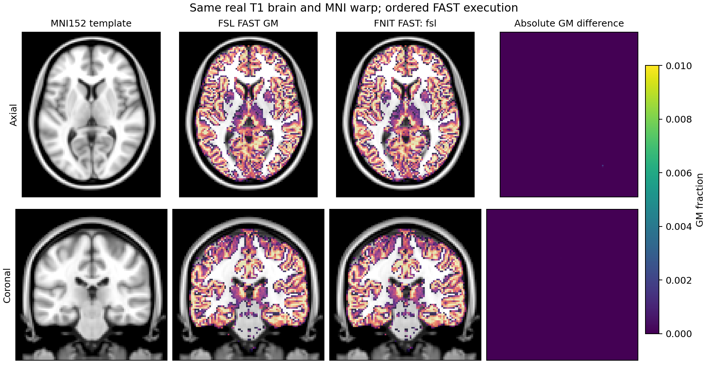

# FAST 当前真实输入对照

[功能说明](../../docs/fast/README.md) · [匿名完整报告](report.public.json) · [复现脚本](compare_fsl_execution.py)

2026-10-01，在同一真实 T1 脑图上对比原 FAST 与两种 FNIT execution。此输入来自 fMRI volume 配对实验的原 SynthStrip 脑提取结果，固定原脑图可隔离分割本身的差异。输入为 162×215×180，正脑区 1,397,628 体素；输入和八张原输出的 SHA-256 见报告，私有影像和路径留在服务器。

原参考为 FSL 6.0.7.22 安装中的 FAST4 2111.3 / h8c873e0_9。原命令使用单通道 T1、三分类、无先验及默认参数：

```bash
fast -t 1 -n 3 -I 4 -W 15 -O 4 -f 0.02 -l 20 -H 0.1 -R 0.3 \
  -b -B -o OUTPUT INPUT
```

## 本轮代码与验证范围

`execution="fsl"` 新增原位 HMRF / ICM 波前扫描、连续 glibc rand 流、NEWIMAGE 内部 radiological X 方向、原 bias 逐项卷积、float32 乘积与 double 矩归约、反复 float32 加步长的 PVE 网格。独立 `TorchFAST` 和 CLI 默认仍为 tensor，fMRI volume 显式选择 fsl。功能源码冻结为：

| 文件 | SHA-256 |
|---|---|
| `algorithm.py` | `b8eb36e776fe9631e94660a6784b469ddcfdf53753c9a4a75856970c067cedd1` |
| `pipeline.py` | `6fbbdc1f564cc5b700f6e462cc5bb09885ff20c46231d6bf9b8a72be0d0f28f4` |
| `_fsl_scan.py` | `03add4e07ec955995a833fd8adb8761d8278f3fec43abe3499f30fe4da58a643` |

[真实 T1 patch 控制](scan_kernel_control.public.json)中，12×13×14 patch 的五遍 Tanaka CPU 原序参照与 GPU 波前 max/RMSE 为 0，单次 ICM 的标签差为 0，bias 三轴卷积最大差为 0。此项验证 kernel 的依赖和算术，整脑 benchmark 使用下表的真实完整输入。

## 整脑精度与输出合同

同输入正脑区的统计：

| 输出 | tensor Pearson | fsl Pearson | fsl RMSE | fsl MAE | fsl 不同体素 |
|---|---:|---:|---:|---:|---:|
| CSF PVE | 0.990154817 | 0.999999993 | 4.476×10⁻⁵ | 2.003×10⁻⁷ | 28 |
| GM PVE | 0.982982153 | 0.999999992 | 5.350×10⁻⁵ | 2.862×10⁻⁷ | 40 |
| WM PVE | 0.993217329 | 0.999999998 | 2.930×10⁻⁵ | 8.586×10⁻⁸ | 12 |
| seg | 0.999875101 | 1 | 0 | 0 | 0 |
| pveseg | 0.989775560 | 1 | 0 | 0 | 0 |
| mixeltype | 0.897085965 | 1 | 0 | 0 | 0 |
| bias | 0.999999727 | 0.999999999994 | 5.351×10⁻⁸ | 2.418×10⁻⁸ | 287,368 |
| restore | 0.999999998789 | 0.999999999999983 | 5.580×10⁻⁵ | 2.556×10⁻⁵ | 334,254 |

三张 PVE 的 0.5 Dice 均为 1；GM/WM 的 0.8 Dice 为 0.999997362 / 0.999998670。剩余 PVE 最大差 0.01，对应极少数近等值离散候选；bias 最大差 1.192×10⁻⁷，restore 最大差 2.441×10⁻⁴。三张标签图在此例完全相同，八幅浮点和标签输出没有整体逐位相同的声明。

八图 shape、affine、dtype、qform/sform code 均与原输出相同。三张 PVE、bias、restore 为 float32；seg、pveseg、mixeltype 为 int32。所有结果仅覆盖本例单通道 T1 无先验默认路径。

## 时间和显存

| 实现 | 时间 | 范围 |
|---|---:|---|
| 原 FAST CPU，8 线程环境 | 149.998 s | 原独立进程，含启动和读写 |
| FNIT fsl，H100，CPU 线程 1 | 10.953 s | 已加载输入到八幅返回影像；构造、传输、计算 |
| FNIT tensor，同设备 | 2.006 s | 同上 |

FNIT 计时不包含输入读取、压缩 NIfTI 保存和指标计算；Triton 已有编译缓存，Torch allocated 峰值分别为 872.5 / 1264.2 MiB。服务器负载共享；较早同算法运行观测为 20.35 s，不据当前表计算稳定加速倍数。TF32 保持开启，顺序路径关键 double 累积有显式 dtype。CPU 的严格整脑调用没有额外测速。

原 FAST 退出码为 255；原连续实验已检查八个输出存在、完整且有限。这项异常在匿名报告中保留，计时属于该次原进程观测。FNIT 两个调用正常完成。

## 复现方法

将私有输入和原输出位置写入自己的 JSON，报告不保存这些路径：

```json
{
  "input": "/YOUR_DATA/T1_brain.nii.gz",
  "native": {
    "pve_0": "/YOUR_REFERENCE/T1_fast_pve_0.nii.gz",
    "pve_1": "/YOUR_REFERENCE/T1_fast_pve_1.nii.gz",
    "pve_2": "/YOUR_REFERENCE/T1_fast_pve_2.nii.gz",
    "seg": "/YOUR_REFERENCE/T1_fast_seg.nii.gz",
    "pveseg": "/YOUR_REFERENCE/T1_fast_pveseg.nii.gz",
    "mixeltype": "/YOUR_REFERENCE/T1_fast_mixeltype.nii.gz",
    "bias": "/YOUR_REFERENCE/T1_fast_bias.nii.gz",
    "restore": "/YOUR_REFERENCE/T1_fast_restore.nii.gz"
  }
}
```

```bash
PYTHONPATH=src python validation/fast/compare_fsl_execution.py \
  --manifest manifest.private.json --private-output work/fast \
  --report work/fast.public.json --device cuda:0 --execution fsl tensor
```

脚本在相同输入分别运行顺序和同步路径，保存八图至私有目录，输出匿名精度、几何、时间、显存和哈希报告。它只读取事先生成的原参考，不调用 FSL。复现时可选填 `native_wall_seconds`、`native_exit_code`、`native_software` 记录自己的原参考来源。

## 当前图与精度审计



此图将原 GM 与候选 GM 通过同一固定原 MNI pull 做三线性采样，不重新估计配准；仅公开模板空间派生 PNG。MNI GM r=0.999999994744，RMSE=3.37×10⁻⁵。图的哈希和匿名指标见[图报告](figures/metrics.json)，生成脚本为 [plot_template_comparison.py](plot_template_comparison.py)。

另外比较了初始化指数改用 float32 exp 的版本；该试验使三张 PVE r 降至 0.999976671 / 0.999949698 / 0.999970236，三个标签图出现 129 / 81 / 217 个差异。当前发布路径保留经目标二进制整脑控制验证的 double exp 后转 float32；源码声明和独立 C++17 overload 小控不能替代实际原构建行为。[试验匿名报告](initclass_expf_control.public.json)保留这一精度选择的证据，不作为当前实现 benchmark。
