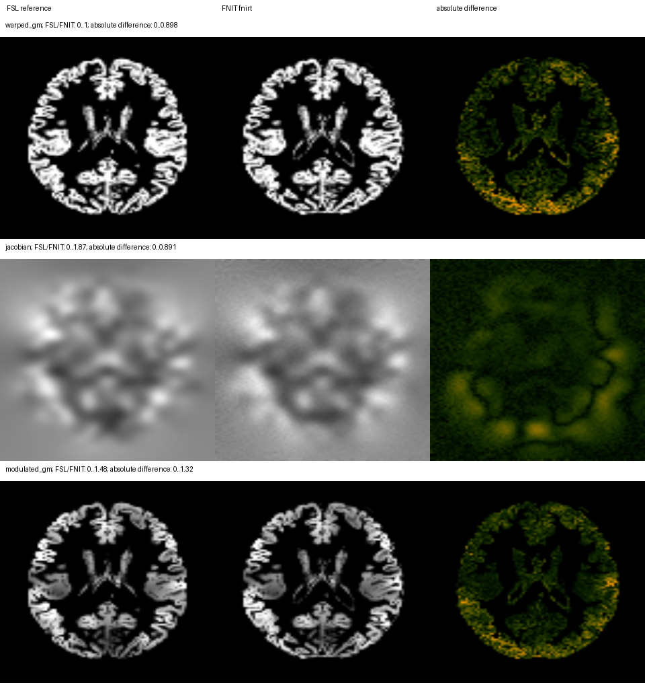
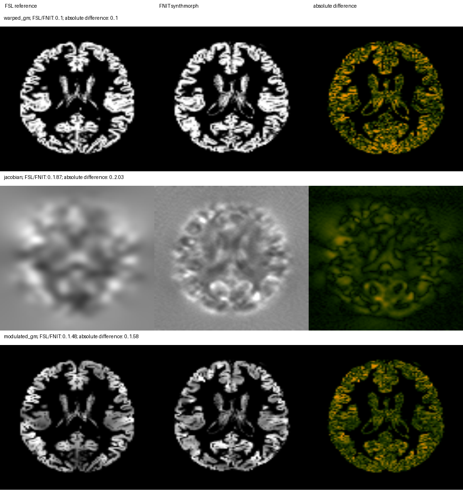

# FastVBM 全流程 benchmark

2026-10-02 的最新 FNIRT 完整 FastVBM、volume、dMRI 验收与完整 4D 重采样统一见[本轮报告](../registration_lossless_20261002/README.md)。以下记录按各自日期和源码保留。

[功能、参数与调用](../../docs/fast_vbm/README.md) · [匿名标量报告](e2e.public.json) · [复现脚本](validate_real.py)

2026-09-30 在 gpucw1 上用 `f958121` 的运行源码重跑一例真实临床 T1w，分别测试 FNIRT 和 SynthMorph 分支。两次均从原始 T1 开始，不传入 FSL GM 或仿射矩阵：SynthStrip → TorchFAST → TorchFLIRT → 非线性配准 → TorchApplyWarp → 非线性 Jacobian → 调制 GM → 保存全部结果。候选流程不调用 FSL 或 FreeSurfer。该提交的源码哈希见 JSON；后续文档和验证脚本更新不改变本次测量的算法。

测量后的 main 仅在公共包入口新增无关的 SuperBigFLICA 延迟导入分支；本次算法文件逐个哈希相同，核对范围见[源码继承记录](../pipeline_source_equivalence.public.json)。

## 与 FSL 的输出比较

参照是同一原始 T1、同一 UKB GM 模板的现存 FSL 6.0.7.4 结果。两侧最终输出网格一致；在相同显式 reference mask 的 292,019 个体素内计算指标。Dice 阈值为 0.2，MAE/RMSE 使用图像原有单位。

| 分支 | 输出 | Pearson r | MAE | RMSE | Dice |
|---|---|---:|---:|---:|---:|
| FNIRT | warped GM | 0.891026 | 0.088801 | 0.181672 | 0.908893 |
| FNIRT | nonlinear-only Jacobian | 0.885782 | 0.106748 | 0.168339 | — |
| FNIRT | modulated GM | 0.865489 | 0.111593 | 0.238367 | 0.904785 |
| SynthMorph | warped GM | 0.683659 | 0.183318 | 0.309883 | 0.810323 |
| SynthMorph | nonlinear-only Jacobian | 0.292743 | 0.237589 | 0.350736 | — |
| SynthMorph | modulated GM | 0.616679 | 0.229646 | 0.391512 | 0.806321 |

本例 FNIRT 分支更接近 FSL，但两分支都未达到数值等价。SynthMorph 是另一种非线性算法，其 Jacobian 与 FNIRT 的差异也会传到调制图。

FSL 前序流程包含裁剪、标准空间辅助脑提取和 FAST；FNIT 使用 SynthStrip 和 TorchFAST，并保留输入网格。两侧个体 GM 的网格不同，不能直接计算个体空间 PVE 的逐体素相关。这是完整流程比较，不是固定 FSL GM 后只测配准器。此前固定 GM 的隐式掩膜诊断不作为本版整链精度。

## 耗时与显存

| 测量范围 | FNIRT 分支 | SynthMorph 分支 |
|---|---:|---:|
| SynthStrip，包括首次模型加载 | 9.11 s | 9.04 s |
| TorchFAST | 10.67 s | 9.95 s |
| 仿射、非线性、重采样、Jacobian、调制及结果回传 | 875.98 s | 582.03 s |
| 全部计算，包括输入读取和首次权重加载 | 896.13 s | 601.35 s |
| 13 幅 NIfTI 与报告写盘 | 5.25 s | 5.30 s |
| 处理器构造至写盘完成的进程内总耗时 | 901.93 s | 607.16 s |
| 峰值 CUDA allocated，十进制 GB | 12.97 | 15.49 |

每个分支使用独立进程、4 个 CPU 线程和共享 H100，float32，TF32 开启。计时不含 Python 导入、预先加载参照、精度检查和绘图；CUDA 上下文初始化包含在进程内总耗时中，位于计算计时之前。没有重复测量，也没有单独分离 FLIRT 与非线性时间。

已核对该病例 FSL 原始 T1 完整链的既有命令计时：前序结构处理及 FAST 为 2339.56 s，GM `fsl_reg` 为 855.39 s，调制为 0.19 s，合计 **3195.14 s**。该合计覆盖所选连续命令，包含各命令内部的读写；不包含命令间脚本开销。它来自既有参照运行，不是本次同负载的整进程重跑。GDC 因缺少扫描仪系数而关闭。算法、时间边界和资源状态均不同，因此不计算端到端加速比。

## 输出检查

两分支均保存 13 幅影像和报告。全部影像的 shape、affine 分别匹配输入 T1 或 GM 模板，全部数值有限。在 TorchFAST 的有效区 `brain_mask > 0 且 brain > 0` 内，三组织 PVE 和的最大绝对误差为 0；保存后的 `modulated GM = warped GM × Jacobian` 最大绝对误差为 0。两分支均没有非正 Jacobian 体素。最终非线性 Jacobian 范围分别为 FNIRT 0.2662–5.4950、SynthMorph 0.2416–3.2305；正值检查不代表完整形变与 FSL 等价。

## 模板空间对照图

每幅图的列依次是 FSL、FNIT、绝对差；行依次是 warped GM、非线性 Jacobian、modulated GM。每行两端强度色阶相同，差值列使用独立色阶。图像是模板空间切面，不包含面部或病例标识。





## 自己的数据如何复测

先在独立参照环境生成匹配的 FSL VBM 输出，再在 FNIT 环境运行下面的单被试验证命令。影像、模板和 mask 的来源及方向必须相同。

```bash
python validation/fast_vbm/validate_real.py \
  --image /data/subject_T1w.nii.gz \
  --template /templates/template_GM.nii.gz \
  --reference-mask /templates/MNI152_T1_2mm_brain_mask_dil.nii.gz \
  --official-warped /reference/T1_GM_to_template_GM.nii.gz \
  --official-jacobian /reference/T1_GM_JAC_nl.nii.gz \
  --synthstrip-weights /models/synthstrip.1.pt \
  --synthmorph-weights /models/synthmorph.deform.3.h5 \
  --backend fnirt --device cuda:0 --threads 4 \
  --output-dir /results/fnit-vbm \
  --report-out /results/vbm.private.json \
  --figure-out /results/vbm.png \
  --source-root /path/to/Fudan-Neuroimaging-toolkit
```

该命令运行完整 FNIT 流程、保存全部影像，比较三张模板空间图并生成参照/FNIT/绝对差切面图。`--backend synthmorph` 测试另一分支；FNIRT 不使用 deform 权重，可省略 `--synthmorph-weights`。可选 `--official-native-gm`、`--official-brain-mask` 先检查网格，仅在网格一致时比较上游结果。各路径是使用者自己的文件；验证脚本没有内置批量调度。

经数据持有者确认发布权限，GitHub 发布匿名标量、输入/输出与代码哈希及去标识化的模板空间 PNG。原始影像、逐体素输出和含私有路径的运行日志留在服务器。单独分支报告见 [FNIRT](fast_vbm_fnirt.public.json)、[SynthMorph](fast_vbm_synthmorph.public.json)，FSL 既有链的计时与来源见[参照报告](fast_vbm_fsl_reference.public.json)。
