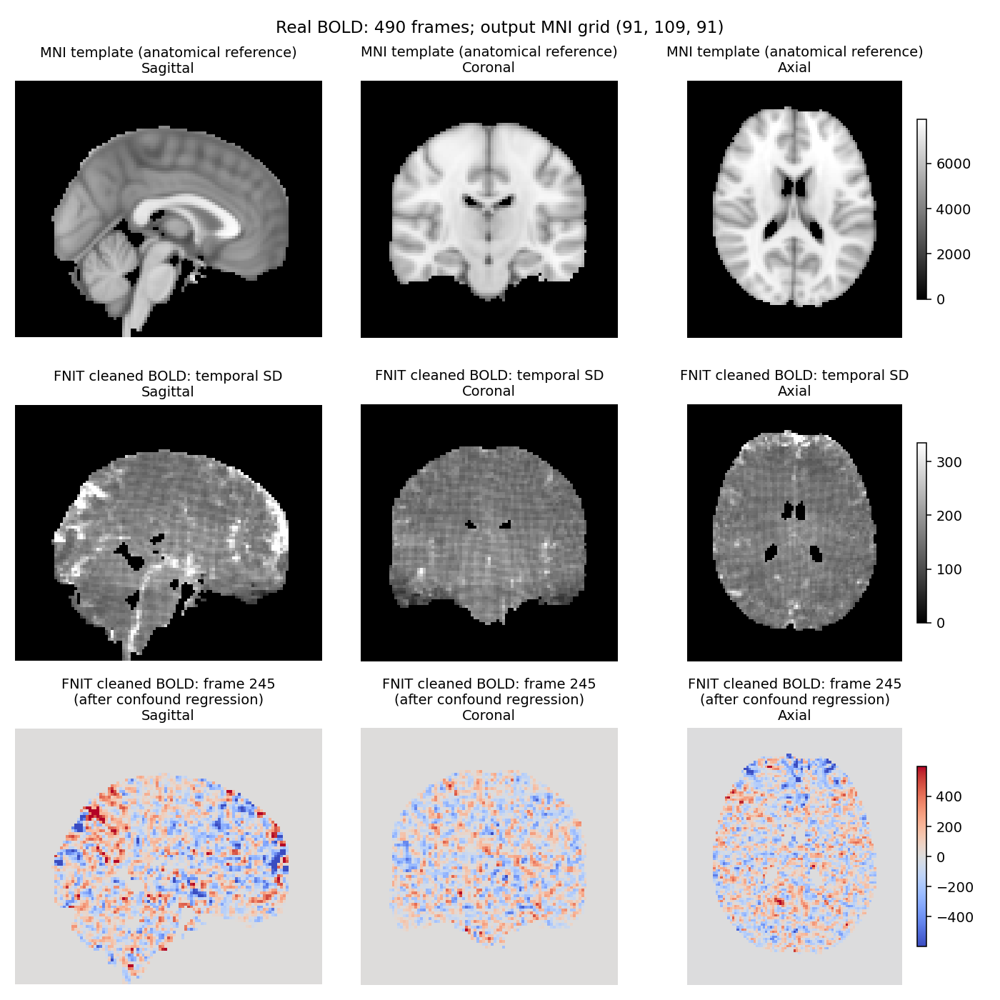

# fMRI volume 与 surface 全流程 benchmark

[volume 用法](../../docs/fmri/README.md) · [surface 用法](../../docs/fmri/surface.md) · [单被试测量脚本](benchmark_bids.py) · [FNIT / DeepPrep 实测对照](deepprep/README.md)

2026-10-01 使用 `3b9b0f8`，重新测量合并最新 FLIRT、BBR 和缓存更新后的完整 volume。surface 的完整测量来自 2026-09-30 的 `3f8b756`，两次分别报告，不相加为新的整链总时间。

两次均使用一例真实 UKB：BOLD 88×88×64×490、TR 0.735 s、同次 SBRef；T1 来自匹配重建存档 `orig/001.mgz`，nibabel 转换逐体素无误差，更早的结构预处理未核对。surface 使用既有皮层几何，不计 recon-all。资源许可及来源见[记录](assets_input_preflight.public.json)，权重大小和 SHA-256 见[权重检查](volume_fixed_weights.public.json)。

## 完整 API 实测

| 项目 | volume：2026-10-01 | surface：2026-09-30 |
|---|---|---|
| 运行提交 | `3b9b0f8` | `3f8b756` |
| 起点 | 原始 BOLD/SBRef、存档 T1 输入；新目录、未命中解剖缓存 | 9 月 30 日 volume 派生文件与既有表面 |
| 处理 | SynthStrip、FEAT、FAST、BBR、SynthMorph、PICA/AROMA、WM/CSF/24 项运动回归、MNI 重采样 | EPI→T1w、MSMSulc、ribbon 投影、fsLR32k 与皮层下组装 |
| 输出 | 原生 88×88×64×490；MNI 91×109×91×490 | 每侧 490×32,492；CIFTI 490×91,282 |
| API 墙钟，含最终写盘 | **551.07 s** | **905.71 s** |
| 验证进程墙钟 | 578.85 s | 912.06 s |
| CUDA allocated / reserved，十进制 GB | 13.30 / 16.96 | 0.73 / 1.26 |
| 检查 | float32、全部有限、TR/网格一致、MNI 掩膜外为零 | GIFTI/CIFTI 有限、JSON/TR 正确、90,572 个非常数灰质坐标 |
| 报告 | [当前 volume](fmri_volume.public.json) | [surface](fmri_surface.public.json) |

共享 H100、8 个 CPU 线程、float32/TF32，各一次冷调用。API 排除测量脚本的预先导入、预先哈希及 CUDA 上下文初始化与事后检查，包含首次权重加载及最终保存。volume 捕获额外复制耗时 1.798 s 已从 API 与总阶段时间扣除；FEAT、AROMA、MNI 的阶段计时也扣除相应复制。解剖内部阶段计时已在复制前停止，因此 anatomical_capture 的 0.129 s 只从 API/total 扣除。完整验证进程保留这些开销，见[独立检查](volume_fixed_contract.public.json)。

FNIT volume 不调用 FSL、FreeSurfer、fMRIPrep；surface 投影和组装使用 Workbench，球面配准使用 FNIT HOCR/FastPD。新解剖缓存 `reused=false`，BBR 为 `batched`，完整 benchmark 只覆盖 SynthMorph 分支。独立 FNIRT、BBR 冷/热测量见[配准报告](registration_gpu.current.public.json)。

| 当前 volume 阶段 | 秒 |
|---|---:|
| EPI / T1 SynthStrip | 6.05 / 6.29 |
| 模板准备 / 冷缓存查找 | 0.07 / 4.10 |
| TorchFAST | 2.92 |
| FEAT 核心 | 294.46 |
| T1→MNI 仿射 / 非线性 / 场转换 | 5.74 / 6.85 / 0.49 |
| BBR 初始化 / 精化 / 输出采样 | 2.75 / 1.04 / 0.07 |
| 原生组织掩膜 | 0.21 |
| PICA、AROMA 与混杂回归 | 168.17 |
| MNI 重采样 | 45.53 |
| API 总时间 | 551.07 |

同病例 `3f8b756` 的 API 为 1719.19 s，BBR 与 T1→MNI 为 1186.44 s；当前对应配准合计 16.94 s。负载与冷启动边界不同，这些单例观测不用于稳定加速比。当前 ICA 为 95 个成分，55 次迭代收敛，52 个 AROMA 噪声成分。新旧 pre-ICA 不再逐值相同，时间 r 中位数为 0.999386；最终差值包含预处理、配准、ICA 与回归变化。

## 修复与最终图比较

量纲秩截断、浮点边界置零、可选原生组织掩膜、AROMA-only surface 输入及配置/来源记录均已修复。212 项目标测试通过；最初 3 项因快照漏带 benchmark tool 失败，补入相同提交的原文件后通过，计算和接口测试未失败，见[测试记录](volume_fixed_tests.public.json)。真实全脑回归对独立 float64 参考 RMSE `5.237e-6`，见[修复验证](volume_fixed.md)。

| 控制，逐体素 490 帧时间 Pearson r | 均值 | 中位数 |
|---|---:|---:|
| 新 / 旧 FNIT 原生清理图 | 0.934004 | 0.946607 |
| 新 / 旧 FNIT MNI 清理图 | 0.933565 | 0.943486 |
| 新 FNIT / 官方 UKB 原生图 | 0.426345 | 0.499333 |
| 新 FNIT / 官方 UKB 完整 MNI 图 | 0.271534 | 0.229497 |
| 两侧清理图，固定同一 FNIT warp | 0.472114 | 0.561490 |
| 同一官方清理图，FNIT / 官方 warp | 0.488609 | 0.526425 |

MNI 参照文件 `ukb_fix_mni2mm.nii.gz` 由 UKB 发布的原生 `filtered_func_data_clean.nii.gz` 与官方 `example_func2standard_warp.nii.gz`，通过原版 FSL `applywarp --interp=spline` 生成，使用 FSL 的 MNI152 T1 2 mm 模板和脑掩膜。它不是发布 ZIP 中直接提供的同名 MNI 文件；网格为 91×109×91×490，TR 0.735 s，完整 SHA-256 见比较报告中的 `mni.input_sha256.official_fix_official_warp`。

原生为 96,009 个共同非常数体素；MNI 为新旧输出掩膜交集中的 220,863 个共同非常数体素。UKB 官方使用 FIX、GDC/B0 和官方配准，本流程选择 ICA-AROMA，候选无 GDC/B0。表格报告处理差异，时间 r 不是去噪质量标准。新旧 MNI→EPI 采样位置变化中位数 0.115 mm、p95 0.202 mm；对官方完整 MNI 的相关性接近上一版 0.273070。[比较报告](volume_fixed_comparison.public.json)包含哈希与定义。

当前 warp 首 8 个真实帧对 FSL `applywarp --interp=spline`，脑内 r=0.99999999993、RMSE=0.002063。FSL 返回 255，完整输出通过 CRC、网格、有限值、TR 和掩膜检查，原退出码保留于[报告](volume_fixed_resampling.public.json)。这检验固定场插值；此前 490 帧插值和 SD 格纹控制见[专门验证](resampling.md)。

## 当前 FEAT 与 FSL 的同输入精度

候选取自上面这次完整 volume 的 pre-ICA 输出，而非旧缓存。参照是同一原始 BOLD/SBRef 的 FSL 6.0.7.22 逐条原版程序输出。两侧均未估计或应用 GDC/B0 校正。比较掩膜是两个最终 EPI 掩膜的交集；4D r 保留时间均值，时间 r 在每个体素的 490 帧内计算。

| 指标 | 结果 |
|---|---:|
| FNIT / FSL / 交集掩膜体素 | 97,345 / 113,881 / 96,774 |
| 掩膜 Dice | 0.916308 |
| filtered 4D Pearson r | 0.996419 |
| MAE / RMSE，归一化强度单位 | 423.379 / 556.808 |
| 去掉逐体素时间均值后的 pooled r | 0.944863 |
| 逐体素时间 r 中位数 / 均值 | 0.966773 / 0.950993 |

shape、affine 和全体素有限值检查通过。[当前标量](feat_current.public.json)和[独立比较脚本](compare_feat.py)记录完整定义。该参照保留 MCFLIRT `-spline_final`、BET/阈值掩膜、grand-mean 缩放及 100 s 高通；原 FSF 没有 slice timing、空间平滑或低通。FNIT 使用 SynthStrip 掩膜和自身运动求解器，两个步骤存在差异。

原 `feat` 启动器在该环境返回 255，正式参照按 `featlib.tcl` 逐条执行 MCFLIRT、BET、fslstats 和 fslmaths，并检查输出完整性。[参照脚本](official_feat_no_gdc.sh)保留命令；独立验证环境才需要 FSL。既有 FSL 计时中 MCFLIRT 为 397.54 s，其余已计时影像命令为 428.12 s，两次 fslstats 未单独计时；825.66 s 是分步耗时下界，不是完整 FSL/UKB fMRI 总时间。不能把它与 551.07 s 的完整 FNIT volume 时间相除。

最终去噪使用 ICA-AROMA 加可选混杂回归。与真实 UKB FIX 发布文件的最终图差异见上表；FEAT 同输入参照只验证前处理部分。

## 固定 volume 的 surface 球面对照

MSMSulc 当前源码、同配置官方单线程参照、双侧球面角差及 490 帧逐灰质坐标时间相关见 [MSM 验证页](../msm/README.md)。球面配准耗时和历史完整 surface API 耗时分别记录，不合成新的整链时间。

固定官方注册球面时，FNIT 的 Workbench 投影对独立命令回放、CIFTI 组装对 niworkflows 源码均逐值一致；[固定球面报告](surface_fixed_sphere.public.json)保留这项算子验证。它不衡量 FNIT 自己估计球面的准确度。

## 示例图

图的三行依次是 MNI 解剖模板、FNIT 清理后 BOLD 时间标准差、一个清理后的时间点。回归去掉截距后时间均值接近零；模板用于定位，不是官方清理后 BOLD。每行共用色阶，切面为同一模板网格的中间位置。



## 单被试如何复测

先安装主页 Conda 环境、部署权重，并准备实际 BIDS、MNI 模板、HCP 表面资源和匹配的重建存档。以下命令先生成完整 volume，再让 surface 读取刚生成的派生数据；每次使用新输出目录。

```bash
python validation/fmri/benchmark_bids.py volume \
  --bids-root /data/bids --derivatives-root /results/fnit \
  --subject 0001 --mni-template /templates/MNI152_T1_2mm.nii.gz \
  --mni-brain-mask /templates/MNI152_T1_2mm_brain_mask.nii.gz \
  --synthstrip-weights /models/synthstrip.1.pt \
  --synthmorph-weights /models/synthmorph.deform.3.h5 \
  --device cuda:0 --threads 8 \
  --source-root /path/to/Fudan-Neuroimaging-toolkit \
  --source-revision YOUR_COMMIT \
  --report-out /results/volume.private.json

python validation/fmri/benchmark_bids.py surface \
  --bids-root /data/bids --derivatives-root /results/fnit --subject 0001 \
  --recon-all /data/matching-reconstruction \
  --hcp-assets-dir /templates/hcp --wb-command wb_command \
  --device cuda:0 --threads 8 \
  --source-root /path/to/Fudan-Neuroimaging-toolkit \
  --source-revision YOUR_COMMIT \
  --report-out /results/surface.private.json
```

`YOUR_COMMIT` 填写实际运行代码的 Git 提交号。脚本调用公开单被试 Python API，记录 API 时间、GPU 峰值和输出检查；不会调度其他被试。volume 示例启用三类混杂回归、默认 SynthMorph；`--registration-backend fnirt` 选择 T1 FNIRT 配置，本页新的完整链计时只覆盖 SynthMorph。surface 示例估计 FNIT 球面；`--registered-spheres LEFT RIGHT` 是固定球面控制，跳过 MSMSulc 估计，不应当作默认 surface 时间。

两份同轴 CIFTI 可用 `compare_cifti.py --candidate ... --reference ... --report-out ...` 比较；`render_surface.py` 接收这两份文件和公开标准双侧 fsLR32k 球面，可生成逐顶点时间相关图。

新旧与官方时间标准差图见[volume 用法页](../../docs/fmri/README.md)，由 `render_volume_comparison.py` 在同一网格、同一色阶生成。volume 图示可用 `render_volume.py --bold ... --mask ... --template ... --figure-out ...` 生成。FEAT 中间结果只在公开 volume API 的临时目录存活；`compare_feat.py` 接收事先保存的候选与官方 FEAT 目录，不把最终清理图误当成 pre-ICA 图。官方和 FNIT 都应使用同一 raw BOLD/SBRef 和校正配置。

## 其他阶段参照

[BBR/T1 FNIRT 独立配对](registration_gpu.current.public.json)、[PICA](pica_summary.json)、[固定运动矩阵的插值](motion_spline_summary.json)与[MCFLIRT 求解差异](mcflirt_difference.public.json)采用各自注明的固定输入和参数，不能替代 `3b9b0f8` 完整 volume 的最终图比较。surface 的历史完整 API 测量仍对应该次输入；最新 MSMSulc 与固定 volume 投影另见 [MSM 验证页](../msm/README.md)。本次未重跑 MS-HBM。

## 独立 BBR/FNIRT 与解剖缓存测量

以下为 `8dbeea64` 更新的真实单病例测量，与上面 `3b9b0f8` 的完整 SynthMorph volume 分开。函数钟包含输入解压与 CPU 结果转换，排除最终写盘和事后精度计算。首次调用前已初始化 CUDA，未清空 Triton 磁盘缓存。完整定义与源码哈希见[独立配准报告](registration_gpu.current.public.json)。

| 同输入范围 | 首次 / 热调用 | 对官方参照的结果 |
|---|---:|---|
| BBR，固定 FSL WM/init | 3.581 / 1.409 s | 影像 r 0.99999970；逆变换位移 RMS 0.00260 mm。 |
| FNIT FAST＋FLIRT＋BBR | 6.932 / 5.072 s | 影像 r 0.9997382；逆变换位移 RMS 0.07203 mm。 |
| T1 FNIRT，固定 FSL affine/模板掩膜 | 32.595 / 30.422 s | warped T1 r 0.99771788；完整 pull 位移中位数 / p95 0.05176 / 0.23294 mm。 |
| 解剖准备，FNIT FLIRT＋FNIRT；第二次命中缓存 | 41.118 / 0.0785 s | 输出产物 SHA-256 相同；第二次仅核验并复用。 |

默认 `reuse_anatomical=True` 只复用同一 T1、模板、权重、配置、实现和环境的完整解剖产物，逐 run 的 BBR/EPI/BOLD 步骤仍独立计算。`reuse_anatomical=False` 或 CLI `--no-anatomical-cache` 可强制重算；细节见[volume 输出与缓存说明](../../docs/fmri/README.md#输出)。当前缓存测试使用 FNIRT，不代表 SynthMorph volume 整链重复运行。单函数计时不能替换完整 API 时间；当前 BBR/FNIRT 精度仍保留上表所示的官方差值。

## 配准冷/热调用与 profile 复测

[`tools/benchmark_registration_gpu.py`](../../tools/benchmark_registration_gpu.py)读取服务器本地的 JSON 输入清单，不启动 FSL。官方参照需先按 [BBR](../../docs/fmri/bbr.md#官方同输入命令)或 [FNIRT](../../docs/fnirt/README.md#python-与命令行t1w-专用预设)命令生成。影像、矩阵、warp 和含私有路径的清单留在本地；`report.safe.json` 只含汇总指标、环境和实现源码哈希。

BBR 的清单字段为 `epi`、`t1`、`wmseg`、`init`、`official_matrix`、`official_moved`，值均为相应文件的绝对路径；`init` 必须是 normmi 初始矩阵，不能填官方最终 BBR 矩阵。FNIRT 使用 `moving`、`reference`、`reference_mask`、`affine`、`official_warped`、`official_coeff`；`affine` 是 input→reference 的 FSL scaled-mm 初始矩阵。可再提供 `official_jacobian`（官方 `jout`）及 `official_pull_x/y/z`（官方 `applywarp` 重采样的 input RAS world 坐标图）。

```bash
# --source-root：待测试源码，独立 before/after 快照各执行一次。
# --case-json：含本地真实输入与同输入官方参照的清单。
# --output-dir：新的私有结果目录；计时结束后才保存图像和矩阵。
# --function：bbr 固定 WM/init；bbr_chain 自行运行 FAST 和 FLIRT；fnirt 使用 T1 六级预设。
# --warm-repeats：首次调用后重复次数；首次所需的 JIT 编译/加载计入该调用。
python tools/benchmark_registration_gpu.py \
  --source-root /path/to/Fudan-Neuroimaging-toolkit \
  --case-json /private/cases/bbr.json --output-dir /private/results/bbr-timing \
  --function bbr --bbr-execution batched --warm-repeats 1

python tools/benchmark_registration_gpu.py \
  --source-root /path/to/Fudan-Neuroimaging-toolkit \
  --case-json /private/cases/fnirt.json --output-dir /private/results/fnirt-timing \
  --function fnirt --affine-geometry header_pixdim \
  --fnirt-execution optimized --warm-repeats 1

# profile 与性能计时分开运行；profile 的插桩开销不进入速度表。
python tools/benchmark_registration_gpu.py \
  --source-root /path/to/Fudan-Neuroimaging-toolkit \
  --case-json /private/cases/fnirt.json --output-dir /private/results/fnirt-profile \
  --function fnirt --affine-geometry header_pixdim \
  --fnirt-execution optimized --profile-only --profile-full
```

`--bbr-execution reference`、`--fnirt-execution reference` 对照同一修正算法的原执行路径。完整链用 `--function bbr_chain --wm-header reference` 保留 WM 的 T1 header。`--affine-geometry affine_norm`、`--wm-header legacy` 用于复测明确注明的旧快照，不能与新 header 契约混用。`--fnirt-blur-reference`、`--fnirt-bending-reference` 仅用于定位单个执行改动，不是降低搜索或迭代的 fast mode。

“冷”指该进程首次函数调用，“热”指随后调用；未清空 Triton 磁盘缓存，CUDA 上下文初始化在函数计时前。墙钟包含函数内 ArrayProxy 读入/解压与 CPU 结果转换，排除输出写盘和事后精度计算。profile 汇总 kernel、H2D/D2H、CUDA 同步 API 与成本求值次数；嵌套阶段钟是无额外 GPU fence 的 CPU wall，不能把它们都相加。`nvidia-smi` 利用率属于整张共享 GPU，不能当作本进程利用率；kernel 累计时间也不等于独占 wall。公开前应再次核对本地报告载荷。

经数据持有者确认发布权限，仅公开匿名标量、代码及文件哈希和去标识化的 PNG。原始 NIfTI、MGZ、皮层几何、逐体素时序及含私有路径的日志不进入仓库。
