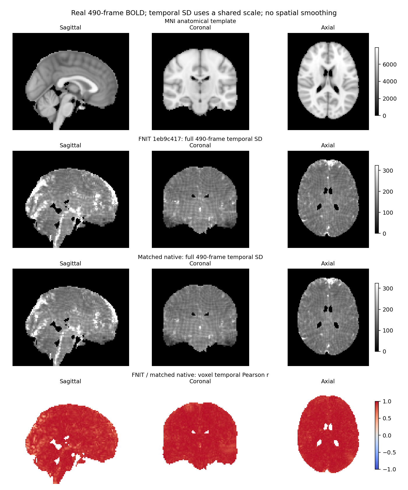

# fMRI volume 与 surface 验证

[volume 用法](../../docs/fmri/README.md) · [surface 用法](../../docs/fmri/surface.md) · [单 run 测量脚本](benchmark_bids.py)

## 当前完整 volume

2026-10-01，冻结源码 `1eb9c417` 从一例真实 UKB BOLD/SBRef 和匹配的存档 T1，完整运行 FNIRT 分支，与原 SynthStrip/FSL/ICA-AROMA 按相同步骤比较。全部 490 帧，TR 0.735 秒；100 秒高通、non-aggressive AROMA、WM/CSF/Friston-24，不使用 GDC/B0、FIX 或空间平滑。

| 逐体素 490 帧时间 Pearson r | 均值 | 中位数 |
|---|---:|---:|
| 运动校正 BOLD | **0.999578** | 0.999834 |
| pre-ICA BOLD | **0.999356** | 0.999770 |
| 原生最终 clean BOLD | **0.940704** | 0.951029 |
| MNI 最终 clean BOLD | **0.938768** | 0.947436 |

FNIT API 含最终保存为 **1318.04 s**，验证进程为 1372.24 s；原连续链为 **2570.47 s**，验证进程为 2601.72 s。双方不复用解剖缓存。共享 H100/8 线程，原 SynthStrip 用 GPU，原 FSL 用 CPU；FNIT allocated/reserved 为 8.316/9.745 GB。FNIT 已扣除中间捕获复制 27.05 s，原链仍包含阶段验证及 MELODIC HTML，计时边界不同。

[完整报告与原命令](matched_native.md) · [数值比较](matched_pipeline.public.json) · [FNIT 调用](matched_fnirt_volume.public.json) · [输入/输出及源码核对](matched_fnirt_contract.public.json) · [原连续链](matched_native_pipeline.public.json)。当前结果尚未逐体素等价；固定同一 warp 的清理图 r 均值约 0.9449，固定同一数据仅换 warp 约 0.9935，固定原场 sampler 为 0.999999999921。



## 子函数专项控制

| 功能 | 固定输入真实控制 | 输入范围与时间 |
|---|---|---|
| [SynthStrip](../../docs/synthstrip/README.md) | 原 1 mm LIA/网络输入逐元素相同，同预测回采样 mask 相同；独立 GPU 推断有少量边界差异 | SBRef/T1，控制 7.61/4.83 s，排除 conform 与写盘；另有模板脑图。 |
| [TorchMCFLIRT](../../docs/mcflirt/README.md) | 完整 490 帧 GPU motion r 均值 0.999578；pull RMS 均值 0.00881 mm | CPU 490 帧只估计 387.60 s；GPU 运动未从 FEAT 973.12 s 单独分离；有原/本包均值、SD、r 脑图。 |
| [TorchFAST](../../docs/fast/README.md) | 三张 PVE r≥0.999999991，三张分类图逐体素相同 | 同一原 T1_brain；GPU 八图调用 10.95 s，排除读取和 gzip 写盘；有 MNI GM 图。 |
| [MELODIC](../../docs/melodic/README.md) | 95 成分/40 步；时间/空间配对 r 中位数 0.999999978/0.999999970 | 同一原 filtered/mask；拟合与写出 117.49 s；有原/本包 IC 图。 |
| ICA-AROMA | 固定新 ICA、原 motion/BBR/FNIRT，95 个信号/噪声标签全匹配 | [控制报告](aroma_corrected_ica_control.public.json)，与各自输入的完整链分类分开。 |

## surface 的现有范围

surface 测于 2026-09-30 `3f8b756`，从该次 volume 派生图和已有皮层几何开始，包含 EPI→T1、MSMSulc、ribbon 投影、fsLR32k 与皮层下组装，不计 recon-all。API 为 905.71 s、验证进程为 912.06 s，CUDA allocated/reserved 0.73/1.26 GB；每侧 490×32,492，CIFTI 490×91,282，时间轴及 BrainModel 轴正确。本轮未重跑 surface/MS-HBM，不能与当前 volume 时间相加。

固定 volume、只替换官方 newMSM 球面的对照，左/右皮层时间 r 均值为 0.940496/0.941404，皮层下逐值相同。参照来自 HCP v4.7.0 MSMSulc 配置；投影与组装仍用同一 FNIT 路径，不是完整 fMRIPrep 原生重跑。范围、结果和图示见[surface 用法](../../docs/fmri/surface.md)、[测量](fmri_surface.public.json)、[球面对照](fmri_surface_comparison.public.json)。其他处理协议的 [DeepPrep 对照](deepprep/README.md)另列输入与计时范围。

## 单被试复测

安装主页 Conda 环境和权重，准备真实 BIDS、MNI 模板及脑掩膜。以下命令完整处理一个 run，关闭解剖缓存，保存匿名 benchmark 报告；含路径的派生 JSON/日志应留本地。

```bash
python validation/fmri/benchmark_bids.py volume \
  --bids-root /data/bids --derivatives-root /results/fnit-new \
  --subject 0001 --mni-template /templates/MNI152_T1_2mm.nii.gz \
  --mni-brain-mask /templates/MNI152_T1_2mm_brain_mask.nii.gz \
  --synthstrip-weights /models/synthstrip.1.pt \
  --registration-backend fnirt --no-reuse-anatomical \
  --device cuda:0 --threads 8 \
  --source-root /path/to/Fudan-Neuroimaging-toolkit --source-revision YOUR_COMMIT \
  --report-out /results/volume.public.json
```

`YOUR_COMMIT` 填真实源码提交号；每次使用新输出目录。原软件使用[独立连续驱动](run_native_matched_pipeline.py)，完整参数和比较方法见[对照报告](matched_native.md)。处理第二个被试时由调用者自行再次调用单被试接口。

surface 读取已完成的 volume，并需要匹配的重建与 HCP 表面资源。下面的命令包含表面估计和重采样；recon-all 不在其计时中：

```bash
python validation/fmri/benchmark_bids.py surface \
  --bids-root /data/bids --derivatives-root /results/fnit-new --subject 0001 \
  --recon-all /data/matching-reconstruction --hcp-assets-dir /templates/hcp \
  --wb-command wb_command --device cuda:0 --threads 8 \
  --source-root /path/to/Fudan-Neuroimaging-toolkit --source-revision YOUR_COMMIT \
  --report-out /results/surface.public.json
```

`--registered-spheres LEFT RIGHT` 用于固定球面控制，跳过 MSMSulc，不能称默认完整 surface 耗时。原影像、时序、被试几何和私有路径不进入仓库；公开内容是匿名统计、SHA-256 和获授权的模板空间 PNG。
