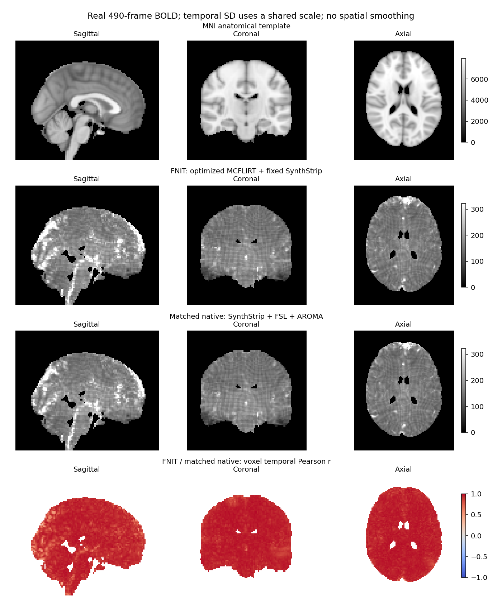

# fMRI volume 与 surface 验证

[volume 用法](../../docs/fmri/README.md) · [surface 用法](../../docs/fmri/surface.md) · [MSM 用法](../../docs/msm/README.md)

当前最新完整 volume 为 `cfb7beee` 的 FNIRT preproc＋clean，公开 API **707.287 s**；运动校正与冻结 FNIT 逐值相同，完整 MNI clean 对原同步骤软件的时间 r 均值 **0.939162**。下文保留此前固定 fMRIPrep 25.2.4 的 preproc/surface 控制：原始强度 `preproc`、单次插值、真实 midthickness/graymid、fsLR32k 投影及 91k CIFTI。`clean` 继续提供 ICA-AROMA、混杂回归和时间滤波；MSM 与固定共同球面控制保留各自来源，本次 volume 更新没有重新测量 surface。

## 对照范围

| 检查 | 输入与参照 | 结论的范围 |
|---|---|---|
| 最新完整 FNIRT volume | 同一真实 490 帧 BOLD/SBRef/T1；原同步骤 clean 链与冻结 FNIT | [完整 API、精度和边界](mcflirt_optimization.md)；运动对冻结 FNIT 逐值同，独立完整 clean 并非逐值同 |
| 单次空间插值 | 固定仿射、逐帧运动和空间变化的 pull；SciPy 三次 B 样条 `grid-constant` | 插值坐标合成与边界条件；CPU/GPU 最大误差低于 1e-6 的数值控制 |
| T1w 原生 BOLD 分辨率网格 | 三种轴方向与斜切网格；固定 Nilearn 0.11.1 的参考网格 | 数组逐值一致，保存 affine 误差不超过 7.6e-7 mm |
| CIFTI 组装 | 两帧索引信号与锁定 NiWorkflows 1.14.4 | 数值、BrainModelAxis、SeriesAxis 和内嵌 metadata 一致；不代表真实投影精度 |
| 全帧固定输入投影 | 490 帧真实 `preproc`、共同几何与球面；镜像中实际 fsLR/grayords 工作流 | 两侧 GIFTI 和 CIFTI 逐值相等；不检验变换估计与球面配准 |
| 切片时间校正 | 固定镜像 AFNI 的 Fourier 校正与 PyTorch；默认关闭，另做显式开启控制 | [合成数值控制](fmriprep/stc_control.public.json)和[真实全 490 帧 CPU 报告](fmriprep/stc_real_full490.public.json)；真实最大误差门禁未通过 |
| 固定官方镜像 | 用户提供的 25.2.4 SIF、实际安装源码与二进制 | [镜像记录](fmriprep/reference_image.public.json)、[安装源码校验](fmriprep/installed_sources.public.json) |

最新 FNIRT volume、原同步骤 clean 和冻结 FNIT 比较固定到 `cfb7beee`，见[本次报告索引](mcflirt_optimization.md#最近版本与报告索引)。此前 SynthMorph/preproc 的完整测量固定到 `50eb098`/`ca3df003`，`1eb9c417` 的 clean/FNIRT 与组件对照保留为历史，分别记录源码 SHA、协议和计时范围。此前 surface 实测覆盖的 103/106 个模块字节一致；其余三个文件继承当时 main，固定球面控制未运行 MSM 估计。该次 volume 的 102/106 个模块一致，另含其未调用的 surface 来源路径补丁；逐文件差异见[历史发布源码回溯](fmriprep/publication_runtime_provenance.public.json)。旧 `c3c921c`/`bac3c395` 的结果也保留为历史快照。

真实全帧验证使用同一例 88×88×64×490 BOLD、TR 0.735 s、同次 SBRef 和逐体素一致的 T1 重建输入。当前 FNIT API/CLI 默认关闭 STC；历史页的两次 FNIT volume 均开启 STC，参考位置为 0.5，关闭 SDC，保留全部 490 帧。固定投影实验直接共用已有 `preproc`，不重新执行 STC。首次官方原始 BIDS 运行关闭 STC，因旧版 FreeSurfer 重建缺少新版所需文件而失败；它不构成整链对照。官方流程只用于生成参照，FNIT 运行时不调用它。

显式开启 STC 的真实 CPU 控制比较了全部 **242,851,840** 个数值，最大绝对误差为 **0.021484375**、RMSE 为 **0.00014754**，原最大误差门槛 **0.01 仍未通过**。该结果不支持与 AFNI 严格等价，也不属于默认 STC 关闭的完整流程计时；详细参数、源码与输入/输出哈希见[真实 STC 报告](fmriprep/stc_real_full490.public.json)。

## 最新完整 FNIRT volume（`cfb7beee`，STC 关闭）

一例真实 UKB BOLD `88×88×64×490`、TR 0.735 s，采用 optimized FNIRT、batched BBR、融合 cost 输入准备的 MCFLIRT，以及 100 秒高通/nonaggr AROMA/WM/CSF/24 参数运动回归。公开 API **同时生成 preproc 与 clean**；默认关闭 STC，未做 SDC/GDC。新 derivatives 目录未命中解剖缓存，8 个 CPU 线程、float32/TF32、20 GB CUDA 额度。见[最新 API](mcflirt_optimization_api.public.json)。

| 最新范围 | 实测 |
|---|---:|
| **公开 volume API，含最终输出保存** | **707.287 s** |
| FEAT：运动、采样、掩膜准备、缩放、高通与阶段输出 | 177.787 s |
| PICA＋AROMA＋混杂回归 | 163.092 s |
| clean MNI 重采样 | 50.424 s |
| T1w＋MNI preproc 单次插值与该阶段输出 | 251.851 s |
| 验证捕获复制，已扣除 | 26.658 s |
| 当前进程 CUDA allocated / reserved，十进制 GB | **6.503 / 10.775** |

四份 BOLD 均全部有限、float32，保留全部 490 帧及 TR。T1w preproc 为 `59×75×64×490`；MNI preproc/clean 为 `91×109×91×490`，原生 clean 为 `88×88×64×490`。ICA 为 95 成分、43 次迭代、47 个噪声成分。API 不含输入哈希和事后比较；内部 `total` 694.390 s 的最终发布边界不同，不能靠阶段相减构造另一范围的实测时间。

| 与原同步骤 clean 链，逐体素时间 r | 均值 / 中位数 | RMSE |
|---|---:|---:|
| motion | **0.999578 / 0.999834** | 8.211 |
| pre-ICA | 0.999356 / 0.999770 | 11.745 |
| 原生 clean | 0.941029 / 0.951576 | 78.031 |
| MNI clean | **0.939162 / 0.947900** | 62.025 |

[最新原软件比较](mcflirt_optimization_native.public.json)按各阶段共同掩膜计算完整 490 帧时间 r，MNI 域为 224,707 体素；排除去均值 RMS≤1e-6 的时序，不另拟合尺度、偏移或平滑。原连续 **clean** 链 2570.468 s 包含阶段检查和 MELODIC HTML，没有新增 preproc；输出范围、计时边界与共享负载不同，不直接计算速度比。

[与冻结 FNIT `1eb9c417` 比较](mcflirt_optimization_comparison.public.json)：运动解码图全部逐值相同；独立整链 EPI 掩膜差 1 个边界体素，pre-ICA 仅该体素的 490 个值不同。完整 MNI clean 时间 r 均值为 **0.992649**、RMSE **21.194244**；后续 AROMA/clean 并非逐值相同。独立 MCFLIRT 的最新共享物理 GPU 0 API 为 **278.454 s**，此前共享物理 GPU 1 为 **159.275 s**，两次都为 45,972 次 cost；这些独立时间与本次 FEAT 177.787 s 分别解释。固定矩阵的预热 cost 微基准仍为 eager CUDA 约 27.5 ms/次、融合约 4.5 ms/次，仅测 cost，见 [MCFLIRT 验证](../mcflirt/README.md)。

[完整参数复测、最近版本和报告索引](mcflirt_optimization.md)。最新脑图见下文；后续 surface 没有因本次 volume 更新重新计时。

## STC 关闭的完整 volume 历史实测（`50eb098`）

源码 `50eb09803bcaeb5a479f35d12792ef29744ce115` 在物理 H100 1 完整运行 490 帧，8 个 CPU 线程、float32/TF32、20 GB CUDA 额度，新输出目录且不复用解剖缓存。启动时 GPU 空余 **56,691 MiB**、利用率 100%；实际退出为 0。默认 `slice_timing=False`、MCFLIRT `motion_iterations=(1,1,1)`；四份 BOLD 均为 float32、全部有限、TR 0.735 s。见[完整报告](fmriprep/fnit_volume_stcoff_50eb098.public.json)和[共享 GPU 状态](fmriprep/fnit_volume_stcoff_50eb098_device.public.json)。

| 项目 | 实测 |
|---|---:|
| 公开 API 墙钟，含读写和清理 | **1225.840 s** |
| 验证复制，已从 API 时间中扣除 | 26.968 s |
| 完整验证进程，含导入、复制、哈希和检查 | 1305.08 s |
| 最大进程 RSS | 5,849,780 KiB |
| PyTorch peak allocation / reserved | **13.306 / 17.597 GB** |
| T1w preproc 网格 | 59×75×64×490 |
| MNI152NLin6Asym preproc 网格 | 91×109×91×490，2 mm |

FEAT 核心 700.033 s，PICA/AROMA/混杂回归 171.502 s，clean MNI 重采样 47.151 s，T1w/MNI preproc 单次插值与写盘 254.356 s；ICA 为 95 成分、37 次迭代，其中 AROMA 判定 39 个噪声成分。完整 API 同时生成 preproc 与 clean；单次共享 GPU 测量不推断稳定加速比。

`50eb098` 源码的[完整合同门禁](fmriprep/nonmsm_contract_gate.public.json)为 **248 passed、0 skipped、67.21 s**。后续 `ca3df003` 仅修改 surface 的外部 BIDS 符号链接 T1w 来源选择，由[42 项局部门禁](fmriprep/surface_source_path_gate.public.json)覆盖（0 skipped、10.39 s，新增 8 个用例）；该补丁不改变 volume 数值链。旧 `c3c921c`/`bac3c395` 完整测量移至[STC 关闭历史记录](HISTORY_20261001_STCOFF_PREPROC.md)，旧 204 项合同见[历史门禁](fmriprep/nonmsm_contract_gate_9a383580.public.json)。源码、依赖和许可校验见[打包门禁](fmriprep/nonmsm_package_gate.public.json)。[发布源码回溯](fmriprep/publication_runtime_provenance.public.json)记录 106 个模块的逐文件 SHA、surface 的 103 个一致文件、volume 的 102 个一致文件及后续 main 的实际差异。实际执行提交标识和计时保留，不因清理发布历史而改名。

最新 main 的[接口整合检查](fmriprep/latest_main_integration_gate.public.json)另记首轮 142 passed、10 failed、1 skipped：9 项使用的旧原生扩展缺接口，1 项是既有可选 GEMS 模块的导入规则检查；原始失败结果保留。[重编译后复测](fmriprep/latest_main_native_rebuild_gate.public.json)的 10 个节点全部通过（0 failed、0 skipped、17.74 s）：9 个原生接口失败已解决，另一个 CIFTI 节点使用已校验的公开模板通过。首轮 GEMS 全包导入扫描失败仍保留。随后 main 移除旧模块后的[公共接口刷新](fmriprep/latest_main_public_api_refresh_gate.public.json)为 **47 passed、0 failed、0 skipped**，原 GEMS 静态规则也实际通过。

## 历史 STC 开启测量

`3940a72` 的 758.198 s 与早期快照的 793.28 s 属于 STC 开启的完整 volume 观察；源码、输出和阶段表移至[历史记录](HISTORY_20261001_STCON_PREPROC.md)，[合并后报告](fmriprep/fnit_volume_3940a72.public.json)和[早期报告](fmriprep/fnit_volume.public.json)保留。当前默认关闭 STC；最新完整 FNIRT volume 对应 `cfb7beee`，SynthMorph/fMRIPrep 对照仍固定到 `50eb098`。

## STC 关闭的公开 surface API 与同输入对照（实测快照 `ca3df003`）

读取成功 `50eb098` volume 的全部 490 帧 `preproc`，`ca3df003` 的公开 API 使用共同 recon-all 几何与提供的初始化球面。这套几何来自匹配 T1 的共同重建存档，graymid 由官方 FreeSurfer 7.3.2 生成；两方投影保持几何相同，独立官方 volume 使用的 FS7 升级副本另列。实际退出为 0，API **234.313 s**，包括几何准备、投影、CIFTI 组装、11 个持久输出和临时目录清理；实际输入复制 **3.656 s** 另记。完整进程 **245.27 s**，最大 RSS **4,156,108 KiB**，另含导入、复制、检查与哈希。QC 的 `MSM=None`，球面 `EstimatedHere=False`；Workbench 完成投影，CUDA allocation/reserved 均为 0。见[API 报告](fmriprep/surface_stcoff_ca3df003.public.json)。

固定官方 25.2.4 镜像的 fsLR 与 grayords 工作流重新读取**本次成功 API 的实际输入**：white、pial、graymid、原生 ROI、32k 面积表面、球面及 T1w/MNI BOLD。逐项 SHA 相同，新建 work/output，没有沿用旧失败捕获或旧几何文件的投影结果。

| 输出 | 数值个数 | 最大绝对误差 / RMSE | 逐值一致 |
|---|---:|---:|---|
| 左 fsLR32k GIFTI，490×32,492 | 15,921,080 | 0 / 0 | 是 |
| 右 fsLR32k GIFTI，490×32,492 | 15,921,080 | 0 / 0 | 是 |
| 91k CIFTI，490×91,282 | 44,728,180 | 0 / 0 | 是 |

21 个 CIFTI 结构、时间轴、BrainModelAxis 与内嵌元数据一致；全部有限，91,251 个灰坐标随时间变化，31 个为恒定信号。FNIT 使用 Workbench 2.1.0，镜像内为 2.0.1。官方工作流 **183.835 s** 从已准备输入开始，与 API 计时范围不同。这项控制验证投影、组装与公开 API 交接，不验证 MSM、HMC/BBR/MNI 估计或独立原始 BIDS 整链等价。见[完整比较](fmriprep/surface_stcoff_ca3df003_projection_paired.public.json)、[官方报告](fmriprep/reference_projection_stcoff_ca3df003_actual_api.public.json)和[实际输入 SHA](fmriprep/surface_stcoff_ca3df003_actual_inputs.public.json)。

旧 `c3c921c` surface 的 NFS 临时 CIFTI 清理 `EBUSY` 失败、`bac3c395` 修复后的成功运行及旧同输入数值控制保存在[STC 关闭历史记录](HISTORY_20261001_STCOFF_PREPROC.md)。

## 官方结构升级与独立体积参考

旧重建在独立副本中使用镜像内 FreeSurfer 7.3.2 合法执行 `recon-all -autorecon2 -autorecon3`，随后用 `mris_expand -thickness 0.5` 生成两侧 graymid。结构升级实测 **5571.818 s**，graymid 左侧 **622.924 s**、右侧 **639.017 s**；含复制的总观测时间 **6837.578 s**。原始 T1 和原存档保持不变，新副本的 14 个核心几何文件均有记录。该任务继承已有 autorecon1，不是从原始采集开始的完整 recon-all。见[结构升级报告](fmriprep/reference_fs7_rebuild.public.json)。

随后启动的官方 STC 开启整链在 **3110.076 s** 时按新的默认 STC 关闭要求取消，实际退出码为 `-15`；取消时未生成完整 BOLD 或 CIFTI，FS7 的 14 个核心几何文件没有改变。该次不作为成功对照，见[精确取消记录](fmriprep/reference_fs7_STCon_cancelled.public.json)。

官方 parser 的 `--msm` 默认值为 `True`。首次 volume-only 启动仅省略该参数，实际仍启动 MSM，在 **1731.761 s** 时取消（退出 `-15`、未生成完整 BOLD、核心几何未变），见[配置偏差记录](fmriprep/reference_volume_STCoff_defaultMSM_cancelled.public.json)。启动器已改为显式 `--no-msm`；实际保存的 TOML 已核验 `run_msmsulc=false`、`cifti_output=false` 和 `ignore=[fieldmaps,slicetiming]`。

官方 **25.2.4 volume-only、STC 关闭**参考已在独立新 work/output 完成，实际退出为 0，观测运行墙钟 **3775.517 s**；该时间从容器预处理启动到退出，不含前述结构升级和输出检查。8 个 CPU 线程、19 GB 调度内存，关闭 SDC、dummy scans=0，未请求 MSM、表面配准或 CIFTI；未复用先前 ON 或错误 MSM 配置的工作流缓存。实际有效 TOML 的 SHA 与 `run_msmsulc=false`、`cifti_output=false`、`ignore=[fieldmaps,slicetiming]` 写入[最终官方报告](fmriprep/reference_volume_stcoff_no_msm.public.json)。

T1w **57×73×60×490** 和 MNI **91×109×91×490** 均为 float32、全部有限、TR 0.735 s，14 个共同 FS7 核心几何文件保持不变。官方 T1w 网格与当前 FNIT 的 59×75×64 网格来自各自解剖 mask/参考网格，不能直接声称同网格逐值相等。官方独立估计 HMC、BBR 和 T1→MNI；FNIT 同时生成 preproc 与额外的 clean，两者 3775.517/1225.840 s 的边界不同，不推断稳定加速比。真正完成的 490 帧官方重采样节点用于另外的固定变换对照。

## 历史独立 OFF volume 的 MNI 全 490 帧差异（`50eb098`）

成功 FNIT `50eb098` 与官方 25.2.4 从相同 raw BOLD/T1 分别估计 HMC、EPI→T1 BBR 和 T1→MNI，再生成同一 91×109×91×490 MNI 网格的原始强度 `preproc`。双方均保留全部 490 帧、TR 0.735 s；实际 sidecar 的 `SkullStripped=False`、`SliceTimingCorrected=False`。直接比较原强度，不作尺度归一化、偏移或回归拟合。

| 范围 | 体素 / 数值 | 时间 r 均值 / 中位数 | RMSE / relative RMSE |
|---|---:|---:|---:|
| 完整 MNI 网格 | 902,629 / 442,288,210 | 0.331901 / 0.338287 | 894.752 / 0.205119 |
| 两方功能脑 mask 交集 | 220,717 / 108,151,330 | **0.630705 / 0.739228** | **1145.306 / 0.139568** |

FNIT mask 为 223,131 体素，官方为 250,625，交集 Dice 为 0.931775；双方 mask 与交集 SHA 均保存。时间 r 排除任一时序标准差 ≤1e-6 的常数体素，两域此次均为 0 个。完整场和共同脑内最大绝对误差分别为 25,693.808 和 21,406.856；relative RMSE 为误差二范数除以官方信号二范数。见[完整聚合报告](fmriprep/independent_mni_stcoff_50eb098.public.json)。

该差异包含两方独立 HMC、BBR、解剖 mask 和归一化估计：FNIT 用 SynthMorph，官方用 ANTs，BBR 输入边界也不同。不能将差异归因到单个估计器或插值器，现有结果**不支持完整 pipeline 数值等价**。官方保存 MNI 输出与安装源码串行回放在 12 帧有差异，详见[节点回放诊断](fmriprep/actual_node_mni_replay_failure.public.json)；本表未剔除这些帧，也未将其视为全部独立流程误差的原因。T1w 网格不同，没有直接逐值比较。

## 固定官方实际变换的全帧插值控制

使用官方成功运行保留的原始输入、490 个运动变换、BBR/ANTs 变换和实际目标网格，单独运行 `normalization.py` 的 `268f61b2` 实现。此控制借用归档 `c3c921c` 依赖快照，不是当前合并 API 的再次整链测量。STC/SDC 关闭、dummy scans=0；官方输入与 raw 的全部 242,851,840 个有序数值及 affine 相同。

| 完整 490 帧控制 | 最大绝对误差 | RMSE | 门禁 |
|---|---:|---:|---|
| T1w FNIT vs 官方实际产物，122,333,400 值 | 0.000976563 | 8.86e-8 | 通过 |
| MNI FNIT vs 官方实际产物，442,288,210 值 | 22,930.414 | 33.6142 | 未通过 |
| MNI FNIT vs 安装源码串行回放 | 0.000244141 | 1.46e-8 | 数值控制通过，不能替代实际产物 |

T1w 官方实际产物与串行回放逐值相同；MNI 在 12 帧出现差异，其余 478 帧相同。缺少确定的官方并发写入或帧交换证据，保留实际 MNI 门禁失败，不用串行结果改写它。此结果与两方分别估计变换的 MNI 比较具有不同范围，不能合并为完整等价结论。详见[全帧控制报告](fmriprep/actual_node_interpolation_full490.public.json)和[失败诊断](fmriprep/actual_node_mni_replay_failure.public.json)。

## 历史 clean FNIRT 全 490 帧对照（`1eb9c417`）

2026-10-01，冻结源码 `1eb9c417` 从一例真实 UKB BOLD/SBRef 和匹配的存档 T1，完整运行 FNIRT 分支，与原 SynthStrip/FSL/ICA-AROMA 按相同步骤比较。全部 490 帧，TR 0.735 秒；100 秒高通、non-aggressive AROMA、WM/CSF/Friston-24，不使用 GDC/B0、FIX 或空间平滑。

| 逐体素 490 帧时间 Pearson r | 均值 | 中位数 |
|---|---:|---:|
| 运动校正 BOLD | **0.999578** | 0.999834 |
| pre-ICA BOLD | **0.999356** | 0.999770 |
| 原生最终 clean BOLD | **0.940704** | 0.951029 |
| MNI 最终 clean BOLD | **0.938768** | 0.947436 |

FNIT API 含最终保存为 **1318.04 s**，验证进程为 1372.24 s；原连续链为 **2570.47 s**，验证进程为 2601.72 s。双方不复用解剖缓存。共享 H100/8 线程，原 SynthStrip 用 GPU，原 FSL 用 CPU；FNIT allocated/reserved 为 8.316/9.745 GB。FNIT 已扣除中间捕获复制 27.05 s，原链仍包含阶段验证及 MELODIC HTML，计时边界不同。

[历史完整报告与原命令](matched_native.md) · [数值比较](matched_pipeline.public.json) · [FNIT 调用](matched_fnirt_volume.public.json) · [输入/输出及源码核对](matched_fnirt_contract.public.json) · [原连续链](matched_native_pipeline.public.json)。该快照尚未逐体素等价；固定同一 warp 的清理图 r 均值约 0.9449，固定同一数据仅换 warp 约 0.9935，固定原场 sampler 为 0.999999999921。


## 子函数专项控制

| 功能 | 固定输入真实控制 | 输入范围与时间 |
|---|---|---|
| [SynthStrip](../../docs/synthstrip/README.md) | 原 1 mm LIA/网络输入逐元素相同，同预测回采样 mask 相同；独立 GPU 推断有少量边界差异 | SBRef/T1，控制 7.61/4.83 s，排除 conform 与写盘；另有模板脑图。 |
| [TorchMCFLIRT](../../docs/mcflirt/README.md) | 完整 490 帧 GPU motion r 均值 0.999578；最新独立运动对冻结 FNIT 的 MAT/par 与解码图逐值相同 | 最新独立 API 278.454 s（共享物理 GPU 0），此前 159.275 s（共享物理 GPU 1）；历史 CPU 只估计 387.60 s。历史 FEAT 973.12 s 含运动、掩膜准备、缩放和高通。 |
| [TorchFAST](../../docs/fast/README.md) | 三张 PVE r≥0.999999991，三张分类图逐体素相同 | 同一原 T1_brain；GPU 八图调用 10.95 s，排除读取和 gzip 写盘；有 MNI GM 图。 |
| [MELODIC](../../docs/melodic/README.md) | 95 成分/40 步；时间/空间配对 r 中位数 0.999999978/0.999999970 | 同一原 filtered/mask；拟合与写出 117.49 s；有原/本包 IC 图。 |
| ICA-AROMA | 固定新 ICA、原 motion/BBR/FNIRT，95 个信号/噪声标签全匹配 | [控制报告](aroma_corrected_ica_control.public.json)，与各自输入的完整链分类分开。 |


## 历史独立 FEAT 分段计时

历史[真实 490 帧 FEAT profile](feat_profile.public.json)为 **728.28 s**：运动估计、准备与输出类型转换 678.37 s，最终运动重采样 30.74 s，高通 1.91 s，最终保存 13.51 s；完整解码输出与当次原 FNIT 结果逐值相同。该独立测量包含分段 CUDA 同步及当时共享负载，不能替换 `50eb098` volume 内的 700.033 s 或最新 `cfb7beee` 的 177.787 s，也不能与另一次完整流程时间逐项相减推造提速。cost 与标量同步的瓶颈分析见[FEAT 功能页](../../docs/fmri/feat.md)。

## main 的 surface 专项与配准控制

当前 [MSMSulc 验证](../msm/README.md)使用 HCP 四级配置和严格单线程官方 newMSM：本例保存球面逐值一致，固定 clean volume 的全部 490 帧 fsLR32k/91k 时间序列也逐值一致。每侧输出 490×32,492，CIFTI 为 490×91,282，时间轴及 BrainModel 轴相同。

FNIT 双侧配准冷/热调用为 **201.99 / 198.08 s**，固定 clean volume 的投影为 **303.77 s**。配准、投影与完整 volume 分别测量；这些阶段时间不能合成一次新的完整 surface API 或 raw BIDS→CIFTI 计时。旧 MSMSulc 实现的完整 API 报告已移除。

固定官方球面时，Workbench 投影对独立命令回放、CIFTI 组装对 niworkflows 源码均逐值一致；[固定球面报告](surface_fixed_sphere.public.json)保留这项独立算子验证。其他处理协议的 [DeepPrep 实测](deepprep/README.md)另列输入与计时范围。

[BBR 与 T1 FNIRT 独立冷/热调用](registration_gpu.current.public.json)使用各自注明的 WM、初始化矩阵、仿射和模板，细节见 [BBR](../../docs/fmri/bbr.md)与 [FNIRT](../../docs/fnirt/README.md)。它们不能替代上面的完整 volume 对照。


## 公开脑图与指标来源

最新 `cfb7beee` 图采用原 SynthStrip/FSL/ICA-AROMA 同步骤 clean 参照，四行依次为同一 MNI 模板、FNIT temporal SD、原软件 temporal SD 和完整 490 帧时间 r。共同脑区为 224,707 体素，SD 共用色阶，r 为 −1 到 1，无额外平滑；PNG、输入与绘图源码 SHA-256 见[最新图来源](mcflirt_optimization_figure.public.json)。



历史[1eb9c417 clean FNIRT 图](../../docs/fmri/README.md#clean-fnirt-历史同步骤实测源码-1eb9c417)与[UKB release 表面网络对照](../../docs/fmri/surface.md#已公开脑图历史-ukb-release-的下游网络对照)继续保留。前者采用原同步骤 clean 参照；后者采用 UKB FIX/MSMAll release 与相同 MS-HBM 模型。各图按自己的输入、版本和处理协议解读。

本轮 fMRIPrep 25.2.4 的 `50eb098`/`ca3df003` 验证公开聚合指标和报告；脑图复用已有公开文件。两张图的字节数、SHA-256、公开 main 提交和对应报告见[公开脑图来源清单](fmriprep/published_comparison_figures.public.json)。

## 复测

候选脚本 [benchmark_bids.py](benchmark_bids.py) 调用公开单被试 API，记录实际源文件 SHA-256、输入/输出哈希、API 墙钟和完整进程 CUDA 峰值。最新 FNIRT `cfb7beee` 的完整变量、捕获目录、冻结源码比较参数见[本次复测命令](mcflirt_optimization.md#完整参数复测)。下例保留 SynthMorph/surface 用法；surface 默认 `--signal preproc`，需要先运行新版 volume，并提供包含正确 midthickness 或 graymid 的匹配重建。`--registered-spheres LEFT RIGHT` 为固定球面的控制实验。

官方脚本 [run_reference.py](fmriprep/run_reference.py) 接受同一原始 BIDS、已有 subjects 目录与使用者自己的许可文件，校验镜像后运行 25.2.4，保留工作目录用于逐阶段对照。`--volume-only` 显式禁用 MSM 与 CIFTI；STC 默认关闭，需要单独测试开启时再加 `--slice-timing`。它不属于包的运行依赖。

```bash
python validation/fmri/benchmark_bids.py volume \
  --bids-root /data/bids --derivatives-root /results/fnit --subject 0001 \
  --mni-template /templates/tpl-MNI152NLin6Asym_res-02_T1w.nii.gz \
  --mni-brain-mask /templates/tpl-MNI152NLin6Asym_res-02_desc-brain_mask.nii.gz \
  --synthstrip-weights /models/synthstrip.1.pt \
  --synthmorph-weights /models/synthmorph.deform.3.h5 \
  --registration-backend synthmorph --no-reuse-anatomical \
  --device cuda:0 --threads 8 --gpu-memory-limit-gb 20 \
  --source-root /path/to/Fudan-Neuroimaging-toolkit --source-revision YOUR_COMMIT \
  --report-out /results/volume.private.json

python validation/fmri/benchmark_bids.py surface \
  --bids-root /data/bids --derivatives-root /results/fnit --subject 0001 \
  --recon-all /data/matching-reconstruction --hcp-assets-dir /templates/hcp \
  --wb-command wb_command --signal preproc --device cuda:0 --threads 8 \
  --registered-spheres /data/L.provided.surf.gii /data/R.provided.surf.gii \
  --gpu-memory-limit-gb 20 \
  --source-root /path/to/Fudan-Neuroimaging-toolkit --source-revision YOUR_COMMIT \
  --report-out /results/surface.private.json
```

`YOUR_COMMIT` 填实际运行版本。计时不含输入哈希和事后比较，包含 API 内读写、首次权重加载与清理。共享 GPU 上的单次测量只描述本例观察，不推断稳定加速比。

## 历史记录

最近 `1eb9c417` 数值修复、`7456251` 融合独立运动、`44364a8` 早期 clean-only 与 `cfb7beee` 最新完整 volume 的区别见[最近版本表](mcflirt_optimization.md#最近版本与报告索引)。旧结果保持原版本、计时和输出范围。

[2026-10-01 的 clean volume 和独立配准测量](HISTORY_20261001_clean.md)对应 `3b9b0f8`、`8dbeea64`，包含 main 上已发布的修复。

[2026-09-30 的完整 490 帧测量](HISTORY_20260930.md)固定到旧源码 `3f8b756`，包含 FEAT/FSL、周期边界插值与 newMSM 控制；[DeepPrep 实测](deepprep/README.md)只保留独立 DeepPrep 参照。它们不描述当前 `preproc` 的精度。旧 surface CUDA 峰值因内部计数被重置而撤下。

本轮仅新增公开聚合指标、可复测代码和哈希；原始影像、被试几何、逐体素时序及私有路径留在验证服务器。
