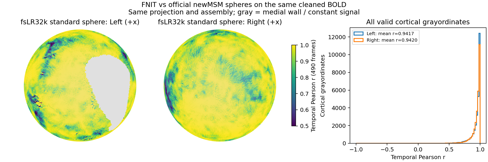

# fMRI volume 与 surface 全流程 benchmark

[volume 用法](../../docs/fmri/README.md) · [surface 用法](../../docs/fmri/surface.md) · [单被试测量脚本](benchmark_bids.py) · [FNIT / DeepPrep 实测对照](deepprep/README.md)

2026-10-01 的 BBR/FNIRT 修复、独立冷/热调用、CUDA profile 与解剖缓存复用见[当前配准报告](registration_gpu.current.public.json)、[BBR 功能页](../../docs/fmri/bbr.md#真实-ukb-数据对照)和[FNIRT 功能页](../../docs/fnirt/README.md#真实数据验证)。下面的 490 帧结果绑定其注明的运行源码；本次未重跑整条 490 帧 volume/surface。

2026-09-30 在 gpucw1 上用 `3f8b756` 的运行源码，连续运行同一例真实 UKB 的完整 490 帧 BIDS volume 和 surface 接口。BOLD 为 88×88×64×490，TR 0.735 s，使用同次 SBRef。T1 取自同被试 FreeSurfer 存档的 `orig/001.mgz`，以 nibabel 转成 NIfTI，逐体素差为 0；它是存档的重建输入，更早的结构预处理未核对。surface 使用同一存档的既有皮层几何，不运行或计时 recon-all。

权重大小和 SHA-256、HCP v4.7.0 模板与许可证、TemplateFlow HCP 标签图均按项目清单校验，见[输入及资源记录](assets_input_preflight.public.json)。FNIT 候选不调用 FSL、FreeSurfer、fMRIPrep 或 NiWorkflows；surface 的准备、投影和组装使用 Connectome Workbench，球面配准使用 FNIT HOCR/FastPD。

本页是在修补最终 MNI BOLD 插值后重新执行的完整 490 帧流程。每份报告记录实际运行提交与源码哈希；更新后的代码、示例图及数值采用本次结果。[FastVBM 源码继承记录](../pipeline_source_equivalence.public.json)只适用于 FastVBM，不用于替代这次 fMRI 运行。

## 当前公开 API 的完整运行

| 项目 | volume | surface |
|---|---|---|
| 起点 | 原始 BOLD/SBRef、存档 T1 重建输入 | 本次新生成的 volume 派生文件、匹配的既有 T1 表面 |
| 处理 | SynthStrip、FEAT、FAST、BBR、SynthMorph、PICA/AROMA、WM/CSF/24 项运动回归、MNI 重采样 | EPI→T1w、表面准备、双侧 MSMSulc、ribbon 投影、fsLR32k 重采样、皮层下组装 |
| 输出 | 原生 88×88×64×490、MNI 91×109×91×490 | 两侧各 490 帧×32,492 顶点；CIFTI 490×91,282 |
| API 墙钟，含最终写盘和临时文件清理 | **1719.19 s** | **905.71 s** |
| 完整验证进程墙钟 | 1745.33 s | 912.06 s |
| CUDA allocated / reserved，十进制 GB | 13.34 / 16.96 | 0.73 / 1.26 |
| 输出检查 | float32、全部有限、TR 与网格一致、MNI 掩膜外为零 | GIFTI/CIFTI 全部有限、JSON 齐全、TR 一致、90,572 个非常数灰质坐标 |
| 报告 | [volume JSON](fmri_volume.public.json) | [surface JSON](fmri_surface.public.json) |

两个 API 相加为 **2624.89 s，43.75 分钟**，边界是本次 BOLD 输入到 volume 和 surface 输出，外加已提供的 T1 与皮层几何。未计入皮层重建、数据下载或更早的结构预处理。验证进程计时另包含导入、输入哈希及事后检查；API 计时排除这些步骤和 CUDA 上下文初始化，包含首次权重加载。它们是共享 H100 上各一次冷调用，使用 8 个 CPU 线程、float32/TF32，不能外推到其他负载或被试。

volume 的 ICA 自动得到 95 个成分，在 115 次迭代后收敛，AROMA 识别 55 个噪声成分；WM、CSF、运动回归均开启。候选输入和输出 SHA、全部相关运行源码 SHA、阶段时间、环境和显存见 JSON。计时对应报告中的运行提交；之后 main 的算法改动不包含在本次测量内。验证脚本为保存实际 warp 额外复制矩阵和位移场，用时 0.052 s；API 墙钟已扣除这一开销，阶段时间仍包含该开销。

| volume 阶段 | 秒 |
|---|---:|
| SynthStrip | 13.05 |
| FEAT 核心 | 298.92 |
| TorchFAST | 3.30 |
| BBR 与 T1→MNI | 1186.44 |
| 混杂掩膜准备 | 0.21 |
| PICA、AROMA 与混杂回归 | 163.35 |
| MNI 重采样 | 48.44 |

最终 MNI BOLD 使用 `cubic-bspline-periodic`，保持一次空间插值。固定同一真实 BOLD 与本次 warp 的对照中，采样位置对 SD 的影响斜率降低 38.4%；FSL `applywarp --interp=spline` 490 帧参照与 FNIT 脑内 r=0.99999999993。定义、残留格纹和插值耗时见[专门验证页](resampling.md)。

配准阶段是本例主要耗时。surface 报告逐项列出左右 ribbon mapping、膨胀、掩膜、重采样及 CIFTI 的 Workbench 命令时间；这些命令的和不包含全部 EPI→T1w、几何准备和球面估计，应以 API 总时间作为完整 surface 耗时。

## 当前 FEAT 与 FSL 的同输入精度

候选取自上面这次完整 volume 的 pre-ICA 输出，而非旧缓存。参照是同一原始 BOLD/SBRef 的 FSL 6.0.7.22 逐条原版程序输出。两侧均未估计或应用 GDC/B0 校正。比较掩膜是两个最终 EPI 掩膜的交集；4D r 保留时间均值，时间 r 在每个体素的 490 帧内计算。

| 指标 | 结果 |
|---|---:|
| FNIT / FSL / 交集掩膜体素 | 97,347 / 113,881 / 96,776 |
| 掩膜 Dice | 0.916318 |
| filtered 4D Pearson r | 0.996417 |
| MAE / RMSE，归一化强度单位 | 423.501 / 556.959 |
| 去掉逐体素时间均值后的 pooled r | 0.944905 |
| 逐体素时间 r 中位数 / 均值 | 0.966798 / 0.951027 |

shape、affine 和全体素有限值检查通过。[当前标量](feat_current.public.json)和[独立比较脚本](compare_feat.py)记录完整定义。该参照保留 MCFLIRT `-spline_final`、BET/阈值掩膜、grand-mean 缩放及 100 s 高通；原 FSF 没有 slice timing、空间平滑或低通。FNIT 使用 SynthStrip 掩膜和自身运动求解器，两个步骤存在差异。

原 `feat` 启动器在该环境返回 255，正式参照按 `featlib.tcl` 逐条执行 MCFLIRT、BET、fslstats 和 fslmaths，并检查输出完整性。[参照脚本](official_feat_no_gdc.sh)保留命令；独立验证环境才需要 FSL。既有 FSL 计时中 MCFLIRT 为 397.54 s，其余已计时影像命令为 428.12 s，两次 fslstats 未单独计时；825.66 s 是分步耗时下界，不是完整 FSL/UKB fMRI 总时间。不能把它与 1719.19 s 的完整 FNIT volume 时间相除。

最终去噪使用 ICA-AROMA 加混杂回归，UKB 使用 FIX；没有相同算法的最终官方清理图。因此这里验证了全流程可执行和输出合同，并对 pre-ICA FEAT 做数值对照，**没有证明最终 MNI 或 CIFTI 与 UKB FIX 数值等价**。

## 固定 volume 的 surface 球面对照

用本次新生成的 clean BOLD、同一 T1 皮层几何和 HCP 资源，再运行一次 surface API；只把 FNIT 估计的球面替换为既有官方 newMSM 球面。参照球面来自 HCP v4.7.0 MSMSulc 配置，首层 `simval=1`，其余为 2，8 线程。这样可定位球面对应关系造成的差异；投影和 CIFTI 组装仍是相同 FNIT/Workbench 路径，未独立重跑完整 fMRIPrep。

| 结构 | 灰质坐标数 / 有效时间 r 数 | 时间 r 均值 | 中位数 | 第 5 百分位 | MAE | 最大绝对差 |
|---|---:|---:|---:|---:|---:|---:|
| 左皮层 | 29,696 / 29,695 | 0.940496 | 0.971542 | 0.770144 | 18.1565 | 868.3127 |
| 右皮层 | 29,716 / 29,689 | 0.941404 | 0.968101 | 0.792942 | 19.7100 | 636.2633 |
| 皮层下 | 31,870 / 31,188 | 1.000000 | 1.000000 | 1.000000 | 0 | 0 |

两份 CIFTI 的时间轴和 BrainModel 轴完全相同；常数时序不计算 r。皮层仍有明显差异，皮层下逐值相同，符合本对照仅改变皮层球面的边界。固定官方球面的 API 为 697.45 s，验证进程为 703.76 s；它跳过球面估计，不能当作官方完整 surface 耗时。见[数值报告](fmri_surface_comparison.public.json)、[官方球面控制运行](fmri_surface_official_spheres.public.json)与[比较脚本](compare_cifti.py)。

## 示例图

图的三行依次是 MNI 解剖模板、FNIT 清理后 BOLD 时间标准差、一个清理后的时间点。回归去掉截距后时间均值接近零；模板用于定位，不是官方清理后 BOLD。每行共用色阶，切面为同一模板网格的中间位置。


下图把逐顶点时间 r 映射到公开标准 fsLR32k 球面，展示 +x 半球视图；右侧直方图包含双侧全部有效皮层坐标。灰色为内侧壁或常数信号，球面不是被试解剖表面。



## 单被试如何复测

先安装主页 Conda 环境、部署权重，并准备实际 BIDS、MNI 模板、HCP 表面资源和匹配的重建存档。以下命令先生成完整 volume，再让 surface 读取刚生成的派生数据；每次使用新输出目录。

```bash
python validation/fmri/benchmark_bids.py volume \
  --bids-root /data/bids --derivatives-root /results/fnit \
  --subject 0001 --mni-template /templates/MNI152_T1_2mm.nii.gz \
  --mni-brain-mask /templates/MNI152_T1_2mm_brain_mask.nii.gz \
  --synthstrip-weights /models/synthstrip.1.pt \
  --synthmorph-weights /models/synthmorph.deform.3.h5 \
  --device cuda:0 --threads 8 \
  --source-root /path/to/Fudan-Neuroimaging-toolkit \
  --source-revision YOUR_COMMIT \
  --report-out /results/volume.private.json

python validation/fmri/benchmark_bids.py surface \
  --bids-root /data/bids --derivatives-root /results/fnit --subject 0001 \
  --recon-all /data/matching-reconstruction \
  --hcp-assets-dir /templates/hcp --wb-command wb_command \
  --device cuda:0 --threads 8 \
  --source-root /path/to/Fudan-Neuroimaging-toolkit \
  --source-revision YOUR_COMMIT \
  --report-out /results/surface.private.json
```

`YOUR_COMMIT` 填写实际运行代码的 Git 提交号。脚本调用公开单被试 Python API，记录 API 时间、GPU 峰值和输出检查；不会调度其他被试。volume 示例启用三类混杂回归、默认 SynthMorph；`--registration-backend fnirt` 选择 T1 FNIRT 配置，本页新的完整链计时只覆盖 SynthMorph。surface 示例估计 FNIT 球面；`--registered-spheres LEFT RIGHT` 是固定球面控制，跳过 MSMSulc 估计，不应当作默认 surface 时间。

两份同轴 CIFTI 可用 `compare_cifti.py --candidate ... --reference ... --report-out ...` 比较；`render_surface.py` 接收这两份文件和公开标准双侧 fsLR32k 球面，生成上图。

volume 图示可用 `render_volume.py --bold ... --mask ... --template ... --figure-out ...` 生成。FEAT 中间结果只在公开 volume API 的临时目录存活；`compare_feat.py` 接收事先保存的候选与官方 FEAT 目录，不把最终清理图误当成 pre-ICA 图。官方和 FNIT 都应使用同一 raw BOLD/SBRef 和校正配置。

## 其他阶段参照

[BBR/T1 FNIRT 当前配对](registration_gpu.current.public.json)、[PICA](pica_summary.json)、[固定运动矩阵的插值](motion_spline_summary.json)与[MCFLIRT 求解差异](mcflirt_difference.public.json)采用各自注明的固定输入和参数；它们不是本次整链最终输出的一致性指标。原先 64 帧 volume 入口和接入旧 volume 的 surface 入口记录已被本次连续 490 帧测量替代。

## 配准冷/热调用与 profile 复测

[`tools/benchmark_registration_gpu.py`](../../tools/benchmark_registration_gpu.py)读取服务器本地的 JSON 输入清单，不启动 FSL。官方参照需先按 [BBR](../../docs/fmri/bbr.md#官方同输入命令)或 [FNIRT](../../docs/fnirt/README.md#python-与命令行t1w-专用预设)命令生成。影像、矩阵、warp 和含私有路径的清单留在本地；`report.safe.json` 只含汇总指标、环境和实现源码哈希。

BBR 的清单字段为 `epi`、`t1`、`wmseg`、`init`、`official_matrix`、`official_moved`，值均为相应文件的绝对路径；`init` 必须是 normmi 初始矩阵，不能填官方最终 BBR 矩阵。FNIRT 使用 `moving`、`reference`、`reference_mask`、`affine`、`official_warped`、`official_coeff`；`affine` 是 input→reference 的 FSL scaled-mm 初始矩阵。可再提供 `official_jacobian`（官方 `jout`）及 `official_pull_x/y/z`（官方 `applywarp` 重采样的 input RAS world 坐标图）。

```bash
# --source-root：待测试源码，独立 before/after 快照各执行一次。
# --case-json：含本地真实输入与同输入官方参照的清单。
# --output-dir：新的私有结果目录；计时结束后才保存图像和矩阵。
# --function：bbr 固定 WM/init；bbr_chain 自行运行 FAST 和 FLIRT；fnirt 使用 T1 六级预设。
# --warm-repeats：首次调用后重复次数；首次所需的 JIT 编译/加载计入该调用。
python tools/benchmark_registration_gpu.py \
  --source-root /path/to/Fudan-Neuroimaging-toolkit \
  --case-json /private/cases/bbr.json --output-dir /private/results/bbr-timing \
  --function bbr --bbr-execution batched --warm-repeats 1

python tools/benchmark_registration_gpu.py \
  --source-root /path/to/Fudan-Neuroimaging-toolkit \
  --case-json /private/cases/fnirt.json --output-dir /private/results/fnirt-timing \
  --function fnirt --affine-geometry header_pixdim \
  --fnirt-execution optimized --warm-repeats 1

# profile 与性能计时分开运行；profile 的插桩开销不进入速度表。
python tools/benchmark_registration_gpu.py \
  --source-root /path/to/Fudan-Neuroimaging-toolkit \
  --case-json /private/cases/fnirt.json --output-dir /private/results/fnirt-profile \
  --function fnirt --affine-geometry header_pixdim \
  --fnirt-execution optimized --profile-only --profile-full
```

`--bbr-execution reference`、`--fnirt-execution reference` 对照同一修正算法的原执行路径。完整链用 `--function bbr_chain --wm-header reference` 保留 WM 的 T1 header。`--affine-geometry affine_norm`、`--wm-header legacy` 用于复测明确注明的旧快照，不能与新 header 契约混用。`--fnirt-blur-reference`、`--fnirt-bending-reference` 仅用于定位单个执行改动，不是降低搜索或迭代的 fast mode。

“冷”指该进程首次函数调用，“热”指随后调用；未清空 Triton 磁盘缓存，CUDA 上下文初始化在函数计时前。墙钟包含函数内 ArrayProxy 读入/解压与 CPU 结果转换，排除输出写盘和事后精度计算。profile 汇总 kernel、H2D/D2H、CUDA 同步 API 与成本求值次数；嵌套阶段钟是无额外 GPU fence 的 CPU wall，不能把它们都相加。`nvidia-smi` 利用率属于整张共享 GPU，不能当作本进程利用率；kernel 累计时间也不等于独占 wall。公开前应再次核对本地报告载荷。

经数据持有者确认发布权限，仅公开匿名标量、代码及文件哈希和去标识化的 PNG。原始 NIfTI、MGZ、皮层几何、逐体素时序及含私有路径的日志不进入仓库。
