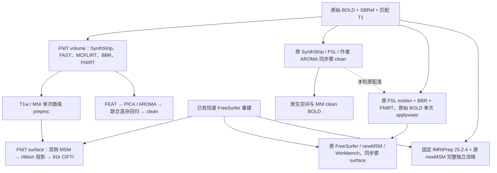
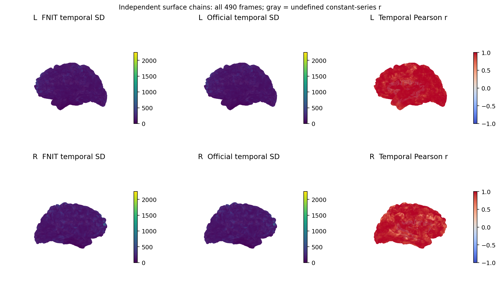
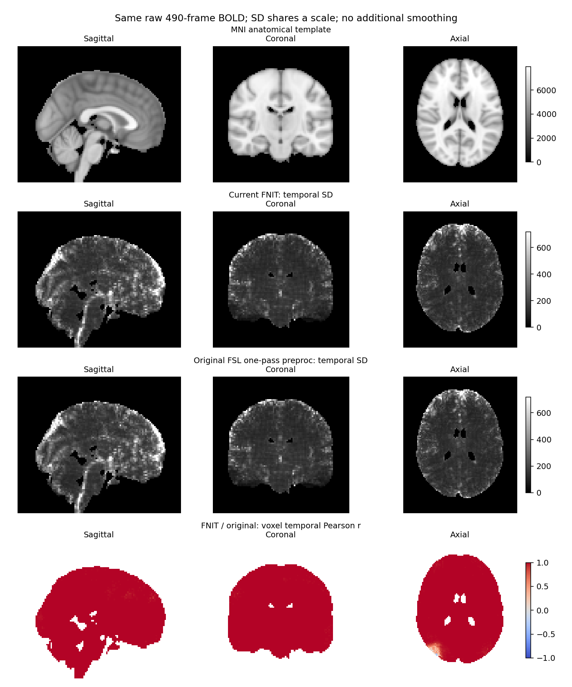
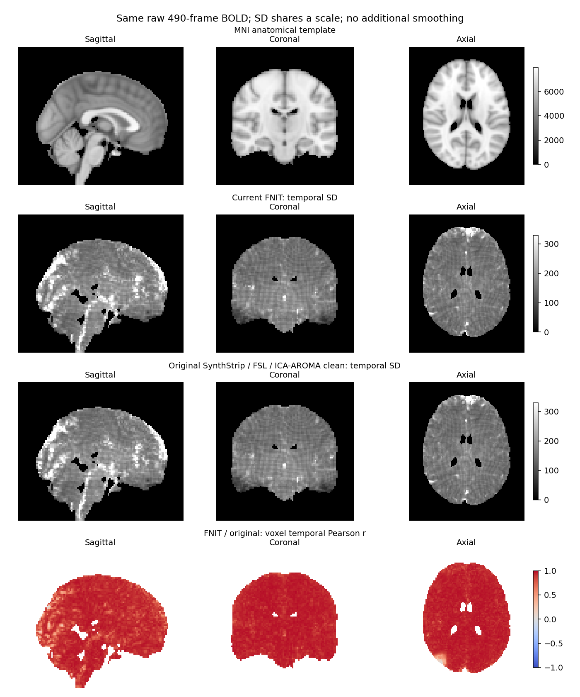
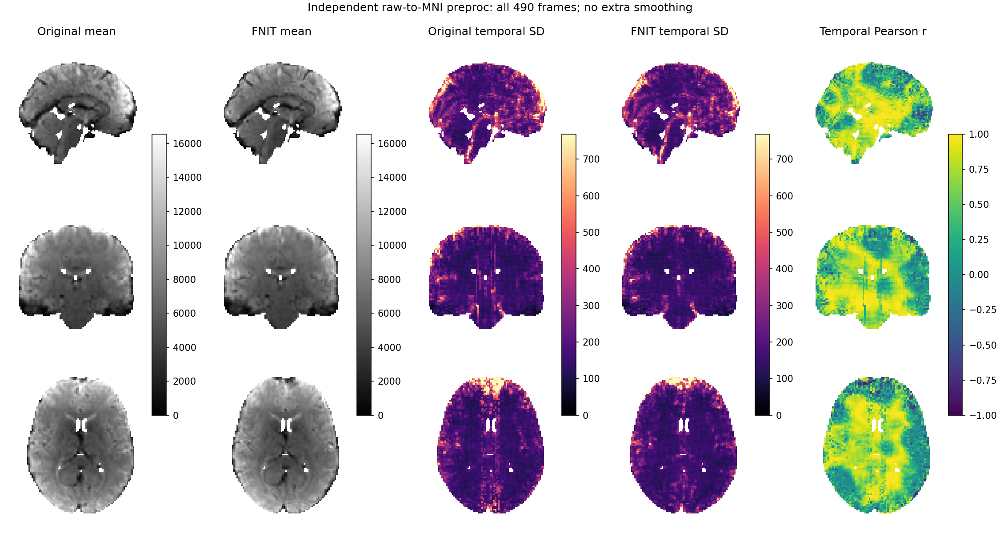
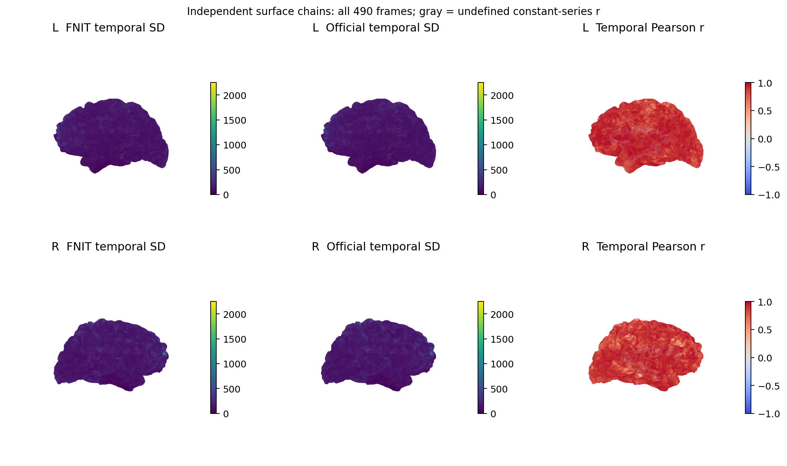

# fMRI volume 与 surface：当前完整 benchmark

2026-10-02，冻结 FNIT 运行时源码 `6f67cc06ee8c5108ef3640cbfc289f3e5a742f65`，在一例真实 UKB 原始 BOLD、SBRef、匹配存档 T1 和同源 FreeSurfer 7 重建上测量。BOLD 为 `88×88×64×490`、uint16、TR 0.735 s；T1 为 `162×215×180`，来自已有存档重建，本轮未验证其为扫描仪原始 T1。

发布文件、实测代码和合并后测试的身份见[发布清单](publication.public.json)。在本次发布的仓库版本运行 `python validation/fmri/e2e_latest/verify_publication.py`，可核对摘要、脑图、脚本和计算代码的 SHA-256。清单不包含私有影像。

## 流程与比较范围



FNIT 同时计算 clean 和 preproc；surface 默认使用 preproc。原同步骤 clean 不包含 UKB FIX，也不是 fMRIPrep 的 preproc。联合回归采用独立 NumPy SVD。原 FSL 单次 preproc 采样阶段复用本轮原流程新估计的配准，单独测量；它与之后 surface 的耗时不能相加当作另一份实际连续 raw→CIFTI。独立完整 fMRIPrep 从同一原始 BIDS 开始，其 ANTs/N4、参考图和解剖处理与 FNIT 不同，另列完整时间和精度。

双方使用已有同源 recon-all 输入，首次结构重建不计入 FNIT 时间；原 fMRIPrep 实际追加执行的结构步骤属于其本次完整流程。私有重建副本上的几何更新和共享原件是否未变均需核验，不能将更新后的几何当成双方共同固定输入。

## FNIT 实际连续运行

| 全部 490 帧，含最终产物保存 | 实际墙钟，秒 | 扣除捕获后的估计，秒 |
|---|---:|---:|
| **raw→volume→91k CIFTI** | **915.876** | **883.340** |
| volume：T1w/MNI preproc＋原生/MNI clean | 649.045 | **616.561** |
| surface：重新估计双侧 MSM＋投影＋保存 | 266.814 | **266.777** |

捕获共 32.536 s。估计值只扣除当次测得的中间结果捕获，不是另一次无捕获测量。导入、CUDA 初始化、输入/源码哈希及事后检查在外层计时之外。两个 API 在同一进程连续运行；并非将历史单独调用时间相加。

| volume 细分 | 扣除对应捕获后的观测，秒 |
|---|---:|
| 完整解剖准备 | 47.428 |
| 其中 FAST / T1 FLIRT / FNIRT 计算 | 10.141 / 4.112 / 30.810 |
| 完整 FEAT | 122.610 |
| 其中完整 MCFLIRT / motion 最终采样 | 104.058 / 20.185 |
| 强度缩放 / 100 秒高通计算 | 1.150 / 1.721 |
| 完整 BBR | 3.171 |
| 完整 PICA＋AROMA＋混杂回归 | 130.437 |
| 其中 PICA / AROMA 分型 / AROMA 去噪 / 联合回归 | 75.668 / 2.199 / 24.977 / 23.456 |
| clean MNI 采样阶段 | 45.711 |
| T1w＋MNI preproc 阶段，含准备与读写 | 247.099 |
| 其中 T1w / MNI preproc 采样 | 33.305 / 94.766 |

| surface 细分 | 扣除对应捕获后的观测，秒 |
|---|---:|
| 原生表面准备 | 4.961 |
| MSM 输入准备＋独立配准 | 112.108 |
| 其中双侧 MSM 估计的外层墙钟 | 110.212 |
| 并行双侧投影的外层墙钟 | 119.214 |
| CIFTI 组装 | 24.135 |

“其中”行已包含在父阶段内；左右半球重叠执行，不能相加。preproc 采样函数以外的准备/读写占本阶段其余时间，未进一步剖析，不能把完整阶段仅写为两项采样之和。完整 API 与内部 `total` 的末尾文件发布边界也不同。

输出检查：四份 BOLD 为有限 float32、490 帧、TR 0.735 s；T1w preproc `59×75×64×490`，MNI preproc/clean `91×109×91×490`，原生 clean `88×88×64×490`。MNI clean 掩膜外全零。CIFTI `490×91282`，21 个结构、正确 SeriesAxis；左右 GIFTI 各490帧、32492顶点。ICA 95 成分、43 次迭代、47 个噪声成分。

H100、CPU 8 线程、TF32，未使用半精度，CUDA 额度20 GB，完整进程峰值 allocated/reserved **6.503/10.775 GB**。源码运行前后120项身份相同，实际 MSM 扩展与独立构建记录 SHA 一致。共享 GPU/CPU/I/O 的单次测量只描述本次观测。GPU1在整个进程期65次采样的利用率中位数86%，显存占用中位数22,737 MiB、最高37,273 MiB，包含其他任务；FNIT自身reserved峰值10.775 GB。不能由本次墙钟给出受控或普遍加速比。

## 最近两次连续测量

| 冻结源码 | raw→volume→CIFTI实际 / 捕获扣除估计，秒 | volume实际 / 估计，秒 | surface实际 / 估计，秒 |
|---|---:|---:|---:|
| `6f67cc0`，当前 main | 915.876 / 883.340 | 649.045 / 616.561 | 266.814 / 266.777 |
| `ac692bb`，本轮更新前 | 832.586 / 793.314 | 574.944 / 535.726 | 257.629 / 257.587 |

两次均从原始输入计算、退出0，输入、资源和配置相同，源码在各自运行期间不变。[完整39项比较](fnit_revision_comparison.public.json)确认两版输出逐 bit一致，包括四份BOLD、490帧GIFTI/CIFTI、双侧配准球面、FAST、运动和形变。共享服务器墙钟不同不能据此归因于算法变慢。此配置开启WM/CSF/Friston24，与[另一轮默认clean的FNIRT无损验收](../../registration_lossless_20261002/README.md)分开记录。

## 原 FSL / FreeSurfer 同步骤参考

原软件只在隔离的验证驱动中调用，未成为 FNIT 的运行依赖。clean 使用原 SynthStrip、`fast`、`mcflirt`、FEAT 高通、`flirt`/BBR、`fnirt`、`melodic` 和作者 ICA-AROMA；随后以独立 NumPy SVD 联合回归 WM/CSF/Friston-24 和趋势项。完整 clean 原指令与变量见[同步骤协议](../matched_native.md#数据协议与原命令)。T1 的初始线性配准是 12-DOF `corratio`，不是 `normmi`。

新增 preproc 原指令从原始 BOLD 出发，把运动和 BBR 组合为每帧一份 FSL premat，MNI 再叠加本轮原 FNIRT；不会先写出 motion-corrected BOLD 再插值一次。当前安装的原 `applywarp` 支持 `4T×4` ASCII 矩阵序列。真实第0、100、489帧的控制分别与单帧原指令比较，2,707,887个 float32值逐 bit相同。

```bash
# RAW_BOLD：原始4D BOLD；MNI_TEMPLATE：固定 MNI6 2 mm T1w 模板。
# MOTION_BBR_MNI：按时间顺序堆叠的 BBR @ MCFLIRT_MAT，每帧4行。
# FNIRT_COEFFICIENTS：本轮原 fnirt 估计的 T1w→MNI 系数场。
# 从原始每帧组合运动、BBR和非线性形变后，一次三次样条采样至 MNI。
"$FSLDIR/bin/applywarp"   --in="$RAW_BOLD" --ref="$MNI_TEMPLATE"   --premat="$MOTION_BBR_MNI" --warp="$FNIRT_COEFFICIENTS"   --interp=spline --datatype=float --out="$PREPROC_MNI"

# T1W_BOLD_REFERENCE：原 NiWorkflows 根据原 T1w脑图/掩膜及BOLD分辨率生成的网格。
# MOTION_BBR_T1W：先组合 BBR @ MCFLIRT_MAT，再桥接至上述参考的FSL scaled-mm坐标。
# 从同一原始4D BOLD，一次插值至 T1w scanner-RAS 空间的原生BOLD分辨率网格。
"$FSLDIR/bin/applywarp"   --in="$RAW_BOLD" --ref="$T1W_BOLD_REFERENCE"   --premat="$MOTION_BBR_T1W" --interp=spline --datatype=float   --out="$PREPROC_T1W"
```

矩阵序列按原 FSL input→reference scaled-mm 定义。T1目标网格桥接为 `S_new @ inv(A_new) @ A_old @ inv(S_old)`，其中 `A` 为各自实际NIfTI affine，`S` 为依据实际header尺寸和体素大小构建的FSL scaled-mm矩阵。不能把FSL `.mat`直接当RAS矩阵，也不能对双方共用一个略有不同的参考header来解码。

原 NiWorkflows 1.14.4 / Nilearn 0.11.1 独立产生的本例T1w采样网格与FNIT的 `59×75×64` 和affine相同，可以直接比较全帧。原 FSL NEWIMAGE 样条的 extraslice/有效性边界与 FNIT preproc 的 fMRIPrep `grid-constant` 有差异，按实际结果比较，不把“同为spline”解释为逐值等价。

surface 原参考使用未变的同源 FreeSurfer 几何，从原生球面、sulc、皮层ROI开始，经原 FreeSurfer/sMRIPrep 准备、官方 newMSM、原 Workbench ribbon/dilation/面积加权重采样与原 fMRIPrep CIFTI组装。newMSM的每侧线程数写进配置文件，两侧各1线程并行，不把无效的 `--numthreads` 当命令行参数。它独立估计配准球面，不借用FNIT估计结果。

## 同步骤原指令：最新精度与时间

[原完整clean](native_clean.public.json)从相同原始数据连续执行，不复用前一次计算，退出0、全部490帧产物完整；实际 **2,666.886 s**。它包含各阶段解释器启动、内部完整性检查和读写，只输出clean。[原preproc](native_preproc_stage.public.json)另实际运行单次采样 **786.867 s**，其运动/BBR/FNIRT来自本轮原流程新估计的结果；[原surface](native_matched_surface__post_validation_recovery.public.json)从这些preproc和固定共享重建开始，科学worker **1,572.593 s**。三项有各自起止点，不能相加为实际测得的raw→CIFTI。

| 步骤 | FNIT当前main，秒 | 原指令，秒 | 计时范围 |
|---|---:|---:|---|
| EPI / T1 SynthStrip | 1.386 / 1.171 | 9.880 / 9.981 | FNIT函数；原各自GPU进程，含启动和读写 |
| FAST | 10.141 | 152.083 | FNIT计算；原CPU命令含读写 |
| T1 12-DOF FLIRT | 4.112 | 17.235 | 各自计算或原命令 |
| T1 FNIRT | 30.810 | 209.750 | 各自计算或原命令 |
| 完整MCFLIRT | 104.058 | 335.310 | FNIT扣捕获；原CPU命令含读写 |
| 强度缩放 / 高通 | 1.150 / 1.721 | 23.616 / 159.603 | 原缩放前另有mask、p50与时间均值命令 |
| BBR初值 / 完整BBR | 2.295 / 3.171 | 6.702 / 45.481 | FNIT完整BBR包含初值，不能相加 |
| PICA | 75.668 | 651.790 | 原MELODIC含文件和HTML产物 |
| AROMA map→MNI / 特征分类 | 4.129 / 2.199 | 27.005 / 235.519 | 原作者特征包含多次FSL查询与运算 |
| AROMA nonaggr / 联合混杂回归 | 24.977 / 23.456 | 48.104 / 36.466 | 原regfilt / 独立NumPy SVD |
| clean MNI阶段 | 45.711 | 552.564 | FNIT采样与mask；原applywarp进程含读写 |
| preproc T1w / MNI采样 | 33.305 / 94.766 | 198.255 / 577.397 | 原始490帧，一次空间插值 |
| 完整volume / 原完整clean | 649.045（实际） | 2,666.886（实际） | FNIT另包含preproc；输出范围不同 |
| 完整surface | 266.814（实际） | 1,572.593（科学worker） | 固定同源重建，双方独立MSM；原后验发布另2.505 s |

原clean完整阶段墙钟为：解剖173.610、FEAT640.279、配准289.481、去噪1010.936、最终MNI552.564 s。表内函数/命令被包含在这些阶段中；原surface半球重叠执行。FNIT还生成preproc，原clean包含阶段检查；不据此给出输出范围相同的总加速比。

[main逐阶段正式比较](native_matched_main.public.json)与[输入、产物身份门禁](native_matched_identity.public.json)绑定成功FNIT API和原执行记录。EPI/T1脑图像素和脑掩膜完全一致，Dice=1。FAST GM PVE空间r **0.999999991**、RMSE **5.61e-5**；bias RMSE **5.35e-8**。BBR最终矩阵在脑区的RAS误差RMS **0.000330 mm**，T1仿射 **0.021918 mm**，MNI→T1完整pull RMS **0.219834 mm**；运动每帧变换RMS均值 **0.008812 mm**。矩阵均按双方实际header解码，不把FSL scaled-mm当RAS。

| 全部490帧影像 | 时间r均值 / 中位数 | RMSE | 固定统计域或共同域体素数 |
|---|---:|---:|---:|
| MCFLIRT | 0.999578 / 0.999834 | 8.2109 | 99,371 |
| FEAT高通后、ICA前 | 0.999356 / 0.999770 | 11.7454 | 99,371 |
| AROMA nonaggr | 0.925408 / 0.938254 | 96.8245 | 99,371 |
| 原生最终clean | 0.931266 / 0.945058 | 88.4248 | 99,371 |
| MNI最终clean | **0.930242 / 0.945156** | **68.7387** | 224,782 |
| T1w preproc | **0.999438 / 0.999781** | 8.4097 | 原独立参考脑域102,293 |
| MNI preproc | **0.991850 / 0.998977** | 133.4783 | 固定模板脑域228,483 |
| 91k CIFTI | **0.976638 / 0.994898** | 179.3274 | 91,281非恒定灰坐标 |

时间r先逐体素/灰坐标去时间均值再计算，不能用受大强度基线主导的全部数值空间r代替。恒定时序不计入r，仍纳入RMSE；报告记录域内覆盖，不靠删除零值提高相关性。每行强度和处理阶段不同，RMSE跨行不能作为统一排名。

本次主要时间相关性下降出现在ICA/AROMA阶段：双方自动定阶均95成分，FNIT判47个噪声、原作者链49个；此处尚未数值等价。preproc不走这条去噪支线，所以不能用clean的0.930解释preproc或surface。MNI preproc仍有独立形变估计与FSL/fMRIPrep样条边界差异。surface双方使用相同解码MSM输入和四级科学配置，但球面角差均值左0.221050°、右0.319595°，皮层输出也未逐值一致；完整ROI、结构与球面QC见[surface功能页](../../../docs/fmri/surface.md#surface-e2e-latest)。这些是各阶段差异的位置和实测幅度，不是隔离因果实验。



图上下分别为左右半球，列为FNIT temporal SD、原软件temporal SD和逐顶点时间r；共享SD色阶，未追加平滑。





MNI两图每行分别是模板、FNIT temporal SD、原软件temporal SD、时间r，三列为矢状/冠状/轴位。各图的两份SD共用色阶，r色阶−1到1，[图例身份](native_matched_figures.public.json)绑定源输出、统计域与最新比较报告SHA。

原安装FSL的部分启动壳返回255，但内部原ELF正常退出0。979条原命令中978条的完整执行/退出链已独立核验；旧MELODIC记录缺少线程接收者系谱，单独保留该缺口。相同输入和参数的新原MELODIC控制中，193份NIfTI、291份可解析数值文本与后合并阈图共189,516,471值、科学header及affine完全相同，控制时间657.544 s不计入原整链。[严格证明](native_command_strict_verification.public.json)和[独立MELODIC控制](native_melodic_independent_control.public.json)分别记录，不改写原退出码，也不倒填旧线程证据。原科学driver在计时期间不变，修订仅涉及分阶段声明的观察器解析格式；其前后源码与实际加载SHA保留在[原clean报告](native_clean.public.json)。

## 独立完整原 fMRIPrep：端到端对照

固定 **fMRIPrep 25.2.4 + 显式官方newMSM** 从同一原始BIDS BOLD、SBRef、T1与相同初始FreeSurfer重建副本开始，全新work/derivatives，原命令和外层控制器均退出0。[完整原执行](native_fmriprep_full_strict__run.public.json)实际连续墙钟 **6,087.099 s**；前置输入/镜像哈希、首次重建和私有副本准备不在原命令计时内。原命令包含初始化、完整原graph、报告和最终保存，非将节点耗时相加。

原配置CPU预算8，调度内存19,000 MB，无GPU；STC/SDC关闭、dummy scans=0、全部490帧。SIF SHA `8e32238619053c1f9d1739b26f4afd72df809d914f5a5771707bf5da4b1d0f39`，newMSM SHA `af5c04246cfeea19233232168acbc1f31266f28b1a7cb6779b8f1bfa32eb9615`，每侧1线程。它实际执行N4/ANTs、额外FreeSurfer步骤、MNI6和内部MNI2009两套归一化、fsnative及91k、confounds/QC，输出范围与FNIT不同。

| 原完整流程内实际执行 | 原叶接口耗时，秒 | 边界 |
|---|---:|---|
| 解剖脑提取相关节点 | 430.752 | 53个叶执行合计；含模板/脑提取相关工作 |
| 两次N4BiasFieldCorrection | 11.723 / 11.680 | 两份实际叶接口 |
| FAST | 54.884 | 原脑图上的组织分割 |
| 追加FreeSurfer处理相关节点 | 617.955 | 18个叶执行合计，包含实际recon-all追加阶段 |
| 原MCFLIRT | 214.445 | 原完整workflow的运动接口，参考图与同步骤链不同 |
| 原BBRegister | 25.960 | FreeSurfer BBR，不是同步骤链的FSL BBR |
| MNI6 / 内部MNI2009 ANTsNormalization | 1,023.220 / 1,250.816 | 两份原归一化接口 |
| newMSM，左 / 右 | 1,258.368 / 1,257.435 | 两侧重叠执行，不相加当外层墙钟 |
| T1w / MNI6 preproc ResampleSeries | 39.631 / 124.532 | 原490帧接口，不含依赖等待和最终发布 |
| fsLR ribbon，左 / 右 | 26.054 / 25.876 | 原投影接口 |
| GenerateCifti | 18.745 | 原91k组装接口 |
| **实际完整raw→volume→CIFTI** | **6,087.099** | **整条原指令含保存** |

[完整节点表](native_fmriprep_full_strict__nodes_final.public.json)记录541个结果文件；MapNode父节点在合计中去重。上述叶时间、并行区间、调度间隙与整个graph各有边界，不可相加替代6087.099 s。FNIT本次完整调用915.876 s；双方还包含不同输出和共享资源负载，分别列墙钟。

共享初始重建14项SHA相同且最终原件未变；原私有副本实际更新双侧white与thickness。白面最大位移左 **4.108213 mm**、右 **3.571384 mm**，厚度最大差 **1.796915 / 1.720999 mm**，[完整几何记录](native_fmriprep_full_strict__geometry_final.public.json)另列。这些实际原处理包含在6087.099 s中，不能把最终几何称为双方共同固定输入。

原T1w preproc `57×73×60×490` 与FNIT `59×75×64×490`网格不同，本轮没有追加插值以产生直接T1w数值表。MNI保存方向原软件RAS、FNIT/template mask LAS，仅按原affine无损翻转x索引，在相同2mm世界格点和全部490帧比较，不改文件、header或SHA。原surface真实中间NIfTI时间单位为unknown、TR数值0.735，原BIDS与实际GenerateCifti轴明确以秒表达；该来源由成功整链和轴SHA门禁绑定，不将其header暗改成sec。

| 对独立完整原流程的preproc | 时间r均值 / 中位数 | RMSE | 有效时间r数量 |
|---|---:|---:|---:|
| MNI volume，固定模板脑域 | **0.441356 / 0.493963** | **1,337.3998** | 228,483体素 |
| 左fsLR32k | 0.921622 / 0.941497 | 274.438 | 29,695顶点 |
| 右fsLR32k | 0.902863 / 0.931978 | 395.796 | 29,687顶点 |
| 完整91k CIFTI | **0.798662 / 0.909246** | **502.687** | 91,252灰坐标 |

完整MNI的空间均值图r **0.917861**，temporal SD图r **0.670209**；全部固定模板域都有可变时序，不通过删零提高r。19个皮层下结构的时间r按灰坐标数加权为 **0.587032**，小脑左/右 **0.433143 / 0.484338**，与两侧皮层分别列出。CIFTI原输出有30条恒定时序、FNIT1条，其中右皮层29条为原单侧恒定；它们不计入时间r但仍纳入误差。全部frame/TR、科学输出SHA、固定mask及误差见[完整volume比较](full_volume_main.public.json)和[完整surface比较](surface_full_main.public.json)。





这份完整原流程对照衡量不同完整方法的结果。对实现本身的同步骤精度，前表原FSL MNI preproc为0.991850、原FS/FSL CIFTI为0.976638；不能将它们写成对完整fMRIPrep的精度。当前结果没有达到完整fMRIPrep数值等价。

### 两套原软件协议之间的直接对照

使用上述两套已完成原影像，同原始输入和全部490帧，只在固定物理格上比较，不运行FNIT处理函数、不增加插值。原FSL/FNIRT单次preproc对完整fMRIPrep/ANTs的MNI时间r均值 **0.442061**、中位数 **0.494431**、RMSE **1,331.2106**；FNIT对完整fMRIPrep的对应数值是0.441356/0.493963/1337.3998。两套原软件结果本身已有相近幅度的差，不能把完整对照的全部差异归于FNIT算子。

两套原CIFTI协议的时间r均值 **0.820252**、中位数 **0.935909**、RMSE **465.0203**；左右皮层分别0.942058/0.943113，小脑分别0.445428/0.496294。它们使用相同官方球面求解和共享初始重建，但完整fMRIPrep还有独立volume和几何处理。[原volume协议控制](original_protocol_comparison.public.json)与[原surface协议控制](surface_two_original_protocols.public.json)绑定各自实际来源和SHA。该对照量化协议差异，没有隔离某个步骤的因果效应。

### 原完整流程复测指令

使用自己的原始BIDS、已获许可的同源FreeSurfer subjects副本、固定SIF及官方newMSM环境。验证driver负责固定原配置、来源哈希、线程配置和原输出检查；不在FNIT运行时调用该driver。

```bash
# 下载/安装原软件到独立验证环境；此处变量均指自己的资源。
REFERENCE_IMAGE=/absolute/path/fmriprep-25.2.4.sif
ORIGINAL_BIDS_ROOT=/absolute/path/bids
REFERENCE_DERIVATIVES_ROOT=/absolute/path/new-original-derivatives
REFERENCE_WORK_ROOT=/absolute/path/new-original-work
REFERENCE_SUBJECTS_ROOT=/absolute/path/private-subjects-copy
FREESURFER_LICENSE_PATH=/absolute/path/license.txt
ORIGINAL_NEWMSM_ENV=/absolute/path/official-newmsm-env
TEMPLATEFLOW_CACHE=/absolute/path/templateflow

# 从raw执行完整原volume+MSM+91k，允许官方更新私有FS副本。
# --msm-threads=1写入原MSM科学配置，其他科学参数由原sMRIPrep提供。
python validation/fmri/fmriprep/run_reference.py \
  --container-image "$REFERENCE_IMAGE" --reference-version 25.2.4 \
  --bids-root "$ORIGINAL_BIDS_ROOT" --output-root "$REFERENCE_DERIVATIVES_ROOT" \
  --work-root "$REFERENCE_WORK_ROOT" --subjects-dir "$REFERENCE_SUBJECTS_ROOT" \
  --participant-label 0001 --fs-license "$FREESURFER_LICENSE_PATH" \
  --threads 8 --mem-mb 19000 --allow-official-geometry-updates \
  --newmsm-env "$ORIGINAL_NEWMSM_ENV" --msm-threads 1 \
  --templateflow-cache "$TEMPLATEFLOW_CACHE"
```

完整成功报告写在`REFERENCE_WORK_ROOT/run.public.json`，私有原命令和日志保存在同一工作目录。driver在容器中执行的原参数为：

```bash
# 默认原preproc，不执行FNIT的AROMA clean支线；保留全部帧和msm/91k。
fmriprep /input /output participant --participant-label 0001 \
  --fs-subjects-dir /fs_subjects --fs-license-file /fs_license.txt \
  --nprocs 8 --omp-nthreads 8 --mem-mb 19000 --work-dir /work/processing \
  --ignore fieldmaps slicetiming --dummy-scans 0 --slice-time-ref 0.5 \
  --output-spaces T1w MNI152NLin6Asym:res-2 fsnative \
  --cifti-output 91k --msm --random-seed 0 --notrack --skip-bids-validation
```

## 复测 FNIT

先按[主页](../../../README.md)建立 Conda 环境、安装本包，并按 [volume](../../../docs/fmri/README.md)和 [surface](../../../docs/fmri/surface.md)准备经哈希校验的权重、模板及已有同源 recon-all。以下 JSON 只保存在自己的工作目录；所有路径换为本机绝对路径，输出目录必须尚不存在。

```json
{
  "bids_root": "/absolute/path/bids",
  "subject": "0001",
  "derivatives_root": "/absolute/path/new_derivatives",
  "capture_root": "/absolute/path/new_private_capture",
  "source_root": "/absolute/path/Fudan-Neuroimaging-toolkit",
  "mni_template": "/absolute/path/assets/fmriprep/tpl-MNI152NLin6Asym_res-02_T1w.nii.gz",
  "mni_brain_mask": "/absolute/path/assets/fmriprep/tpl-MNI152NLin6Asym_res-02_desc-brain_mask.nii.gz",
  "recon_all": "/absolute/path/recon_subject",
  "hcp_assets_dir": "/absolute/path/assets",
  "wb_command": "/absolute/path/assets/bin/wb_command",
  "synthstrip_weights": "/absolute/path/weights/synthstrip.1.pt"
}
```

`wb_command` 是当前 surface 的实际 Workbench 后端：ribbon 投影、dilation、mask、面积加权重采样和 ROI 等步骤调用原 Workbench。体积处理和 MSM 配准使用本包实现；原 surface 参考独立执行其 FreeSurfer/sMRIPrep、newMSM、Workbench 与 CIFTI 步骤。不能把当前 surface 的全部运算表述为纯 PyTorch。

```bash
# 记录当前运行源码；本轮最新报告冻结的是 6f67cc0，不将之后文档提交误写为已测代码。
SOURCE_REVISION="$(git rev-parse HEAD)"

# 两个公开单被试 API 连续运行；固定 FNIRT、STC off、AROMA nonaggr、WM/CSF/Friston24。
# 观察器记录细分时间并保留私有中间结果；report 只包含匿名聚合与哈希。
PYTHONPATH=src CUDA_VISIBLE_DEVICES=0 python validation/fmri/benchmark_combined_e2e.py   --plan /absolute/path/plan.private.json   --source-revision "$SOURCE_REVISION"   --report-out /absolute/path/fnit_combined.public.json
```

完整单被试 Python 和 CLI 输入输出见功能页；本驱动用于复测，没有新增多被试接口。

## 统计与公开文件

逐体素/顶点时间 Pearson r 使用全部490帧和 float64，常数序列去均值 RMS≤1e-6 时不报告 r；RMSE保留实际强度。MNI统计在固定模板域或报告明确指定的共同域上计算并记录体素数、覆盖数和掩膜哈希。比较不追加配准、空间平滑、强度尺度/偏移拟合或截帧。所有最终影像必须绑定各自成功完整执行记录的 SHA；真实参数、坐标约定及参考网格分别核验。

- [最新 FNIT 完整报告](fnit_main.public.json)：实际运行、源码、资源和输出身份、细分时间及质量检查。
- [最新构建身份](fnit_main_build.public.json)、[退出状态](fnit_main_process.public.json)、[共享 GPU 采样](fnit_main_gpu_load.public.jsonl)。
- [两版完整输出比较](fnit_revision_comparison.public.json)：39项全部输出和中间结果的解码位模式、科学header、球面及全部490帧时间轴一致。
- [更新前连续报告](fnit_combined.public.json)、[其构建](fnit_build.public.json)及[退出状态](fnit_process.public.json)：保留原冻结身份，不将旧观测更名为最新测试。
- [初始化失败记录](fnit_initialization.public.json)：两次错误都发生在公开 API 前，未生成有效处理 benchmark。之后成功运行退出0；未据此宣称冷启动稳定。

仅匿名汇总、哈希和经授权的去标识标准空间/表面 PNG 进入仓库。原始影像、被试标签、私有路径、球面坐标、全部4D/CIFTI值及逐体素统计图留在服务器。
