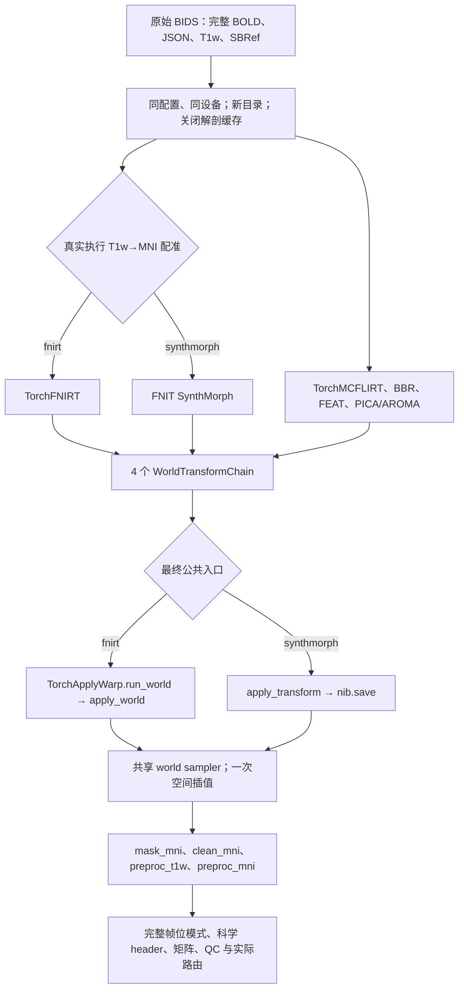
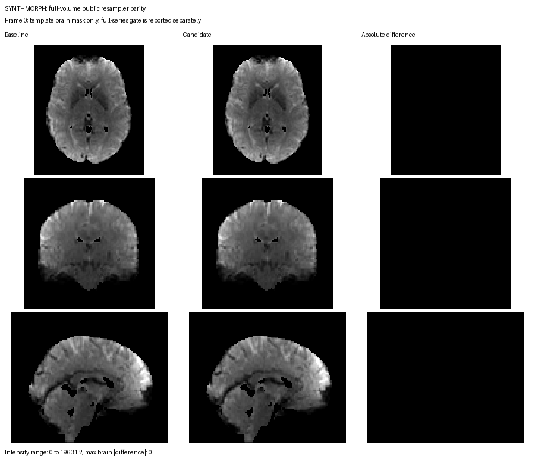

# fMRI volume 公共重采样入口：完整 490 帧验证

## 1. 目的、范围与流程图

本轮验证 `fMRIVolume_pipeline` 的四个最终空间采样节点是否实际调用所属后端的公共组件，以及接口接入是否保持原数值结果。冻结基线为 `6f67cc06ee8c5108ef3640cbfc289f3e5a742f65`（`6f67cc0`）；候选源码由正式报告内逐文件 SHA-256 绑定。

FNIRT 分支调用 `TorchApplyWarp.run_world → apply_world`，SynthMorph 分支调用 `apply_transform(WorldTransformChain)` 并由 nibabel 保存。两者共用从原成熟实现抽出的 `fnit._world_resampling.resample_world_image`。基线继续使用 `fnit.fmri.normalization.resample_world`；候选中该函数保留给其他既有调用。

两种配准后端分别与自己的冻结基线比较。FNIRT 与 SynthMorph 产生不同配准场，本轮不将两后端的结果互相作逐位等价判定。



## 2. Python 调用、输入与输出

输入是一例真实原始 BIDS run，BOLD 结构为 **88×88×64×490**，保留全部 490 帧、原始 TR 和时间顺序。同一份私有 case JSON 指定 BOLD/JSON、T1w、SBRef、固定 MNI 模板和模板 mask；公共报告仅发布角色、形状、大小和内容 SHA-256，不发布私有路径、被试标签或原始影像。

本轮采用默认 clean 配置：`regress_wm=False`、`regress_csf=False`、`regress_motion=False`、`slice_timing=False`。这些选项关闭额外混杂回归与 STC；运动估计和必要的 HMC 仍完整执行。高通、PICA/ICA-AROMA 等实际科学参数以正式报告的 `scientific_options` 为准，四次完整运行保持一致。两后端均从头完成 T1 解剖处理与配准，`reuse_anatomical=False`，使用彼此独立的新输出目录。

```python
import json
from pathlib import Path
from fnit.fmri import fMRIVolume_pipeline

private_case_json = Path("/absolute/path/private_case.json")
private_volume_parameters = json.loads(private_case_json.read_text())["volume"]
private_derivatives_root = Path("/absolute/path/new_derivatives")

volume_result = fMRIVolume_pipeline(
    **private_volume_parameters,  # 包含原始 BIDS、模板、run 筛选与相同科学参数
    derivatives_root=private_derivatives_root,
    registration_backend="fnirt",  # 另一次完整运行选择 "synthmorph"
    reuse_anatomical=False,        # 实际重跑 T1 解剖与非线性配准
    device="cuda:0",              # 物理 GPU 由 CUDA_VISIBLE_DEVICES 固定
)
print(volume_result.preproc_mni)  # 完整 490 帧 NIfTI 输出路径
```

私有 case 的 `volume` 键不得包含工具管理的 `registration_backend`、`derivatives_root`、`device` 和 `reuse_anatomical`。其余 API 参数见 [volume 文档](../../../docs/fmri/README.md#python-调用输入输出与参数)。公共入口的完整参数与 Python 示例见 [normalization 文档](../../../docs/fmri/normalization.md#python-调用输入输出与参数)。

| 最终节点 | 输入与输出 | 插值 / 边界 / 坐标精度 | HMC 与 mask |
|---|---|---|---|
| `mask_mni` | EPI 3D mask→MNI 3D mask | nearest / grid-constant / float64 | 无逐帧 HMC；采样后阈值并交模板 mask |
| `clean_mni` | 已 HMC/去噪 clean→MNI 全 490 帧 | spline / periodic / float64 | 不重复 HMC；应用同网格输出 mask |
| `preproc_t1w` | 原始 BOLD→T1w 原生 BOLD 分辨率全 490 帧 | spline / grid-constant / fmriprep | BBR 与真实逐帧 HMC 合成；无 MNI 场与输出 mask |
| `preproc_mni` | 原始 BOLD→MNI 全 490 帧 | spline / grid-constant / fmriprep | MNI pull、BBR 与真实逐帧 HMC 合成；无输出 mask |

四个节点各自完整调用一次。FNIRT 节点的 `run_world` 内部调用 `apply_world`，因此两个公共函数各有四次实际调用；SynthMorph 的 `apply_transform` 有四次相应调用。工具记录调用者、实际参数、非零配准场与非单位逐帧运动，返回 shape、affine、dtype 和全部帧数。

`WorldTransformChain` 按目标 grid 的 RAS 毫米位移、固定 RAS pull 仿射、可选逐帧运动顺序组合坐标；常规 FSL scaled-mm `warp/premat/postmat` 与本链不能混用。输出为 float32，空间 geometry 来自 reference，4D TR 与时间单位来自源。默认 8 帧 batch、262,144 点空间查询块；不降低体素数、帧数、插值阶数或系数精度。

## 3. 命令行复现：四次完整运行

使用相同干净 Python 环境、同一物理 GPU 和同一私有 case，分别运行两个源码树。`--source-root` 会校验实际导入的 FNIT 位置；`--output-dir` 已存在时直接拒绝，避免缓存命中。冻结源码树须是上述 `6f67cc0`，候选树须与报告 SHA 一致。以下四条命令由 [验证工具](../../../tools/validate_fmri_resampler_routing.py) 驱动原始 BIDS 公共 API。

```bash
# 所有路径与 run 标识只在服务器的私有 case JSON 中保留。
fnit_python="/absolute/path/clean_environment/bin/python"
frozen_source_root="/absolute/path/frozen_6f67cc0"
candidate_source_root="/absolute/path/candidate"
private_case_json="/absolute/path/private_case.json"
private_results_root="/absolute/path/new_private_results"
physical_gpu_id="0"  # 四次运行顺序使用同一物理 GPU

# 1. FNIRT 冻结基线：完整 T1/BOLD 从头执行。
CUDA_VISIBLE_DEVICES="$physical_gpu_id" PYTHONPATH="$frozen_source_root/src" \
  "$fnit_python" "$candidate_source_root/tools/validate_fmri_resampler_routing.py" \
  --case-json "$private_case_json" --source-root "$frozen_source_root" \
  --output-dir "$private_results_root/fnirt_baseline" \
  --backend fnirt --variant baseline --expected-frames 490 \
  --threads 8 --memory-limit-bytes 20000000000

# 2. FNIRT 候选：完整运行后比较同后端冻结输出。
CUDA_VISIBLE_DEVICES="$physical_gpu_id" PYTHONPATH="$candidate_source_root/src" \
  "$fnit_python" "$candidate_source_root/tools/validate_fmri_resampler_routing.py" \
  --case-json "$private_case_json" --source-root "$candidate_source_root" \
  --output-dir "$private_results_root/fnirt_candidate" \
  --backend fnirt --variant candidate --expected-frames 490 \
  --compare-to "$private_results_root/fnirt_baseline" \
  --threads 8 --memory-limit-bytes 20000000000

# 3. SynthMorph 冻结基线：独立完成 T1/BOLD 全流程。
CUDA_VISIBLE_DEVICES="$physical_gpu_id" PYTHONPATH="$frozen_source_root/src" \
  "$fnit_python" "$candidate_source_root/tools/validate_fmri_resampler_routing.py" \
  --case-json "$private_case_json" --source-root "$frozen_source_root" \
  --output-dir "$private_results_root/synthmorph_baseline" \
  --backend synthmorph --variant baseline --expected-frames 490 \
  --threads 8 --memory-limit-bytes 20000000000

# 4. SynthMorph 候选：比较相同学习权重和科学参数的冻结输出。
CUDA_VISIBLE_DEVICES="$physical_gpu_id" PYTHONPATH="$candidate_source_root/src" \
  "$fnit_python" "$candidate_source_root/tools/validate_fmri_resampler_routing.py" \
  --case-json "$private_case_json" --source-root "$candidate_source_root" \
  --output-dir "$private_results_root/synthmorph_candidate" \
  --backend synthmorph --variant candidate --expected-frames 490 \
  --compare-to "$private_results_root/synthmorph_baseline" \
  --threads 8 --memory-limit-bytes 20000000000
```

工具以 TF32、8 CPU 线程、float32 输出运行；不使用 float16。显存预算参数限制 allocator，验收要求全流程 `peak_cuda_allocated_bytes` 严格小于该上限并报告 reserved 峰值。影像比较与输入/源码审计位于 API 主时钟之外，完整 API 包含输出写盘。

## 4. 原软件调用与此次对照关系

本轮验收对象是公共接口接入前后的 **FNIT 同后端实现**。真实运行仅调用项目自身的 PyTorch/NumPy 组件和 nibabel，不启动 FSL、FreeSurfer、fMRIPrep、Nipype 或其他外部流程。

clean 的独立原软件对应采样命令为 `applywarp --in=CLEAN --ref=MNI --premat=BBR --warp=FNIRT --interp=spline`；本轮不重新执行该命令。preproc 的单次插值规则对照固定 fMRIPrep 25.2.4 / NiTransforms 25.1.0。已有原软件数值比较与完整变量命令见 [normalization 的原软件调用与历史实测](../../../docs/fmri/normalization.md#原软件调用)。此次的逐位门验收说明接口重构保留原 FNIT 行为；原软件相似度仍以对应冻结版本的独立报告为准。

## 5. 正式结果、验收门与脑图

四次真实完整 API 已完成。FNIRT 的 12 幅影像与 SynthMorph 的 7 幅影像均逐位一致，全部 490 帧、正负零、完整 header 字节与 extensions 无差异；逐帧运动矩阵、保存的 BBR 文本矩阵和四条实际采样变换链也相同。最终矩阵、路由、显存及输入/来源审计全部通过。正式测量的候选源文件由 SHA-256 绑定。发布前合入上游 `5d84c7d` 的 dMRI/TOPUP/EDDY-UKB 更新；fMRI、配准模型、公共 warp 和共享 spline 源码字节与本次测量一致，独立上游变更名单见汇总。

| 结果 | 文件与内容 |
|---|---|
| FNIRT 正式报告 | [fnirt.report.public.json](fnirt.report.public.json)：基线与候选完整 API、实际公共调用、阶段时间、输入/源码身份与显存 |
| SynthMorph 正式报告 | [synthmorph.report.public.json](synthmorph.report.public.json)：同范围的 SynthMorph 基线与候选真实完整运行 |
| FNIRT 严格输出比较 | [fnirt.comparison.public.json](fnirt.comparison.public.json)：相同设备/输入/科学配置的冻结基线与候选 |
| SynthMorph 严格输出比较 | [synthmorph.comparison.public.json](synthmorph.comparison.public.json)：同后端完整科学输出比较 |
| 汇总 | [summary.public.json](summary.public.json)：基线/候选时间、源码绑定、门结果和完整帧数 |
| 独立事后门检查 | [posthoc_gate.public.json](posthoc_gate.public.json)：正式报告、来源哈希及全部验收条件复核 |

| 后端 | 基线完整 API（含保存） | 候选完整 API（含保存） | allocated / reserved 峰值 | 路由门 | 全输出逐位 / 科学 header 门 |
|---|---|---|---|---|---|
| FNIRT | 511.09 s | 542.12 s | 6.50 / 10.78 GB | 通过 | 12 幅影像全部相同 |
| SynthMorph | 499.55 s | 461.54 s | 13.31 / 15.06 GB | 通过 | 7 幅影像全部相同 |

逐位比较扫描保存影像的所有体素和所有时间帧，包括掩膜外值、负值与 signed zero；gzip 文件时间戳差异不代替解码值比较。科学 header 比较 shape、dtype、affine、pixdim/TR、单位、qform/sform/code、缩放、intent、切片与时间字段，并比较 extensions。完整原始 header 字节原先另作诊断，本轮也全部相同。保存矩阵、数值数组、科学文本也分别检查；FNIRT 额外比较完整求解轨迹与科学 QC，排除墙钟和执行标签。SynthMorph 没有 FNIRT 求解轨迹，该项不适用，其余输出门保持相同。

路由门要求四个最终节点出现于生产 volume 调用链，实际使用对应公共入口，包含全部 490 帧、非零 MNI 场和真实逐帧运动，且解剖缓存未复用、所选配准后端完整执行一次。路由、数值、header 和显存门分别记录，缺失输出或失败不以局部脑图替代。

API 时间包含真实原始 BIDS 处理及保存，排除 CUDA 初始化、输入/源码审计、事后输出比较和已记录的验证捕获开销。阶段时间有嵌套边界，不能直接相加为总时间；原始计时与校正归属均保留。测试使用共享 GPU，计时可能受其他负载影响；这次单轮从头运行给出本次观测，不把小幅差值推广为稳定加速比。

### 分步骤观测（秒）

| 阶段 | FNIRT 基线 → 候选 | SynthMorph 基线 → 候选 |
|---|---:|---:|
| T1 非线性配准 | 24.34 → 27.34 | 6.42 → 6.78 |
| FEAT：含运动校正 | 85.01 → 88.85 | 88.66 → 64.91 |
| PICA / AROMA / clean | 75.68 → 80.72 | 76.38 → 62.67 |
| MNI mask + clean 采样 | 45.48 → 54.06 | 47.74 → 46.00 |
| T1w / MNI preproc 单次插值 | 249.93 → 263.03 | 250.04 → 251.31 |

完整步骤、坐标/插值参数与实际调用栈见两份正式报告。本轮没有稳定整链提速证据；两后端耗时变化方向不同，且改动保留原数值核。

### 验证工具修正与版本绑定

四次运行使用冻结执行工具 `a5a3ab90`，事后路由门使用 `a54f62e8`，并由独立审计器检查矩阵与完整变换链；三个 SHA-256 记录在汇总和事后报告中。冻结执行工具多扣除了两次位于 API 计时外的峰值查询耗时，这两个极短查询未单独保存，原观测值保留；当前工具已修正计时归属。该计时修正不涉及数值输出或峰值记录。

旧科学比较工具遗漏 BIDS 的 `*_xfm.txt`。当前工具已将其作为矩阵比较，并新增改值/缺失必须失败的测试。本轮已完成结果由独立审计器补查保存的 BBR 4×4 有限矩阵：原文本字节及解析后 float64 字节均相同。ICA-AROMA 的 95 分量中间映射仍使用兼容 wrapper；本轮明确验证的是表中的四个最终输出节点。

最终相关 GPU 回归：617 项通过、12 项因可选资源跳过，38.29 s；测试命令记录在汇总中。合入上游后的最终源码再次回归：617 项通过、12 项跳过，41.78 s。无新增依赖、无半精度。

### 模板脑 mask 内可视化

通过正式输出验收后，由 [脑图工具](../../../tools/figure_fnirt_pipeline_lossless.py) 生成基线、候选与绝对差的同切面示例；只显示模板脑 mask 内，PNG 不含路径、患者标签或扫描仪元数据。首帧示例用于展示空间位置，完整精度由所有 490 帧的独立门验收确定。




图的切面、强度范围、模板 mask/工具/PNG SHA-256 分别记录于 [FNIRT 图注清单](figures/volume_fnirt.public.json) 与 [SynthMorph 图注清单](figures/volume_synthmorph.public.json)。

## 6. 最近版本与 benchmark 记录

| 日期 / 源码 | 变化与范围 |
|---|---|
| 2026-10-02，本轮候选 | 四个 volume 最终节点按后端接入公共 world 入口；抽取共享数值体，保留边界、HMC、精度、4D 和 header 契约。正式结果见上表与逐文件 JSON。 |
| 冻结 `6f67cc0` | 本轮同设备/同输入回归基线；最终节点使用原 normalization wrapper。正式报告记录逐文件来源哈希。 |
| 2026-10-02，上一轮 | FNIRT 优化及 fastVBM/volume/dMRI 端到端验收，见 [registration lossless](../../registration_lossless_20261002/README.md)；其时间不作为本轮公共接口的测量。 |
| 2026-10-01，历史原软件对照 | 完整 490 帧固定 fMRIPrep 插值及 FSL clean 参照，见 [normalization 历史记录](../../../docs/fmri/normalization.md#最新真实数据精度耗时与脑图)。 |

## 7. 参考文献与原实现

- 本项目 [volume 实现](../../../src/fnit/fmri/end_to_end.py)、[共享 world sampler](../../../src/fnit/_world_resampling.py)、[TorchApplyWarp](../../../src/fnit/applywarp/core.py)、[SynthMorph 公共 apply](../../../src/fnit/synthmorph/pipeline.py)。
- 本轮 [验证工具](../../../tools/validate_fmri_resampler_routing.py)、[完整科学比较工具](../../../tools/validate_fnirt_pipeline_lossless.py)、[模板脑图工具](../../../tools/figure_fnirt_pipeline_lossless.py)。
- FSL [FNIRT / applywarp 指南](https://fsl.fmrib.ox.ac.uk/fsl/docs/registration/fnirt/user_guide.html)。Jenkinson et al., *NeuroImage* 17, 825–841 (2002)，运动校正与线性配准。
- 固定 [fMRIPrep 25.2.4 单次插值源码](https://github.com/nipreps/fmriprep/blob/25.2.4/fmriprep/interfaces/resampling.py)；Esteban et al., *Nature Methods* 16, 111–116 (2019)。
- 固定 [NiTransforms 25.1.0 仿射](https://github.com/nipy/nitransforms/blob/25.1.0/nitransforms/linear.py)与[形变查询](https://github.com/nipy/nitransforms/blob/25.1.0/nitransforms/nonlinear.py)。本包运行时不导入它们。
- [SynthMorph 原实现](https://github.com/voxelmorph/voxelmorph)；Hoffmann et al., *Anatomy-aware and acquisition-agnostic joint registration with SynthMorph*, Imaging Neuroscience (2024), [doi:10.1162/imag_a_00197](https://doi.org/10.1162/imag_a_00197)。本轮权重以 FNIT 固定资源清单的大小与 SHA-256 校验，许可与安装规则见 [权重与执行位置](../../../docs/synthmorph/README.md#权重与执行位置)。
