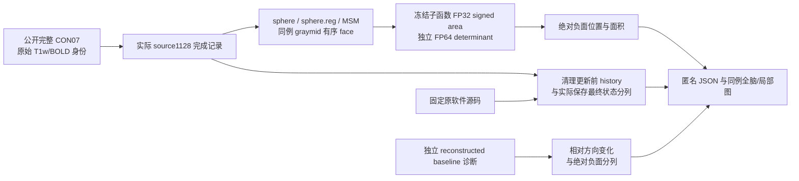
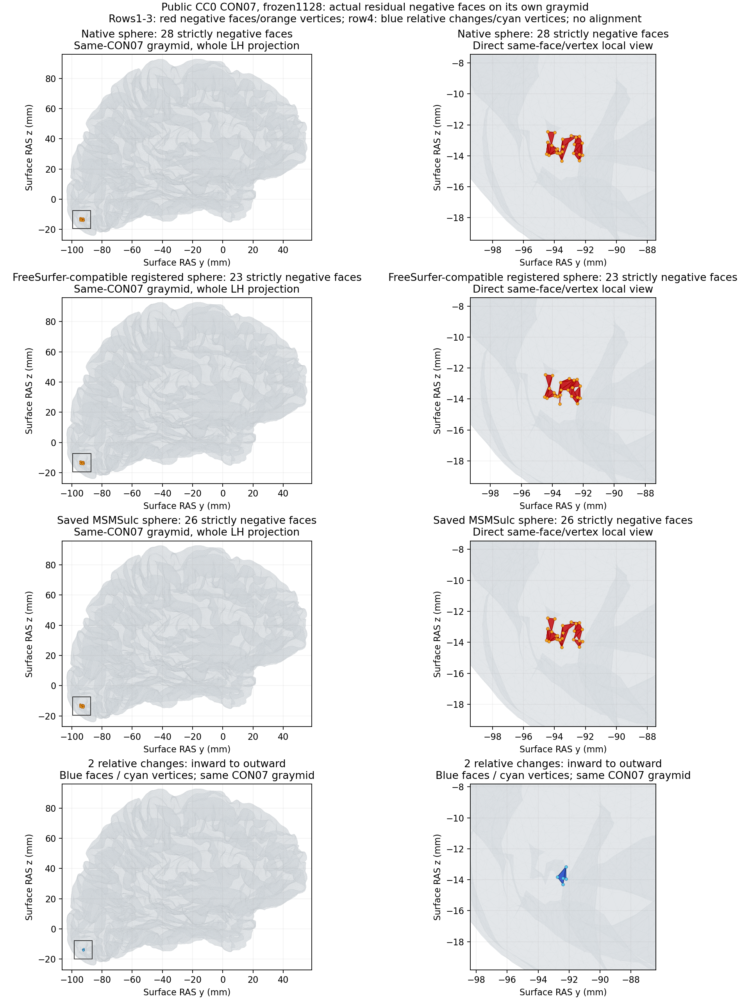

# CON07 球面质量的独立只读诊断

## 1. 功能与流程

正式 source1128 的 CON07 已完成 MRI 执行，但左侧球面仍有实际负向面。本页检查保存的几何、原有清理记录和方向判据，并把异常面标在同例真实 graymid 上；这些质量异常保留在验收结果中。它不重新计算 MRI、球面配准或 fMRI 时序，也不修改原件。



当前行为与固定原实现一致：清理有迭代上限，达到上限后可以返回仍有负向面的有限坐标。MSMSulc 最后保留原生插值及 float32 写出，并报告相对方向质量，不新增最终几何优化。此次诊断没有证明这些已声明行为是移植错误，因此保留数值代码与原始结果。

## 2. Python 调用、输入与输出

独立脚本为 [`diagnose_sphere_overlap_real.py`](diagnose_sphere_overlap_real.py)。它使用 nibabel 读取已有 FreeSurfer 三角表面与 GIFTI，调用实际冻结 `face_area_normals(..., signed_sphere=True)` 的 CPU 判据，并以相同保存坐标在 NumPy float64 中计算 `cross(b-a,c-a)·a`。前者保留原函数精度，后者只用于独立检查，不改变原网格。

```python
import json
from pathlib import Path

# 以下为独立诊断已经写出的匿名报告，MRI 和原始表面仍在服务器。
sphere_diagnostic_report_file = Path("/path/to/CON07_sphere_quality_diagnostic.public.json")
sphere_diagnostic_report = json.loads(sphere_diagnostic_report_file.read_text())
assert sphere_diagnostic_report["input_guards_equal"] is True
assert sphere_diagnostic_report["same_case_graymid_faces_exact"] is True
print(sphere_diagnostic_report["metrics"]["lh/sphere"])
print(sphere_diagnostic_report["cleanup"]["lh/sphere"])
```

在已安装 torch、nibabel、NumPy 和 matplotlib 的 Conda Python 中，可直接启动完整独立检查：

```python
import os
import subprocess
import sys
from pathlib import Path

# 替换成现场核验的绝对路径；输出目录必须是全新的独立目录。
sphere_diagnostic_script_file = Path("/path/to/FNIT/validation/fmri/public_ten_20261003/diagnose_sphere_overlap_real.py")
formal_case_root = Path("/path/to/formal/candidate_v4/CON07")
frozen_fnit_source_root = Path("/path/to/source_1128bc52")
fixed_freesurfer_source_root = Path("/path/to/fixed/freesurfer/source")
public_data_manifest_file = Path("/path/to/raw/public_manifest.json")
relative_orientation_report_file = Path("/path/to/CON07.sphere-orientation-baseline.public.json")
fresh_sphere_diagnostic_output = Path("/path/to/fresh/CON07_native_sphere_diagnostic")

# 仅运行 CPU 后验检查；不启动 MRI、MSM solver 或官方软件。
sphere_diagnostic_environment = dict(os.environ, CUDA_VISIBLE_DEVICES="",
    OMP_NUM_THREADS="1", OPENBLAS_NUM_THREADS="1", MKL_NUM_THREADS="1")
subprocess.run([
    sys.executable, str(sphere_diagnostic_script_file),
    "--case-root", str(formal_case_root),
    "--source-root", str(frozen_fnit_source_root),
    "--upstream-source", str(fixed_freesurfer_source_root),
    "--data-manifest", str(public_data_manifest_file),
    "--relative-diagnostic", str(relative_orientation_report_file),
    "--output-root", str(fresh_sphere_diagnostic_output),
], env=sphere_diagnostic_environment, check=True)
```

全部输入参数如下：

| 参数 | 内容与格式 |
|---|---|
| `case_root` | 正式 CON07 目录；包含完整 `report.public.json`、私有产物映射及 source1128 自产重建。 |
| `source_root` | 实际冻结 FNIT source1128 根目录；使用其 CPU signed-area 子函数，核对实际导入路径与源码 SHA。 |
| `upstream_source` | 已有固定 FreeSurfer 源目录；只读 `utils/mrisurf_timeStep.cpp` 并记录 SHA 和原停止语义的位置，不复制发布原代码。 |
| `data_manifest` | 已校验的 OpenNeuro ds001226 v5.0.1 CC0 清单；核对 CON07 原始 T1w/BOLD SHA 和完整 180 帧。 |
| `relative_diagnostic` | [独立方向基线报告](reconstruction_completed/CON07.sphere-orientation-baseline.public.json)；确认同一保存网格、原件守卫和两个相对变化面。该报告明确未恢复原临时旋转文件或未保存的 native 插值后、cast 前坐标。 |
| `output_root` | 必须不存在的新目录；写匿名 `report.public.json`、PNG 和服务器私有路径映射。 |

三种球面各有 N×3 保存坐标与 F×3 有序整数 face；graymid 必须与同侧球面顶点数及每个有序 face 完全相同。输出 JSON 分列两侧绝对负面、实际 FP32/FP64 判据、面积与边长范围、原清理 history、相对 MSM QC、源与输入前后 SHA。PNG 只使用同例 graymid 的 y/z 直接投影，未做配准或位置拟合。

## 3. 命令行调用

```bash
FNIT_PYTHON=/path/to/verified/conda/bin/python
CON07_FORMAL_CASE_ROOT=/path/to/formal/candidate_v4/CON07
FNIT_FROZEN_SOURCE=/path/to/source_1128bc52
FIXED_FREESURFER_SOURCE=/path/to/fixed/freesurfer/source
PUBLIC_DATA_MANIFEST=/path/to/raw/public_manifest.json
SPHERE_BASELINE_REPORT=/path/to/CON07.sphere-orientation-baseline.public.json
SPHERE_DIAGNOSTIC_OUTPUT=/path/to/fresh/CON07_native_sphere_diagnostic

# 独立后验 CPU 检查不占 GPU，完整 MRI 和表面原件保持只读。
export CUDA_VISIBLE_DEVICES=''
export OMP_NUM_THREADS=1 OPENBLAS_NUM_THREADS=1 MKL_NUM_THREADS=1
"$FNIT_PYTHON" diagnose_sphere_overlap_real.py \
  --case-root "$CON07_FORMAL_CASE_ROOT" \
  --source-root "$FNIT_FROZEN_SOURCE" \
  --upstream-source "$FIXED_FREESURFER_SOURCE" \
  --data-manifest "$PUBLIC_DATA_MANIFEST" \
  --relative-diagnostic "$SPHERE_BASELINE_REPORT" \
  --output-root "$SPHERE_DIAGNOSTIC_OUTPUT"
```

程序拒绝可用 CUDA、非 CC0 原始身份、不完整病例、错误源导入、不同有序 face、不同保存网格或运行前后 SHA 变化。这里的 `status=complete` 指后验诊断完成，不能解释为 CON07 几何质量通过。

## 4. 原软件调用与对应实现

对应原球面阶段的命令形式为：

```bash
# 原始 inflated 和标准球面，均使用完整绝对路径。
INFLATED_SURFACE=/absolute/path/subject/surf/lh.inflated
STANDARD_SPHERE_OUTPUT=/absolute/path/new-output/lh.sphere
FOLDING_ATLAS=/absolute/path/fixed-assets/lh.folding.atlas.acfb40.noaparc.i12.2016-08-02.tif
REGISTERED_SPHERE_OUTPUT=/absolute/path/new-output/lh.sphere.reg

# MSMSulc 的原生旋转输入、固定参考、脑沟特征与配置。
ROTATED_NATIVE_SPHERE=/absolute/path/msm-inputs/L.sphere_rot.surf.gii
REFERENCE_SPHERE=/absolute/path/fixed-assets/L.reference.sphere.surf.gii
NATIVE_SULC_METRIC=/absolute/path/msm-inputs/L.sulc.shape.gii
REFERENCE_SULC_METRIC=/absolute/path/fixed-assets/L.reference.sulc.shape.gii
MSMSULC_CONFIGURATION=/absolute/path/MSMSulc.conf
MSM_OUTPUT_PREFIX=/absolute/path/new-output/L.MSMSulc.

# 原软件的完整阶段示例；本次诊断不执行这些命令。
mris_sphere "$INFLATED_SURFACE" "$STANDARD_SPHERE_OUTPUT"
mris_register -curv "$STANDARD_SPHERE_OUTPUT" "$FOLDING_ATLAS" "$REGISTERED_SPHERE_OUTPUT"
newmsm --inmesh="$ROTATED_NATIVE_SPHERE" --refmesh="$REFERENCE_SPHERE" \
  --indata="$NATIVE_SULC_METRIC" --refdata="$REFERENCE_SULC_METRIC" \
  --conf="$MSMSULC_CONFIGURATION" --out="$MSM_OUTPUT_PREFIX"
```

原清理为 `MRISremoveOverlapWithSmoothing`。现场固定源码 `utils/mrisurf_timeStep.cpp` 的 SHA-256 是 `402bfd0bfdb5cf0bc59600f30592facf6a60890e78cdff3fa696f7fcec4ca553`：第 2417–2424 行初始化 `min_neg_iter=0` 与 `start_t`，第 2470–2472 行在长期无进展时退出，第 2486–2487 行检查迭代上限，第 2493–2501 行打印残留负面并返回 `NO_ERROR`。FNIT [`remove_overlap_sphere`](../../../src/fnit/recon_all/mris_register_overlap.py) 使用对应初始化与停止条件。不能把 `min_iteration=0` 擅自改为 `start_iteration`。

[`_native_output_qc`](../../../src/fnit/msm/msmsulc.py) 的 MSM 方向比是输出 signed determinant 除以归一化旋转输入的 signed determinant。负分母允许存在，所以这个相对变化数与绝对朝外负面数是不同定义。原生末端不加 unfold 的保存合同也已在 [MSM 文档](../../../docs/msm/README.md) 中声明。

## 5. 最新真实检查、耗时与脑图

[匿名实际报告](CON07_sphere_quality_diagnostic.public.json)核验两侧三种保存球面均有限、零 determinant 面均为 0，且实际冻结 FP32 判据与独立 FP64 判据给出的负面集合逐面完全相同。左侧 137777 顶点、275550 face，右侧 142461 顶点、284918 face；右侧三种球面绝对负面均为 0。

最终版 CPU 1 线程的检查与绘图墙钟为 15.504451 秒，包含保存网格读取、实际判据、独立基线逐面复核、绘图和最后 SHA 检查；最初的身份预检在该时钟之前。它不计入正式 MRI、MSM 求解或 GPU API 运行时间。

| 左侧保存网格 | 绝对负面 | 负面总面积 mm² | 最负 signed area mm² | 最负 determinant mm³ |
|---|---:|---:|---:|---:|
| `sphere` | 28 | 0.0006559974 | −0.0002127089 | −0.04254178 |
| `sphere.reg` | 23 | 0.0056823471 | −0.0047524176 | −0.95048205 |
| 保存 MSMSulc | 26 | 0.0007388842 | −0.0002392945 | −0.04785889 |

`sphere` 负面积占无符号总面积约 5.22×10⁻⁹，`sphere.reg` 约 4.52×10⁻⁸；负面中有很薄的三角形，原生球面的边长最小约 0.000112 mm。这些量级说明实际异常规模，不把残留负面改记为零或质量通过。

| 实际清理记录 | 清理前更新数 | 更新前 history 长度 | 首个 / 最低 / 最后更新前负面 | 独立保存最终负面 |
|---|---:|---:|---|---:|
| LH `sphere` | 166 | 1001 | 46 / 23 / 27 | 28 |
| LH `sphere.reg` smoothwm pass | 60 | 1001 | 60 / 17 / 22 | 23 |
| RH `sphere` | 193 | 5 | 8 / 1 / 1 | 0 |
| RH `sphere.reg` smoothwm pass | 50 | 5 | 17 / 1 / 1 | 0 |

`negative_counts` 记录每次更新之前的状态，不包含最后一次更新后的实际保存状态。因此 LH 的最后 history 27/22 与保存 28/23 可以不同；RH 最后 history 为 1，最后更新后却为 0。LH 的 1001 次清理记录达到默认 1000 的 `>` 停止阈值，与原实现有限清理后返回的语义一致；并非 FP32 谓词漏掉了这组实际负面。

生产 MSM 的 LH 相对 QC 在最后 `_sphere_warp` 原生插值之后、保存 float32 cast 之前为 `folded_solver_faces=0`、最小方向比 0.68419594，保存精度为 `folded_output_faces=1`、最小方向比 −0.80807054。源码的这个 solver 字段测量 native 插值后的保存前数组，不是 DATA/control 优化器网格；调用顺序见 [`msmsulc.py` 的实际实现](../../../src/fnit/msm/msmsulc.py)。另一个以原始 native sphere 为分母的后验检查得到 2，最小比 −96.87821390。[独立基线诊断](reconstruction_completed/CON07.sphere-orientation-baseline.public.json)具体解释如下：

| face | 原 native determinant | 归一旋转基线 determinant | 保存 MSM determinant | 原 native / 旋转基线方向比 |
|---|---:|---:|---:|---|
| 50 | −4.1163×10⁻⁸ | +2.6545×10⁻⁶ | +3.9878×10⁻⁶ | −96.8782 / +1.50227 |
| 137 | −9.1039×10⁻⁸ | −8.2736×10⁻⁷ | +6.6856×10⁻⁷ | −7.34369 / −0.808071 |

两个面均从原 native 的朝内取向变为保存 MSM 的朝外取向；它们不是新增绝对朝内面。“native 插值后、cast 前 0 → 保存 FP32 后 1”描述相对同一旋转基线的精度变化，不能据此推断未保存的 native cast 前坐标的绝对朝内数量。重新准备的旋转 GIFTI 含新 Workbench provenance 路径，完整文件 SHA 与原临时文件不同；它准确再现保存 QC 的方向比，但不是原临时文件或未保存 native 插值后、cast 前坐标的恢复。



前三行分别显示绝对负面 28、23、26：红色为该网格实际负向 face，橙色为它们的顶点。第四行单独显示两个相对变化面，使用蓝色 face 与青色顶点，避免与负面混淆。每行左图是 CON07 自己的完整 LH graymid 直接 y/z 投影，右图为同一坐标的局部放大；高亮前已证明所有有序 face 与 graymid 完全相同。原件没有移动或拟合。图和诊断耗时独立于十例 MRI 及四路线 GPU 时钟；该次检查只比较实际保存几何与原判据，没有重新执行原软件整阶段，不替代[原球面子功能 benchmark](../../../docs/recon_all/SPHERE_REGISTRATION_PERFORMANCE.md)。

## 6. 更新与诊断记录

- 正式执行固定 `1128bc52c7a0233266e5b8a8d7dc0b382994e676`，CON07 原始报告、MRI、球面、时序和时钟全部保留。后验发现的质量异常不改成整例质量通过。
- 初版独立诊断核验绝对负面、停止记录与实际 graymid 全脑/局部图，CPU 含绘图 11.897825 秒；服务器原 attempt 保留。
- 最终版加入两个相对变化面及独立基线报告的原网格 SHA、真实 face 索引与 determinant 逐项核验，颜色和图例分列绝对与相对判据；图形检查后缩短第四行标题，原 attempts 保留。匿名报告绑定实际脚本、固定子函数、原软件源码、清单、保存网格与 PNG 的 SHA。
- 未修改 `min_iteration`、清理迭代预算、末端 unfold、GIFTI dtype、GPU 网络精度或生产源。当前证据不足以把固定原实现允许的残留与已声明末端输出行为认作新的移植 bug。

## 7. 参考文献与原代码库

公开数据：[OpenNeuro ds001226 v5.0.1](https://openneuro.org/datasets/ds001226/versions/5.0.1)，CC0。[FreeSurfer 固定源码的清理实现](https://github.com/freesurfer/freesurfer/blob/d932c45/utils/mrisurf_timeStep.cpp)、[mris_sphere](https://github.com/freesurfer/freesurfer/blob/d932c45/mris_sphere/mris_sphere.cpp)、[mris_register](https://github.com/freesurfer/freesurfer/blob/d932c45/mris_register/mris_register.cpp)。MSM 原代码库：[newMSM](https://github.com/rbesenczi/newMSM)；原生末端及版本范围见 [MSM 功能文档](../../../docs/msm/README.md)。

参考：[Fischl et al., *NeuroImage* 9, 195–207 (1999)](https://pubmed.ncbi.nlm.nih.gov/9931269/)；[Robinson et al., *NeuroImage* 100, 414–426 (2014)](https://pubmed.ncbi.nlm.nih.gov/24939340/)。
