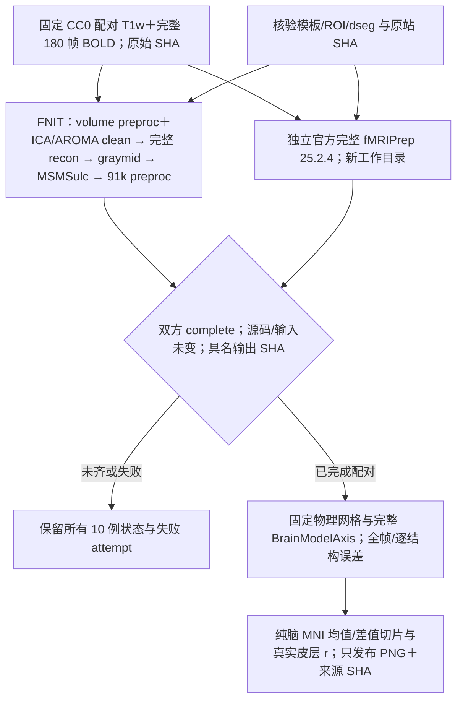
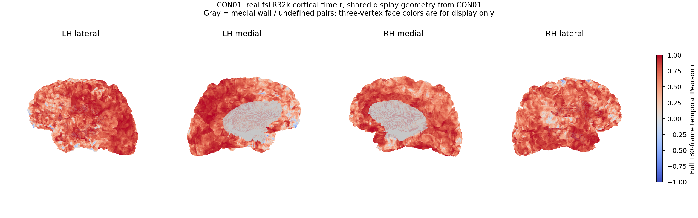
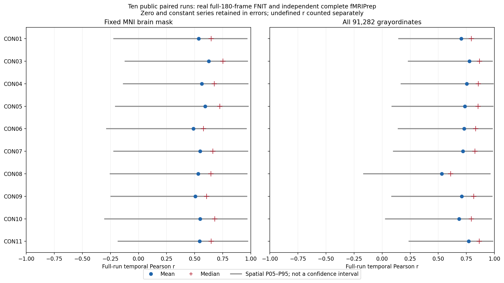

# 十例公开 T1w 与完整静息态 fMRI 整链验证

## 功能简介与流程图

本目录保存正式 `1128bc52` 的 raw T1w/BOLD→自动 volume→完整 recon-all→MSMSulc→surface 验收。十例公开数据已完整核验；CON01/CON03/CON04/CON05/CON06/CON07/CON08/CON09/CON10/CON11 已完成独立全180帧比较与真实脑图，当前配对 **10/10**，全十例输出与比较均已保存。完整方法、各计时边界与全部来源 SHA 见下文；v2/v3 的失败和超显存诊断保持独立，不计入正式结果。

数据为 [OpenNeuro ds001226 BTC_preop](https://openneuro.org/datasets/ds001226/versions/5.0.1)，许可 CC0，DOI `10.18112/openneuro.ds001226.v5.0.1`。固定官方 Git commit 为 `359d372c5e972a161966312128adb365870df949`；每幅完整 NIfTI 均核对该版本 git-annex 的大小和 MD5，并保存本次文件 SHA-256、原始 S3/JSON 来源、形状和头信息，见 [数据清单](data_manifest.public.json)。十幅 BOLD 压缩文件共 384,286,158 字节。

| 公开被试 | 原始完整帧数 | TR（秒） |
|---|---:|---:|
| CON01、CON03、CON04 | 每例 180 | 2.1 |
| CON05–CON11 | 每例 180 | 2.4 |

队列沿用已有公开 connectome 十例：CON01、CON03–11。此前 CON02 的 dMRI AP/PA 世界坐标相位编码方向近乎正交，因此用 CON11 补足，证据见 [原始数据验证](../../connectome/tenraw_20261002/task_01/README.md)。本轮延续同一队列，不把该原因解释成 CON02 的 T1w 或 BOLD 质量不合格。

[资源清单](assets_manifest.public.json)包含 20 个已核验的 HCP 文件和 3 个 TemplateFlow 文件。已有 HCP 闭包只复制到本轮独立资源目录；新需的 MNI152NLin6Asym 2 mm T1w 与 brain mask 从原始 TemplateFlow S3 获取并核对固定大小及 SHA-256。原资源没有被修改，原始图像不存入 Git。



## Python 调用与输入输出

生产入口及其三个重建选项的 Python 示例、所有参数和 BIDS 输出结构见 [surface pipeline](../../../docs/fmri/surface.md#python-调用输入输出与参数)。本目录的独立验收工具不执行或替换生产算法。

[collect_cohort.py](collect_cohort.py) 的 `collect(config, output, metadata_only=False)` 输入私有配置字典和新报告目录，返回匿名公共报告。下面在仓库根目录直接使用验证脚本：

```python
import json
import sys
from pathlib import Path

validation_script_directory = Path("validation/fmri/public_ten_20261003").resolve()
sys.path.insert(0, str(validation_script_directory))  # 仅加载本轮独立验证工具
from collect_cohort import collect

private_configuration_path = Path("/data/fnit/public_ten/cohort_config.private.json")
private_configuration = json.loads(private_configuration_path.read_text())
new_collection_directory = Path("/data/fnit/public_ten/new_provenance_snapshot")
new_collection_directory.mkdir(mode=0o700)  # 新目录；不覆盖已有 attempt
public_collection_report = collect(
    config=private_configuration,
    output=new_collection_directory,
    metadata_only=True,  # 只记录实际环境/状态；False 时比较已完成配对
)
```

私有配置逐项定义：

| 输入 | 格式、内容和作用 |
|---|---|
| `cohort_id`、`candidate_root` | 正式队列使用明确的 `formal-vN` 与对应 `candidate_vN` fresh 根；所有 candidate 报告必须位于这个显式绑定根内。每轮新冻结和重试重新绑定，历史失败及 v2 诊断单列，不能混入另一轮十例统计。 |
| `data_manifest`、`assets_manifest` | 各为 `{path, sha256}`；绑定本目录固定数据/资源清单。只处理声明的十例完整 180 帧，不按目录 glob 选择旧病例。 |
| `raw_root`、`resources_root` | 已核验的原始 BIDS 与本轮 23 个模板/ROI/球面资源根。MRI、资源和授权许可不存 Git；许可文件不读取或重新哈希。 |
| `source_root`、`source_revision`、`python_prefix` | 实际冻结 FNIT 源码、对应 revision 与真实 Conda 前缀；探针记录 Python、Torch/CUDA/cuDNN、包版本和当前硬件。探针 Torch 默认状态与 runner 显式 TF32 声明分开，不能作为运行中每阶段精度测量。 |
| `candidate_cases`、`reference_cases` | 各为 `公开case_id: {report, files, report_sha256?, files_sha256?, config?, config_sha256?, queue_report?}`；已完成的 corrected 参考显式绑定 report/files SHA，候选初始配置绑定 bytes SHA。`files.private.json` 精确绑定 `preproc_mni` 与 `dtseries`；私有配置与 queue 只发布 SHA 和具名数值，不复制原始路径/命令。 |
| `programs` | `[{id, path, sha256?, build_id?}]`；核对实际已安装程序的大小/SHA。安装文件快照本身不证明执行过，最终执行来源需结合各例报告。 |
| `build_records` | `[{id, manifest:{path,sha256}, binaries:[{id,path}], source_files:[{id,path,sha256}]?}]`；核对实际二进制、编译源码与静态库，保留原完整命令的哈希。编译/安装时间单列。 |
| `provenance_files`、`source_trees` | 具名编译记录、CMake/安装 SHA 文件与源码根的只读清单；公共 JSON 保存源码树指纹和数量，完整路径/逐文件清单保持私有。不由单个树指纹推断全部程序的编译闭包已验证。 |
| `earlier_attempts` | `[{case_id,side,attempt_id,report,report_sha256?,execution_status?,signal_event?}]`；后两项各为 `{path,sha256}`，将保留报告与后续中断观测/信号事件分别绑定、分别计时。只检查历史报告字段，不要求已完整重建的 private files 映射；保留原 complete/failed 与 `memory_over_target`。v2 两例也仅在这里或独立诊断报告中列出，`formal_benchmark_included=False`。 |
| `runtime_environment_policy` | 该轮 allocator/启动策略、父进程空闲缓存处理及内存/线程目标的声明。保存 launcher SHA，并按 exec 前最后一个明确 export/unset 记录 flag presence 与 `selection_at_exec_statement`；unset 表示启用缓存，export 的 `0` 或空字符串仍表示禁用。driver 的实际环境 presence 另存，不由声明推断实际显存或每阶段精度。旧 v3 export 禁用缓存的真实记录保持原样，新正式 v4 使用 unset，在实际冻结后独立绑定。 |
| `render` | 可选真实显示几何清单，格式见下面；没有完成配对或真实几何时不伪造脑图。 |

[watch_cohort.py](watch_cohort.py) 的 `watch(manifest_path, output_root, poll_seconds=30.0, maximum_polls=None, maximum_attempts_per_signature=3, retry_seconds=60.0)` 只读等待同一正式队列。私有 watch manifest 逐项绑定：

| 字段 / 参数 | 输入与作用 |
|---|---|
| `cohort_config` | `{path, sha256}`：已冻结十例配置、原始数据/资源/程序清单及每例精确 fresh attempt；运行前后核对原 bytes，不修改该配置。 |
| `analysis_root`、`analysis_tools_sha256` | 独立 frozen 工具目录和 collect/compare/render/geometry 四脚本的 SHA；导入 helper 前先核验四个 SHA，直接编译核验后的 source bytes，禁写 pyc；持续检查工具与 watcher 自身未变。 |
| `render_geometry` | `{path, sha256}`：已经验证的 formal-v4 CON01 实际显示几何绑定；各例只使用自己的 CIFTI scalar。 |
| `output_root` | 新独立等待目录；拒绝已存在目录及 raw、MRI输出、参考attempt或源码的内部/上层路径。每个新配对集合再建 `batch_NNN/collection`。 |
| `poll_seconds` | 默认 30 s，有限且至少 5 s；仅轮询小 JSON，不启动 MRI。 |
| `maximum_polls` | 默认 `None` 等到十例比较与脑图 complete；整数限制只用于独立验收探针，不代表MRI队列完成。 |
| `maximum_attempts_per_signature` | 默认 `3`，正整数；同一组 report/files SHA 的分析失败最多尝试三次，每次用 fresh 批次目录，不重新执行 MRI。 |
| `retry_seconds` | 默认 `60` s，有限且至少 5 s；失败后最短分析重试间隔，完成 MRI 不等待重新处理。 |

等待器按每个已绑定 attempt 自动读取固定 `report.corrected.public.json` / `files.corrected.private.json`，不 glob、不捡旧输出。candidate 必须完整、source1128/输入/config/driver守卫通过且 queue 已 exit0并保存完整进程时钟；参考须 strict corrected 完整，并再次核对其 original report 实际 SHA 和 passed/failed 状态。原 QC passed 的边界保留为 passed，后验 strict QC 单列；CON08/09/10/11 的真实完整 MRI 已验证该分支，原通过报告与 strict corrected 分别保留。每次新集合写具名实际 SHA 的新配置并运行原 frozen collector/renderer；失败保留，原 MRI报告、初始两例与所有旧批次不改。`events.public.jsonl` 记录全部十例状态，`batch_NNN/dispatch.public.json` 绑定批次报告/配置SHA；只有10例比较和图均complete才保存 `watch_complete.public.json`。等待和后验分析时间排除于 MRI 时钟。canonical v13 对缺报告、坏 JSON 或非零退出保留失败批次；只在比较和图都保存成功后记为已收集。失败达到重试上限写 `needs_attention.public.json` 并继续监测新集合；有界探针以状态 needs_attention 和退出码 2 返回，不将失败 signature 永久当成功；每次子进程禁写 pyc。

[compare_subject.py](compare_subject.py) 输入私有 JSON：`cohort_id`、`source_revision`、`candidate_root`、`case_id`、`frames=180`、`tr_seconds`、`raw.{t1w,bold,bold_json}`、`brain_mask`、`cifti_axis_assets.{left_roi,right_roi,dseg}` 各绑定 `{path,sha256}`，`candidate/reference` 绑定 `{report,files,report_sha256?,files_sha256?}`；candidate 报告、映射和最终输出必须位于本轮 root，报告 source revision 必须一致。collector 将实际读取的两边 report SHA 写进配对 manifest，独立 compare 再核验，守住收集与比较之间的字节来源。三项 axis 资源为原有 L/R 32k atlas ROI 与 TemplateFlow HCP dseg，并非新增下载。输出 `comparison.public.json` 包含同轮 `cohort_id`、定义、真实文件 dtype/单位/轴、全域和 21 结构指标；`arrays.private.npz` 只供纯脑图生成，保持私有。

[render_cohort.py](render_cohort.py) 输入 `cohort_id`、`comparisons=[{case_id,report,arrays}]`、`cortical_meshes={left,right}`。每侧几何为 `{path,sha256,space:"fsLR32k",kind:"midthickness"}`；另需 `display_geometry={case_id:"CON01",provenance:{path,sha256}}`。比较报告与显示几何必须属于同轮，几何记录的 case/cohort、complete、输入 SHA 和输出双侧 SHA 均需匹配；近乎恒定半径的 sphere 会被拒绝。最终显示几何来自该轮已完成 CON01 的实际 graymid、保存的新 MSMSulc 球面和固定 atlas sphere；23 个固定资源中没有已获取的 32k middle。该 CON01 几何统一用于显示，各例 scalar 仍按各自 CIFTI 的真实 vertex index 填图。

[prepare_display_geometry.py](prepare_display_geometry.py) 独立调用成熟 `prepare_t1w_surface_geometry` 转换真实 middle，再用 Workbench `BARYCENTRIC` 按正式 CON01 保存的球面重采样。私有 manifest 需 `cohort_id="formal-vN"`（N≥3）、`case_id="CON01"`、对应 `candidate_vN` 根、`source_root/source_revision`、`candidate.{report,files,source_inventory}`、`raw_t1w`、`registered_spheres/atlas_spheres.{left,right}` 和 `workbench`；具名文件均绑定 `{path,sha256}`，`cpu_threads` 默认 4。工具核对已完成的 fresh 原始输入、实际源码清单、源 T1w/orig 头及 native 网格顺序、注册球面和固定 atlas SHA。所有输入/程序/源码在调用前后保持不变才发布 `display_geometry.public.json`；派生网格与命令留在私有目录，`render_geometry.private.json` 给出绘图绑定。该准备墙钟独立于生产 benchmark；正式 CON01 的 v11 fresh attempt02 已完成真实几何准备，见第5节；初次 JSON 序列化失败独立保留。

[export_report_tables.py](export_report_tables.py) 的 `export_tables(cohort_report, comparisons_root, output_root, reference_stages=None)` 从已发布匿名 JSON 导出明细，不读取影像、不重新计算指标。`cohort_report` 是 guarded formal-v4 的 `cohort.public.json` 或下载后的具名快照；`comparisons_root` 包含精确 `CONxx.public.json` 或 `CONxx/comparison.public.json`，逐例 SHA 必须匹配 cohort；`output_root` 为独立新目录。可选关键字 `reference_stages` 为已有真实阶段 JSON，须由固定 v1/v2 extractor 产生且每例 report SHA 匹配同一个 strict completed reference；未传则不导出这份节点表。输出 `endpoints.csv` 为 volume/CIFTI 全域，`structures.csv` 为全部十例×21结构；mean/median/P05/P95、RMSE/实际参考RMS/NRMSE、零/常数、绝对差、时间均值偏差及 tSNR 原样列出。`timings.csv` 用 side/category/field/seconds/boundary 保留 queue、API、保存验证、参考容器/原 wrapper/后验 QC 与嵌套阶段；不相加。可选 `reference_stages.csv` 保留每组活动 union、含依赖等待的 span、实际监控节点数与资源 null；不能从总 span 推断纯计算耗时。pending/failed 全部保留，空格表示未测或未定义。返回/保存 `tables_provenance.public.json` 绑定 cohort、各 completed report、导出工具前后守卫与全部 CSV 的 SHA；只有十例齐才为 `complete_cohort`。

在该验证脚本目录运行 Python，路径明确指向已经保存的公开报告：

```python
from pathlib import Path
from export_report_tables import export_tables

public_cohort_report = Path("/data/fnit/public_ten/batch01/cohort.public.json")
public_completed_comparisons_directory = Path("/data/fnit/public_ten/batch01/comparisons")
new_public_table_directory = Path("/data/fnit/public_ten/tables_batch01")  # 新目录；原报告保持只读
tables_result = export_tables(
    cohort_report=public_cohort_report,
    comparisons_root=public_completed_comparisons_directory,
    output_root=new_public_table_directory,
    reference_stages=Path("/data/fnit/public_ten/reference_stages_all10_20261003.public.json"),  # 可选真实节点表
)
print(tables_result["status"])           # partial_cohort / complete_cohort，未齐十例保留未测行
print(tables_result["completed_cases"])  # 实际完成且通过绑定的公开病例ID
```

输出只发布每例 MNI temporal-mean/差值/r 切片、皮层 r PNG、十例空间分布汇总和 `figures_provenance.public.json`。汇总保留全部预声明病例及 pending/failed，P05–P95 是空间分布范围，不是置信区间；缺失结果和非有限失败不删除。

单例 complete 报告若未通过来源、输入或时间轴校验，收集器将该例的独立检查记为 failed，并继续保存其余九例状态；原 pipeline 退出状态另存 `pipeline_reported_status`，错误详情只写私有记录。正式已完成 FNIT case 还读取 sidecar 中实际重建和 graymid 程序 SHA，结合安装/编译记录检查来源，不仅由当前程序快照推断执行过。历史 report-only 项保留其原状态，不应用新的 private files 需求。独立比较或绘图失败也单列，已核验的其他配对结果继续保留。`cohort.public.json` 的 complete 表示十例比较执行完成并保存报告；实际脑图是否完成由独立 `figures` 状态和图来源清单确认。

新 [FNIT 单例验收驱动](run_fnit_subject.py)核对实际导入的 pipeline 属于显式冻结根，绑定配置的原始 bytes SHA，并复核原始 T1/BOLD 与全部继承 BOLD JSON 在调用前后的 SHA。driver 本身也有前后守卫；BaseException 保留失败，API 前的失败没有伪造 API 耗时。收集器公开配置/导入源码 SHA、守卫状态及匿名 metadata inventory，实际输入路径保留私有。独立分析入口还核对实际导入的 compare helper 来自本次工具目录，记录 collector/compare/renderer/geometry 四个脚本的前后 SHA；它们不改变生产 MRI 源码或历史运行报告。采样缺失或出错时，未观测峰值及 under-20GB 判断为 null；已成功观测到超预算的峰值仍如实报告。

## 命令行调用

### 获取和校验

[download_public_data.py](download_public_data.py)获取同 session 配对的原始 T1w、完整 BOLD 与两个 JSON，保留官方 `dataset_description.json` 和 README。`--raw-root` 是新 BIDS 根目录；`--reuse-t1-root` 可指向已有原始 T1 根目录，复用前仍核对官方内容身份；`--workers` 默认 3，最多 4；`--subjects` 可只重试指定公开被试。原始 BOLD 不裁帧。辅助 provenance manifest 与未完成传输文件通过 `.bidsignore` 排除，正式 BIDS 验证仍运行。

```bash
public_raw_root=/data/fnit/public_ten/raw          # 本轮新的原始 BIDS 目录
existing_raw_t1_root=/data/existing_public_raw    # 只读的既有公开 T1 目录
python download_public_data.py \
  --raw-root "$public_raw_root" \
  --reuse-t1-root "$existing_raw_t1_root" --workers 3
```

[prepare_public_resources.py](prepare_public_resources.py)输入已有 HCP 根目录、当前 FNIT `assets_setup.py` 和已有 HCP 大小清单，将核验后的资源复制到新目录，并从原站获取缺少的 TemplateFlow volume 模板。返回 `assets_manifest.public.json`；每项包含相对路径、来源、大小、SHA-256 和获取方式。

### 来源与比较工具

服务器上的新增分析源码放在统一 `FNIT/workspaces/fmri_surface_ten_public_analysis_20261003/<部署版本>/source`，产物放在 `FNIT/runs/fmri_surface_ten_public_analysis_20261003/<新运行名>`，转移包与日志分别进入 `archive/transfers` 和 `logs`。运行前读取该入口的 `README.md`、`INDEX.md`/`INDEX.json`；已有 source、raw 与生产报告沿索引访问原实体，不改变已保存证明中的路径或哈希。v9 的 corrected 元数据快照保持原字节；v10 已完成 CON01/03 的严格配对比较，v11 以同一比较结果完成真实 geometry 和五张 PNG。工具与输入前后 SHA 守卫通过；后续变更使用新的部署与产物目录。

```bash
private_collection_configuration=/data/fnit/public_ten/cohort_config.private.json
new_collection_directory=/data/fnit/public_ten/new_provenance_snapshot
python collect_cohort.py --config "$private_collection_configuration" \
  --output-root "$new_collection_directory" --metadata-only

private_paired_comparison_manifest=/data/fnit/public_ten/CON01.comparison_manifest.private.json
new_paired_comparison_directory=/data/fnit/public_ten/CON01_comparison
python compare_subject.py --manifest "$private_paired_comparison_manifest" \
  --output-root "$new_paired_comparison_directory"

private_real_figure_manifest=/data/fnit/public_ten/render_manifest.private.json
new_real_figure_directory=/data/fnit/public_ten/figures
python render_cohort.py --manifest "$private_real_figure_manifest" \
  --output-root "$new_real_figure_directory"
```

`--metadata-only` 跳过比较/绘图；省略时 collector 只处理双方已完成并通过来源合同的配对。所有 `--output-root` 必须是新目录；失败 trace、完整命令、配置及数组留在该私有目录，不复制进公共仓库。

持续收集所有新配对，私有输入中的核心工具和已完成显示几何均须绑定真实 SHA：

```bash
private_watch_manifest=/data/fnit/public_ten/watch_manifest.private.json
new_watch_directory=/data/fnit/public_ten/collection_watch_attempt01
python watch_cohort.py --manifest "$private_watch_manifest" \
  --output-root "$new_watch_directory" --poll-seconds 30
```

已完成报告可单独导出明细；每次新病例集合使用新目录：

```bash
public_cohort_report=/data/fnit/public_ten/batch01/cohort.public.json
public_comparisons_directory=/data/fnit/public_ten/batch01/comparisons
new_tables_directory=/data/fnit/public_ten/tables_batch01
public_reference_stages_report=/data/fnit/public_ten/reference_stages_all10_20261003.public.json
python export_report_tables.py --cohort-report "$public_cohort_report" \
  --comparisons-root "$public_comparisons_directory" --output-root "$new_tables_directory" \
  --reference-stages "$public_reference_stages_report"
```

本轮实际运行的 [frozen v12](frozen_harnesses/watch_cohort_v12.py) 于 12:13:27 gpucw1 host-clock 启动，仅用 CPU、CUDA 不可见；12:17:42 首批已完成四例精度及九张 PNG，见 [dispatch](paired_batches/v12_batch_001/dispatch.public.json)，future corrected 自动接入。原 v12 源码/运行目录保持；canonical v13 增加导入前 SHA、禁 pyc 与有界失败重试，尚未替换正在正常运行的 v12。[五项故障注入控制](watcher_v13_contract_02.public.json)验证缺报告/坏 JSON 恢复、持续失败 attention、源漂移拒绝和历史保留；仅为无 MRI 的 orchestration 控制。原三项非法恢复声明及三个保护 root 均拒绝，派生 metadata 控制不计 MRI benchmark；原 QC passed 分支现另有 CON08/09 真实完成证据。

正式 CON01 的整链完成后，独立准备其真实显示几何；私有 manifest 格式见上文：

```bash
private_display_geometry_manifest=/data/fnit/public_ten/CON01_display_geometry.private.json
new_display_geometry_directory=/data/fnit/public_ten/CON01_display_geometry_attempt01
python prepare_display_geometry.py --manifest "$private_display_geometry_manifest" \
  --output-root "$new_display_geometry_directory"
```

## 原软件调用

匿名 JSON→CSV 是报告整理，没有对应的原软件 MRI 命令；不执行或计入参考流程。

[run_reference_cohort.py](run_reference_cohort.py)运行固定 fMRIPrep 25.2.4 SIF，SHA-256 为 `8e32238619053c1f9d1739b26f4afd72df809d914f5a5771707bf5da4b1d0f39`。实际容器版本检查确认 sMRIPrep 0.19.2、FreeSurfer 7.3.2（build `6354275`）。官方参考允许调用其原软件；FNIT 运行时依赖边界不因本脚本改变。

每例独立建立新 `work`、`derivatives` 和 runtime home，从原始配对 T1w+BOLD 开始重建。每例 8 个进程线程、4 个 OpenMP 线程、48 GiB 调度内存预算，总并行不超过 4。`--mem-mb` 用于 fMRIPrep/Nipype 调度，本次容器没有设置 cgroup/RLIMIT 硬限，仅实际启用监控的节点留有 RSS/CPU 样本；本轮核心 FS、MSM、MCFLIRT 外部节点的 `resmon=off`，峰值 RSS 与 CPU 使用率未测，不能由请求 `--resource-monitor` 推断全容器或所有节点已测。允许复用固定容器及非被试模板，不复用被试解剖、sphere 或 BOLD 输出。slice timing 关闭；未供应 fieldmap，也不请求 SyN SDC；默认完整 MSMSulc 开启。输出为 MNI152NLin6Asym 2 mm、T1w、fsnative BOLD 与 fsLR 91k CIFTI，不执行 BOLD 去噪。

原流程实际 `config.toml` 的输出空间仍为上述三项，但内部标准空间另含 MNI152NLin2009cAsym；日志确认其第二套 ANTs 解剖配准真实执行。该默认完整参考开销保留在官方整例墙钟，不能将最终 MNI6 输出选择解释成内部只计算一个模板。实际配置与运行状态见[十例参考配置快照](reference_scope.public.json)及[同主机控制配置快照](reference_control_scope.public.json)；这些记录只证明配置范围，尚不是完整输出或精度结果。

官方核心命令如下，变量指向当前容器内的新目录与有效许可文件：

```bash
raw_bids_dir=/data
reference_derivatives_dir=/case/derivatives
reference_work_dir=/case/work
reference_license_file=/opt/fs-license/license.txt
fmriprep "$raw_bids_dir" "$reference_derivatives_dir" participant \
  --participant-label CON01 --ignore slicetiming \
  --cifti-output 91k --output-spaces MNI152NLin6Asym:res-2 T1w fsnative \
  --fs-license "$reference_license_file" \
  --fs-subjects-dir "$reference_derivatives_dir/sourcedata/freesurfer" \
  --nprocs 8 --omp-nthreads 4 --mem-mb 49152 \
  --work-dir "$reference_work_dir" --resource-monitor --stop-on-first-crash --notrack
```

脚本 `--root` 指参考运行根目录，`--raw` 指已校验 BIDS，`--image` 指固定节点本地 SIF，`--template-cache` 指模板快照，`--license` 指合法许可文件，`--singularity` 指容器程序。`--subjects` 指本轮公开被试；`--attempt` 默认 1，重试使用新的序号；`--worker` 在当前 CPU 节点运行单例。默认 dispatcher 用 `--node` 与 `--control-socket` 复用已有 SSH 长连接，`--concurrency` 控制不超过 4 的并行。已有 attempt 目录会被拒绝覆盖。

独立比较只接受 `status="complete"`，并校验输入及 reference harness 前后 SHA、完整 180 帧和原始 TR、2 mm volume、180×91,282 CIFTI、双侧新 MSMSulc sphere、fsnative BOLD、有限值与最终 HTML/QC。CON01/03/04/05 的 MRI 子进程均 exit 0，但旧 wrapper 按 `space-fsnative_hemi-*` 查找，实际产物为 `hemi-*_space-fsnative`，原 `report.public.json` 为 failed 并保持原字节。独立完整补检另存 `report.corrected.public.json` 和 `files.corrected.private.json`，本轮配置显式绑定其 SHA；[原失败范围](reference_output_qc_failure.public.json)与[逐例 corrected 报告](reference_completed/CON01.public.json)分别保留。后续修正文件绑定的 wrapper v3 可直接使用 `report.public.json` / `files.private.json` complete，也可另做 strict 补检生成 corrected。补检来源明确分为原 `failed`＋已知非空 filename 错误，或原 `complete`＋`QC.errors=[]`；两支均要求原命令 exit 0、输入/源码/保存文件/原报告 SHA 守卫和完整时间轴通过。每例仍指向同一 fresh attempt，不捡取旧运行。原始许可路径及命令只保存于私有运行目录。

CON08/CON09/CON10/CON11 原 wrapper 已完整通过保存 QC，随后 strict 补检的 corrected 报告保持 `original QC passed`；[CON08 原通过报告](reference_original_passed/CON08.public.json)、[CON09 原通过报告](reference_original_passed/CON09.public.json)、[CON10 原通过报告](reference_original_passed/CON10.public.json)、[CON11 原通过报告](reference_original_passed/CON11.public.json)和 [CON08 corrected](reference_completed/CON08.public.json)、[CON09 corrected](reference_completed/CON09.public.json)、[CON10 corrected](reference_completed/CON10.public.json)、[CON11 corrected](reference_completed/CON11.public.json)分别保存。十例已完成原参考阶段见[独立新阶段汇总](reference_stages_all10_20261003.public.json)及[全部来源/collector 守卫](reference_stages_all10_20261003.guard.public.json)，旧四例与八例阶段文件保持原字节。

`container_process_wall_seconds` 从容器子进程启动至退出。正常 wrapper 的原连续墙钟到输出验证及主要 QC 报告保存；CON01/03–07 的原 `continuous_wall_through_saved_QC_seconds` / `wall_seconds` 仍截止于失败的文件绑定检查，不能改称通过最终完整 QC 的连续墙钟。后续 `recovered_QC_seconds` 是独立补检，`recovery_gap_since_original_end_seconds` 是原 wrapper 结束到后验恢复完成的墙钟跨度，包含上述补检与期间等待，不能再与补检耗时相加；均不拼入原 MRI 整例墙钟。新报告的 `corrective_QC_seconds` 与 `recovered_QC_seconds` 是同一耗时的别名，只记录一次；原 QC 通过的 corrected 报告标记 `original QC passed`，保留原通过边界，新增 strict QC 仍单列。容器复制/哈希校验、输入哈希、模板快照复制和版本探针单列为预检。[完整十例分步骤记录](reference_stages_all10_20261003.public.json)取本运行节点 runtime：`elapsed_span_seconds` 含节点间依赖等待，`recorded_node_active_interval_union_seconds` 合并同组重叠活动区间；它们均不能跨组相加重造整例墙钟。原始 runtime 文件保留于独立 work。核心外部节点虽未记录资源样本，阶段开始/结束墙钟仍来自可信 runtime；活动区间统计与未测的 CPU/RSS 峰值分开。


## 最新真实精度、耗时与脑图

最终[发布验证汇总](final_publication_validation.public.json)绑定 10 例候选、10 例原流程完整输出、210 个结构比较、主队列 80 个完整自交扫描及额外 CON08 的已测量范围与未完成预算；执行完成和数值差异分别记录。

### 正式 v4：十例执行与全帧比较完成

正式 `1128bc52` 已从 raw T1w/BOLD 完成 CON01/CON03/CON04/CON05/CON06/CON07/CON08/CON09/CON10/CON11 的自动 volume、FNIT 完整重建、MSMSulc 和最终 surface，并完成独立全帧配对。数据固定 ds001226 v5.0.1、CC0、CON01/03–11，每例完整 180 帧，TR 2.1 或 2.4 s；CON02 沿用既有 dMRI 队列选择，不是本轮 T1w/BOLD 质量排除。[16:49:42 gpucw1 host-clock 快照](paired_batches/v12_batch_007/runtime_snapshot.public.json)显示正式执行完成 **10/10**、全帧配对比较 **10/10**，FNIT 10 complete／0 running／0 pending；参考 10 例 strict corrected 已齐。十例完整队列已全部执行并保存全帧比较；初始两例、首四例及旧 v2/v3 快照保持原字节。 `complete` 表示执行与全帧统计完成，尚未建立两条实现的等价性；CON07 候选、CON09 参考及 CON10 双方的球面质量异常分别保留。

十例 FNIT API 的中位墙钟为 **4,604.252 s（76.738 min）**，queue 完整进程中位数为 **4,621.708 s**；原参考容器进程中位数为 **12,288.721 s**。自动 volume（含 ICA/AROMA clean）、完整重建 adapter、MSMSulc 的逐病例中位数分别为 254.317、4,170.757、120.288 s，阶段有嵌套和并行，不能相加重造整例墙钟。MNI volume 的平均时间 r 在十个病例中的中位数为 **0.545735**（范围 0.488992–0.626175），全域 NRMSE 中位数为 **22.394%**（范围 15.402%–31.917%）。91k CIFTI 的平均时间 r 在十个病例中的中位数为 **0.724853**（范围 0.531948–0.776488），全域 NRMSE 中位数为 **8.904%**（范围 7.546%–16.103%）。这些是十个病例指标的等权统计；空间 P05–P95 另列，不作为置信区间。不同硬件、线程及工作范围的时长分别报告；完整执行没有建立数值或几何等价。

两套流程从同一公开 raw T1w/BOLD 开始，完整保留 180 帧。FNIT 使用固定 FreeSurfer 8.2 算法的独立重建节点与 FNIRT；官方 fMRIPrep 25.2.4 使用 FreeSurfer 7.3.2 与 ANTs。FNIT 自动 volume 即使 surface 选 preproc，仍计算 ICA/AROMA clean 并保存四个 volume；官方不做 BOLD 去噪，但实际额外运行内部 MNI152NLin2009cAsym 解剖配准。主要精度只比较原值 preproc 和对应 CIFTI，不拟合尺度、偏移或追加平滑。preproc 不经过 FEAT 的中位数 10,000 缩放/高通或 FNIRT Jacobian；FEAT 处理进入 clean 分支。

### 整例计时与实际边界

| 病例（全部 180 帧） | FNIT queue 完整进程 | FNIT API | FNIT 至保存验证 | 原容器进程 | 原 wrapper | 原 wrapper QC | 独立补检 QC |
|---|---:|---:|---:|---:|---:|---:|---:|
| CON01 | 4,921.688 s | 4,904.868 s | 4,916.531 s | 11,738.532 s | 11,812.228 s | original filename-check failed | 8.229 s |
| CON03 | 4,422.618 s | 4,405.173 s | 4,416.981 s | 11,580.622 s | 11,653.293 s | original filename-check failed | 7.195 s |
| CON04 | 4,214.446 s | 4,197.878 s | 4,209.593 s | 10,982.994 s | 11,056.696 s | original filename-check failed | 6.923 s |
| CON05 | 4,755.978 s | 4,739.115 s | 4,751.051 s | 12,259.018 s | 12,334.254 s | original filename-check failed | 8.213 s |
| CON06 | 4,539.839 s | 4,522.408 s | 4,534.181 s | 12,474.838 s | 12,548.969 s | original filename-check failed | 8.261 s |
| CON07 | 4,997.480 s | 4,980.582 s | 4,992.677 s | 11,803.857 s | 11,878.075 s | original filename-check failed | 7.935 s |
| CON08 | 4,175.742 s | 4,158.997 s | 4,170.689 s | 12,318.424 s | 12,394.508 s | original QC passed | 8.207 s |
| CON09 | 5,150.091 s | 5,133.078 s | 5,145.080 s | 12,796.919 s | 12,874.742 s | original QC passed | 9.162 s |
| CON10 | 4,703.576 s | 4,686.097 s | 4,698.249 s | 13,579.763 s | 13,656.370 s | original QC passed | 8.269 s |
| CON11 | 4,302.528 s | 4,285.483 s | 4,297.407 s | 12,733.820 s | 12,809.904 s | original QC passed | 7.373 s |

以上为各自进程内实测 elapsed 时钟：queue 从 Python 子进程启动至退出，含导入、初始化和最终报告；API 从导入/CUDA 初始化后调用开始至最终同步；保存验证列与 API 同起点，继续包括全部保存影像/轴验证及 raw/config/metadata 再核验，截止于 monitor join、最终源码检查和最终报告保存之前。参考容器从启动至退出独立计时；CON01/CON03/CON04/CON05/CON06/CON07 原 wrapper 在文件实体顺序检查处 failed，CON08/CON09/CON10/CON11 原 wrapper QC passed，各原始报告和连续时钟保持原字节；后续 strict QC 独立计时。原 wrapper 结束→恢复完成跨度为 CON01 1,438.197 s、CON03 959.037 s，包含补检，不与 QC 再相加。边界见 [reference recovery](reference_recovery.md)。

FNIT 使用共享 H100 PCIe / Xeon Gold 6430，volume/surface CPU 8、重建总预算 4／双侧 worker 2；官方十例在 Xeon Gold 6418H CPU 节点，`nprocs=8`、`omp-nthreads=4`。48 GiB 是官方调度内存预算；FS/MSM/MCFLIRT 核心外部节点的 runtime `resmon=off`，其 CPU/RSS 峰值未测，其他实际被监控节点的样本单列。这里按同机 elapsed 计时，跨主机 UTC 或 GPFS mtime 不用于推导性能；不同硬件、工作范围和时钟边界不构成通用 speedup。

完整任务树每 2 秒显存采样最大观测：CON01/CON03/CON04/CON05/CON08/CON09/CON10/CON11 为 **17,332,961,280 B（17.333 GB）**；CON06/CON07 为 **17,632,854,016 B（17.633 GB）**。已完成十例均无采样错误，raw/config/driver/source 守卫通过；该值是成功采样的最大观测，未覆盖采样间隙。

### 分步骤计时

| FNIT 实际阶段 | CON01 | CON03 | CON04 | CON05 | CON06 | CON07 | CON08 | CON09 | CON10 | CON11 |
|---|---:|---:|---:|---:|---:|---:|---:|---:|---:|---:|
| 自动 volume（preproc＋ICA/AROMA clean） | 281.436 s | 286.029 s | 258.639 s | 263.915 s | 196.621 s | 241.046 s | 249.995 s | 243.477 s | 247.119 s | 277.364 s |
| 完整 FNIT 重建 adapter（含 graymid 与检查） | 4,403.117 s | 3,874.656 s | 3,708.131 s | 4,252.906 s | 4,111.470 s | 4,505.827 s | 3,704.298 s | 4,652.353 s | 4,230.045 s | 3,808.472 s |
| 原生表面准备 | 6.460 s | 5.954 s | 5.837 s | 6.670 s | 6.872 s | 6.551 s | 6.138 s | 6.728 s | 6.433 s | 6.065 s |
| MSMSulc 准备及双侧求解 | 117.689 s | 150.666 s | 139.656 s | 122.888 s | 115.698 s | 135.070 s | 111.499 s | 128.132 s | 109.952 s | 111.063 s |
| 双侧投影外层 | 71.949 s | 63.857 s | 62.267 s | 68.816 s | 68.435 s | 68.058 s | 64.199 s | 77.925 s | 68.943 s | 59.405 s |
| CIFTI 组装 | 9.480 s | 10.257 s | 10.009 s | 10.429 s | 9.854 s | 10.265 s | 9.739 s | 9.789 s | 10.062 s | 9.390 s |
| sidecar total_before_publication | 4,903.564 s | 4,403.202 s | 4,196.799 s | 4,738.024 s | 4,521.423 s | 4,979.238 s | 4,158.034 s | 5,131.597 s | 4,684.973 s | 4,284.423 s |
| API 返回的 pipeline total | 4,904.849 s | 4,405.154 s | 4,197.860 s | 4,739.097 s | 4,522.391 s | 4,980.560 s | 4,158.978 s | 5,133.058 s | 4,686.078 s | 4,285.467 s |

阶段嵌套或左右并行，不相加重造整例时间。sidecar 截止于 staging 发布前，API 返回的 `timing_seconds.total` 包括发布及临时目录清理，外层 API 时钟还包含最终同步；三者保留各自范围。逐侧 ribbon、dilate、ROI、ADAP_BARY_AREA 时间见快照 `stage_seconds`。原 [真实节点分步骤记录](reference_stages_all10_20261003.public.json)给活动区间 union 与含依赖等待的 span，不能跨组相加；全部叶节点和资源未测范围保留。

| 原软件已完成 workflow 组 | CON01 活动 union / span | CON03 活动 union / span | CON04 活动 union / span | CON05 活动 union / span | CON06 活动 union / span | CON07 活动 union / span | CON08 活动 union / span | CON09 活动 union / span | CON10 活动 union / span | CON11 活动 union / span |
|---|---:|---:|---:|---:|---:|---:|---:|---:|---:|---:|
| FreeSurfer 重建组 | 5,830.313 / 7,759.899 s | 6,025.381 / 7,595.007 s | 5,640.893 / 7,031.123 s | 6,510.141 / 8,303.197 s | 6,413.127 / 8,145.007 s | 6,225.966 / 7,838.675 s | 6,538.592 / 8,366.071 s | 6,857.112 / 8,809.900 s | 7,283.004 / 9,583.335 s | 7,208.974 / 8,777.718 s |
| 解剖模板注册组（含两模板） | 2,147.198 / 10,003.510 s | 2,105.090 / 9,798.473 s | 2,137.777 / 9,267.650 s | 2,171.592 / 10,574.084 s | 2,159.083 / 10,403.010 s | 2,159.221 / 10,094.743 s | 2,149.487 / 10,615.922 s | 2,161.227 / 11,073.640 s | 2,157.418 / 11,841.981 s | 2,131.281 / 11,011.164 s |
| head motion | 21.421 / 38.331 s | 22.159 / 38.783 s | 21.405 / 40.743 s | 20.782 / 42.751 s | 20.712 / 40.741 s | 20.736 / 38.729 s | 20.445 / 40.739 s | 22.584 / 42.411 s | 20.753 / 42.425 s | 21.046 / 44.379 s |
| MNI6 volume 重采样 | 58.423 / 9,624.210 s | 57.823 / 9,405.253 s | 57.339 / 8,893.980 s | 55.618 / 10,529.764 s | 56.849 / 10,032.736 s | 54.784 / 9,716.399 s | 57.434 / 10,223.833 s | 55.371 / 11,025.282 s | 54.637 / 11,791.750 s | 55.494 / 10,631.376 s |
| MSMSulc 组 | 1,897.687 / 3,631.001 s | 1,867.718 / 3,650.688 s | 1,861.316 / 3,611.946 s | 1,862.801 / 3,606.570 s | 2,200.782 / 3,975.304 s | 1,865.940 / 3,622.093 s | 1,855.732 / 3,606.101 s | 1,867.733 / 3,620.421 s | 1,885.034 / 3,648.058 s | 1,871.677 / 3,614.852 s |
| fsLR metric 重采样 | 68.743 / 87.325 s | 56.184 / 74.984 s | 54.445 / 75.359 s | 64.959 / 85.211 s | 70.783 / 87.168 s | 64.803 / 81.162 s | 63.448 / 81.095 s | 74.929 / 99.139 s | 65.047 / 83.018 s | 54.601 / 75.819 s |
| CIFTI 创建 | 6.875 / 6.875 s | 6.754 / 6.754 s | 6.560 / 6.560 s | 6.926 / 6.926 s | 6.966 / 6.966 s | 7.106 / 7.106 s | 7.317 / 7.317 s | 6.788 / 6.788 s | 6.658 / 6.658 s | 6.690 / 6.690 s |

这些是原 runtime 的工作组活动区间和首末节点跨度，union 合并同组重叠活动、span 含上游依赖/中间等待；不是 FNIT API 的相同边界。原重采样 span 很长来自依赖，不表示该算子计算数千秒；跨组亦不求和。

### 全帧精度

MNI 比较固定原站脑掩膜全部 **228,483** 体素，仅无损重排到 RAS 后核对物理网格；未追加插值。CIFTI 为 **180×91,282**，SeriesAxis、BrainModelAxis 与固定 HCP/TemplateFlow 顶点/体素及 21 结构逐项相同。每点用完整 180 帧计算 Pearson r，零/常数序列仍进入全域误差；r 未定义另计。RMSE 为全部点×帧差值的均方根；**NRMSE = RMSE / sqrt(mean(reference²))**，表中同时给出实际参考 RMS。时间均值偏差为 FNIT−参考，平均绝对偏差按逐点均值差计算。十例均无非有限值。

| 病例 / 固定域 | 有效时间 r 数 | r 均值 / 中位数 | P05 / P95 | RMSE / 参考 RMS | NRMSE | 时间均值偏差 / 平均绝对偏差 |
|---|---:|---:|---:|---:|---:|---:|
| CON01 / MNI 228,483 体素 | 228,483 | 0.534949 / 0.647000 | -0.218529 / 0.965598 | 88.073 / 544.637 | 16.171% | -5.213 / 43.671 |
| CON01 / 91,282 灰坐标 | 90,634 | 0.705385 / 0.794948 | 0.147420 / 0.977138 | 48.713 / 526.583 | 9.251% | 1.990 / 26.183 |
| CON03 / MNI 228,483 体素 | 228,483 | 0.626175 / 0.751793 | -0.119051 / 0.970349 | 104.381 / 639.710 | 16.317% | -2.128 / 50.768 |
| CON03 / 91,282 灰坐标 | 90,698 | 0.776488 / 0.868212 | 0.234855 / 0.980147 | 51.706 / 617.863 | 8.369% | 2.103 / 27.839 |
| CON04 / MNI 228,483 体素 | 228,483 | 0.563780 / 0.675255 | -0.134854 / 0.974060 | 137.534 / 578.607 | 23.770% | -16.734 / 64.729 |
| CON04 / 91,282 灰坐标 | 90,704 | 0.754573 / 0.856579 | 0.169430 / 0.989483 | 43.837 / 568.236 | 7.714% | 2.326 / 25.875 |
| CON05 / MNI 228,483 体素 | 228,483 | 0.593894 / 0.724368 | -0.204173 / 0.976293 | 106.657 / 692.483 | 15.402% | -3.057 / 50.838 |
| CON05 / 91,282 灰坐标 | 90,660 | 0.735789 / 0.855447 | 0.088676 / 0.986927 | 50.162 / 664.704 | 7.546% | -1.747 / 29.216 |
| CON06 / MNI 228,483 体素 | 228,483 | 0.488992 / 0.579080 | -0.283860 / 0.960510 | 191.244 / 599.183 | 31.917% | -33.388 / 86.267 |
| CON06 / 91,282 灰坐标 | 90,636 | 0.729887 / 0.832926 | 0.144926 / 0.980499 | 53.133 / 574.592 | 9.247% | -1.222 / 30.779 |
| CON07 / MNI 228,483 体素 | 228,483 | 0.547697 / 0.662246 | -0.220505 / 0.971658 | 158.675 / 637.936 | 24.873% | -19.214 / 69.203 |
| CON07 / 91,282 灰坐标 | 90,656 | 0.719819 / 0.826270 | 0.102099 / 0.983642 | 54.042 / 604.027 | 8.947% | -2.139 / 28.586 |
| CON08 / MNI 228,483 体素 | 228,483 | 0.532360 / 0.644862 | -0.250782 / 0.966153 | 165.738 / 558.348 | 29.684% | -17.742 / 77.034 |
| CON08 / 91,282 灰坐标 | 90,661 | 0.531948 / 0.610485 | -0.164760 / 0.961633 | 88.975 / 552.548 | 16.103% | 6.463 / 56.441 |
| CON09 / MNI 228,483 体素 | 228,483 | 0.505292 / 0.606955 | -0.246312 / 0.963275 | 139.660 / 616.382 | 22.658% | -15.515 / 66.452 |
| CON09 / 91,282 灰坐标 | 90,743 | 0.708225 / 0.816222 | 0.087272 / 0.978138 | 56.099 / 601.541 | 9.326% | 2.190 / 32.056 |
| CON10 / MNI 228,483 体素 | 228,483 | 0.547657 / 0.679659 | -0.301783 / 0.966258 | 117.793 / 635.801 | 18.527% | -8.910 / 56.113 |
| CON10 / 91,282 灰坐标 | 90,529 | 0.684988 / 0.795293 | 0.030498 / 0.974686 | 54.123 / 610.740 | 8.862% | -2.261 / 31.210 |
| CON11 / MNI 228,483 体素 | 228,483 | 0.543812 / 0.647152 | -0.182020 / 0.971369 | 125.554 / 567.354 | 22.130% | -14.242 / 59.042 |
| CON11 / 91,282 灰坐标 | 90,735 | 0.771973 / 0.864186 | 0.239606 / 0.985744 | 42.058 / 555.519 | 7.571% | 2.427 / 24.821 |

| 病例 | FNIT / 参考常数时序 | 双方 / 单方常数 | r 未定义 | MNI / CIFTI tSNR 平均偏差 |
|---|---:|---:|---:|---:|
| CON01 | 599 / 634 | 585 / 63 | 648 | 0.556 / 2.419 |
| CON03 | 535 / 556 | 507 / 77 | 584 | -0.145 / 0.412 |
| CON04 | 531 / 561 | 514 / 64 | 578 | -2.233 / 0.938 |
| CON05 | 582 / 594 | 554 / 68 | 622 | -0.047 / 0.888 |
| CON06 | 613 / 591 | 558 / 88 | 646 | -0.851 / 1.403 |
| CON07 | 571 / 607 | 552 / 74 | 626 | -1.565 / 0.756 |
| CON08 | 612 / 404 | 395 / 226 | 621 | -1.602 / 5.214 |
| CON09 | 448 / 438 | 347 / 192 | 539 | -0.821 / 1.016 |
| CON10 | 602 / 628 | 477 / 276 | 753 | -1.080 / 0.894 |
| CON11 | 520 / 514 | 487 / 60 | 547 | -0.008 / 0.659 |

MNI 没有常数序列；这些 CIFTI 常数均为零。tSNR=时间均值/总体 SD（`ddof=0`），常数 tSNR 未定义，不设为零。所有常数仍计入 RMSE/绝对误差。绝对差 mean/P99/max、每点时间均值及 tSNR 分布均在完整报告中，不删低相关结构。

| 病例 / CIFTI 域 | 点数 / 有效时间 r 数 | r 均值 | RMSE / NRMSE |
|---|---:|---:|---:|
| CON01 / 左皮层 | 29,696 / 29,384 | 0.745720 | 47.190 / 7.723% |
| CON01 / 右皮层 | 29,716 / 29,380 | 0.701935 | 63.152 / 10.958% |
| CON01 / 全部 19 个皮层下结构 | 31,870 / 31,870 | 0.671377 | 31.670 / 8.569% |
| CON03 / 左皮层 | 29,696 / 29,372 | 0.746792 | 64.364 / 8.920% |
| CON03 / 右皮层 | 29,716 / 29,456 | 0.836398 | 45.897 / 6.812% |
| CON03 / 全部 19 个皮层下结构 | 31,870 / 31,870 | 0.748483 | 42.816 / 9.954% |
| CON04 / 左皮层 | 29,696 / 29,384 | 0.816229 | 42.471 / 6.965% |
| CON04 / 右皮层 | 29,716 / 29,450 | 0.789775 | 46.884 / 7.403% |
| CON04 / 全部 19 个皮层下结构 | 31,870 / 31,870 | 0.665196 | 42.116 / 9.314% |
| CON05 / 左皮层 | 29,696 / 29,383 | 0.719417 | 58.061 / 7.696% |
| CON05 / 右皮层 | 29,716 / 29,407 | 0.787284 | 49.886 / 6.577% |
| CON05 / 全部 19 个皮层下结构 | 31,870 / 31,870 | 0.703368 | 41.778 / 9.373% |
| CON06 / 左皮层 | 29,696 / 29,375 | 0.822930 | 44.663 / 6.651% |
| CON06 / 右皮层 | 29,716 / 29,391 | 0.740894 | 59.337 / 9.322% |
| CON06 / 全部 19 个皮层下结构 | 31,870 / 31,870 | 0.633976 | 54.261 / 14.117% |
| CON07 / 左皮层 | 29,696 / 29,381 | 0.730191 | 62.259 / 8.774% |
| CON07 / 右皮层 | 29,716 / 29,405 | 0.719263 | 59.488 / 8.787% |
| CON07 / 全部 19 个皮层下结构 | 31,870 / 31,870 | 0.710769 | 38.125 / 9.894% |
| CON08 / 左皮层 | 29,696 / 29,380 | 0.507137 | 93.727 / 15.072% |
| CON08 / 右皮层 | 29,716 / 29,411 | 0.485674 | 110.027 / 17.540% |
| CON08 / 全部 19 个皮层下结构 | 31,870 / 31,870 | 0.597524 | 56.579 / 14.745% |
| CON09 / 左皮层 | 29,696 / 29,432 | 0.716355 | 56.272 / 8.551% |
| CON09 / 右皮层 | 29,716 / 29,441 | 0.727583 | 60.844 / 8.791% |
| CON09 / 全部 19 个皮层下结构 | 31,870 / 31,870 | 0.682833 | 51.103 / 11.843% |
| CON10 / 左皮层 | 29,696 / 29,311 | 0.669506 | 61.639 / 8.743% |
| CON10 / 右皮层 | 29,716 / 29,348 | 0.675667 | 59.108 / 8.808% |
| CON10 / 全部 19 个皮层下结构 | 31,870 / 31,870 | 0.707811 | 39.903 / 9.270% |
| CON11 / 左皮层 | 29,696 / 29,400 | 0.824362 | 36.821 / 6.031% |
| CON11 / 右皮层 | 29,716 / 29,465 | 0.799470 | 41.335 / 6.787% |
| CON11 / 全部 19 个皮层下结构 | 31,870 / 31,870 | 0.698221 | 47.010 / 10.764% |

[全21结构CSV](paired_batches/v12_batch_007_tables/structures.csv)、[volume/CIFTI全域CSV](paired_batches/v12_batch_007_tables/endpoints.csv)和[FNIT步骤与双方独立时钟CSV](paired_batches/v12_batch_007_tables/timings.csv)已导出，见[表格来源清单](paired_batches/v12_batch_007_tables/tables_provenance.public.json)。十例全部210个结构行均已测；本次完整队列另存新目录，先前各批次的未测状态和报告保持原字节。 [原参考节点union/span CSV](paired_batches/v12_batch_007_tables/reference_stages.csv)另列活动区间与实际资源未测范围，不与整例或其它组相加。

19 个皮层下结构的 r 均值按有效时序数加权，RMSE/参考 RMS 从全部点×帧平方误差/信号汇总；全部 21 结构各自的 mean/median/P05/P95 保留在每例 JSON，未平均结构中位数。这些真实终点数值存在明显差异，不能支持近等价，也不能单独定位某个算子的误差。

### 真实脑图及独立重建质量

CON01 的真实脑内 MNI 时间均值、差值与逐体素时间 r；双方均值同一色阶，差值色阶对称，r 为 −1 至 1。只显示固定脑内域。


下面使用正式 CON01 **实际折叠 graymid**，经成熟 scanner-RAS 准备与其最终保存 MSMSulc sphere / 固定 atlas sphere 的 Workbench BARYCENTRIC 得到 fsLR32k；不使用 sphere 作为脑几何。每例 scalar 按自己的 CIFTI vertex index 填入 32,492 顶点，灰色为内侧壁或未定义 r。CON03/04/05/06/07/08/09/10/11 图共用 CON01 的显示几何；各例颜色来自各自 CIFTI，未称为各例个体形状。



[CON03 MNI 图](paired_batches/v12_batch_007/figures/CON03_mni_mean_difference.png)、[CON03 皮层图](paired_batches/v12_batch_007/figures/CON03_cortical_temporal_r.png)及 [21 图输入/输出 SHA 清单](paired_batches/v12_batch_007/figures_provenance.public.json)均保留。实际显示几何准备 8.031 s，独立于 MRI benchmark，见 [geometry provenance](initial_pairs/display_geometry.public.json)。初次独立 helper 的 MGH shape `np.int32` JSON 序列化失败记录 [attempt01](initial_pairs/failed_geometry_attempt01.public.json)保持原样；v11 仅修序列化，fresh attempt02 成功，生产源码及 MRI 结果未改。



P05–P95 描述空间点分布，不是置信区间；未完成病例仍显示。只发布匿名数字、来源 SHA 与获准 CC0 纯脑 PNG；影像、派生数组、网格、完整命令和实际输入路径保持私有。

[独立重建比较](reconstruction_comparison.md)已经生成正式 [CON01](reconstruction_completed/CON01.public.json)／[CON03](reconstruction_completed/CON03.public.json)；两份为 `partially_measured`。参考每例 ITK pull 取逆得到正向 F，网格 scanner-RAS 使用 F@orig.affine@inv(tkr)，分割网格使用 F@label.affine。CON03 ribbon 宏 Dice 0.941853；aseg.stats 同名 45 项体积 r 为 0.238788，CSF ID24 原生参考/FNIT 为 988/274,411 体素，PV 体积 944.5/262,452.4 mm³，已有上游差异不通过删除或归一消除。white/pial 真横穿对数参考左/右 229/71、FNIT 110/18。原自交扫描候选预算不足，[200M 补测](reconstruction_completed/CON03.self-supplement-200M.public.json)保留 7/8 完成、参考右 pial incomplete 的原记录。随后[完整分块自交补测](self_intersection_scan.md)已对同一 8 张 white/pial 网格全部完成，均为 0 相交面/顶点，7 份已完成基线的完整 Boolean 标记与计数相同；独立 batch 墙钟 227.404 s，具名 8 网格结果与来源守卫见[完整追加报告](self_intersection_complete/CON03/cohort.public.json)。该追加结果不改写旧报告，也不改变上述跨 white/pial 的阳性穿越结果。拓扑或球面 QC 不能代替整套质量通过，后验 CPU 时间不进入生产墙钟。


[CON04 MNI 图](paired_batches/v12_batch_007/figures/CON04_mni_mean_difference.png)、[CON04 皮层图](paired_batches/v12_batch_007/figures/CON04_cortical_temporal_r.png)、[CON05 MNI 图](paired_batches/v12_batch_007/figures/CON05_mni_mean_difference.png)和[CON05 皮层图](paired_batches/v12_batch_007/figures/CON05_cortical_temporal_r.png)来自各自完整 180 帧；[当前自动收集 dispatch](paired_batches/v12_batch_007/dispatch.public.json)绑定十例报告、配置与完整图清单的 SHA。


[CON06 MNI 图](paired_batches/v12_batch_007/figures/CON06_mni_mean_difference.png)和[CON06 皮层图](paired_batches/v12_batch_007/figures/CON06_cortical_temporal_r.png)来自该例完整 180 帧，皮层显示几何共用正式 CON01，颜色为该例自己的 CIFTI。


[CON07 MNI 图](paired_batches/v12_batch_007/figures/CON07_mni_mean_difference.png)和[CON07 皮层图](paired_batches/v12_batch_007/figures/CON07_cortical_temporal_r.png)来自该例完整 180 帧，皮层显示几何共用正式 CON01，颜色为该例自己的 CIFTI。

独立原生重建后验另保留新增病例的差异：[CON06](reconstruction_completed/CON06.public.json) ribbon 宏 Dice 0.912873、厚度 MAE 左/右 0.125824/0.153235 mm；[CON07](reconstruction_completed/CON07.public.json) 左 native sphere / sphere.reg / 最终保存 MSMSulc 球面实测绝对向外负面积面数为 28/23/26，右侧与参考双侧为 0。后验相对 native 基线为 2 个方向翻转面、最小 ratio −96.878214；生产相对 rotated 基线另记录最后 native 插值后、保存 cast 前的 folded_solver_faces=0、minimum ratio=0.684196，以及保存 FP32 folded=1、minimum ratio=−0.808071；前一字段名中的 solver 指 native 保存前数组，不是 DATA/control 优化网格阶段。涉及的两个面均由基线向内变为保存后向外，这些 relative folded 计数不能解读为新增绝对向内面；未保存的 native 保存前坐标不能恢复其绝对向内面数，见[逐面方向和重建基线诊断](reconstruction_completed/CON07.sphere-orientation-baseline.public.json)。完整有限的 fMRI 输出仍纳入上述统计；这些几何异常和自交预算未完成状态独立保留，不能将前例的零 fold 概括为全队列质量通过。

[同 raw CON01 的独立版本诊断](reconstruction_completed/CON01.csf-version-diagnostic.public.json)实测标签 24：FNIT/原 FreeSurfer 8.2 硬计数 337,192/337,193 体素、PV 325,714.2/325,658.8 mm³；原 fMRIPrep 内 FreeSurfer 7.3.2 为 776 体素、810.3 mm³。该单例保留不同实现的原分割域，只比较已保存标签与统计，不替代十例 7.3.2 参考，也不据此声称跨版本等价。

独立[完整自交追加检查](self_intersection_scan.md)已对CON01/03–11 十例共 **80 张 white/pial 网格全部完成**，均未检出自交面或标记顶点，逐网格来源守卫通过，见[完整十例来源汇总](self_intersection_complete/cohort.public.json)；该结果与两层间的阳性横穿、球面方向异常分别报告。CON07 的异常规模及其实际 graymid 上的纯脑图见[球面质量诊断](CON07_sphere_quality_diagnostic.md)，诊断未改原件，独立 CPU 15.504451 s 不计入生产时钟。


[CON08 MNI 图](paired_batches/v12_batch_007/figures/CON08_mni_mean_difference.png)和[CON08 皮层图](paired_batches/v12_batch_007/figures/CON08_cortical_temporal_r.png)来自该例完整 180 帧，皮层显示几何共用正式 CON01，颜色为该例自己的 CIFTI。


CON08 的独立解剖对照也有较大差异：ribbon 非背景宏 Dice 为 0.702521，左右 aparc 区域厚度 MAE 为 0.283/0.449 mm，见[完整重建对照](reconstruction_comparison.md)。原生及已注册球面方向检查、保存坐标核验与 BOLD 指标分别记录；当前结果未将较低时间 r 归因于单个步骤。

额外同 raw CON08 的 FS8.2 冷重建和完整 CPU surface 复用 formal-v4 已完成的 volume；原独立驱动在产物检查后序列化 Path 时失败，[原 failed 报告](backend_CON08_freesurfer82_cpu1128_original_reporter_failed.public.json)保持不变。[独立晚复核](backend_CON08_freesurfer82_cpu1128_late_saved_outputs.public.json)已检查全部 180 帧/TR2.4、21 个 CIFTI 结构及完整产物，额外 7.458315 s；完整 API 与返回 total 仍为 null，不能用 7,952.462965 s 驱动失败墙钟或 7,948.804876 s 保存前内部时间补造。

[该 CPU 产物与正式 FNIT GPU 的完整同轴时序比较](backend_CON08_freesurfer82_cpu_vs_fnit_gpu_saved_timeseries.public.json)实测 91k NRMSE **4.583386%**（除以 FNIT reference RMS）、定义时间 r 均值 **0.933849**；左/右皮层 NRMSE 为 5.492133%/4.566258%，时间 r 均值 0.885776/0.910186，19 个皮层下结构逐值相同。CPU/GPU 设备与线程范围同时不同，不能只归因于重建版本；比较和晚复核为独立后验时钟，不计入生产。这项单例补充不替换十例 FS7.3.2 主参考，[完整边界与步骤](backend_demos.md)另列；额外解剖对照也已保存，见下述实际报告。

同一 raw T1 的[额外 FS8.2/FNIT 解剖报告](standalone_FS82_reconstruction/CON08.public.json)及[摘要](standalone_FS82_reconstruction/CON08.summary.public.json)记录 aseg、aparc、wmparc、ribbon 非背景标签宏平均 Dice 为 **0.998778、0.970045、0.961796、0.987644**；双侧各 34 个 aparc 区域的平均厚度 MAE 为 **0.013029/0.026118 mm**，white/pial 双向顶点到完整三角面距离的均值为 **0.0457–0.0511 mm**。没有拟合新配准；各自 orig001 与同一 raw 的像素、scanner 网格及前后 SHA 均核验。独立 CPU 后验耗时 **352.732 s**，不计生产时间。双方 native sphere/sphere.reg 的 8 份球面均无负面、零面积或非有限值；white/pial 真横穿对数为 FS8.2 **21/22**、FNIT **19/22**。这项额外对照的 8 个 white/pial 自交扫描全部因 2000 万候选预算未完成，保留 `partially_measured`/`incomplete_candidate_budget`，不加入主十例已完整测量的 **80/80** 网格。


上图使用实际 CON08 正式 FNIT graymid 经该例保存 MSM 球面重采样后的 fsLR32k 显示几何：第一组为主参考 FS7.3.2 CPU→FNIT GPU，第二组为 FNIT GPU→额外 FS8.2 CPU；颜色由各自完整 180 帧 CIFTI 产生。每个顶点 NRMSE 的分母为该组 reference 顶点的 180 帧 RMS，显示上限为该组已定义皮层顶点的第 99 百分位，真实最大值与超限数量另列；灰色为 medial wall 或未定义值。[图来源与全部 SHA](backend_figures/CON08_backend_saved_cortical_comparisons.public.json)绑定原失败报告、晚复核、正式十例配对及实际输入。该图与额外解剖结果不替换十例 FS7.3.2 基线，也不据 CPU/GPU 混合对照宣称版本等价。


[CON09 MNI 图](paired_batches/v12_batch_007/figures/CON09_mni_mean_difference.png)和[CON09 皮层图](paired_batches/v12_batch_007/figures/CON09_cortical_temporal_r.png)来自该例完整 180 帧，皮层显示几何共用正式 CON01，颜色为该例自己的 CIFTI。


CON09 原参考的右侧最终 MSM 保存球面有 1 个绝对向内面，其余三份已保存球面为 0，见[双链双侧独立取向读数](reconstruction_completed/CON09.saved-MSM-absolute.public.json)。该结果按实际 float32 保存坐标及 float64 复核记录，与相对基线比值、未保存的 solver 状态分开；原参考和候选的异常均保留，不改变精度汇总的病例集合。

十例的[独立重建统计、标签、距离与拓扑报告](reconstruction_comparison.md)也已全部保存，输入和代码前后守卫通过；原 posthoc v7 的十份 `partially_measured` 报告保留其预算与未完成状态，完整自交的后续80网格补测另存，不改写原报告。该独立 CPU 后验分析不计入生产时长，也不替代跨层穿越、球面取向或分割语义的质量判断。

CON10 的[实际保存球面追加读数](reconstruction_completed/CON10.saved-MSM-absolute.public.json)记录候选左/右 **1/0**、参考左/右 **14/0** 个绝对向内面。候选面 27100 的成熟有符号面积为 −0.108021 mm²；参考左侧最小值为 −1.091105×10⁻⁵ mm²。FP32/FP64 的负面集合相同，全部坐标有限、有序面及输入/源码守卫通过；候选 native sphere 基线没有负面，因此该保存面与 CON07 基线向内→向外的相对翻转不同。后验相对其原生基线的 folded_saved_faces 为 1、最小 ratio 为 -0.425968。[原生产 QC 的实际阶段证明](reconstruction_completed/CON10.production-MSM-qc.public.json)相对 rotated 基线已记录 native 插值后、保存 cast 前 folded_solver_faces=1、minimum ratio=−0.448699；保存 FP32 后 folded_output_faces=1、minimum ratio=−0.448690。不能将已有的相对方向异常仅归因于保存 cast；未保存的 native cast 前坐标无法恢复其绝对负面集合。成熟 [MSMSulc](../../../docs/msm/README.md) 在最后的 native 插值后报告 QC，不追加新的展开；本轮保持该冻结行为，记录几何质量异常，尚未认定为移植 bug。CON11 的[双链双侧读数](reconstruction_completed/CON11.saved-MSM-absolute.public.json)均为 0。上述异常保留在完整十例结果中；有限值与正常退出不能代替严格球面质量验收。

### 独立完整 GPU surface 调用

四次独立 source1128 调用均已保存完整 180 帧/TR2.1 的双侧 GIFTI 和 91k CIFTI，输入、源码、工具和配置前后 SHA 守卫通过。它们从已核验的 ready volume 与已完成重建开始；表内排除冷 volume、冷 recon-all、复制/ZIP 准备、导入初始化与排队。显式官方重建本身使用 CPU，随后 surface 使用共享 H100；这些时长不加入十例 raw 整链。API 与至保存验证为两个嵌套边界，显存为成功离散采样的最大观测，单位是十进制 GB。

| 接入方式（独立 CON01 控制） | 完整 surface API / s | 至保存验证 / s | owned 进程树采样峰 / GB |
|---|---:|---:|---:|
| [显式 freesurfer，复用已完成官方重建](backend_freesurfer_gpu1128.public.json) | 248.843 | 261.106 | 2.195718 |
| [provided 目录](backend_provided_dir_gpu1128.public.json) | 211.870 | 223.594 | 1.950351 |
| [provided ZIP](backend_provided_zip_gpu1128.public.json) | 248.647 | 260.911 | 1.950351 |
| [FNIT，复用正式 CON01 重建](backend_fnit_surface_only_gpu1128.public.json) | 215.282 | 242.732 | 1.998586 |

[GPU provided 目录与 ZIP](backend_provided_dir_vs_zip_gpu1128.public.json)、[正式 FNIT CON01 与独立复用重建的 surface](backend_fnit_formal_vs_surface_only_gpu1128.public.json)的完整 CIFTI 数组、文件 bytes 和保存球面坐标/有序面均相同。[provided CPU/GPU 对照](backend_provided_dir_cpu_vs_gpu1128.public.json)则存在差异：全部 91,282 点的 RMSE 为 26.892244，reference RMS 为 528.404711，NRMSE 为 **5.089327%**；90,617 条已定义时间 r 的均值为 **0.922608**，665 条未定义时序保留。左/右皮层平均时间 r 为 0.872057/0.889193，保存球面坐标分量最大差为 **7.131283/3.433142 mm**，有序面相同；19 个皮层下结构逐值相同。目录 CPU/GPU 线程设置为 4/8，ZIP 为 4/4；这些比较未建立 CPU/GPU 等价，也未将差异归因于单个步骤。完整执行状态及报告中的 `passed` 不表示精度验收通过，球面相对基线质量记录另保留。

[实际纯脑图与完整控制范围](backend_demos.md)绑定正式 CON01 显示几何及各路线自己的 CIFTI；这些独立控制不替代十例原参考。


[CON10 MNI 图](paired_batches/v12_batch_007/figures/CON10_mni_mean_difference.png)和[CON10 皮层图](paired_batches/v12_batch_007/figures/CON10_cortical_temporal_r.png)来自该例完整 180 帧，皮层显示几何共用正式 CON01，颜色为该例自己的 CIFTI。


[CON11 MNI 图](paired_batches/v12_batch_007/figures/CON11_mni_mean_difference.png)和[CON11 皮层图](paired_batches/v12_batch_007/figures/CON11_cortical_temporal_r.png)来自该例完整 180 帧，皮层显示几何共用正式 CON01，颜色为该例自己的 CIFTI。

[自动等待器完整终态](paired_batches/v12_batch_007/watch_complete.public.json)绑定全部十例和七批历史的报告/脑图 SHA；最后一批 collector 与 renderer 均正常退出，等待耗时不计入 MRI benchmark。此前 8/10、9/10 等各时点保留原字节。

### 显式官方、provided 与同主机控制

[三 backend 验证页](backend_demos.md)按实际 fresh cold/cache、复用 volume 和完整 surface 分别记录；未完成控制保留其状态。

第四次 `1128bc52` 的 [CPU 官方 adapter 冷重建和同请求复用](backend_fs_cpu_final1128.public.json)已完成：cold 6,390.436 s，原 recon-all 4,742.235 s，graymid 1,647.380 s（左/右 921.026/726.354 s），exact-request cache 0.912 s、`reused=True`，全部 raw/source/helper/runner 守卫通过。请求 `device="cuda:0"` 是 cache key；实际 stock FreeSurfer 在 CUDA 不可见的 CPU 节点执行，`-parallel -openmp 4` 不是整棵进程树硬限 4 CPU。这是 adapter 准备，不包含 BOLD volume、完整 surface 或导入时间。第三次旧源码保留 cold 5,946.381 s、未执行 cache 的[报告](backend_fs_cpu_third_preserved.public.json)仍独立。provided 的[官方 ITK 正向变换实证](provided_transform_provenance.public.json)及两个 fresh 副本的完整 CPU surface 已通过：

| provided 接入（CPU 4、CUDA 不可见） | 完整 surface API | 至保存验证 | 重建 / volume |
|---|---:|---:|---|
| [目录](backend_provided_dir_cpu1128.public.json) | 392.438 s | 402.291 s | 已有官方重建只读复用；ready volume 复用 |
| [ZIP](backend_provided_zip_cpu1128.public.json) | 400.659 s | 410.801 s | owned manifest 缓存复用；ready volume 复用 |

两例均完整 180 帧/TR2.1，左右 GIFTI 为 180×32,492、CIFTI 为 180×91,282，全部有限；raw/副本/源码/helper/runner/config 前后 SHA 守卫通过。两路线 CIFTI 文件 SHA 完全相同。volume 副本来源于旧 `01de7f30` v2 CON01 的已完成 volume 输出；完整 v2 surface 后续失败，不能将副本的相同 MRI bytes 重标为新 producer/冷运行。该单被试 CPU 控制排除冷 volume、重建、复制、ZIP 导入和进程排队，不计入正式十例 raw 整链或 GPU 性能。首次示例副本因 DatasetLinks 相对路径格式错误在 surface 重算前失败，原记录保留；fresh 副本仅修准备格式，冻结科学源码未改。

[同 gpucw1 CON01 CPU 完整原软件控制](hardware_control.md)也已完成，原容器 **12,859.637 s**、原 filename 检查失败 wrapper **12,924.445 s**、独立补检 **9.046 s**，见[corrected 原报告](hardware_control_completed/CON01.public.json)。同 raw、180 帧/TR2.1、严格保存检查通过；该单例不替代 CPU10 参考、不加入十例中位数/精度、不将补检拼成连续墙钟。同主机仍有不同线程/功能范围和共享负载，单次控制不支持通用加速结论。

### 子功能与历史范围

成熟 [MCFLIRT 无缓存控制](../../../docs/mcflirt/README.md#2026-10-03-公开-con03-的无缓存修复回归)、[parent 空闲缓存阶段控制](../../../docs/recon_all/HEMISPHERE_GPU_MEMORY.md)、[volmask 同输入修复](../../../docs/recon_all/VOLMASK.md)和 [graymid 同输入](middle_same_input.md)保留原边界；均不并入 formal-v4 整例墙钟。旧 [v2 诊断快照](runtime_snapshot_v2_diagnostic.public.json)、[v3 失败快照](runtime_snapshot_v3_failed.public.json)、[v4 最初观测](runtime_snapshot_v4_current.public.json)及 corrected [01](runtime_snapshot_v4_corrected_01.public.json)／[02](runtime_snapshot_v4_corrected_02.public.json)／[03](runtime_snapshot_v4_corrected_03.public.json)保持原字节。v2 CON03 complete 但峰值 21.374 GB 超目标，v2 CON01 ribbon 失败；v3 CON03 MCFLIRT capture 失败 1,352.027 s，CON01 原 running 报告与后续中断事件分存。正式当前用新文件，不改写这些旧状态。

## 最近版本与 benchmark 记录

| 日期/冻结来源 | 更新与已实际完成的范围 |
|---|---|
| 2026-10-03，最新 main 集成 `b77d5315`（上游 `9a1069b9`） | 合入最新 main 后 15 个定向模块重新验证：222 passed、12 skipped，pytest 82.05 s、外层 85.170 s。246 个相关生产文件与 15 个测试文件相对此前定向验收字节不变，见[实际集成记录](local_latest_main_focused_validation.public.json)。资源/CUDA skipped 不代替 MRI 验收；正式十例和 backend 实测仍绑定冻结 `1128bc52`，未重标为新 main。 |
| 2026-10-03，成熟统计单体素警告修复（发布代码） | 仅在 count>1 时计算原方差，单体素仍保存 std=0；真实 CON04 完整 aseg/wmparc 旧/新重算与原生产文本逐字节相同，旧警告消除，见[统计专属页](../../../docs/recon_all/SEGMENTATION_STATS.md)。正式十例及后续 GPU backend 示例仍执行冻结1128，不能重标为该修复的执行结果。 |
| 2026-10-03，独立分析 v12 / canonical v13 | v12 自动首批收集四例真实正式配对与九图，各报告/原始输入/分析源 SHA 通过；MRI source1128 未改。v13 修复收集失败缺报告时退出和失败集合不再重试的问题，五项无 MRI 故障注入通过，尚未部署替换；旧运行源码保持。 |
| 2026-10-03，匿名 CSV 导出 | 严格绑定已完成 cohort/comparison JSON，四例的84个结构逐项数值等于原报告，十例210行和未测状态完整保留；三 CSV/output/脚本 SHA 绑定，不新增 MRI 计时。 |
| 2026-10-03，参考四例末端文件绑定恢复 | CON01/03/04/05 原 MRI exit 0，原 wrapper failed 保存；逐例 corrected 报告经完整保存文件/源码/原报告 SHA 守卫通过。原容器墙钟 11,738.532/11,580.622/10,982.994/12,259.018 s 保留，补检与原 wrapper 结束→恢复完成跨度分别列出，不相加，见[原失败范围](reference_output_qc_failure.public.json)及[真实参考阶段记录](reference_stages.public.json)。 |
| 2026-10-03，正式 v4 / `1128bc52` | fresh raw 全十例于 09:33:48 UTC 启动，进程初始化前启用缓存，半球组前回收 parent 空闲缓存；驱动区分 API/保存验证/queue 完整退出墙钟，程序及配置全部 SHA 绑定。最新来源记录见[独立快照](paired_batches/v12_batch_007/runtime_snapshot.public.json)，当前配对 10/10，十例整链执行与全帧比较已完成。 |
| 2026-10-03，`96859a4f` 的半球模块 | 同输入 CON03 SynthSeg warmup＋完整 register/avg_curv 控制已完成；组墙钟 252.039→238.156 s、采样峰值 15.095→1.550 GB，四份科学输出完全一致。源码/driver/输入守卫及全部采样范围见[完整报告](parent_cuda_cache_same_input.json)；仅阶段，正式 v4 已绑定 `1128bc52`，完整十例执行与全帧比较已另行完成，数值和质量差异分别报告。 |
| 2026-10-03，显式官方 backend 缓存接入修复 | 官方标准 `pial→pial.T1` 内部链接被 adapter 无条件拒绝，旧 cold adapter 完成后同请求误触发重建。修复 adapter 受控内部链接验证，31 项合同测试通过；外链/坏链/根链接/逃逸/改变 bytes 继续拒绝。旧误启动及首件被重复重建改变的事实见[匿名诊断](backend_fs_cpu_diagnostic.public.json)，旧诊断不代表缓存复用成功；修复纳入 `1128bc52`，fresh 官方 CPU cold/cache 已验收，见[实际记录](backend_fs_cpu_final1128.public.json)；完整 surface 另记。 |
| 2026-10-03，正式 v3 / `19c8e0a3` | fresh raw＋无缓存 allocator，启动前完整程序就绪；CON03 成熟 MCFLIRT CUDA graph capture 失败，保留 1,352.027 s 失败 API 时钟。后验收集与显示几何等待新冻结及批次。成熟 volmask 已通过真实同输入复测，目标回归 184 passed、10 skipped；该局部验收不代表完整整链成功。 |
| 2026-10-03，`e21d21f8` | 显式官方 backend 的首次环境检查 0.092 s 失败后，补齐 FREESURFER 别名，24 项合同回归通过；失败记录保留，不记成成功完整重建。 |
| 2026-10-03，`01de7f30` / v2 诊断 | 新自动 volume 与三重建 backend；原始十例/模板已核验。因实际父子进程采样超 20 GB，停止未启动的 v2 队列；CON01 后续 ribbon odd-ray 检查失败，已有球面 QC 仍作为独立诊断保留，不混入正式 v3 数值/脑图。 |
| 2026-10-03，固定 `d932c45` 的 graymid 子功能 | 同输入、同主机、OMP 4 的双侧坐标/有序面完全一致；自编耗时更长，完整 [JSON](middle_same_input.json) 保留 8 输入及实际二进制 SHA。 |
| 2026-10-02，`81f1bb3` 历史快照 | 使用已有共同重建的 490 帧 volume→surface 及原软件比较见[历史连续链](../e2e_latest/README.md)，不纳入本轮十例 fresh recon 墙钟。 |

2026-10-03 首次 CON01 attempt-01 因根目录辅助 manifest 未被 `.bidsignore` 排除而在 BIDS 验证阶段退出，失败报告保留；MRI 数据未报错误。修复辅助文件声明后，全新 attempt-02 通过验证并进入实际 MRI 工作流。冻结 v1/v2/v3 harness 字节身份保留在 [frozen_harnesses](frozen_harnesses/README.md)。当前使用 [recover_reference_saved.py](recover_reference_saved.py)严格复核原报告、输入、源码、完整保存文件和命令退出状态后另存 corrected，原报告不变；后验耗时独立，细节见 [reference recovery](reference_recovery.md)。

## 参考文献与原软件代码库

原实现及方法：[fMRIPrep](https://github.com/nipreps/fmriprep/tree/25.2.4)、[sMRIPrep](https://github.com/nipreps/smriprep)、[fMRIPrep 方法论文](https://doi.org/10.1038/s41592-018-0235-4)、[BTC_preop 数据论文](https://doi.org/10.1523/ENEURO.0083-18.2018)、[HCPpipelines 固定资源](https://github.com/Washington-University/HCPpipelines/tree/f8cac6892f88bdf889d644711ff038198eb81533)、[TemplateFlow](https://www.templateflow.org/)。
